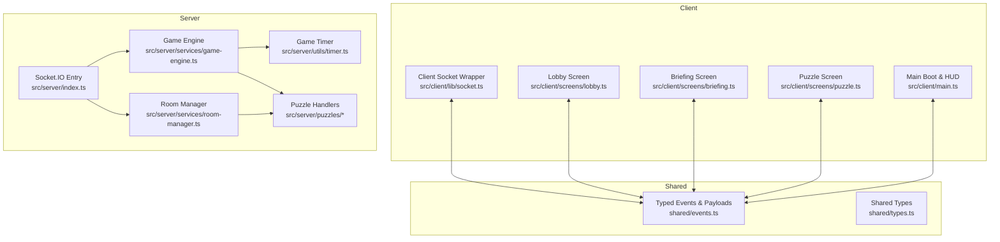
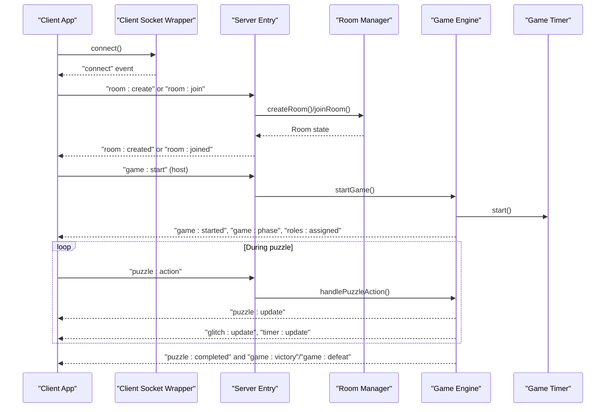
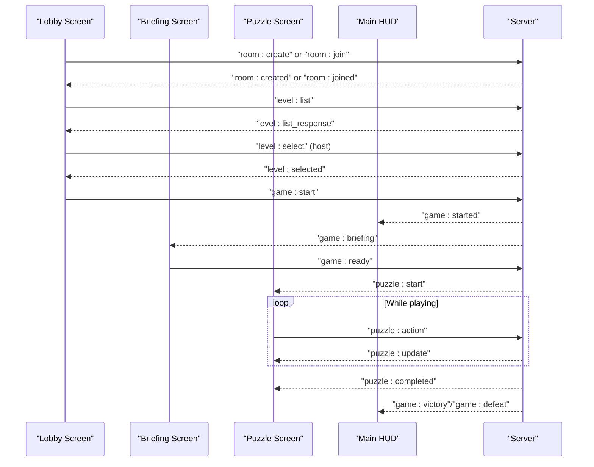
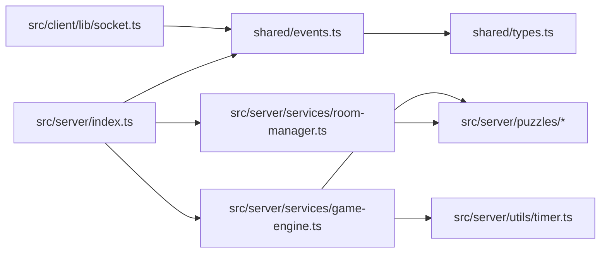

# API Reference

<cite>
**Referenced Files in This Document**
- [events.ts](file://shared/events.ts)
- [types.ts](file://shared/types.ts)
- [socket.ts](file://src/client/lib/socket.ts)
- [index.ts](file://src/server/index.ts)
- [room-manager.ts](file://src/server/services/room-manager.ts)
- [game-engine.ts](file://src/server/services/game-engine.ts)
- [timer.ts](file://src/server/utils/timer.ts)
- [puzzle-handler.ts](file://src/server/puzzles/puzzle-handler.ts)
- [cipher-decode.ts](file://src/server/puzzles/cipher-decode.ts)
- [lobby.ts](file://src/client/screens/lobby.ts)
- [briefing.ts](file://src/client/screens/briefing.ts)
- [puzzle.ts](file://src/client/screens/puzzle.ts)
- [main.ts](file://src/client/main.ts)
- [README.md](file://README.md)
</cite>

## Table of Contents
1. [Introduction](#introduction)
2. [Project Structure](#project-structure)
3. [Core Components](#core-components)
4. [Architecture Overview](#architecture-overview)
5. [Detailed Component Analysis](#detailed-component-analysis)
6. [Dependency Analysis](#dependency-analysis)
7. [Performance Considerations](#performance-considerations)
8. [Troubleshooting Guide](#troubleshooting-guide)
9. [Conclusion](#conclusion)
10. [Appendices](#appendices)

## Introduction
This document provides a comprehensive API reference for the Socket.IO event system and WebSocket communication protocols used by Project ODYSSEY. It documents all client-to-server and server-to-client events, their payload schemas, and usage patterns. It also explains the typed event contracts, real-time state synchronization, authentication and authorization for room access, error handling, connection management, reconnection strategies, rate limiting considerations, security, and performance optimization.

## Project Structure
The event system is centralized in shared contracts and implemented across the client and server. The client wraps Socket.IO with a typed wrapper and wires UI screens to server events. The server orchestrates rooms, game phases, and puzzle logic, broadcasting state updates to clients.

**Diagram sources**
- [socket.ts](file://src/client/lib/socket.ts#L1-L85)
- [events.ts](file://shared/events.ts#L1-L228)
- [types.ts](file://shared/types.ts#L1-L187)
- [index.ts](file://src/server/index.ts#L1-L321)
- [room-manager.ts](file://src/server/services/room-manager.ts#L1-L262)
- [game-engine.ts](file://src/server/services/game-engine.ts#L1-L711)
- [timer.ts](file://src/server/utils/timer.ts#L1-L81)
- [puzzle-handler.ts](file://src/server/puzzles/puzzle-handler.ts#L1-L57)

**Section sources**
- [README.md](file://README.md#L1-L132)

## Core Components
- Typed Event Contracts: Centralized event names and payload interfaces in shared/events.ts.
- Client Socket Wrapper: Provides typed emit/on/off and connection lifecycle management.
- Server Entry Point: Registers Socket.IO handlers, Redis adapter, and routes events to services.
- Room Management: In-memory rooms with Redis persistence and reconnection logic.
- Game Engine: Orchestrates phases, timers, roles, puzzle actions, and outcomes.
- Puzzle Handlers: Implementations for each puzzle type with asymmetric views and win conditions.

**Section sources**
- [events.ts](file://shared/events.ts#L1-L228)
- [socket.ts](file://src/client/lib/socket.ts#L1-L85)
- [index.ts](file://src/server/index.ts#L1-L321)
- [room-manager.ts](file://src/server/services/room-manager.ts#L1-L262)
- [game-engine.ts](file://src/server/services/game-engine.ts#L1-L711)
- [puzzle-handler.ts](file://src/server/puzzles/puzzle-handler.ts#L1-L57)

## Architecture Overview
The system uses a server-authoritative model. Clients connect via Socket.IO, join rooms, and receive real-time updates. The server maintains room state, game phases, timers, and puzzle logic, broadcasting updates to all clients in the room.

**Diagram sources**
- [index.ts](file://src/server/index.ts#L86-L305)
- [room-manager.ts](file://src/server/services/room-manager.ts#L60-L154)
- [game-engine.ts](file://src/server/services/game-engine.ts#L57-L139)
- [timer.ts](file://src/server/utils/timer.ts#L30-L45)

## Detailed Component Analysis

### Typed Event Contracts
All event names and payloads are defined in shared/events.ts. This ensures no magic strings and enables compile-time safety for both client and server.

- ClientEvents (client→server):
  - room:create, room:join, room:leave, game:start
  - puzzle:action, puzzle:hint, game:ready, game:intro_complete
  - debug:toggle, debug:jump
  - level:list, level:select
  - leaderboard:list

- ServerEvents (server→client):
  - room:created, room:joined, room:left, room:players, room:error
  - game:started, game:phase, game:briefing, puzzle:start, puzzle:update, puzzle:completed, puzzle:transition, game:ready_update
  - roles:assigned, glitch:update, timer:update, player:view
  - game:victory, game:defeat
  - debug:update
  - level:list_response, level:selected
  - leaderboard:list_response

Payload interfaces include strongly-typed shapes for all events, enabling robust client implementations.

**Section sources**
- [events.ts](file://shared/events.ts#L28-L90)
- [events.ts](file://shared/events.ts#L94-L227)

### Client Socket Wrapper
The client provides a typed wrapper around Socket.IO:
- connect(): Initializes connection with reconnection policy and logs lifecycle events.
- emit(event, data?): Emits typed events safely with error logging.
- on(event, handler): Registers typed listeners with error logging.
- off(event, handler?): Unregisters listeners.
- getPlayerId(): Returns the socket id for identity.

Connection management includes automatic reconnection and error logging.

**Section sources**
- [socket.ts](file://src/client/lib/socket.ts#L11-L81)

### Server Entry Point and Room Management
The server registers Socket.IO handlers and integrates Redis for multi-instance scaling. Room management handles creation, joining, leaving, and level selection with persistence to Redis.

Key behaviors:
- Room creation and joining with name uniqueness and reconnection logic.
- Host-only controls for starting games and selecting levels.
- Broadcasting player lists and room errors.

**Section sources**
- [index.ts](file://src/server/index.ts#L86-L305)
- [room-manager.ts](file://src/server/services/room-manager.ts#L60-L154)
- [room-manager.ts](file://src/server/services/room-manager.ts#L191-L204)

### Game Engine and Real-Time State Synchronization
The game engine orchestrates the lifecycle:
- startGame(): Validates level and player counts, initializes state, starts the global timer, and broadcasts game context.
- handleLevelIntroComplete(): Coordinates readiness across players before advancing to briefing.
- handlePlayerReady(): Manages per-puzzle readiness and transitions to puzzle start.
- handlePuzzleAction(): Processes player actions, applies glitch penalties, updates asymmetric views, and checks win conditions.
- handlePuzzleComplete(): Advances to next puzzle or triggers victory/defeat.
- addGlitch(): Updates glitch state and broadcasts updates.
- handleVictory()/handleDefeat(): Finalizes scoring and cleans up timers.

The engine persists room state to Redis and resumes timers on startup.

**Section sources**
- [game-engine.ts](file://src/server/services/game-engine.ts#L57-L139)
- [game-engine.ts](file://src/server/services/game-engine.ts#L144-L202)
- [game-engine.ts](file://src/server/services/game-engine.ts#L207-L236)
- [game-engine.ts](file://src/server/services/game-engine.ts#L324-L383)
- [game-engine.ts](file://src/server/services/game-engine.ts#L388-L450)
- [game-engine.ts](file://src/server/services/game-engine.ts#L488-L550)
- [game-engine.ts](file://src/server/services/game-engine.ts#L570-L596)
- [game-engine.ts](file://src/server/services/game-engine.ts#L601-L665)

### Puzzle Handlers and Asymmetric Views
Puzzle handlers implement a common interface:
- init(): Initialize puzzle state from config and players.
- handleAction(): Process player actions, returning updated state and glitch deltas.
- checkWin(): Determine win condition.
- getPlayerView(): Return role-specific view data.

Example: Cipher Decode demonstrates asymmetric roles and sentence progression.

**Section sources**
- [puzzle-handler.ts](file://src/server/puzzles/puzzle-handler.ts#L12-L44)
- [cipher-decode.ts](file://src/server/puzzles/cipher-decode.ts#L18-L142)

### Client Screens and Event Flow
Client screens subscribe to server events and emit client actions:
- Lobby: Creates/joins rooms, selects levels, requests leaderboards, and starts games (host).
- Briefing: Displays mission text with typewriter effect and readiness flow.
- Puzzle: Renders and updates puzzle UI based on puzzle:start and puzzle:update events.
- Main: Updates HUD (timer, glitch), plays music, and handles transitions.

**Diagram sources**
- [lobby.ts](file://src/client/screens/lobby.ts#L342-L434)
- [briefing.ts](file://src/client/screens/briefing.ts#L16-L28)
- [puzzle.ts](file://src/client/screens/puzzle.ts#L23-L34)
- [main.ts](file://src/client/main.ts#L93-L206)
- [index.ts](file://src/server/index.ts#L112-L273)

**Section sources**
- [lobby.ts](file://src/client/screens/lobby.ts#L342-L434)
- [briefing.ts](file://src/client/screens/briefing.ts#L16-L28)
- [puzzle.ts](file://src/client/screens/puzzle.ts#L23-L34)
- [main.ts](file://src/client/main.ts#L93-L206)

### Authentication and Authorization
- Room Access: Players join via a 4-character room code. The server enforces:
  - Name uniqueness within a room.
  - Max 6 players per room.
  - Host-only actions (start game, select level).
- Reconnection: Disconnected players can reclaim their seat if the name is available and the original socket is inactive.
- Leaderboard Access: Requested via a client event and served with persisted entries.

**Section sources**
- [room-manager.ts](file://src/server/services/room-manager.ts#L111-L131)
- [room-manager.ts](file://src/server/services/room-manager.ts#L133-L154)
- [index.ts](file://src/server/index.ts#L158-L171)
- [index.ts](file://src/server/index.ts#L185-L204)
- [index.ts](file://src/server/index.ts#L275-L295)

### Error Handling and Connection Management
- Server-side error handling: All event handlers wrap logic in try/catch and log errors. Room errors are emitted to the client.
- Client-side error handling: Socket wrapper logs emit/on registration failures and throws if connect() is not called before use.
- Reconnection: Client automatically reconnects with exponential backoff. On reconnect, the lobby attempts to re-join the last room if session data is present.

**Section sources**
- [index.ts](file://src/server/index.ts#L106-L110)
- [index.ts](file://src/server/index.ts#L142-L146)
- [socket.ts](file://src/client/lib/socket.ts#L51-L73)
- [lobby.ts](file://src/client/screens/lobby.ts#L354-L372)

### Rate Limiting, Security, and Performance
- Rate Limiting: Not implemented in the current codebase. Consider adding per-socket rate limits for puzzle actions and chat-like messages.
- Security: 
  - Room access is controlled by room code and host permissions.
  - No explicit JWT or session tokens are used; identity is socket id plus room membership.
  - CORS is configured to allow the client origin.
- Performance:
  - Redis adapter enables multi-instance scaling.
  - Asymmetric views minimize payload sizes by sending only role-relevant data.
  - Timers are server-authoritative to prevent client manipulation.

**Section sources**
- [index.ts](file://src/server/index.ts#L54-L59)
- [game-engine.ts](file://src/server/services/game-engine.ts#L324-L383)

## Dependency Analysis
The following diagram shows key dependencies among components:

**Diagram sources**
- [events.ts](file://shared/events.ts#L1-L228)
- [types.ts](file://shared/types.ts#L1-L187)
- [socket.ts](file://src/client/lib/socket.ts#L1-L85)
- [index.ts](file://src/server/index.ts#L1-L321)
- [room-manager.ts](file://src/server/services/room-manager.ts#L1-L262)
- [game-engine.ts](file://src/server/services/game-engine.ts#L1-L711)
- [timer.ts](file://src/server/utils/timer.ts#L1-L81)
- [puzzle-handler.ts](file://src/server/puzzles/puzzle-handler.ts#L1-L57)

**Section sources**
- [index.ts](file://src/server/index.ts#L14-L44)
- [game-engine.ts](file://src/server/services/game-engine.ts#L14-L46)

## Performance Considerations
- Minimize payload sizes: Use asymmetric views to send only relevant data per role.
- Efficient broadcasting: Use room channels to avoid unnecessary fan-out.
- Server-authoritative timers: Prevent client-side manipulation and reduce reconciliation overhead.
- Redis adapter: Enables horizontal scaling across instances.
- Lazy initialization: Initialize puzzle handlers and audio only when needed.

[No sources needed since this section provides general guidance]

## Troubleshooting Guide
Common issues and resolutions:
- Socket not initialized: Ensure connect() is called before emitting or registering listeners.
- Room errors: Check server logs for validation failures (e.g., room full, invalid level).
- Reconnection loops: Verify client session storage and server CORS configuration.
- Puzzle not updating: Confirm the room is in the playing phase and the action is valid for the current puzzle type.
- Timer desync: Expect server-authoritative timers; do not rely on client-side timing.

**Section sources**
- [socket.ts](file://src/client/lib/socket.ts#L43-L49)
- [index.ts](file://src/server/index.ts#L106-L110)
- [index.ts](file://src/server/index.ts#L142-L146)
- [game-engine.ts](file://src/server/services/game-engine.ts#L324-L383)

## Conclusion
Project ODYSSEY’s event system provides a robust, typed, and scalable foundation for real-time co-op escape rooms. The server-authoritative design, asymmetric puzzle views, and Redis-backed state synchronization enable smooth multiplayer experiences. Extending the system involves adding new puzzle handlers, updating shared contracts, and wiring client screens to new events.

[No sources needed since this section summarizes without analyzing specific files]

## Appendices

### Event Catalog and Payloads
Below is a categorized reference of all events and payloads.

- ClientEvents (client→server)
  - room:create: { playerName: string }
  - room:join: { roomCode: string; playerName: string }
  - room:leave: (no payload)
  - game:start: { levelId: string; startingPuzzleIndex?: number }
  - puzzle:action: { puzzleId: string; action: string; data: Record<string, unknown> }
  - puzzle:hint: (placeholder for future use)
  - game:ready: (no payload)
  - game:intro_complete: (no payload)
  - debug:toggle: (no payload)
  - debug:jump: { puzzleIndex: number }
  - level:list: (no payload)
  - level:select: { levelId: string }
  - leaderboard:list: (no payload)

- ServerEvents (server→client)
  - room:created: { roomCode: string; player: Player; gameState: GameState }
  - room:joined: { roomCode: string; player: Player; players: Player[]; gameState: GameState }
  - room:left: (no payload)
  - room:players: { players: Player[] }
  - room:error: { message: string }
  - game:started: { levelId: string; levelTitle: string; levelStory: string; levelIntroAudio?: string; backgroundMusic?: string; themeCss: string[]; glitch: GlitchState; totalPuzzles: number; timerSeconds: number; isJumpStart?: boolean }
  - game:phase: { phase: GameState["phase"]; puzzleIndex: number }
  - game:briefing: { puzzleTitle: string; briefingText: string; puzzleIndex: number; totalPuzzles: number; totalRoomPlayers: number }
  - puzzle:start: { puzzleId: string; puzzleType: string; puzzleTitle: string; roles: RoleAssignment[]; playerView: PlayerView; backgroundMusic?: string; glitch: GlitchState }
  - puzzle:update: { puzzleId: string; playerView: PlayerView }
  - puzzle:completed: { puzzleId: string; puzzleIndex: number; totalPuzzles: number }
  - puzzle:transition: (no payload)
  - game:ready_update: { readyCount: number; totalPlayers: number }
  - roles:assigned: { roles: RoleAssignment[] }
  - glitch:update: { glitch: GlitchState }
  - timer:update: { timer: TimerState }
  - player:view: (no payload)
  - game:victory: { elapsedSeconds: number; glitchFinal: number; puzzlesCompleted: number; score: number }
  - game:defeat: { reason: "timer" | "glitch"; puzzlesCompleted: number; puzzleReachedIndex: number }
  - debug:update: { enabled: boolean; allViews: PlayerView[] }
  - level:list_response: { levels: LevelSummary[] }
  - level:selected: { levelId: string }
  - leaderboard:list_response: { entries: LeaderboardEntry[] }

**Section sources**
- [events.ts](file://shared/events.ts#L28-L90)
- [events.ts](file://shared/events.ts#L94-L227)

### Practical Usage Patterns
- Creating a Room:
  - Client emits room:create with playerName.
  - Server responds with room:created and room:players.
- Joining a Room:
  - Client emits room:join with roomCode and playerName.
  - Server responds with room:joined and room:players.
- Starting a Game:
  - Host emits game:start with levelId and optional startingPuzzleIndex.
  - Server broadcasts game:started and game:phase.
- Playing a Puzzle:
  - Client emits puzzle:action with action and data.
  - Server broadcasts puzzle:update and glitch/timer updates.
- Ending the Game:
  - Server broadcasts game:victory or game:defeat with final stats.

**Section sources**
- [index.ts](file://src/server/index.ts#L89-L171)
- [game-engine.ts](file://src/server/services/game-engine.ts#L57-L139)
- [game-engine.ts](file://src/server/services/game-engine.ts#L324-L383)

### Debugging Techniques
- Enable debug mode: Emit debug:toggle to receive debug:update with all role views.
- Jump to puzzle: Emit debug:jump with puzzleIndex to fast-forward to a specific puzzle.
- Monitor logs: Use server logs for error traces and client logs for emit/on failures.

**Section sources**
- [index.ts](file://src/server/index.ts#L245-L273)
- [game-engine.ts](file://src/server/services/game-engine.ts#L241-L258)
- [main.ts](file://src/client/main.ts#L249-L256)