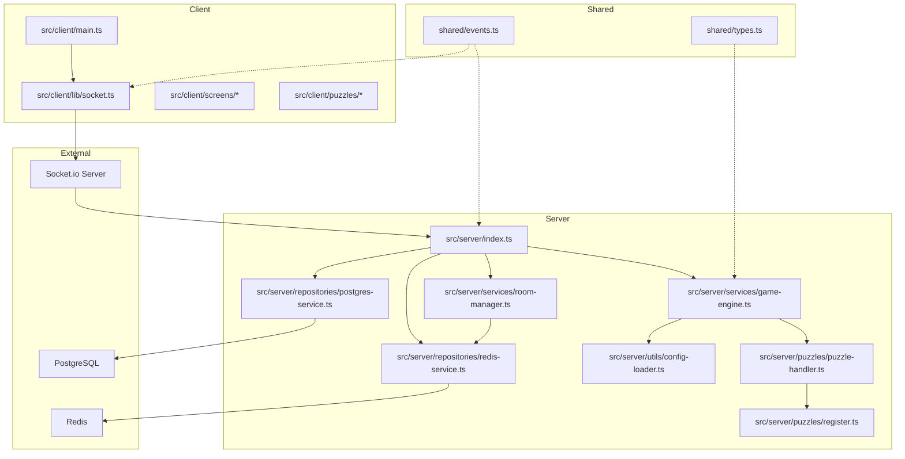
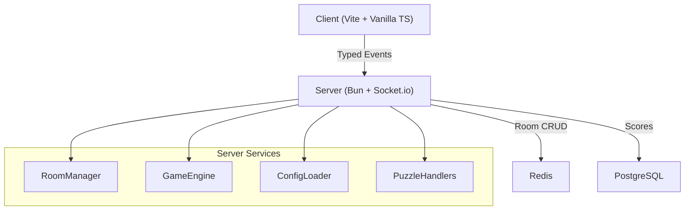
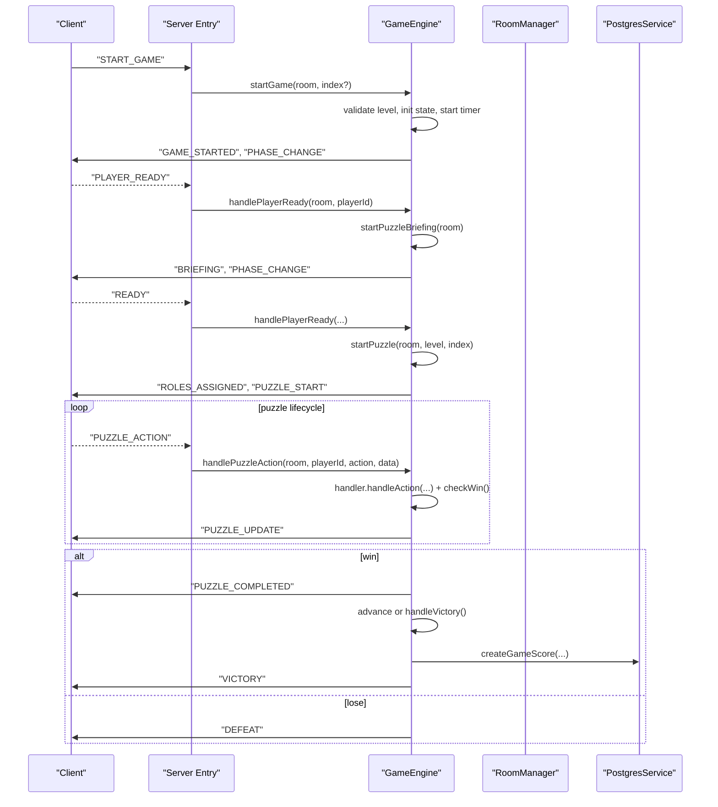
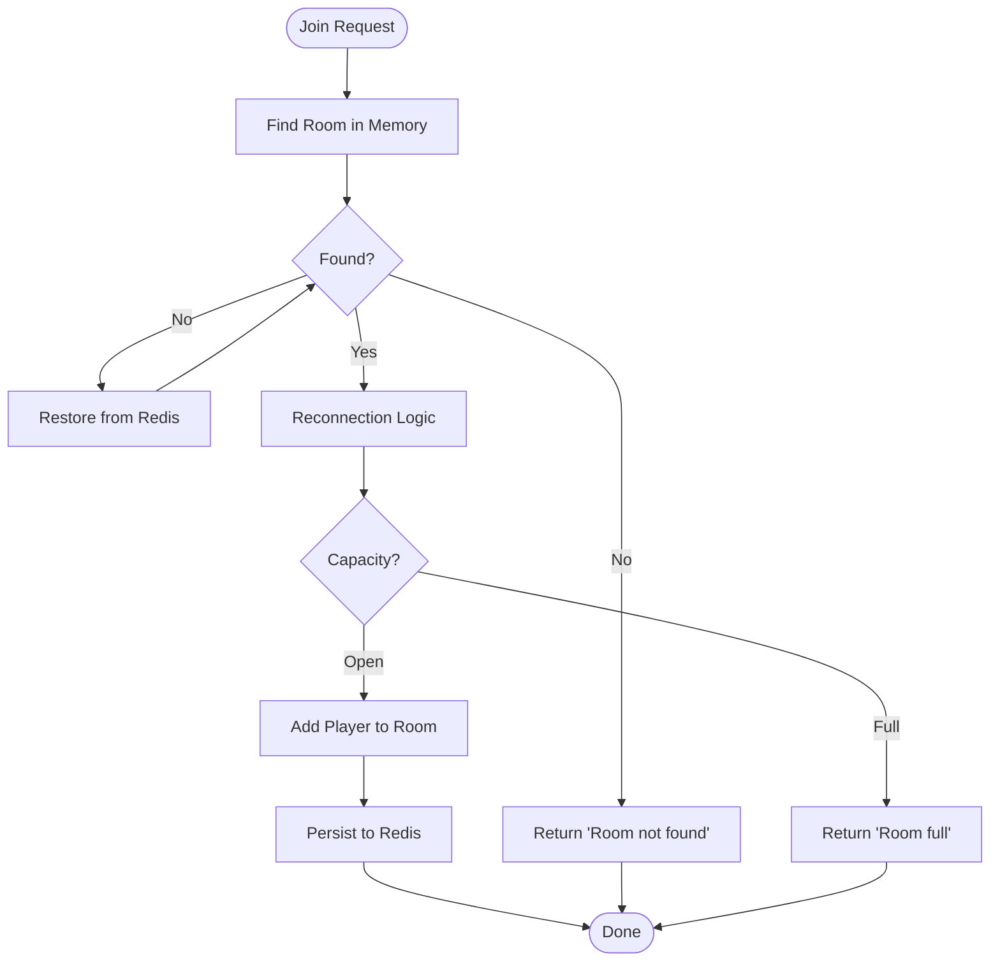
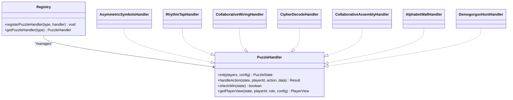
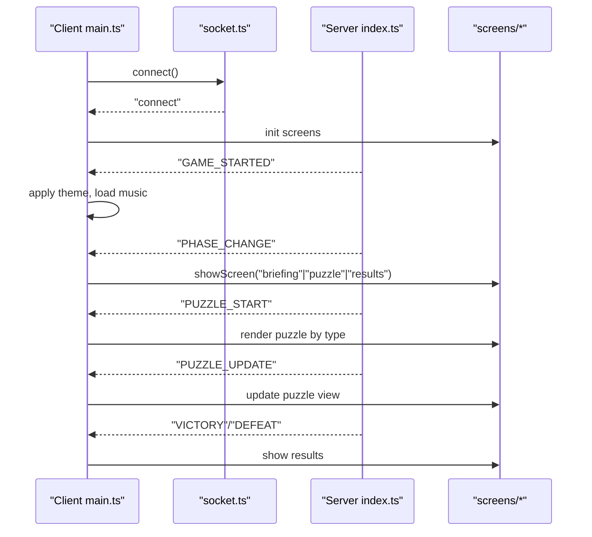
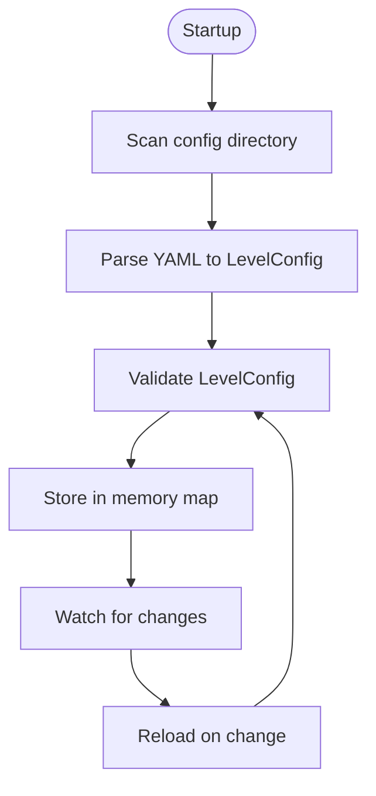
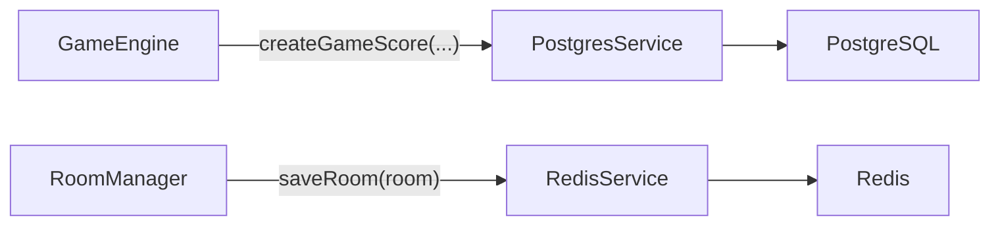
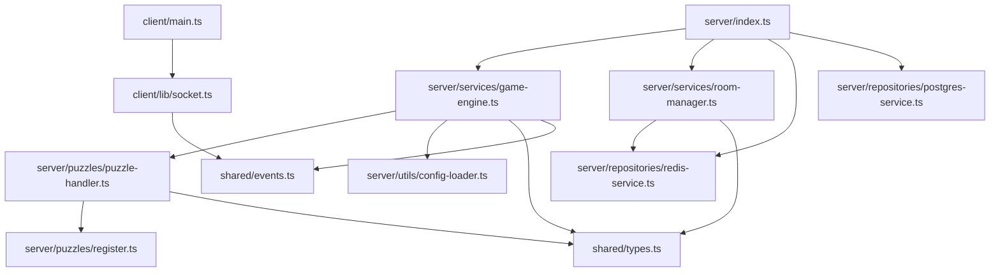

# Architecture Overview

<cite>
**Referenced Files in This Document**
- [ARCHITECTURE.md](file://ARCHITECTURE.md)
- [README.md](file://README.md)
- [events.ts](file://shared/events.ts)
- [types.ts](file://shared/types.ts)
- [index.ts](file://src/server/index.ts)
- [game-engine.ts](file://src/server/services/game-engine.ts)
- [room-manager.ts](file://src/server/services/room-manager.ts)
- [puzzle-handler.ts](file://src/server/puzzles/puzzle-handler.ts)
- [register.ts](file://src/server/puzzles/register.ts)
- [config-loader.ts](file://src/server/utils/config-loader.ts)
- [socket.ts](file://src/client/lib/socket.ts)
- [main.ts](file://src/client/main.ts)
- [puzzle.ts](file://src/client/screens/puzzle.ts)
- [postgres-service.ts](file://src/server/repositories/postgres-service.ts)
- [redis-service.ts](file://src/server/repositories/redis-service.ts)
</cite>

## Table of Contents
1. [Introduction](#introduction)
2. [Project Structure](#project-structure)
3. [Core Components](#core-components)
4. [Architecture Overview](#architecture-overview)
5. [Detailed Component Analysis](#detailed-component-analysis)
6. [Dependency Analysis](#dependency-analysis)
7. [Performance Considerations](#performance-considerations)
8. [Troubleshooting Guide](#troubleshooting-guide)
9. [Conclusion](#conclusion)

## Introduction
This document presents the architecture of Project ODYSSEY, a co-op escape room engine built with a clean architecture approach. The system separates concerns across three layers:
- Client: Vanilla TypeScript/Vite front-end with real-time UI updates via Socket.io.
- Server: Bun-based Socket.io server orchestrating game state, rooms, and puzzle logic.
- Data: Redis for room/session persistence and PostgreSQL via Prisma for scores.

It is event-driven, config-first, and data-driven. The design emphasizes modularity, pluggable puzzle handlers, typed event systems, and scalable service architecture.

## Project Structure
The repository is organized into:
- shared/: Shared contracts (types, events, logger) consumed by both client and server.
- src/server/: Bun server with services (game engine, room manager), puzzle handlers, repositories, and utilities.
- src/client/: Vite-served client with screens, puzzle renderers, routing, and Socket.io wrapper.
- config/: YAML-based level definitions.
- prisma/: Prisma schema and configuration for PostgreSQL.

**Diagram sources**
- [index.ts](file://src/server/index.ts#L1-L321)
- [game-engine.ts](file://src/server/services/game-engine.ts#L1-L711)
- [room-manager.ts](file://src/server/services/room-manager.ts#L1-L262)
- [puzzle-handler.ts](file://src/server/puzzles/puzzle-handler.ts#L1-L57)
- [register.ts](file://src/server/puzzles/register.ts#L1-L21)
- [config-loader.ts](file://src/server/utils/config-loader.ts#L1-L135)
- [socket.ts](file://src/client/lib/socket.ts#L1-L85)
- [main.ts](file://src/client/main.ts#L1-L266)
- [events.ts](file://shared/events.ts#L1-L228)
- [types.ts](file://shared/types.ts#L1-L187)

**Section sources**
- [ARCHITECTURE.md](file://ARCHITECTURE.md#L35-L107)
- [README.md](file://README.md#L79-L98)

## Core Components
- Shared Contracts
  - Types: Player, Room, GameState, PuzzleConfig, PlayerView, enums for phases and statuses.
  - Events: Strongly typed ClientEvents and ServerEvents with payload interfaces.
- Server Entry and Real-Time Orchestration
  - Socket.io server wiring, Redis adapter for multi-instance support, and event handlers for lobby, gameplay, and admin events.
- Game Engine
  - State machine managing phases (lobby → level_intro → briefing → playing → puzzle_transition → victory/defeat), timers, glitch, and puzzle lifecycle.
- Room Manager
  - In-memory room store with Redis persistence; handles creation, joining, leaving, and reconnection logic.
- Puzzle Handlers
  - Pluggable interface with registration; each handler implements initialization, action handling, win checking, and role-specific views.
- Configuration System
  - YAML-based levels loaded at startup and watched for hot-reload; validated at runtime.
- Repositories
  - RedisService persists rooms and scores; PostgresService stores scores via Prisma.
- Client
  - Socket wrapper, typed event handlers, screen router, and puzzle renderers.

**Section sources**
- [events.ts](file://shared/events.ts#L28-L90)
- [types.ts](file://shared/types.ts#L7-L187)
- [index.ts](file://src/server/index.ts#L14-L321)
- [game-engine.ts](file://src/server/services/game-engine.ts#L57-L139)
- [room-manager.ts](file://src/server/services/room-manager.ts#L60-L154)
- [puzzle-handler.ts](file://src/server/puzzles/puzzle-handler.ts#L12-L56)
- [register.ts](file://src/server/puzzles/register.ts#L14-L20)
- [config-loader.ts](file://src/server/utils/config-loader.ts#L25-L95)
- [redis-service.ts](file://src/server/repositories/redis-service.ts#L39-L67)
- [postgres-service.ts](file://src/server/repositories/postgres-service.ts#L24-L67)
- [socket.ts](file://src/client/lib/socket.ts#L11-L85)
- [main.ts](file://src/client/main.ts#L47-L266)

## Architecture Overview
Project ODYSSEY follows clean architecture with clear boundaries:
- Client Layer: UI screens, routing, and Socket.io client wrapper.
- Server Layer: Services (GameEngine, RoomManager), repositories, and utilities.
- Data Layer: Redis and PostgreSQL via Prisma.
- Shared Layer: Types and events.

Event-driven communication uses Socket.io with typed events. The system is config-first and data-driven, enabling new levels and puzzles without changing core engine code.

**Diagram sources**
- [index.ts](file://src/server/index.ts#L86-L305)
- [room-manager.ts](file://src/server/services/room-manager.ts#L14-L262)
- [game-engine.ts](file://src/server/services/game-engine.ts#L14-L711)
- [config-loader.ts](file://src/server/utils/config-loader.ts#L25-L135)
- [redis-service.ts](file://src/server/repositories/redis-service.ts#L39-L67)
- [postgres-service.ts](file://src/server/repositories/postgres-service.ts#L24-L67)

## Detailed Component Analysis

### Game Engine
The Game Engine is the core state machine orchestrating the game lifecycle per room. It:
- Initializes and validates levels, timers, and glitch state.
- Manages phases and transitions (briefing, playing, puzzle_transition).
- Coordinates role assignment and per-player views.
- Applies glitch penalties and checks for defeat conditions.
- Calculates and records scores upon victory.

**Diagram sources**
- [index.ts](file://src/server/index.ts#L154-L243)
- [game-engine.ts](file://src/server/services/game-engine.ts#L57-L521)
- [room-manager.ts](file://src/server/services/room-manager.ts#L60-L154)
- [postgres-service.ts](file://src/server/repositories/postgres-service.ts#L28-L39)

**Section sources**
- [game-engine.ts](file://src/server/services/game-engine.ts#L57-L139)
- [game-engine.ts](file://src/server/services/game-engine.ts#L263-L319)
- [game-engine.ts](file://src/server/services/game-engine.ts#L324-L383)
- [game-engine.ts](file://src/server/services/game-engine.ts#L388-L424)
- [game-engine.ts](file://src/server/services/game-engine.ts#L488-L521)
- [game-engine.ts](file://src/server/services/game-engine.ts#L526-L550)
- [game-engine.ts](file://src/server/services/game-engine.ts#L567-L596)
- [game-engine.ts](file://src/server/services/game-engine.ts#L601-L665)
- [game-engine.ts](file://src/server/services/game-engine.ts#L678-L710)

### Room Manager
Room Manager maintains in-memory rooms and persists them to Redis. It:
- Generates room codes and enforces capacity limits.
- Handles joins, leaves, reconnections, and host reassignment.
- Persists all mutations to Redis for durability and multi-instance support.

**Diagram sources**
- [room-manager.ts](file://src/server/services/room-manager.ts#L89-L154)
- [room-manager.ts](file://src/server/services/room-manager.ts#L239-L261)

**Section sources**
- [room-manager.ts](file://src/server/services/room-manager.ts#L60-L87)
- [room-manager.ts](file://src/server/services/room-manager.ts#L89-L154)
- [room-manager.ts](file://src/server/services/room-manager.ts#L156-L189)
- [room-manager.ts](file://src/server/services/room-manager.ts#L191-L204)
- [room-manager.ts](file://src/server/services/room-manager.ts#L239-L261)

### Puzzle Handlers and Registry
Puzzle Handlers implement a common interface and are registered centrally. The engine retrieves the appropriate handler by puzzle type and delegates:
- Initialization of puzzle state.
- Action handling and glitch deltas.
- Win condition checks.
- Per-player role-specific views.

**Diagram sources**
- [puzzle-handler.ts](file://src/server/puzzles/puzzle-handler.ts#L12-L56)
- [register.ts](file://src/server/puzzles/register.ts#L14-L20)

**Section sources**
- [puzzle-handler.ts](file://src/server/puzzles/puzzle-handler.ts#L12-L56)
- [register.ts](file://src/server/puzzles/register.ts#L14-L20)

### Client Screens and Real-Time Updates
The client connects via Socket.io and reacts to server events to drive UI:
- Bootstraps audio, screens, and HUD.
- Subscribes to timer, glitch, phase, puzzle start/update, and results events.
- Navigates between screens (lobby, level-intro, briefing, puzzle, results).
- Dispatches actions to the server and renders puzzle-specific UI.

**Diagram sources**
- [main.ts](file://src/client/main.ts#L47-L266)
- [socket.ts](file://src/client/lib/socket.ts#L11-L85)
- [index.ts](file://src/server/index.ts#L86-L305)
- [puzzle.ts](file://src/client/screens/puzzle.ts#L23-L101)

**Section sources**
- [main.ts](file://src/client/main.ts#L47-L266)
- [socket.ts](file://src/client/lib/socket.ts#L11-L85)
- [puzzle.ts](file://src/client/screens/puzzle.ts#L23-L101)

### Configuration System (Config-First and Data-Driven)
Levels are defined in YAML and loaded at startup with hot-reload:
- Loads all .yaml/.yml files, parses into LevelConfig, validates, and exposes summaries.
- Provides default level retrieval and level selection per room.
- Enables dynamic addition of levels and puzzles without code changes.

**Diagram sources**
- [config-loader.ts](file://src/server/utils/config-loader.ts#L25-L95)
- [config-loader.ts](file://src/server/utils/config-loader.ts#L100-L134)

**Section sources**
- [config-loader.ts](file://src/server/utils/config-loader.ts#L25-L95)
- [config-loader.ts](file://src/server/utils/config-loader.ts#L100-L134)

### Data Persistence
- Redis: Room serialization/deserialization and short-lived caching; used for room CRUD and crash recovery.
- PostgreSQL: Scores persisted via Prisma; supports top-N leaderboards.

**Diagram sources**
- [game-engine.ts](file://src/server/services/game-engine.ts#L458-L483)
- [postgres-service.ts](file://src/server/repositories/postgres-service.ts#L28-L39)
- [room-manager.ts](file://src/server/services/room-manager.ts#L239-L245)
- [redis-service.ts](file://src/server/repositories/redis-service.ts#L40-L44)

**Section sources**
- [redis-service.ts](file://src/server/repositories/redis-service.ts#L39-L67)
- [postgres-service.ts](file://src/server/repositories/postgres-service.ts#L24-L67)

## Dependency Analysis
- Clean Architecture Layers
  - Client depends on shared events and types; it emits client events and reacts to server events.
  - Server depends on shared types and events; it orchestrates services and repositories.
  - Repositories depend on external databases; services encapsulate domain logic.
- Coupling and Cohesion
  - Puzzle handlers are loosely coupled via the shared interface and registry.
  - GameEngine and RoomManager are cohesive around game lifecycle and room management respectively.
- External Dependencies
  - Socket.io for real-time bidirectional events.
  - Redis for distributed room state and multi-instance scaling.
  - PostgreSQL via Prisma for durable scoring.

**Diagram sources**
- [types.ts](file://shared/types.ts#L1-L187)
- [events.ts](file://shared/events.ts#L1-L228)
- [main.ts](file://src/client/main.ts#L14-L44)
- [socket.ts](file://src/client/lib/socket.ts#L5-L85)
- [index.ts](file://src/server/index.ts#L14-L45)
- [game-engine.ts](file://src/server/services/game-engine.ts#L14-L46)
- [room-manager.ts](file://src/server/services/room-manager.ts#L14-L16)
- [puzzle-handler.ts](file://src/server/puzzles/puzzle-handler.ts#L5-L6)
- [register.ts](file://src/server/puzzles/register.ts#L5-L12)
- [config-loader.ts](file://src/server/utils/config-loader.ts#L9-L10)
- [redis-service.ts](file://src/server/repositories/redis-service.ts#L4-L7)
- [postgres-service.ts](file://src/server/repositories/postgres-service.ts#L1-L3)

**Section sources**
- [index.ts](file://src/server/index.ts#L14-L45)
- [game-engine.ts](file://src/server/services/game-engine.ts#L14-L46)
- [room-manager.ts](file://src/server/services/room-manager.ts#L14-L16)
- [puzzle-handler.ts](file://src/server/puzzles/puzzle-handler.ts#L5-L6)
- [config-loader.ts](file://src/server/utils/config-loader.ts#L9-L10)
- [redis-service.ts](file://src/server/repositories/redis-service.ts#L4-L7)
- [postgres-service.ts](file://src/server/repositories/postgres-service.ts#L1-L3)

## Performance Considerations
- Real-time responsiveness: Socket.io minimizes latency for synchronized state updates.
- Hot-reload for levels: Chokidar watches config directory to avoid restarts during development.
- Redis TTL: Rooms expire after inactivity to free memory; adjust TTL for production needs.
- Timer efficiency: GameEngine maintains per-room timers and stops them on game end to prevent leaks.
- Scalability: Redis adapter enables horizontal scaling across instances.

[No sources needed since this section provides general guidance]

## Troubleshooting Guide
- Socket connection errors
  - Verify CORS configuration and client port alignment.
  - Check connection logs and reconnection attempts.
- Room persistence failures
  - Confirm Redis connectivity and availability; review save/load logs.
- Score recording issues
  - Validate DATABASE_URL and Prisma client initialization.
- Level loading problems
  - Inspect YAML parsing and validation logs; ensure required fields exist.

**Section sources**
- [index.ts](file://src/server/index.ts#L54-L61)
- [socket.ts](file://src/client/lib/socket.ts#L24-L34)
- [redis-service.ts](file://src/server/repositories/redis-service.ts#L9-L15)
- [postgres-service.ts](file://src/server/repositories/postgres-service.ts#L14-L22)
- [config-loader.ts](file://src/server/utils/config-loader.ts#L46-L64)

## Conclusion
Project ODYSSEY’s architecture cleanly separates client, server, and data concerns while embracing event-driven, config-first, and data-driven design. The typed event system, pluggable puzzle handlers, and modular services enable rapid iteration and scalability. The combination of Redis and PostgreSQL ensures both real-time collaboration and durable scoring, while the Socket.io-based real-time layer delivers responsive, synchronized gameplay.