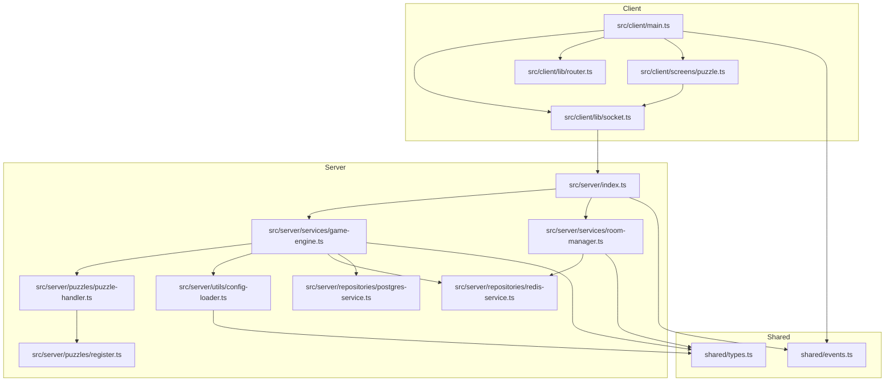
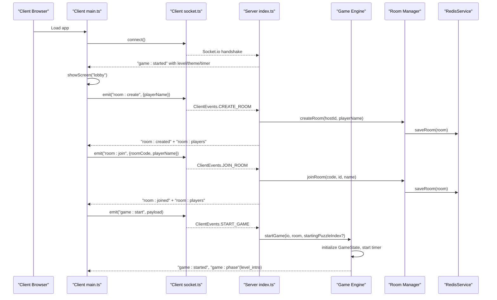
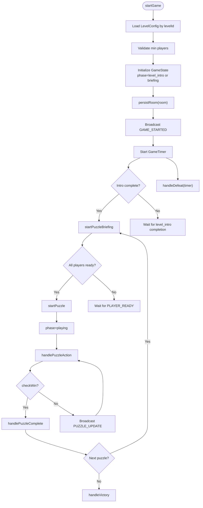
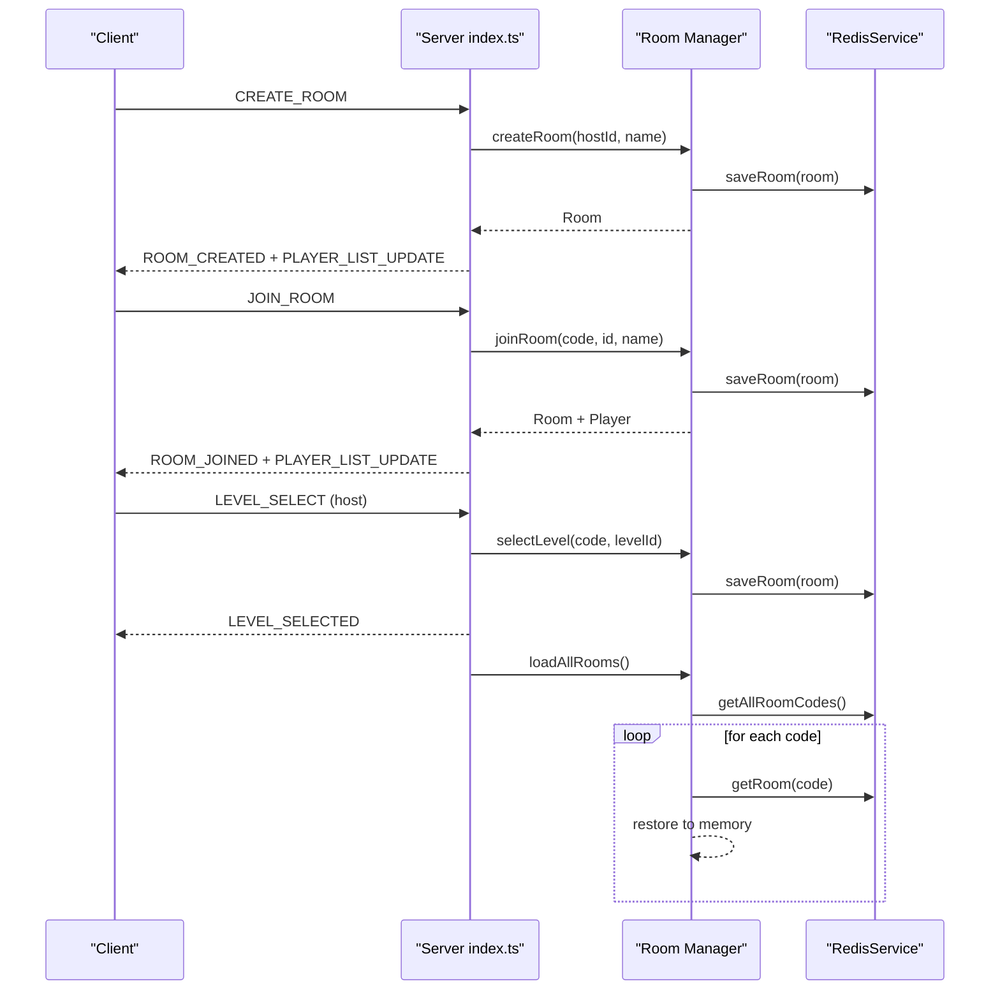
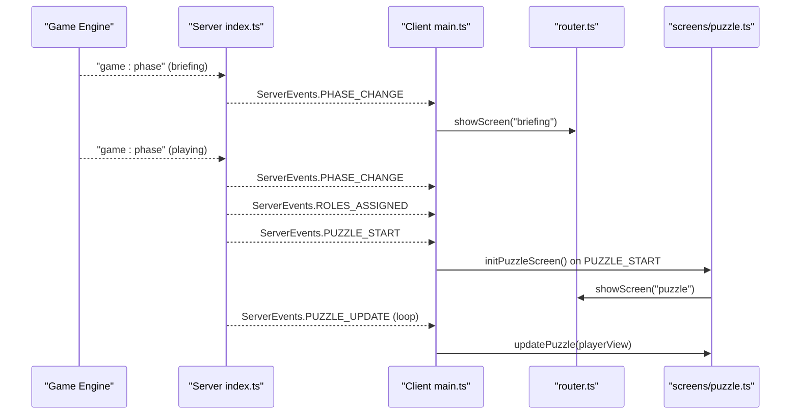
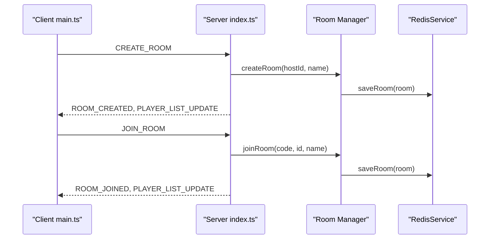
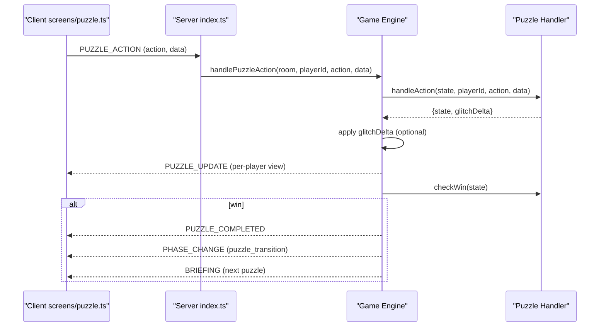
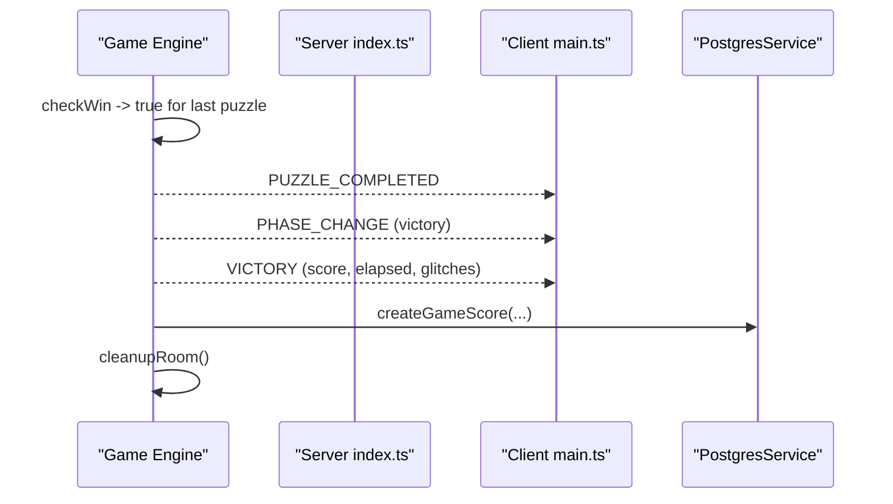
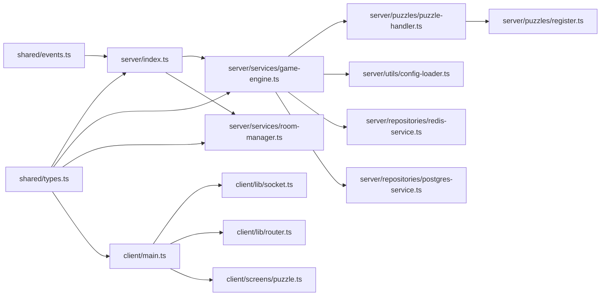

# Component Interactions

<cite>
**Referenced Files in This Document**
- [ARCHITECTURE.md](file://ARCHITECTURE.md)
- [README.md](file://README.md)
- [src/server/index.ts](file://src/server/index.ts)
- [src/server/services/game-engine.ts](file://src/server/services/game-engine.ts)
- [src/server/services/room-manager.ts](file://src/server/services/room-manager.ts)
- [src/server/puzzles/puzzle-handler.ts](file://src/server/puzzles/puzzle-handler.ts)
- [src/server/puzzles/register.ts](file://src/server/puzzles/register.ts)
- [src/server/puzzles/asymmetric-symbols.ts](file://src/server/puzzles/asymmetric-symbols.ts)
- [src/server/puzzles/rhythm-tap.ts](file://src/server/puzzles/rhythm-tap.ts)
- [src/server/utils/config-loader.ts](file://src/server/utils/config-loader.ts)
- [src/server/repositories/redis-service.ts](file://src/server/repositories/redis-service.ts)
- [src/server/repositories/postgres-service.ts](file://src/server/repositories/postgres-service.ts)
- [src/client/main.ts](file://src/client/main.ts)
- [src/client/lib/socket.ts](file://src/client/lib/socket.ts)
- [src/client/lib/router.ts](file://src/client/lib/router.ts)
- [src/client/screens/puzzle.ts](file://src/client/screens/puzzle.ts)
- [shared/events.ts](file://shared/events.ts)
- [shared/types.ts](file://shared/types.ts)
</cite>

## Table of Contents
1. [Introduction](#introduction)
2. [Project Structure](#project-structure)
3. [Core Components](#core-components)
4. [Architecture Overview](#architecture-overview)
5. [Detailed Component Analysis](#detailed-component-analysis)
6. [Dependency Analysis](#dependency-analysis)
7. [Performance Considerations](#performance-considerations)
8. [Troubleshooting Guide](#troubleshooting-guide)
9. [Conclusion](#conclusion)
10. [Appendices](#appendices)

## Introduction
This document explains how Project ODYSSEY’s modular architecture coordinates game lifecycle, room management, puzzle logic, and client UI. It focuses on:
- How the Game Engine orchestrates phases and delegates to puzzle handlers
- How Room Manager maintains room state and integrates with Redis
- How Puzzle Handlers implement pluggable puzzle logic
- How Client Screens react to server events and render puzzle UI
- The dependency injection pattern via the puzzle handler registry
- Event coordination and state propagation across components
- How to integrate new components following the established plugin architecture

## Project Structure
The system is split into a Bun server and a Vite client, communicating over Socket.io. Shared types and events define the contract between client and server. The server exposes:
- A Socket.io entry point wiring all event handlers
- A Game Engine service managing game phases and state
- A Room Manager service for room CRUD and persistence
- A puzzle handler registry and multiple puzzle implementations
- Repositories for Redis and PostgreSQL
- A YAML-based configuration loader with hot-reload

The client provides:
- A typed Socket.io wrapper
- A screen router and HUD
- Screens for lobby, level intro, briefing, puzzle, and results
- Client-side puzzle renderers dispatched by puzzle type



**Diagram sources**
- [src/server/index.ts](file://src/server/index.ts#L1-L321)
- [src/server/services/game-engine.ts](file://src/server/services/game-engine.ts#L1-L711)
- [src/server/services/room-manager.ts](file://src/server/services/room-manager.ts#L1-L262)
- [src/server/puzzles/register.ts](file://src/server/puzzles/register.ts#L1-L21)
- [src/server/puzzles/puzzle-handler.ts](file://src/server/puzzles/puzzle-handler.ts#L1-L57)
- [src/server/utils/config-loader.ts](file://src/server/utils/config-loader.ts#L1-L135)
- [src/server/repositories/redis-service.ts](file://src/server/repositories/redis-service.ts#L1-L68)
- [src/server/repositories/postgres-service.ts](file://src/server/repositories/postgres-service.ts#L1-L68)
- [src/client/main.ts](file://src/client/main.ts#L1-L266)
- [src/client/lib/socket.ts](file://src/client/lib/socket.ts#L1-L85)
- [src/client/lib/router.ts](file://src/client/lib/router.ts#L1-L57)
- [src/client/screens/puzzle.ts](file://src/client/screens/puzzle.ts#L1-L101)
- [shared/events.ts](file://shared/events.ts#L1-L228)
- [shared/types.ts](file://shared/types.ts#L1-L187)

**Section sources**
- [ARCHITECTURE.md](file://ARCHITECTURE.md#L35-L107)
- [README.md](file://README.md#L79-L98)

## Core Components
- Game Engine: Orchestrates game phases (lobby → level_intro → briefing → playing → puzzle_transition → victory/defeat), manages timers, glitch state, and puzzle lifecycle. It depends on Room Manager, Config Loader, Role Assigner, and the puzzle handler registry.
- Room Manager: In-memory room store with Redis persistence. Handles room creation, joins, leaves, and level selection. Exposes helpers to persist and restore rooms.
- Puzzle Handlers: Pluggable implementations of a common interface. Each handler registers itself and is retrieved by type at runtime. Examples include asymmetric symbols and rhythm tap.
- Client Screens: React to server events to navigate screens, update HUD, and render puzzle UI. The puzzle screen dispatches to the correct client-side renderer based on puzzle type.

Key integration points:
- Event contract: All server ↔ client events are defined centrally in shared events.
- Type contract: All shared types (Player, Room, GameState, PuzzleConfig, etc.) live in shared types.
- Plugin registration: Puzzle handlers register via a central registry imported at server startup.

**Section sources**
- [src/server/services/game-engine.ts](file://src/server/services/game-engine.ts#L1-L139)
- [src/server/services/room-manager.ts](file://src/server/services/room-manager.ts#L1-L87)
- [src/server/puzzles/puzzle-handler.ts](file://src/server/puzzles/puzzle-handler.ts#L1-L57)
- [src/server/puzzles/register.ts](file://src/server/puzzles/register.ts#L1-L21)
- [src/client/main.ts](file://src/client/main.ts#L1-L266)
- [src/client/screens/puzzle.ts](file://src/client/screens/puzzle.ts#L1-L101)
- [shared/events.ts](file://shared/events.ts#L1-L228)
- [shared/types.ts](file://shared/types.ts#L1-L187)

## Architecture Overview
The system uses a layered, event-driven architecture:
- Server entry point initializes Socket.io, loads persisted rooms and configs, and wires all event handlers.
- Game Engine is the orchestrator, delegating to Room Manager for state, to Config Loader for level definitions, and to puzzle handlers for game logic.
- Room Manager persists rooms to Redis and restores them on startup.
- Client connects via Socket.io, listens to server events, and renders appropriate screens and puzzle UI.



**Diagram sources**
- [src/client/main.ts](file://src/client/main.ts#L47-L266)
- [src/client/lib/socket.ts](file://src/client/lib/socket.ts#L11-L41)
- [src/server/index.ts](file://src/server/index.ts#L86-L171)
- [src/server/services/game-engine.ts](file://src/server/services/game-engine.ts#L57-L139)
- [src/server/services/room-manager.ts](file://src/server/services/room-manager.ts#L60-L87)
- [src/server/repositories/redis-service.ts](file://src/server/repositories/redis-service.ts#L40-L44)

## Detailed Component Analysis

### Game Engine Orchestration
The Game Engine is the core state machine for each room. It:
- Initializes and validates level configuration
- Manages timers and triggers defeat on timer expiry
- Coordinates phase transitions: level_intro → briefing → playing → puzzle_transition → victory/defeat
- Delegates puzzle actions to the registered handler for the current puzzle type
- Broadcasts events to clients and persists state to Redis



**Diagram sources**
- [src/server/services/game-engine.ts](file://src/server/services/game-engine.ts#L57-L424)

**Section sources**
- [src/server/services/game-engine.ts](file://src/server/services/game-engine.ts#L1-L711)

### Room Manager Lifecycle
Room Manager provides in-memory room storage with Redis persistence:
- Generates room codes and creates initial rooms
- Handles joins, reconnections, and leaves
- Persists rooms on mutations and restores them on startup
- Enforces level selection only in lobby



**Diagram sources**
- [src/server/services/room-manager.ts](file://src/server/services/room-manager.ts#L60-L204)
- [src/server/repositories/redis-service.ts](file://src/server/repositories/redis-service.ts#L40-L60)
- [src/server/index.ts](file://src/server/index.ts#L86-L204)

**Section sources**
- [src/server/services/room-manager.ts](file://src/server/services/room-manager.ts#L1-L262)
- [src/server/repositories/redis-service.ts](file://src/server/repositories/redis-service.ts#L1-L68)

### Puzzle Handlers Plugin Architecture
Puzzle Handlers implement a common interface and are registered centrally:
- Interface: init, handleAction, checkWin, getPlayerView
- Registry: Map keyed by puzzle type; handlers register on import
- Retrieval: Engine fetches handler by type when starting a puzzle

```mermaid
classDiagram
class PuzzleHandler {
+init(players, config) PuzzleState
+handleAction(state, playerId, action, data) {state, glitchDelta}
+checkWin(state) boolean
+getPlayerView(state, playerId, role, config) PlayerView
}
class Registry {
+registerPuzzleHandler(type, handler) void
+getPuzzleHandler(type) PuzzleHandler
}
class AsymmetricSymbols {
+init(...)
+handleAction(...)
+checkWin(...)
+getPlayerView(...)
}
class RhythmTap {
+init(...)
+handleAction(...)
+checkWin(...)
+getPlayerView(...)
}
Registry --> PuzzleHandler : "stores"
AsymmetricSymbols ..|> PuzzleHandler
RhythmTap ..|> PuzzleHandler
```

**Diagram sources**
- [src/server/puzzles/puzzle-handler.ts](file://src/server/puzzles/puzzle-handler.ts#L12-L57)
- [src/server/puzzles/register.ts](file://src/server/puzzles/register.ts#L1-L21)
- [src/server/puzzles/asymmetric-symbols.ts](file://src/server/puzzles/asymmetric-symbols.ts#L18-L156)
- [src/server/puzzles/rhythm-tap.ts](file://src/server/puzzles/rhythm-tap.ts#L19-L134)

**Section sources**
- [src/server/puzzles/puzzle-handler.ts](file://src/server/puzzles/puzzle-handler.ts#L1-L57)
- [src/server/puzzles/register.ts](file://src/server/puzzles/register.ts#L1-L21)
- [src/server/puzzles/asymmetric-symbols.ts](file://src/server/puzzles/asymmetric-symbols.ts#L1-L156)
- [src/server/puzzles/rhythm-tap.ts](file://src/server/puzzles/rhythm-tap.ts#L1-L134)

### Client Screens and State Propagation
Client Screens react to server events and drive UI state:
- main.ts connects to Socket.io, initializes screens, and binds HUD updates for timer, glitch, phase changes, and puzzle start/completion
- router.ts switches active screens and toggles visual FX based on glitch state
- puzzle.ts subscribes to PUZZLE_START and PUZZLE_UPDATE, then dispatches to the matching client-side renderer



**Diagram sources**
- [src/server/services/game-engine.ts](file://src/server/services/game-engine.ts#L288-L318)
- [src/client/main.ts](file://src/client/main.ts#L142-L206)
- [src/client/lib/router.ts](file://src/client/lib/router.ts#L17-L39)
- [src/client/screens/puzzle.ts](file://src/client/screens/puzzle.ts#L24-L34)

**Section sources**
- [src/client/main.ts](file://src/client/main.ts#L1-L266)
- [src/client/lib/router.ts](file://src/client/lib/router.ts#L1-L57)
- [src/client/screens/puzzle.ts](file://src/client/screens/puzzle.ts#L1-L101)

### Typical Interaction Flows

#### Room Creation and Join


**Diagram sources**
- [src/server/index.ts](file://src/server/index.ts#L89-L146)
- [src/server/services/room-manager.ts](file://src/server/services/room-manager.ts#L60-L154)
- [src/server/repositories/redis-service.ts](file://src/server/repositories/redis-service.ts#L40-L44)

#### Puzzle Solving Flow


**Diagram sources**
- [src/server/services/game-engine.ts](file://src/server/services/game-engine.ts#L324-L383)
- [src/server/puzzles/puzzle-handler.ts](file://src/server/puzzles/puzzle-handler.ts#L21-L43)
- [src/client/screens/puzzle.ts](file://src/client/screens/puzzle.ts#L31-L33)

#### Game Completion Scenario


**Diagram sources**
- [src/server/services/game-engine.ts](file://src/server/services/game-engine.ts#L388-L521)
- [src/server/repositories/postgres-service.ts](file://src/server/repositories/postgres-service.ts#L28-L39)
- [src/client/main.ts](file://src/client/main.ts#L192-L206)

## Dependency Analysis
- Event and type contracts: shared/events.ts and shared/types.ts are the single sources of truth for all inter-component contracts.
- Server entry point depends on Room Manager, Game Engine, Config Loader, and puzzle registration.
- Game Engine depends on Room Manager, Config Loader, Role Assigner, Redis, and Postgres.
- Client depends on Socket wrapper and Router for navigation.
- Puzzle Handlers depend only on shared types and are decoupled from the engine except via the registry.



**Diagram sources**
- [shared/events.ts](file://shared/events.ts#L1-L228)
- [shared/types.ts](file://shared/types.ts#L1-L187)
- [src/server/index.ts](file://src/server/index.ts#L1-L46)
- [src/server/services/game-engine.ts](file://src/server/services/game-engine.ts#L1-L47)
- [src/server/services/room-manager.ts](file://src/server/services/room-manager.ts#L1-L17)
- [src/server/puzzles/puzzle-handler.ts](file://src/server/puzzles/puzzle-handler.ts#L1-L6)
- [src/server/puzzles/register.ts](file://src/server/puzzles/register.ts#L1-L6)
- [src/server/utils/config-loader.ts](file://src/server/utils/config-loader.ts#L1-L11)
- [src/server/repositories/redis-service.ts](file://src/server/repositories/redis-service.ts#L1-L7)
- [src/server/repositories/postgres-service.ts](file://src/server/repositories/postgres-service.ts#L1-L4)
- [src/client/main.ts](file://src/client/main.ts#L1-L26)
- [src/client/lib/socket.ts](file://src/client/lib/socket.ts#L1-L7)
- [src/client/lib/router.ts](file://src/client/lib/router.ts#L1-L8)
- [src/client/screens/puzzle.ts](file://src/client/screens/puzzle.ts#L1-L19)

**Section sources**
- [shared/events.ts](file://shared/events.ts#L1-L228)
- [shared/types.ts](file://shared/types.ts#L1-L187)
- [src/server/index.ts](file://src/server/index.ts#L1-L46)

## Performance Considerations
- Real-time synchronization: Socket.io broadcasts minimize polling overhead; ensure client event handlers are efficient and avoid heavy work on the main thread.
- State persistence: Redis saves rooms frequently; keep payloads minimal and avoid unnecessary writes.
- Timer accuracy: GameTimer callbacks update state and broadcast; ensure callbacks are fast to prevent drift.
- Client rendering: Dispatch to specific puzzle renderers reduces overhead; avoid re-rendering entire DOM on small updates.
- Hot-reload configs: YAML watcher avoids restarts; validate early and log warnings to prevent runtime errors.

[No sources needed since this section provides general guidance]

## Troubleshooting Guide
Common issues and diagnostics:
- Socket connection failures: Verify client proxy and CORS settings; check connection logs and reconnection attempts.
- Room not found or restore errors: Confirm Redis connectivity and that rooms are saved/loaded on create/join.
- Missing puzzle handler: Ensure the handler is registered and the puzzle type matches the level config.
- Timer or glitch state inconsistencies: Check persistence and resume logic on server startup.
- Client HUD anomalies: Validate event subscriptions and payload shapes for timer/glitch updates.

**Section sources**
- [src/client/lib/socket.ts](file://src/client/lib/socket.ts#L14-L41)
- [src/server/repositories/redis-service.ts](file://src/server/repositories/redis-service.ts#L9-L15)
- [src/server/services/room-manager.ts](file://src/server/services/room-manager.ts#L96-L107)
- [src/server/services/game-engine.ts](file://src/server/services/game-engine.ts#L570-L596)

## Conclusion
Project ODYSSEY’s architecture cleanly separates concerns:
- The Game Engine orchestrates lifecycle and state
- Room Manager handles persistence and room operations
- Puzzle Handlers provide a flexible, pluggable logic layer
- Client Screens consume typed events and render UI
The shared event and type contracts ensure reliable integration. Extending the system requires registering new puzzle handlers, updating client renderers, and defining level configurations.

[No sources needed since this section summarizes without analyzing specific files]

## Appendices

### How to Add a New Puzzle (Server and Client)
- Server: Implement a handler and register it
- Client: Add a renderer and a case in the puzzle screen dispatcher
- Types: Add the new type to the union
- Level: Add a puzzle entry in YAML

**Section sources**
- [ARCHITECTURE.md](file://ARCHITECTURE.md#L154-L163)