# Data Flow Architecture

<cite>
**Referenced Files in This Document**
- [events.ts](file://shared/events.ts)
- [socket.ts](file://src/client/lib/socket.ts)
- [index.ts](file://src/server/index.ts)
- [game-engine.ts](file://src/server/services/game-engine.ts)
- [room-manager.ts](file://src/server/services/room-manager.ts)
- [types.ts](file://shared/types.ts)
- [lobby.ts](file://src/client/screens/lobby.ts)
- [puzzle.ts](file://src/client/screens/puzzle.ts)
- [main.ts](file://src/client/main.ts)
- [config-loader.ts](file://src/server/utils/config-loader.ts)
- [puzzle-handler.ts](file://src/server/puzzles/puzzle-handler.ts)
- [register.ts](file://src/server/puzzles/register.ts)
- [alphabet-wall.ts](file://src/server/puzzles/alphabet-wall.ts)
- [cipher-decode.ts](file://src/server/puzzles/cipher-decode.ts)
</cite>

## Table of Contents
1. [Introduction](#introduction)
2. [Project Structure](#project-structure)
3. [Core Components](#core-components)
4. [Architecture Overview](#architecture-overview)
5. [Detailed Component Analysis](#detailed-component-analysis)
6. [Dependency Analysis](#dependency-analysis)
7. [Performance Considerations](#performance-considerations)
8. [Troubleshooting Guide](#troubleshooting-guide)
9. [Conclusion](#conclusion)

## Introduction
This document describes the real-time communication system for Project ODYSSEY, focusing on the complete data flow from client actions to server processing and back to client updates. It explains the event-driven architecture using typed Socket.io events defined centrally, documents the data transformation pipeline, and provides examples for room creation, puzzle interactions, and game phase transitions. It also covers error handling, validation, and state synchronization mechanisms.

## Project Structure
The system is split into:
- Client: browser-side screens, socket wrapper, and UI rendering
- Server: Socket.io server, game engine, room manager, puzzle handlers, and configuration loader
- Shared: typed event names and payloads, and core game types

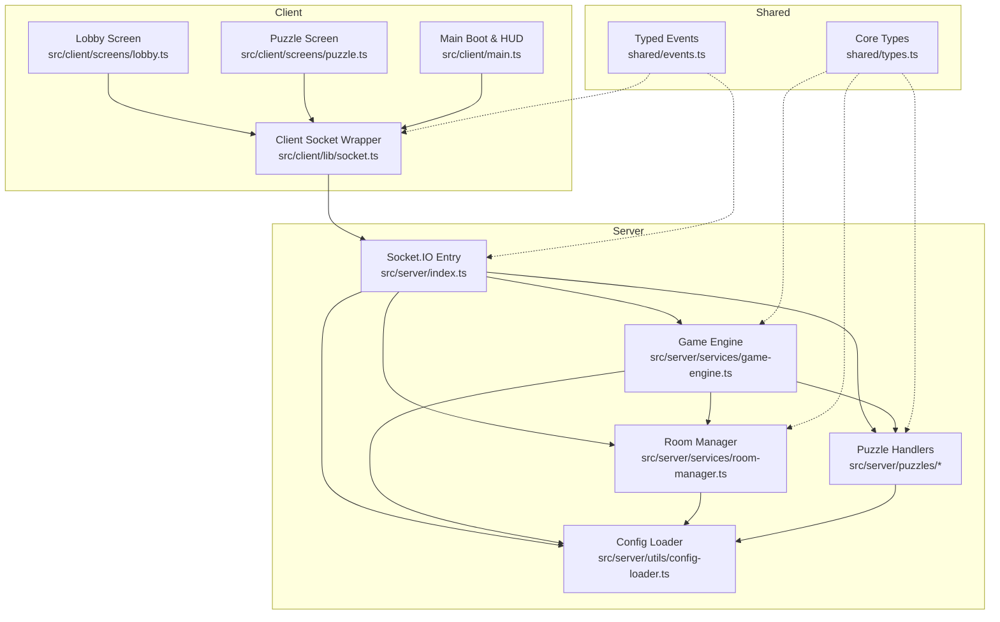

**Diagram sources**
- [socket.ts](file://src/client/lib/socket.ts#L1-L85)
- [index.ts](file://src/server/index.ts#L1-L321)
- [game-engine.ts](file://src/server/services/game-engine.ts#L1-L711)
- [room-manager.ts](file://src/server/services/room-manager.ts#L1-L262)
- [config-loader.ts](file://src/server/utils/config-loader.ts#L1-L135)
- [events.ts](file://shared/events.ts#L1-L228)
- [types.ts](file://shared/types.ts#L1-L187)
- [puzzle-handler.ts](file://src/server/puzzles/puzzle-handler.ts#L1-L57)
- [register.ts](file://src/server/puzzles/register.ts#L1-L21)

**Section sources**
- [socket.ts](file://src/client/lib/socket.ts#L1-L85)
- [index.ts](file://src/server/index.ts#L1-L321)
- [events.ts](file://shared/events.ts#L1-L228)
- [types.ts](file://shared/types.ts#L1-L187)

## Core Components
- Typed Events: Centralized event names and payload interfaces ensure consistency across client and server.
- Socket Wrapper: Provides typed emit/on wrappers and robust connection lifecycle handling.
- Server Entry: Socket.io server wiring, Redis adapter for multi-instance scaling, and event handlers.
- Game Engine: Orchestrates game lifecycle, phases, timers, puzzle transitions, and end-of-game outcomes.
- Room Manager: In-memory room store with Redis persistence and reconnection logic.
- Puzzle Handlers: Pluggable puzzle implementations with init, handleAction, checkWin, and getPlayerView.
- Client Screens: Lobby, puzzle, and HUD updates driven by server events.

**Section sources**
- [events.ts](file://shared/events.ts#L28-L90)
- [socket.ts](file://src/client/lib/socket.ts#L51-L84)
- [index.ts](file://src/server/index.ts#L86-L305)
- [game-engine.ts](file://src/server/services/game-engine.ts#L57-L139)
- [room-manager.ts](file://src/server/services/room-manager.ts#L60-L87)
- [puzzle-handler.ts](file://src/server/puzzles/puzzle-handler.ts#L12-L44)

## Architecture Overview
The system uses a typed, event-driven Socket.io architecture:
- Client emits typed events to the server.
- Server validates payloads, updates room/game state, and broadcasts typed events to clients.
- Clients listen for server events and update UI accordingly.

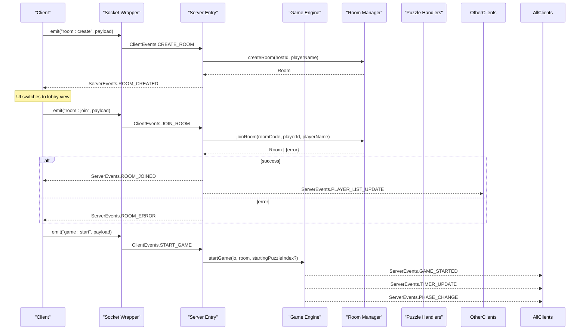

**Diagram sources**
- [index.ts](file://src/server/index.ts#L89-L171)
- [room-manager.ts](file://src/server/services/room-manager.ts#L60-L154)
- [game-engine.ts](file://src/server/services/game-engine.ts#L57-L139)
- [socket.ts](file://src/client/lib/socket.ts#L51-L65)
- [lobby.ts](file://src/client/screens/lobby.ts#L344-L434)

## Detailed Component Analysis

### Typed Events and Payloads
- ClientEvents and ServerEvents define all event names and payload interfaces in a single source of truth.
- This prevents magic strings and ensures compile-time safety for event names and payloads.

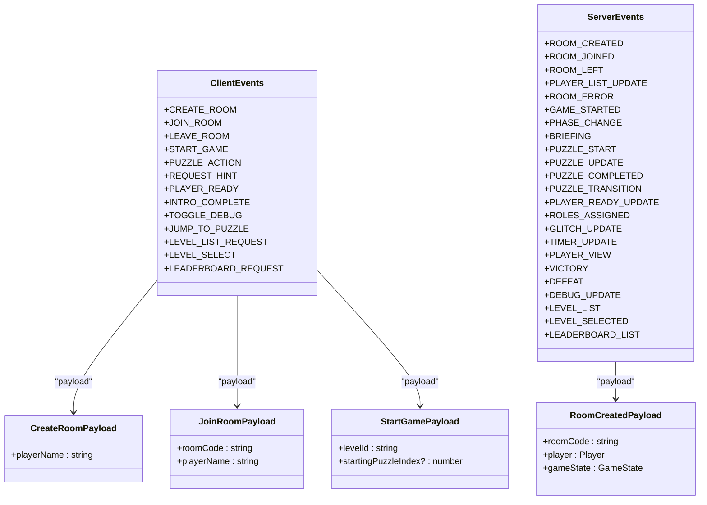

**Diagram sources**
- [events.ts](file://shared/events.ts#L28-L90)
- [events.ts](file://shared/events.ts#L94-L128)
- [events.ts](file://shared/events.ts#L124-L164)

**Section sources**
- [events.ts](file://shared/events.ts#L28-L90)
- [events.ts](file://shared/events.ts#L94-L164)

### Client Socket Wrapper
- Provides typed emit/on wrappers around Socket.io.
- Manages connection lifecycle, logging, and safe access to the socket instance.
- Exposes ClientEvents and ServerEvents for convenience.

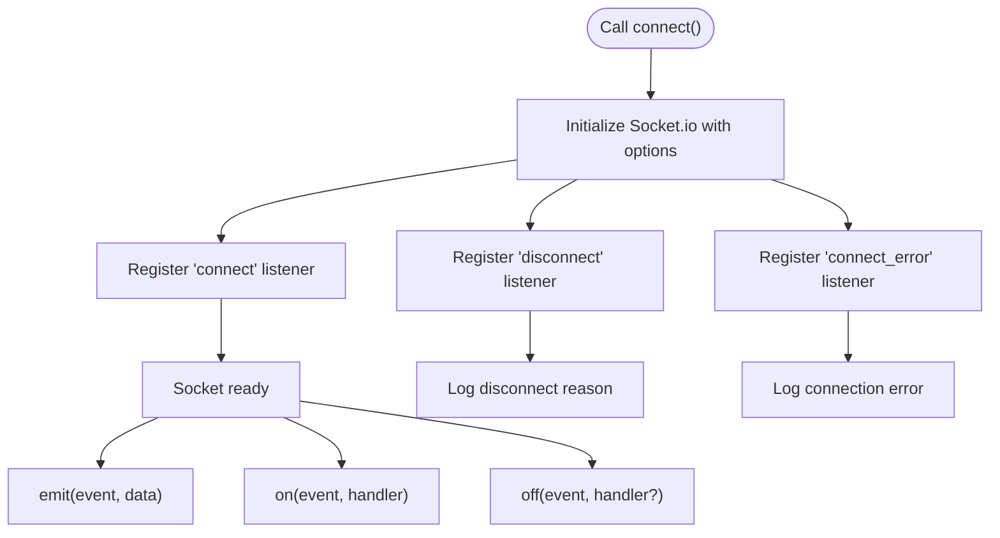

**Diagram sources**
- [socket.ts](file://src/client/lib/socket.ts#L11-L41)
- [socket.ts](file://src/client/lib/socket.ts#L51-L73)

**Section sources**
- [socket.ts](file://src/client/lib/socket.ts#L11-L41)
- [socket.ts](file://src/client/lib/socket.ts#L51-L73)

### Server Entry and Event Wiring
- Initializes Socket.io server, Redis adapter, loads rooms and configs, and registers event handlers.
- Each handler follows a consistent try/catch pattern and logs errors.
- Uses typed events from shared/events.ts to avoid magic strings.

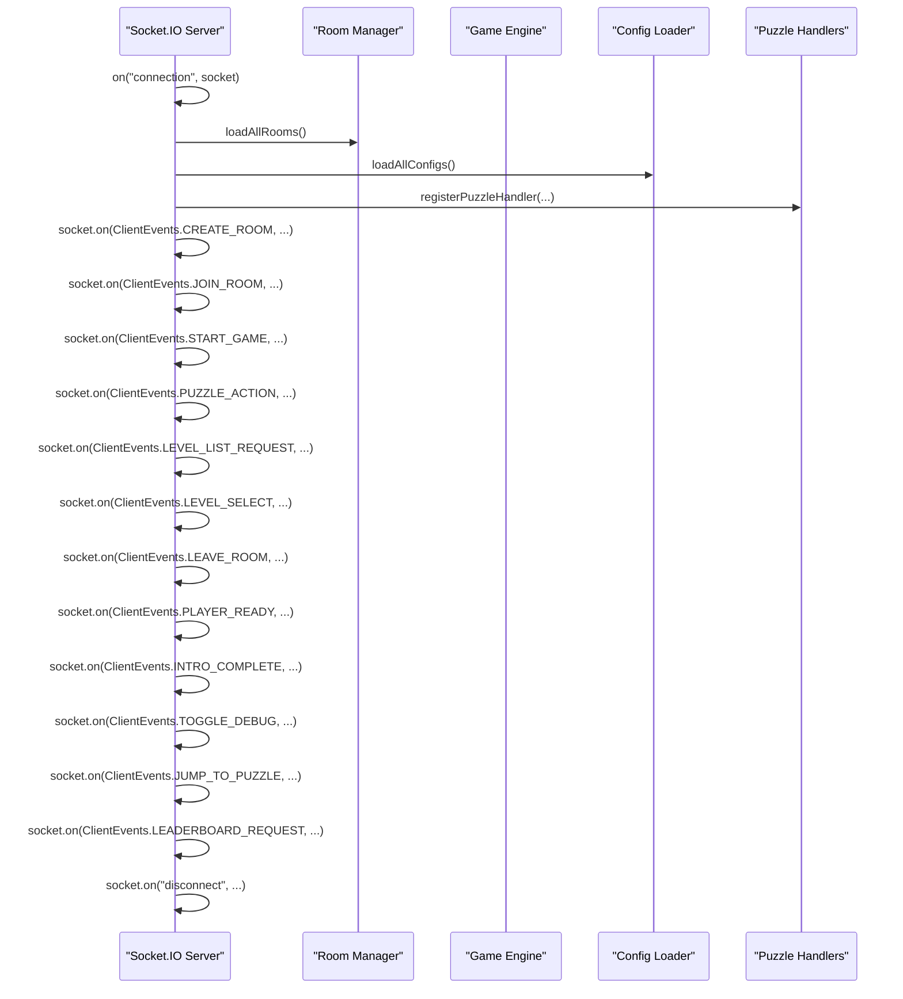

**Diagram sources**
- [index.ts](file://src/server/index.ts#L54-L61)
- [index.ts](file://src/server/index.ts#L86-L305)
- [register.ts](file://src/server/puzzles/register.ts#L1-L21)

**Section sources**
- [index.ts](file://src/server/index.ts#L54-L61)
- [index.ts](file://src/server/index.ts#L86-L305)

### Room Management and Persistence
- Creates rooms with unique codes and initial game state.
- Supports reconnection and host reassignment.
- Persists rooms to Redis and restores on startup.

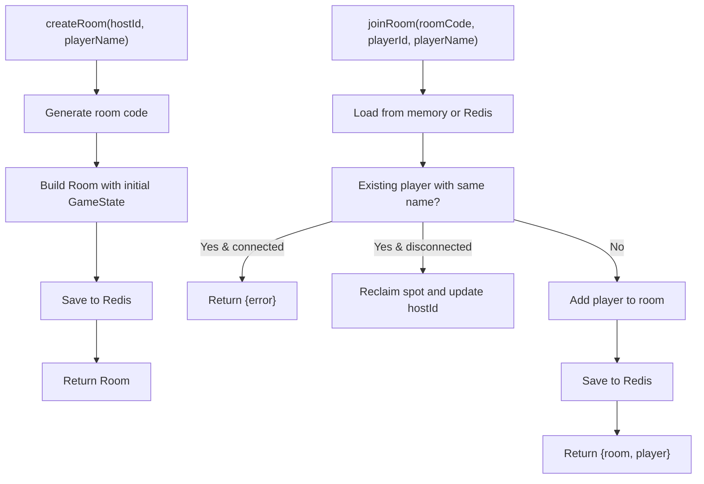

**Diagram sources**
- [room-manager.ts](file://src/server/services/room-manager.ts#L60-L87)
- [room-manager.ts](file://src/server/services/room-manager.ts#L89-L154)

**Section sources**
- [room-manager.ts](file://src/server/services/room-manager.ts#L60-L87)
- [room-manager.ts](file://src/server/services/room-manager.ts#L89-L154)

### Game Engine Lifecycle and State Machine
- Starts the game, initializes timers, and orchestrates phases: level_intro, briefing, playing, puzzle_transition, victory, defeat.
- Handles puzzle actions, applies glitch penalties, and broadcasts updates.
- Persists room state and cleans up timers on end conditions.

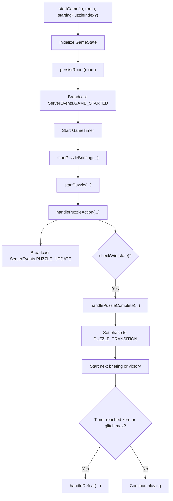

**Diagram sources**
- [game-engine.ts](file://src/server/services/game-engine.ts#L57-L139)
- [game-engine.ts](file://src/server/services/game-engine.ts#L324-L383)
- [game-engine.ts](file://src/server/services/game-engine.ts#L388-L424)
- [game-engine.ts](file://src/server/services/game-engine.ts#L526-L550)

**Section sources**
- [game-engine.ts](file://src/server/services/game-engine.ts#L57-L139)
- [game-engine.ts](file://src/server/services/game-engine.ts#L324-L383)
- [game-engine.ts](file://src/server/services/game-engine.ts#L388-L424)
- [game-engine.ts](file://src/server/services/game-engine.ts#L526-L550)

### Puzzle Handlers and Data Transformation
- Each puzzle implements init, handleAction, checkWin, and getPlayerView.
- handleAction returns updated state and glitchDelta; getPlayerView computes role-specific views.
- The engine selects the handler by puzzle type and coordinates role assignments.

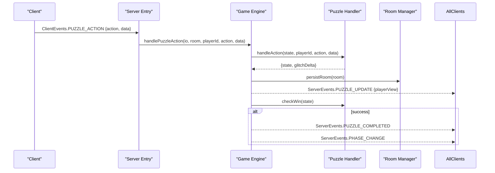

**Diagram sources**
- [index.ts](file://src/server/index.ts#L206-L217)
- [game-engine.ts](file://src/server/services/game-engine.ts#L324-L383)
- [puzzle-handler.ts](file://src/server/puzzles/puzzle-handler.ts#L21-L26)
- [register.ts](file://src/server/puzzles/register.ts#L14-L20)

**Section sources**
- [puzzle-handler.ts](file://src/server/puzzles/puzzle-handler.ts#L12-L44)
- [register.ts](file://src/server/puzzles/register.ts#L14-L20)
- [alphabet-wall.ts](file://src/server/puzzles/alphabet-wall.ts#L83-L143)
- [cipher-decode.ts](file://src/server/puzzles/cipher-decode.ts#L55-L89)

### Client-Side Data Flow Examples

#### Room Creation Flow
- Client emits room:create with playerName.
- Server creates room, joins socket to room, emits room:created and player list updates.
- Client renders lobby view and requests level list.

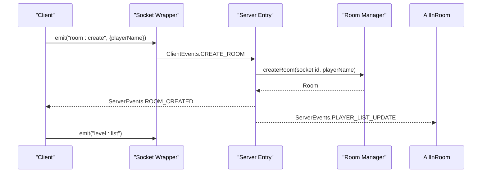

**Diagram sources**
- [lobby.ts](file://src/client/screens/lobby.ts#L263-L276)
- [index.ts](file://src/server/index.ts#L89-L110)
- [room-manager.ts](file://src/server/services/room-manager.ts#L60-L87)

**Section sources**
- [lobby.ts](file://src/client/screens/lobby.ts#L263-L276)
- [index.ts](file://src/server/index.ts#L89-L110)
- [room-manager.ts](file://src/server/services/room-manager.ts#L60-L87)

#### Puzzle Interaction Flow
- Client sends puzzle:action with action and data.
- Server delegates to puzzle handler, persists state, applies glitch if needed, and broadcasts puzzle:update.
- Client updates puzzle view with new playerView.

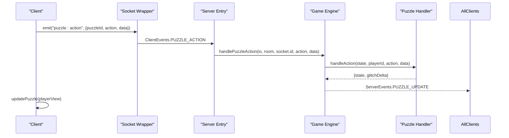

**Diagram sources**
- [puzzle.ts](file://src/client/screens/puzzle.ts#L31-L34)
- [index.ts](file://src/server/index.ts#L206-L217)
- [game-engine.ts](file://src/server/services/game-engine.ts#L324-L383)

**Section sources**
- [puzzle.ts](file://src/client/screens/puzzle.ts#L31-L34)
- [index.ts](file://src/server/index.ts#L206-L217)
- [game-engine.ts](file://src/server/services/game-engine.ts#L324-L383)

#### Game Phase Transitions
- After level intro, clients receive game:started and timer updates.
- During briefing, clients can press ready; when all are ready, puzzle starts.
- During playing, clients receive roles:assigned and puzzle:start with player-specific views.

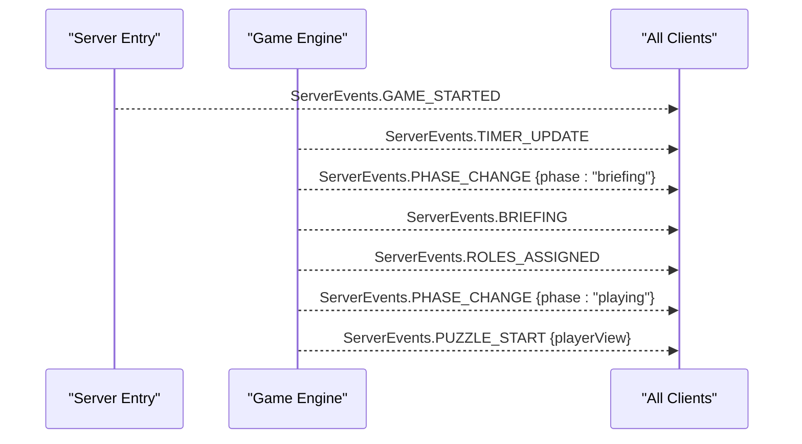

**Diagram sources**
- [game-engine.ts](file://src/server/services/game-engine.ts#L103-L115)
- [game-engine.ts](file://src/server/services/game-engine.ts#L169-L202)
- [game-engine.ts](file://src/server/services/game-engine.ts#L263-L319)

**Section sources**
- [game-engine.ts](file://src/server/services/game-engine.ts#L103-L115)
- [game-engine.ts](file://src/server/services/game-engine.ts#L169-L202)
- [game-engine.ts](file://src/server/services/game-engine.ts#L263-L319)

### Client Screens and HUD Updates
- Main boot connects socket, initializes screens, and wires HUD updates for timer and glitch.
- Lobby screen handles room creation/joining, player lists, level selection, and leaderboard.
- Puzzle screen renders and updates puzzle views based on puzzle type.

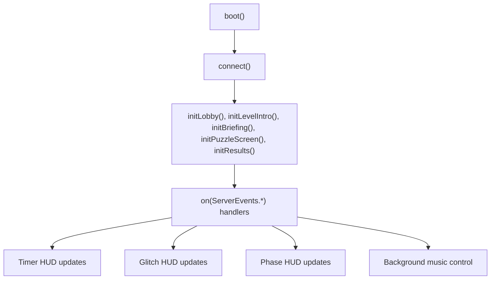

**Diagram sources**
- [main.ts](file://src/client/main.ts#L47-L262)
- [lobby.ts](file://src/client/screens/lobby.ts#L46-L82)
- [puzzle.ts](file://src/client/screens/puzzle.ts#L23-L34)

**Section sources**
- [main.ts](file://src/client/main.ts#L47-L262)
- [lobby.ts](file://src/client/screens/lobby.ts#L46-L82)
- [puzzle.ts](file://src/client/screens/puzzle.ts#L23-L34)

## Dependency Analysis
- Shared types and events are consumed by both client and server, ensuring type safety across boundaries.
- Server depends on Room Manager for state, Game Engine for orchestration, Config Loader for level definitions, and Puzzle Handlers for gameplay logic.
- Client depends on Socket Wrapper and screens for UI behavior.

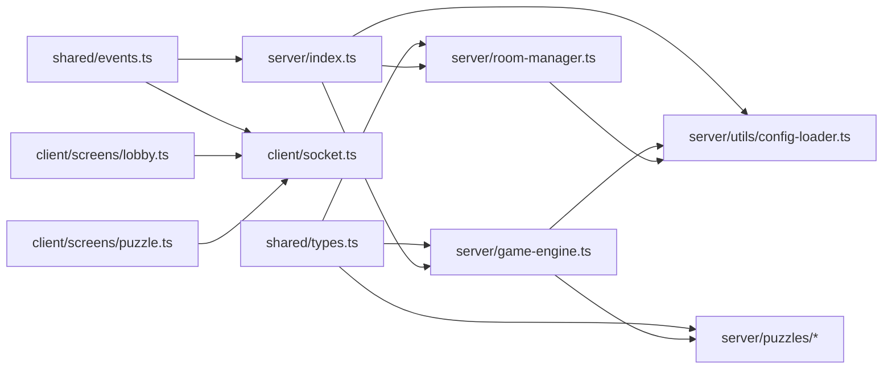

**Diagram sources**
- [types.ts](file://shared/types.ts#L1-L187)
- [events.ts](file://shared/events.ts#L1-L228)
- [socket.ts](file://src/client/lib/socket.ts#L1-L85)
- [index.ts](file://src/server/index.ts#L1-L321)
- [game-engine.ts](file://src/server/services/game-engine.ts#L1-L711)
- [room-manager.ts](file://src/server/services/room-manager.ts#L1-L262)
- [config-loader.ts](file://src/server/utils/config-loader.ts#L1-L135)

**Section sources**
- [types.ts](file://shared/types.ts#L1-L187)
- [events.ts](file://shared/events.ts#L1-L228)
- [index.ts](file://src/server/index.ts#L1-L321)

## Performance Considerations
- Redis Adapter: Socket.io uses Redis adapter for multi-instance synchronization, enabling horizontal scaling.
- Room Persistence: Rooms and timers are persisted to Redis to survive restarts and resume timers.
- Minimal Payloads: Events carry only necessary data; client-side screens update efficiently via targeted DOM updates.
- Config Hot Reload: YAML configs are watched and hot-reloaded without restarting the server.

[No sources needed since this section provides general guidance]

## Troubleshooting Guide
- Connection Issues: The client logs connect/disconnect reasons and errors; ensure server CORS allows the client origin.
- Room Errors: Server emits room:error with messages for invalid room codes, full rooms, or name conflicts.
- Validation: Room Manager enforces player limits and reconnection rules; Config Loader validates level configs.
- State Synchronization: On rejoin, the server syncs game state to late-arriving or reconnected players.

**Section sources**
- [socket.ts](file://src/client/lib/socket.ts#L24-L38)
- [index.ts](file://src/server/index.ts#L118-L122)
- [room-manager.ts](file://src/server/services/room-manager.ts#L133-L134)
- [config-loader.ts](file://src/server/utils/config-loader.ts#L25-L40)

## Conclusion
Project ODYSSEY’s real-time communication system is built on typed, event-driven Socket.io with a clear separation of concerns:
- Shared types and events ensure consistency.
- Server orchestrates rooms, game phases, and puzzle logic.
- Client screens react to server events and update UI efficiently.
- Robust error handling, validation, and state synchronization provide a reliable multiplayer experience.