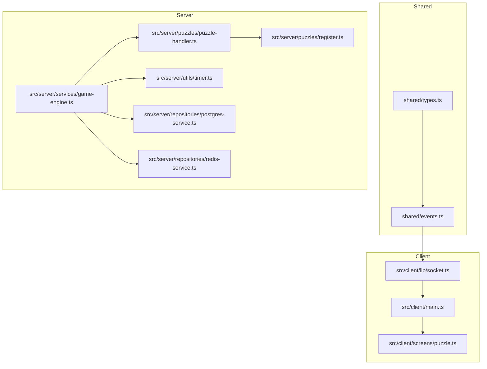
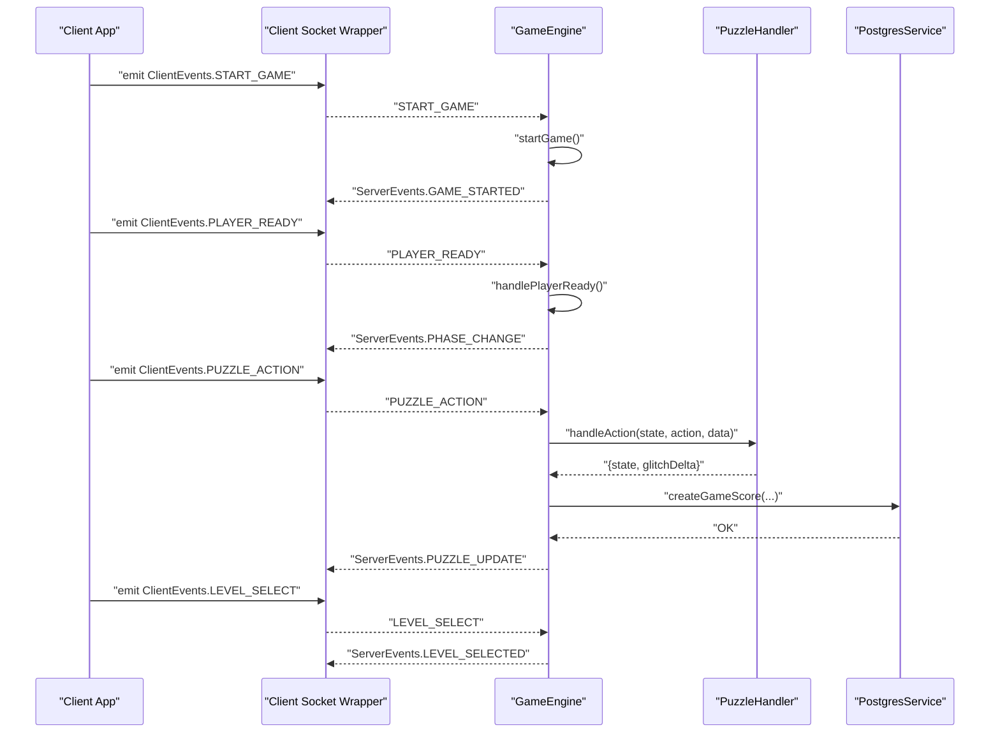
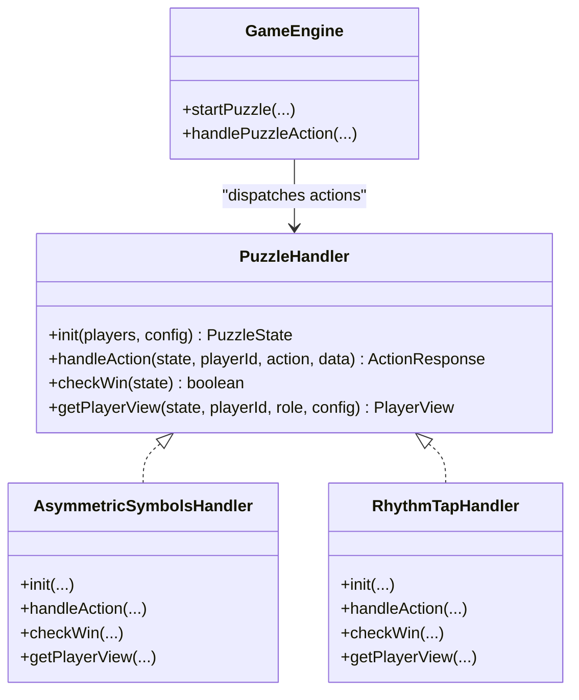
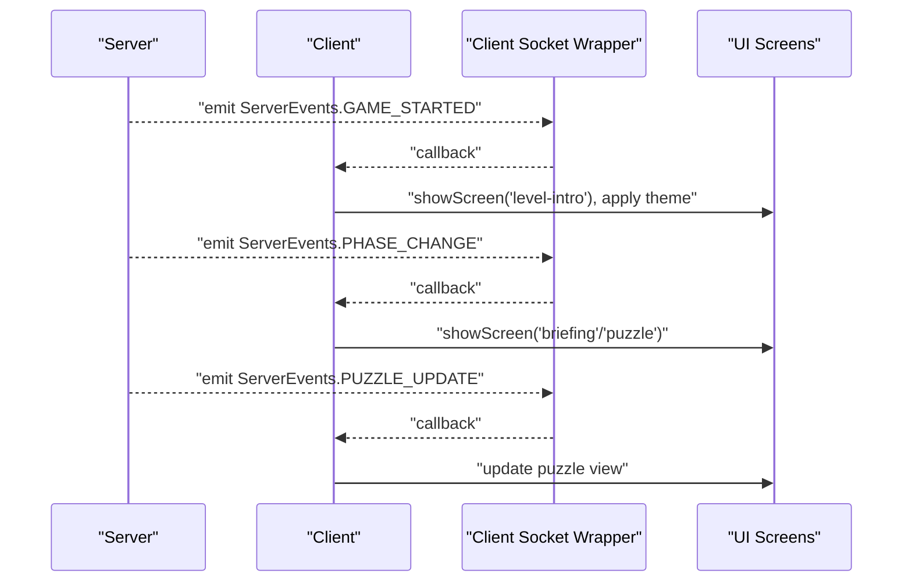
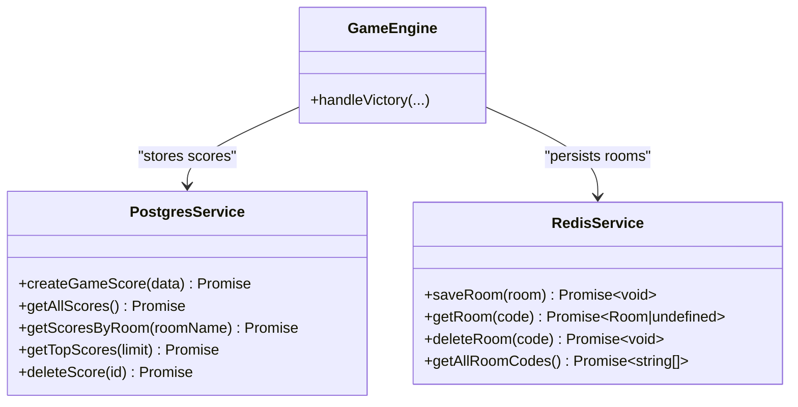
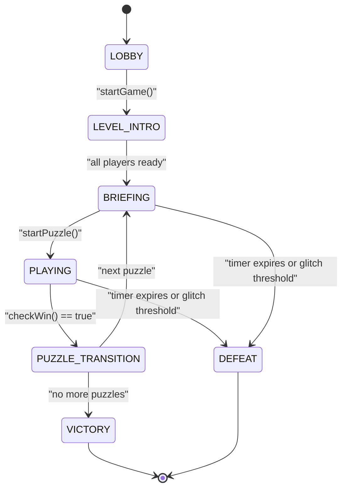
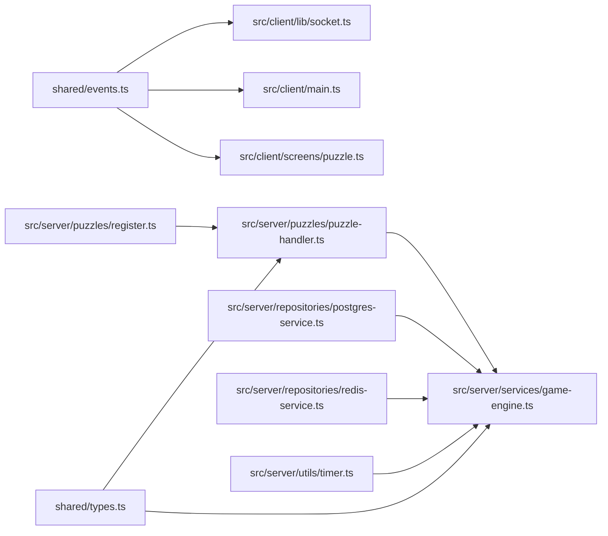

# Design Patterns

<cite>
**Referenced Files in This Document**
- [ARCHITECTURE.md](file://ARCHITECTURE.md)
- [shared/types.ts](file://shared/types.ts)
- [shared/events.ts](file://shared/events.ts)
- [src/server/puzzles/puzzle-handler.ts](file://src/server/puzzles/puzzle-handler.ts)
- [src/server/puzzles/register.ts](file://src/server/puzzles/register.ts)
- [src/server/puzzles/asymmetric-symbols.ts](file://src/server/puzzles/asymmetric-symbols.ts)
- [src/server/puzzles/rhythm-tap.ts](file://src/server/puzzles/rhythm-tap.ts)
- [src/server/services/game-engine.ts](file://src/server/services/game-engine.ts)
- [src/server/repositories/postgres-service.ts](file://src/server/repositories/postgres-service.ts)
- [src/server/repositories/redis-service.ts](file://src/server/repositories/redis-service.ts)
- [src/server/utils/timer.ts](file://src/server/utils/timer.ts)
- [src/client/lib/socket.ts](file://src/client/lib/socket.ts)
- [src/client/main.ts](file://src/client/main.ts)
- [src/client/screens/puzzle.ts](file://src/client/screens/puzzle.ts)
</cite>

## Table of Contents
1. [Introduction](#introduction)
2. [Project Structure](#project-structure)
3. [Core Components](#core-components)
4. [Architecture Overview](#architecture-overview)
5. [Detailed Component Analysis](#detailed-component-analysis)
6. [Dependency Analysis](#dependency-analysis)
7. [Performance Considerations](#performance-considerations)
8. [Troubleshooting Guide](#troubleshooting-guide)
9. [Conclusion](#conclusion)

## Introduction
This document explains the design patterns implemented in Project ODYSSEY’s architecture, focusing on:
- Strategy pattern in puzzle handlers
- Observer pattern in client-server communication
- Repository pattern in data access layers
- State Machine pattern in game phases

It details how each pattern addresses specific architectural challenges—extensibility, maintainability, testability, and real-time synchronization—and highlights trade-offs and decisions behind their adoption.

## Project Structure
Project ODYSSEY separates concerns across shared types/events, server orchestration, puzzle implementations, and client UI. The server exposes typed Socket.io events and orchestrates game phases and puzzle execution. Clients subscribe to server events and render appropriate screens and puzzle UIs.

**Diagram sources**
- [shared/types.ts](file://shared/types.ts#L1-L187)
- [shared/events.ts](file://shared/events.ts#L1-L228)
- [src/server/services/game-engine.ts](file://src/server/services/game-engine.ts#L1-L711)
- [src/server/puzzles/puzzle-handler.ts](file://src/server/puzzles/puzzle-handler.ts#L1-L57)
- [src/server/puzzles/register.ts](file://src/server/puzzles/register.ts#L1-L21)
- [src/server/repositories/postgres-service.ts](file://src/server/repositories/postgres-service.ts#L1-L68)
- [src/server/repositories/redis-service.ts](file://src/server/repositories/redis-service.ts#L1-L68)
- [src/server/utils/timer.ts](file://src/server/utils/timer.ts#L1-L81)
- [src/client/lib/socket.ts](file://src/client/lib/socket.ts#L1-L85)
- [src/client/main.ts](file://src/client/main.ts#L1-L266)
- [src/client/screens/puzzle.ts](file://src/client/screens/puzzle.ts#L1-L101)

**Section sources**
- [ARCHITECTURE.md](file://ARCHITECTURE.md#L1-L202)
- [shared/types.ts](file://shared/types.ts#L1-L187)
- [shared/events.ts](file://shared/events.ts#L1-L228)

## Core Components
- Shared contracts: Strongly typed domain models and event definitions ensure compile-time safety and reduce coupling.
- Server orchestration: GameEngine coordinates game phases, timers, puzzle lifecycle, and persistence.
- Puzzle handlers: Pluggable implementations encapsulate puzzle-specific logic behind a single interface.
- Client observers: Socket wrappers and event handlers react to server broadcasts and update UI accordingly.
- Data access: Repositories abstract database and cache operations.

**Section sources**
- [shared/types.ts](file://shared/types.ts#L26-L93)
- [shared/events.ts](file://shared/events.ts#L28-L90)
- [src/server/services/game-engine.ts](file://src/server/services/game-engine.ts#L1-L711)
- [src/server/puzzles/puzzle-handler.ts](file://src/server/puzzles/puzzle-handler.ts#L12-L56)

## Architecture Overview
The system follows a server-authoritative model:
- Clients observe server events and render UI.
- Server maintains game state and delegates puzzle logic to pluggable handlers.
- Persistence is layered: Redis for room state, PostgreSQL for scores.

**Diagram sources**
- [src/client/lib/socket.ts](file://src/client/lib/socket.ts#L51-L84)
- [src/server/services/game-engine.ts](file://src/server/services/game-engine.ts#L57-L139)
- [src/server/services/game-engine.ts](file://src/server/services/game-engine.ts#L207-L236)
- [src/server/services/game-engine.ts](file://src/server/services/game-engine.ts#L324-L383)
- [src/server/repositories/postgres-service.ts](file://src/server/repositories/postgres-service.ts#L28-L39)
- [shared/events.ts](file://shared/events.ts#L28-L90)

## Detailed Component Analysis

### Strategy Pattern in Puzzle Handlers
The Strategy pattern encapsulates puzzle-specific logic behind a common interface, enabling runtime selection and easy extension.

- Interface definition: The PuzzleHandler contract defines init, handleAction, checkWin, and getPlayerView.
- Registry: A map registers handlers by type; registration occurs at startup.
- Orchestration: GameEngine retrieves the handler by puzzle type and delegates all puzzle logic.
- Examples: asymmetric-symbols and rhythm-tap implement distinct strategies with different state machines and views.

**Diagram sources**
- [src/server/puzzles/puzzle-handler.ts](file://src/server/puzzles/puzzle-handler.ts#L12-L44)
- [src/server/puzzles/asymmetric-symbols.ts](file://src/server/puzzles/asymmetric-symbols.ts#L18-L155)
- [src/server/puzzles/rhythm-tap.ts](file://src/server/puzzles/rhythm-tap.ts#L19-L133)
- [src/server/services/game-engine.ts](file://src/server/services/game-engine.ts#L263-L319)

Benefits:
- Extensibility: Adding a new puzzle requires implementing the interface and registering it.
- Testability: Handlers can be unit-tested independently with mock clients.
- Maintainability: Puzzle logic is isolated; changes do not affect orchestration.

Trade-offs:
- Overhead of indirection: One extra lookup and method call per action.
- Consistency: Requires strict adherence to the interface contract.

Integration points:
- Registration: All handlers are registered at startup.
- Dispatch: GameEngine selects handler by puzzle type and invokes methods.

**Section sources**
- [src/server/puzzles/puzzle-handler.ts](file://src/server/puzzles/puzzle-handler.ts#L12-L56)
- [src/server/puzzles/register.ts](file://src/server/puzzles/register.ts#L14-L20)
- [src/server/services/game-engine.ts](file://src/server/services/game-engine.ts#L263-L319)
- [src/server/puzzles/asymmetric-symbols.ts](file://src/server/puzzles/asymmetric-symbols.ts#L18-L155)
- [src/server/puzzles/rhythm-tap.ts](file://src/server/puzzles/rhythm-tap.ts#L19-L133)

### Observer Pattern in Client-Server Communication
The Observer pattern enables clients to react to server-driven state changes without polling. Typed event names and payloads ensure reliable communication.

- Client-side observer: The client wraps Socket.io with typed on/emit helpers and subscribes to server events.
- Server-side publisher: GameEngine emits events for game flow, puzzle updates, timers, and glitch state.
- UI reactions: The main client listens to events and updates screens, HUD, and visuals.

**Diagram sources**
- [src/client/lib/socket.ts](file://src/client/lib/socket.ts#L59-L84)
- [src/client/main.ts](file://src/client/main.ts#L93-L162)
- [src/client/main.ts](file://src/client/main.ts#L180-L189)
- [src/client/screens/puzzle.ts](file://src/client/screens/puzzle.ts#L24-L34)
- [shared/events.ts](file://shared/events.ts#L53-L90)

Benefits:
- Real-time responsiveness: UI updates as soon as server state changes.
- Loose coupling: Clients subscribe to named events; server decides when to publish.
- Testability: Mock event emitters can drive UI transitions in isolation.

Trade-offs:
- Network reliability: Requires robust reconnection and error logging.
- Event explosion: Too many events can complicate debugging.

**Section sources**
- [src/client/lib/socket.ts](file://src/client/lib/socket.ts#L11-L84)
- [src/client/main.ts](file://src/client/main.ts#L93-L162)
- [src/client/main.ts](file://src/client/main.ts#L180-L189)
- [src/client/screens/puzzle.ts](file://src/client/screens/puzzle.ts#L24-L34)
- [shared/events.ts](file://shared/events.ts#L28-L90)

### Repository Pattern in Data Access Layers
The Repository pattern abstracts persistence concerns behind simple interfaces, separating domain logic from storage specifics.

- RedisService: Encapsulates room serialization/deserialization and CRUD-like operations for rooms.
- PostgresService: Encapsulates score creation and retrieval via Prisma.

**Diagram sources**
- [src/server/repositories/redis-service.ts](file://src/server/repositories/redis-service.ts#L39-L67)
- [src/server/repositories/postgres-service.ts](file://src/server/repositories/postgres-service.ts#L24-L67)
- [src/server/services/game-engine.ts](file://src/server/services/game-engine.ts#L458-L483)

Benefits:
- Separation of concerns: Domain logic does not depend on storage details.
- Testability: Repositories can be mocked for unit tests.
- Maintainability: Changes to storage technology impact only repository implementations.

Trade-offs:
- Abstraction overhead: Adds indirection and potential performance cost.
- Complexity: Requires careful transaction and error handling across layers.

**Section sources**
- [src/server/repositories/redis-service.ts](file://src/server/repositories/redis-service.ts#L1-L68)
- [src/server/repositories/postgres-service.ts](file://src/server/repositories/postgres-service.ts#L1-L68)
- [src/server/services/game-engine.ts](file://src/server/services/game-engine.ts#L458-L483)

### State Machine Pattern in Game Phases
GameEngine implements a finite-state machine to manage game progression, ensuring predictable transitions and consistent UI behavior.

States:
- LOBBY, LEVEL_INTRO, BRIEFING, PLAYING, PUZZLE_TRANSITION, VICTORY, DEFEAT

Transitions:
- Driven by server logic and client acknowledgments (e.g., PLAYER_READY).
- Timers and glitch thresholds act as external triggers.

**Diagram sources**
- [shared/types.ts](file://shared/types.ts#L26-L34)
- [src/server/services/game-engine.ts](file://src/server/services/game-engine.ts#L57-L139)
- [src/server/services/game-engine.ts](file://src/server/services/game-engine.ts#L144-L202)
- [src/server/services/game-engine.ts](file://src/server/services/game-engine.ts#L207-L236)
- [src/server/services/game-engine.ts](file://src/server/services/game-engine.ts#L263-L319)
- [src/server/services/game-engine.ts](file://src/server/services/game-engine.ts#L388-L424)
- [src/server/services/game-engine.ts](file://src/server/services/game-engine.ts#L488-L550)

Benefits:
- Predictability: Clear state transitions simplify debugging and testing.
- Maintainability: Centralized logic prevents ad-hoc state mutations.
- Scalability: New phases can be introduced by extending the enum and adding handlers.

Trade-offs:
- Complexity: Many transitions require careful persistence and cleanup.
- Coupling: Tight integration with event-driven UI updates.

**Section sources**
- [shared/types.ts](file://shared/types.ts#L26-L34)
- [src/server/services/game-engine.ts](file://src/server/services/game-engine.ts#L57-L139)
- [src/server/services/game-engine.ts](file://src/server/services/game-engine.ts#L144-L202)
- [src/server/services/game-engine.ts](file://src/server/services/game-engine.ts#L207-L236)
- [src/server/services/game-engine.ts](file://src/server/services/game-engine.ts#L263-L319)
- [src/server/services/game-engine.ts](file://src/server/services/game-engine.ts#L388-L424)
- [src/server/services/game-engine.ts](file://src/server/services/game-engine.ts#L488-L550)

## Dependency Analysis
The server orchestrator depends on typed contracts, event definitions, and pluggable puzzle handlers. Persistence is abstracted via repositories. The client observes server events and renders screens.

**Diagram sources**
- [shared/events.ts](file://shared/events.ts#L1-L228)
- [src/client/lib/socket.ts](file://src/client/lib/socket.ts#L1-L85)
- [src/client/main.ts](file://src/client/main.ts#L1-L266)
- [src/client/screens/puzzle.ts](file://src/client/screens/puzzle.ts#L1-L101)
- [src/server/puzzles/puzzle-handler.ts](file://src/server/puzzles/puzzle-handler.ts#L1-L57)
- [src/server/puzzles/register.ts](file://src/server/puzzles/register.ts#L1-L21)
- [src/server/repositories/postgres-service.ts](file://src/server/repositories/postgres-service.ts#L1-L68)
- [src/server/repositories/redis-service.ts](file://src/server/repositories/redis-service.ts#L1-L68)
- [src/server/utils/timer.ts](file://src/server/utils/timer.ts#L1-L81)
- [shared/types.ts](file://shared/types.ts#L1-L187)

**Section sources**
- [ARCHITECTURE.md](file://ARCHITECTURE.md#L111-L151)
- [shared/types.ts](file://shared/types.ts#L1-L187)
- [shared/events.ts](file://shared/events.ts#L1-L228)

## Performance Considerations
- Strategy dispatch: Minimal overhead via a simple map lookup; negligible compared to rendering and network latency.
- Observer updates: Batch UI updates where possible; throttle frequent events (e.g., timer ticks) to reduce DOM churn.
- Persistence: Redis TTLs prevent memory bloat; Prisma queries are optimized by indexes; avoid N+1 queries.
- State machine: Keep state deltas small; persist only on meaningful transitions to minimize IO.

## Troubleshooting Guide
- Socket connection errors: Verify server availability and CORS/proxy settings; inspect client logs for connect_error events.
- Missing puzzle updates: Ensure the correct puzzle type is registered and that GameEngine dispatches to the handler.
- Persistence failures: Check Redis connectivity and Prisma schema; confirm environment variables for URLs.
- Timer anomalies: Validate resume logic and ensure cleanup on defeat/victory.

**Section sources**
- [src/client/lib/socket.ts](file://src/client/lib/socket.ts#L17-L40)
- [src/server/services/game-engine.ts](file://src/server/services/game-engine.ts#L570-L596)
- [src/server/repositories/redis-service.ts](file://src/server/repositories/redis-service.ts#L9-L15)
- [src/server/repositories/postgres-service.ts](file://src/server/repositories/postgres-service.ts#L20-L22)

## Conclusion
Project ODYSSEY leverages four complementary patterns:
- Strategy for extensible puzzle logic
- Observer for reactive UI updates
- Repository for clean persistence abstraction
- State Machine for predictable game progression

These choices yield a modular, testable, and maintainable system that scales with new puzzles and features while preserving a cohesive user experience.