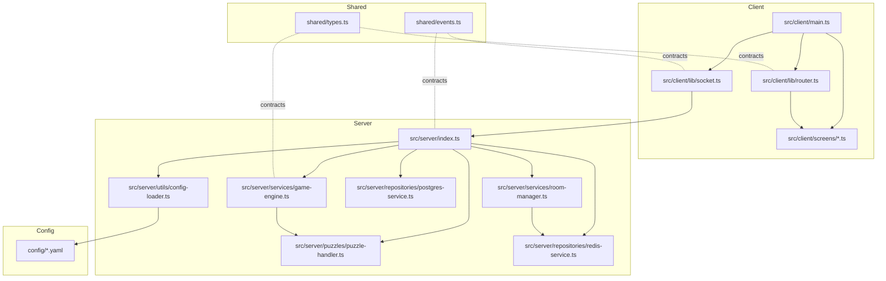
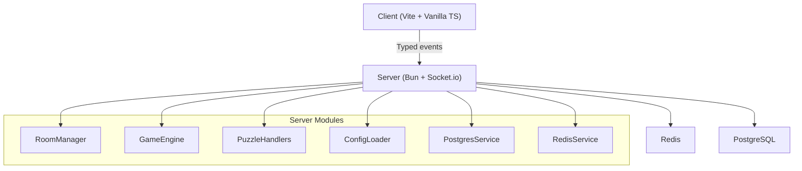
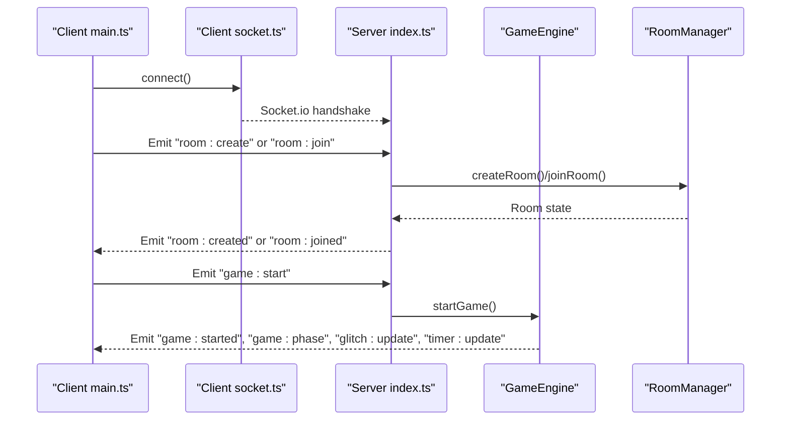
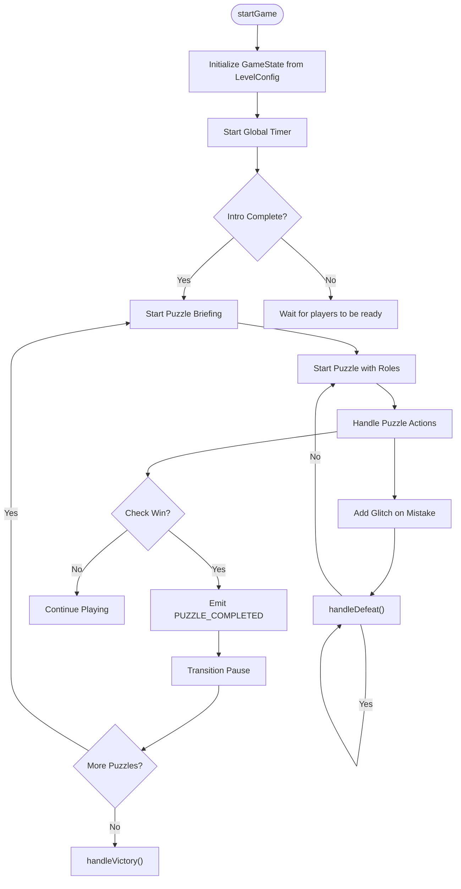
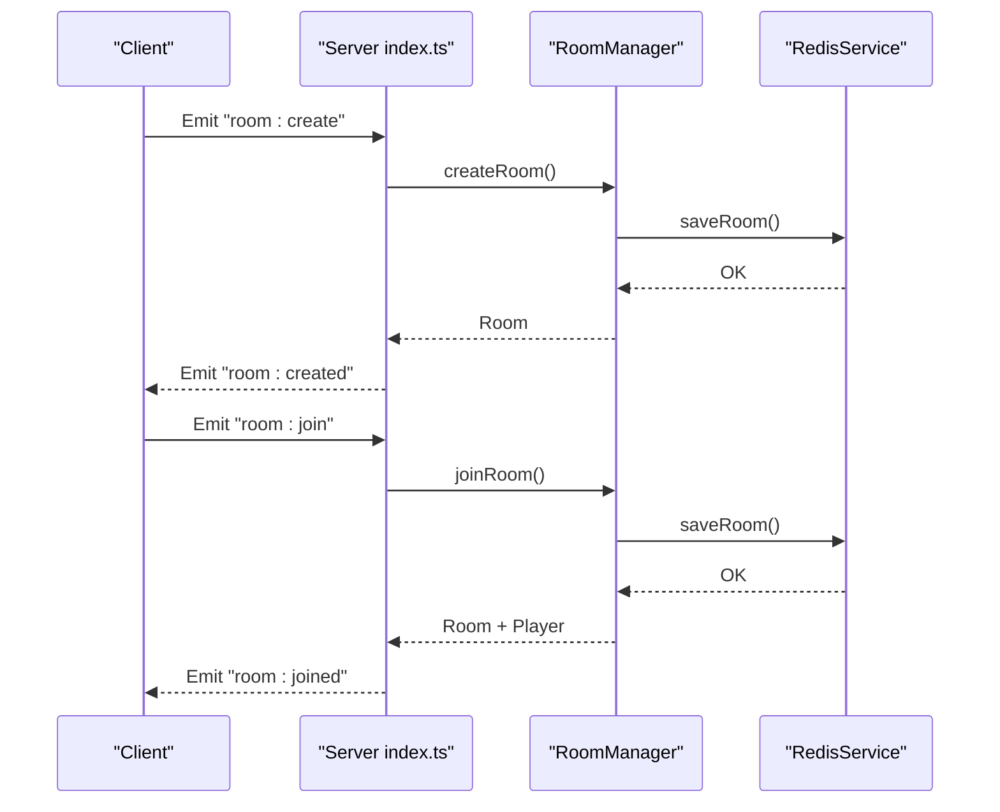
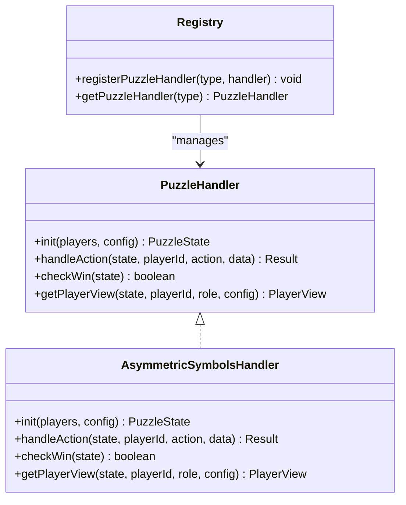
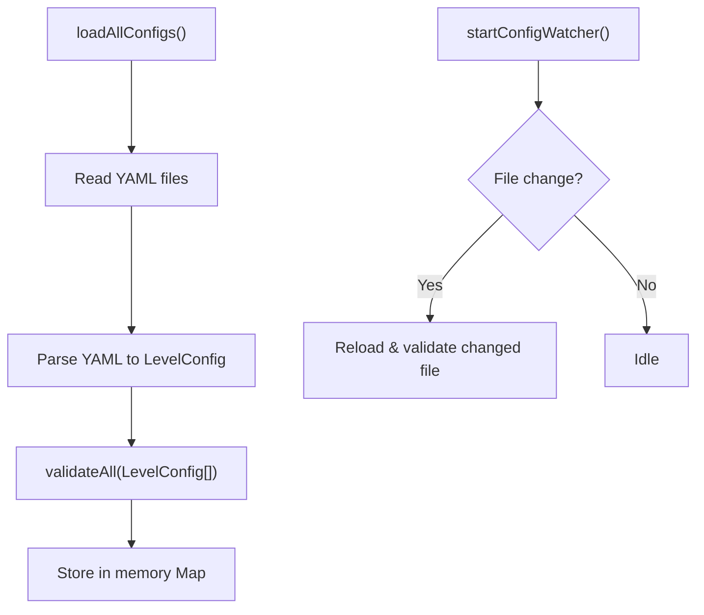
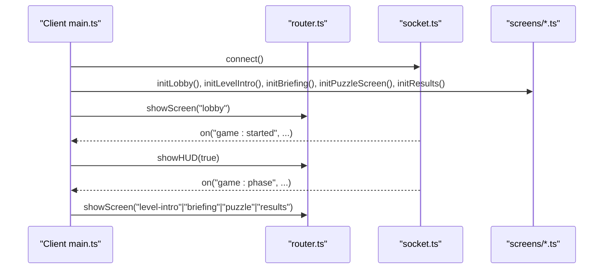
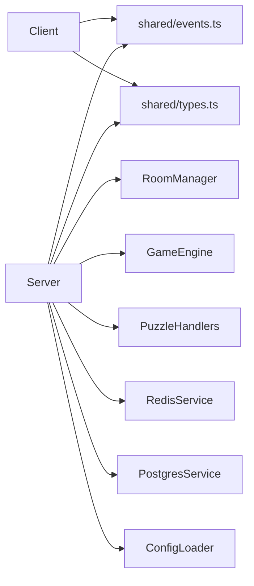

# System Design

<cite>
**Referenced Files in This Document**
- [ARCHITECTURE.md](file://ARCHITECTURE.md)
- [README.md](file://README.md)
- [src/server/index.ts](file://src/server/index.ts)
- [src/client/main.ts](file://src/client/main.ts)
- [shared/events.ts](file://shared/events.ts)
- [shared/types.ts](file://shared/types.ts)
- [src/server/services/game-engine.ts](file://src/server/services/game-engine.ts)
- [src/server/services/room-manager.ts](file://src/server/services/room-manager.ts)
- [src/server/puzzles/puzzle-handler.ts](file://src/server/puzzles/puzzle-handler.ts)
- [src/server/repositories/redis-service.ts](file://src/server/repositories/redis-service.ts)
- [src/server/repositories/postgres-service.ts](file://src/server/repositories/postgres-service.ts)
- [src/server/utils/config-loader.ts](file://src/server/utils/config-loader.ts)
- [src/client/lib/socket.ts](file://src/client/lib/socket.ts)
- [src/client/lib/router.ts](file://src/client/lib/router.ts)
- [src/client/screens/lobby.ts](file://src/client/screens/lobby.ts)
- [src/server/puzzles/asymmetric-symbols.ts](file://src/server/puzzles/asymmetric-symbols.ts)
- [config/level_01.yaml](file://config/level_01.yaml)
</cite>

## Table of Contents
1. [Introduction](#introduction)
2. [Project Structure](#project-structure)
3. [Core Components](#core-components)
4. [Architecture Overview](#architecture-overview)
5. [Detailed Component Analysis](#detailed-component-analysis)
6. [Dependency Analysis](#dependency-analysis)
7. [Performance Considerations](#performance-considerations)
8. [Troubleshooting Guide](#troubleshooting-guide)
9. [Conclusion](#conclusion)
10. [Appendices](#appendices)

## Introduction
Project ODYSSEY is a co-op escape room engine built with a clean architecture approach. The system separates concerns across four layers:
- Presentation layer (client screens and UI)
- Application layer (game engine, room manager, role assignment)
- Domain layer (puzzle handlers and game logic)
- Infrastructure layer (database and caching)

It uses a config-first and data-driven design pattern, enabling rapid iteration on levels and puzzles via YAML configurations. Real-time communication is handled by Socket.io, forming an event-driven architecture that synchronizes state across clients and the server.

## Project Structure
The repository is organized into:
- shared/: Contracts and shared types/events
- src/client/: Vite-served vanilla TypeScript client with screens, routing, and socket wrapper
- src/server/: Bun server with services, repositories, and utilities
- config/: YAML level definitions
- prisma/: Prisma schema and client generation
- Docker and Vite configuration for local development

**Diagram sources**
- [src/client/main.ts](file://src/client/main.ts#L1-L266)
- [src/client/lib/router.ts](file://src/client/lib/router.ts#L1-L57)
- [src/client/lib/socket.ts](file://src/client/lib/socket.ts#L1-L85)
- [src/client/screens/lobby.ts](file://src/client/screens/lobby.ts#L1-L435)
- [src/server/index.ts](file://src/server/index.ts#L1-L321)
- [src/server/services/game-engine.ts](file://src/server/services/game-engine.ts#L1-L711)
- [src/server/services/room-manager.ts](file://src/server/services/room-manager.ts#L1-L262)
- [src/server/puzzles/puzzle-handler.ts](file://src/server/puzzles/puzzle-handler.ts#L1-L57)
- [src/server/repositories/redis-service.ts](file://src/server/repositories/redis-service.ts#L1-L68)
- [src/server/repositories/postgres-service.ts](file://src/server/repositories/postgres-service.ts#L1-L68)
- [src/server/utils/config-loader.ts](file://src/server/utils/config-loader.ts#L1-L135)
- [shared/events.ts](file://shared/events.ts#L1-L228)
- [shared/types.ts](file://shared/types.ts#L1-L187)
- [config/level_01.yaml](file://config/level_01.yaml#L1-L226)

**Section sources**
- [ARCHITECTURE.md](file://ARCHITECTURE.md#L35-L107)
- [README.md](file://README.md#L79-L98)

## Core Components
- Event contract layer: shared/events.ts defines all typed Socket.io event names and payloads, ensuring strong typing across client and server.
- Types layer: shared/types.ts defines core domain models (Player, Room, GameState, PuzzleState, LevelConfig, etc.), acting as the single source of truth.
- Server entry point: src/server/index.ts initializes Socket.io, loads persisted rooms and configs, registers puzzle handlers, and wires all event handlers.
- Game engine: orchestrates game phases, timers, puzzle lifecycle, and scoring.
- Room manager: in-memory room store with Redis persistence for multi-instance deployments.
- Puzzle handler registry: pluggable puzzle logic with a common interface.
- Repositories: Redis service for room persistence and Postgres service for score storage.
- Client bootstrapper: src/client/main.ts connects to the server, initializes screens, and reacts to server events to drive UI state.
- Router and screens: src/client/lib/router.ts and src/client/screens/lobby.ts demonstrate screen transitions and event-driven UI updates.

**Section sources**
- [shared/events.ts](file://shared/events.ts#L28-L90)
- [shared/types.ts](file://shared/types.ts#L7-L187)
- [src/server/index.ts](file://src/server/index.ts#L14-L85)
- [src/server/services/game-engine.ts](file://src/server/services/game-engine.ts#L57-L139)
- [src/server/services/room-manager.ts](file://src/server/services/room-manager.ts#L60-L87)
- [src/server/puzzles/puzzle-handler.ts](file://src/server/puzzles/puzzle-handler.ts#L12-L56)
- [src/server/repositories/redis-service.ts](file://src/server/repositories/redis-service.ts#L39-L67)
- [src/server/repositories/postgres-service.ts](file://src/server/repositories/postgres-service.ts#L24-L68)
- [src/client/main.ts](file://src/client/main.ts#L47-L262)
- [src/client/lib/router.ts](file://src/client/lib/router.ts#L10-L56)
- [src/client/screens/lobby.ts](file://src/client/screens/lobby.ts#L46-L82)

## Architecture Overview
The system follows clean architecture with clear boundaries:
- Presentation layer: client screens and UI logic
- Application layer: game engine, room manager, role assignment
- Domain layer: puzzle handlers and game mechanics
- Infrastructure layer: Redis and PostgreSQL persistence

Event-driven communication is achieved via Socket.io, with typed events and payloads defined centrally.

**Diagram sources**
- [src/server/index.ts](file://src/server/index.ts#L14-L85)
- [src/server/services/room-manager.ts](file://src/server/services/room-manager.ts#L14-L19)
- [src/server/services/game-engine.ts](file://src/server/services/game-engine.ts#L14-L46)
- [src/server/puzzles/puzzle-handler.ts](file://src/server/puzzles/puzzle-handler.ts#L46-L56)
- [src/server/utils/config-loader.ts](file://src/server/utils/config-loader.ts#L25-L40)
- [src/server/repositories/redis-service.ts](file://src/server/repositories/redis-service.ts#L6-L15)
- [src/server/repositories/postgres-service.ts](file://src/server/repositories/postgres-service.ts#L14-L22)

## Detailed Component Analysis

### Event-Driven Communication Model
The event contract layer centralizes all Socket.io event names and payloads. The client and server import these contracts to avoid magic strings and maintain type safety.

**Diagram sources**
- [src/client/main.ts](file://src/client/main.ts#L61-L62)
- [src/client/lib/socket.ts](file://src/client/lib/socket.ts#L11-L41)
- [src/server/index.ts](file://src/server/index.ts#L89-L110)
- [src/server/services/room-manager.ts](file://src/server/services/room-manager.ts#L60-L87)
- [src/server/services/game-engine.ts](file://src/server/services/game-engine.ts#L57-L139)
- [shared/events.ts](file://shared/events.ts#L28-L90)

**Section sources**
- [shared/events.ts](file://shared/events.ts#L28-L90)
- [src/client/lib/socket.ts](file://src/client/lib/socket.ts#L51-L65)
- [src/server/index.ts](file://src/server/index.ts#L89-L110)

### Game Engine: State Machine and Lifecycle
The GameEngine manages the game lifecycle across phases: lobby → level_intro → briefing → playing → puzzle_transition → victory/defeat. It coordinates timers, puzzle transitions, and scoring.

**Diagram sources**
- [src/server/services/game-engine.ts](file://src/server/services/game-engine.ts#L57-L139)
- [src/server/services/game-engine.ts](file://src/server/services/game-engine.ts#L144-L202)
- [src/server/services/game-engine.ts](file://src/server/services/game-engine.ts#L263-L319)
- [src/server/services/game-engine.ts](file://src/server/services/game-engine.ts#L324-L383)
- [src/server/services/game-engine.ts](file://src/server/services/game-engine.ts#L388-L424)
- [src/server/services/game-engine.ts](file://src/server/services/game-engine.ts#L488-L521)
- [src/server/services/game-engine.ts](file://src/server/services/game-engine.ts#L526-L550)

**Section sources**
- [src/server/services/game-engine.ts](file://src/server/services/game-engine.ts#L57-L139)
- [shared/types.ts](file://shared/types.ts#L26-L49)

### Room Manager: In-Memory Store with Redis Persistence
RoomManager maintains an in-memory Map of rooms and persists changes to Redis. It supports room creation, joining, leaving, and restoration on startup.

**Diagram sources**
- [src/server/index.ts](file://src/server/index.ts#L89-L146)
- [src/server/services/room-manager.ts](file://src/server/services/room-manager.ts#L60-L87)
- [src/server/repositories/redis-service.ts](file://src/server/repositories/redis-service.ts#L40-L44)

**Section sources**
- [src/server/services/room-manager.ts](file://src/server/services/room-manager.ts#L60-L87)
- [src/server/repositories/redis-service.ts](file://src/server/repositories/redis-service.ts#L18-L37)

### Puzzle Handlers: Pluggable Domain Logic
PuzzleHandler defines a common interface for all puzzles. Handlers are registered and retrieved by type, enabling data-driven puzzle addition via YAML.

**Diagram sources**
- [src/server/puzzles/puzzle-handler.ts](file://src/server/puzzles/puzzle-handler.ts#L12-L56)
- [src/server/puzzles/asymmetric-symbols.ts](file://src/server/puzzles/asymmetric-symbols.ts#L18-L52)

**Section sources**
- [src/server/puzzles/puzzle-handler.ts](file://src/server/puzzles/puzzle-handler.ts#L12-L56)
- [src/server/puzzles/asymmetric-symbols.ts](file://src/server/puzzles/asymmetric-symbols.ts#L18-L52)

### Configuration System: YAML-Based Data-Driven Design
The config loader reads YAML files, validates them, and exposes level summaries. Changes are watched for hot-reload in development.

**Diagram sources**
- [src/server/utils/config-loader.ts](file://src/server/utils/config-loader.ts#L25-L64)
- [src/server/utils/config-loader.ts](file://src/server/utils/config-loader.ts#L69-L95)
- [config/level_01.yaml](file://config/level_01.yaml#L7-L24)

**Section sources**
- [src/server/utils/config-loader.ts](file://src/server/utils/config-loader.ts#L25-L64)
- [config/level_01.yaml](file://config/level_01.yaml#L7-L24)

### Client Bootstrapping and Screen Transitions
The client bootstraps the application, connects to the server, preloads audio, initializes screens, and reacts to server events to update UI state.

**Diagram sources**
- [src/client/main.ts](file://src/client/main.ts#L47-L90)
- [src/client/main.ts](file://src/client/main.ts#L142-L162)
- [src/client/lib/router.ts](file://src/client/lib/router.ts#L17-L39)
- [src/client/lib/socket.ts](file://src/client/lib/socket.ts#L24-L34)
- [src/client/screens/lobby.ts](file://src/client/screens/lobby.ts#L342-L434)

**Section sources**
- [src/client/main.ts](file://src/client/main.ts#L47-L90)
- [src/client/lib/router.ts](file://src/client/lib/router.ts#L17-L39)
- [src/client/lib/socket.ts](file://src/client/lib/socket.ts#L24-L34)
- [src/client/screens/lobby.ts](file://src/client/screens/lobby.ts#L342-L434)

## Dependency Analysis
The system exhibits low coupling and high cohesion:
- Client depends on shared contracts and the server’s typed events.
- Server modules depend on shared types and repositories.
- Puzzle handlers depend only on shared types and the registry.
- Persistence is abstracted behind Redis and Postgres services.

**Diagram sources**
- [shared/events.ts](file://shared/events.ts#L14-L24)
- [shared/types.ts](file://shared/types.ts#L7-L22)
- [src/server/index.ts](file://src/server/index.ts#L14-L45)
- [src/server/services/room-manager.ts](file://src/server/services/room-manager.ts#L14-L16)
- [src/server/services/game-engine.ts](file://src/server/services/game-engine.ts#L14-L46)
- [src/server/puzzles/puzzle-handler.ts](file://src/server/puzzles/puzzle-handler.ts#L5-L6)
- [src/server/repositories/redis-service.ts](file://src/server/repositories/redis-service.ts#L1-L7)
- [src/server/repositories/postgres-service.ts](file://src/server/repositories/postgres-service.ts#L1-L3)
- [src/server/utils/config-loader.ts](file://src/server/utils/config-loader.ts#L5-L10)

**Section sources**
- [src/server/index.ts](file://src/server/index.ts#L14-L45)
- [src/server/services/room-manager.ts](file://src/server/services/room-manager.ts#L14-L16)
- [src/server/services/game-engine.ts](file://src/server/services/game-engine.ts#L14-L46)
- [src/server/puzzles/puzzle-handler.ts](file://src/server/puzzles/puzzle-handler.ts#L5-L6)
- [src/server/repositories/redis-service.ts](file://src/server/repositories/redis-service.ts#L1-L7)
- [src/server/repositories/postgres-service.ts](file://src/server/repositories/postgres-service.ts#L1-L3)
- [src/server/utils/config-loader.ts](file://src/server/utils/config-loader.ts#L5-L10)

## Performance Considerations
- Real-time synchronization: Socket.io ensures low-latency updates for timers, glitch meters, and puzzle views.
- Hot-reload for configs: chokidar watches YAML files to enable rapid iteration without restarts.
- Persistence: Redis TTL prevents memory bloat; Postgres indexing and Prisma client reduce database overhead.
- Modular design: Separate modules allow scaling horizontally (e.g., Redis adapter for multi-instance Socket.io).

## Troubleshooting Guide
Common issues and diagnostics:
- Socket connection errors: The client logs connection errors and retries automatically.
- Room persistence failures: RedisService logs errors on save/get/delete operations.
- Game state inconsistencies: RoomManager persists all mutations; verify Redis connectivity and keys.
- Score recording: PostgresService logs failures when creating or querying scores.

**Section sources**
- [src/client/lib/socket.ts](file://src/client/lib/socket.ts#L32-L38)
- [src/server/repositories/redis-service.ts](file://src/server/repositories/redis-service.ts#L9-L15)
- [src/server/services/room-manager.ts](file://src/server/services/room-manager.ts#L80-L86)
- [src/server/repositories/postgres-service.ts](file://src/server/repositories/postgres-service.ts#L28-L39)

## Conclusion
Project ODYSSEY demonstrates a clean, modular architecture with strong separation of concerns. The event-driven design, typed contracts, and data-driven configuration enable rapid iteration and extensibility. The layered structure supports scalability, maintainability, and a smooth real-time player experience.

## Appendices

### Clean Architecture Layer Mapping
- Presentation layer: src/client/screens, src/client/lib/router.ts, src/client/lib/socket.ts
- Application layer: src/server/services/game-engine.ts, src/server/services/room-manager.ts, src/server/services/role-assigner.ts
- Domain layer: src/server/puzzles/puzzle-handler.ts, puzzle implementations
- Infrastructure layer: src/server/repositories/redis-service.ts, src/server/repositories/postgres-service.ts

**Section sources**
- [ARCHITECTURE.md](file://ARCHITECTURE.md#L44-L66)
- [README.md](file://README.md#L17-L27)