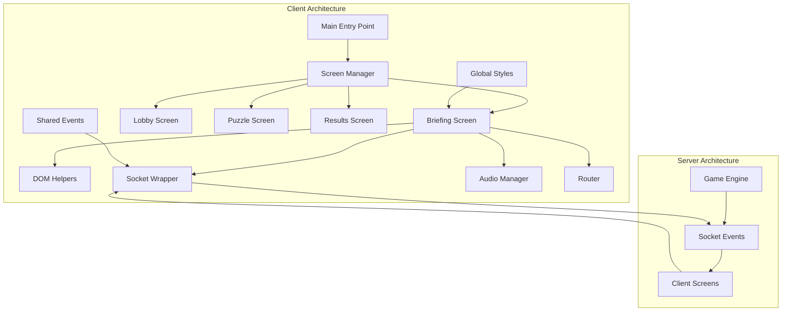
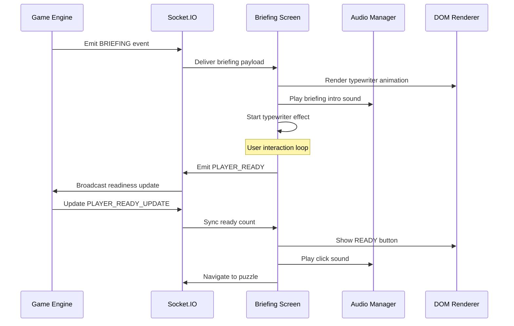
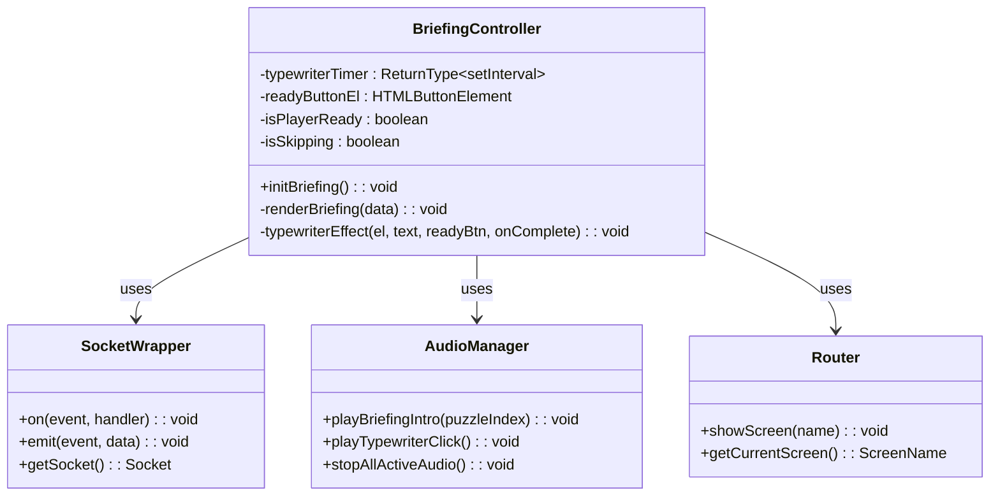
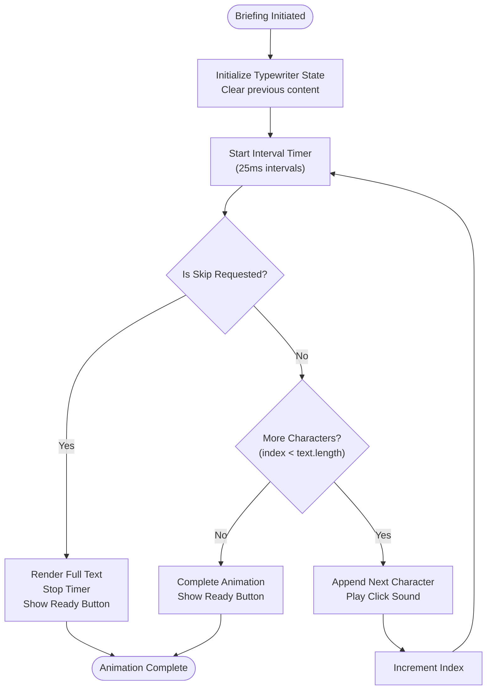
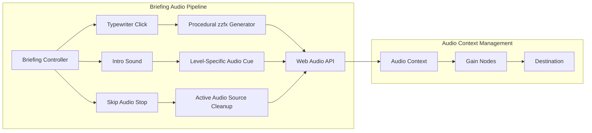
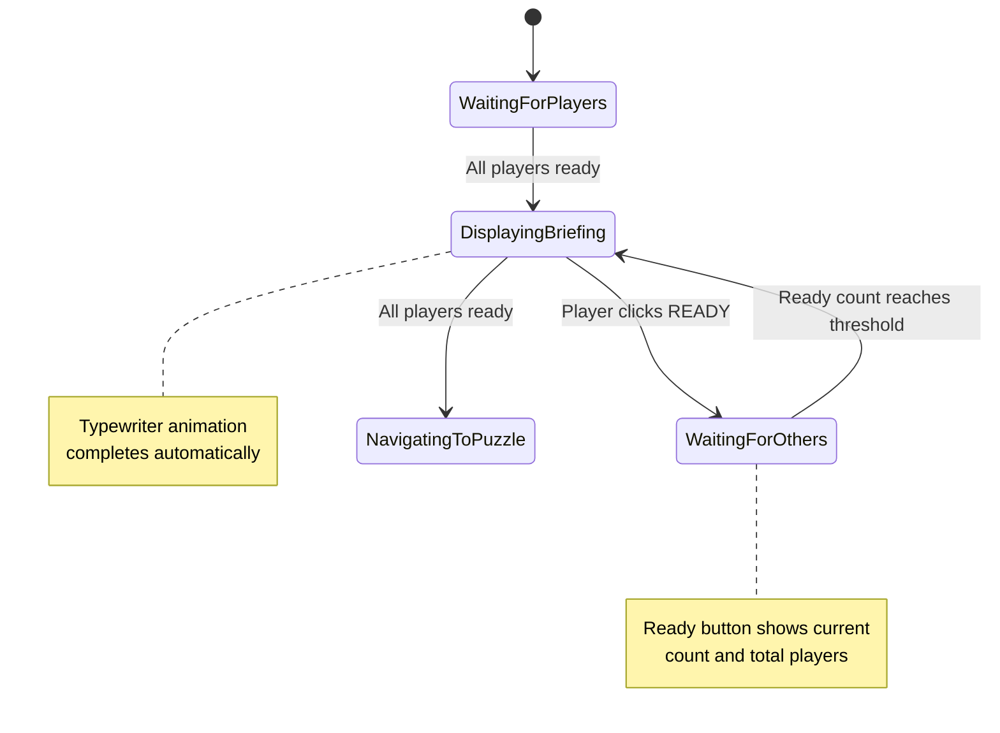
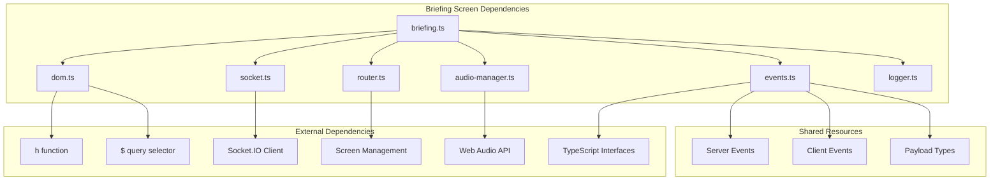

# Briefing Screen

<cite>
**Referenced Files in This Document**
- [briefing.ts](file://src/client/screens/briefing.ts)
- [events.ts](file://shared/events.ts)
- [socket.ts](file://src/client/lib/socket.ts)
- [router.ts](file://src/client/lib/router.ts)
- [dom.ts](file://src/client/lib/dom.ts)
- [audio-manager.ts](file://src/client/audio/audio-manager.ts)
- [index.html](file://src/client/index.html)
- [main.ts](file://src/client/main.ts)
- [game-engine.ts](file://src/server/services/game-engine.ts)
- [style.css](file://src/client/styles/style.css)
- [theme-engine.ts](file://src/client/lib/theme-engine.ts)
</cite>

## Table of Contents
1. [Introduction](#introduction)
2. [Project Structure](#project-structure)
3. [Core Components](#core-components)
4. [Architecture Overview](#architecture-overview)
5. [Detailed Component Analysis](#detailed-component-analysis)
6. [Dependency Analysis](#dependency-analysis)
7. [Performance Considerations](#performance-considerations)
8. [Troubleshooting Guide](#troubleshooting-guide)
9. [Conclusion](#conclusion)

## Introduction

The Briefing Screen is a crucial component of Project ODYSSEY's co-op escape room experience. It serves as the narrative bridge between the level introduction and individual puzzle gameplay, delivering mission-specific story content through an immersive typewriter animation effect. This screen transforms raw storytelling into an interactive, cinematic experience that prepares players for the challenges ahead while maintaining the game's signature cyberpunk aesthetic.

The briefing screen operates within a sophisticated real-time architecture where server-side game state drives client-side presentation, creating seamless transitions between different phases of the escape room experience. Its implementation demonstrates advanced front-end engineering principles including reactive UI updates, audio synchronization, and responsive design patterns.

## Project Structure

The Briefing Screen is part of Project ODYSSEY's modular client architecture, designed with clear separation of concerns and reusable components:

**Diagram sources**
- [main.ts](file://src/client/main.ts#L36-L72)
- [briefing.ts](file://src/client/screens/briefing.ts#L17-L31)
- [router.ts](file://src/client/lib/router.ts#L10-L12)

The briefing screen integrates with several key architectural components:

- **Screen Management**: Uses the centralized router system for seamless transitions
- **Real-time Communication**: Leverages Socket.io for live updates and coordination
- **Audio System**: Implements synchronized sound effects and ambient audio
- **Visual Effects**: Applies dynamic styling and theme management
- **Event System**: Responds to server-driven state changes

**Section sources**
- [main.ts](file://src/client/main.ts#L36-L72)
- [index.html](file://src/client/index.html#L24-L38)

## Core Components

The Briefing Screen implementation consists of several interconnected components that work together to deliver the complete user experience:

### Primary Components

| Component | Responsibility | Key Features |
|-----------|---------------|--------------|
| **Briefing Controller** | Manages screen lifecycle and user interactions | Event handling, state management, cleanup |
| **Typewriter Engine** | Creates animated text display | Character-by-character rendering, timing control |
| **Audio Coordinator** | Manages sound effects and background audio | Click sounds, narration, skip functionality |
| **Ready Button System** | Handles player readiness and coordination | Multiplayer synchronization, visual feedback |
| **Skip Mechanism** | Provides user control over pacing | Keyboard shortcuts, visual indicators |

### Supporting Infrastructure

The briefing screen relies on several supporting systems:

- **DOM Manipulation Layer**: Lightweight virtual DOM helpers for efficient rendering
- **Socket Communication**: Real-time event handling for multiplayer coordination
- **Theme Management**: Dynamic CSS loading for level-specific aesthetics
- **Audio Pipeline**: Web Audio API integration with procedural sound generation

**Section sources**
- [briefing.ts](file://src/client/screens/briefing.ts#L17-L31)
- [dom.ts](file://src/client/lib/dom.ts#L11-L44)
- [socket.ts](file://src/client/lib/socket.ts#L59-L65)

## Architecture Overview

The Briefing Screen operates within Project ODYSSEY's distributed architecture, connecting server-side game state with client-side presentation:

**Diagram sources**
- [game-engine.ts](file://src/server/services/game-engine.ts#L169-L199)
- [briefing.ts](file://src/client/screens/briefing.ts#L18-L30)
- [events.ts](file://shared/events.ts#L64-L70)

The architecture ensures real-time synchronization between all connected players, with the server maintaining authoritative game state while clients provide responsive, immersive experiences.

**Section sources**
- [game-engine.ts](file://src/server/services/game-engine.ts#L169-L199)
- [events.ts](file://shared/events.ts#L171-L182)

## Detailed Component Analysis

### Briefing Screen Controller

The Briefing Screen Controller serves as the central orchestrator for the entire briefing experience:

**Diagram sources**
- [briefing.ts](file://src/client/screens/briefing.ts#L17-L139)
- [socket.ts](file://src/client/lib/socket.ts#L59-L65)
- [audio-manager.ts](file://src/client/audio/audio-manager.ts#L215-L242)

The controller implements a stateful architecture that manages multiple concurrent processes:

1. **Event Listener Registration**: Sets up handlers for briefing initiation and readiness updates
2. **DOM Rendering Pipeline**: Creates and manages the complete screen structure
3. **Animation Coordination**: Synchronizes typewriter effects with audio feedback
4. **User Interaction Management**: Handles player readiness and skip functionality
5. **Resource Cleanup**: Ensures proper disposal of timers and event listeners

### Typewriter Animation System

The typewriter effect creates an immersive storytelling experience through carefully orchestrated character-by-character rendering:

**Diagram sources**
- [briefing.ts](file://src/client/screens/briefing.ts#L110-L139)

The animation system implements several sophisticated features:

- **Dynamic Timing Control**: 25ms intervals provide smooth, readable text progression
- **Audio Synchronization**: Each character triggers a procedurally generated click sound
- **Skip Mechanism**: Immediate text completion with visual feedback
- **Memory Management**: Proper timer cleanup prevents memory leaks

### Audio Integration Architecture

The audio system provides layered sound design that enhances the briefing experience:

**Diagram sources**
- [audio-manager.ts](file://src/client/audio/audio-manager.ts#L247-L252)
- [audio-manager.ts](file://src/client/audio/audio-manager.ts#L215-L242)
- [audio-manager.ts](file://src/client/audio/audio-manager.ts#L398-L406)

The audio system implements several key patterns:

- **Lazy Loading**: Audio resources are loaded on-demand to optimize performance
- **Context Management**: Proper Web Audio API initialization and resume handling
- **Procedural Generation**: zzfx-based sound synthesis for consistent audio quality
- **Resource Pooling**: Active audio source tracking for cleanup and memory management

### Multiplayer Coordination System

The briefing screen coordinates with multiple players through a sophisticated readiness synchronization mechanism:

**Diagram sources**
- [briefing.ts](file://src/client/screens/briefing.ts#L25-L30)
- [events.ts](file://shared/events.ts#L179-L182)

The multiplayer system ensures coordinated gameplay through:

- **Real-time Updates**: Live synchronization of readiness counts
- **Visual Feedback**: Dynamic button text reflecting current game state
- **State Consistency**: Prevents premature navigation to puzzle screens
- **Graceful Degradation**: Handles partial readiness scenarios

**Section sources**
- [briefing.ts](file://src/client/screens/briefing.ts#L17-L139)
- [events.ts](file://shared/events.ts#L171-L182)

## Dependency Analysis

The Briefing Screen maintains a clean dependency graph that promotes modularity and testability:

**Diagram sources**
- [briefing.ts](file://src/client/screens/briefing.ts#L5-L10)
- [dom.ts](file://src/client/lib/dom.ts#L11-L44)
- [socket.ts](file://src/client/lib/socket.ts#L5-L7)

The dependency structure follows SOLID principles:

- **Single Responsibility**: Each module has a focused purpose
- **Dependency Inversion**: High-level modules depend on abstractions
- **Interface Segregation**: Clients depend only on required functionality
- **Open/Closed**: Easy to extend without modifying existing code

**Section sources**
- [briefing.ts](file://src/client/screens/briefing.ts#L5-L10)
- [dom.ts](file://src/client/lib/dom.ts#L11-L44)

## Performance Considerations

The Briefing Screen implementation incorporates several performance optimization strategies:

### Memory Management
- **Timer Cleanup**: Proper interval clearing prevents memory leaks
- **Event Listener Management**: Automatic cleanup of keyboard and socket handlers
- **DOM Element Tracking**: Centralized reference management for interactive elements

### Rendering Optimization
- **Efficient DOM Updates**: Batched DOM operations minimize reflows
- **CSS Transitions**: Hardware-accelerated animations for smooth performance
- **Conditional Rendering**: Elements only rendered when needed

### Network Efficiency
- **Event-Driven Updates**: Minimal polling reduces network overhead
- **Payload Optimization**: Compact briefing data structures
- **Connection Resilience**: Automatic reconnection handling

### Audio Performance
- **Lazy Loading**: Audio resources loaded on demand
- **Context Management**: Proper audio context initialization
- **Resource Pooling**: Active audio source tracking for cleanup

**Section sources**
- [briefing.ts](file://src/client/screens/briefing.ts#L110-L139)
- [audio-manager.ts](file://src/client/audio/audio-manager.ts#L398-L406)

## Troubleshooting Guide

Common issues and their solutions when working with the Briefing Screen:

### Audio Issues
**Problem**: Typewriter sounds not playing
**Solution**: Verify audio context initialization and user gesture requirements
- Check browser autoplay policies
- Ensure proper resumeContext() call on first interaction
- Verify zzfx library availability

**Problem**: Briefing intro audio not playing
**Solution**: Validate audio cue configuration and file paths
- Confirm level configuration includes audio_cues
- Verify asset paths match actual file locations
- Check console for audio loading errors

### Network Connectivity
**Problem**: Briefing screen not displaying
**Solution**: Verify socket connection and event handling
- Check server connectivity logs
- Verify BRIEFING event emission
- Ensure client-side event listeners are registered

**Problem**: Ready button not responding
**Solution**: Debug multiplayer synchronization
- Verify PLAYER_READY_UPDATE events
- Check player ID assignment
- Confirm server-side readiness tracking

### Rendering Issues
**Problem**: Typewriter animation not working
**Solution**: Inspect DOM manipulation and CSS
- Verify element selectors are correct
- Check CSS animation classes
- Ensure proper screen activation

**Problem**: Screen not transitioning
**Solution**: Debug router and navigation
- Verify showScreen() calls
- Check screen element existence
- Confirm proper event flow

### Performance Issues
**Problem**: Stuttering animations
**Solution**: Optimize timing and resource usage
- Adjust typewriter interval timing
- Implement requestAnimationFrame where appropriate
- Monitor memory usage with browser developer tools

**Section sources**
- [briefing.ts](file://src/client/screens/briefing.ts#L17-L31)
- [socket.ts](file://src/client/lib/socket.ts#L14-L41)
- [audio-manager.ts](file://src/client/audio/audio-manager.ts#L33-L54)

## Conclusion

The Briefing Screen represents a sophisticated implementation of real-time, multiplayer storytelling within a cyberpunk escape room experience. Its architecture demonstrates advanced front-end engineering principles while maintaining the technical simplicity required for reliable operation in distributed environments.

The screen successfully balances immersion with responsiveness, providing players with engaging narrative content while maintaining the technical foundation necessary for seamless multiplayer coordination. The implementation showcases effective use of modern web technologies including Web Audio API, Socket.io, and vanilla JavaScript DOM manipulation.

Key achievements include:
- Seamless real-time synchronization across multiple players
- Immersive audio-visual storytelling through procedural sound generation
- Efficient resource management and memory optimization
- Clean architectural boundaries promoting maintainability
- Responsive design patterns supporting various screen sizes

The Briefing Screen serves as both a functional component and a demonstration of how complex interactive experiences can be built using fundamental web technologies while maintaining high standards for performance, reliability, and user experience.