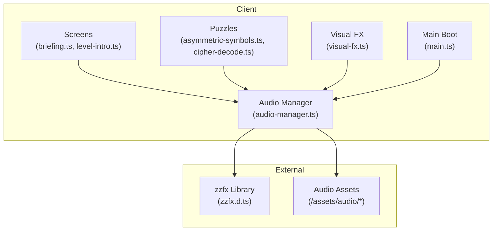
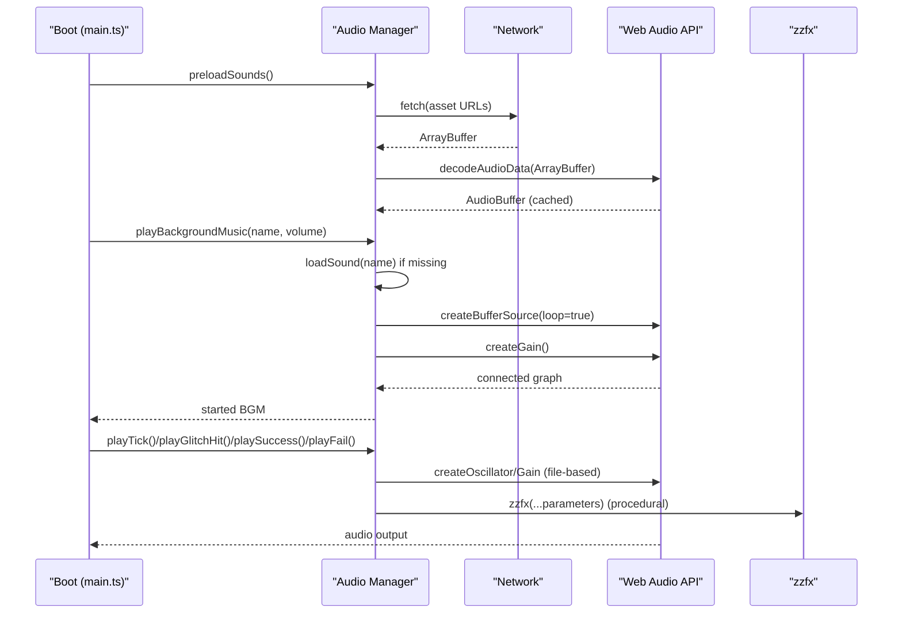
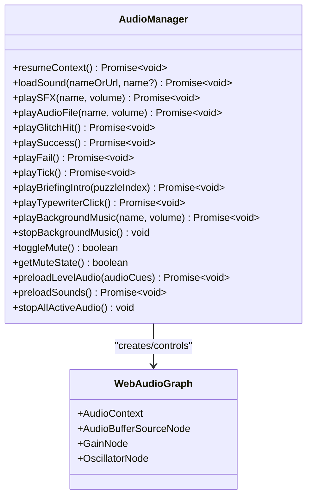
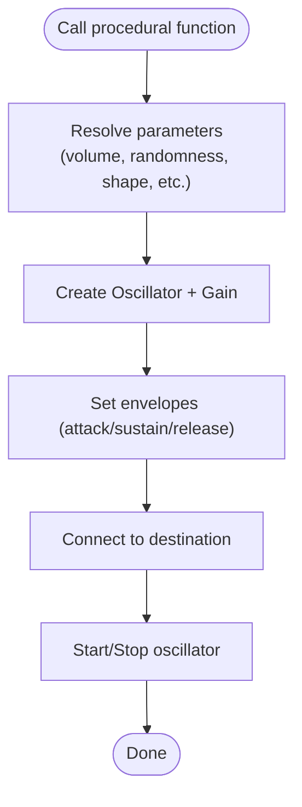
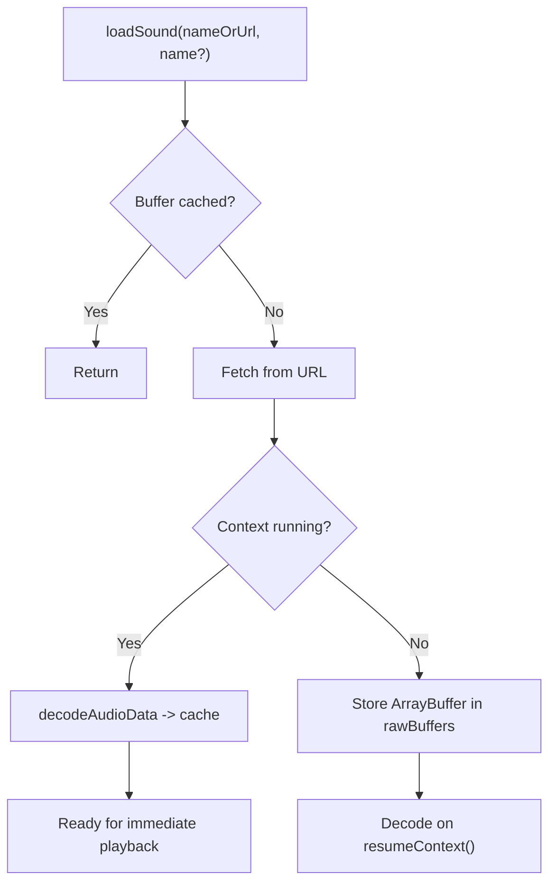
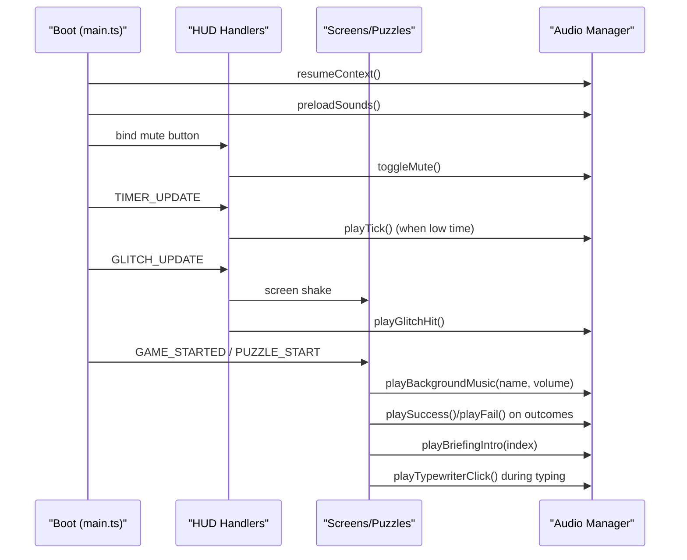
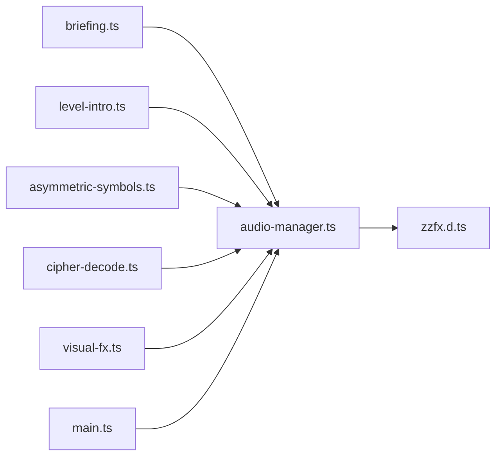

# Audio System

<cite>
**Referenced Files in This Document**
- [audio-manager.ts](file://src/client/audio/audio-manager.ts)
- [main.ts](file://src/client/main.ts)
- [briefing.ts](file://src/client/screens/briefing.ts)
- [level-intro.ts](file://src/client/screens/level-intro.ts)
- [asymmetric-symbols.ts](file://src/client/puzzles/asymmetric-symbols.ts)
- [cipher-decode.ts](file://src/client/puzzles/cipher-decode.ts)
- [visual-fx.ts](file://src/client/lib/visual-fx.ts)
- [zzfx.d.ts](file://src/client/types/zzfx.d.ts)
</cite>

## Table of Contents
1. [Introduction](#introduction)
2. [Project Structure](#project-structure)
3. [Core Components](#core-components)
4. [Architecture Overview](#architecture-overview)
5. [Detailed Component Analysis](#detailed-component-analysis)
6. [Dependency Analysis](#dependency-analysis)
7. [Performance Considerations](#performance-considerations)
8. [Troubleshooting Guide](#troubleshooting-guide)
9. [Conclusion](#conclusion)
10. [Appendices](#appendices)

## Introduction
This document describes the audio system for the escape room game, covering sound effects, background music, and procedural audio generation. It explains the Web Audio API integration, sound loading and playback controls, volume management, and the procedural audio pipeline using zzfx. It also documents asset management, preloading strategies, fallback mechanisms, integration with game events, audio state synchronization, user preferences, mute functionality, audio context management, and performance optimization techniques. Finally, it provides guidelines for adding new sound effects and creating custom audio experiences.

## Project Structure
The audio system is implemented as a single module that wraps the Web Audio API and integrates with game screens and puzzles. Key elements:
- Central audio manager module handles audio context lifecycle, buffering, playback, and procedural synthesis.
- Screens and puzzles import and invoke audio functions for gameplay events.
- Procedural audio leverages zzfx for dynamic sound generation.
- Asset discovery is handled via a dedicated assets directory and public distribution paths.

**Diagram sources**
- [audio-manager.ts](file://src/client/audio/audio-manager.ts#L1-L407)
- [briefing.ts](file://src/client/screens/briefing.ts#L1-L135)
- [level-intro.ts](file://src/client/screens/level-intro.ts#L1-L125)
- [asymmetric-symbols.ts](file://src/client/puzzles/asymmetric-symbols.ts#L1-L221)
- [cipher-decode.ts](file://src/client/puzzles/cipher-decode.ts#L1-L152)
- [visual-fx.ts](file://src/client/lib/visual-fx.ts#L1-L112)
- [main.ts](file://src/client/main.ts#L1-L266)
- [zzfx.d.ts](file://src/client/types/zzfx.d.ts#L1-L4)

**Section sources**
- [audio-manager.ts](file://src/client/audio/audio-manager.ts#L1-L407)
- [main.ts](file://src/client/main.ts#L1-L266)

## Core Components
- Audio Manager: Provides Web Audio API integration, sound loading, playback, and procedural synthesis. Manages audio context lifecycle, buffering, gain nodes, and mute state.
- Procedural Audio: Uses zzfx for dynamic sound generation (glitch hits, typing clicks, puzzle briefings).
- Game Integration: Screens and puzzles trigger audio on events such as timer warnings, glitch increases, puzzle completion, and narrative sequences.
- Asset Management: Loads audio files from a dedicated assets path and caches decoded buffers for reuse.

Key responsibilities:
- Context management and resume on first user interaction.
- Deferred decoding until context is running.
- Gain control for background music, SFX, and narration.
- Mute toggle persisted in local storage.
- Preloading of common and level-specific audio cues.
- Stopping active audio sources and background music cleanly.

**Section sources**
- [audio-manager.ts](file://src/client/audio/audio-manager.ts#L1-L407)
- [zzfx.d.ts](file://src/client/types/zzfx.d.ts#L1-L4)

## Architecture Overview
The audio system orchestrates three primary pathways:
- File-based SFX and narration: Fetches audio files, decodes them into buffers, and plays them through the Web Audio graph.
- Background music: Loops a buffered track with adjustable gain and seamless switching between tracks.
- Procedural audio: Generates waveforms dynamically using zzfx parameters for real-time, parameterized sounds.

**Diagram sources**
- [main.ts](file://src/client/main.ts#L16-L33)
- [audio-manager.ts](file://src/client/audio/audio-manager.ts#L59-L85)
- [audio-manager.ts](file://src/client/audio/audio-manager.ts#L259-L293)
- [audio-manager.ts](file://src/client/audio/audio-manager.ts#L118-L137)
- [audio-manager.ts](file://src/client/audio/audio-manager.ts#L142-L187)
- [audio-manager.ts](file://src/client/audio/audio-manager.ts#L192-L210)
- [audio-manager.ts](file://src/client/audio/audio-manager.ts#L215-L242)
- [audio-manager.ts](file://src/client/audio/audio-manager.ts#L247-L252)

## Detailed Component Analysis

### Audio Manager Implementation
The audio manager encapsulates:
- Audio context creation and resume on first user interaction.
- Deferred decoding of fetched audio buffers until the context is running.
- Buffer caching keyed by sound name for reuse.
- Gain nodes for background music, SFX, and narration.
- Mute state toggled globally with smooth gain transitions.
- Procedural synthesis via zzfx for dynamic sounds.
- Preloading helpers for common and level-specific audio cues.
- Utility to stop all active audio sources while preserving background music.

**Diagram sources**
- [audio-manager.ts](file://src/client/audio/audio-manager.ts#L23-L28)
- [audio-manager.ts](file://src/client/audio/audio-manager.ts#L90-L113)
- [audio-manager.ts](file://src/client/audio/audio-manager.ts#L259-L293)
- [audio-manager.ts](file://src/client/audio/audio-manager.ts#L310-L327)

**Section sources**
- [audio-manager.ts](file://src/client/audio/audio-manager.ts#L1-L407)

### Procedural Audio with zzfx
Procedural audio is implemented using zzfx parameters to synthesize dynamic sounds:
- Glitch hit: sawtooth oscillator with exponential frequency sweep and envelope.
- Typewriter click: randomized high-frequency click with tremolo and bit crush.
- Puzzle briefing tones: preset parameter sets mapped to puzzle stages.
- Timer tick: short sine tone for countdown warnings.
- Success/failure chimes: multi-tone sequences for feedback.

**Diagram sources**
- [audio-manager.ts](file://src/client/audio/audio-manager.ts#L118-L137)
- [audio-manager.ts](file://src/client/audio/audio-manager.ts#L215-L242)
- [audio-manager.ts](file://src/client/audio/audio-manager.ts#L247-L252)
- [audio-manager.ts](file://src/client/audio/audio-manager.ts#L192-L210)
- [audio-manager.ts](file://src/client/audio/audio-manager.ts#L142-L187)

**Section sources**
- [audio-manager.ts](file://src/client/audio/audio-manager.ts#L118-L252)
- [zzfx.d.ts](file://src/client/types/zzfx.d.ts#L1-L4)

### Sound Asset Management and Preloading
- Asset discovery: Sounds are resolved from a base assets path and can be referenced by URL or filename.
- Deferred decoding: Raw buffers are stored until the audio context is running; decoding occurs on resume.
- Caching: Decoded buffers are cached by name for fast reuse.
- Preloading:
  - Common SFX: Preloaded at boot to reduce latency.
  - Level-specific cues: Preloaded per level using a mapping of cue identifiers to URLs.
- Fallbacks: On load failures, warnings are logged and subsequent playback attempts are skipped.

**Diagram sources**
- [audio-manager.ts](file://src/client/audio/audio-manager.ts#L59-L85)
- [audio-manager.ts](file://src/client/audio/audio-manager.ts#L33-L54)

**Section sources**
- [audio-manager.ts](file://src/client/audio/audio-manager.ts#L59-L85)
- [audio-manager.ts](file://src/client/audio/audio-manager.ts#L33-L54)

### Integration with Game Events and Screens
- Boot and HUD:
  - Resumes audio on first user interaction.
  - Preloads common sounds.
  - Mute button toggles global mute state and updates icon.
  - Timer warnings trigger periodic ticks when time is low.
  - Glitch increases trigger procedural glitch hits and screen shake.
  - Theme and background music are applied on game start and puzzle start.
- Briefing screen:
  - Plays typewriter click sounds during the typewriter effect.
  - Stops active audio when skipping.
  - Plays puzzle briefing intro tones based on puzzle index.
- Level intro:
  - Loads and plays level intro audio in parallel with the typewriter effect.
  - Stops active audio on continue.
- Puzzles:
  - Success and failure sounds are triggered on puzzle completion outcomes.
  - Visual FX triggers procedural glitch hits in sync with visual glitches.

**Diagram sources**
- [main.ts](file://src/client/main.ts#L47-L210)
- [briefing.ts](file://src/client/screens/briefing.ts#L96-L134)
- [level-intro.ts](file://src/client/screens/level-intro.ts#L65-L91)
- [asymmetric-symbols.ts](file://src/client/puzzles/asymmetric-symbols.ts#L199-L210)
- [cipher-decode.ts](file://src/client/puzzles/cipher-decode.ts#L148-L151)
- [visual-fx.ts](file://src/client/lib/visual-fx.ts#L80-L90)

**Section sources**
- [main.ts](file://src/client/main.ts#L47-L210)
- [briefing.ts](file://src/client/screens/briefing.ts#L1-L135)
- [level-intro.ts](file://src/client/screens/level-intro.ts#L1-L125)
- [asymmetric-symbols.ts](file://src/client/puzzles/asymmetric-symbols.ts#L1-L221)
- [cipher-decode.ts](file://src/client/puzzles/cipher-decode.ts#L1-L152)
- [visual-fx.ts](file://src/client/lib/visual-fx.ts#L1-L112)

## Dependency Analysis
- Internal dependencies:
  - Screens and puzzles depend on the audio manager for playback.
  - Visual FX depends on the audio manager for glitch hits.
  - Main boot depends on the audio manager for initialization and HUD integration.
- External dependencies:
  - zzfx is typed via a declaration module and used for procedural synthesis.
  - Web Audio API provides the underlying audio graph.

**Diagram sources**
- [audio-manager.ts](file://src/client/audio/audio-manager.ts#L1-L407)
- [briefing.ts](file://src/client/screens/briefing.ts#L1-L135)
- [level-intro.ts](file://src/client/screens/level-intro.ts#L1-L125)
- [asymmetric-symbols.ts](file://src/client/puzzles/asymmetric-symbols.ts#L1-L221)
- [cipher-decode.ts](file://src/client/puzzles/cipher-decode.ts#L1-L152)
- [visual-fx.ts](file://src/client/lib/visual-fx.ts#L1-L112)
- [main.ts](file://src/client/main.ts#L1-L266)
- [zzfx.d.ts](file://src/client/types/zzfx.d.ts#L1-L4)

**Section sources**
- [audio-manager.ts](file://src/client/audio/audio-manager.ts#L1-L407)
- [main.ts](file://src/client/main.ts#L1-L266)

## Performance Considerations
- Deferred decoding: Raw buffers are stored and decoded only after the audio context resumes, avoiding blocking on initial load.
- Buffer reuse: Decoded buffers are cached by name to prevent repeated decoding and network fetches.
- Gain smoothing: Mute/unmute transitions use smooth gain targeting to avoid audible clicks.
- Active source cleanup: Active audio sources are tracked and cleaned up to prevent resource leaks.
- Procedural synthesis: zzfx-generated sounds avoid asset fetching overhead and enable parameterized effects.
- Preloading: Common and level-specific audio is preloaded to minimize latency during gameplay.

[No sources needed since this section provides general guidance]

## Troubleshooting Guide
Common issues and resolutions:
- Audio does not play on first interaction:
  - Ensure a user gesture occurs to resume the context before invoking any audio functions.
  - Verify that resume is called on mousedown or keydown events.
- Sounds fail to load:
  - Check asset URLs and paths; ensure assets are served from the expected assets directory.
  - Inspect logs for fetch errors and verify network accessibility.
- Background music does not loop:
  - Confirm that the buffer is set and loop is enabled before starting playback.
- Mute state not persisting:
  - Verify local storage writes and reads for the mute preference.
- Procedural sounds not audible:
  - Validate zzfx parameter sets and ensure the audio context is resumed before calling procedural functions.

**Section sources**
- [audio-manager.ts](file://src/client/audio/audio-manager.ts#L33-L54)
- [audio-manager.ts](file://src/client/audio/audio-manager.ts#L259-L293)
- [audio-manager.ts](file://src/client/audio/audio-manager.ts#L310-L327)
- [main.ts](file://src/client/main.ts#L47-L88)

## Conclusion
The audio system provides a robust, modular foundation for sound effects, background music, and procedural audio generation. It integrates seamlessly with game screens and puzzles, manages audio resources efficiently, and offers responsive user controls. The design supports extensibility for new sounds and custom audio experiences while maintaining performance and reliability.

[No sources needed since this section summarizes without analyzing specific files]

## Appendices

### Adding New Sound Effects
Steps to add a new sound effect:
- Place the audio file in the assets directory and ensure it is served under the assets path.
- Preload the sound during boot or on the relevant screen initialization.
- Invoke the appropriate playback function when the event occurs.
- If the sound is short and frequently reused, consider procedural synthesis via zzfx for lower latency.

Guidelines:
- Use descriptive filenames and consistent naming conventions.
- Keep file formats compatible with the browser’s audio decoder.
- Prefer shorter samples for UI feedback to minimize latency.

**Section sources**
- [audio-manager.ts](file://src/client/audio/audio-manager.ts#L351-L361)
- [audio-manager.ts](file://src/client/audio/audio-manager.ts#L59-L85)
- [main.ts](file://src/client/main.ts#L64-L66)

### Creating Custom Audio Experiences with zzfx
To create custom procedural sounds:
- Determine the desired waveform, envelope, and effects (noise, tremolo, bit crush).
- Map parameters to puzzle or gameplay contexts for consistent identity.
- Use the provided procedural functions as templates for new sounds.

Best practices:
- Keep parameter sets small and meaningful for maintainability.
- Test across devices to ensure perceptible differences.
- Use randomized parameters sparingly to preserve consistency.

**Section sources**
- [audio-manager.ts](file://src/client/audio/audio-manager.ts#L215-L242)
- [audio-manager.ts](file://src/client/audio/audio-manager.ts#L247-L252)
- [zzfx.d.ts](file://src/client/types/zzfx.d.ts#L1-L4)