# Client Application

<cite>
**Referenced Files in This Document**
- [main.ts](file://src/client/main.ts)
- [index.html](file://src/client/index.html)
- [router.ts](file://src/client/lib/router.ts)
- [socket.ts](file://src/client/lib/socket.ts)
- [dom.ts](file://src/client/lib/dom.ts)
- [theme-engine.ts](file://src/client/lib/theme-engine.ts)
- [visual-fx.ts](file://src/client/lib/visual-fx.ts)
- [i18n.ts](file://src/client/lib/i18n.ts)
- [language-selector.ts](file://src/client/components/language-selector.ts)
- [lobby.ts](file://src/client/screens/lobby.ts)
- [puzzle.ts](file://src/client/screens/puzzle.ts)
- [audio-manager.ts](file://src/client/audio/audio-manager.ts)
- [events.ts](file://shared/events.ts)
- [types.ts](file://shared/types.ts)
- [en.ts](file://src/client/locales/en.ts)
- [el.ts](file://src/client/locales/el.ts)
- [style.css](file://src/client/styles/style.css)
- [glitch.css](file://src/client/styles/glitch.css)
- [vite.config.ts](file://vite.config.ts)
- [package.json](file://package.json)
- [ARCHITECTURE.md](file://ARCHITECTURE.md)
- [README.md](file://README.md)
</cite>

## Update Summary
**Changes Made**
- Enhanced glitch recording system with detailed logging for GLITCH_UPDATE events, allowing real-time tracking of glitch state changes during gameplay
- Improved server-side logging with comprehensive glitch state information including old values, deltas, and room context
- Enhanced client-side logging for real-time glitch event monitoring and debugging
- Added detailed glitch state persistence logging with error handling and recovery mechanisms

## Table of Contents
1. [Introduction](#introduction)
2. [Project Structure](#project-structure)
3. [Core Components](#core-components)
4. [Architecture Overview](#architecture-overview)
5. [Detailed Component Analysis](#detailed-component-analysis)
6. [Enhanced Glitch Recording System](#enhanced-glitch-recording-system)
7. [Help System Implementation](#help-system-implementation)
8. [Internationalization System](#internationalization-system)
9. [Dependency Analysis](#dependency-analysis)
10. [Performance Considerations](#performance-considerations)
11. [Troubleshooting Guide](#troubleshooting-guide)
12. [Conclusion](#conclusion)
13. [Appendices](#appendices)

## Introduction
This document describes the client-side application architecture and implementation powering the Project ODYSSEY escape room experience. The client is a Vite-powered, vanilla TypeScript and CSS application that renders five screens (Lobby, Level Intro, Briefing, Puzzle, Results), synchronizes state via Socket.IO, delivers immersive visuals and audio, and now features an enhanced glitch recording system with detailed logging for real-time tracking of glitch state changes during gameplay. It avoids frameworks, relying on lightweight DOM helpers, a minimal router, a typed Socket.IO wrapper, a theme engine, procedural audio generation, and a robust help system with tooltips and modal panels.

## Project Structure
The client is organized around a small set of core modules with enhanced glitch monitoring capabilities and comprehensive user guidance:
- Entry point and orchestration: main.ts with i18n initialization and project title
- Internationalization: lib/i18n.ts with language detection and translation services
- Language selector: components/language-selector.ts for runtime language switching
- Routing and screen management: lib/router.ts
- DOM helpers: lib/dom.ts
- Socket.IO wrapper: lib/socket.ts
- Theme engine: lib/theme-engine.ts
- Visual FX: lib/visual-fx.ts
- Screens: screens/lobby.ts (enhanced with help system), screens/level-intro.ts, screens/briefing.ts, screens/puzzle.ts, screens/results.ts
- Audio manager: audio/audio-manager.ts with enhanced glitch hit sounds
- Localization files: locales/en.ts, locales/el.ts
- Shared contracts: shared/events.ts, shared/types.ts
- Build and dev server: vite.config.ts, package.json
- Styling: comprehensive CSS with glitch effects and help panel styles

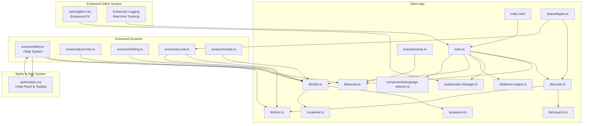
```mermaid
graph TB
subgraph "Client App"
HTML["index.html"]
MAIN["main.ts"]
ROUTER["lib/router.ts"]
DOM["lib/dom.ts"]
SOCKET["lib/socket.ts"]
THEME["lib/theme-engine.ts"]
FX["lib/visual-fx.ts"]
AUDIO["audio/audio-manager.ts"]
I18N["lib/i18n.ts"]
LANGSEL["components/language-selector.ts"]
EN["locales/en.ts"]
EL["locales/el.ts"]
SHARED_EVENTS["shared/events.ts"]
SHARED_TYPES["shared/types.ts"]
end
subgraph "Enhanced Screens"
LOBBY["screens/lobby.ts<br/>+Help System"]
LEVELINTRO["screens/level-intro.ts"]
BRIEFING["screens/briefing.ts"]
PUZZLE["screens/puzzle.ts"]
RESULTS["screens/results.ts"]
end
subgraph "Enhanced Glitch System"
GLITCH_CSS["styles/glitch.css<br/>Enhanced FX"]
GLITCH_LOGGER["Enhanced Logging<br/>Real-time Tracking"]
end
subgraph "Styles & Help System"
STYLE["styles/style.css<br/>+Help Panel & Tooltips"]
end
HTML --> MAIN
MAIN --> ROUTER
MAIN --> SOCKET
MAIN --> AUDIO
MAIN --> THEME
MAIN --> I18N
MAIN --> LANGSEL
ROUTER --> FX
ROUTER --> DOM
PUZZLE --> DOM
LOBBY --> SOCKET
LOBBY --> DOM
LOBBY --> STYLE
LEVELINTRO --> I18N
BRIEFING --> I18N
PUZZLE --> I18N
RESULTS --> I18N
I18N --> EN
I18N --> EL
SHARED_EVENTS --> SOCKET
SHARED_TYPES --> ROUTER
SHARED_TYPES --> PUZZLE
STYLE --> LOBBY
GLITCH_CSS --> AUDIO
GLITCH_LOGGER --> MAIN
```

**Diagram sources**
- [index.html](file://src/client/index.html#L1-L69)
- [main.ts](file://src/client/main.ts#L1-L267)
- [router.ts](file://src/client/lib/router.ts#L1-L57)
- [socket.ts](file://src/client/lib/socket.ts#L1-L85)
- [dom.ts](file://src/client/lib/dom.ts#L1-L73)
- [theme-engine.ts](file://src/client/lib/theme-engine.ts#L1-L51)
- [visual-fx.ts](file://src/client/lib/visual-fx.ts#L1-L112)
- [audio-manager.ts](file://src/client/audio/audio-manager.ts#L1-L407)
- [i18n.ts](file://src/client/lib/i18n.ts#L1-L165)
- [language-selector.ts](file://src/client/components/language-selector.ts#L1-L94)
- [en.ts](file://src/client/locales/en.ts#L1-L211)
- [el.ts](file://src/client/locales/el.ts#L1-L211)
- [lobby.ts](file://src/client/screens/lobby.ts#L1-L482)
- [glitch.css](file://src/client/styles/glitch.css#L1-L421)
- [style.css](file://src/client/styles/style.css#L277-L526)

**Section sources**
- [ARCHITECTURE.md](file://ARCHITECTURE.md#L68-L107)
- [vite.config.ts](file://vite.config.ts#L1-L44)
- [package.json](file://package.json#L1-L41)

## Core Components
- Entry point and bootstrapper: Initializes audio, i18n service, connects to the server, preloads sounds, initializes screens, wires HUD updates, and exposes developer utilities with project branding.
- Internationalization service: I18nService provides language detection, translation loading, parameter substitution, and fallback mechanisms.
- Language selector component: Provides runtime language switching with persistent storage and page reload integration.
- Router: Manages screen visibility and toggles visual FX during puzzle screens.
- DOM helpers: Provides element creation, selection, mounting, and clearing utilities.
- Socket wrapper: Typed wrapper around Socket.IO with connection lifecycle logging and safe emit/on/off.
- Theme engine: Dynamically applies/removes themed CSS files per level.
- Visual FX: Randomly triggers glitch effects during puzzle screens with enhanced intensity tracking.
- Audio manager: Web Audio API-based SFX and background music, with procedural sound generation via zzfx and enhanced glitch hit sounds.
- Screens: Lobby, Level Intro, Briefing, Puzzle, Results, each with initialization and rendering logic using localized content.
- **Enhanced Glitch Recording System**: Comprehensive logging infrastructure for real-time glitch state monitoring and debugging.
- **Enhanced Help System**: Comprehensive user guidance with tooltips and modal help panels integrated into lobby screen.

**Section sources**
- [main.ts](file://src/client/main.ts#L47-L267)
- [i18n.ts](file://src/client/lib/i18n.ts#L12-L165)
- [language-selector.ts](file://src/client/components/language-selector.ts#L8-L94)
- [router.ts](file://src/client/lib/router.ts#L10-L56)
- [dom.ts](file://src/client/lib/dom.ts#L8-L72)
- [socket.ts](file://src/client/lib/socket.ts#L11-L85)
- [theme-engine.ts](file://src/client/lib/theme-engine.ts#L9-L50)
- [visual-fx.ts](file://src/client/lib/visual-fx.ts#L19-L112)
- [audio-manager.ts](file://src/client/audio/audio-manager.ts#L23-L407)
- [glitch.css](file://src/client/styles/glitch.css#L1-L421)
- [lobby.ts](file://src/client/screens/lobby.ts#L46-L82)
- [puzzle.ts](file://src/client/screens/puzzle.ts#L23-L34)

## Architecture Overview
The client follows a reactive, event-driven pattern with comprehensive internationalization support, enhanced glitch monitoring, and improved user guidance:
- The server emits typed events (e.g., game phase changes, puzzle updates, glitch state changes).
- The client's Socket.IO wrapper receives and logs events with enhanced glitch state tracking.
- The main bootstrapper initializes i18n service, updates HUD with localized labels, and orchestrates screen transitions.
- The router switches visible screens and manages visual FX.
- The theme engine applies level-specific CSS.
- The audio manager plays SFX and background music, and generates procedural sounds with enhanced glitch effects.
- The i18n service provides translation services with automatic language detection and fallback mechanisms.
- **Enhanced Glitch Recording System**: Comprehensive logging infrastructure tracks glitch state changes in real-time with detailed metadata for debugging and monitoring.
- **Enhanced Help System**: The lobby screen now provides contextual tooltips and modal help panels to improve user onboarding experience.

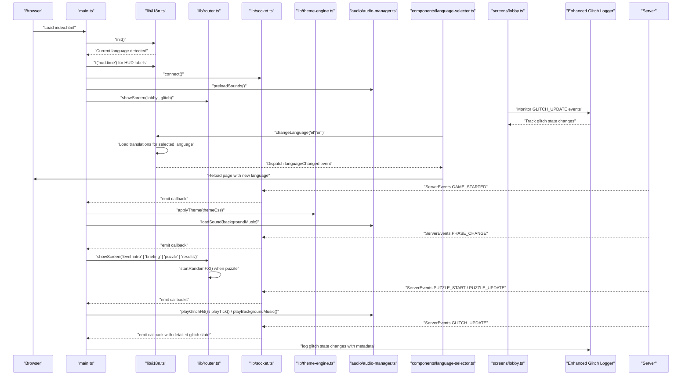
```mermaid
sequenceDiagram
participant Browser as "Browser"
participant Main as "main.ts"
participant I18n as "lib/i18n.ts"
participant Router as "lib/router.ts"
participant Socket as "lib/socket.ts"
participant Theme as "lib/theme-engine.ts"
participant Audio as "audio/audio-manager.ts"
participant LangSel as "components/language-selector.ts"
participant Lobby as "screens/lobby.ts"
participant GlitchLogger as "Enhanced Glitch Logger"
participant Server as "Server"
Browser->>Main : "Load index.html"
Main->>I18n : "init()"
I18n-->>Main : "Current language detected"
Main->>I18n : "t('hud.time') for HUD labels"
Main->>Socket : "connect()"
Main->>Audio : "preloadSounds()"
Main->>Router : "showScreen('lobby', glitch)"
Lobby->>GlitchLogger : "Monitor GLITCH_UPDATE events"
GlitchLogger-->>Lobby : "Track glitch state changes"
LangSel->>I18n : "changeLanguage('el'|'en')"
I18n->>I18n : "Load translations for selected language"
I18n-->>LangSel : "Dispatch languageChanged event"
LangSel->>Browser : "Reload page with new language"
Server-->>Socket : "ServerEvents.GAME_STARTED"
Socket-->>Main : "emit callback"
Main->>Theme : "applyTheme(themeCss)"
Main->>Audio : "loadSound(backgroundMusic)"
Server-->>Socket : "ServerEvents.PHASE_CHANGE"
Socket-->>Main : "emit callback"
Main->>Router : "showScreen('level-intro' | 'briefing' | 'puzzle' | 'results')"
Router->>Router : "startRandomFX() when puzzle"
Server-->>Socket : "ServerEvents.PUZZLE_START / PUZZLE_UPDATE"
Socket-->>Main : "emit callbacks"
Main->>Audio : "playGlitchHit() / playTick() / playBackgroundMusic()"
Server-->>Socket : "ServerEvents.GLITCH_UPDATE"
Socket-->>Main : "emit callback with detailed glitch state"
Main->>GlitchLogger : "log glitch state changes with metadata"
```

**Diagram sources**
- [main.ts](file://src/client/main.ts#L61-L210)
- [i18n.ts](file://src/client/lib/i18n.ts#L24-L48)
- [router.ts](file://src/client/lib/router.ts#L17-L39)
- [socket.ts](file://src/client/lib/socket.ts#L11-L41)
- [theme-engine.ts](file://src/client/lib/theme-engine.ts#L9-L31)
- [audio-manager.ts](file://src/client/audio/audio-manager.ts#L59-L85)
- [language-selector.ts](file://src/client/components/language-selector.ts#L68-L80)
- [events.ts](file://shared/events.ts#L53-L90)
- [lobby.ts](file://src/client/screens/lobby.ts#L441-L481)
- [glitch.css](file://src/client/styles/glitch.css#L62-L99)

## Detailed Component Analysis

### Screen Management System
The screen system consists of five screens rendered inside index.html. The router controls visibility and manages visual FX during puzzle screens, with all screen content now localized through the i18n service.

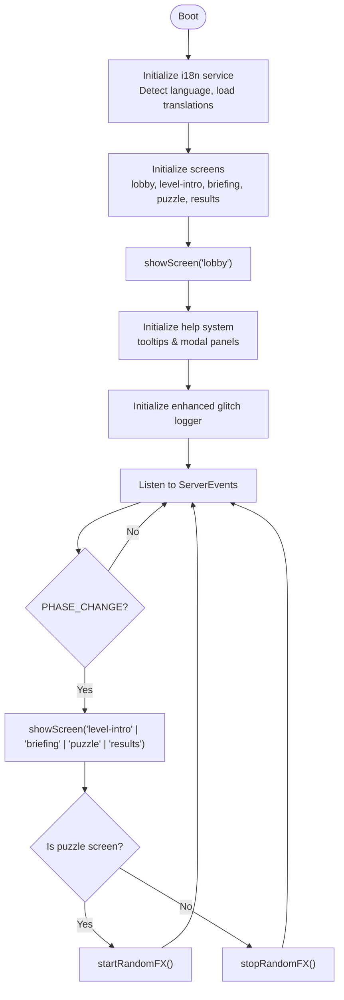
```mermaid
flowchart TD
Start(["Boot"]) --> InitI18n["Initialize i18n service<br/>Detect language, load translations"]
InitI18n --> InitScreens["Initialize screens<br/>lobby, level-intro, briefing, puzzle, results"]
InitScreens --> ShowLobby["showScreen('lobby')"]
ShowLobby --> InitHelpSystem["Initialize help system<br/>tooltips & modal panels"]
InitHelpSystem --> InitGlitchLogger["Initialize enhanced glitch logger"]
InitGlitchLogger --> ListenEvents["Listen to ServerEvents"]
ListenEvents --> PhaseChange{"PHASE_CHANGE?"}
PhaseChange --> |Yes| Transition["showScreen('level-intro' | 'briefing' | 'puzzle' | 'results')"]
Transition --> FXCheck{"Is puzzle screen?"}
FXCheck --> |Yes| StartFX["startRandomFX()"]
FXCheck --> |No| StopFX["stopRandomFX()"]
PhaseChange --> |No| ListenEvents
StartFX --> ListenEvents
StopFX --> ListenEvents
```

**Diagram sources**
- [main.ts](file://src/client/main.ts#L68-L72)
- [main.ts](file://src/client/main.ts#L142-L162)
- [router.ts](file://src/client/lib/router.ts#L17-L39)

Key responsibilities:
- Router: Switches active screen, logs transitions, and toggles visual FX pools.
- Visual FX: Starts/stops randomized glitch effects when entering/leaving puzzle screens.
- Theme Engine: Applies/removes level themes on game start and phase changes.
- I18n Service: Provides translation services with fallback mechanisms for all screen content.
- **Enhanced Glitch Recording System**: Tracks and logs glitch state changes with detailed metadata for real-time monitoring.
- **Enhanced Help System**: Provides contextual tooltips and modal help panels for improved user guidance.

**Section sources**
- [index.html](file://src/client/index.html#L24-L38)
- [router.ts](file://src/client/lib/router.ts#L10-L56)
- [visual-fx.ts](file://src/client/lib/visual-fx.ts#L40-L75)
- [theme-engine.ts](file://src/client/lib/theme-engine.ts#L9-L50)
- [i18n.ts](file://src/client/lib/i18n.ts#L53-L89)

### Router Implementation
The router maintains the current screen and toggles HUD visibility. It also integrates with visual FX to start or stop randomized effects when entering/exiting the puzzle screen.

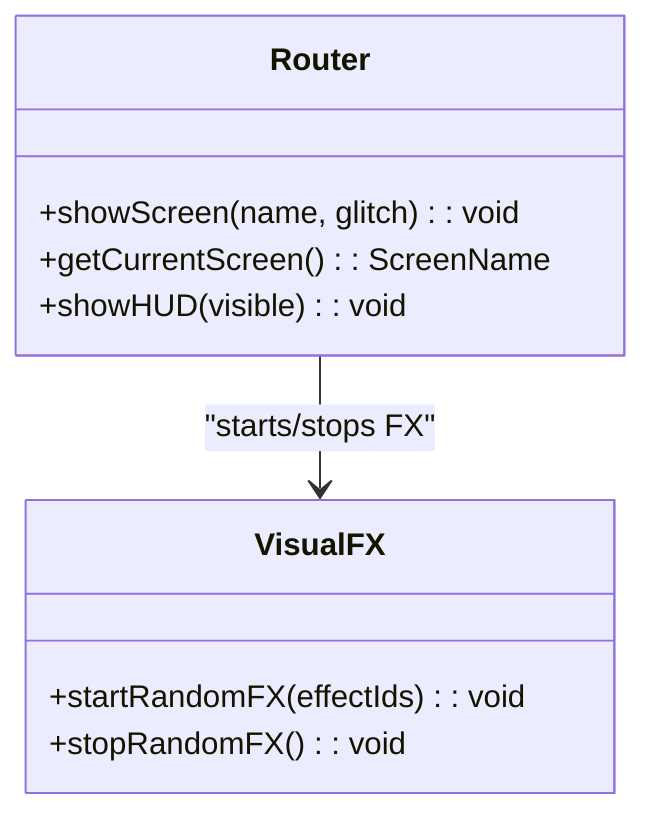
```mermaid
classDiagram
class Router {
+showScreen(name, glitch) : void
+getCurrentScreen() : ScreenName
+showHUD(visible) : void
}
class VisualFX {
+startRandomFX(effectIds) : void
+stopRandomFX() : void
}
Router --> VisualFX : "starts/stops FX"
```

**Diagram sources**
- [router.ts](file://src/client/lib/router.ts#L10-L56)
- [visual-fx.ts](file://src/client/lib/visual-fx.ts#L40-L64)

**Section sources**
- [router.ts](file://src/client/lib/router.ts#L17-L56)

### Socket.IO Client Integration
The Socket wrapper provides typed event handling, connection lifecycle logging, and safe emit/on/off. The main bootstrapper registers handlers for timer, glitch, phase changes, game start, puzzle start, and puzzle completion.

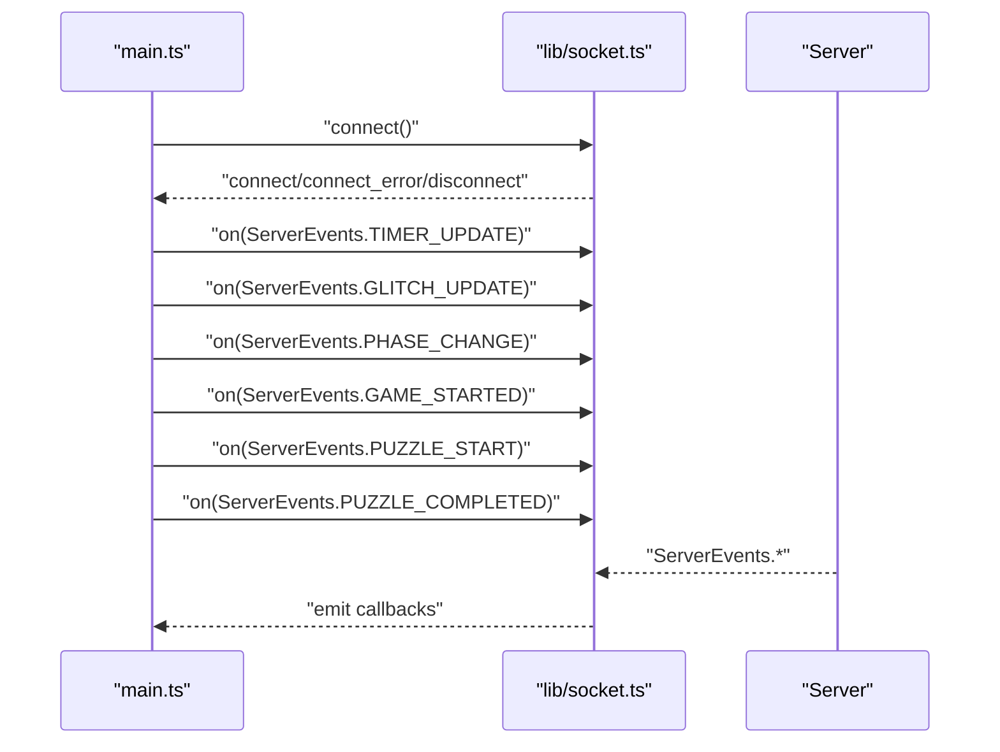
```mermaid
sequenceDiagram
participant Main as "main.ts"
participant Socket as "lib/socket.ts"
participant Server as "Server"
Main->>Socket : "connect()"
Socket-->>Main : "connect/connect_error/disconnect"
Main->>Socket : "on(ServerEvents.TIMER_UPDATE)"
Main->>Socket : "on(ServerEvents.GLITCH_UPDATE)"
Main->>Socket : "on(ServerEvents.PHASE_CHANGE)"
Main->>Socket : "on(ServerEvents.GAME_STARTED)"
Main->>Socket : "on(ServerEvents.PUZZLE_START)"
Main->>Socket : "on(ServerEvents.PUZZLE_COMPLETED)"
Server-->>Socket : "ServerEvents.*"
Socket-->>Main : "emit callbacks"
```

**Diagram sources**
- [socket.ts](file://src/client/lib/socket.ts#L11-L85)
- [main.ts](file://src/client/main.ts#L93-L206)
- [events.ts](file://shared/events.ts#L53-L90)

**Section sources**
- [socket.ts](file://src/client/lib/socket.ts#L11-L85)
- [main.ts](file://src/client/main.ts#L93-L206)

### Theme Engine
The theme engine dynamically loads and removes themed CSS files. It clears previous theme links before applying new ones, ensuring clean state per level.

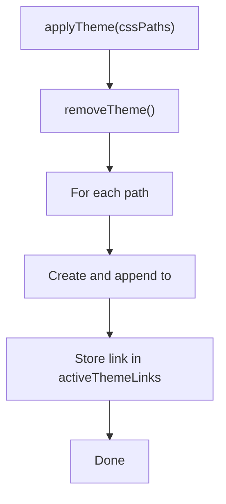
```mermaid
flowchart TD
Apply["applyTheme(cssPaths)"] --> Remove["removeTheme()"]
Remove --> Loop["For each path"]
Loop --> Link["Create <link> and append to <head>"]
Link --> Store["Store link in activeThemeLinks"]
Store --> Done["Done"]
```

**Diagram sources**
- [theme-engine.ts](file://src/client/lib/theme-engine.ts#L9-L31)

**Section sources**
- [theme-engine.ts](file://src/client/lib/theme-engine.ts#L9-L50)

### DOM Manipulation Utilities
DOM helpers encapsulate element creation, selection, mounting, and clearing. They support attributes, event listeners, and string children.

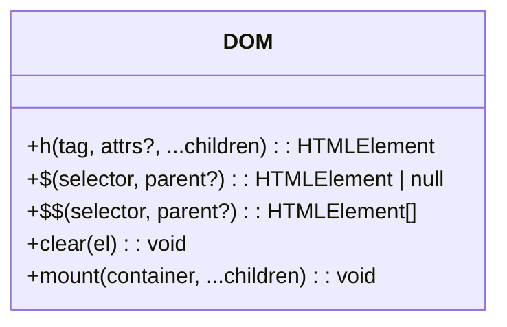
```mermaid
classDiagram
class DOM {
+h(tag, attrs?, ...children) : HTMLElement
+$(selector, parent?) : HTMLElement | null
+$$(selector, parent?) : HTMLElement[]
+clear(el) : void
+mount(container, ...children) : void
}
```

**Diagram sources**
- [dom.ts](file://src/client/lib/dom.ts#L8-L72)

**Section sources**
- [dom.ts](file://src/client/lib/dom.ts#L8-L72)

### Audio Manager and Procedural Sound Generation
The audio manager wraps the Web Audio API for SFX playback, background music, and mute control. It also generates procedural sounds using zzfx for puzzle briefings and enhanced glitch hits with detailed audio processing.

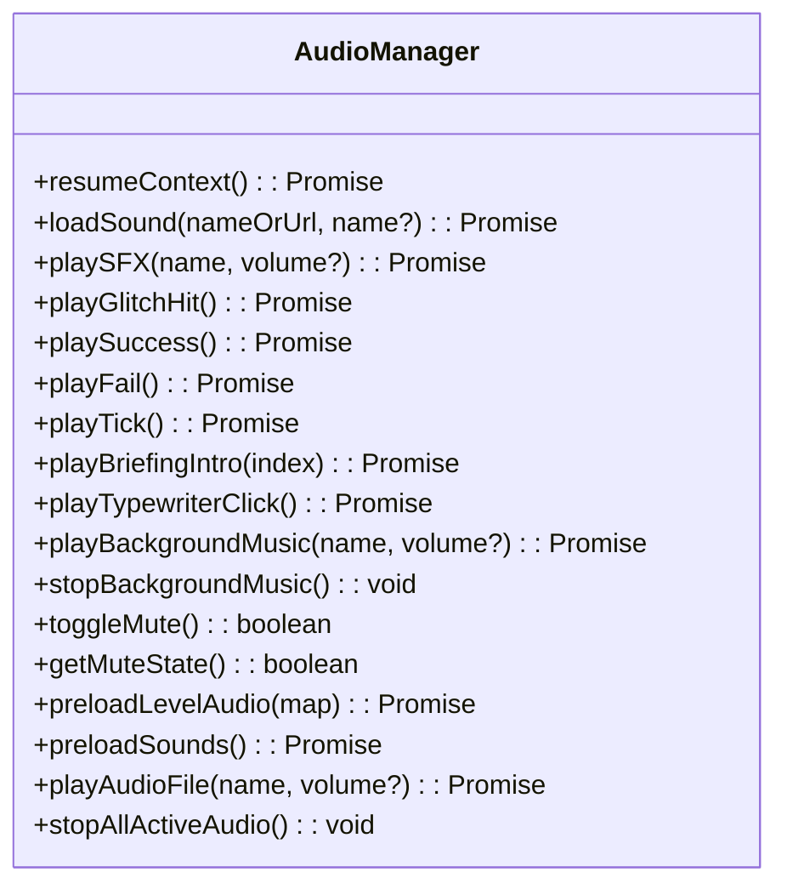
```mermaid
classDiagram
class AudioManager {
+resumeContext() : Promise<void>
+loadSound(nameOrUrl, name?) : Promise<void>
+playSFX(name, volume?) : Promise<void>
+playGlitchHit() : Promise<void>
+playSuccess() : Promise<void>
+playFail() : Promise<void>
+playTick() : Promise<void>
+playBriefingIntro(index) : Promise<void>
+playTypewriterClick() : Promise<void>
+playBackgroundMusic(name, volume?) : Promise<void>
+stopBackgroundMusic() : void
+toggleMute() : boolean
+getMuteState() : boolean
+preloadLevelAudio(map) : Promise<void>
+preloadSounds() : Promise<void>
+playAudioFile(name, volume?) : Promise<void>
+stopAllActiveAudio() : void
}
```

**Diagram sources**
- [audio-manager.ts](file://src/client/audio/audio-manager.ts#L23-L407)

**Section sources**
- [audio-manager.ts](file://src/client/audio/audio-manager.ts#L23-L407)

### Screen: Enhanced Lobby with Help System
The lobby screen handles room creation/joining, displays the player list, allows level selection, and shows the leaderboard. It now includes comprehensive help system functionality with tooltips and modal panels to improve user onboarding experience. All content is localized through the i18n service.

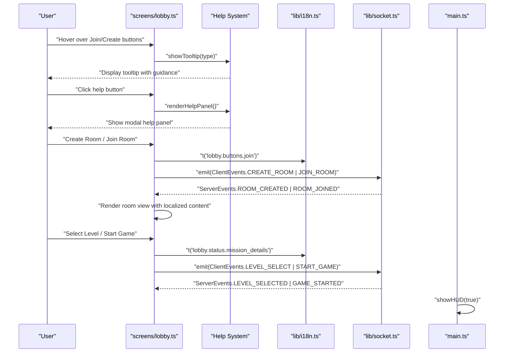
```mermaid
sequenceDiagram
participant User as "User"
participant Lobby as "screens/lobby.ts"
participant HelpSys as "Help System"
participant I18n as "lib/i18n.ts"
participant Socket as "lib/socket.ts"
participant Main as "main.ts"
User->>Lobby : "Hover over Join/Create buttons"
Lobby->>HelpSys : "showTooltip(type)"
HelpSys-->>User : "Display tooltip with guidance"
User->>Lobby : "Click help button"
Lobby->>HelpSys : "renderHelpPanel()"
HelpSys-->>User : "Show modal help panel"
User->>Lobby : "Create Room / Join Room"
Lobby->>I18n : "t('lobby.buttons.join')"
Lobby->>Socket : "emit(ClientEvents.CREATE_ROOM | JOIN_ROOM)"
Socket-->>Lobby : "ServerEvents.ROOM_CREATED | ROOM_JOINED"
Lobby->>Lobby : "Render room view with localized content"
User->>Lobby : "Select Level / Start Game"
Lobby->>I18n : "t('lobby.status.mission_details')"
Lobby->>Socket : "emit(ClientEvents.LEVEL_SELECT | START_GAME)"
Socket-->>Lobby : "ServerEvents.LEVEL_SELECTED | GAME_STARTED"
Main->>Main : "showHUD(true)"
```

**Diagram sources**
- [lobby.ts](file://src/client/screens/lobby.ts#L441-L481)
- [lobby.ts](file://src/client/screens/lobby.ts#L263-L335)
- [lobby.ts](file://src/client/screens/lobby.ts#L342-L434)
- [main.ts](file://src/client/main.ts#L418-L421)
- [i18n.ts](file://src/client/lib/i18n.ts#L53-L89)

**Section sources**
- [lobby.ts](file://src/client/screens/lobby.ts#L46-L82)
- [lobby.ts](file://src/client/screens/lobby.ts#L342-L434)
- [i18n.ts](file://src/client/lib/i18n.ts#L53-L89)

### Screen: Puzzle
The puzzle screen acts as a container that delegates rendering and updates to puzzle-specific renderers based on the puzzle type. All puzzle content is now localized through the i18n service.

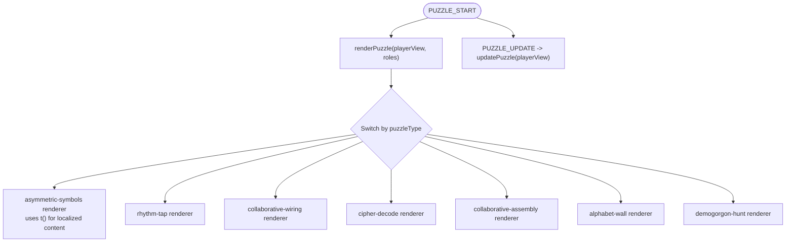
```mermaid
flowchart TD
Start(["PUZZLE_START"]) --> Render["renderPuzzle(playerView, roles)"]
Render --> Dispatch{"Switch by puzzleType"}
Dispatch --> Asym["asymmetric-symbols renderer<br/>uses t() for localized content"]
Dispatch --> Rhythm["rhythm-tap renderer"]
Dispatch --> Wiring["collaborative-wiring renderer"]
Dispatch --> Cipher["cipher-decode renderer"]
Dispatch --> Assembly["collaborative-assembly renderer"]
Dispatch --> Alphabet["alphabet-wall renderer"]
Dispatch --> Demogorgon["demogorgon-hunt renderer"]
Start --> Update["PUZZLE_UPDATE -> updatePuzzle(playerView)"]
```

**Diagram sources**
- [puzzle.ts](file://src/client/screens/puzzle.ts#L24-L73)
- [puzzle.ts](file://src/client/screens/puzzle.ts#L75-L100)

**Section sources**
- [puzzle.ts](file://src/client/screens/puzzle.ts#L23-L101)
- [i18n.ts](file://src/client/lib/i18n.ts#L53-L89)

### HUD and Real-Time Updates
The main bootstrapper listens to server events to update the HUD with localized labels:
- Timer updates display minutes and seconds, switching to a warning color when time is low and triggering a tick sound near the end.
- **Enhanced Glitch updates**: Track glitch state changes with detailed logging, adjust HUD bar and CSS variable for glitch intensity, shaking the screen and playing a glitch hit when intensity rises.
- Phase changes update puzzle progress and manage background music and theme removal on game end.
- Game start stores background music and applies theme.
- Puzzle start plays background music when provided.
- Puzzle completed triggers a celebratory filter effect.

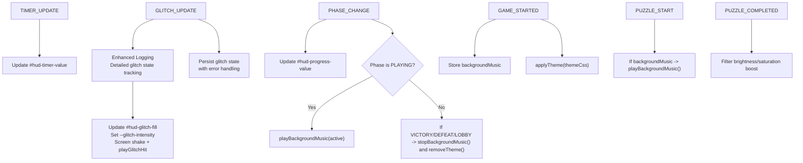
```mermaid
flowchart TD
Timer["TIMER_UPDATE"] --> UpdateTimer["Update #hud-timer-value"]
Glitch["GLITCH_UPDATE"] --> LogGlitch["Enhanced Logging<br/>Detailed glitch state tracking"]
LogGlitch --> UpdateHUD["Update #hud-glitch-fill<br/>Set --glitch-intensity<br/>Screen shake + playGlitchHit"]
Glitch --> PersistGlitch["Persist glitch state<br/>with error handling"]
Phase["PHASE_CHANGE"] --> UpdateProgress["Update #hud-progress-value"]
Phase --> MusicCheck{"Phase is PLAYING?"}
MusicCheck --> |Yes| PlayBGM["playBackgroundMusic(active)"]
MusicCheck --> |No| MaybeStop["If VICTORY/DEFEAT/LOBBY -> stopBackgroundMusic() and removeTheme()"]
GameStart["GAME_STARTED"] --> StoreMusic["Store backgroundMusic"]
GameStart --> ApplyTheme["applyTheme(themeCss)"]
PuzzleStart["PUZZLE_START"] --> MaybePlay["If backgroundMusic -> playBackgroundMusic()"]
Completed["PUZZLE_COMPLETED"] --> Celebration["Filter brightness/saturation boost"]
```

**Diagram sources**
- [main.ts](file://src/client/main.ts#L93-L206)
- [audio-manager.ts](file://src/client/audio/audio-manager.ts#L259-L293)
- [theme-engine.ts](file://src/client/lib/theme-engine.ts#L9-L31)

**Section sources**
- [main.ts](file://src/client/main.ts#L93-L206)

## Enhanced Glitch Recording System

### Comprehensive Glitch State Monitoring
The enhanced glitch recording system provides detailed logging for GLITCH_UPDATE events, enabling real-time tracking of glitch state changes during gameplay. This system captures comprehensive metadata about glitch progression, state validation, and persistence operations.

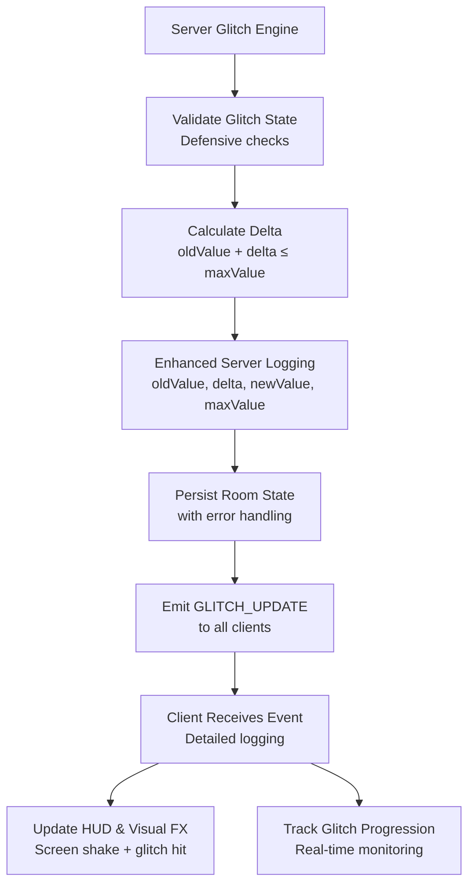
```mermaid
flowchart TD
ServerInit["Server Glitch Engine"] --> ValidateState["Validate Glitch State<br/>Defensive checks"]
ValidateState --> CalculateDelta["Calculate Delta<br/>oldValue + delta ≤ maxValue"]
CalculateDelta --> LogUpdate["Enhanced Server Logging<br/>oldValue, delta, newValue, maxValue"]
LogUpdate --> PersistRoom["Persist Room State<br/>with error handling"]
PersistRoom --> EmitEvent["Emit GLITCH_UPDATE<br/>to all clients"]
EmitEvent --> ClientReceive["Client Receives Event<br/>Detailed logging"]
ClientReceive --> UpdateHUD["Update HUD & Visual FX<br/>Screen shake + glitch hit"]
ClientReceive --> TrackProgression["Track Glitch Progression<br/>Real-time monitoring"]
```

**Diagram sources**
- [game-engine.ts](file://src/server/services/game-engine.ts#L458-L505)
- [main.ts](file://src/client/main.ts#L114-L140)

Key features of the enhanced glitch recording system:
- **Detailed Server Logging**: Comprehensive logging of glitch state changes including old values, deltas, new values, and maximum values
- **Real-time Client Tracking**: Client-side logging of received glitch updates with detailed state information
- **State Validation**: Defensive checks to ensure glitch state integrity before modifications
- **Error Handling**: Robust error handling with detailed error metadata for debugging
- **Persistence Tracking**: Logging of room state persistence operations with error recovery
- **Visual Feedback**: Real-time screen shake and audio feedback for glitch state changes

**Section sources**
- [game-engine.ts](file://src/server/services/game-engine.ts#L458-L505)
- [main.ts](file://src/client/main.ts#L114-L140)

### Server-Side Enhanced Logging
The server-side glitch logging captures comprehensive metadata about glitch state changes, providing detailed insights into game progression and potential issues.

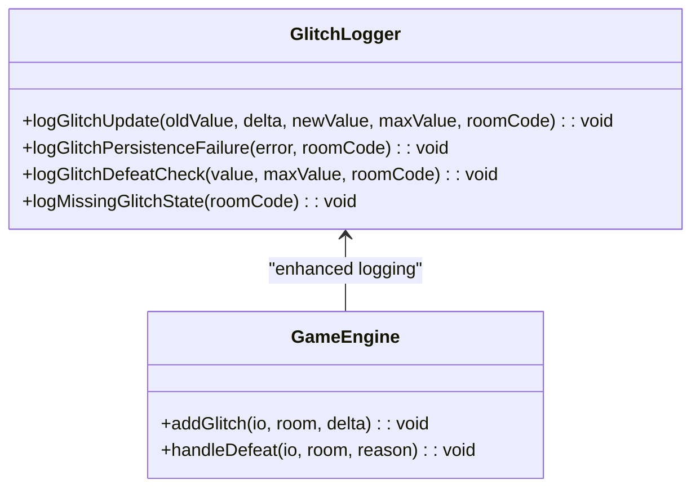
```mermaid
classDiagram
class GlitchLogger {
+logGlitchUpdate(oldValue, delta, newValue, maxValue, roomCode) : void
+logGlitchPersistenceFailure(error, roomCode) : void
+logGlitchDefeatCheck(value, maxValue, roomCode) : void
+logMissingGlitchState(roomCode) : void
}
class GameEngine {
+addGlitch(io, room, delta) : void
+handleDefeat(io, room, reason) : void
}
GlitchLogger <-- GameEngine : "enhanced logging"
```

**Diagram sources**
- [game-engine.ts](file://src/server/services/game-engine.ts#L458-L505)

Enhanced logging features:
- **State Change Details**: Logs old value, delta amount, new calculated value, and maximum value for each glitch update
- **Room Context**: Includes room code in all logging operations for traceability
- **Error Metadata**: Captures detailed error information including stack traces and error names
- **Persistence Tracking**: Logs room state persistence attempts and failures
- **Defeat Condition Monitoring**: Tracks glitch state reaching maximum value for automatic defeat handling

**Section sources**
- [game-engine.ts](file://src/server/services/game-engine.ts#L458-L505)

### Client-Side Real-time Monitoring
The client-side glitch logging provides real-time tracking of glitch state changes, enabling developers to monitor game progression and debug issues.

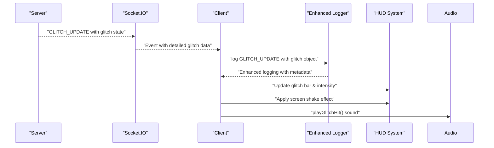
```mermaid
sequenceDiagram
participant Server as "Server"
participant Socket as "Socket.IO"
participant Client as "Client"
participant Logger as "Enhanced Logger"
participant HUD as "HUD System"
Server-->>Socket : "GLITCH_UPDATE with glitch state"
Socket-->>Client : "Event with detailed glitch data"
Client->>Logger : "log GLITCH_UPDATE with glitch object"
Logger-->>Client : "Enhanced logging with metadata"
Client->>HUD : "Update glitch bar & intensity"
Client->>HUD : "Apply screen shake effect"
Client->>Audio : "playGlitchHit() sound"
```

**Diagram sources**
- [main.ts](file://src/client/main.ts#L114-L140)

Client-side monitoring features:
- **Real-time Event Logging**: Detailed logging of received GLITCH_UPDATE events with glitch state data
- **HUD State Synchronization**: Updates glitch bar percentage and CSS intensity variables
- **Visual Effect Triggering**: Automatic screen shake and glitch hit sound for intensity thresholds
- **State Validation**: Client-side validation of glitch state before applying visual effects

**Section sources**
- [main.ts](file://src/client/main.ts#L114-L140)

### Glitch State Persistence and Recovery
The enhanced system includes comprehensive persistence logging and recovery mechanisms to ensure glitch state integrity across game sessions.

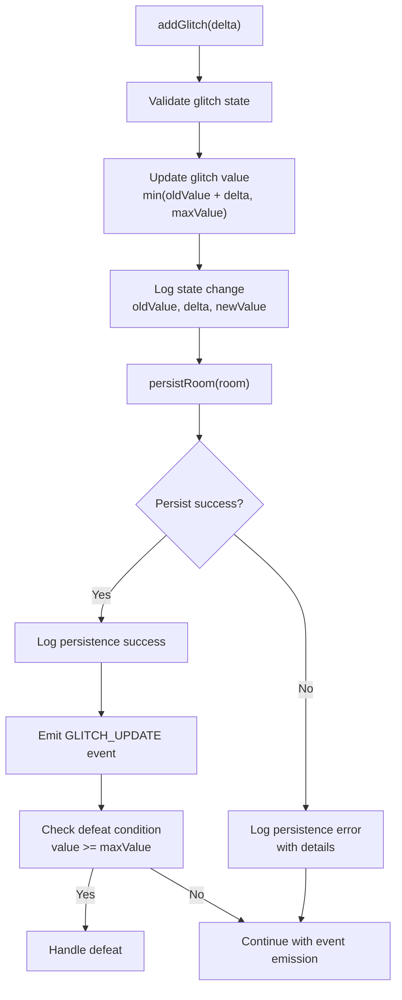
```mermaid
flowchart TD
AddGlitch["addGlitch(delta)"] --> ValidateState["Validate glitch state"]
ValidateState --> UpdateValue["Update glitch value<br/>min(oldValue + delta, maxValue)"]
UpdateValue --> LogState["Log state change<br/>oldValue, delta, newValue"]
LogState --> PersistRoom["persistRoom(room)"]
PersistRoom --> Success{"Persist success?"}
Success --> |Yes| LogSuccess["Log persistence success"]
Success --> |No| LogError["Log persistence error<br/>with details"]
LogError --> Continue["Continue with event emission"]
LogSuccess --> EmitEvent["Emit GLITCH_UPDATE event"]
EmitEvent --> CheckDefeat["Check defeat condition<br/>value >= maxValue"]
CheckDefeat --> |Yes| HandleDefeat["Handle defeat"]
CheckDefeat --> |No| Continue
```

**Diagram sources**
- [game-engine.ts](file://src/server/services/game-engine.ts#L458-L505)

Persistence and recovery features:
- **State Validation**: Ensures glitch state exists and has proper structure before modification
- **Default Value Fallback**: Provides fallback values for maximum glitch if configuration is missing
- **Error Recovery**: Captures and logs persistence failures with detailed error information
- **Defeat Condition Monitoring**: Automatically detects when glitch reaches maximum value for game over conditions
- **State Integrity**: Maintains glitch state consistency across game operations

**Section sources**
- [game-engine.ts](file://src/server/services/game-engine.ts#L458-L505)

## Help System Implementation

### Enhanced Lobby with Contextual Guidance
The lobby screen now features a comprehensive help system designed to improve user onboarding and reduce friction for new players. The system includes both tooltip-based guidance and modal help panels.

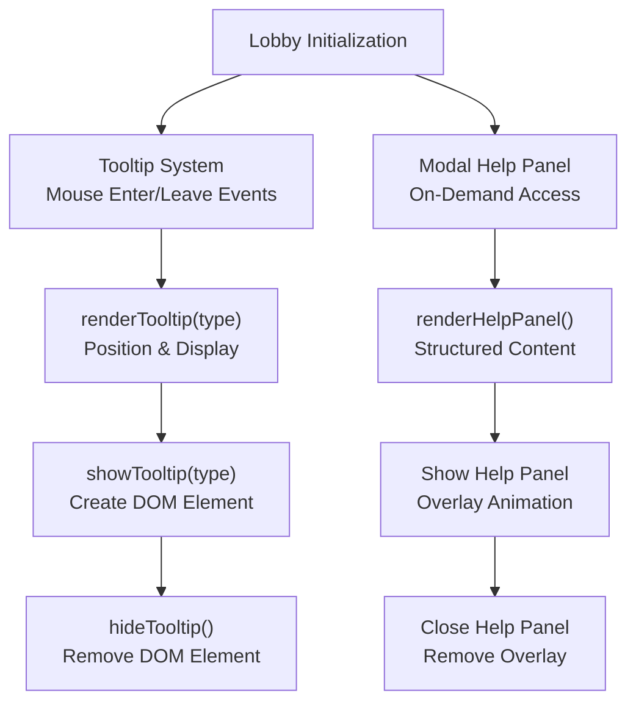
```mermaid
flowchart TD
LobbyInit["Lobby Initialization"] --> TooltipSystem["Tooltip System<br/>Mouse Enter/Leave Events"]
TooltipSystem --> RenderTooltip["renderTooltip(type)<br/>Position & Display"]
RenderTooltip --> ShowTooltip["showTooltip(type)<br/>Create DOM Element"]
ShowTooltip --> HideTooltip["hideTooltip()<br/>Remove DOM Element"]
LobbyInit --> ModalHelp["Modal Help Panel<br/>On-Demand Access"]
ModalHelp --> RenderHelpPanel["renderHelpPanel()<br/>Structured Content"]
RenderHelpPanel --> ShowHelpPanel["Show Help Panel<br/>Overlay Animation"]
ShowHelpPanel --> CloseHelpPanel["Close Help Panel<br/>Remove Overlay"]
```

**Diagram sources**
- [lobby.ts](file://src/client/screens/lobby.ts#L441-L481)
- [style.css](file://src/client/styles/style.css#L277-L328)

Key features of the help system:
- **Contextual Tooltips**: Hover over Join/Create buttons to see contextual guidance
- **Modal Help Panel**: Structured information accessible anytime during lobby
- **Cyberpunk Aesthetic**: Consistent styling with neon colors and glitch effects
- **Responsive Positioning**: Tooltips position themselves relative to target elements
- **Smooth Animations**: Fade-in animations and overlay transitions

**Section sources**
- [lobby.ts](file://src/client/screens/lobby.ts#L441-L481)
- [style.css](file://src/client/styles/style.css#L277-L526)

### Tooltip System Architecture
The tooltip system provides immediate, contextual guidance without cluttering the interface. Tooltips appear when users hover over specific elements and automatically disappear when the mouse leaves the trigger area.

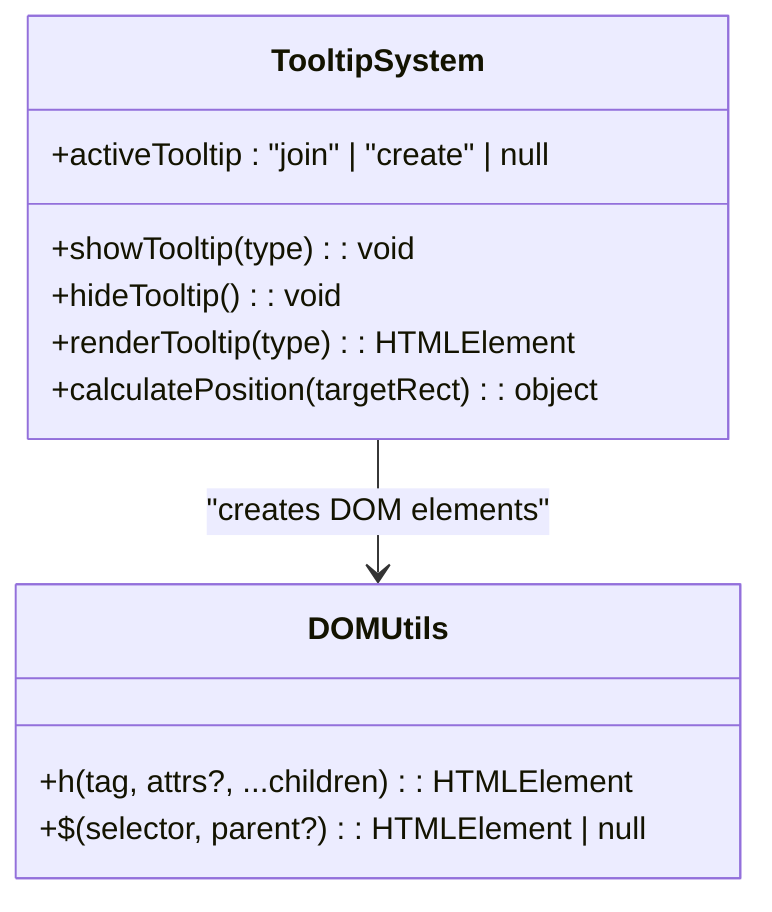
```mermaid
classDiagram
class TooltipSystem {
+activeTooltip : "join" | "create" | null
+showTooltip(type) : void
+hideTooltip() : void
+renderTooltip(type) : HTMLElement
+calculatePosition(targetRect) : object
}
class DOMUtils {
+h(tag, attrs?, ...children) : HTMLElement
+$(selector, parent?) : HTMLElement | null
}
TooltipSystem --> DOMUtils : "creates DOM elements"
```

**Diagram sources**
- [lobby.ts](file://src/client/screens/lobby.ts#L441-L481)
- [dom.ts](file://src/client/lib/dom.ts#L8-L72)

Implementation details:
- **Trigger Elements**: Join and Create buttons serve as tooltip triggers
- **Position Calculation**: Uses boundingClientRect for precise positioning
- **Fixed Positioning**: Tooltips use fixed positioning relative to viewport
- **Arrow Placement**: Automatic arrow positioning with CSS pseudo-elements
- **Event Handling**: Mouse enter/leave events for show/hide functionality

**Section sources**
- [lobby.ts](file://src/client/screens/lobby.ts#L441-L481)

### Modal Help Panel System
The modal help panel provides comprehensive information about the game mechanics, controls, and navigation. It appears as a centered overlay with smooth entrance animations.

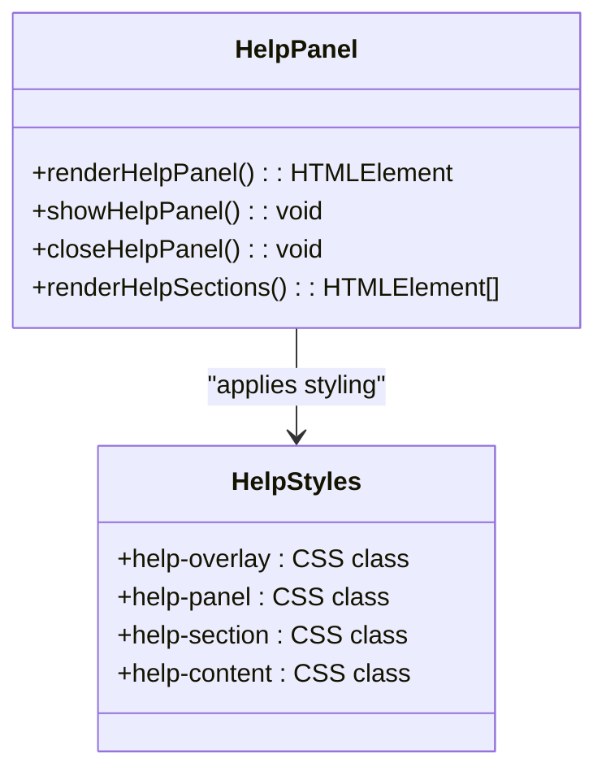
```mermaid
classDiagram
class HelpPanel {
+renderHelpPanel() : HTMLElement
+showHelpPanel() : void
+closeHelpPanel() : void
+renderHelpSections() : HTMLElement[]
}
class HelpStyles {
+help-overlay : CSS class
+help-panel : CSS class
+help-section : CSS class
+help-content : CSS class
}
HelpPanel --> HelpStyles : "applies styling"
```

**Diagram sources**
- [style.css](file://src/client/styles/style.css#L277-L328)
- [style.css](file://src/client/styles/style.css#L355-L459)

Help panel features:
- **Overlay Background**: Semi-transparent dark background with blur effect
- **Centered Content**: Max-width container with responsive design
- **Section Organization**: Logical grouping of help content
- **Close Button**: Prominent close button with hover effects
- **Scrollable Content**: Handles long help text gracefully
- **Animation Effects**: Smooth slide-in animation on open

**Section sources**
- [style.css](file://src/client/styles/style.css#L277-L526)

### Help Content Structure
The help system organizes information into logical sections covering different aspects of the user experience:

**Lobby Navigation**: Room creation, joining, and basic lobby controls
**Mission Selection**: Level selection process and mission details
**Player Management**: Understanding player roles and team dynamics
**Game Controls**: How to interact with puzzles and game elements
**Technical Support**: Troubleshooting common issues and getting help

**Section sources**
- [lobby.ts](file://src/client/screens/lobby.ts#L441-L481)
- [style.css](file://src/client/styles/style.css#L277-L526)

## Internationalization System

### I18nService Implementation
The I18nService provides comprehensive internationalization support with automatic language detection, translation loading, and fallback mechanisms.

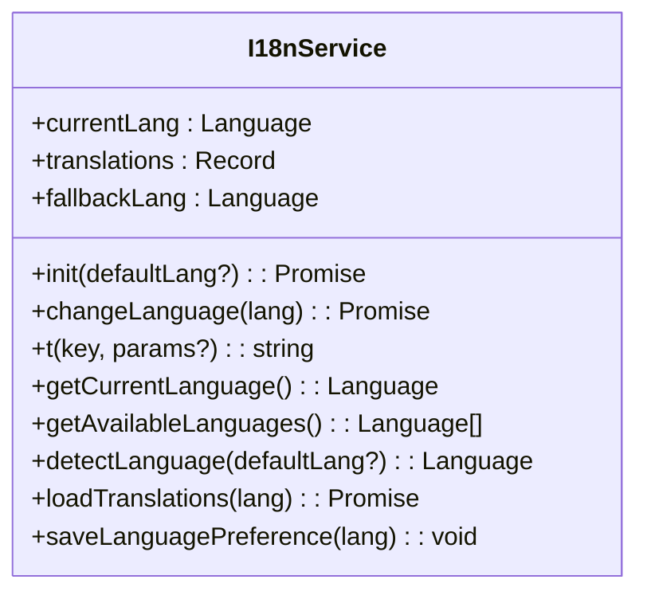
```mermaid
classDiagram
class I18nService {
+currentLang : Language
+translations : Record<Language, Translations>
+fallbackLang : Language
+init(defaultLang?) : Promise<void>
+changeLanguage(lang) : Promise<void>
+t(key, params?) : string
+getCurrentLanguage() : Language
+getAvailableLanguages() : Language[]
+detectLanguage(defaultLang?) : Language
+loadTranslations(lang) : Promise<void>
+saveLanguagePreference(lang) : void
}
```

**Diagram sources**
- [i18n.ts](file://src/client/lib/i18n.ts#L12-L165)

Key features:
- Automatic language detection from URL parameter, localStorage, browser settings, or default
- Dynamic translation loading with fallback to English
- Parameter substitution for dynamic content (e.g., counts, names)
- Persistent language preference storage
- Event dispatch for UI updates on language change

**Section sources**
- [i18n.ts](file://src/client/lib/i18n.ts#L12-L165)

### Language Detection and Loading
The language detection algorithm follows a priority order:
1. URL parameter (?lang=en|el)
2. localStorage preference (odyssey_language)
3. Browser language detection (el prefix)
4. Default to English

Translation files are loaded dynamically using ES module imports and cached for performance.

**Section sources**
- [i18n.ts](file://src/client/lib/i18n.ts#L108-L156)

### Language Selector Component
The language selector provides a user-friendly interface for runtime language switching with persistent storage and automatic page reload.

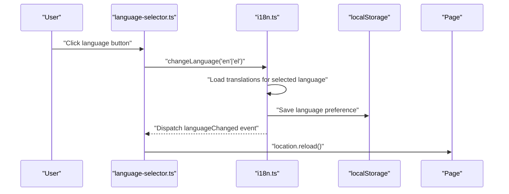
```mermaid
sequenceDiagram
participant User as "User"
participant LangSel as "language-selector.ts"
participant I18n as "i18n.ts"
participant LocalStorage as "localStorage"
participant Page as "Page"
User->>LangSel : "Click language button"
LangSel->>I18n : "changeLanguage('en'|'el')"
I18n->>I18n : "Load translations for selected language"
I18n->>LocalStorage : "Save language preference"
I18n-->>LangSel : "Dispatch languageChanged event"
LangSel->>Page : "location.reload()"
```

**Diagram sources**
- [language-selector.ts](file://src/client/components/language-selector.ts#L68-L80)
- [i18n.ts](file://src/client/lib/i18n.ts#L39-L48)

**Section sources**
- [language-selector.ts](file://src/client/components/language-selector.ts#L8-L94)

### Localization Coverage
The internationalization system covers all user-facing content across the application:

**Lobby Screen**: Complete localization including room management, player lists, level selection, leaderboard, and **help system content**
**Level Intro Screen**: Narrative text, mission synchronization messages, and audio integration
**Briefing Screen**: Mission progress indicators, story text, and player readiness tracking
**Puzzle Screens**: All puzzle-specific content including role descriptions, instructions, and status messages
**Results Screen**: Victory/defeat messages, statistics displays, and restart prompts
**HUD Elements**: Time, mission, glitch, and role indicators with tooltips

**Section sources**
- [lobby.ts](file://src/client/screens/lobby.ts#L85-L127)
- [level-intro.ts](file://src/client/screens/level-intro.ts#L26-L92)
- [briefing.ts](file://src/client/screens/briefing.ts#L34-L110)
- [puzzle.ts](file://src/client/screens/puzzle.ts#L37-L74)
- [results.ts](file://src/client/screens/results.ts#L22-L86)

### Translation Files Structure
Translation files follow a hierarchical structure organized by functional areas:
- Common terms (loading, error, success, yes/no, etc.)
- Screen-specific content (lobby, level intro, briefing, results)
- Puzzle-specific content (roles, instructions, status messages)
- HUD labels and tooltips
- Role names and descriptions
- **Help system content** (tooltips, modal panel sections)

Each translation supports parameter substitution using double curly braces (e.g., {{count}}, {{puzzle_count}}).

**Section sources**
- [en.ts](file://src/client/locales/en.ts#L1-L211)
- [el.ts](file://src/client/locales/el.ts#L1-L211)

## Dependency Analysis
- Build and dev server: Vite serves the client from src/client, with path aliases for @shared and @client, and proxies /socket.io to the backend.
- Runtime dependencies: socket.io-client, zzfx, shared packages, and i18n service.
- Client-to-server communication: All events are defined in shared/events.ts and consumed by both sides.
- Internationalization dependencies: Dynamic import of locale files and localStorage for persistence.
- **Enhanced Dependencies**: Help system relies on CSS animations and DOM manipulation utilities.
- **Enhanced Glitch Dependencies**: Enhanced logging system relies on comprehensive state tracking and error handling.

```mermaid
graph LR
Vite["vite.config.ts"] --> Alias["@shared/@client aliases"]
Vite --> Proxy["/socket.io proxy -> SERVER_PORT"]
MainTS["main.ts"] --> SocketIO["socket.io-client"]
MainTS --> SharedEvents["shared/events.ts"]
MainTS --> SharedTypes["shared/types.ts"]
MainTS --> I18nService["lib/i18n.ts"]
MainTS --> HelpSystem["Enhanced Lobby Help"]
MainTS --> GlitchLogger["Enhanced Glitch Logger"]
I18nService --> Locales["locales/en.ts, locales/el.ts"]
StyleCSS["styles/style.css"] --> HelpStyles["Help Panel & Tooltips"]
GlitchCSS["styles/glitch.css"] --> AudioFX["Enhanced Audio FX"]
Package["package.json"] --> Deps["dependencies: socket.io-client, zzfx"]
```

**Diagram sources**
- [vite.config.ts](file://vite.config.ts#L17-L32)
- [package.json](file://package.json#L16-L29)
- [main.ts](file://src/client/main.ts#L14-L26)
- [i18n.ts](file://src/client/lib/i18n.ts#L140-L149)
- [en.ts](file://src/client/locales/en.ts#L1-L211)
- [el.ts](file://src/client/locales/el.ts#L1-L211)
- [events.ts](file://shared/events.ts#L28-L90)
- [types.ts](file://shared/types.ts#L26-L49)
- [style.css](file://src/client/styles/style.css#L277-L526)
- [glitch.css](file://src/client/styles/glitch.css#L1-L421)

**Section sources**
- [vite.config.ts](file://vite.config.ts#L1-L44)
- [package.json](file://package.json#L16-L29)
- [i18n.ts](file://src/client/lib/i18n.ts#L140-L149)
- [events.ts](file://shared/events.ts#L28-L90)
- [types.ts](file://shared/types.ts#L26-L49)

## Performance Considerations
- Lazy audio decoding: Audio buffers are fetched and decoded after the first user gesture to satisfy browser autoplay policies.
- Background music looping: Music sources are reused when the same track is requested again.
- Visual FX throttling: Random FX cycles are stopped when leaving puzzle screens to reduce overhead.
- Minimal DOM: DOM helpers batch updates and clear containers before mounting new content to avoid leaks.
- Procedural audio: zzfx generates short procedural sounds without fetching assets, reducing latency.
- **Enhanced Glitch Logging**: Comprehensive logging operations are optimized with conditional logging based on log levels.
- **Internationalization optimization**: Translations are loaded once per language change and cached in memory for subsequent access.
- **Dynamic imports**: Locale files are loaded dynamically only when needed, reducing initial bundle size.
- **Help system optimization**: Tooltips are created and destroyed on demand to minimize DOM overhead.
- **CSS animations**: Help panel uses hardware-accelerated CSS animations for smooth performance.

## Troubleshooting Guide
Common issues and diagnostics:
- Socket connection errors: The wrapper logs connect_error and disconnect reasons; ensure the proxy in vite.config.ts points to the correct server port.
- Audio not playing: Resume the AudioContext on first user interaction; verify preloadSounds succeeded and that buffers decoded after resume.
- Theme not applied: Confirm theme paths exist relative to the styles directory and that removeTheme clears previous links before applying new ones.
- Screen not transitioning: Verify showScreen is called with a valid ScreenName and that router logs the transition.
- HUD not updating: Check that server events are emitted with correct payloads and that main.ts handlers are registered before connecting.
- **Enhanced Glitch Logging Issues**: Verify that GLITCH_UPDATE events are being logged with detailed state information; check server logs for enhanced logging output.
- **Glitch State Persistence Errors**: Monitor for persistence failure logs with detailed error information; verify database connectivity and room state integrity.
- **Language switching issues**: Verify localStorage contains valid language codes ('en' or 'el'), check network tab for failed locale file loads, and ensure languageChanged event is dispatched.
- **Missing translations**: Check that translation keys exist in both en.ts and el.ts files, verify parameter substitution syntax, and confirm fallback mechanism is working.
- **Help system issues**: Verify tooltip elements are being created/destroyed properly, check CSS classes are applied, and ensure event handlers are attached to trigger elements.
- **Tooltip positioning**: If tooltips appear in wrong positions, check boundingClientRect calculations and viewport dimensions.
- **Modal panel display**: If help panel doesn't show, verify overlay classes and animation triggers are working correctly.

**Section sources**
- [socket.ts](file://src/client/lib/socket.ts#L24-L34)
- [audio-manager.ts](file://src/client/audio/audio-manager.ts#L33-L54)
- [theme-engine.ts](file://src/client/lib/theme-engine.ts#L36-L50)
- [router.ts](file://src/client/lib/router.ts#L17-L27)
- [main.ts](file://src/client/main.ts#L93-L206)
- [i18n.ts](file://src/client/lib/i18n.ts#L140-L149)
- [lobby.ts](file://src/client/screens/lobby.ts#L441-L481)
- [style.css](file://src/client/styles/style.css#L277-L526)
- [game-engine.ts](file://src/server/services/game-engine.ts#L458-L505)

## Conclusion
The client application is a lean, event-driven system built with vanilla TypeScript and CSS, now enhanced with comprehensive internationalization support, an advanced help system for improved user onboarding, and an enhanced glitch recording system with detailed logging for real-time tracking of glitch state changes during gameplay. The enhanced glitch recording system provides comprehensive logging infrastructure that captures detailed metadata about glitch progression, state validation, persistence operations, and error handling, enabling developers to monitor game progression and debug issues effectively. It leverages a typed Socket.IO wrapper, a minimal DOM helper library, a theme engine, a Web Audio API-based audio manager with enhanced glitch effects, and a robust i18n service to deliver a cohesive, real-time escape room experience in multiple languages. The router and visual FX modules provide smooth transitions and immersive effects, while the screens encapsulate domain-specific rendering logic with full localization capabilities and enhanced user guidance.

## Appendices

### Responsive Design Considerations
- The application uses viewport meta and CSS media queries to adapt to various screen sizes.
- Layouts rely on flexible containers and spacing tokens to maintain readability and usability across devices.
- Visual overlays (scanlines, glitch) are layered to avoid interfering with interactive elements.
- **Enhanced Glitch Effects**: Screen shake and visual glitch effects are optimized for performance across different devices.
- **Help system responsiveness**: Tooltips and modal panels adapt to different screen sizes and orientations.
- **Internationalization considerations**: Text sizing and wrapping are optimized for different language lengths, with special attention to Greek character rendering and English text expansion.

### Language Support Matrix
- **English (en)**: Full coverage of all functional areas including puzzles, screens, HUD elements, and **help system content**
- **Greek (el)**: Comprehensive translation of all user-facing content with cultural adaptations and **help system localization**
- **Extensibility**: Easy addition of new languages through simple translation file structure

### Project Branding Updates
**Updated** The project has been updated to use inclusive naming conventions:
- HTML title changed from "Cyber-Hoplite Protocol" to "Cyber Protocol"
- Console log messages updated to reflect the new project title
- Lobby screen text now uses "Cyber Protocol" branding
- README.md still contains "Cyber-Hoplites" reference in story description (to be updated)
- Compiled distribution still shows old title (needs rebuild)

### Enhanced Glitch Recording System Features
**New** The enhanced glitch recording system includes:
- **Comprehensive Server Logging**: Detailed logging of glitch state changes with old values, deltas, new values, and maximum values
- **Real-time Client Tracking**: Client-side logging of received glitch updates with detailed state information
- **State Validation**: Defensive checks to ensure glitch state integrity before modifications
- **Error Handling**: Robust error handling with detailed error metadata for debugging
- **Persistence Tracking**: Logging of room state persistence operations with error recovery
- **Visual Feedback**: Real-time screen shake and audio feedback for glitch state changes
- **Defeat Condition Monitoring**: Automatic detection when glitch reaches maximum value for game over conditions

**Section sources**
- [index.html](file://src/client/index.html#L10)
- [main.ts](file://src/client/main.ts#L58)
- [lobby.ts](file://src/client/screens/lobby.ts#L89)
- [README.md](file://README.md#L13)
- [dist/client/index.html](file://dist/client/index.html#L10)
- [lobby.ts](file://src/client/screens/lobby.ts#L441-L481)
- [style.css](file://src/client/styles/style.css#L277-L526)
- [glitch.css](file://src/client/styles/glitch.css#L62-L99)
- [game-engine.ts](file://src/server/services/game-engine.ts#L458-L505)