# Client Application

<cite>
**Referenced Files in This Document**
- [main.ts](file://src/client/main.ts)
- [index.html](file://src/client/index.html)
- [router.ts](file://src/client/lib/router.ts)
- [socket.ts](file://src/client/lib/socket.ts)
- [dom.ts](file://src/client/lib/dom.ts)
- [theme-engine.ts](file://src/client/lib/theme-engine.ts)
- [visual-fx.ts](file://src/client/lib/visual-fx.ts)
- [lobby.ts](file://src/client/screens/lobby.ts)
- [puzzle.ts](file://src/client/screens/puzzle.ts)
- [audio-manager.ts](file://src/client/audio/audio-manager.ts)
- [events.ts](file://shared/events.ts)
- [types.ts](file://shared/types.ts)
- [vite.config.ts](file://vite.config.ts)
- [package.json](file://package.json)
- [ARCHITECTURE.md](file://ARCHITECTURE.md)
</cite>

## Table of Contents
1. [Introduction](#introduction)
2. [Project Structure](#project-structure)
3. [Core Components](#core-components)
4. [Architecture Overview](#architecture-overview)
5. [Detailed Component Analysis](#detailed-component-analysis)
6. [Dependency Analysis](#dependency-analysis)
7. [Performance Considerations](#performance-considerations)
8. [Troubleshooting Guide](#troubleshooting-guide)
9. [Conclusion](#conclusion)
10. [Appendices](#appendices)

## Introduction
This document describes the client-side application architecture and implementation powering the Project ODYSSEY escape room experience. The client is a Vite-powered, vanilla TypeScript and CSS application that renders five screens (Lobby, Level Intro, Briefing, Puzzle, Results), synchronizes state via Socket.IO, and delivers immersive visuals and audio. It avoids frameworks, relying on lightweight DOM helpers, a minimal router, a typed Socket.IO wrapper, a theme engine, and procedural audio generation.

## Project Structure
The client is organized around a small set of core modules:
- Entry point and orchestration: main.ts
- Routing and screen management: lib/router.ts
- DOM helpers: lib/dom.ts
- Socket.IO wrapper: lib/socket.ts
- Theme engine: lib/theme-engine.ts
- Visual FX: lib/visual-fx.ts
- Screens: screens/lobby.ts, screens/level-intro.ts, screens/briefing.ts, screens/puzzle.ts, screens/results.ts
- Audio manager: audio/audio-manager.ts
- Shared contracts: shared/events.ts, shared/types.ts
- Build and dev server: vite.config.ts, package.json

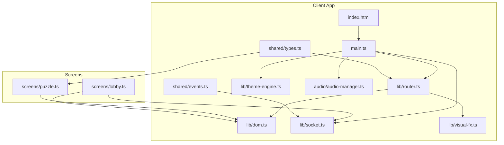

**Diagram sources**
- [index.html](file://src/client/index.html#L1-L69)
- [main.ts](file://src/client/main.ts#L1-L266)
- [router.ts](file://src/client/lib/router.ts#L1-L57)
- [socket.ts](file://src/client/lib/socket.ts#L1-L85)
- [dom.ts](file://src/client/lib/dom.ts#L1-L73)
- [theme-engine.ts](file://src/client/lib/theme-engine.ts#L1-L51)
- [visual-fx.ts](file://src/client/lib/visual-fx.ts#L1-L112)
- [audio-manager.ts](file://src/client/audio/audio-manager.ts#L1-L407)
- [lobby.ts](file://src/client/screens/lobby.ts#L1-L435)
- [puzzle.ts](file://src/client/screens/puzzle.ts#L1-L101)
- [events.ts](file://shared/events.ts#L1-L228)
- [types.ts](file://shared/types.ts#L1-L187)

**Section sources**
- [ARCHITECTURE.md](file://ARCHITECTURE.md#L68-L107)
- [vite.config.ts](file://vite.config.ts#L1-L44)
- [package.json](file://package.json#L1-L41)

## Core Components
- Entry point and bootstrapper: Initializes audio, connects to the server, preloads sounds, initializes screens, wires HUD updates, and exposes developer utilities.
- Router: Manages screen visibility and toggles visual FX during puzzle screens.
- DOM helpers: Provides element creation, selection, mounting, and clearing utilities.
- Socket wrapper: Typed wrapper around Socket.IO with connection lifecycle logging and safe emit/on/off.
- Theme engine: Dynamically applies/removes themed CSS files per level.
- Visual FX: Randomly triggers glitch effects during puzzle screens.
- Audio manager: Web Audio API-based SFX and background music, with procedural sound generation via zzfx.
- Screens: Lobby, Level Intro, Briefing, Puzzle, Results, each with initialization and rendering logic.

**Section sources**
- [main.ts](file://src/client/main.ts#L47-L262)
- [router.ts](file://src/client/lib/router.ts#L10-L56)
- [dom.ts](file://src/client/lib/dom.ts#L8-L72)
- [socket.ts](file://src/client/lib/socket.ts#L11-L85)
- [theme-engine.ts](file://src/client/lib/theme-engine.ts#L9-L50)
- [visual-fx.ts](file://src/client/lib/visual-fx.ts#L19-L112)
- [audio-manager.ts](file://src/client/audio/audio-manager.ts#L23-L407)
- [lobby.ts](file://src/client/screens/lobby.ts#L46-L82)
- [puzzle.ts](file://src/client/screens/puzzle.ts#L23-L34)

## Architecture Overview
The client follows a reactive, event-driven pattern:
- The server emits typed events (e.g., game phase changes, puzzle updates).
- The client’s Socket.IO wrapper receives and logs events.
- The main bootstrapper updates HUD and orchestrates screen transitions.
- The router switches visible screens and manages visual FX.
- The theme engine applies level-specific CSS.
- The audio manager plays SFX and background music, and generates procedural sounds.

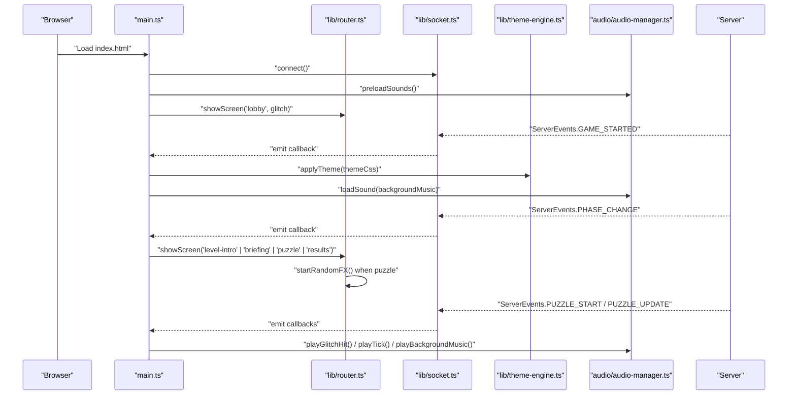

**Diagram sources**
- [main.ts](file://src/client/main.ts#L61-L210)
- [router.ts](file://src/client/lib/router.ts#L17-L39)
- [socket.ts](file://src/client/lib/socket.ts#L11-L41)
- [theme-engine.ts](file://src/client/lib/theme-engine.ts#L9-L31)
- [audio-manager.ts](file://src/client/audio/audio-manager.ts#L59-L85)
- [events.ts](file://shared/events.ts#L53-L90)

## Detailed Component Analysis

### Screen Management System
The screen system consists of five screens rendered inside index.html. The router controls visibility and manages visual FX during puzzle screens.

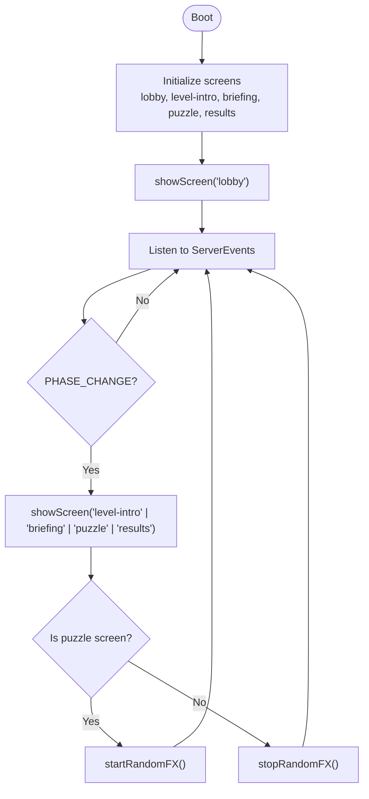

**Diagram sources**
- [main.ts](file://src/client/main.ts#L68-L72)
- [main.ts](file://src/client/main.ts#L142-L162)
- [router.ts](file://src/client/lib/router.ts#L17-L39)

Key responsibilities:
- Router: Switches active screen, logs transitions, and toggles visual FX pools.
- Visual FX: Starts/stops randomized glitch effects when entering/leaving puzzle screens.
- Theme Engine: Applies/removes level themes on game start and phase changes.

**Section sources**
- [index.html](file://src/client/index.html#L24-L38)
- [router.ts](file://src/client/lib/router.ts#L10-L56)
- [visual-fx.ts](file://src/client/lib/visual-fx.ts#L40-L75)
- [theme-engine.ts](file://src/client/lib/theme-engine.ts#L9-L50)

### Router Implementation
The router maintains the current screen and toggles HUD visibility. It also integrates with visual FX to start or stop randomized effects when entering/exiting the puzzle screen.

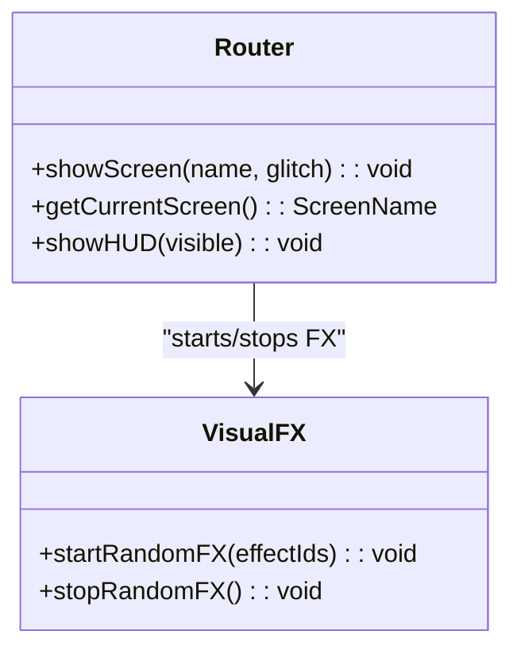

**Diagram sources**
- [router.ts](file://src/client/lib/router.ts#L10-L56)
- [visual-fx.ts](file://src/client/lib/visual-fx.ts#L40-L64)

**Section sources**
- [router.ts](file://src/client/lib/router.ts#L17-L56)

### Socket.IO Client Integration
The Socket wrapper provides typed event handling, connection lifecycle logging, and safe emit/on/off. The main bootstrapper registers handlers for timer, glitch, phase changes, game start, puzzle start, and puzzle completion.

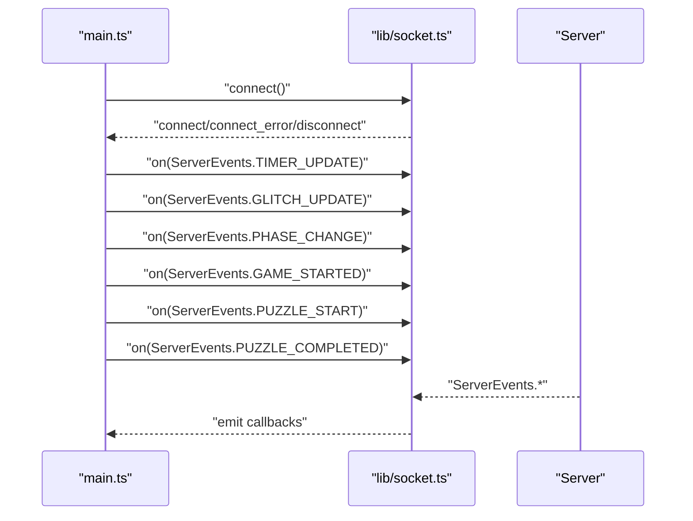

**Diagram sources**
- [socket.ts](file://src/client/lib/socket.ts#L11-L85)
- [main.ts](file://src/client/main.ts#L93-L206)
- [events.ts](file://shared/events.ts#L53-L90)

**Section sources**
- [socket.ts](file://src/client/lib/socket.ts#L11-L85)
- [main.ts](file://src/client/main.ts#L93-L206)

### Theme Engine
The theme engine dynamically loads and removes themed CSS files. It clears previous theme links before applying new ones, ensuring clean state per level.

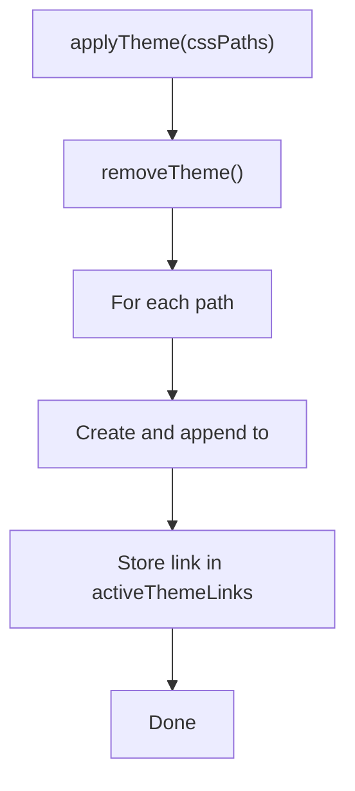

**Diagram sources**
- [theme-engine.ts](file://src/client/lib/theme-engine.ts#L9-L31)

**Section sources**
- [theme-engine.ts](file://src/client/lib/theme-engine.ts#L9-L50)

### DOM Manipulation Utilities
DOM helpers encapsulate element creation, selection, mounting, and clearing. They support attributes, event listeners, and string children.

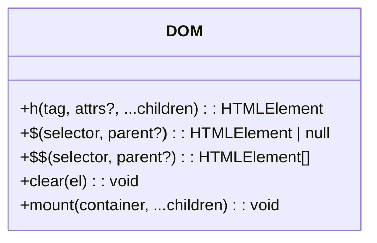

**Diagram sources**
- [dom.ts](file://src/client/lib/dom.ts#L8-L72)

**Section sources**
- [dom.ts](file://src/client/lib/dom.ts#L8-L72)

### Audio Manager and Procedural Sound Generation
The audio manager wraps the Web Audio API for SFX playback, background music, and mute control. It also generates procedural sounds using zzfx for puzzle briefings and glitch hits.

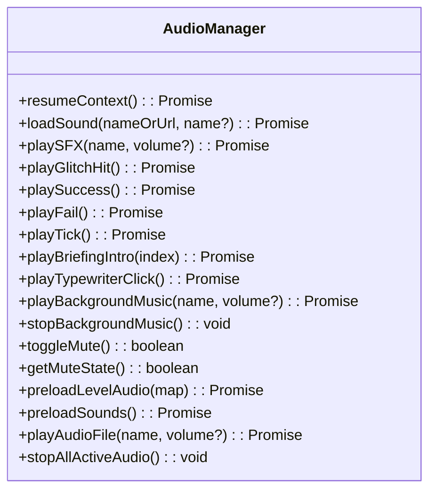

**Diagram sources**
- [audio-manager.ts](file://src/client/audio/audio-manager.ts#L23-L407)

**Section sources**
- [audio-manager.ts](file://src/client/audio/audio-manager.ts#L23-L407)

### Screen: Lobby
The lobby screen handles room creation/joining, displays the player list, allows level selection, and shows the leaderboard. It persists session data in localStorage and restores it on subsequent visits.

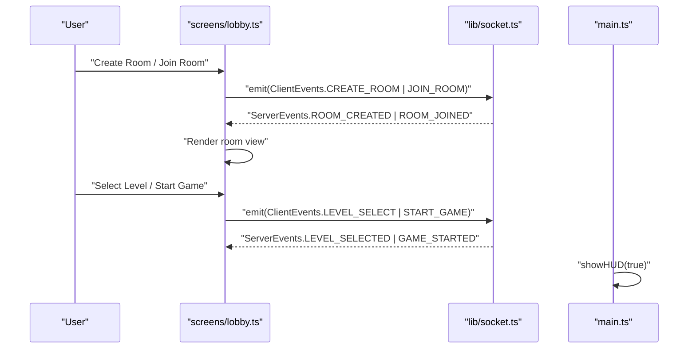

**Diagram sources**
- [lobby.ts](file://src/client/screens/lobby.ts#L263-L335)
- [lobby.ts](file://src/client/screens/lobby.ts#L342-L434)
- [main.ts](file://src/client/main.ts#L418-L421)

**Section sources**
- [lobby.ts](file://src/client/screens/lobby.ts#L46-L82)
- [lobby.ts](file://src/client/screens/lobby.ts#L342-L434)

### Screen: Puzzle
The puzzle screen acts as a container that delegates rendering and updates to puzzle-specific renderers based on the puzzle type.

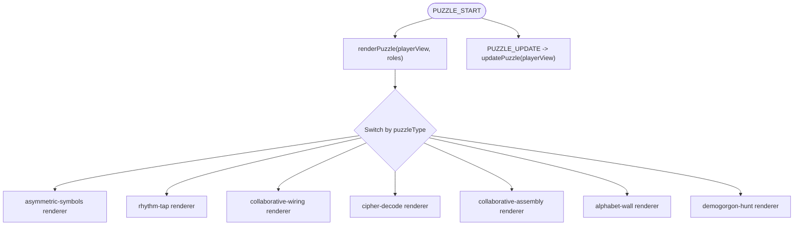

**Diagram sources**
- [puzzle.ts](file://src/client/screens/puzzle.ts#L24-L73)
- [puzzle.ts](file://src/client/screens/puzzle.ts#L75-L100)

**Section sources**
- [puzzle.ts](file://src/client/screens/puzzle.ts#L23-L101)

### HUD and Real-Time Updates
The main bootstrapper listens to server events to update the HUD:
- Timer updates display minutes and seconds, switching to a warning color when time is low and triggering a tick sound near the end.
- Glitch updates adjust the HUD bar and CSS variable for glitch intensity, shaking the screen and playing a glitch hit when intensity rises.
- Phase changes update puzzle progress and manage background music and theme removal on game end.
- Game start stores background music and applies theme.
- Puzzle start plays background music when provided.
- Puzzle completed triggers a celebratory filter effect.

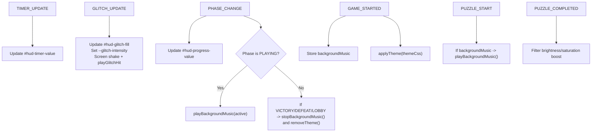

**Diagram sources**
- [main.ts](file://src/client/main.ts#L93-L206)
- [audio-manager.ts](file://src/client/audio/audio-manager.ts#L259-L293)
- [theme-engine.ts](file://src/client/lib/theme-engine.ts#L9-L31)

**Section sources**
- [main.ts](file://src/client/main.ts#L93-L206)

## Dependency Analysis
- Build and dev server: Vite serves the client from src/client, with path aliases for @shared and @client, and proxies /socket.io to the backend.
- Runtime dependencies: socket.io-client, zzfx, and shared packages.
- Client-to-server communication: All events are defined in shared/events.ts and consumed by both sides.

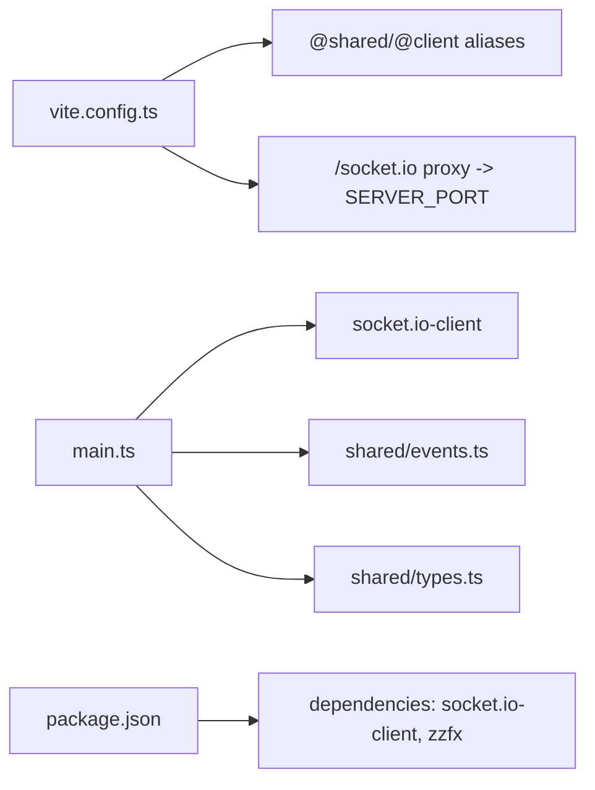

**Diagram sources**
- [vite.config.ts](file://vite.config.ts#L17-L32)
- [package.json](file://package.json#L16-L29)
- [main.ts](file://src/client/main.ts#L14-L26)
- [events.ts](file://shared/events.ts#L28-L90)
- [types.ts](file://shared/types.ts#L26-L49)

**Section sources**
- [vite.config.ts](file://vite.config.ts#L1-L44)
- [package.json](file://package.json#L16-L29)
- [events.ts](file://shared/events.ts#L28-L90)
- [types.ts](file://shared/types.ts#L26-L49)

## Performance Considerations
- Lazy audio decoding: Audio buffers are fetched and decoded after the first user gesture to satisfy browser autoplay policies.
- Background music looping: Music sources are reused when the same track is requested again.
- Visual FX throttling: Random FX cycles are stopped when leaving puzzle screens to reduce overhead.
- Minimal DOM: DOM helpers batch updates and clear containers before mounting new content to avoid leaks.
- Procedural audio: zzfx generates short procedural sounds without fetching assets, reducing latency.

[No sources needed since this section provides general guidance]

## Troubleshooting Guide
Common issues and diagnostics:
- Socket connection errors: The wrapper logs connect_error and disconnect reasons; ensure the proxy in vite.config.ts points to the correct server port.
- Audio not playing: Resume the AudioContext on first user interaction; verify preloadSounds succeeded and that buffers decoded after resume.
- Theme not applied: Confirm theme paths exist relative to the styles directory and that removeTheme clears previous links before applying new ones.
- Screen not transitioning: Verify showScreen is called with a valid ScreenName and that router logs the transition.
- HUD not updating: Check that server events are emitted with correct payloads and that main.ts handlers are registered before connecting.

**Section sources**
- [socket.ts](file://src/client/lib/socket.ts#L24-L34)
- [audio-manager.ts](file://src/client/audio/audio-manager.ts#L33-L54)
- [theme-engine.ts](file://src/client/lib/theme-engine.ts#L36-L50)
- [router.ts](file://src/client/lib/router.ts#L17-L27)
- [main.ts](file://src/client/main.ts#L93-L206)

## Conclusion
The client application is a lean, event-driven system built with vanilla TypeScript and CSS. It leverages a typed Socket.IO wrapper, a minimal DOM helper library, a theme engine, and a Web Audio API-based audio manager to deliver a cohesive, real-time escape room experience. The router and visual FX modules provide smooth transitions and immersive effects, while the screens encapsulate domain-specific rendering logic.

[No sources needed since this section summarizes without analyzing specific files]

## Appendices

### Responsive Design Considerations
- The application uses viewport meta and CSS media queries to adapt to various screen sizes.
- Layouts rely on flexible containers and spacing tokens to maintain readability and usability across devices.
- Visual overlays (scanlines, glitch) are layered to avoid interfering with interactive elements.

[No sources needed since this section provides general guidance]