# Frontend Architecture

<cite>
**Referenced Files in This Document**
- [src/client/main.ts](file://src/client/main.ts)
- [src/client/index.html](file://src/client/index.html)
- [src/client/lib/router.ts](file://src/client/lib/router.ts)
- [src/client/lib/dom.ts](file://src/client/lib/dom.ts)
- [src/client/lib/socket.ts](file://src/client/lib/socket.ts)
- [src/client/lib/theme-engine.ts](file://src/client/lib/theme-engine.ts)
- [src/client/lib/visual-fx.ts](file://src/client/lib/visual-fx.ts)
- [src/client/screens/lobby.ts](file://src/client/screens/lobby.ts)
- [src/client/screens/puzzle.ts](file://src/client/screens/puzzle.ts)
- [src/client/puzzles/asymmetric-symbols.ts](file://src/client/puzzles/asymmetric-symbols.ts)
- [src/client/audio/audio-manager.ts](file://src/client/audio/audio-manager.ts)
- [shared/events.ts](file://shared/events.ts)
- [shared/types.ts](file://shared/types.ts)
- [ARCHITECTURE.md](file://ARCHITECTURE.md)
- [README.md](file://README.md)
</cite>

## Table of Contents
1. [Introduction](#introduction)
2. [Project Structure](#project-structure)
3. [Core Components](#core-components)
4. [Architecture Overview](#architecture-overview)
5. [Detailed Component Analysis](#detailed-component-analysis)
6. [Dependency Analysis](#dependency-analysis)
7. [Performance Considerations](#performance-considerations)
8. [Troubleshooting Guide](#troubleshooting-guide)
9. [Conclusion](#conclusion)
10. [Appendices](#appendices)

## Introduction
This document explains the client-side frontend architecture of Project ODYSSEY, a vanilla TypeScript implementation without frameworks. The application follows a modular design pattern, with explicit separation of concerns across DOM utilities, routing, networking, audio, theming, and visual effects. The system is event-driven: the server emits typed Socket.io events that drive UI transitions, HUD updates, and puzzle rendering. The bootstrapping process initializes the socket connection, preloads audio, initializes all screens, wires global HUD listeners, and exposes developer utilities for rapid iteration.

## Project Structure
The client is served by Vite and consists of:
- An HTML shell with placeholders for screens and a persistent HUD
- A main entry point that orchestrates boot, socket, screens, HUD, and theme
- A library of small, focused modules for DOM, routing, sockets, themes, and visual FX
- Screen modules that encapsulate UI logic and lifecycle
- Puzzle renderer modules that render role-specific views
- An audio manager for Web Audio API and procedural sounds

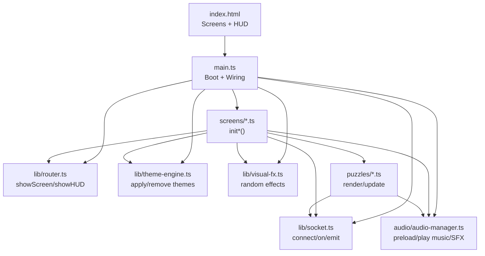

**Diagram sources**
- [src/client/index.html](file://src/client/index.html#L16-L64)
- [src/client/main.ts](file://src/client/main.ts#L47-L262)
- [src/client/lib/router.ts](file://src/client/lib/router.ts#L17-L56)
- [src/client/lib/socket.ts](file://src/client/lib/socket.ts#L11-L85)
- [src/client/lib/theme-engine.ts](file://src/client/lib/theme-engine.ts#L9-L50)
- [src/client/lib/visual-fx.ts](file://src/client/lib/visual-fx.ts#L40-L64)
- [src/client/screens/lobby.ts](file://src/client/screens/lobby.ts#L46-L82)
- [src/client/screens/puzzle.ts](file://src/client/screens/puzzle.ts#L23-L34)
- [src/client/puzzles/asymmetric-symbols.ts](file://src/client/puzzles/asymmetric-symbols.ts#L28-L41)
- [src/client/audio/audio-manager.ts](file://src/client/audio/audio-manager.ts#L59-L85)

**Section sources**
- [src/client/index.html](file://src/client/index.html#L1-L69)
- [ARCHITECTURE.md](file://ARCHITECTURE.md#L68-L96)

## Core Components
- DOM Utilities: Element creation, selection, mounting, and clearing
- Router: Screen switching and HUD visibility
- Socket Wrapper: Typed connect/on/emit with robust error logging
- Theme Engine: Dynamic CSS theme loading and removal
- Visual FX: Randomized glitch effects synchronized with game state
- Screens: Modular UI modules with init functions and socket listeners
- Audio Manager: Web Audio API and procedural sound effects
- Shared Contracts: Typed events and domain types

Key implementation references:
- DOM helpers: [src/client/lib/dom.ts](file://src/client/lib/dom.ts#L11-L72)
- Router: [src/client/lib/router.ts](file://src/client/lib/router.ts#L17-L56)
- Socket wrapper: [src/client/lib/socket.ts](file://src/client/lib/socket.ts#L11-L85)
- Theme engine: [src/client/lib/theme-engine.ts](file://src/client/lib/theme-engine.ts#L9-L50)
- Visual FX: [src/client/lib/visual-fx.ts](file://src/client/lib/visual-fx.ts#L40-L112)
- Screens: [src/client/screens/lobby.ts](file://src/client/screens/lobby.ts#L46-L82), [src/client/screens/puzzle.ts](file://src/client/screens/puzzle.ts#L23-L34)
- Audio manager: [src/client/audio/audio-manager.ts](file://src/client/audio/audio-manager.ts#L59-L85)
- Shared events: [shared/events.ts](file://shared/events.ts#L28-L90)
- Shared types: [shared/types.ts](file://shared/types.ts#L26-L93)

**Section sources**
- [src/client/lib/dom.ts](file://src/client/lib/dom.ts#L11-L72)
- [src/client/lib/router.ts](file://src/client/lib/router.ts#L17-L56)
- [src/client/lib/socket.ts](file://src/client/lib/socket.ts#L11-L85)
- [src/client/lib/theme-engine.ts](file://src/client/lib/theme-engine.ts#L9-L50)
- [src/client/lib/visual-fx.ts](file://src/client/lib/visual-fx.ts#L40-L112)
- [src/client/screens/lobby.ts](file://src/client/screens/lobby.ts#L46-L82)
- [src/client/screens/puzzle.ts](file://src/client/screens/puzzle.ts#L23-L34)
- [src/client/audio/audio-manager.ts](file://src/client/audio/audio-manager.ts#L59-L85)
- [shared/events.ts](file://shared/events.ts#L28-L90)
- [shared/types.ts](file://shared/types.ts#L26-L93)

## Architecture Overview
The client uses a layered, event-driven architecture:
- Entry point initializes the system and registers global listeners
- Router switches between screens and toggles HUD
- Socket wrapper centralizes network communication with typed events
- Screens subscribe to server events and render UI
- Visual FX and Theme integrate with game state
- Audio manager coordinates SFX and background music

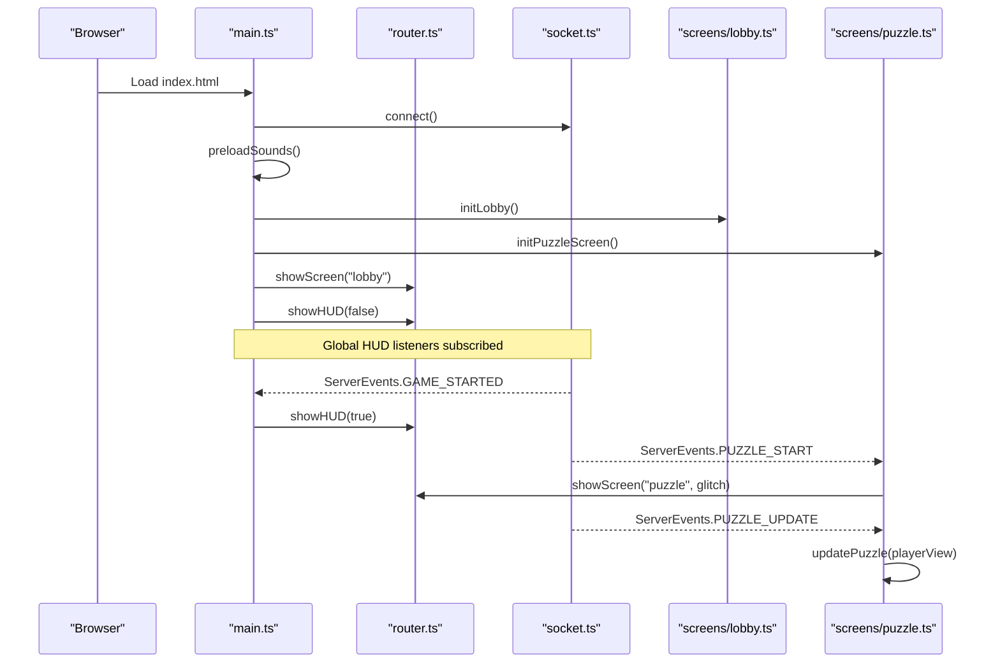

**Diagram sources**
- [src/client/main.ts](file://src/client/main.ts#L47-L262)
- [src/client/lib/router.ts](file://src/client/lib/router.ts#L17-L56)
- [src/client/lib/socket.ts](file://src/client/lib/socket.ts#L11-L85)
- [src/client/screens/lobby.ts](file://src/client/screens/lobby.ts#L46-L82)
- [src/client/screens/puzzle.ts](file://src/client/screens/puzzle.ts#L23-L34)

**Section sources**
- [src/client/main.ts](file://src/client/main.ts#L47-L262)
- [src/client/lib/router.ts](file://src/client/lib/router.ts#L17-L56)
- [src/client/lib/socket.ts](file://src/client/lib/socket.ts#L11-L85)
- [src/client/screens/lobby.ts](file://src/client/screens/lobby.ts#L46-L82)
- [src/client/screens/puzzle.ts](file://src/client/screens/puzzle.ts#L23-L34)

## Detailed Component Analysis

### Entry Point and Bootstrapping
- Initializes audio context on first user interaction
- Connects to the server via Socket.io
- Preloads audio resources
- Initializes all screens
- Wires HUD listeners for timer, glitch, phase, and puzzle start/completion
- Starts on the lobby screen with HUD hidden
- Provides developer utilities for URL-based puzzle jumps and a global helper

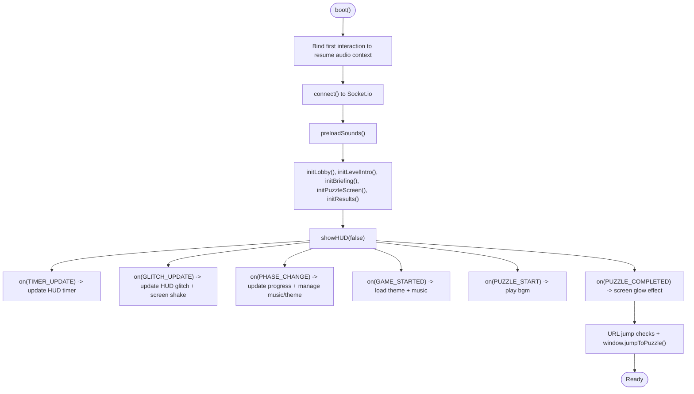

**Diagram sources**
- [src/client/main.ts](file://src/client/main.ts#L47-L262)

**Section sources**
- [src/client/main.ts](file://src/client/main.ts#L47-L262)

### DOM Manipulation Utilities
- Element creation with attributes and children
- Query single/multiple elements
- Clear container contents
- Mount content into a container (clear then append)

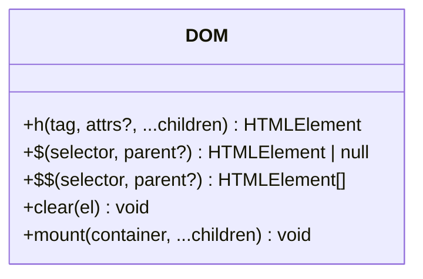

**Diagram sources**
- [src/client/lib/dom.ts](file://src/client/lib/dom.ts#L11-L72)

**Section sources**
- [src/client/lib/dom.ts](file://src/client/lib/dom.ts#L11-L72)

### Router and Screen Management
- Switches active screen by adding/removing "active" class
- Manages HUD visibility
- Starts/stops randomized visual FX based on current screen and glitch state

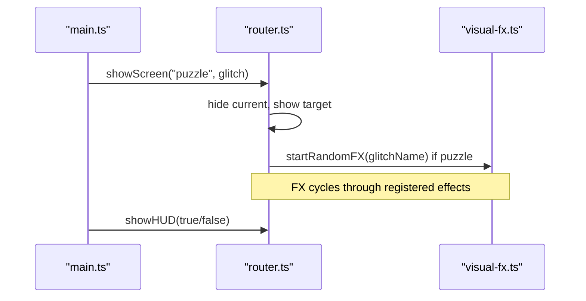

**Diagram sources**
- [src/client/lib/router.ts](file://src/client/lib/router.ts#L17-L56)
- [src/client/lib/visual-fx.ts](file://src/client/lib/visual-fx.ts#L40-L64)

**Section sources**
- [src/client/lib/router.ts](file://src/client/lib/router.ts#L17-L56)
- [src/client/lib/visual-fx.ts](file://src/client/lib/visual-fx.ts#L40-L64)

### Socket Layer and Event-Driven Architecture
- Typed client/server event names
- Connects to Socket.io with reconnection
- Emits client events and subscribes to server events
- Exposes helpers to get player ID and manage handlers

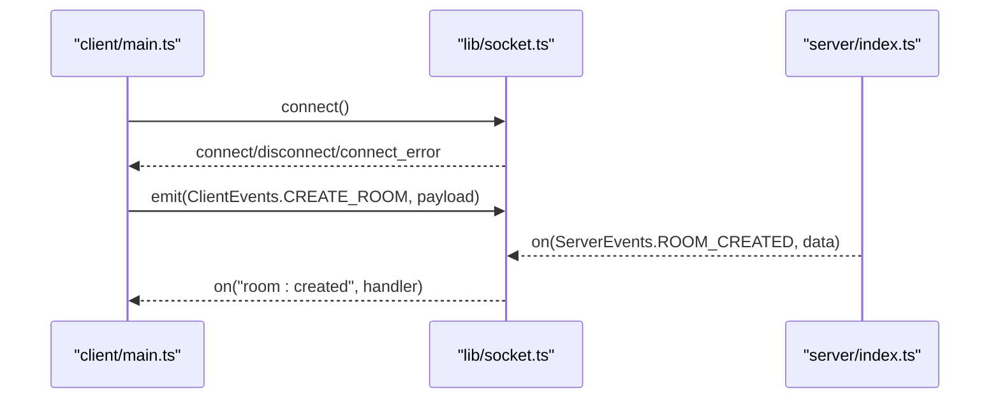

**Diagram sources**
- [src/client/lib/socket.ts](file://src/client/lib/socket.ts#L11-L85)
- [shared/events.ts](file://shared/events.ts#L28-L90)

**Section sources**
- [src/client/lib/socket.ts](file://src/client/lib/socket.ts#L11-L85)
- [shared/events.ts](file://shared/events.ts#L28-L90)

### Theme Engine
- Dynamically loads theme CSS files into the document head
- Removes previously applied theme links before applying a new theme
- Logs debug and error messages

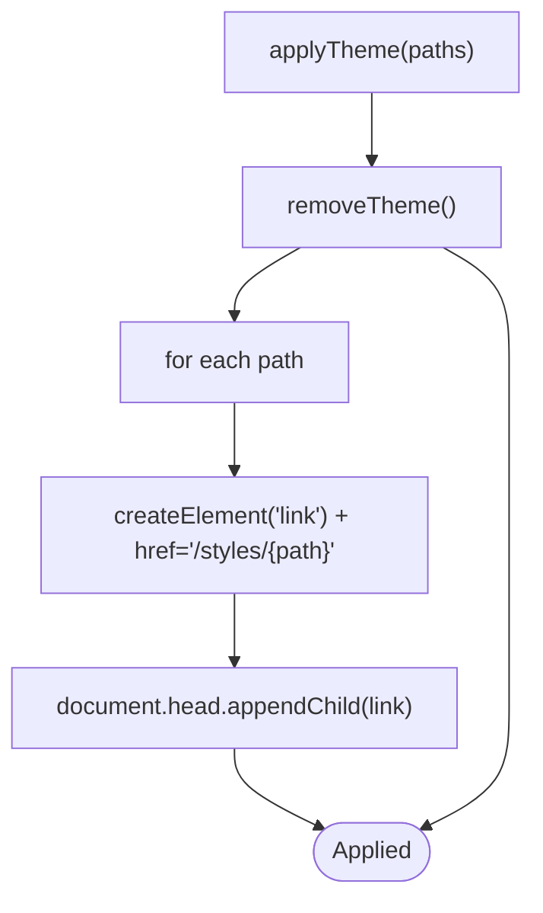

**Diagram sources**
- [src/client/lib/theme-engine.ts](file://src/client/lib/theme-engine.ts#L9-L50)

**Section sources**
- [src/client/lib/theme-engine.ts](file://src/client/lib/theme-engine.ts#L9-L50)

### Visual FX
- Registers named effects (e.g., matrix-glitch, lights-glitch)
- Starts/stops a randomized cycle of effects
- Triggers effects with configurable durations

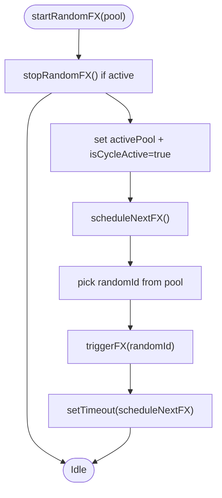

**Diagram sources**
- [src/client/lib/visual-fx.ts](file://src/client/lib/visual-fx.ts#L40-L75)

**Section sources**
- [src/client/lib/visual-fx.ts](file://src/client/lib/visual-fx.ts#L40-L75)

### Screens: Lobby and Puzzle
- Lobby screen: handles room creation/joining, player list, level selection, leaderboard, and re-join on reconnect
- Puzzle screen: renders the correct puzzle renderer based on type and updates it on state changes

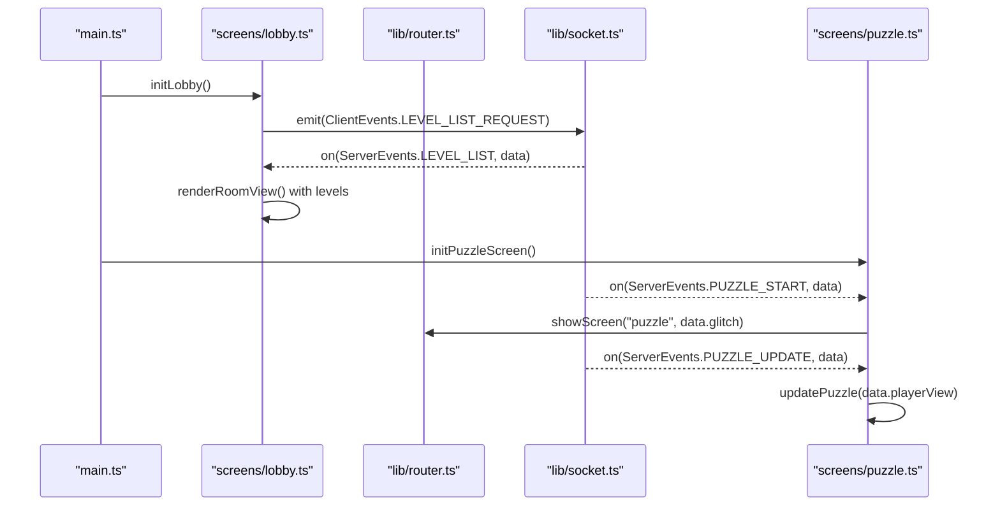

**Diagram sources**
- [src/client/screens/lobby.ts](file://src/client/screens/lobby.ts#L46-L82)
- [src/client/screens/puzzle.ts](file://src/client/screens/puzzle.ts#L23-L34)
- [src/client/lib/router.ts](file://src/client/lib/router.ts#L17-L56)
- [src/client/lib/socket.ts](file://src/client/lib/socket.ts#L11-L85)

**Section sources**
- [src/client/screens/lobby.ts](file://src/client/screens/lobby.ts#L46-L82)
- [src/client/screens/puzzle.ts](file://src/client/screens/puzzle.ts#L23-L34)

### Puzzle Renderer Example: Asymmetric Symbols
- Renders Navigator vs Decoder views
- Spawns flying letters with seeded PRNG for deterministic behavior
- Emits actions to the server and updates UI based on player view

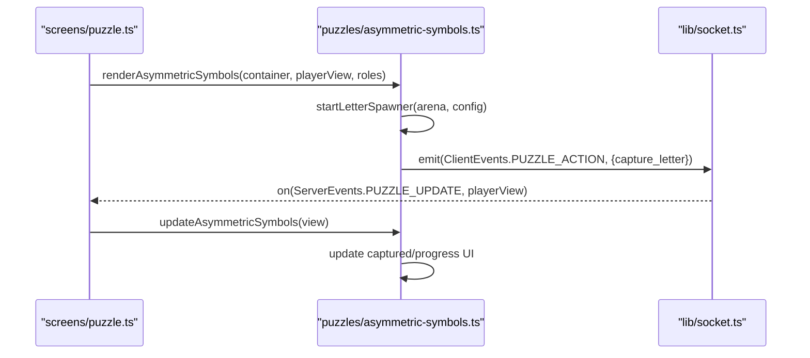

**Diagram sources**
- [src/client/screens/puzzle.ts](file://src/client/screens/puzzle.ts#L36-L73)
- [src/client/puzzles/asymmetric-symbols.ts](file://src/client/puzzles/asymmetric-symbols.ts#L28-L41)
- [src/client/puzzles/asymmetric-symbols.ts](file://src/client/puzzles/asymmetric-symbols.ts#L162-L211)

**Section sources**
- [src/client/screens/puzzle.ts](file://src/client/screens/puzzle.ts#L36-L73)
- [src/client/puzzles/asymmetric-symbols.ts](file://src/client/puzzles/asymmetric-symbols.ts#L28-L41)
- [src/client/puzzles/asymmetric-symbols.ts](file://src/client/puzzles/asymmetric-symbols.ts#L162-L211)

### Audio Manager
- Loads and decodes audio buffers on demand or on resume
- Plays SFX, procedural glitch hits, success/fail tones, and background music
- Manages mute state and gain nodes
- Preloads common sounds and level-specific cues

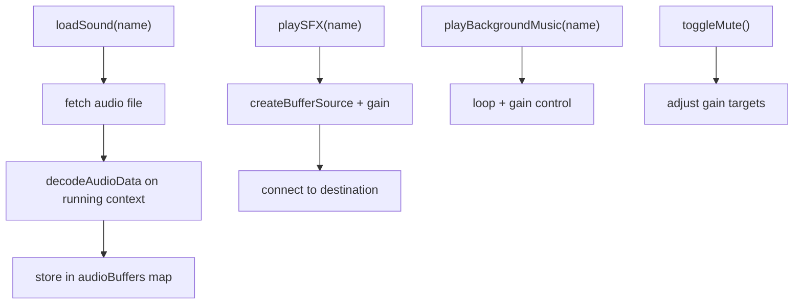

**Diagram sources**
- [src/client/audio/audio-manager.ts](file://src/client/audio/audio-manager.ts#L59-L85)
- [src/client/audio/audio-manager.ts](file://src/client/audio/audio-manager.ts#L90-L113)
- [src/client/audio/audio-manager.ts](file://src/client/audio/audio-manager.ts#L259-L293)
- [src/client/audio/audio-manager.ts](file://src/client/audio/audio-manager.ts#L310-L327)

**Section sources**
- [src/client/audio/audio-manager.ts](file://src/client/audio/audio-manager.ts#L59-L85)
- [src/client/audio/audio-manager.ts](file://src/client/audio/audio-manager.ts#L90-L113)
- [src/client/audio/audio-manager.ts](file://src/client/audio/audio-manager.ts#L259-L293)
- [src/client/audio/audio-manager.ts](file://src/client/audio/audio-manager.ts#L310-L327)

## Dependency Analysis
- Entry point depends on socket, router, theme engine, audio manager, and all screen modules
- Screens depend on DOM utilities, socket wrapper, router, and optionally audio/theme/visual FX
- Puzzle renderers depend on DOM utilities, socket wrapper, and audio manager
- Shared contracts (events and types) are consumed by both server and client

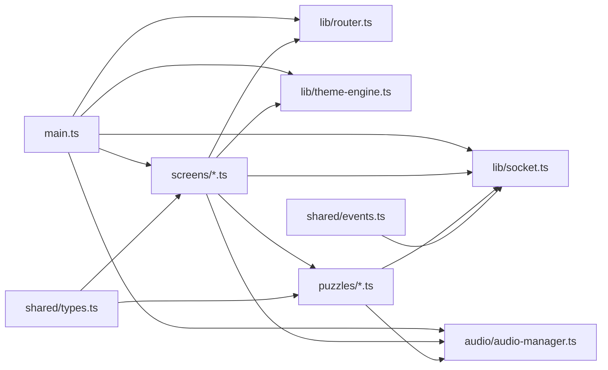

**Diagram sources**
- [src/client/main.ts](file://src/client/main.ts#L14-L44)
- [src/client/lib/socket.ts](file://src/client/lib/socket.ts#L5-L7)
- [src/client/lib/router.ts](file://src/client/lib/router.ts#L5-L8)
- [src/client/lib/theme-engine.ts](file://src/client/lib/theme-engine.ts#L1-L2)
- [src/client/lib/visual-fx.ts](file://src/client/lib/visual-fx.ts#L5-L7)
- [src/client/screens/lobby.ts](file://src/client/screens/lobby.ts#L14-L30)
- [src/client/screens/puzzle.ts](file://src/client/screens/puzzle.ts#L5-L19)
- [src/client/puzzles/asymmetric-symbols.ts](file://src/client/puzzles/asymmetric-symbols.ts#L5-L8)
- [shared/events.ts](file://shared/events.ts#L14-L24)
- [shared/types.ts](file://shared/types.ts#L5-L22)

**Section sources**
- [src/client/main.ts](file://src/client/main.ts#L14-L44)
- [src/client/lib/socket.ts](file://src/client/lib/socket.ts#L5-L7)
- [src/client/lib/router.ts](file://src/client/lib/router.ts#L5-L8)
- [src/client/lib/theme-engine.ts](file://src/client/lib/theme-engine.ts#L1-L2)
- [src/client/lib/visual-fx.ts](file://src/client/lib/visual-fx.ts#L5-L7)
- [src/client/screens/lobby.ts](file://src/client/screens/lobby.ts#L14-L30)
- [src/client/screens/puzzle.ts](file://src/client/screens/puzzle.ts#L5-L19)
- [src/client/puzzles/asymmetric-symbols.ts](file://src/client/puzzles/asymmetric-symbols.ts#L5-L8)
- [shared/events.ts](file://shared/events.ts#L14-L24)
- [shared/types.ts](file://shared/types.ts#L5-L22)

## Performance Considerations
- Lazy audio decoding on first user gesture avoids autoplay restrictions and reduces initial boot latency
- Preloading prioritizes common SFX and level cues to minimize perceived delays during gameplay
- Visual FX cycles are throttled with random intervals and stopped when not in puzzle screens
- DOM operations use targeted queries and minimal reflows by replacing innerHTML and appending nodes efficiently
- Puzzle renderers restart spawners only when configuration changes, avoiding unnecessary work

## Troubleshooting Guide
- Socket connection errors: The socket wrapper logs connect_error and throws to surface issues early
- Uninitialized socket: getSocket() throws if connect() was not called first; ensure boot() runs before emitting
- HUD updates failing: Global listeners wrap updates in try/catch and log errors; verify element IDs match the HTML shell
- Theme application failures: Theme engine logs errors and removes partially applied styles; ensure CSS paths are correct
- Audio not playing: Resume context on first interaction; verify resumeContext() is triggered by user gesture
- Developer jump utilities: URL parsing and window.jumpToPuzzle() provide controlled testing; ensure room code exists before jumping

**Section sources**
- [src/client/lib/socket.ts](file://src/client/lib/socket.ts#L24-L38)
- [src/client/lib/socket.ts](file://src/client/lib/socket.ts#L44-L48)
- [src/client/main.ts](file://src/client/main.ts#L93-L111)
- [src/client/lib/theme-engine.ts](file://src/client/lib/theme-engine.ts#L28-L30)
- [src/client/audio/audio-manager.ts](file://src/client/audio/audio-manager.ts#L33-L54)
- [src/client/main.ts](file://src/client/main.ts#L213-L256)

## Conclusion
Project ODYSSEY’s client is a modular, event-driven system built with vanilla TypeScript and manual DOM manipulation. The entry point orchestrates initialization, the router manages screens and HUD, the socket wrapper provides typed networking, and specialized modules handle audio, themes, and visual effects. Screens and puzzle renderers encapsulate UI logic and react to server events, enabling a scalable and maintainable architecture without frameworks.

## Appendices
- Development tools integration: URL-based puzzle jumps and a global helper enable rapid iteration during development
- HTML shell: Defines screen containers and HUD elements wired to the router and HUD listeners

**Section sources**
- [src/client/main.ts](file://src/client/main.ts#L213-L256)
- [src/client/index.html](file://src/client/index.html#L16-L64)
- [README.md](file://README.md#L104-L132)
- [ARCHITECTURE.md](file://ARCHITECTURE.md#L154-L178)