# Real-time Communication

<cite>
**Referenced Files in This Document**
- [events.ts](file://shared/events.ts)
- [types.ts](file://shared/types.ts)
- [socket.ts](file://src/client/lib/socket.ts)
- [main.ts](file://src/client/main.ts)
- [router.ts](file://src/client/lib/router.ts)
- [lobby.ts](file://src/client/screens/lobby.ts)
- [puzzle.ts](file://src/client/screens/puzzle.ts)
- [asymmetric-symbols.ts](file://src/client/puzzles/asymmetric-symbols.ts)
- [cipher-decode.ts](file://src/client/puzzles/cipher-decode.ts)
- [index.ts](file://src/server/index.ts)
- [game-engine.ts](file://src/server/services/game-engine.ts)
- [room-manager.ts](file://src/server/services/room-manager.ts)
- [ARCHITECTURE.md](file://ARCHITECTURE.md)
- [logger.ts](file://src/client/logger.ts)
</cite>

## Table of Contents
1. [Introduction](#introduction)
2. [Project Structure](#project-structure)
3. [Core Components](#core-components)
4. [Architecture Overview](#architecture-overview)
5. [Detailed Component Analysis](#detailed-component-analysis)
6. [Dependency Analysis](#dependency-analysis)
7. [Performance Considerations](#performance-considerations)
8. [Troubleshooting Guide](#troubleshooting-guide)
9. [Conclusion](#conclusion)

## Introduction
This document explains the Socket.IO client implementation and real-time communication system powering the co-op escape room. It covers connection management, typed event contracts, event lifecycle, error propagation, reconnection strategies, and integration with game state updates, HUD synchronization, and user interactions. It also documents client-side event types, payload structures, validation patterns, debugging techniques, connection status monitoring, and performance considerations.

## Project Structure
The real-time system spans shared contracts, server orchestration, and client screens/renderers:
- Shared contracts define event names and payload interfaces for compile-time safety.
- The server initializes Socket.IO, wires event handlers, and orchestrates game state.
- The client connects, registers event listeners, renders HUD and screens, and emits user actions.

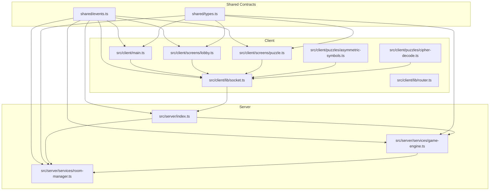

**Diagram sources**
- [events.ts](file://shared/events.ts#L1-L228)
- [types.ts](file://shared/types.ts#L1-L187)
- [socket.ts](file://src/client/lib/socket.ts#L1-L85)
- [main.ts](file://src/client/main.ts#L1-L266)
- [router.ts](file://src/client/lib/router.ts#L1-L57)
- [lobby.ts](file://src/client/screens/lobby.ts#L1-L435)
- [puzzle.ts](file://src/client/screens/puzzle.ts#L1-L101)
- [asymmetric-symbols.ts](file://src/client/puzzles/asymmetric-symbols.ts#L1-L221)
- [cipher-decode.ts](file://src/client/puzzles/cipher-decode.ts#L1-L152)
- [index.ts](file://src/server/index.ts#L1-L321)
- [game-engine.ts](file://src/server/services/game-engine.ts#L1-L711)
- [room-manager.ts](file://src/server/services/room-manager.ts#L1-L262)

**Section sources**
- [ARCHITECTURE.md](file://ARCHITECTURE.md#L1-L202)
- [events.ts](file://shared/events.ts#L1-L228)
- [types.ts](file://shared/types.ts#L1-L187)
- [socket.ts](file://src/client/lib/socket.ts#L1-L85)
- [main.ts](file://src/client/main.ts#L1-L266)
- [index.ts](file://src/server/index.ts#L1-L321)

## Core Components
- Typed event contracts: centralized event names and payload interfaces ensure consistency between client and server.
- Client socket wrapper: initialization, connection lifecycle hooks, and safe emit/on/off helpers.
- Server socket wiring: all client events mapped to service handlers; broadcasts to rooms and clients.
- Game engine: orchestrates phases, timers, roles, puzzle actions, and outcomes.
- Room manager: in-memory rooms with Redis persistence and reconnection logic.
- Client screens: lobby, puzzle container, and HUD synchronization.

**Section sources**
- [events.ts](file://shared/events.ts#L26-L90)
- [socket.ts](file://src/client/lib/socket.ts#L11-L85)
- [index.ts](file://src/server/index.ts#L86-L305)
- [game-engine.ts](file://src/server/services/game-engine.ts#L57-L139)
- [room-manager.ts](file://src/server/services/room-manager.ts#L60-L154)
- [lobby.ts](file://src/client/screens/lobby.ts#L46-L82)
- [puzzle.ts](file://src/client/screens/puzzle.ts#L23-L34)

## Architecture Overview
The real-time flow is a typed, bidirectional pipeline:
- Client emits typed events to the server.
- Server validates context, mutates room/game state, and emits typed server events.
- Client listens to server events to update screens, HUD, and puzzle renderers.

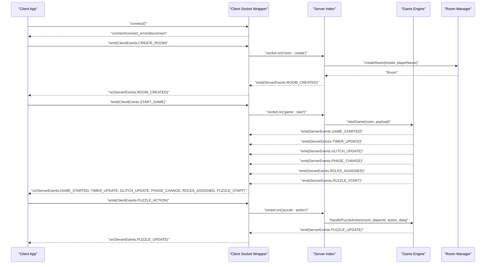

**Diagram sources**
- [socket.ts](file://src/client/lib/socket.ts#L11-L85)
- [index.ts](file://src/server/index.ts#L89-L217)
- [game-engine.ts](file://src/server/services/game-engine.ts#L57-L424)
- [room-manager.ts](file://src/server/services/room-manager.ts#L60-L154)
- [lobby.ts](file://src/client/screens/lobby.ts#L342-L434)
- [puzzle.ts](file://src/client/screens/puzzle.ts#L23-L34)

## Detailed Component Analysis

### Typed Event System and Contracts
- Event names are centralized for client→server and server→client directions.
- Payload interfaces define strict shapes for all events, preventing magic strings and enabling compile-time checks.
- Shared types define domain entities (Player, Room, GameState, PuzzleState, etc.).

```mermaid
classDiagram
class ClientEvents {
+CREATE_ROOM
+JOIN_ROOM
+LEAVE_ROOM
+START_GAME
+PUZZLE_ACTION
+REQUEST_HINT
+PLAYER_READY
+INTRO_COMPLETE
+TOGGLE_DEBUG
+JUMP_TO_PUZZLE
+LEVEL_LIST_REQUEST
+LEVEL_SELECT
+LEADERBOARD_REQUEST
}
class ServerEvents {
+ROOM_CREATED
+ROOM_JOINED
+ROOM_LEFT
+PLAYER_LIST_UPDATE
+ROOM_ERROR
+GAME_STARTED
+PHASE_CHANGE
+BRIEFING
+PUZZLE_START
+PUZZLE_UPDATE
+PUZZLE_COMPLETED
+PUZZLE_TRANSITION
+PLAYER_READY_UPDATE
+ROLES_ASSIGNED
+GLITCH_UPDATE
+TIMER_UPDATE
+PLAYER_VIEW
+VICTORY
+DEFEAT
+DEBUG_UPDATE
+LEVEL_LIST
+LEVEL_SELECTED
+LEADERBOARD_LIST
}
class CreateRoomPayload {
+string playerName
}
class JoinRoomPayload {
+string roomCode
+string playerName
}
class StartGamePayload {
+string levelId
+number startingPuzzleIndex
}
class RoomCreatedPayload {
+string roomCode
+Player player
+GameState gameState
}
class RoomJoinedPayload {
+string roomCode
+Player player
+Player[] players
+GameState gameState
}
class GameStartedPayload {
+string levelId
+string levelTitle
+string levelStory
+string levelIntroAudio
+string backgroundMusic
+string[] themeCss
+GlitchState glitch
+number totalPuzzles
+number timerSeconds
+boolean isJumpStart
}
class PhaseChangePayload {
+GamePhase phase
+number puzzleIndex
}
class BriefingPayload {
+string puzzleTitle
+string briefingText
+number puzzleIndex
+number totalPuzzles
+number totalRoomPlayers
}
class PlayerReadyUpdatePayload {
+number readyCount
+number totalPlayers
}
class PuzzleStartPayload {
+string puzzleId
+string puzzleType
+string puzzleTitle
+RoleAssignment[] roles
+PlayerView playerView
+GlitchState glitch
+string backgroundMusic
}
class PuzzleUpdatePayload {
+string puzzleId
+PlayerView playerView
}
class GlitchUpdatePayload {
+GlitchState glitch
}
class TimerUpdatePayload {
+TimerState timer
}
class VictoryPayload {
+number elapsedSeconds
+number glitchFinal
+number puzzlesCompleted
+number score
}
class DefeatPayload {
+enum reason
+number puzzlesCompleted
+number puzzleReachedIndex
}
ClientEvents --> CreateRoomPayload : "maps to"
ClientEvents --> JoinRoomPayload : "maps to"
ClientEvents --> StartGamePayload : "maps to"
ServerEvents --> RoomCreatedPayload : "maps to"
ServerEvents --> RoomJoinedPayload : "maps to"
ServerEvents --> GameStartedPayload : "maps to"
ServerEvents --> PhaseChangePayload : "maps to"
ServerEvents --> BriefingPayload : "maps to"
ServerEvents --> PlayerReadyUpdatePayload : "maps to"
ServerEvents --> PuzzleStartPayload : "maps to"
ServerEvents --> PuzzleUpdatePayload : "maps to"
ServerEvents --> GlitchUpdatePayload : "maps to"
ServerEvents --> TimerUpdatePayload : "maps to"
ServerEvents --> VictoryPayload : "maps to"
ServerEvents --> DefeatPayload : "maps to"
```

**Diagram sources**
- [events.ts](file://shared/events.ts#L26-L227)
- [types.ts](file://shared/types.ts#L7-L182)

**Section sources**
- [events.ts](file://shared/events.ts#L26-L227)
- [types.ts](file://shared/types.ts#L7-L182)

### Client Socket Connection Management
- Initializes Socket.IO with automatic reconnection and retry policy.
- Registers connection lifecycle listeners for logging and diagnostics.
- Provides safe emit/on/off wrappers and a getter for the socket ID.

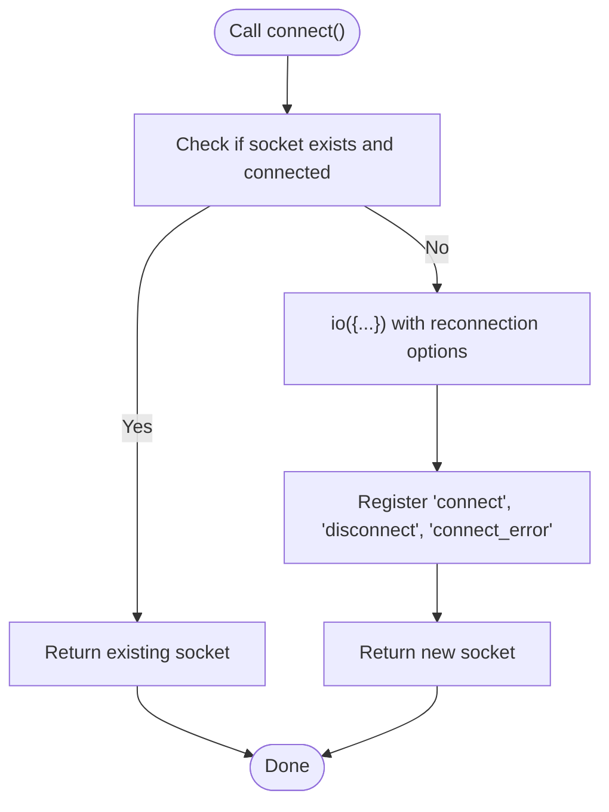

**Diagram sources**
- [socket.ts](file://src/client/lib/socket.ts#L11-L41)

**Section sources**
- [socket.ts](file://src/client/lib/socket.ts#L11-L85)

### Event Lifecycle: Emission to Handling
- Client emits typed events (e.g., room actions, puzzle actions).
- Server validates context (e.g., host permissions), mutates state, and emits typed server events.
- Client listeners update HUD, screens, and puzzle renderers.

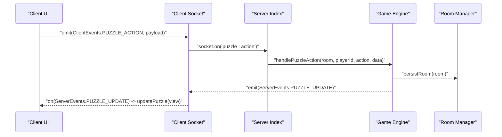

**Diagram sources**
- [index.ts](file://src/server/index.ts#L206-L217)
- [game-engine.ts](file://src/server/services/game-engine.ts#L324-L383)
- [puzzle.ts](file://src/client/screens/puzzle.ts#L31-L33)

**Section sources**
- [index.ts](file://src/server/index.ts#L89-L217)
- [game-engine.ts](file://src/server/services/game-engine.ts#L324-L383)
- [puzzle.ts](file://src/client/screens/puzzle.ts#L23-L34)

### HUD Synchronization and Game State Updates
- Timer updates: parse seconds, display mm:ss, and apply warning styling when low.
- Glitch updates: update HUD bar width and CSS variable for visual intensity; trigger screen shake and audio cues.
- Phase changes: update progress HUD and manage background music/theme lifecycle.
- Puzzle start/completion: load and play music, apply theme, and provide celebratory effects.

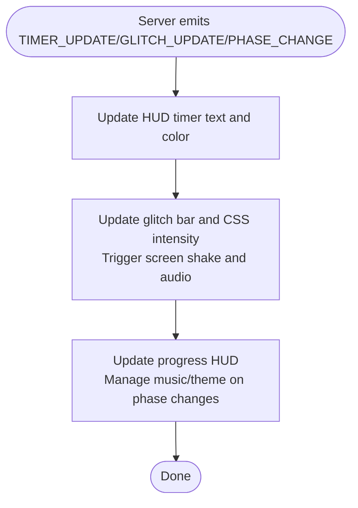

**Diagram sources**
- [main.ts](file://src/client/main.ts#L93-L206)

**Section sources**
- [main.ts](file://src/client/main.ts#L93-L206)

### Lobby and Room Management
- Create/join/leave room flows, player list updates, level selection, and leaderboard retrieval.
- Re-join on reconnection using persisted session data.
- Host-only controls for starting and selecting levels.

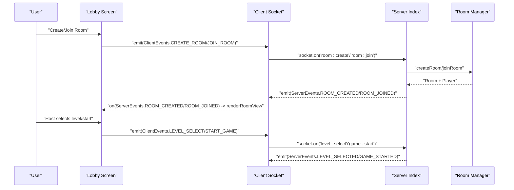

**Diagram sources**
- [lobby.ts](file://src/client/screens/lobby.ts#L263-L335)
- [index.ts](file://src/server/index.ts#L89-L171)
- [room-manager.ts](file://src/server/services/room-manager.ts#L60-L154)

**Section sources**
- [lobby.ts](file://src/client/screens/lobby.ts#L46-L82)
- [lobby.ts](file://src/client/screens/lobby.ts#L342-L434)
- [index.ts](file://src/server/index.ts#L89-L171)
- [room-manager.ts](file://src/server/services/room-manager.ts#L60-L154)

### Puzzle Interaction Patterns
- Asymmetric Symbols: Navigator sees solution, Decoders click letters; client emits capture actions.
- Cipher Decode: Cryptographer shares key, Scribe submits decoded text; client emits decode actions.
- Generic pattern: client renders role-specific UI, emits PUZZLE_ACTION with puzzleId, action, and data; server responds with PUZZLE_UPDATE.

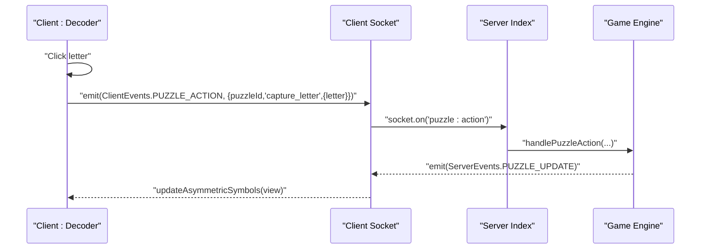

**Diagram sources**
- [asymmetric-symbols.ts](file://src/client/puzzles/asymmetric-symbols.ts#L148-L160)
- [index.ts](file://src/server/index.ts#L206-L217)
- [game-engine.ts](file://src/server/services/game-engine.ts#L324-L383)

**Section sources**
- [asymmetric-symbols.ts](file://src/client/puzzles/asymmetric-symbols.ts#L148-L160)
- [cipher-decode.ts](file://src/client/puzzles/cipher-decode.ts#L123-L134)
- [puzzle.ts](file://src/client/screens/puzzle.ts#L75-L100)

### Error Propagation and Reconnection Strategies
- Client logs connection errors and disconnections; reconnection is automatic with retry limits.
- Server emits ROOM_ERROR on failures; client displays messages and persists session data for re-join.
- On reconnection, client re-joins the room using local storage if still valid.

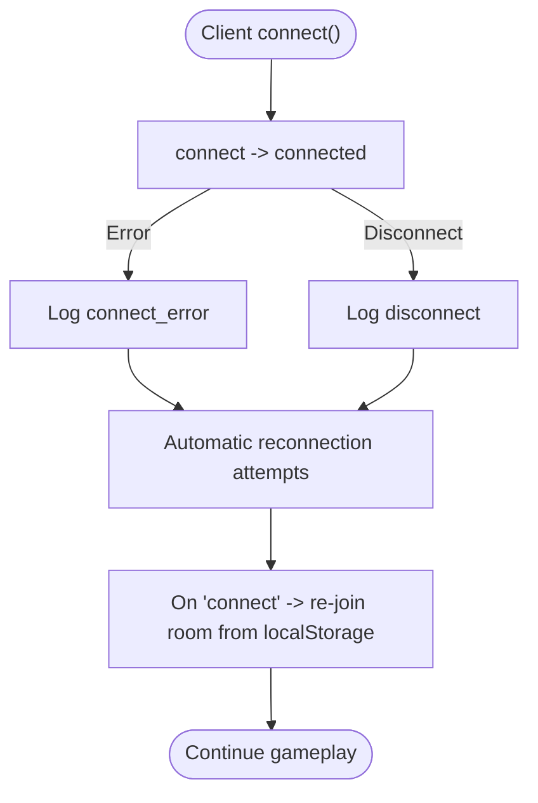

**Diagram sources**
- [socket.ts](file://src/client/lib/socket.ts#L24-L38)
- [lobby.ts](file://src/client/screens/lobby.ts#L354-L372)

**Section sources**
- [socket.ts](file://src/client/lib/socket.ts#L11-L85)
- [lobby.ts](file://src/client/screens/lobby.ts#L354-L372)
- [index.ts](file://src/server/index.ts#L297-L304)

### Integration with Game State, HUD, and Screens
- Router coordinates screen visibility and visual FX based on current phase and glitch state.
- HUD updates are driven by server events for timer, glitch, and phase changes.
- Puzzle container dispatches to specific puzzle renderers based on puzzle type.

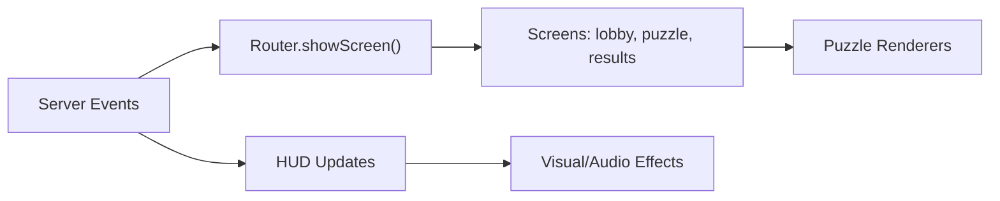

**Diagram sources**
- [main.ts](file://src/client/main.ts#L93-L206)
- [router.ts](file://src/client/lib/router.ts#L17-L39)
- [puzzle.ts](file://src/client/screens/puzzle.ts#L23-L34)

**Section sources**
- [main.ts](file://src/client/main.ts#L93-L206)
- [router.ts](file://src/client/lib/router.ts#L17-L39)
- [puzzle.ts](file://src/client/screens/puzzle.ts#L23-L34)

## Dependency Analysis
- Shared contracts are the single source of truth for events and types.
- Client depends on shared contracts and socket wrapper; server depends on shared contracts and services.
- Services depend on repositories and utilities; client screens depend on DOM helpers and socket wrapper.

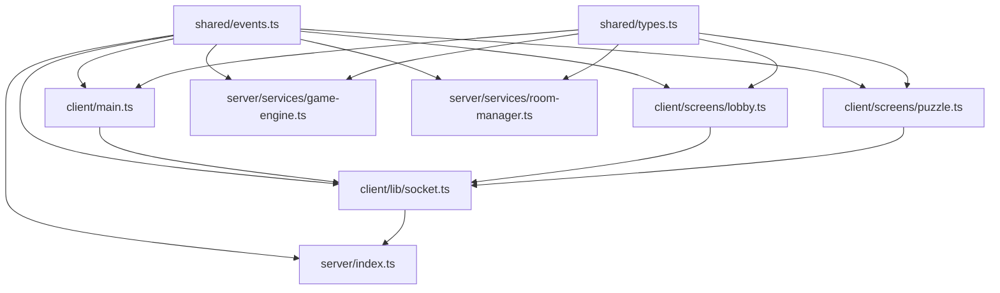

**Diagram sources**
- [events.ts](file://shared/events.ts#L1-L228)
- [types.ts](file://shared/types.ts#L1-L187)
- [socket.ts](file://src/client/lib/socket.ts#L1-L85)
- [main.ts](file://src/client/main.ts#L1-L266)
- [lobby.ts](file://src/client/screens/lobby.ts#L1-L435)
- [puzzle.ts](file://src/client/screens/puzzle.ts#L1-L101)
- [index.ts](file://src/server/index.ts#L1-L321)
- [game-engine.ts](file://src/server/services/game-engine.ts#L1-L711)
- [room-manager.ts](file://src/server/services/room-manager.ts#L1-L262)

**Section sources**
- [ARCHITECTURE.md](file://ARCHITECTURE.md#L143-L150)
- [events.ts](file://shared/events.ts#L1-L228)
- [types.ts](file://shared/types.ts#L1-L187)

## Performance Considerations
- Minimize redundant emits: batch puzzle actions when appropriate and avoid frequent re-renders.
- Use targeted updates: only update DOM elements that change (e.g., timer text, glitch bar).
- Debounce user inputs: throttle rapid submissions in puzzles to reduce network traffic.
- Efficient timers: server-side timers broadcast periodic updates; client should avoid recalculating derived values unnecessarily.
- Memory cleanup: clear intervals and timers when switching screens or puzzles to prevent leaks.

[No sources needed since this section provides general guidance]

## Troubleshooting Guide
- Connection issues:
  - Verify automatic reconnection settings and inspect logs for connect_error and disconnect reasons.
  - Confirm CORS configuration on the server matches the client origin.
- Event mismatches:
  - Ensure event names and payload shapes match shared contracts.
  - Validate that handlers are registered in server index and listeners are attached in client screens.
- State desync:
  - Use syncPlayer on join to restore state for late joiners.
  - Check Redis persistence for room state consistency.
- Logging:
  - Client-side logger respects environment log level; enable DEBUG in development for detailed traces.
  - Server-side logger records errors and warnings for handlers and timers.

**Section sources**
- [socket.ts](file://src/client/lib/socket.ts#L17-L38)
- [index.ts](file://src/server/index.ts#L54-L59)
- [game-engine.ts](file://src/server/services/game-engine.ts#L601-L665)
- [logger.ts](file://src/client/logger.ts#L15-L38)

## Conclusion
The real-time communication system is built around typed contracts, robust server orchestration, and responsive client rendering. The typed event model ensures reliability, while the game engine and room manager provide a clear state machine and persistence strategy. Clients monitor connection status, rejoin rooms automatically, and synchronize HUD and screens through server-driven events. Following the documented patterns and troubleshooting steps will help maintain stability and performance in multiplayer scenarios.