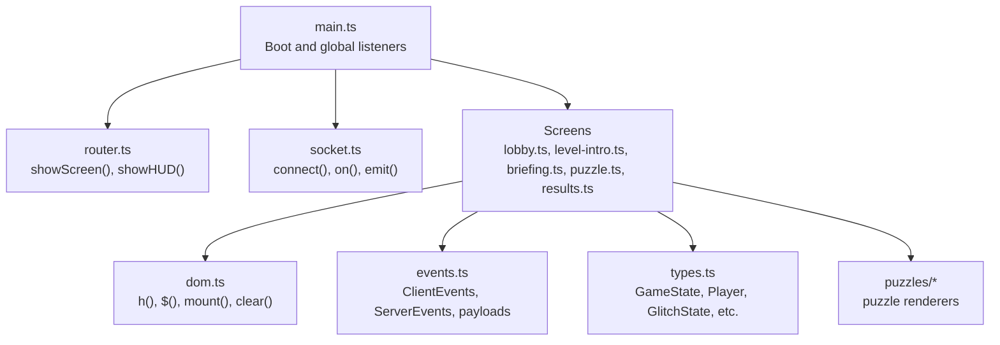
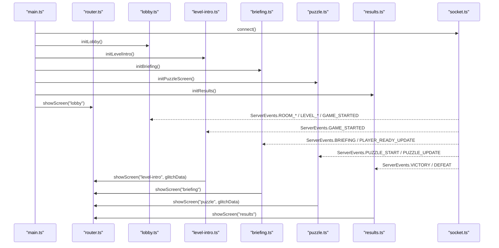
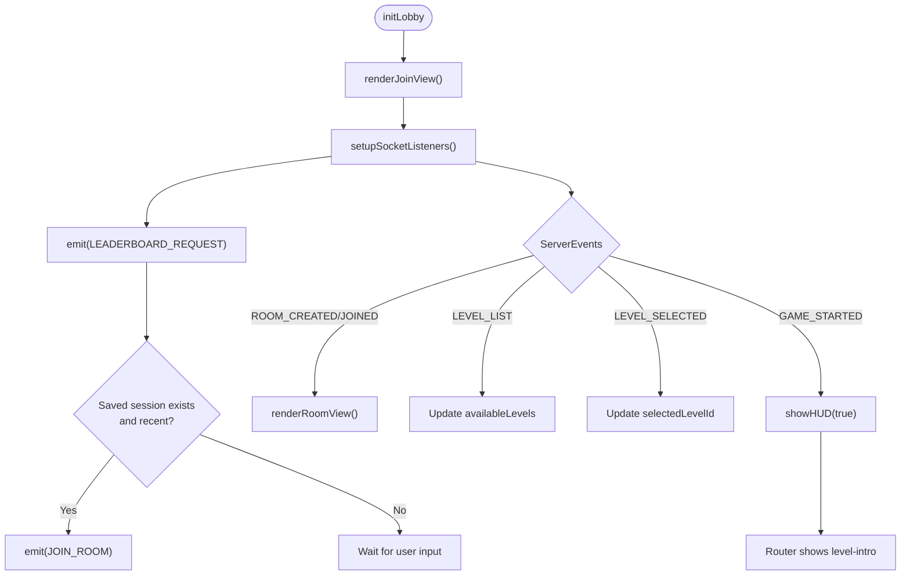
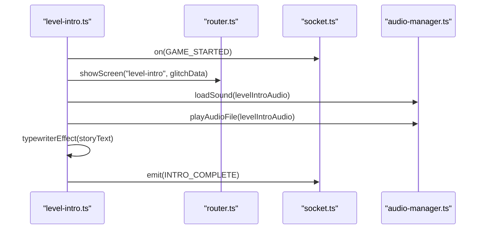
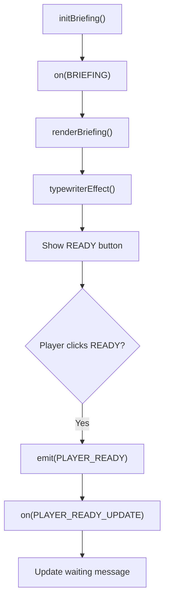
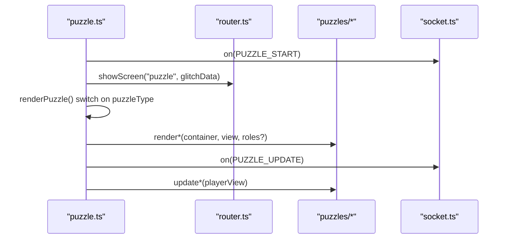
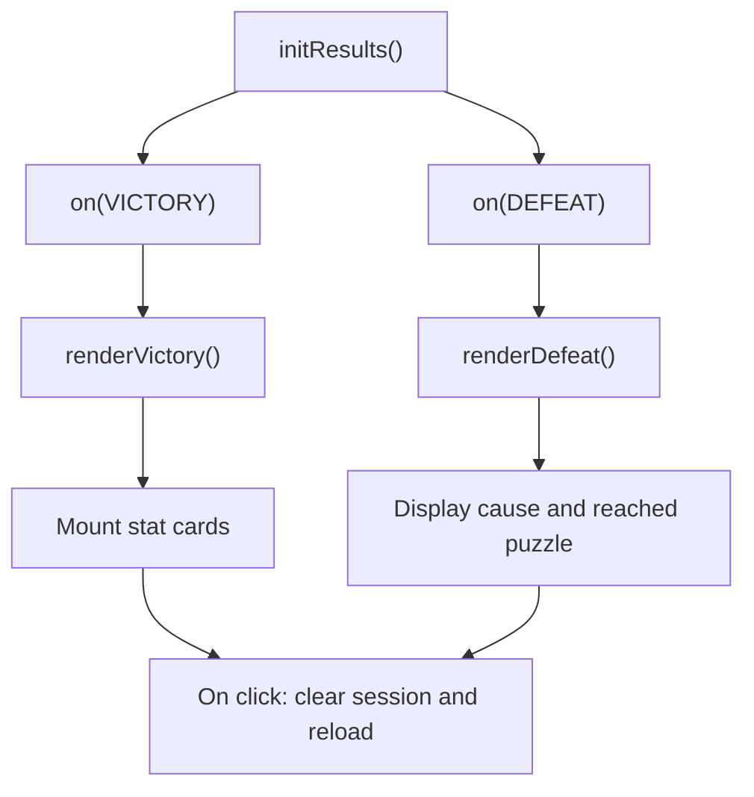
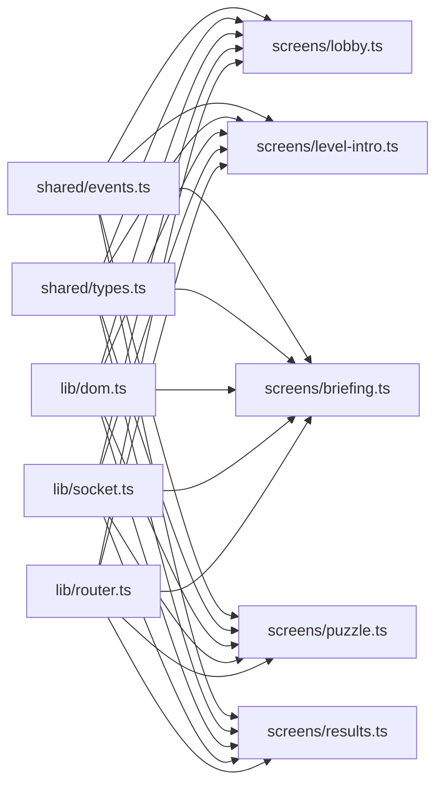

# Screen Management

<cite>
**Referenced Files in This Document**
- [src/client/main.ts](file://src/client/main.ts)
- [src/client/lib/router.ts](file://src/client/lib/router.ts)
- [src/client/lib/dom.ts](file://src/client/lib/dom.ts)
- [src/client/lib/socket.ts](file://src/client/lib/socket.ts)
- [src/client/screens/lobby.ts](file://src/client/screens/lobby.ts)
- [src/client/screens/level-intro.ts](file://src/client/screens/level-intro.ts)
- [src/client/screens/briefing.ts](file://src/client/screens/briefing.ts)
- [src/client/screens/puzzle.ts](file://src/client/screens/puzzle.ts)
- [src/client/screens/results.ts](file://src/client/screens/results.ts)
- [shared/events.ts](file://shared/events.ts)
- [shared/types.ts](file://shared/types.ts)
- [src/client/puzzles/asymmetric-symbols.ts](file://src/client/puzzles/asymmetric-symbols.ts)
- [src/client/puzzles/rhythm-tap.ts](file://src/client/puzzles/rhythm-tap.ts)
- [src/client/puzzles/cipher-decode.ts](file://src/client/puzzles/cipher-decode.ts)
- [src/client/puzzles/collaborative-assembly.ts](file://src/client/puzzles/collaborative-assembly.ts)
</cite>

## Update Summary
**Changes Made**
- Updated router API documentation to reflect the optional glitch parameter enhancement
- Added documentation for the simplified showScreen() usage pattern
- Updated screen initialization examples to show both old and new patterns
- Enhanced visual effects management documentation for puzzle screens

## Table of Contents
1. [Introduction](#introduction)
2. [Project Structure](#project-structure)
3. [Core Components](#core-components)
4. [Architecture Overview](#architecture-overview)
5. [Detailed Component Analysis](#detailed-component-analysis)
6. [Dependency Analysis](#dependency-analysis)
7. [Performance Considerations](#performance-considerations)
8. [Troubleshooting Guide](#troubleshooting-guide)
9. [Conclusion](#conclusion)

## Introduction
This document describes the screen management system that orchestrates the five major screens of the application: lobby, level intro, briefing, puzzle, and results. It explains initialization, event-driven rendering, DOM structure, state management, and transitions, and shows how screens integrate with the router and shared event types.

**Updated** Enhanced router API now supports optional glitch parameter for improved developer experience and reduced boilerplate code.

## Project Structure
The screen management system is implemented in the client with a small set of shared utilities:
- Router: switches active screens and toggles visual effects and HUD visibility.
- DOM helpers: lightweight element creation and mounting.
- Socket wrapper: typed event emission and listening.
- Screens: lobby, level-intro, briefing, puzzle, results.
- Shared types and events: strongly typed payloads and event names.

**Diagram sources**
- [src/client/main.ts](file://src/client/main.ts#L36-L72)
- [src/client/lib/router.ts](file://src/client/lib/router.ts#L10-L39)
- [src/client/lib/dom.ts](file://src/client/lib/dom.ts#L11-L72)
- [src/client/lib/socket.ts](file://src/client/lib/socket.ts#L11-L84)
- [shared/events.ts](file://shared/events.ts#L28-L90)
- [shared/types.ts](file://shared/types.ts#L26-L49)

**Section sources**
- [src/client/main.ts](file://src/client/main.ts#L47-L72)
- [src/client/lib/router.ts](file://src/client/lib/router.ts#L10-L39)
- [src/client/lib/dom.ts](file://src/client/lib/dom.ts#L11-L72)
- [src/client/lib/socket.ts](file://src/client/lib/socket.ts#L11-L84)
- [shared/events.ts](file://shared/events.ts#L28-L90)
- [shared/types.ts](file://shared/types.ts#L26-L49)

## Core Components
- Router: Manages current screen, applies visual effects, and toggles HUD visibility.
- DOM helpers: Element creation, query, mount, and clear utilities.
- Socket wrapper: Centralized connection, event registration, and emission with logging.
- Screens: Each screen initializes on boot, registers server-side event listeners, renders UI, manages local state, and triggers transitions.

Key integration points:
- Screens call showScreen() to switch views. The router now supports both patterns: `showScreen("screen-name")` and `showScreen("screen-name", glitchData)`.
- Screens listen to ServerEvents to drive rendering and state updates.
- Screens emit ClientEvents to send user actions to the server.
- Global listeners in main.ts manage HUD, timers, glitch visuals, and theme application.

**Updated** The router API now provides backward compatibility with simplified showScreen() calls while supporting enhanced glitch parameter functionality for puzzle screens.

**Section sources**
- [src/client/lib/router.ts](file://src/client/lib/router.ts#L10-L39)
- [src/client/lib/dom.ts](file://src/client/lib/dom.ts#L11-L72)
- [src/client/lib/socket.ts](file://src/client/lib/socket.ts#L11-L84)
- [src/client/main.ts](file://src/client/main.ts#L67-L72)

## Architecture Overview
The system follows a reactive pattern:
- On boot, the client connects to the server and initializes all screens.
- Each screen registers listeners for server events and renders UI accordingly.
- Transitions occur when the server emits game-phase or puzzle-related events.
- The router coordinates visibility and visual effects; the HUD displays global state.

**Updated** The router now intelligently manages visual effects based on the glitch parameter, automatically controlling visual FX only during puzzle screens when glitch data is provided.

**Diagram sources**
- [src/client/main.ts](file://src/client/main.ts#L61-L72)
- [src/client/lib/router.ts](file://src/client/lib/router.ts#L17-L39)
- [src/client/lib/socket.ts](file://src/client/lib/socket.ts#L59-L65)
- [src/client/screens/lobby.ts](file://src/client/screens/lobby.ts#L342-L434)
- [src/client/screens/level-intro.ts](file://src/client/screens/level-intro.ts#L14-L23)
- [src/client/screens/briefing.ts](file://src/client/screens/briefing.ts#L16-L28)
- [src/client/screens/puzzle.ts](file://src/client/screens/puzzle.ts#L23-L34)
- [src/client/screens/results.ts](file://src/client/screens/results.ts#L11-L19)

## Detailed Component Analysis

### Router System
**Updated** The router system now provides enhanced functionality with an optional glitch parameter for improved developer experience.

API Enhancement:
- `showScreen(name: ScreenName, glitch?: GlitchState): void` - Enhanced with optional glitch parameter
- `getCurrentScreen(): ScreenName` - Returns current active screen
- `showHUD(visible: boolean): void` - Controls HUD visibility

Visual Effects Management:
- Automatically manages visual FX only during puzzle screens when glitch data is provided
- Supports multiple glitch types with automatic fallback to "matrix-glitch"
- Integrates with visual-fx.ts for seamless effect transitions

Backward Compatibility:
- Simplified calls: `showScreen("screen-name")` work without glitch parameter
- Enhanced calls: `showScreen("screen-name", glitchData)` enable visual effects
- Maintains existing behavior for all non-puzzle screens

**Section sources**
- [src/client/lib/router.ts](file://src/client/lib/router.ts#L10-L39)

### Lobby Screen
Purpose:
- Room creation/joining, player roster, level selection, and leaderboard display.
- Host controls start and optional dev-mode puzzle jump.

Initialization:
- Renders join view, sets up socket listeners, requests leaderboard, and auto-restores session if recent.

State management:
- Module-level variables track room code, host flag, players, available levels, selected level, optional puzzle index, and leaderboard entries.
- Local storage persists player name, room code, and creation time for auto-join.

Event handlers:
- Room lifecycle: created/joined/left/player list updates.
- Level list and selection.
- Game start triggers HUD visibility and transition to level intro.

DOM structure:
- Name and room inputs, join/create buttons, error display, leaderboard table, and footer.

Transition logic:
- On room creation/join, switches to room view.
- On game start, triggers HUD visibility and level intro.

**Diagram sources**
- [src/client/screens/lobby.ts](file://src/client/screens/lobby.ts#L46-L82)
- [src/client/screens/lobby.ts](file://src/client/screens/lobby.ts#L342-L434)

**Section sources**
- [src/client/screens/lobby.ts](file://src/client/screens/lobby.ts#L46-L82)
- [src/client/screens/lobby.ts](file://src/client/screens/lobby.ts#L84-L126)
- [src/client/screens/lobby.ts](file://src/client/screens/lobby.ts#L184-L261)
- [src/client/screens/lobby.ts](file://src/client/screens/lobby.ts#L342-L434)

### Level Intro Screen
Purpose:
- Narrated mission introduction with typewriter text and optional audio cue.

Initialization:
- Registers listener for GAME_STARTED and renders intro panel.

State management:
- Tracks skipping flag to accelerate text rendering.

Event handlers:
- On GAME_STARTED, shows the screen and starts typewriter and audio in parallel.

DOM structure:
- Mission branding, level title, story text area, status line, and continue button.

Transition logic:
- On completion, emits INTRO_COMPLETE and expects server to advance to briefing.

**Updated** Enhanced screen initialization now uses the new router API with glitch parameter support.

**Diagram sources**
- [src/client/screens/level-intro.ts](file://src/client/screens/level-intro.ts#L14-L23)
- [src/client/screens/level-intro.ts](file://src/client/screens/level-intro.ts#L25-L91)
- [src/client/lib/router.ts](file://src/client/lib/router.ts#L17-L27)

**Section sources**
- [src/client/screens/level-intro.ts](file://src/client/screens/level-intro.ts#L14-L23)
- [src/client/screens/level-intro.ts](file://src/client/screens/level-intro.ts#L25-L91)

### Briefing Screen
Purpose:
- Presents puzzle briefing text with typewriter animation and a ready button.

Initialization:
- Registers listeners for BRIEFING and PLAYER_READY_UPDATE.

State management:
- Tracks player readiness, skipping flag, and ready button element.

Event handlers:
- On BRIEFING, renders text and ready button; typewriter completes to reveal button.
- On PLAYER_READY_UPDATE, updates waiting message with counts.

DOM structure:
- Mission index, puzzle title, indented story text, status line, ready button, and skip button.

Transition logic:
- On ready, server advances to puzzle start; client does not switch screen here.

**Updated** Uses simplified showScreen() without glitch parameter for cleaner code.

**Diagram sources**
- [src/client/screens/briefing.ts](file://src/client/screens/briefing.ts#L16-L28)
- [src/client/screens/briefing.ts](file://src/client/screens/briefing.ts#L30-L103)

**Section sources**
- [src/client/screens/briefing.ts](file://src/client/screens/briefing.ts#L16-L28)
- [src/client/screens/briefing.ts](file://src/client/screens/briefing.ts#L30-L103)

### Puzzle Screen
Purpose:
- Main gameplay interface that loads the appropriate puzzle renderer based on server data.

Initialization:
- Registers listeners for PUZZLE_START and PUZZLE_UPDATE.

State management:
- Tracks current puzzle type to route updates to the correct renderer.

Event handlers:
- On PUZZLE_START: clears previous content, shows screen, updates HUD role, and dispatches to the specific puzzle renderer.
- On PUZZLE_UPDATE: forwards player view updates to the active puzzle renderer.

DOM structure:
- Container div with fade-in transition.

Renderer integration:
- Switches on puzzle type and delegates to puzzle-specific render/update functions.

**Updated** Enhanced with glitch parameter support for automatic visual effects management during puzzle gameplay.

**Diagram sources**
- [src/client/screens/puzzle.ts](file://src/client/screens/puzzle.ts#L23-L34)
- [src/client/screens/puzzle.ts](file://src/client/screens/puzzle.ts#L36-L73)
- [src/client/screens/puzzle.ts](file://src/client/screens/puzzle.ts#L75-L100)

**Section sources**
- [src/client/screens/puzzle.ts](file://src/client/screens/puzzle.ts#L23-L34)
- [src/client/screens/puzzle.ts](file://src/client/screens/puzzle.ts#L36-L73)
- [src/client/screens/puzzle.ts](file://src/client/screens/puzzle.ts#L75-L100)

### Results Screen
Purpose:
- Displays mission outcome (victory or defeat) with statistics and restart option.

Initialization:
- Registers listeners for VICTORY and DEFEAT.

State management:
- None; relies on server-provided payload data.

Event handlers:
- On VICTORY: shows success screen, plays success sound, displays stats, and clears room session.
- On DEFEAT: shows failure screen, plays failure sound, displays cause and stats, and clears room session.

DOM structure:
- Outcome header, narrative, stat cards, and restart button.

Transition logic:
- On either outcome, hides HUD and offers reload to start over.

**Updated** Uses simplified showScreen() without glitch parameter for cleaner code.

**Diagram sources**
- [src/client/screens/results.ts](file://src/client/screens/results.ts#L11-L19)
- [src/client/screens/results.ts](file://src/client/screens/results.ts#L21-L52)
- [src/client/screens/results.ts](file://src/client/screens/results.ts#L54-L84)

**Section sources**
- [src/client/screens/results.ts](file://src/client/screens/results.ts#L11-L19)
- [src/client/screens/results.ts](file://src/client/screens/results.ts#L21-L52)
- [src/client/screens/results.ts](file://src/client/screens/results.ts#L54-L84)

## Dependency Analysis
Shared patterns across screens:
- All screens import DOM helpers for element creation and mounting.
- All screens import the socket wrapper for typed event handling.
- All screens import the router to show themselves and coordinate HUD visibility.
- All screens rely on shared event names and payload types for interoperability.

Integration with router:
- Each screen's init function registers server listeners; upon receiving data, it calls showScreen("screen-name") to become visible.
- The router toggles visual effects based on glitch state during puzzle screens.
- **Updated** The router now supports both simplified and enhanced showScreen() patterns for improved developer experience.

**Updated** Enhanced router integration patterns:

**Diagram sources**
- [shared/events.ts](file://shared/events.ts#L28-L90)
- [shared/types.ts](file://shared/types.ts#L26-L49)
- [src/client/lib/dom.ts](file://src/client/lib/dom.ts#L11-L72)
- [src/client/lib/socket.ts](file://src/client/lib/socket.ts#L59-L65)
- [src/client/lib/router.ts](file://src/client/lib/router.ts#L17-L39)
- [src/client/screens/lobby.ts](file://src/client/screens/lobby.ts#L14-L29)
- [src/client/screens/level-intro.ts](file://src/client/screens/level-intro.ts#L5-L10)
- [src/client/screens/briefing.ts](file://src/client/screens/briefing.ts#L5-L9)
- [src/client/screens/puzzle.ts](file://src/client/screens/puzzle.ts#L5-L9)
- [src/client/screens/results.ts](file://src/client/screens/results.ts#L5-L9)

**Section sources**
- [src/client/lib/router.ts](file://src/client/lib/router.ts#L17-L39)
- [src/client/lib/socket.ts](file://src/client/lib/socket.ts#L59-L65)
- [shared/events.ts](file://shared/events.ts#L28-L90)
- [shared/types.ts](file://shared/types.ts#L26-L49)

## Performance Considerations
- Minimal DOM operations: screens use a single container per screen and replace content via mount/clear to avoid incremental DOM churn.
- Efficient rendering: puzzle screen defers to specialized puzzle renderers that update only changed elements.
- Debounced audio loading: intro and briefing load audio asynchronously alongside typewriter rendering to reduce perceived latency.
- Visual FX control: router starts/stops visual effects only during puzzle screens to minimize overhead.
- **Updated** Enhanced router performance: automatic visual effect management reduces boilerplate code and improves consistency across screens.

## Troubleshooting Guide
Common issues and remedies:
- Screen not switching: Verify showScreen() is called after receiving the expected ServerEvents in each screen's listener.
- Missing events: Ensure on() registrations occur in init functions and that connect() is called before any emits.
- Stuck UI: Confirm that error handlers update DOM elements (e.g., lobby error display) and that timers/intervals are cleared in cleanup.
- Session restoration: If auto-join fails, clear stale session keys and retry; verify saved timestamps are within the allowed window.
- **Updated** Glitch parameter issues: Ensure glitch data is properly structured when using enhanced showScreen() calls.

Operational checks:
- Router logs screen transitions; inspect logs for unexpected switches.
- Socket wrapper logs connection/disconnection and errors; ensure reconnection behavior is observed.
- HUD visibility toggles are centralized; confirm showHUD is called appropriately in transitions.
- **Updated** Visual effects debugging: Check router logs for glitch effect management and visual FX control.

**Section sources**
- [src/client/lib/router.ts](file://src/client/lib/router.ts#L17-L27)
- [src/client/lib/socket.ts](file://src/client/lib/socket.ts#L24-L34)
- [src/client/lib/socket.ts](file://src/client/lib/socket.ts#L59-L65)
- [src/client/screens/lobby.ts](file://src/client/screens/lobby.ts#L337-L340)

## Conclusion
The screen management system is a cohesive, event-driven pipeline that leverages typed events, a simple router, and minimal DOM helpers to orchestrate five distinct screens. Each screen encapsulates its own initialization, rendering, and state updates while integrating seamlessly with the router and shared types. The enhanced router API with optional glitch parameter provides improved developer experience while maintaining backward compatibility, allowing teams to choose between simplified and enhanced patterns based on their needs. The result is a maintainable, testable architecture that cleanly separates concerns across screens and supports robust transitions driven by server events.