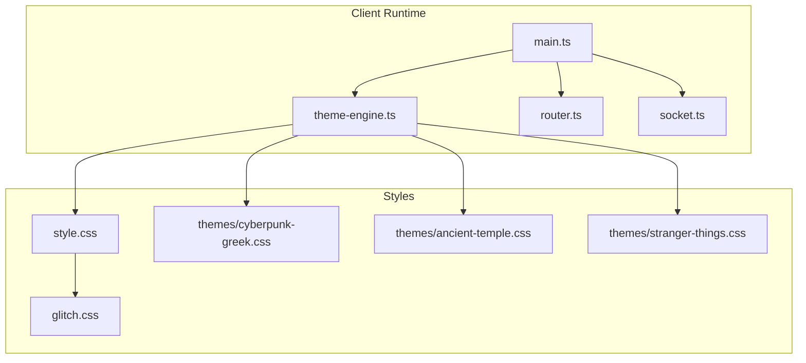
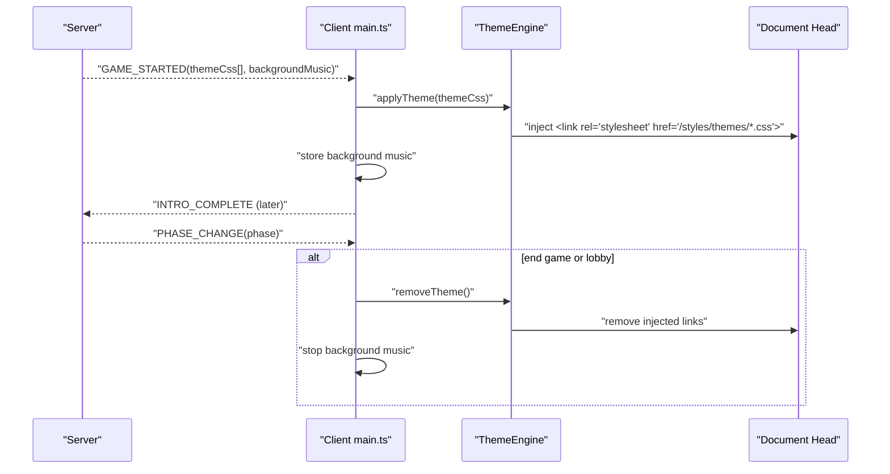
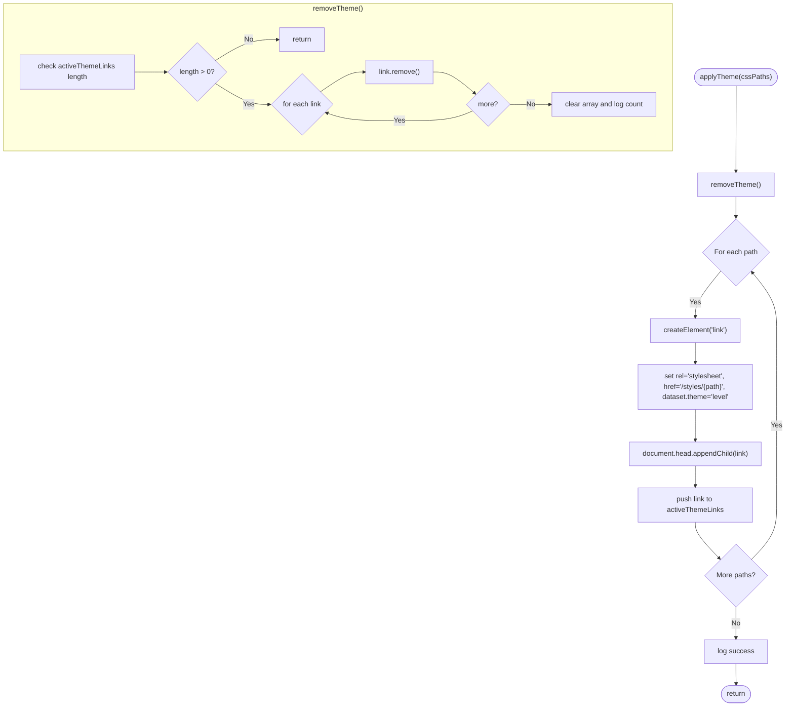
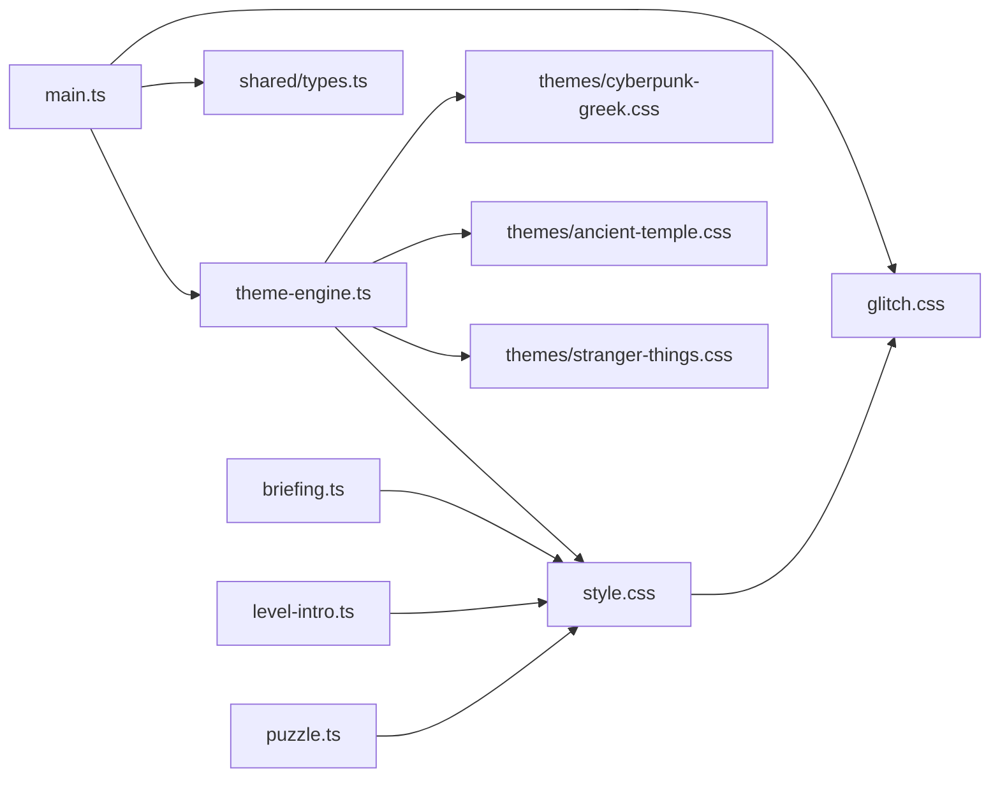

# Theme System

<cite>
**Referenced Files in This Document**
- [theme-engine.ts](file://src/client/lib/theme-engine.ts)
- [style.css](file://src/client/styles/style.css)
- [glitch.css](file://src/client/styles/glitch.css)
- [cyberpunk-greek.css](file://src/client/styles/themes/cyberpunk-greek.css)
- [ancient-temple.css](file://src/client/styles/themes/ancient-temple.css)
- [stranger-things.css](file://src/client/styles/themes/stranger-things.css)
- [main.ts](file://src/client/main.ts)
- [types.ts](file://shared/types.ts)
- [briefing.ts](file://src/client/screens/briefing.ts)
- [level-intro.ts](file://src/client/screens/level-intro.ts)
- [puzzle.ts](file://src/client/screens/puzzle.ts)
</cite>

## Table of Contents
1. [Introduction](#introduction)
2. [Project Structure](#project-structure)
3. [Core Components](#core-components)
4. [Architecture Overview](#architecture-overview)
5. [Detailed Component Analysis](#detailed-component-analysis)
6. [Dependency Analysis](#dependency-analysis)
7. [Performance Considerations](#performance-considerations)
8. [Troubleshooting Guide](#troubleshooting-guide)
9. [Conclusion](#conclusion)
10. [Appendices](#appendices)

## Introduction
This document explains the dynamic theme system and CSS architecture used to load, apply, and remove CSS themes at runtime. It covers the theme engine implementation, theme file structure, the custom properties system, cascade management, and how themes integrate with game phases. It also documents the three built-in themes, the CSS module system, variable-based theming, responsive design considerations, and provides guidelines for creating custom themes along with performance optimization advice.

## Project Structure
The theme system spans a small set of cohesive modules:
- A theme engine that dynamically injects/removes CSS link elements
- A global stylesheet that defines the base design tokens and baseline styles
- A glitch effects stylesheet that integrates with runtime variables
- Theme-specific CSS files that override design tokens and add theme-specific animations
- Client bootstrapping that applies themes based on server-provided configuration and game phases

**Diagram sources**
- [main.ts](file://src/client/main.ts#L1-L266)
- [theme-engine.ts](file://src/client/lib/theme-engine.ts#L1-L51)
- [style.css](file://src/client/styles/style.css#L1-L602)
- [glitch.css](file://src/client/styles/glitch.css#L1-L421)
- [cyberpunk-greek.css](file://src/client/styles/themes/cyberpunk-greek.css#L1-L48)
- [ancient-temple.css](file://src/client/styles/themes/ancient-temple.css#L1-L59)
- [stranger-things.css](file://src/client/styles/themes/stranger-things.css#L1-L71)

**Section sources**
- [main.ts](file://src/client/main.ts#L1-L266)
- [theme-engine.ts](file://src/client/lib/theme-engine.ts#L1-L51)
- [style.css](file://src/client/styles/style.css#L1-L602)
- [glitch.css](file://src/client/styles/glitch.css#L1-L421)
- [cyberpunk-greek.css](file://src/client/styles/themes/cyberpunk-greek.css#L1-L48)
- [ancient-temple.css](file://src/client/styles/themes/ancient-temple.css#L1-L59)
- [stranger-things.css](file://src/client/styles/themes/stranger-things.css#L1-L71)

## Core Components
- Theme Engine: Dynamically loads/unloads theme CSS files by injecting link elements into the document head and tracks them for later removal.
- Base Styles: Define global design tokens (CSS custom properties), typography, spacing, transitions, and foundational components.
- Glitch Effects: Provide CSS-driven visual effects controlled by a runtime variable for intensity.
- Theme Files: Override design tokens and define theme-specific backgrounds, animations, and component tweaks.
- Client Integration: Applies themes on game start and removes them on end conditions, coordinating with game phases.

Key responsibilities:
- Theme Engine: applyTheme(cssPaths), removeTheme()
- Base Styles: :root design tokens, global resets, and component styles
- Glitch Effects: CSS animations and overlays driven by --glitch-intensity
- Theme Files: :root overrides and ::before/::after background animations
- Client Integration: listen to server events and call theme engine accordingly

**Section sources**
- [theme-engine.ts](file://src/client/lib/theme-engine.ts#L1-L51)
- [style.css](file://src/client/styles/style.css#L1-L602)
- [glitch.css](file://src/client/styles/glitch.css#L1-L421)
- [cyberpunk-greek.css](file://src/client/styles/themes/cyberpunk-greek.css#L1-L48)
- [ancient-temple.css](file://src/client/styles/themes/ancient-temple.css#L1-L59)
- [stranger-things.css](file://src/client/styles/themes/stranger-things.css#L1-L71)
- [main.ts](file://src/client/main.ts#L141-L177)

## Architecture Overview
The theme system is event-driven and modular:
- The client listens for server events (e.g., GAME_STARTED, PHASE_CHANGE)
- On GAME_STARTED, it stores background music and applies theme CSS via the theme engine
- During gameplay, glitch intensity updates are reflected in CSS via a design token
- At end-of-game phases, the client stops music and removes themes

**Diagram sources**
- [main.ts](file://src/client/main.ts#L141-L177)
- [theme-engine.ts](file://src/client/lib/theme-engine.ts#L9-L31)

**Section sources**
- [main.ts](file://src/client/main.ts#L141-L177)
- [theme-engine.ts](file://src/client/lib/theme-engine.ts#L9-L31)

## Detailed Component Analysis

### Theme Engine
The theme engine manages dynamic CSS injection and removal:
- Removes previously applied theme links before adding new ones
- Injects link elements pointing to theme CSS under /styles/themes/
- Tracks active theme links for cleanup

**Diagram sources**
- [theme-engine.ts](file://src/client/lib/theme-engine.ts#L9-L50)

**Section sources**
- [theme-engine.ts](file://src/client/lib/theme-engine.ts#L1-L51)

### Base Styles and Design Tokens
The base stylesheet defines:
- Global design tokens in :root (colors, backgrounds, text, borders, glows, fonts, spacing, transitions)
- Resets and foundational components
- Utility classes and animations
- A placeholder body::before for theme-specific animated backgrounds
- A gridScroll animation used by the default theme

These tokens are overridden by theme files and consumed by components and effects.

**Section sources**
- [style.css](file://src/client/styles/style.css#L6-L59)
- [style.css](file://src/client/styles/style.css#L381-L397)

### Glitch Effects and Runtime Intensity
The glitch effects stylesheet:
- Defines overlays, scanlines, screen shake, and text glitch animations
- Uses --glitch-intensity to control opacity and animation timing
- Integrates with client-side updates that set this variable

The client updates --glitch-intensity on GLITCH_UPDATE events and triggers screen shake when intensity exceeds a threshold.

**Section sources**
- [glitch.css](file://src/client/styles/glitch.css#L1-L421)
- [main.ts](file://src/client/main.ts#L113-L139)

### Theme Files and Cascade Management
Each theme file:
- Imports external fonts
- Overrides :root design tokens to establish palette, backgrounds, text, and typography
- Adds theme-specific ::before backgrounds and animations
- Optionally adjusts component styles and overlay visibility

Cascade management:
- Theme files override base tokens
- Theme backgrounds animate independently via ::before
- Component styles remain consistent because they consume the same tokens

Built-in themes:
- Cyberpunk Greek: neon palette, animated grid background, scanlines and glitch overlays
- Ancient Temple: warm stone palette, fog drift background, subtle glitch
- Stranger Things: dark red palette, radial gradients, particle spores, vignette

**Section sources**
- [cyberpunk-greek.css](file://src/client/styles/themes/cyberpunk-greek.css#L1-L48)
- [ancient-temple.css](file://src/client/styles/themes/ancient-temple.css#L1-L59)
- [stranger-things.css](file://src/client/styles/themes/stranger-things.css#L1-L71)

### Integration with Game Phases
The client applies themes on GAME_STARTED and removes them on end-of-game phases:
- Stores background music and loads it
- Applies theme CSS via the theme engine
- Removes themes and stops music on VICTORY, DEFEAT, or LOBBY

Screens coordinate with themes:
- Briefing and level-intro screens use theme fonts and tokens
- Puzzle screen renders puzzle-specific UI while inheriting theme styles

**Section sources**
- [main.ts](file://src/client/main.ts#L141-L177)
- [briefing.ts](file://src/client/screens/briefing.ts#L30-L103)
- [level-intro.ts](file://src/client/screens/level-intro.ts#L25-L91)
- [puzzle.ts](file://src/client/screens/puzzle.ts#L36-L73)

## Dependency Analysis
The theme system exhibits clean separation of concerns:
- theme-engine.ts depends only on DOM APIs and logging
- main.ts orchestrates theme application based on server events and types
- style.css provides the baseline tokens; theme files override them
- glitch.css consumes the runtime --glitch-intensity token
- Screens depend on base styles and tokens, not on specific themes

**Diagram sources**
- [theme-engine.ts](file://src/client/lib/theme-engine.ts#L1-L51)
- [style.css](file://src/client/styles/style.css#L1-L602)
- [glitch.css](file://src/client/styles/glitch.css#L1-L421)
- [cyberpunk-greek.css](file://src/client/styles/themes/cyberpunk-greek.css#L1-L48)
- [ancient-temple.css](file://src/client/styles/themes/ancient-temple.css#L1-L59)
- [stranger-things.css](file://src/client/styles/themes/stranger-things.css#L1-L71)
- [main.ts](file://src/client/main.ts#L1-L266)
- [types.ts](file://shared/types.ts#L95-L127)
- [briefing.ts](file://src/client/screens/briefing.ts#L1-L135)
- [level-intro.ts](file://src/client/screens/level-intro.ts#L1-L125)
- [puzzle.ts](file://src/client/screens/puzzle.ts#L1-L101)

**Section sources**
- [theme-engine.ts](file://src/client/lib/theme-engine.ts#L1-L51)
- [main.ts](file://src/client/main.ts#L1-L266)
- [types.ts](file://shared/types.ts#L95-L127)
- [style.css](file://src/client/styles/style.css#L1-L602)
- [glitch.css](file://src/client/styles/glitch.css#L1-L421)

## Performance Considerations
- Minimize theme file sizes: keep theme CSS scoped and avoid heavy images; prefer CSS animations and gradients
- Prefer CSS custom properties for colors and fonts to reduce duplication and enable fast switching
- Use a single link per theme file; batching reduces DOM mutations
- Avoid frequent reflows by setting --glitch-intensity via documentElement.setProperty rather than toggling classes repeatedly
- Lazy-load theme fonts via @import only when needed; consider preloading critical fonts
- Keep theme backgrounds as simple as possible (gradients, minimal animations) to maintain smoothness on lower-end devices
- Remove themes on phase transitions to prevent stacking styles and reduce memory footprint

[No sources needed since this section provides general guidance]

## Troubleshooting Guide
Common issues and resolutions:
- Theme not applying
  - Verify theme paths passed to applyTheme match files under src/client/styles/themes/
  - Confirm the client receives themeCss from GAME_STARTED and calls applyTheme
- Fonts not loading
  - Ensure @import URLs are reachable; network errors will prevent theme application
- Visual artifacts after theme changes
  - Call removeTheme before applying a new theme to clear stale styles
- Glitch effects not responding
  - Ensure --glitch-intensity is being set on documentElement and that glitch.css is loaded
- Themes persist after game ends
  - Confirm PHASE_CHANGE handlers call removeTheme and stop background music

**Section sources**
- [theme-engine.ts](file://src/client/lib/theme-engine.ts#L9-L31)
- [main.ts](file://src/client/main.ts#L153-L158)
- [glitch.css](file://src/client/styles/glitch.css#L1-L421)

## Conclusion
The theme system leverages CSS custom properties, modular theme files, and a lightweight runtime engine to deliver dynamic, variable-based theming. It integrates cleanly with game phases and visual effects, enabling immersive experiences without heavy runtime overhead. By following the documented patterns and performance tips, developers can extend the system with new themes and maintain a consistent, scalable architecture.

[No sources needed since this section summarizes without analyzing specific files]

## Appendices

### Built-in Themes: Visual Characteristics
- Cyberpunk Greek
  - Palette: neon cyan, magenta, gold, green, red
  - Background: animated grid with subtle movement
  - Overlays: scanlines and glitch overlay enabled
- Ancient Temple
  - Palette: warm gold, brown, beige, olive drab, sienna
  - Background: radial fog glow with gentle animation
  - Overlays: scanlines disabled; subtle glitch
- Stranger Things
  - Palette: dark reds and orange
  - Background: radial gradient and grid tiling
  - Effects: particle spores and vignette for moody atmosphere

**Section sources**
- [cyberpunk-greek.css](file://src/client/styles/themes/cyberpunk-greek.css#L1-L48)
- [ancient-temple.css](file://src/client/styles/themes/ancient-temple.css#L1-L59)
- [stranger-things.css](file://src/client/styles/themes/stranger-things.css#L1-L71)

### Creating Custom Themes
Steps:
- Create a new file under src/client/styles/themes/<your-theme>.css
- Import any required fonts via @import
- Override :root tokens to define palette, backgrounds, text, and typography
- Add theme-specific ::before backgrounds and animations
- Optionally adjust component styles for subtle refinements
- On the server, include the theme file path in LevelConfig.theme_css
- On the client, GAME_STARTED will automatically apply the theme via applyTheme

Guidelines:
- Keep token names consistent with base styles for seamless integration
- Use CSS animations sparingly; prefer simple, loopable effects
- Avoid large raster assets; prefer vector graphics and CSS gradients
- Test across devices and browsers for performance and readability

**Section sources**
- [types.ts](file://shared/types.ts#L95-L127)
- [theme-engine.ts](file://src/client/lib/theme-engine.ts#L9-L31)
- [style.css](file://src/client/styles/style.css#L6-L59)