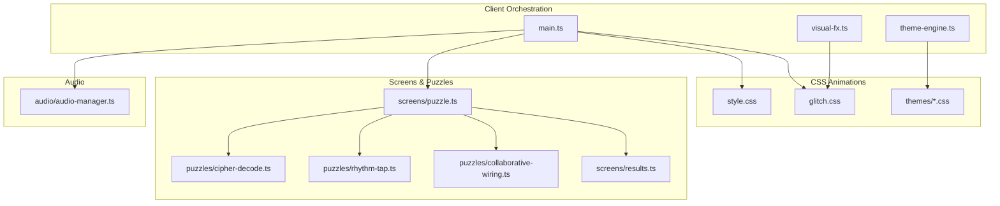
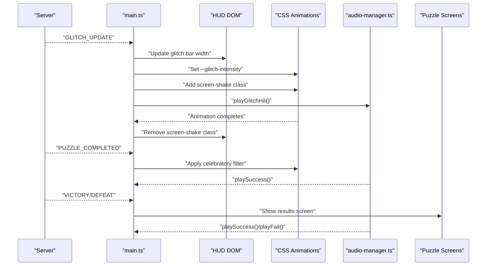
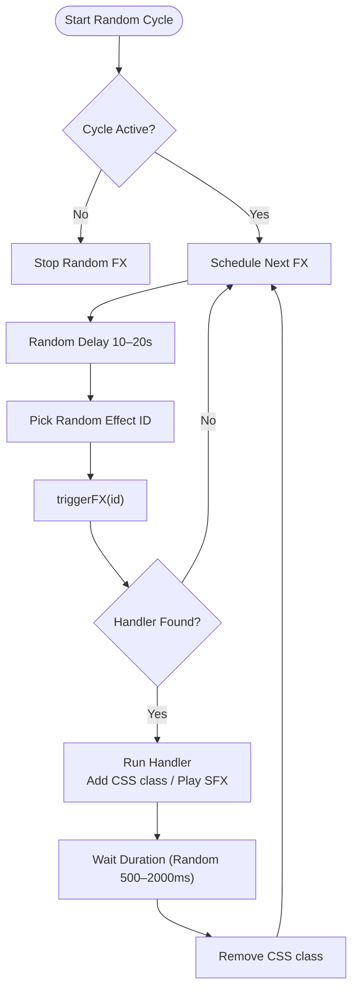
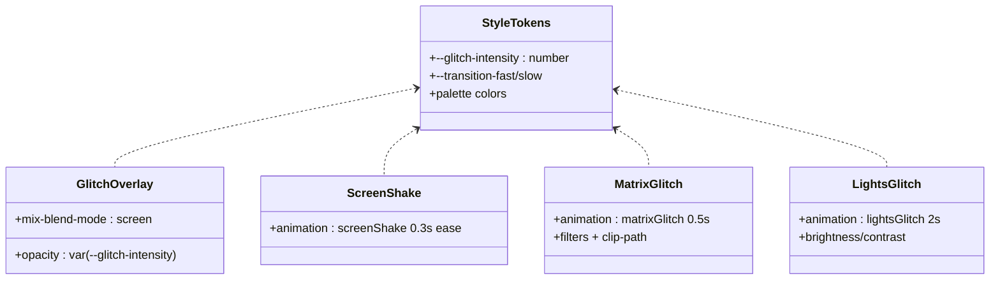
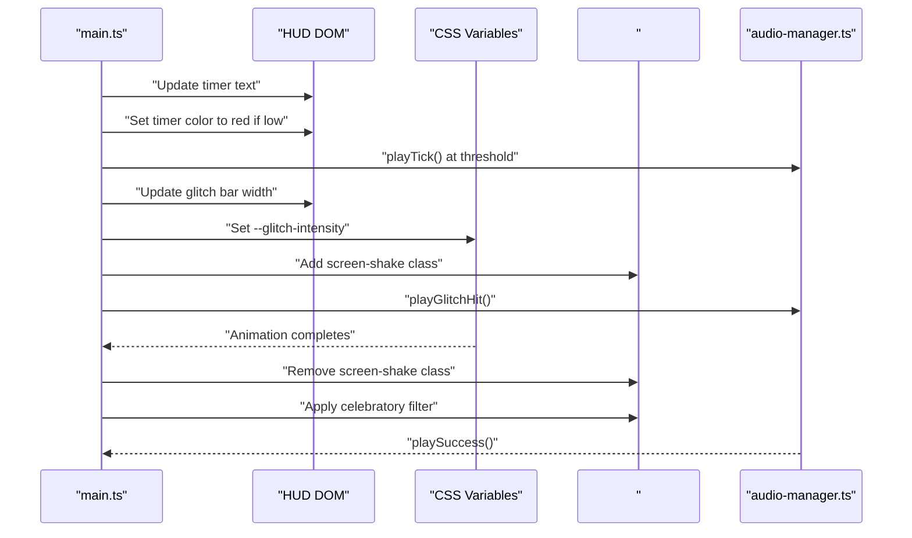
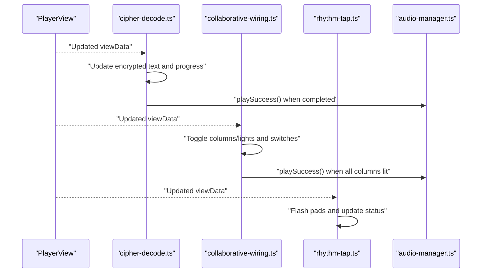
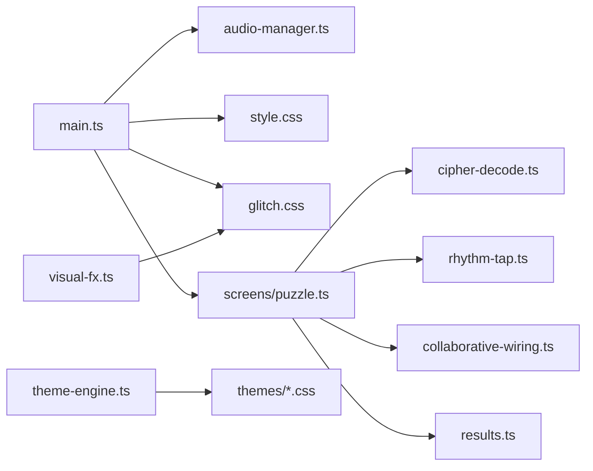

# Visual Effects

<cite>
**Referenced Files in This Document**
- [visual-fx.ts](file://src/client/lib/visual-fx.ts)
- [glitch.css](file://src/client/styles/glitch.css)
- [style.css](file://src/client/styles/style.css)
- [main.ts](file://src/client/main.ts)
- [puzzle.ts](file://src/client/screens/puzzle.ts)
- [cipher-decode.ts](file://src/client/puzzles/cipher-decode.ts)
- [rhythm-tap.ts](file://src/client/puzzles/rhythm-tap.ts)
- [collaborative-wiring.ts](file://src/client/puzzles/collaborative-wiring.ts)
- [results.ts](file://src/client/screens/results.ts)
- [audio-manager.ts](file://src/client/audio/audio-manager.ts)
- [theme-engine.ts](file://src/client/lib/theme-engine.ts)
- [stranger-things.css](file://src/client/styles/themes/stranger-things.css)
</cite>

## Table of Contents
1. [Introduction](#introduction)
2. [Project Structure](#project-structure)
3. [Core Components](#core-components)
4. [Architecture Overview](#architecture-overview)
5. [Detailed Component Analysis](#detailed-component-analysis)
6. [Dependency Analysis](#dependency-analysis)
7. [Performance Considerations](#performance-considerations)
8. [Troubleshooting Guide](#troubleshooting-guide)
9. [Conclusion](#conclusion)

## Introduction
This document explains the visual effects system powering the escape room experience. It covers glitch effects synchronized with game state, screen shake animations, and CSS-based visual transformations. It also documents the integration between server events and visual responses, timing-sensitive effects, state-based animations, the CSS animation framework, custom properties for dynamic styling, performance optimization techniques, puzzle-specific visual effects, HUD animations, transitions between game states, and visual feedback patterns for player actions, success/failure indicators, and environmental storytelling elements.

## Project Structure
The visual effects system spans three layers:
- Client-side orchestration: event-driven triggers and state updates
- CSS-based animations: reusable, declarative effects and theme-driven styling
- Audio integration: procedural and asset-based sound cues that reinforce visuals

**Diagram sources**
- [main.ts](file://src/client/main.ts#L113-L206)
- [visual-fx.ts](file://src/client/lib/visual-fx.ts#L1-L112)
- [glitch.css](file://src/client/styles/glitch.css#L1-L421)
- [style.css](file://src/client/styles/style.css#L1-L602)
- [puzzle.ts](file://src/client/screens/puzzle.ts#L1-L101)
- [cipher-decode.ts](file://src/client/puzzles/cipher-decode.ts#L1-L152)
- [rhythm-tap.ts](file://src/client/puzzles/rhythm-tap.ts#L1-L168)
- [collaborative-wiring.ts](file://src/client/puzzles/collaborative-wiring.ts#L1-L121)
- [results.ts](file://src/client/screens/results.ts#L1-L93)
- [audio-manager.ts](file://src/client/audio/audio-manager.ts#L1-L407)
- [theme-engine.ts](file://src/client/lib/theme-engine.ts#L1-L51)
- [stranger-things.css](file://src/client/styles/themes/stranger-things.css#L1-L71)

**Section sources**
- [main.ts](file://src/client/main.ts#L113-L206)
- [visual-fx.ts](file://src/client/lib/visual-fx.ts#L1-L112)
- [glitch.css](file://src/client/styles/glitch.css#L1-L421)
- [style.css](file://src/client/styles/style.css#L1-L602)
- [puzzle.ts](file://src/client/screens/puzzle.ts#L1-L101)
- [cipher-decode.ts](file://src/client/puzzles/cipher-decode.ts#L1-L152)
- [rhythm-tap.ts](file://src/client/puzzles/rhythm-tap.ts#L1-L168)
- [collaborative-wiring.ts](file://src/client/puzzles/collaborative-wiring.ts#L1-L121)
- [results.ts](file://src/client/screens/results.ts#L1-L93)
- [audio-manager.ts](file://src/client/audio/audio-manager.ts#L1-L407)
- [theme-engine.ts](file://src/client/lib/theme-engine.ts#L1-L51)
- [stranger-things.css](file://src/client/styles/themes/stranger-things.css#L1-L71)

## Core Components
- Visual FX registry and scheduler: registers and triggers glitch effects; cycles randomly across pools with randomized delays.
- CSS-based glitch toolkit: overlays, scanlines, screen shake, chromatic aberration, flicker, VHS noise, and matrix-style distortions.
- Global CSS custom properties: centralized design tokens and a dynamic --glitch-intensity property controlling visual intensity.
- Event-driven visual updates: server events drive HUD updates, screen shake, and celebratory filters; audio cues reinforce state changes.
- Puzzle-specific effects: per-puzzle animations and feedback (e.g., pad flashes, success/fail cues).
- Theme engine: applies theme CSS files to alter color palettes and ambient effects.

**Section sources**
- [visual-fx.ts](file://src/client/lib/visual-fx.ts#L1-L112)
- [glitch.css](file://src/client/styles/glitch.css#L1-L421)
- [style.css](file://src/client/styles/style.css#L57-L58)
- [main.ts](file://src/client/main.ts#L113-L206)
- [cipher-decode.ts](file://src/client/puzzles/cipher-decode.ts#L136-L151)
- [rhythm-tap.ts](file://src/client/puzzles/rhythm-tap.ts#L101-L114)
- [collaborative-wiring.ts](file://src/client/puzzles/collaborative-wiring.ts#L117-L120)
- [theme-engine.ts](file://src/client/lib/theme-engine.ts#L9-L31)

## Architecture Overview
The system integrates server events with client-side visual and audio feedback. The main orchestrator listens to game events, updates HUD and CSS custom properties, triggers CSS animations, and plays procedural or asset-based sounds. Visual FX can be triggered programmatically or cycled automatically.

**Diagram sources**
- [main.ts](file://src/client/main.ts#L113-L206)
- [glitch.css](file://src/client/styles/glitch.css#L62-L99)
- [audio-manager.ts](file://src/client/audio/audio-manager.ts#L118-L137)
- [results.ts](file://src/client/screens/results.ts#L21-L84)

## Detailed Component Analysis

### Visual FX Registry and Scheduler
- Registers named handlers for visual effects.
- Triggers effects with optional durations; defaults to a random duration.
- Starts/stops a random cycle over a pool of effect IDs with randomized intervals.
- Built-in effects include matrix glitch and lights glitch, toggling CSS classes on the app container.

**Diagram sources**
- [visual-fx.ts](file://src/client/lib/visual-fx.ts#L40-L75)
- [visual-fx.ts](file://src/client/lib/visual-fx.ts#L79-L111)

**Section sources**
- [visual-fx.ts](file://src/client/lib/visual-fx.ts#L1-L112)

### CSS Animation Framework and Dynamic Styling
- Centralized design tokens and transitions in global CSS.
- Dynamic --glitch-intensity controls opacity and transforms across multiple glitch animations.
- Screen shake animation applied via a class on the app container.
- Matrix and lights glitch effects use dedicated keyframes and layered pseudo-elements.
- Theme CSS overrides colors and adds ambient effects (e.g., particle overlays).

**Diagram sources**
- [style.css](file://src/client/styles/style.css#L57-L58)
- [glitch.css](file://src/client/styles/glitch.css#L6-L15)
- [glitch.css](file://src/client/styles/glitch.css#L62-L99)
- [glitch.css](file://src/client/styles/glitch.css#L287-L338)
- [glitch.css](file://src/client/styles/glitch.css#L365-L420)

**Section sources**
- [style.css](file://src/client/styles/style.css#L57-L58)
- [glitch.css](file://src/client/styles/glitch.css#L6-L421)

### Event-Driven Visual Responses
- Glitch updates: HUD bar reflects percentage; CSS intensity increases; screen shake triggers; procedural glitch hit plays.
- Timer warnings: color shifts to red near expiry; ticking sound plays at critical thresholds.
- Puzzle completion: celebratory filter applied to the app container.
- Theme application/removal: replaces design tokens and ambient effects during gameplay.

**Diagram sources**
- [main.ts](file://src/client/main.ts#L93-L139)
- [main.ts](file://src/client/main.ts#L191-L206)
- [audio-manager.ts](file://src/client/audio/audio-manager.ts#L192-L210)
- [glitch.css](file://src/client/styles/glitch.css#L62-L99)

**Section sources**
- [main.ts](file://src/client/main.ts#L93-L206)
- [audio-manager.ts](file://src/client/audio/audio-manager.ts#L118-L137)

### Puzzle-Specific Visual Effects
- Cipher Decode: updates encrypted text and progress; plays success sound when the puzzle completes.
- Rhythm Tap: pads flash on selection and replay; visual status messages guide roles.
- Collaborative Wiring: optimistic UI toggles for switches and columns; plays success sound when solution is achieved.

**Diagram sources**
- [cipher-decode.ts](file://src/client/puzzles/cipher-decode.ts#L136-L151)
- [collaborative-wiring.ts](file://src/client/puzzles/collaborative-wiring.ts#L87-L120)
- [rhythm-tap.ts](file://src/client/puzzles/rhythm-tap.ts#L101-L114)

**Section sources**
- [cipher-decode.ts](file://src/client/puzzles/cipher-decode.ts#L136-L151)
- [collaborative-wiring.ts](file://src/client/puzzles/collaborative-wiring.ts#L87-L120)
- [rhythm-tap.ts](file://src/client/puzzles/rhythm-tap.ts#L101-L114)

### HUD Animations and Transitions
- Fade-in animations for panels and elements.
- Progress indicators and glitch bar with gradient fills and transitions.
- Role badges and status lines adapt to game state.

**Section sources**
- [style.css](file://src/client/styles/style.css#L439-L468)
- [style.css](file://src/client/styles/style.css#L188-L210)
- [puzzle.ts](file://src/client/screens/puzzle.ts#L44-L46)

### Environmental Storytelling and Themes
- Theme engine applies theme-specific CSS files, overriding design tokens and adding ambient effects (e.g., particle overlays, vignettes).
- Stranger Things theme replaces key colors and adds a floating particle effect and vignette.

**Section sources**
- [theme-engine.ts](file://src/client/lib/theme-engine.ts#L9-L31)
- [stranger-things.css](file://src/client/styles/themes/stranger-things.css#L1-L71)

## Dependency Analysis
The visual effects system exhibits clear separation of concerns:
- Orchestration depends on audio manager and DOM helpers.
- CSS animations depend on global custom properties and theme CSS.
- Puzzle modules depend on DOM helpers and emit client events.
- Results screen depends on audio manager and DOM helpers.

**Diagram sources**
- [main.ts](file://src/client/main.ts#L14-L34)
- [visual-fx.ts](file://src/client/lib/visual-fx.ts#L5-L7)
- [glitch.css](file://src/client/styles/glitch.css#L1-L421)
- [style.css](file://src/client/styles/style.css#L1-L602)
- [puzzle.ts](file://src/client/screens/puzzle.ts#L5-L19)
- [cipher-decode.ts](file://src/client/puzzles/cipher-decode.ts#L5-L8)
- [rhythm-tap.ts](file://src/client/puzzles/rhythm-tap.ts#L5-L8)
- [collaborative-wiring.ts](file://src/client/puzzles/collaborative-wiring.ts#L5-L8)
- [results.ts](file://src/client/screens/results.ts#L5-L9)
- [theme-engine.ts](file://src/client/lib/theme-engine.ts#L9-L31)

**Section sources**
- [main.ts](file://src/client/main.ts#L14-L34)
- [visual-fx.ts](file://src/client/lib/visual-fx.ts#L5-L7)
- [glitch.css](file://src/client/styles/glitch.css#L1-L421)
- [style.css](file://src/client/styles/style.css#L1-L602)
- [puzzle.ts](file://src/client/screens/puzzle.ts#L5-L19)
- [cipher-decode.ts](file://src/client/puzzles/cipher-decode.ts#L5-L8)
- [rhythm-tap.ts](file://src/client/puzzles/rhythm-tap.ts#L5-L8)
- [collaborative-wiring.ts](file://src/client/puzzles/collaborative-wiring.ts#L5-L8)
- [results.ts](file://src/client/screens/results.ts#L5-L9)
- [theme-engine.ts](file://src/client/lib/theme-engine.ts#L9-L31)

## Performance Considerations
- Prefer CSS animations and transforms over JavaScript-manipulated layout properties to leverage GPU acceleration.
- Use a single dynamic custom property (--glitch-intensity) to scale multiple effects uniformly, reducing reflow and repaint costs.
- Limit the number of concurrent audio sources; reuse oscillators for procedural sounds.
- Avoid frequent DOM queries inside tight loops; cache selectors and batch updates.
- Use fade-in and pulse animations sparingly; ensure transitions are short-lived to minimize cumulative work.
- Apply theme CSS selectively and remove previous themes to prevent stacking of expensive effects.

[No sources needed since this section provides general guidance]

## Troubleshooting Guide
- Glitch effects not triggering:
  - Verify effect IDs match registered handlers and that the app container exists.
  - Confirm random cycle is started and timeouts are scheduled.
- Screen shake not appearing:
  - Ensure the screen-shake class is added and removed after the animation duration.
  - Check that the CSS animation keyframes are present and not overridden by theme CSS.
- Intensity not changing:
  - Confirm --glitch-intensity is set on the document element and referenced in CSS.
  - Verify server events are received and the HUD update logic executes.
- Audio not playing:
  - Resume the audio context on first user interaction.
  - Ensure buffers are decoded before playback and that mute state is considered.
- Theme visual artifacts:
  - Remove previously applied theme links before applying a new theme.
  - Validate theme CSS paths and confirm they are served correctly.

**Section sources**
- [visual-fx.ts](file://src/client/lib/visual-fx.ts#L26-L35)
- [visual-fx.ts](file://src/client/lib/visual-fx.ts#L40-L64)
- [glitch.css](file://src/client/styles/glitch.css#L62-L99)
- [style.css](file://src/client/styles/style.css#L57-L58)
- [main.ts](file://src/client/main.ts#L113-L139)
- [audio-manager.ts](file://src/client/audio/audio-manager.ts#L33-L54)
- [theme-engine.ts](file://src/client/lib/theme-engine.ts#L36-L50)

## Conclusion
The visual effects system combines event-driven orchestration, CSS-based animations, and procedural audio to deliver immersive, responsive feedback aligned with game state. By centralizing dynamic styling via custom properties and modularizing effects through a registry, the system remains maintainable and performant. Puzzle-specific animations and theme-driven environments further enrich the narrative and player experience.