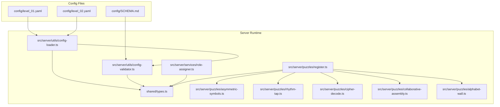
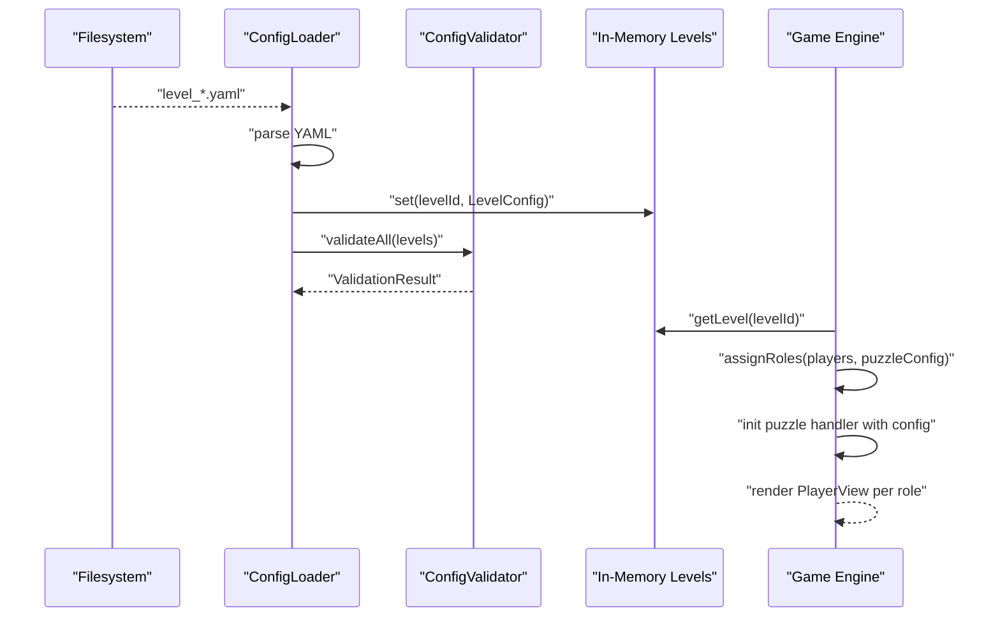
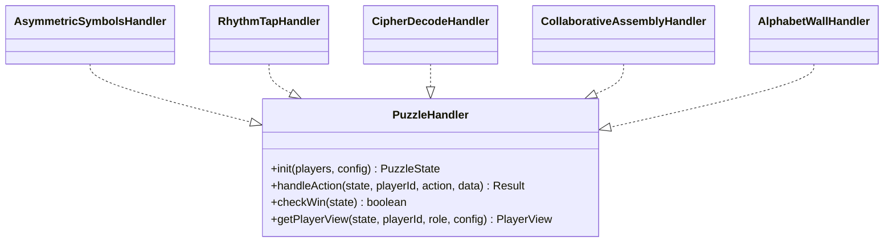
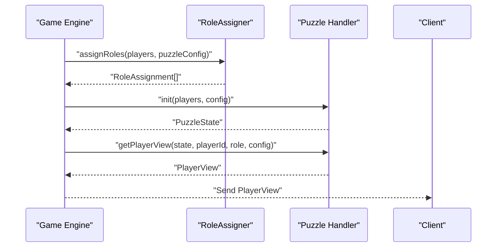
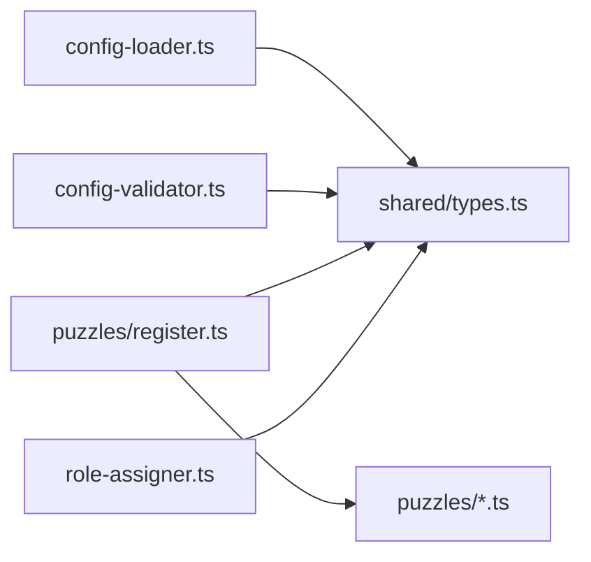

# Configuration System

<cite>
**Referenced Files in This Document**
- [SCHEMA.md](file://config/SCHEMA.md)
- [config-loader.ts](file://src/server/utils/config-loader.ts)
- [config-validator.ts](file://src/server/utils/config-validator.ts)
- [types.ts](file://shared/types.ts)
- [role-assigner.ts](file://src/server/services/role-assigner.ts)
- [register.ts](file://src/server/puzzles/register.ts)
- [asymmetric-symbols.ts](file://src/server/puzzles/asymmetric-symbols.ts)
- [rhythm-tap.ts](file://src/server/puzzles/rhythm-tap.ts)
- [cipher-decode.ts](file://src/server/puzzles/cipher-decode.ts)
- [collaborative-assembly.ts](file://src/server/puzzles/collaborative-assembly.ts)
- [alphabet-wall.ts](file://src/server/puzzles/alphabet-wall.ts)
- [level_01.yaml](file://config/level_01.yaml)
- [level_02.yaml](file://config/level_02.yaml)
</cite>

## Table of Contents
1. [Introduction](#introduction)
2. [Project Structure](#project-structure)
3. [Core Components](#core-components)
4. [Architecture Overview](#architecture-overview)
5. [Detailed Component Analysis](#detailed-component-analysis)
6. [Dependency Analysis](#dependency-analysis)
7. [Performance Considerations](#performance-considerations)
8. [Troubleshooting Guide](#troubleshooting-guide)
9. [Conclusion](#conclusion)
10. [Appendices](#appendices)

## Introduction
This document explains the YAML-based configuration system used to define levels, puzzles, roles, timers, glitch mechanics, themes, and audio cues. It covers the schema, validation, loading workflow, runtime mapping to game state, role assignment, asymmetric view generation, and audio/theme integration. It also outlines versioning and migration strategies.

## Project Structure
The configuration system centers around:
- YAML level definitions under config/
- A shared TypeScript schema in shared/types.ts
- A loader and validator under src/server/utils/
- Puzzle handlers under src/server/puzzles/ that consume configuration
- Role assignment logic under src/server/services/



**Diagram sources**
- [config-loader.ts](file://src/server/utils/config-loader.ts#L25-L40)
- [config-validator.ts](file://src/server/utils/config-validator.ts#L73-L100)
- [types.ts](file://shared/types.ts#L96-L143)
- [role-assigner.ts](file://src/server/services/role-assigner.ts#L24-L77)
- [register.ts](file://src/server/puzzles/register.ts#L14-L20)
- [asymmetric-symbols.ts](file://src/server/puzzles/asymmetric-symbols.ts#L18-L52)
- [rhythm-tap.ts](file://src/server/puzzles/rhythm-tap.ts#L19-L56)
- [cipher-decode.ts](file://src/server/puzzles/cipher-decode.ts#L18-L53)
- [collaborative-assembly.ts](file://src/server/puzzles/collaborative-assembly.ts#L31-L86)
- [alphabet-wall.ts](file://src/server/puzzles/alphabet-wall.ts#L26-L81)

**Section sources**
- [config-loader.ts](file://src/server/utils/config-loader.ts#L12-L40)
- [config-validator.ts](file://src/server/utils/config-validator.ts#L16-L68)
- [types.ts](file://shared/types.ts#L96-L143)

## Core Components
- Level configuration schema and top-level fields (id, title, story, min/max players, timer, glitch, theme_css, puzzles, audio_cues)
- Puzzle configuration schema (id, type, title, briefing, layout, data, glitch_penalty, audio_cues)
- Per-puzzle-type data schemas (asymmetric_symbols, rhythm_tap, collaborative_wiring, cipher_decode, collaborative_assembly, alphabet_wall)
- Configuration loader that reads YAML files, stores in memory, and hot-reloads on change
- Validator that checks presence of required fields, CSS availability, and audio availability
- Role assignment service that distributes players into roles per puzzle layout
- Puzzle handlers that initialize state, process actions, compute win conditions, and produce role-specific views

**Section sources**
- [SCHEMA.md](file://config/SCHEMA.md#L5-L31)
- [SCHEMA.md](file://config/SCHEMA.md#L33-L44)
- [SCHEMA.md](file://config/SCHEMA.md#L68-L117)
- [config-loader.ts](file://src/server/utils/config-loader.ts#L25-L64)
- [config-validator.ts](file://src/server/utils/config-validator.ts#L19-L68)
- [role-assigner.ts](file://src/server/services/role-assigner.ts#L24-L77)
- [types.ts](file://shared/types.ts#L96-L143)

## Architecture Overview
The configuration system follows a deterministic pipeline:
- YAML files are parsed into LevelConfig objects
- A global in-memory store holds all levels
- On startup and file changes, all configs are validated
- During gameplay, levels and puzzles are retrieved by ID, roles are assigned, and puzzle handlers render role-specific views



**Diagram sources**
- [config-loader.ts](file://src/server/utils/config-loader.ts#L25-L40)
- [config-validator.ts](file://src/server/utils/config-validator.ts#L73-L100)
- [role-assigner.ts](file://src/server/services/role-assigner.ts#L24-L77)
- [asymmetric-symbols.ts](file://src/server/puzzles/asymmetric-symbols.ts#L18-L52)

## Detailed Component Analysis

### Configuration Schema and Validation
- Top-level LevelConfig includes identifiers, narrative, capacity, timer, glitch parameters, theme list, puzzle list, and global audio cues.
- PuzzleConfig includes puzzle identity, type, presentation metadata, layout, typed data, penalty, and per-puzzle audio cues.
- Validator enforces presence of id/title/puzzles, validates theme_css existence, and warns on missing audio files.
- The schema document enumerates all fields and per-type data shapes.

```mermaid
erDiagram
LEVEL_CONFIG {
string id
string title
string story
number min_players
number max_players
number timer_seconds
object glitch
string[] theme_css
PuzzleConfig[] puzzles
object audio_cues
}
PUZZLE_CONFIG {
string id
enum type
string title
string briefing
object layout
object data
number glitch_penalty
object audio_cues
}
PUZZLE_LAYOUT {
PuzzleRoleDefinition[] roles
}
PUZZLE_ROLE_DEFINITION {
string name
number|"remaining" count
string description
}
LEVEL_CONFIG ||--o{ PUZZLE_CONFIG : "contains"
PUZZLE_CONFIG ||--o{ PUZZLE_ROLE_DEFINITION : "layout"
```

**Diagram sources**
- [types.ts](file://shared/types.ts#L96-L143)
- [types.ts](file://shared/types.ts#L145-L153)
- [SCHEMA.md](file://config/SCHEMA.md#L5-L31)
- [SCHEMA.md](file://config/SCHEMA.md#L33-L44)
- [SCHEMA.md](file://config/SCHEMA.md#L54-L64)

**Section sources**
- [SCHEMA.md](file://config/SCHEMA.md#L5-L31)
- [SCHEMA.md](file://config/SCHEMA.md#L33-L44)
- [SCHEMA.md](file://config/SCHEMA.md#L54-L64)
- [config-validator.ts](file://src/server/utils/config-validator.ts#L19-L68)
- [types.ts](file://shared/types.ts#L96-L143)

### Configuration Loading Workflow
- Loads all YAML files from the config directory, parses them, and stores them by level id.
- Supports hot-reload via chokidar: on change/add, re-parses and re-validates all levels.
- Provides convenience getters for level summaries and default level selection.


**Diagram sources**
- [config-loader.ts](file://src/server/utils/config-loader.ts#L25-L40)
- [config-loader.ts](file://src/server/utils/config-loader.ts#L69-L95)

**Section sources**
- [config-loader.ts](file://src/server/utils/config-loader.ts#L25-L40)
- [config-loader.ts](file://src/server/utils/config-loader.ts#L69-L95)

### Validation Rules and Error Handling
- Enforces required fields at top-level and per-puzzle.
- Checks theme_css file existence under src/client/styles/.
- Warns on missing audio files under src/client/public/assets/audio/.
- Aggregates validation results and logs pass/fail per level.


**Diagram sources**
- [config-validator.ts](file://src/server/utils/config-validator.ts#L19-L68)

**Section sources**
- [config-validator.ts](file://src/server/utils/config-validator.ts#L19-L68)

### Level Configuration Examples
- Example levels demonstrate full configuration including glitch thresholds, timer, theme_css, puzzles with layouts, and global audio cues.
- level_01.yaml defines five puzzles with asymmetric_symbols, collaborative_wiring, rhythm_tap, cipher_decode, and collaborative_assembly.
- level_02.yaml introduces alphabet_wall and demogorgon_hunt, showcasing richer per-puzzle data and themes.

**Section sources**
- [level_01.yaml](file://config/level_01.yaml#L7-L226)
- [level_02.yaml](file://config/level_02.yaml#L7-L348)

### Puzzle Configuration System and Types
- Registered puzzle types include asymmetric_symbols, rhythm_tap, collaborative_wiring, cipher_decode, collaborative_assembly, alphabet_wall, and demogorgon_hunt.
- Each handler consumes typed data from config.data and produces a typed PuzzleState with a status and runtime data.
- Handlers implement initialization, action processing, win checking, and role-specific view rendering.



**Diagram sources**
- [register.ts](file://src/server/puzzles/register.ts#L14-L20)
- [asymmetric-symbols.ts](file://src/server/puzzles/asymmetric-symbols.ts#L18-L52)
- [rhythm-tap.ts](file://src/server/puzzles/rhythm-tap.ts#L19-L56)
- [cipher-decode.ts](file://src/server/puzzles/cipher-decode.ts#L18-L53)
- [collaborative-assembly.ts](file://src/server/puzzles/collaborative-assembly.ts#L31-L86)
- [alphabet-wall.ts](file://src/server/puzzles/alphabet-wall.ts#L26-L81)

**Section sources**
- [register.ts](file://src/server/puzzles/register.ts#L14-L20)
- [asymmetric-symbols.ts](file://src/server/puzzles/asymmetric-symbols.ts#L18-L52)
- [rhythm-tap.ts](file://src/server/puzzles/rhythm-tap.ts#L19-L56)
- [cipher-decode.ts](file://src/server/puzzles/cipher-decode.ts#L18-L53)
- [collaborative-assembly.ts](file://src/server/puzzles/collaborative-assembly.ts#L31-L86)
- [alphabet-wall.ts](file://src/server/puzzles/alphabet-wall.ts#L26-L81)

### Role Assignment Logic and Asymmetric Views
- Roles are assigned by shuffling players and distributing according to layout.roles definitions.
- The last role may use count "remaining" to capture all unassigned players.
- Handlers produce PlayerView tailored to each role’s perspective (e.g., Navigator sees solutions; Decoder sees only letters).



**Diagram sources**
- [role-assigner.ts](file://src/server/services/role-assigner.ts#L24-L77)
- [asymmetric-symbols.ts](file://src/server/puzzles/asymmetric-symbols.ts#L103-L154)

**Section sources**
- [role-assigner.ts](file://src/server/services/role-assigner.ts#L24-L77)
- [asymmetric-symbols.ts](file://src/server/puzzles/asymmetric-symbols.ts#L103-L154)

### Audio Cue Configuration and Theme Integration
- Global audio_cues at the level level define intro, background, glitch_warning, victory, and defeat tracks.
- Per-puzzle audio_cues can override or extend defaults (e.g., start, success, fail, background).
- theme_css lists CSS files to load for the level; validator warns if missing and falls back to default in summaries.

**Section sources**
- [SCHEMA.md](file://config/SCHEMA.md#L21-L29)
- [SCHEMA.md](file://config/SCHEMA.md#L42-L44)
- [config-validator.ts](file://src/server/utils/config-validator.ts#L30-L53)
- [config-loader.ts](file://src/server/utils/config-loader.ts#L122-L134)

### Relationship Between YAML Definitions and Runtime Game State
- LevelConfig drives initial game state: timer, glitch parameters, and puzzle sequence.
- PuzzleConfig drives per-puzzle state machines: initialization, action handling, win conditions, and role views.
- Role assignments and per-role views shape what each client observes and interacts with.

**Section sources**
- [types.ts](file://shared/types.ts#L36-L68)
- [types.ts](file://shared/types.ts#L72-L83)
- [types.ts](file://shared/types.ts#L96-L143)

### Configuration Versioning and Migration Strategies
- Current schema is documented in config/SCHEMA.md; future changes should incrementally update this document and introduce migrations.
- Recommended migration approach:
  - Add a new minor schema version with optional fields.
  - Keep backward compatibility by providing defaults for new fields.
  - Emit warnings for deprecated fields and guide users to update.
  - Introduce a migration script to transform legacy YAML to new schema.
  - Validate migrated configs with the updated validator.

[No sources needed since this section provides general guidance]

## Dependency Analysis
- Loader depends on YAML parser and chokidar for hot-reload.
- Validator depends on filesystem checks for CSS and audio paths.
- Handlers depend on shared types and are registered centrally.
- Role assigner depends on shared types and shuffles players deterministically.



**Diagram sources**
- [config-loader.ts](file://src/server/utils/config-loader.ts#L5-L10)
- [config-validator.ts](file://src/server/utils/config-validator.ts#L1-L9)
- [register.ts](file://src/server/puzzles/register.ts#L5-L12)
- [role-assigner.ts](file://src/server/services/role-assigner.ts#L5-L6)

**Section sources**
- [config-loader.ts](file://src/server/utils/config-loader.ts#L5-L10)
- [config-validator.ts](file://src/server/utils/config-validator.ts#L1-L9)
- [register.ts](file://src/server/puzzles/register.ts#L5-L12)
- [role-assigner.ts](file://src/server/services/role-assigner.ts#L5-L6)

## Performance Considerations
- Hot-reload watches the config directory; avoid excessive churn to prevent repeated validations.
- Keep theme_css minimal to reduce client load times.
- Prefer concise puzzle data to minimize initialization overhead.

[No sources needed since this section provides general guidance]

## Troubleshooting Guide
- Missing id/title/puzzles: Loader skips and logs warnings; fix by adding required fields.
- Missing theme_css: Validator warns; ensure files exist under src/client/styles/.
- Missing audio files: Validator warns; ensure files exist under src/client/public/assets/audio/.
- Role assignment failures: Verify layout.roles counts sum to player count or use "remaining" for the last role.

**Section sources**
- [config-loader.ts](file://src/server/utils/config-loader.ts#L45-L64)
- [config-validator.ts](file://src/server/utils/config-validator.ts#L19-L68)
- [role-assigner.ts](file://src/server/services/role-assigner.ts#L24-L77)

## Conclusion
The YAML configuration system provides a robust, schema-driven way to define levels and puzzles, validate correctness, and feed runtime game logic. With clear separation between schema, loader, validator, and handlers, it supports flexible level design and safe evolution through versioning and migration strategies.

## Appendices

### Appendix A: Level and Puzzle Configuration Reference
- Level fields: id, title, story, min_players, max_players, timer_seconds, glitch (max, decay_rate, name), theme_css, puzzles, audio_cues
- Puzzle fields: id, type, title, briefing, layout (roles), data (per-type), glitch_penalty, audio_cues
- Per-type data: asymmetric_symbols, rhythm_tap, collaborative_wiring, cipher_decode, collaborative_assembly, alphabet_wall

**Section sources**
- [SCHEMA.md](file://config/SCHEMA.md#L5-L31)
- [SCHEMA.md](file://config/SCHEMA.md#L33-L44)
- [SCHEMA.md](file://config/SCHEMA.md#L68-L117)