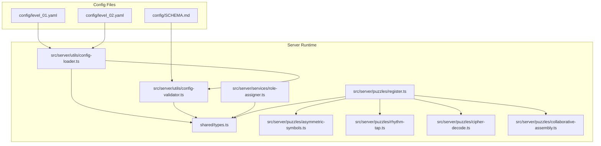
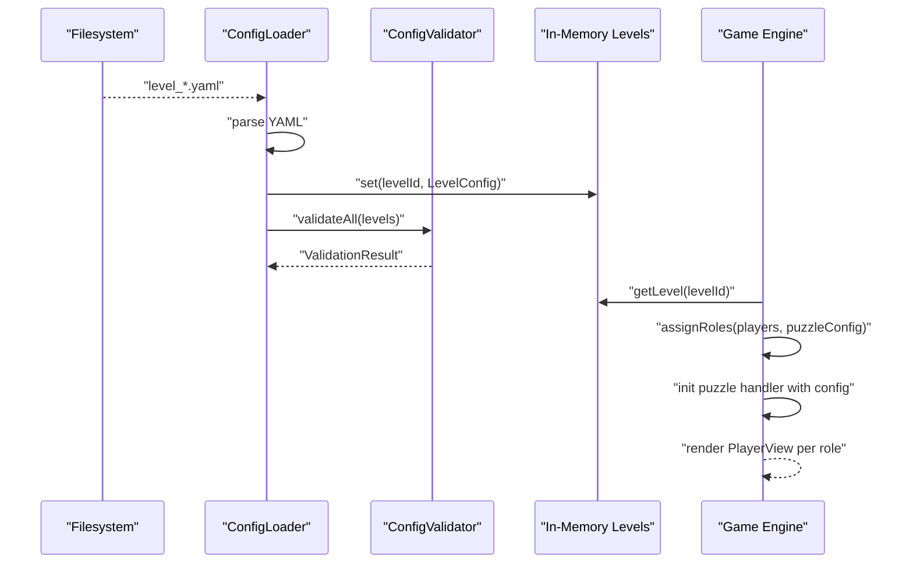
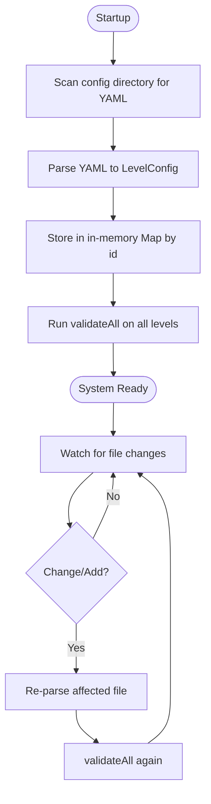
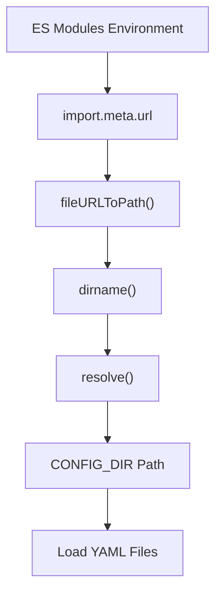
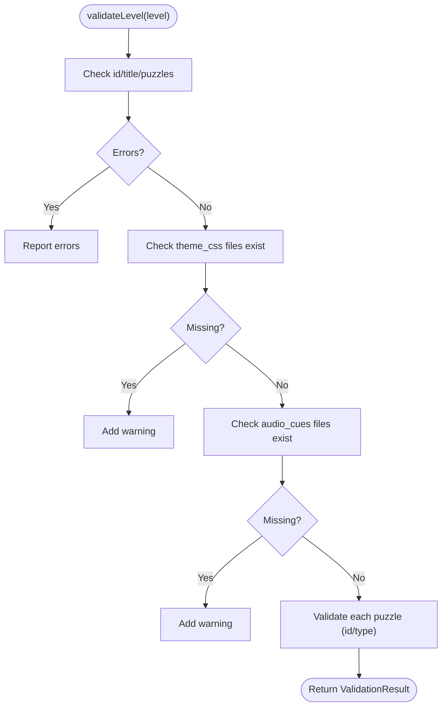
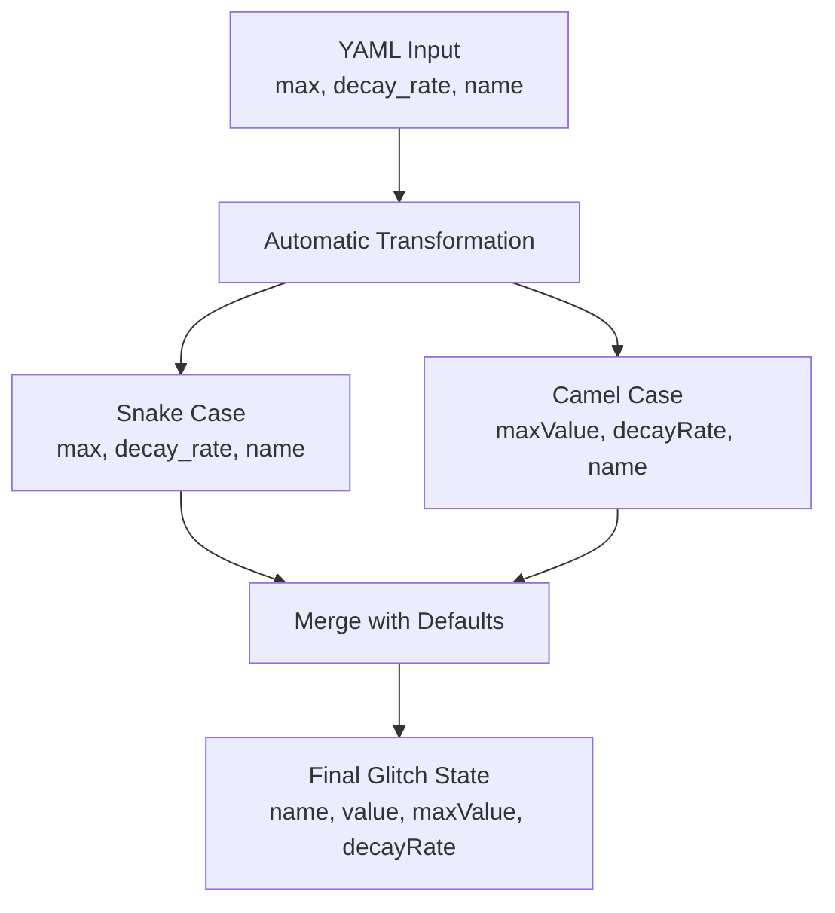
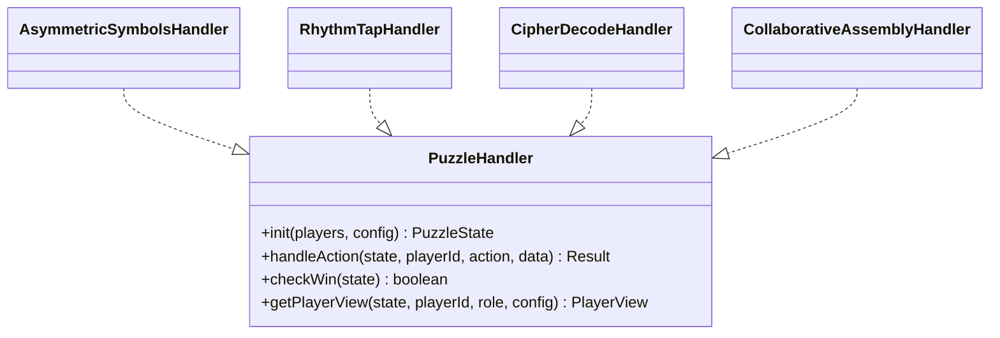
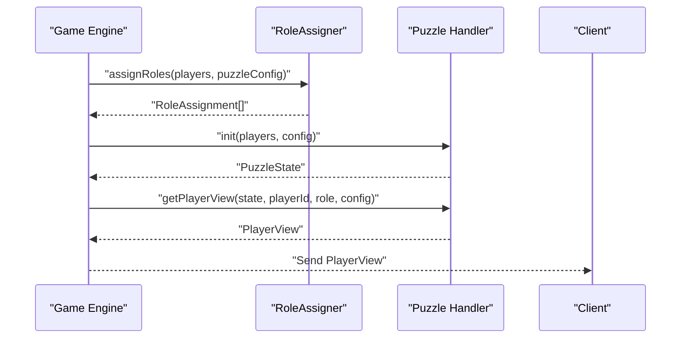
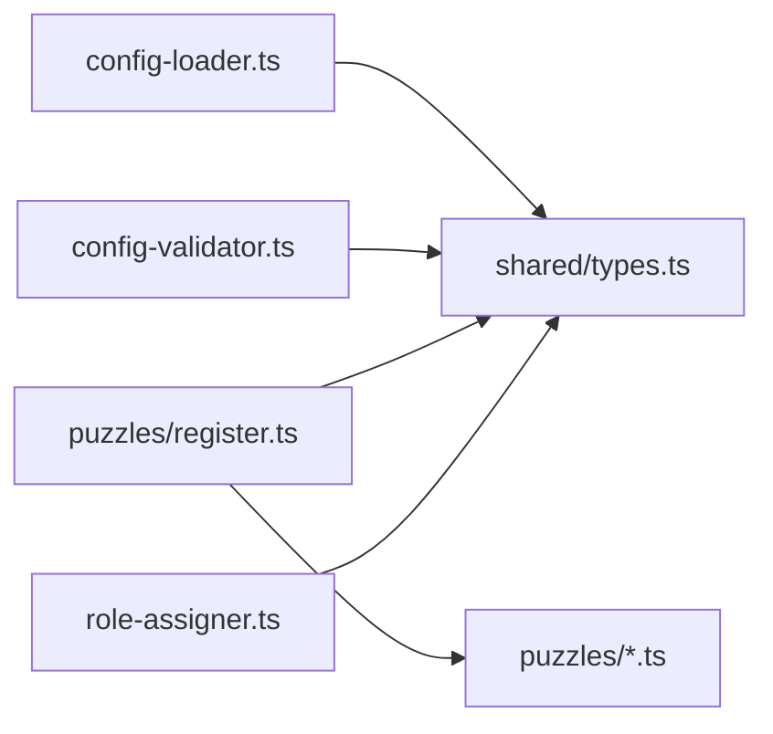

# Configuration System

<cite>
**Referenced Files in This Document**
- [SCHEMA.md](file://config/SCHEMA.md)
- [config-loader.ts](file://src/server/utils/config-loader.ts)
- [config-validator.ts](file://src/server/utils/config-validator.ts)
- [types.ts](file://shared/types.ts)
- [role-assigner.ts](file://src/server/services/role-assigner.ts)
- [register.ts](file://src/server/puzzles/register.ts)
- [asymmetric-symbols.ts](file://src/server/puzzles/asymmetric-symbols.ts)
- [rhythm-tap.ts](file://src/server/puzzles/rhythm-tap.ts)
- [cipher-decode.ts](file://src/server/puzzles/cipher-decode.ts)
- [collaborative-assembly.ts](file://src/server/puzzles/collaborative-assembly.ts)
- [tsconfig.json](file://tsconfig.json)
- [.gitignore](file://.gitignore)
- [package.json](file://package.json)
- [vite.config.ts](file://vite.config.ts)
- [vitest.config.ts](file://vitest.config.ts)
- [prisma.config.ts](file://prisma.config.ts)
- [bunfig.toml](file://bunfig.toml)
</cite>

## Update Summary
**Changes Made**
- Updated ES module support section to document enhanced fileURLToPath conversion and dirname extraction
- Added documentation for modern Node.js environment compatibility in configuration loader
- Enhanced troubleshooting guide with ES module-related guidance
- Updated TypeScript configuration section to reflect ES module compatibility improvements

## Table of Contents
1. [Introduction](#introduction)
2. [Project Structure](#project-structure)
3. [Core Components](#core-components)
4. [Architecture Overview](#architecture-overview)
5. [Detailed Component Analysis](#detailed-component-analysis)
6. [Dependency Analysis](#dependency-analysis)
7. [Performance Considerations](#performance-considerations)
8. [Troubleshooting Guide](#troubleshooting-guide)
9. [Conclusion](#conclusion)
10. [Appendices](#appendices)

## Introduction
This document explains the YAML-based configuration system used to define levels, puzzles, roles, timers, glitch mechanics, themes, and audio cues. It covers the schema, validation, loading workflow, runtime mapping to game state, role assignment, asymmetric view generation, and audio/theme integration. It also outlines versioning and migration strategies.

## Project Structure
The configuration system centers around:
- YAML level definitions under config/
- A shared TypeScript schema in shared/types.ts
- A loader and validator under src/server/utils/
- Puzzle handlers under src/server/puzzles/ that consume configuration
- Role assignment logic under src/server/services/



**Diagram sources**
- [config-loader.ts](file://src/server/utils/config-loader.ts#L25-L40)
- [config-validator.ts](file://src/server/utils/config-validator.ts#L73-L100)
- [types.ts](file://shared/types.ts#L96-L143)
- [role-assigner.ts](file://src/server/services/role-assigner.ts#L24-L77)
- [register.ts](file://src/server/puzzles/register.ts#L14-L20)
- [asymmetric-symbols.ts](file://src/server/puzzles/asymmetric-symbols.ts#L18-L52)
- [rhythm-tap.ts](file://src/server/puzzles/rhythm-tap.ts#L19-L56)
- [cipher-decode.ts](file://src/server/puzzles/cipher-decode.ts#L18-L53)
- [collaborative-assembly.ts](file://src/server/puzzles/collaborative-assembly.ts#L31-L86)

**Section sources**
- [config-loader.ts](file://src/server/utils/config-loader.ts#L12-L40)
- [config-validator.ts](file://src/server/utils/config-validator.ts#L16-L68)
- [types.ts](file://shared/types.ts#L96-L143)

## Core Components
- Level configuration schema and top-level fields (id, title, story, min/max players, timer, glitch, theme_css, puzzles, audio_cues)
- Puzzle configuration schema (id, type, title, briefing, layout, data, glitch_penalty, audio_cues)
- Per-puzzle-type data schemas (asymmetric_symbols, rhythm_tap, collaborative_wiring, cipher_decode, collaborative_assembly)
- Configuration loader that reads YAML files, stores in memory, and hot-reloads on change
- Validator that checks presence of required fields, CSS availability, and audio availability
- Role assignment service that distributes players into roles per puzzle layout
- Puzzle handlers that initialize state, process actions, compute win conditions, and produce role-specific views

**Section sources**
- [SCHEMA.md](file://config/SCHEMA.md#L5-L31)
- [SCHEMA.md](file://config/SCHEMA.md#L33-L44)
- [SCHEMA.md](file://config/SCHEMA.md#L68-L117)
- [config-loader.ts](file://src/server/utils/config-loader.ts#L25-L64)
- [config-validator.ts](file://src/server/utils/config-validator.ts#L19-L68)
- [role-assigner.ts](file://src/server/services/role-assigner.ts#L24-L77)
- [types.ts](file://shared/types.ts#L96-L143)

## Architecture Overview
The configuration system follows a deterministic pipeline:
- YAML files are parsed into LevelConfig objects
- A global in-memory store holds all levels
- On startup and file changes, all configs are validated
- During gameplay, levels and puzzles are retrieved by ID, roles are assigned, and puzzle handlers render role-specific views



**Diagram sources**
- [config-loader.ts](file://src/server/utils/config-loader.ts#L25-L40)
- [config-validator.ts](file://src/server/utils/config-validator.ts#L73-L100)
- [role-assigner.ts](file://src/server/services/role-assigner.ts#L24-L77)
- [asymmetric-symbols.ts](file://src/server/puzzles/asymmetric-symbols.ts#L18-L52)

## Detailed Component Analysis

### Configuration Schema and Validation
- Top-level LevelConfig includes identifiers, narrative, capacity, timer, glitch parameters, theme list, puzzle list, and global audio cues.
- PuzzleConfig includes puzzle identity, type, presentation metadata, layout, typed data, penalty, and per-puzzle audio cues.
- Validator enforces presence of id/title/puzzles, validates theme_css existence, and warns on missing audio files.
- The schema document enumerates all fields and per-type data shapes.

```mermaid
erDiagram
LEVEL_CONFIG {
string id
string title
string story
number min_players
number max_players
number timer_seconds
object glitch
string[] theme_css
PuzzleConfig[] puzzles
object audio_cues
}
PUZZLE_CONFIG {
string id
enum type
string title
string briefing
object layout
object data
number glitch_penalty
object audio_cues
}
PUZZLE_LAYOUT {
PuzzleRoleDefinition[] roles
}
PUZZLE_ROLE_DEFINITION {
string name
number|"remaining" count
string description
}
LEVEL_CONFIG ||--o{ PUZZLE_CONFIG : "contains"
PUZZLE_CONFIG ||--o{ PUZZLE_ROLE_DEFINITION : "layout"
```

**Diagram sources**
- [types.ts](file://shared/types.ts#L96-L143)
- [types.ts](file://shared/types.ts#L145-L153)
- [SCHEMA.md](file://config/SCHEMA.md#L5-L31)
- [SCHEMA.md](file://config/SCHEMA.md#L33-L44)
- [SCHEMA.md](file://config/SCHEMA.md#L54-L64)

**Section sources**
- [SCHEMA.md](file://config/SCHEMA.md#L5-L31)
- [SCHEMA.md](file://config/SCHEMA.md#L33-L44)
- [SCHEMA.md](file://config/SCHEMA.md#L54-L64)
- [config-validator.ts](file://src/server/utils/config-validator.ts#L19-L68)
- [types.ts](file://shared/types.ts#L96-L143)

### Configuration Loading Workflow
- Loads all YAML files from the config directory, parses them, and stores them by level id.
- Supports hot-reload via chokidar: on change/add, re-parses and re-validates all levels.
- Provides convenience getters for level summaries and default level selection.



**Diagram sources**
- [config-loader.ts](file://src/server/utils/config-loader.ts#L25-L40)
- [config-loader.ts](file://src/server/utils/config-loader.ts#L69-L95)

**Section sources**
- [config-loader.ts](file://src/server/utils/config-loader.ts#L25-L40)
- [config-loader.ts](file://src/server/utils/config-loader.ts#L69-L95)

### Enhanced ES Module Support

**Updated** The configuration loader now provides enhanced ES module support with proper file URL handling for modern Node.js environments.

The loader includes sophisticated ES module compatibility features:

- **fileURLToPath Conversion**: Uses `fileURLToPath(import.meta.url)` to convert the module's file URL to a filesystem path
- **dirname Extraction**: Extracts the directory name from the converted file path for reliable path resolution
- **Modern Node.js Compatibility**: Ensures proper operation in ES module environments with `type: "module"` in package.json
- **Cross-Platform Path Resolution**: Resolves configuration directory paths reliably across different operating systems



**Diagram sources**
- [config-loader.ts](file://src/server/utils/config-loader.ts#L13-L14)

**Section sources**
- [config-loader.ts](file://src/server/utils/config-loader.ts#L13-L14)
- [package.json](file://package.json#L3)

### Validation Rules and Error Handling
- Enforces required fields at top-level and per-puzzle.
- Checks theme_css file existence under src/client/styles/.
- Warns on missing audio files under src/client/public/assets/audio/.
- Aggregates validation results and logs pass/fail per level.



**Diagram sources**
- [config-validator.ts](file://src/server/utils/config-validator.ts#L19-L68)

**Section sources**
- [config-validator.ts](file://src/server/utils/config-validator.ts#L19-L68)

### Level Configuration Examples
- Example levels demonstrate full configuration including glitch thresholds, timer, theme_css, puzzles with layouts, and global audio cues.
- level_01.yaml defines five puzzles with asymmetric_symbols, collaborative_wiring, rhythm_tap, cipher_decode, and collaborative_assembly.

**Section sources**
- [level_01.yaml](file://config/level_01.yaml#L7-L226)

### Automatic Property Name Transformation
**Updated** The configuration loader now automatically transforms snake_case properties to camelCase to match TypeScript expected property names.

The loader performs automatic property name transformation for glitch configuration objects:
- YAML uses snake_case: `max`, `decay_rate`, `name`
- TypeScript expects camelCase: `maxValue`, `decayRate`, `name`

This transformation ensures backward compatibility while maintaining clean TypeScript property naming conventions.

**Section sources**
- [config-loader.ts](file://src/server/utils/config-loader.ts#L54-L65)

### Glitch Configuration System
**Updated** The glitch configuration system now supports both snake_case and camelCase property names through automatic transformation.

- **Snake Case Properties (YAML)**: `max`, `decay_rate`, `name`
- **Camel Case Properties (TypeScript)**: `maxValue`, `decayRate`, `name`
- **Automatic Mapping**: The loader converts snake_case to camelCase during parsing
- **Fallback Values**: If camelCase properties are missing, the loader falls back to snake_case equivalents
- **Default Values**: If both variants are missing, defaults are applied (maxValue: 100, decayRate: 0)



**Diagram sources**
- [config-loader.ts](file://src/server/utils/config-loader.ts#L54-L65)

**Section sources**
- [config-loader.ts](file://src/server/utils/config-loader.ts#L54-L65)
- [types.ts](file://shared/types.ts#L51-L56)

### Puzzle Configuration System and Types
- Registered puzzle types include asymmetric_symbols, rhythm_tap, collaborative_wiring, cipher_decode, collaborative_assembly.
- Each handler consumes typed data from config.data and produces a typed PuzzleState with a status and runtime data.
- Handlers implement initialization, action processing, win checking, and role-specific view rendering.



**Diagram sources**
- [register.ts](file://src/server/puzzles/register.ts#L14-L20)
- [asymmetric-symbols.ts](file://src/server/puzzles/asymmetric-symbols.ts#L18-L52)
- [rhythm-tap.ts](file://src/server/puzzles/rhythm-tap.ts#L19-L56)
- [cipher-decode.ts](file://src/server/puzzles/cipher-decode.ts#L18-L53)
- [collaborative-assembly.ts](file://src/server/puzzles/collaborative-assembly.ts#L31-L86)

**Section sources**
- [register.ts](file://src/server/puzzles/register.ts#L14-L20)
- [asymmetric-symbols.ts](file://src/server/puzzles/asymmetric-symbols.ts#L18-L52)
- [rhythm-tap.ts](file://src/server/puzzles/rhythm-tap.ts#L19-L56)
- [cipher-decode.ts](file://src/server/puzzles/cipher-decode.ts#L18-L53)
- [collaborative-assembly.ts](file://src/server/puzzles/collaborative-assembly.ts#L31-L86)

### Role Assignment Logic and Asymmetric Views
- Roles are assigned by shuffling players and distributing according to layout.roles definitions.
- The last role may use count "remaining" to capture all unassigned players.
- Handlers produce PlayerView tailored to each role's perspective (e.g., Navigator sees solutions; Decoder sees only letters).



**Diagram sources**
- [role-assigner.ts](file://src/server/services/role-assigner.ts#L24-L77)
- [asymmetric-symbols.ts](file://src/server/puzzles/asymmetric-symbols.ts#L103-L154)

**Section sources**
- [role-assigner.ts](file://src/server/services/role-assigner.ts#L24-L77)
- [asymmetric-symbols.ts](file://src/server/puzzles/asymmetric-symbols.ts#L103-L154)

### Audio Cue Configuration and Theme Integration
- Global audio_cues at the level level define intro, background, glitch_warning, victory, and defeat tracks.
- Per-puzzle audio_cues can override or extend defaults (e.g., start, success, fail, background).
- theme_css lists CSS files to load for the level; validator warns if missing and falls back to default in summaries.

**Section sources**
- [SCHEMA.md](file://config/SCHEMA.md#L21-L29)
- [SCHEMA.md](file://config/SCHEMA.md#L42-L44)
- [config-validator.ts](file://src/server/utils/config-validator.ts#L30-L53)
- [config-loader.ts](file://src/server/utils/config-loader.ts#L122-L134)

### Relationship Between YAML Definitions and Runtime Game State
- LevelConfig drives initial game state: timer, glitch parameters, and puzzle sequence.
- PuzzleConfig drives per-puzzle state machines: initialization, action handling, win conditions, and role views.
- Role assignments and per-role views shape what each client observes and interacts with.

**Section sources**
- [types.ts](file://shared/types.ts#L36-L68)
- [types.ts](file://shared/types.ts#L72-L83)
- [types.ts](file://shared/types.ts#L96-L143)

### Configuration Versioning and Migration Strategies
- Current schema is documented in config/SCHEMA.md; future changes should incrementally update this document and introduce migrations.
- Recommended migration approach:
  - Add a new minor schema version with optional fields.
  - Keep backward compatibility by providing defaults for new fields.
  - Emit warnings for deprecated fields and guide users to update.
  - Introduce a migration script to transform legacy YAML to new schema.
  - Validate migrated configs with the updated validator.

## Dependency Analysis
- Loader depends on YAML parser and chokidar for hot-reload.
- Validator depends on filesystem checks for CSS and audio paths.
- Handlers depend on shared types and are registered centrally.
- Role assigner depends on shared types and shuffles players deterministically.



**Diagram sources**
- [config-loader.ts](file://src/server/utils/config-loader.ts#L5-L10)
- [config-validator.ts](file://src/server/utils/config-validator.ts#L1-L9)
- [register.ts](file://src/server/puzzles/register.ts#L5-L12)
- [role-assigner.ts](file://src/server/services/role-assigner.ts#L5-L6)

**Section sources**
- [config-loader.ts](file://src/server/utils/config-loader.ts#L5-L10)
- [config-validator.ts](file://src/server/utils/config-validator.ts#L1-L9)
- [register.ts](file://src/server/puzzles/register.ts#L5-L12)
- [role-assigner.ts](file://src/server/services/role-assigner.ts#L5-L6)

## Performance Considerations
- Hot-reload watches the config directory; avoid excessive churn to prevent repeated validations.
- Keep theme_css minimal to reduce client load times.
- Prefer concise puzzle data to minimize initialization overhead.

## TypeScript Configuration and Development Environment

**Updated** The project now uses modern TypeScript configuration with enhanced module resolution capabilities and comprehensive ES module support.

### Enhanced Module Resolution Settings

The TypeScript configuration has been updated with advanced module resolution settings:

- **moduleResolution**: `"bundler"` - Uses the bundler's module resolution algorithm for optimal compatibility with modern bundlers
- **moduleDetection**: `"force"` - Forces module detection regardless of file extensions, enabling seamless ES module usage
- **verbatimModuleSyntax**: `true` - Preserves exact module syntax without transforming imports/exports
- **allowImportingTsExtensions**: `true` - Allows importing TypeScript files with .ts extensions directly

These settings provide:
- Better compatibility with Vite and other modern bundlers
- Seamless ES module support across the entire codebase
- Improved type checking accuracy
- Enhanced development experience with proper module resolution

**Section sources**
- [tsconfig.json](file://tsconfig.json#L1-L35)

### ES Module Environment Support

**Updated** The project now provides comprehensive ES module support for modern Node.js environments:

- **package.json**: `"type": "module"` enables ES module mode globally
- **fileURLToPath**: Converts module URLs to filesystem paths for reliable path resolution
- **dirname Extraction**: Properly extracts directory names for cross-platform compatibility
- **Modern Node.js**: Full compatibility with Node.js ESM features and best practices

**Section sources**
- [package.json](file://package.json#L3)
- [config-loader.ts](file://src/server/utils/config-loader.ts#L13-L14)

### Development Workflow Enhancements

**Updated** The development workflow has been streamlined with simplified test commands:

- **Development**: `bun run dev` - Concurrently runs server and client in watch mode
- **Server Development**: `bun run dev:server` - Watches server-side TypeScript files
- **Client Development**: `bun run dev:client` - Runs Vite development server
- **Testing**: `bun test src/server` - Simplified server-side testing command
- **Client Testing**: `vitest run` - Dedicated client-side testing with coverage
- **Type Checking**: `bunx tsc --noEmit` - Fast TypeScript compilation without emitting files

**Section sources**
- [package.json](file://package.json#L5-L19)

### Build Configuration

**Updated** Modern build configuration with optimized settings:

- **Target**: ESNext for latest JavaScript features
- **Module**: ESNext for native module support
- **Paths Aliases**: `@shared/*`, `@server/*`, `@client/*` for cleaner imports
- **Strict Mode**: Enabled with additional safety checks
- **Skip Lib Check**: Optimized compilation performance
- **No Emit**: Development-focused configuration without output files

**Section sources**
- [tsconfig.json](file://tsconfig.json#L1-L35)

### Generated Files Management

**Updated** Enhanced `.gitignore` patterns for generated files:

- **TypeScript Build Cache**: `*.tsbuildinfo` - Prevents committing TypeScript build artifacts
- **Vite Cache**: `**/.vitepress/cache` - Ignores VitePress cache directories
- **Prisma Generated**: `prisma/generated/*` - Excludes Prisma generated files
- **Generated**: `generated/*` - Ignores all generated files
- **Asset Caching**: `assets/audio/*`, `src/public/assets/audio/*` - Manages audio asset caching

**Section sources**
- [.gitignore](file://.gitignore#L48-L154)

### Testing Infrastructure

**Updated** Streamlined testing configuration:

- **Vitest**: Client-side testing with `happy-dom` for fast DOM simulation
- **Coverage**: Configured with `v8` provider and multiple reporters
- **Bun Test**: Server-side testing with Bun's built-in test runner
- **Playwright**: End-to-end testing separate from unit tests

**Section sources**
- [vitest.config.ts](file://vitest.config.ts#L1-L42)
- [bunfig.toml](file://bunfig.toml#L1-L3)

## Troubleshooting Guide
- Missing id/title/puzzles: Loader skips and logs warnings; fix by adding required fields.
- Missing theme_css: Validator warns; ensure files exist under src/client/styles/.
- Missing audio files: Validator warns; ensure files exist under src/client/public/assets/audio/.
- Role assignment failures: Verify layout.roles counts sum to player count or use "remaining" for the last role.
- **Property naming issues**: If glitch configuration isn't working, ensure you're using the correct property names. The loader automatically transforms snake_case to camelCase, so both formats are supported.
- **ES module compatibility**: If import statements fail, verify that `type: "module"` is set in package.json and that `moduleResolution: "bundler"` is properly configured in tsconfig.json.
- **File path issues**: If configuration files aren't loading, ensure that `fileURLToPath` and `dirname` extraction are working correctly in the configuration loader.
- **Build errors**: Ensure all TypeScript files use proper ES module syntax with the new configuration settings.

**Updated** Added troubleshooting guidance for enhanced ES module support and modern Node.js environment compatibility.

**Section sources**
- [config-loader.ts](file://src/server/utils/config-loader.ts#L45-L64)
- [config-validator.ts](file://src/server/utils/config-validator.ts#L19-L68)
- [role-assigner.ts](file://src/server/services/role-assigner.ts#L24-L77)
- [tsconfig.json](file://tsconfig.json#L10-L12)
- [package.json](file://package.json#L3)

## Conclusion
The YAML configuration system provides a robust, schema-driven way to define levels and puzzles, validate correctness, and feed runtime game logic. With clear separation between schema, loader, validator, and handlers, it supports flexible level design and safe evolution through versioning and migration strategies. The automatic property name transformation feature enhances developer experience by supporting both snake_case and camelCase property names seamlessly.

The enhanced ES module support ensures compatibility with modern Node.js environments and provides reliable file path resolution across different platforms. The improved TypeScript configuration with modern module resolution settings provides better development experience, better bundler compatibility, and streamlined testing workflows. These improvements ensure the configuration system remains maintainable and efficient as the project evolves.

## Appendices

### Appendix A: Level and Puzzle Configuration Reference
- Level fields: id, title, story, min_players, max_players, timer_seconds, glitch (maxValue, decayRate, name), theme_css, puzzles, audio_cues
- Puzzle fields: id, type, title, briefing, layout (roles), data (per-type), glitch_penalty, audio_cues
- Per-type data: asymmetric_symbols, rhythm_tap, collaborative_wiring, cipher_decode, collaborative_assembly

**Updated** Added camelCase property names to glitch configuration reference.

**Section sources**
- [SCHEMA.md](file://config/SCHEMA.md#L5-L31)
- [SCHEMA.md](file://config/SCHEMA.md#L33-L44)
- [SCHEMA.md](file://config/SCHEMA.md#L68-L117)

### Appendix B: Property Name Transformation Reference
**New** Complete reference for automatic property name transformations performed by the configuration loader.

#### Glitch Configuration Properties
| YAML (Snake Case) | TypeScript (Camel Case) | Description |
|-------------------|------------------------|-------------|
| `max` | `maxValue` | Maximum glitch value (game over threshold) |
| `decay_rate` | `decayRate` | Natural decay rate per second |
| `name` | `name` | Glitch system name |

#### Transformation Behavior
- **Priority**: If both snake_case and camelCase properties exist, camelCase takes precedence
- **Fallback**: If camelCase is missing, loader attempts to use snake_case equivalent
- **Defaults**: If both variants are missing, defaults are applied (maxValue: 100, decayRate: 0)
- **Backward Compatibility**: Both property naming conventions are fully supported

**Section sources**
- [config-loader.ts](file://src/server/utils/config-loader.ts#L54-L65)

### Appendix C: TypeScript Configuration Reference

**New** Comprehensive reference for the enhanced TypeScript configuration.

#### Module Resolution Settings
- **moduleResolution**: `"bundler"` - Bundler-compatible module resolution
- **moduleDetection**: `"force"` - Force module detection regardless of extensions
- **verbatimModuleSyntax**: `true` - Preserve exact module syntax
- **allowImportingTsExtensions**: `true` - Allow importing TypeScript files directly

#### Compiler Options
- **Target**: ESNext - Latest JavaScript features
- **Module**: ESNext - Native ES module support
- **Strict**: Enabled - Enhanced type safety
- **SkipLibCheck**: Enabled - Faster compilation
- **NoEmit**: Enabled - Development-focused

#### Path Aliases
- `@shared/*`: Points to `./shared/*`
- `@server/*`: Points to `./src/server/*`
- `@client/*`: Points to `./src/client/*`

**Section sources**
- [tsconfig.json](file://tsconfig.json#L1-L35)

### Appendix D: ES Module Support Reference

**New** Complete reference for ES module support in the configuration system.

#### ES Module Configuration
- **package.json**: `"type": "module"` - Enables ES module mode globally
- **fileURLToPath**: Converts module URLs to filesystem paths
- **dirname Extraction**: Properly extracts directory names for cross-platform compatibility
- **Modern Node.js**: Full compatibility with Node.js ESM features

#### Configuration Loader Features
- **Dynamic Path Resolution**: Uses `fileURLToPath(import.meta.url)` for reliable path resolution
- **Cross-Platform Compatibility**: Works consistently across Windows, macOS, and Linux
- **Hot Reload Integration**: Maintains compatibility with chokidar file watching
- **TypeScript Compatibility**: Works seamlessly with modern TypeScript configurations

**Section sources**
- [package.json](file://package.json#L3)
- [config-loader.ts](file://src/server/utils/config-loader.ts#L13-L14)

### Appendix E: Development Commands Reference

**New** Complete reference for streamlined development commands.

#### Basic Commands
- `bun run dev`: Start development servers (server + client)
- `bun run dev:server`: Watch server-side TypeScript files
- `bun run dev:client`: Run Vite development server
- `bun run build`: Build production client bundle
- `bun run start`: Start production servers

#### Testing Commands
- `bun test src/server`: Run server-side tests
- `bun run test:client`: Run client-side tests with Vitest
- `bun run test:client:watch`: Watch client-side tests
- `bun run test:client:coverage`: Run client-side tests with coverage
- `bun run test:puzzles`: Run puzzle-specific tests

#### Development Commands
- `bun run typecheck`: Fast TypeScript compilation without emit
- `bun run lint`: Code linting (if configured)

**Section sources**
- [package.json](file://package.json#L5-L19)