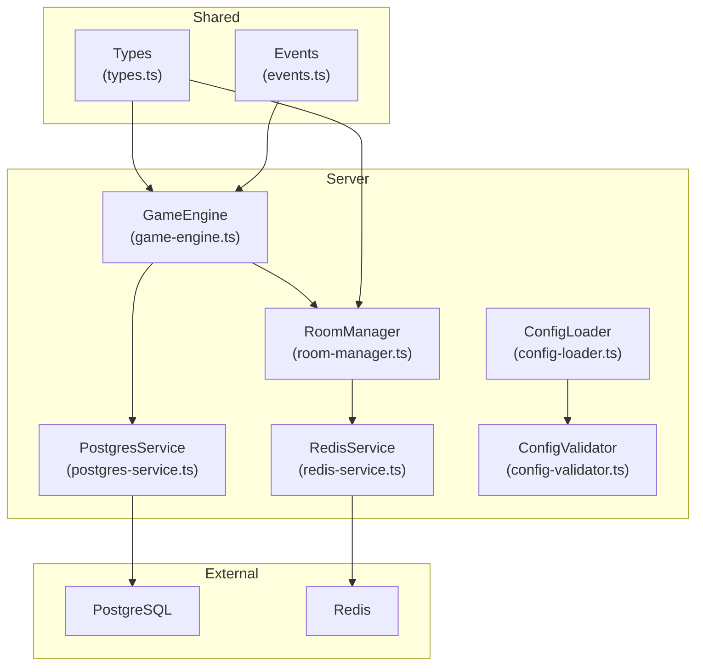
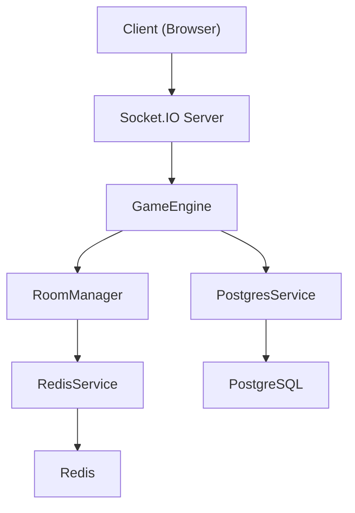
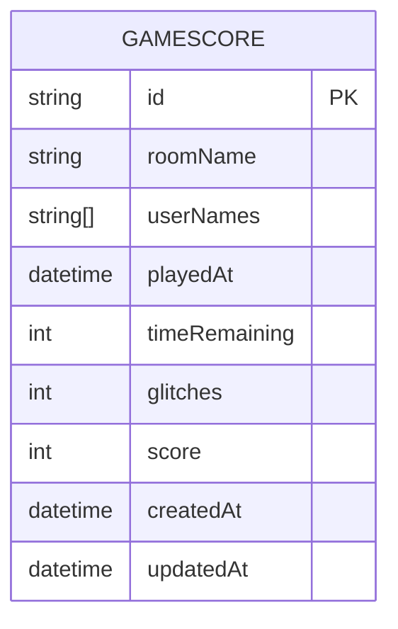
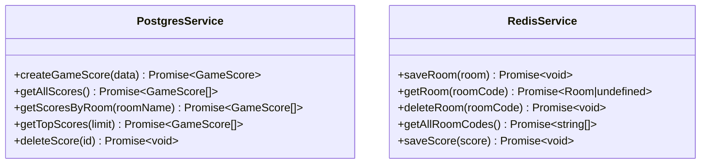
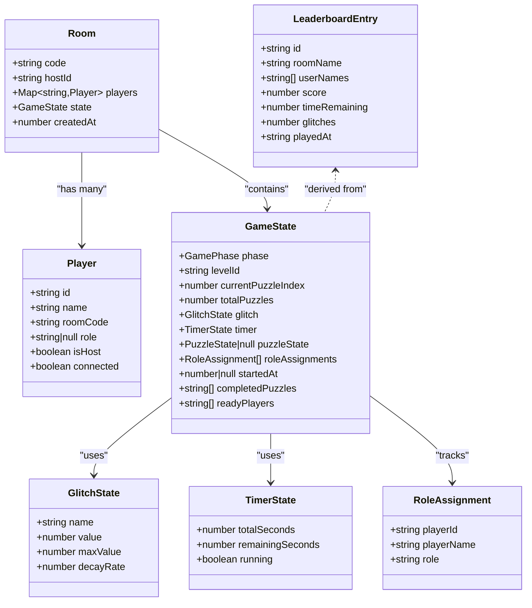
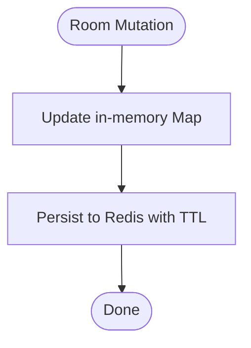
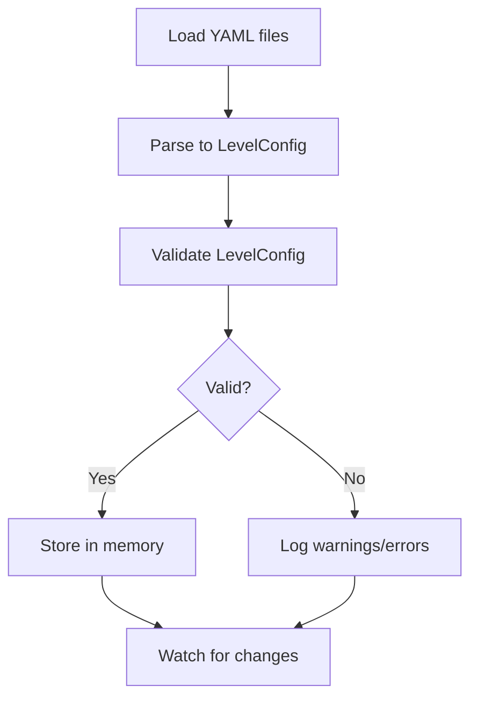
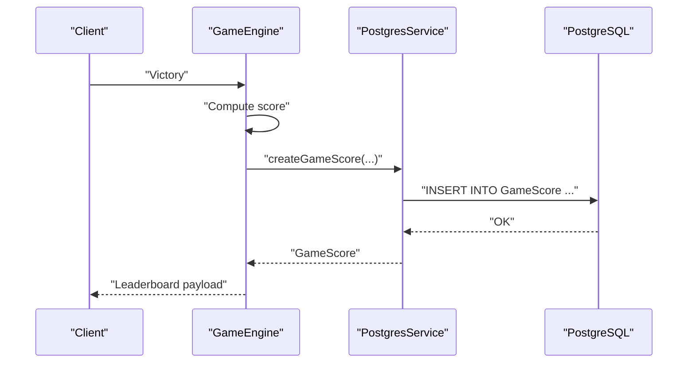
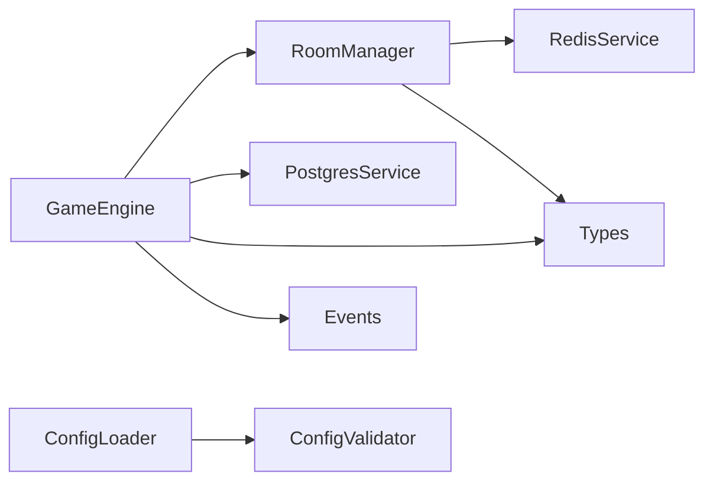

# Data Management

<cite>
**Referenced Files in This Document**
- [schema.prisma](file://prisma/schema.prisma)
- [postgres-service.ts](file://src/server/repositories/postgres-service.ts)
- [redis-service.ts](file://src/server/repositories/redis-service.ts)
- [types.ts](file://shared/types.ts)
- [events.ts](file://shared/events.ts)
- [room-manager.ts](file://src/server/services/room-manager.ts)
- [game-engine.ts](file://src/server/services/game-engine.ts)
- [config-loader.ts](file://src/server/utils/config-loader.ts)
- [config-validator.ts](file://src/server/utils/config-validator.ts)
- [docker-compose.yml](file://docker-compose.yml)
- [ARCHITECTURE.md](file://ARCHITECTURE.md)
- [prisma.config.ts](file://prisma.config.ts)
- [logger.ts](file://src/server/utils/logger.ts)
</cite>

## Table of Contents
1. [Introduction](#introduction)
2. [Project Structure](#project-structure)
3. [Core Components](#core-components)
4. [Architecture Overview](#architecture-overview)
5. [Detailed Component Analysis](#detailed-component-analysis)
6. [Dependency Analysis](#dependency-analysis)
7. [Performance Considerations](#performance-considerations)
8. [Troubleshooting Guide](#troubleshooting-guide)
9. [Conclusion](#conclusion)
10. [Appendices](#appendices)

## Introduction
This document describes the data management architecture for the co-op escape room system. It explains how PostgreSQL and Redis are used together to manage persistent leaderboards/scores and real-time room/session state, respectively. It covers Prisma ORM integration, schema design, repository pattern usage, data models, caching and persistence strategies, configuration management, validation, and operational considerations such as backup/recovery and scalability.

## Project Structure
The data management system spans three primary areas:
- Persistent data (leaderboards, configurations): PostgreSQL with Prisma ORM
- Real-time session state and synchronization: Redis
- Shared models and events: TypeScript interfaces and enums

**Diagram sources**
- [game-engine.ts](file://src/server/services/game-engine.ts#L1-L711)
- [room-manager.ts](file://src/server/services/room-manager.ts#L1-L262)
- [postgres-service.ts](file://src/server/repositories/postgres-service.ts#L1-L68)
- [redis-service.ts](file://src/server/repositories/redis-service.ts#L1-L68)
- [config-loader.ts](file://src/server/utils/config-loader.ts#L1-L135)
- [config-validator.ts](file://src/server/utils/config-validator.ts#L1-L101)
- [types.ts](file://shared/types.ts#L1-L187)
- [events.ts](file://shared/events.ts#L1-L228)

**Section sources**
- [ARCHITECTURE.md](file://ARCHITECTURE.md#L1-L202)
- [docker-compose.yml](file://docker-compose.yml#L1-L45)

## Core Components
- PostgreSQL + Prisma: Stores immutable, historical game scores and supports leaderboard queries.
- Redis: Stores transient room state and player sessions with TTL for automatic cleanup.
- Repository pattern: Encapsulates database operations behind clean interfaces (PostgresService, RedisService).
- Shared types and events: Define data contracts for models, game state, and inter-process communication.

Key responsibilities:
- PostgresService: Create/read/top scores, with DTOs for input normalization.
- RedisService: Serialize/deserialize Room entities, manage TTL, and provide room lookup and listing.
- RoomManager: In-memory authoritative store with Redis persistence on mutations.
- GameEngine: Orchestrates game flow, persists room state, and records scores post-victory.

**Section sources**
- [postgres-service.ts](file://src/server/repositories/postgres-service.ts#L1-L68)
- [redis-service.ts](file://src/server/repositories/redis-service.ts#L1-L68)
- [room-manager.ts](file://src/server/services/room-manager.ts#L1-L262)
- [game-engine.ts](file://src/server/services/game-engine.ts#L1-L711)

## Architecture Overview
The system uses a dual-database approach:
- PostgreSQL for durable, analytical data (leaderboards, historical scores).
- Redis for ephemeral, high-throughput state (rooms, sessions).

**Diagram sources**
- [game-engine.ts](file://src/server/services/game-engine.ts#L1-L711)
- [room-manager.ts](file://src/server/services/room-manager.ts#L1-L262)
- [postgres-service.ts](file://src/server/repositories/postgres-service.ts#L1-L68)
- [redis-service.ts](file://src/server/repositories/redis-service.ts#L1-L68)

## Detailed Component Analysis

### Prisma ORM Integration and Schema Design
- Provider: PostgreSQL
- Model: GameScore with UUID primary key, indexed fields for roomName and playedAt, and timestamps for audit
- Client generation: Automatic client built from schema.prisma
- Configuration: Datasource URL from environment variable via prisma.config.ts

**Diagram sources**
- [schema.prisma](file://prisma/schema.prisma#L1-L24)

**Section sources**
- [schema.prisma](file://prisma/schema.prisma#L1-L24)
- [prisma.config.ts](file://prisma.config.ts#L1-L14)
- [postgres-service.ts](file://src/server/repositories/postgres-service.ts#L1-L68)

### Repository Pattern Implementation
- PostgresService encapsulates Prisma client initialization with a PostgreSQL adapter and exposes methods to create scores, list all scores, fetch top scores, and delete a score by ID.
- RedisService encapsulates Redis client creation, connection logging, and room serialization/deserialization with TTL.

**Diagram sources**
- [postgres-service.ts](file://src/server/repositories/postgres-service.ts#L24-L68)
- [redis-service.ts](file://src/server/repositories/redis-service.ts#L39-L68)

**Section sources**
- [postgres-service.ts](file://src/server/repositories/postgres-service.ts#L1-L68)
- [redis-service.ts](file://src/server/repositories/redis-service.ts#L1-L68)

### Data Models
Core models used across the system:
- Player: identity, display name, room association, role, host flag, connectivity
- Room: room code, host identifier, player map, game state, creation timestamp
- GameState: phase, level metadata, timers, glitch state, puzzle state, role assignments, timestamps, completion tracking
- LeaderboardEntry: derived from persisted GameScore for presentation

**Diagram sources**
- [types.ts](file://shared/types.ts#L7-L187)

**Section sources**
- [types.ts](file://shared/types.ts#L1-L187)

### Caching Strategy and Persistence Patterns
- Redis caching:
  - Room state is serialized to JSON and stored with a TTL to expire stale rooms automatically.
  - Keys follow a namespace convention (e.g., room:<code>) to isolate data.
  - Room listing is supported via key scanning.
- PostgreSQL persistence:
  - Scores are written post-victory with normalized fields (roomName, userNames[], timeRemaining, glitches, score, playedAt).
  - Indexes on roomName and playedAt support efficient queries.
- In-memory authoritative store:
  - RoomManager maintains an in-memory Map of rooms and persists to Redis on every mutation.

**Diagram sources**
- [room-manager.ts](file://src/server/services/room-manager.ts#L239-L245)
- [redis-service.ts](file://src/server/repositories/redis-service.ts#L40-L55)

**Section sources**
- [room-manager.ts](file://src/server/services/room-manager.ts#L1-L262)
- [redis-service.ts](file://src/server/repositories/redis-service.ts#L1-L68)
- [schema.prisma](file://prisma/schema.prisma#L1-L24)

### Data Validation and Configuration Management
- YAML-based level configuration is loaded at startup and validated:
  - Structural checks for required fields
  - Theme CSS and audio cue file existence checks
  - Hot-reload via chokidar for development
- Validation aggregates warnings and errors and logs outcomes.

**Diagram sources**
- [config-loader.ts](file://src/server/utils/config-loader.ts#L25-L95)
- [config-validator.ts](file://src/server/utils/config-validator.ts#L19-L68)

**Section sources**
- [config-loader.ts](file://src/server/utils/config-loader.ts#L1-L135)
- [config-validator.ts](file://src/server/utils/config-validator.ts#L1-L101)

### Leaderboard Data Flow
- On game victory, the engine computes a score and persists it to PostgreSQL via PostgresService.
- Leaderboard queries are supported by PostgresService methods for top scores and room-scoped lists.

**Diagram sources**
- [game-engine.ts](file://src/server/services/game-engine.ts#L458-L483)
- [postgres-service.ts](file://src/server/repositories/postgres-service.ts#L28-L39)
- [schema.prisma](file://prisma/schema.prisma#L10-L24)

**Section sources**
- [game-engine.ts](file://src/server/services/game-engine.ts#L458-L483)
- [postgres-service.ts](file://src/server/repositories/postgres-service.ts#L1-L68)

## Dependency Analysis
- GameEngine depends on RoomManager for room state and PostgresService for score persistence.
- RoomManager depends on RedisService for persistence and shared types for Room/Player definitions.
- ConfigLoader and ConfigValidator provide runtime configuration with hot-reload and validation.
- Shared types and events define contracts used across server and client.

**Diagram sources**
- [game-engine.ts](file://src/server/services/game-engine.ts#L1-L711)
- [room-manager.ts](file://src/server/services/room-manager.ts#L1-L262)
- [postgres-service.ts](file://src/server/repositories/postgres-service.ts#L1-L68)
- [redis-service.ts](file://src/server/repositories/redis-service.ts#L1-L68)
- [types.ts](file://shared/types.ts#L1-L187)
- [events.ts](file://shared/events.ts#L1-L228)
- [config-loader.ts](file://src/server/utils/config-loader.ts#L1-L135)
- [config-validator.ts](file://src/server/utils/config-validator.ts#L1-L101)

**Section sources**
- [ARCHITECTURE.md](file://ARCHITECTURE.md#L1-L202)

## Performance Considerations
- Redis TTL: Rooms and scores are set with TTL to prevent unbounded growth and reduce cleanup overhead.
- Indexes: PostgreSQL indexes on roomName and playedAt optimize leaderboard queries.
- In-memory authoritative store: Reduces latency for frequent reads/writes within a single server instance.
- Hot-reload: Development benefits from fast iteration with chokidar-based file watching.
- Logging: Structured logging helps diagnose performance bottlenecks and errors.

[No sources needed since this section provides general guidance]

## Troubleshooting Guide
Common operational issues and remedies:
- Redis connectivity errors: Verify REDIS_URL and network reachability; check Redis service logs.
- PostgreSQL connection failures: Confirm DATABASE_URL and credentials; ensure the database is healthy.
- Room restoration failures: If Redis is down, rooms may not restore; ensure Redis availability and retry logic.
- Score persistence errors: Inspect PostgresService error handling and Prisma client logs.
- Configuration validation failures: Review validator warnings/errors and fix missing files or invalid structure.

**Section sources**
- [redis-service.ts](file://src/server/repositories/redis-service.ts#L9-L15)
- [docker-compose.yml](file://docker-compose.yml#L1-L45)
- [logger.ts](file://src/server/utils/logger.ts#L1-L21)

## Conclusion
The data management architecture leverages PostgreSQL for durable, analyzable leaderboards and Redis for scalable, low-latency room/session state. The repository pattern cleanly abstracts database operations, while shared types and events maintain strong contracts across the system. Robust configuration loading and validation ensure reliable deployments, and structured logging supports ongoing operations.

[No sources needed since this section summarizes without analyzing specific files]

## Appendices

### Backup and Recovery Procedures
- PostgreSQL backups: Use logical backups (e.g., pg_dump) for GameScore data; schedule periodic snapshots and retain recent recovery points.
- Redis backups: Use RDB snapshots or AOF persistence; consider backing up Redis data directory for crash recovery.
- Restore steps:
  - Restore PostgreSQL snapshot and replay WAL if applicable.
  - Restore Redis snapshot and restart Redis to repopulate ephemeral state.
  - Restart the application; RoomManager will reload rooms from Redis on startup.

[No sources needed since this section provides general guidance]

### Horizontal Scaling Considerations
- Redis as a shared state store: Use a managed Redis cluster or Redis Sentinel for high availability and failover.
- Sticky sessions vs. stateless: Since room state is persisted in Redis, the server can scale horizontally without sticky sessions.
- Redis adapters: Consider using Redis cluster clients and consistent hashing to distribute keys across shards.
- Monitoring: Track Redis memory usage, eviction policies, and latency; monitor PostgreSQL replication lag if using replicas.

[No sources needed since this section provides general guidance]