# Data Management

<cite>
**Referenced Files in This Document**
- [schema.prisma](file://prisma/schema.prisma)
- [prisma.config.ts](file://prisma.config.ts)
- [postgres-service.ts](file://src/server/repositories/postgres-service.ts)
- [redis-service.ts](file://src/server/repositories/redis-service.ts)
- [types.ts](file://shared/types.ts)
- [events.ts](file://shared/events.ts)
- [room-manager.ts](file://src/server/services/room-manager.ts)
- [game-engine.ts](file://src/server/services/game-engine.ts)
- [config-loader.ts](file://src/server/utils/config-loader.ts)
- [config-validator.ts](file://src/server/utils/config-validator.ts)
- [docker-compose.yml](file://docker-compose.yml)
- [ARCHITECTURE.md](file://ARCHITECTURE.md)
- [logger.ts](file://src/server/utils/logger.ts)
- [Dockerfile](file://Dockerfile)
- [entrypoint.sh](file://entrypoint.sh)
- [package.json](file://package.json)
- [logger.ts](file://shared/logger.ts)
</cite>

## Update Summary
**Changes Made**
- Enhanced Redis service documentation to reflect improved connection reliability with retry strategies and error cooldown mechanisms
- Updated troubleshooting section with Redis-specific operational guidance
- Added comprehensive error handling and connection resilience documentation
- Expanded performance considerations to include Redis connection management

## Table of Contents
1. [Introduction](#introduction)
2. [Project Structure](#project-structure)
3. [Core Components](#core-components)
4. [Architecture Overview](#architecture-overview)
5. [Detailed Component Analysis](#detailed-component-analysis)
6. [Dependency Analysis](#dependency-analysis)
7. [Performance Considerations](#performance-considerations)
8. [Troubleshooting Guide](#troubleshooting-guide)
9. [Conclusion](#conclusion)
10. [Appendices](#appendices)

## Introduction
This document describes the data management architecture for the co-op escape room system. It explains how PostgreSQL and Redis are used together to manage persistent leaderboards/scores and real-time room/session state, respectively. It covers Prisma ORM integration with Bun runtime, schema design, repository pattern usage, data models, caching and persistence strategies, configuration management, validation, and operational considerations such as backup/recovery and scalability.

## Project Structure
The data management system spans three primary areas:
- Persistent data (leaderboards, configurations): PostgreSQL with Prisma ORM using Bun runtime
- Real-time session state and synchronization: Redis with enhanced connection reliability
- Shared models and events: TypeScript interfaces and enums

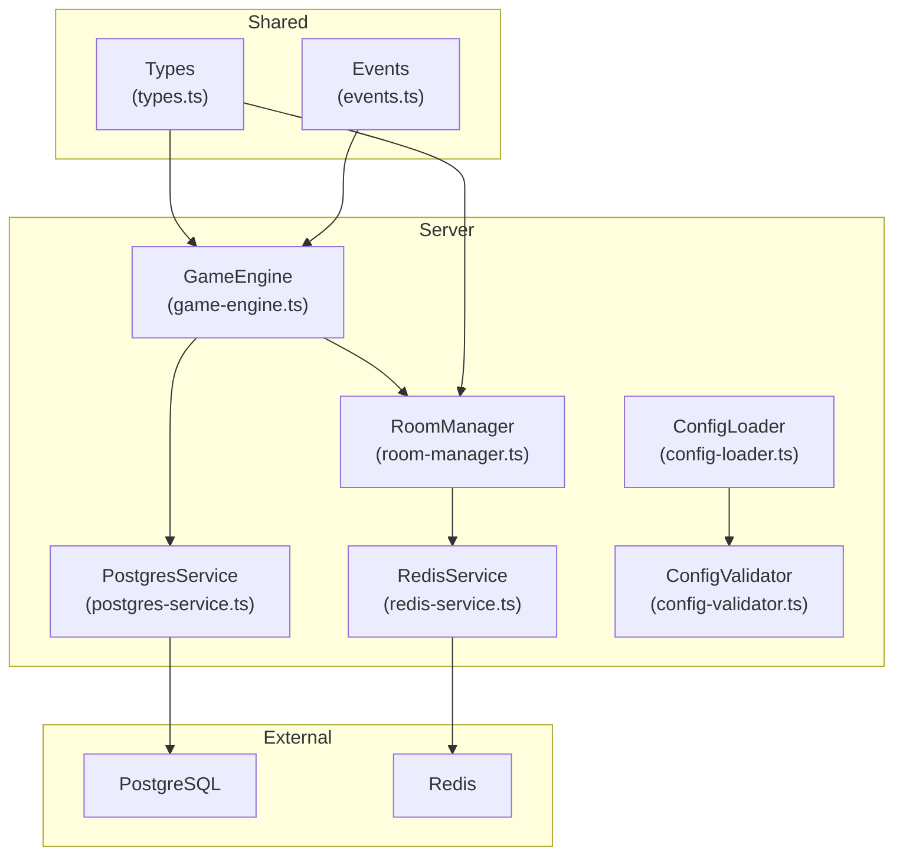

**Diagram sources**
- [game-engine.ts](file://src/server/services/game-engine.ts#L1-L711)
- [room-manager.ts](file://src/server/services/room-manager.ts#L1-L262)
- [postgres-service.ts](file://src/server/repositories/postgres-service.ts#L1-L78)
- [redis-service.ts](file://src/server/repositories/redis-service.ts#L1-L89)
- [config-loader.ts](file://src/server/utils/config-loader.ts#L1-L135)
- [config-validator.ts](file://src/server/utils/config-validator.ts#L1-L101)
- [types.ts](file://shared/types.ts#L1-L187)
- [events.ts](file://shared/events.ts#L1-L228)

**Section sources**
- [ARCHITECTURE.md](file://ARCHITECTURE.md#L1-L202)
- [docker-compose.yml](file://docker-compose.yml#L1-L45)

## Core Components
- PostgreSQL + Prisma with Bun runtime: Stores immutable, historical game scores and supports leaderboard queries using the modern Prisma client architecture.
- Redis: Stores transient room state and player sessions with TTL for automatic cleanup and enhanced connection reliability.
- Repository pattern: Encapsulates database operations behind clean interfaces (PostgresService, RedisService).
- Shared types and events: Define data contracts for models, game state, and inter-process communication.

Key responsibilities:
- PostgresService: Create/read/top scores, with DTOs for input normalization, using simplified Prisma adapter connection.
- RedisService: Serialize/deserialize Room entities, manage TTL, provide room lookup and listing with robust connection handling.
- RoomManager: In-memory authoritative store with Redis persistence on mutations.
- GameEngine: Orchestrates game flow, persists room state, and records scores post-victory.

**Section sources**
- [postgres-service.ts](file://src/server/repositories/postgres-service.ts#L1-L78)
- [redis-service.ts](file://src/server/repositories/redis-service.ts#L1-L89)
- [room-manager.ts](file://src/server/services/room-manager.ts#L1-L262)
- [game-engine.ts](file://src/server/services/game-engine.ts#L1-L711)

## Architecture Overview
The system uses a dual-database approach with modern Prisma client architecture and enhanced Redis connection reliability:
- PostgreSQL for durable, analytical data (leaderboards, historical scores) using Bun runtime.
- Redis for ephemeral, high-throughput state (rooms, sessions) with automatic retry and error cooldown mechanisms.

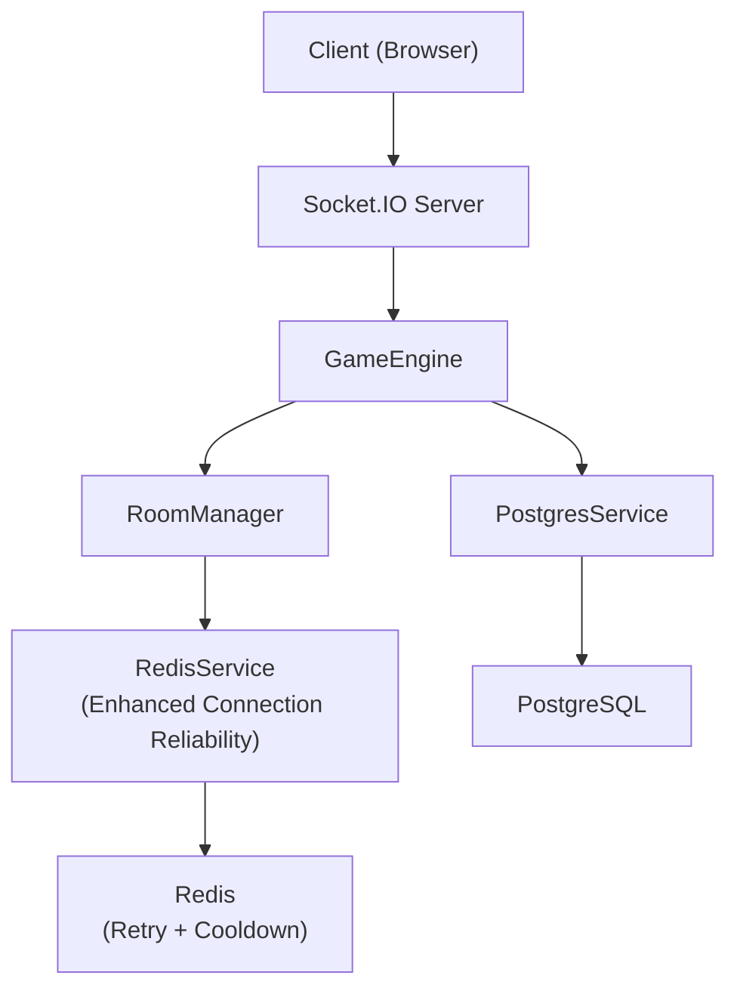

**Diagram sources**
- [game-engine.ts](file://src/server/services/game-engine.ts#L1-L711)
- [room-manager.ts](file://src/server/services/room-manager.ts#L1-L262)
- [postgres-service.ts](file://src/server/repositories/postgres-service.ts#L1-L78)
- [redis-service.ts](file://src/server/repositories/redis-service.ts#L1-L89)

## Detailed Component Analysis

### Prisma ORM Integration and Schema Design
**Updated** Enhanced with Bun runtime support and simplified client configuration

- Provider: prisma-client with engineType 'client' and runtime 'bun'
- Output path: ../generated/prisma for cleaner project structure
- Model: GameScore with UUID primary key, indexed fields for roomName and playedAt, and timestamps for audit
- Client generation: Automatic client built from schema.prisma with Bun runtime optimization
- Configuration: Datasource URL from environment variable via prisma.config.ts

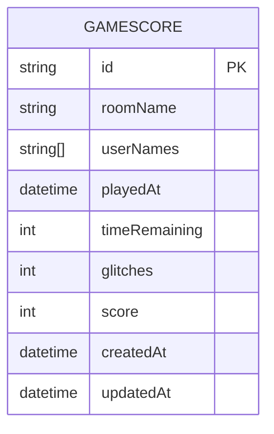

**Diagram sources**
- [schema.prisma](file://prisma/schema.prisma#L1-L26)

**Section sources**
- [schema.prisma](file://prisma/schema.prisma#L1-L26)
- [prisma.config.ts](file://prisma.config.ts#L1-L14)
- [postgres-service.ts](file://src/server/repositories/postgres-service.ts#L1-L78)

### Repository Pattern Implementation
**Updated** Simplified PostgreSQL connection using Prisma adapter

- PostgresService encapsulates Prisma client initialization with PrismaPg adapter and lazy loading for optimal performance.
- RedisService encapsulates Redis client creation with enhanced connection reliability, connection logging, and room serialization/deserialization with TTL.

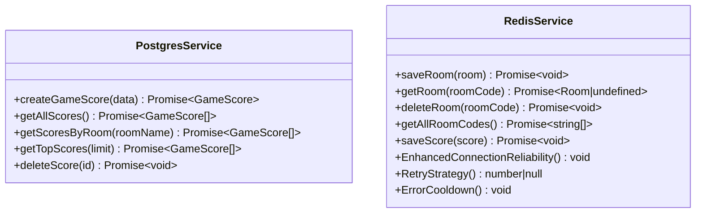

**Diagram sources**
- [postgres-service.ts](file://src/server/repositories/postgres-service.ts#L33-L78)
- [redis-service.ts](file://src/server/repositories/redis-service.ts#L39-L89)

**Section sources**
- [postgres-service.ts](file://src/server/repositories/postgres-service.ts#L1-L78)
- [redis-service.ts](file://src/server/repositories/redis-service.ts#L1-L89)

### Data Models
Core models used across the system:
- Player: identity, display name, room association, role, host flag, connectivity
- Room: room code, host identifier, player map, game state, creation timestamp
- GameState: phase, level metadata, timers, glitch state, puzzle state, role assignments, timestamps, completion tracking
- LeaderboardEntry: derived from persisted GameScore for presentation

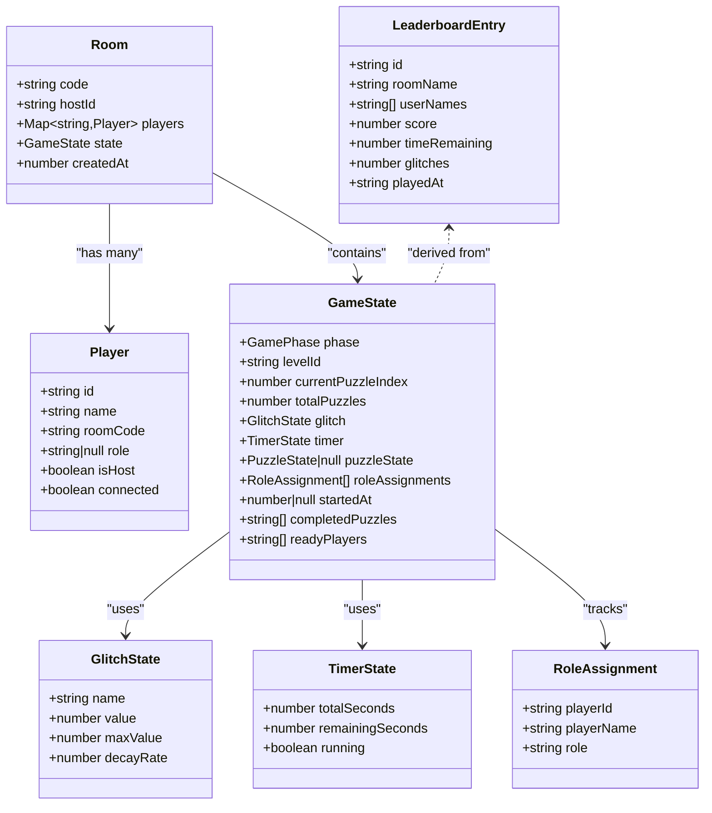

**Diagram sources**
- [types.ts](file://shared/types.ts#L7-L187)

**Section sources**
- [types.ts](file://shared/types.ts#L1-L187)

### Caching Strategy and Persistence Patterns
- Redis caching:
  - Room state is serialized to JSON and stored with a TTL to expire stale rooms automatically.
  - Keys follow a namespace convention (e.g., room:<code>) to isolate data.
  - Room listing is supported via key scanning.
  - **Enhanced Connection Reliability**: Automatic retry mechanism with exponential backoff and configurable maximum retries.
- PostgreSQL persistence:
  - Scores are written post-victory with normalized fields (roomName, userNames[], timeRemaining, glitches, score, playedAt).
  - Indexes on roomName and playedAt support efficient queries.
- In-memory authoritative store:
  - RoomManager maintains an in-memory Map of rooms and persists to Redis on every mutation.

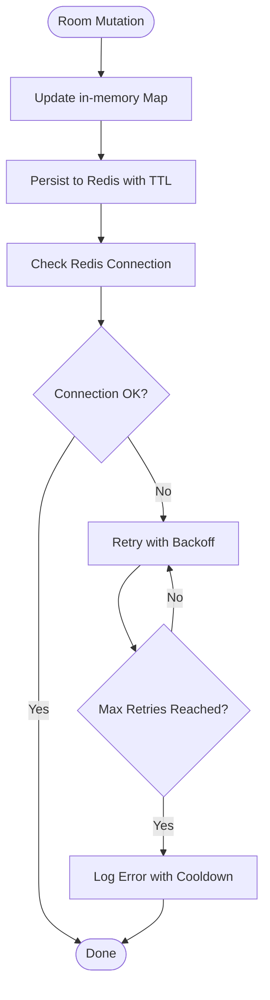

**Diagram sources**
- [room-manager.ts](file://src/server/services/room-manager.ts#L239-L245)
- [redis-service.ts](file://src/server/repositories/redis-service.ts#L8-L18)

**Section sources**
- [room-manager.ts](file://src/server/services/room-manager.ts#L1-L262)
- [redis-service.ts](file://src/server/repositories/redis-service.ts#L1-L89)
- [schema.prisma](file://prisma/schema.prisma#L1-L26)

### Data Validation and Configuration Management
- YAML-based level configuration is loaded at startup and validated:
  - Structural checks for required fields
  - Theme CSS and audio cue file existence checks
  - Hot-reload via chokidar for development
- Validation aggregates warnings and errors and logs outcomes.

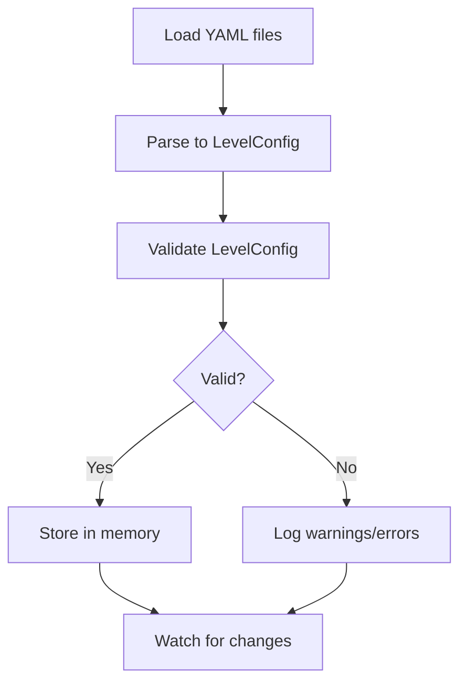

**Diagram sources**
- [config-loader.ts](file://src/server/utils/config-loader.ts#L25-L95)
- [config-validator.ts](file://src/server/utils/config-validator.ts#L19-L68)

**Section sources**
- [config-loader.ts](file://src/server/utils/config-loader.ts#L1-L135)
- [config-validator.ts](file://src/server/utils/config-validator.ts#L1-L101)

### Leaderboard Data Flow
- On game victory, the engine computes a score and persists it to PostgreSQL via PostgresService.
- Leaderboard queries are supported by PostgresService methods for top scores and room-scoped lists.

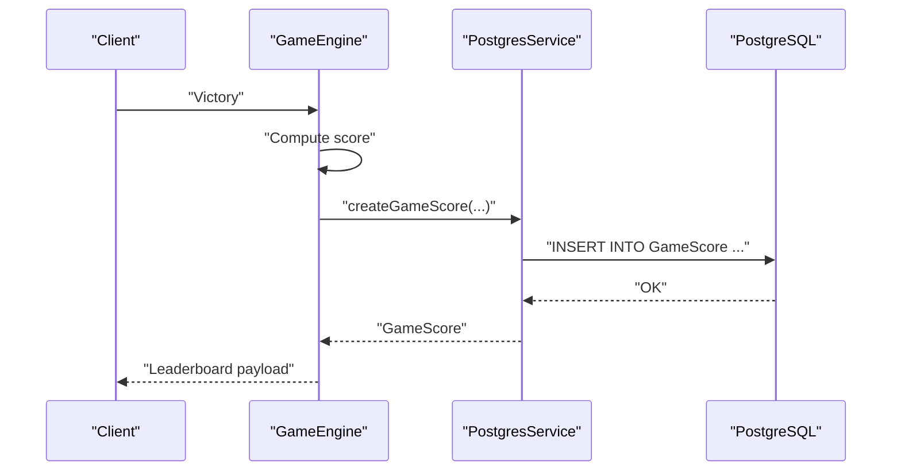

**Diagram sources**
- [game-engine.ts](file://src/server/services/game-engine.ts#L458-L483)
- [postgres-service.ts](file://src/server/repositories/postgres-service.ts#L37-L49)
- [schema.prisma](file://prisma/schema.prisma#L12-L26)

**Section sources**
- [game-engine.ts](file://src/server/services/game-engine.ts#L458-L483)
- [postgres-service.ts](file://src/server/repositories/postgres-service.ts#L1-L78)

### Prisma Client Generation and Deployment
**New Section** Comprehensive guide to Prisma client generation with Bun runtime

The Prisma client is generated with Bun runtime optimization and deployed through Docker:

- **Client Generation**: Uses `bunx prisma generate` in Dockerfile for production builds
- **Runtime Optimization**: `runtime = "bun"` in schema.prisma enables Bun-specific optimizations
- **Output Path**: `output = "../generated/prisma"` creates a cleaner project structure
- **Adapter Integration**: `@prisma/adapter-pg` provides optimized PostgreSQL connections
- **Deployment**: Entry point script waits for database readiness before starting

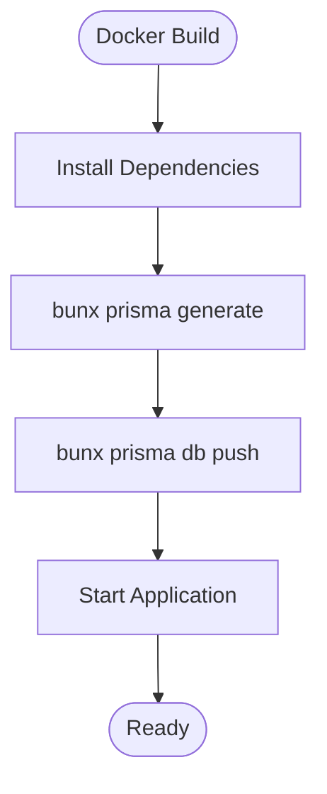

**Diagram sources**
- [Dockerfile](file://Dockerfile#L12-L16)
- [entrypoint.sh](file://entrypoint.sh#L6-L11)

**Section sources**
- [Dockerfile](file://Dockerfile#L1-L23)
- [entrypoint.sh](file://entrypoint.sh#L1-L14)
- [schema.prisma](file://prisma/schema.prisma#L1-L6)
- [package.json](file://package.json#L20-L35)

### Enhanced Redis Connection Reliability
**New Section** Advanced connection management and error handling

The Redis service now includes comprehensive connection reliability features:

- **Automatic Retry Strategy**: Configured with exponential backoff (1s, 2s, 3s, etc.) up to a maximum of 10 seconds between retries
- **Maximum Retry Limit**: Stops retrying after 10 failed attempts to prevent resource exhaustion
- **Request-Level Retries**: Limits individual requests to 3 retry attempts maximum
- **Error Cooldown Mechanism**: Prevents log spam by limiting Redis error messages to once every 30 seconds
- **Connection Lifecycle Events**: Tracks connection status with dedicated log messages for connect and error events
- **Robust Error Handling**: Implements structured error logging with cooldown periods to maintain system stability

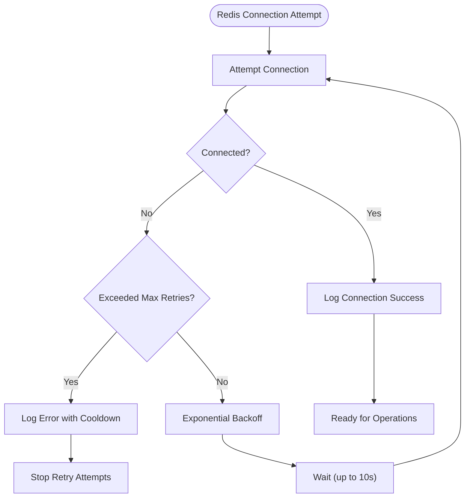

**Diagram sources**
- [redis-service.ts](file://src/server/repositories/redis-service.ts#L8-L18)
- [redis-service.ts](file://src/server/repositories/redis-service.ts#L26-L32)

**Section sources**
- [redis-service.ts](file://src/server/repositories/redis-service.ts#L1-L89)

## Dependency Analysis
- GameEngine depends on RoomManager for room state and PostgresService for score persistence.
- RoomManager depends on RedisService for persistence and shared types for Room/Player definitions.
- ConfigLoader and ConfigValidator provide runtime configuration with hot-reload and validation.
- Shared types and events define contracts used across server and client.

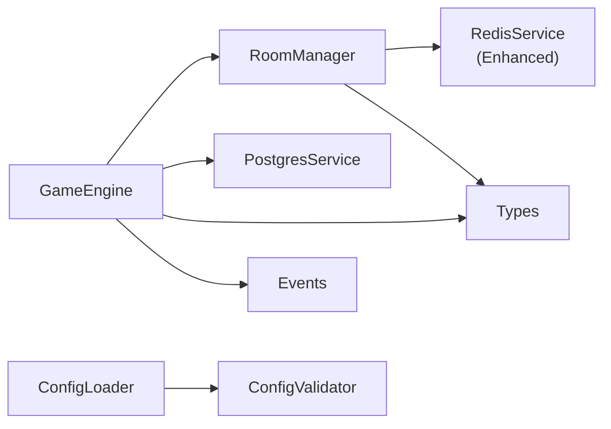

**Diagram sources**
- [game-engine.ts](file://src/server/services/game-engine.ts#L1-L711)
- [room-manager.ts](file://src/server/services/room-manager.ts#L1-L262)
- [postgres-service.ts](file://src/server/repositories/postgres-service.ts#L1-L78)
- [redis-service.ts](file://src/server/repositories/redis-service.ts#L1-L89)
- [types.ts](file://shared/types.ts#L1-L187)
- [events.ts](file://shared/events.ts#L1-L228)
- [config-loader.ts](file://src/server/utils/config-loader.ts#L1-L135)
- [config-validator.ts](file://src/server/utils/config-validator.ts#L1-L101)

**Section sources**
- [ARCHITECTURE.md](file://ARCHITECTURE.md#L1-L202)

## Performance Considerations
- Redis TTL: Rooms and scores are set with TTL to prevent unbounded growth and reduce cleanup overhead.
- Indexes: PostgreSQL indexes on roomName and playedAt optimize leaderboard queries.
- In-memory authoritative store: Reduces latency for frequent reads/writes within a single server instance.
- Hot-reload: Development benefits from fast iteration with chokidar-based file watching.
- Logging: Structured logging helps diagnose performance bottlenecks and errors.
- **Bun Runtime**: Prisma client runs natively in Bun for improved performance and reduced memory usage.
- **Lazy Initialization**: PostgreSQL connection is lazily created to optimize startup time.
- **Enhanced Redis Reliability**: Automatic retry mechanisms prevent temporary connection issues from causing system failures.
- **Error Cooldown**: Prevents excessive logging overhead during Redis outages while maintaining visibility.

## Troubleshooting Guide
Common operational issues and remedies:
- Redis connectivity errors: Verify REDIS_URL and network reachability; check Redis service logs. Monitor retry attempts and error cooldown periods.
- PostgreSQL connection failures: Confirm DATABASE_URL and credentials; ensure the database is healthy.
- Room restoration failures: If Redis is down, rooms may not restore; ensure Redis availability and retry logic is functioning properly.
- Score persistence errors: Inspect PostgresService error handling and Prisma client logs.
- Configuration validation failures: Review validator warnings/errors and fix missing files or invalid structure.
- **Prisma Client Issues**: Ensure Bun runtime compatibility and verify generated client path exists.
- **Docker Deployment**: Check that `bunx prisma generate` completes successfully in container build.
- **Redis Connection Stability**: Monitor retry strategy logs and ensure exponential backoff is working correctly.
- **Error Spam Prevention**: Verify error cooldown mechanism is preventing excessive log messages during Redis outages.

**Section sources**
- [redis-service.ts](file://src/server/repositories/redis-service.ts#L8-L18)
- [redis-service.ts](file://src/server/repositories/redis-service.ts#L26-L32)
- [docker-compose.yml](file://docker-compose.yml#L1-L45)
- [logger.ts](file://src/server/utils/logger.ts#L1-L88)
- [Dockerfile](file://Dockerfile#L12-L16)

## Conclusion
The data management architecture leverages PostgreSQL for durable, analyzable leaderboards with modern Bun runtime optimization and Redis for scalable, low-latency room/session state. The repository pattern cleanly abstracts database operations with simplified Prisma adapter integration, while shared types and events maintain strong contracts across the system. **Enhanced Redis connection reliability** provides robust error handling with automatic retry strategies and cooldown mechanisms, ensuring system stability during temporary network issues. Robust configuration loading and validation ensure reliable deployments, and structured logging supports ongoing operations. The Bun runtime integration provides enhanced performance characteristics for production deployments.

## Appendices

### Backup and Recovery Procedures
- PostgreSQL backups: Use logical backups (e.g., pg_dump) for GameScore data; schedule periodic snapshots and retain recent recovery points.
- Redis backups: Use RDB snapshots or AOF persistence; consider backing up Redis data directory for crash recovery.
- Restore steps:
  - Restore PostgreSQL snapshot and replay WAL if applicable.
  - Restore Redis snapshot and restart Redis to repopulate ephemeral state.
  - Restart the application; RoomManager will reload rooms from Redis on startup.

### Horizontal Scaling Considerations
- Redis as a shared state store: Use a managed Redis cluster or Redis Sentinel for high availability and failover.
- Sticky sessions vs. stateless: Since room state is persisted in Redis, the server can scale horizontally without sticky sessions.
- Redis adapters: Consider using Redis cluster clients and consistent hashing to distribute keys across shards.
- Monitoring: Track Redis memory usage, eviction policies, and latency; monitor PostgreSQL replication lag if using replicas.
- **Bun Runtime**: Applications can be scaled horizontally with Bun runtime support for consistent performance across instances.
- **Connection Resilience**: Enhanced Redis connection reliability ensures stable operation across multiple server instances.

### Redis Connection Reliability Configuration
**New Section** Technical details of enhanced connection reliability

The Redis service implements the following reliability features:

- **Retry Strategy**: Exponential backoff with maximum 10-second delay between retry attempts
- **Maximum Retries**: Stops retrying after 10 failed connection attempts
- **Request-Level Limits**: Individual requests limited to 3 retry attempts maximum
- **Error Cooldown**: Error messages limited to once every 30 seconds to prevent log spam
- **Connection Events**: Dedicated logging for connection establishment and error conditions
- **Graceful Degradation**: System continues operating with reduced Redis functionality during connection issues

**Section sources**
- [redis-service.ts](file://src/server/repositories/redis-service.ts#L8-L18)
- [redis-service.ts](file://src/server/repositories/redis-service.ts#L22-L32)