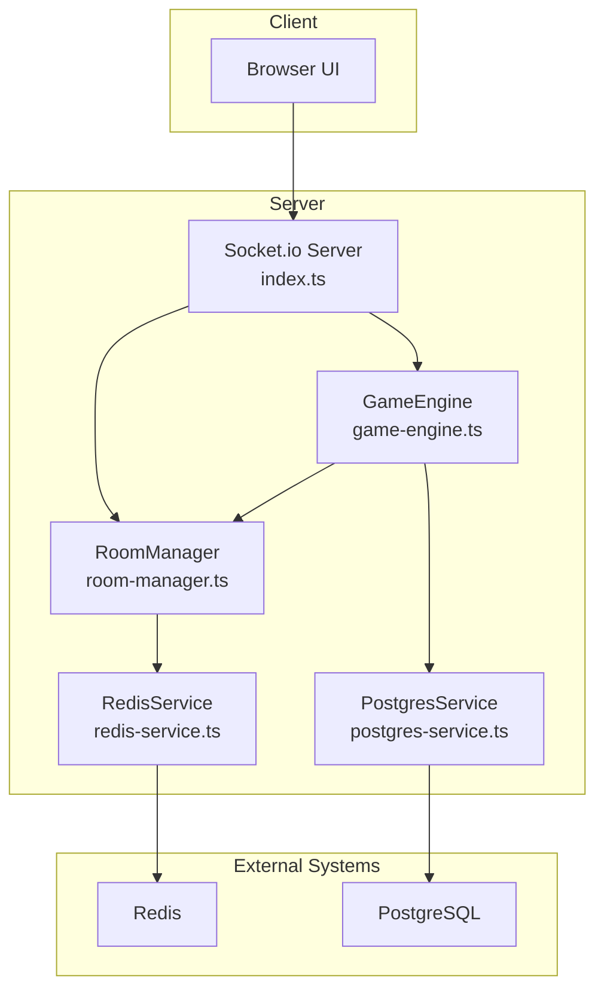
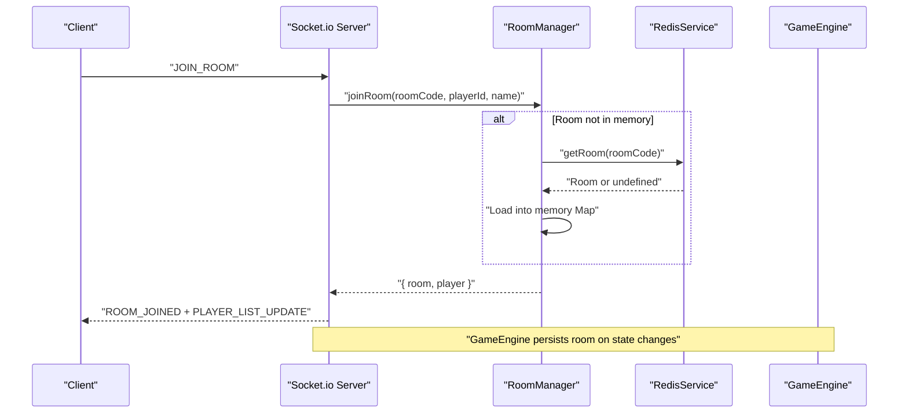
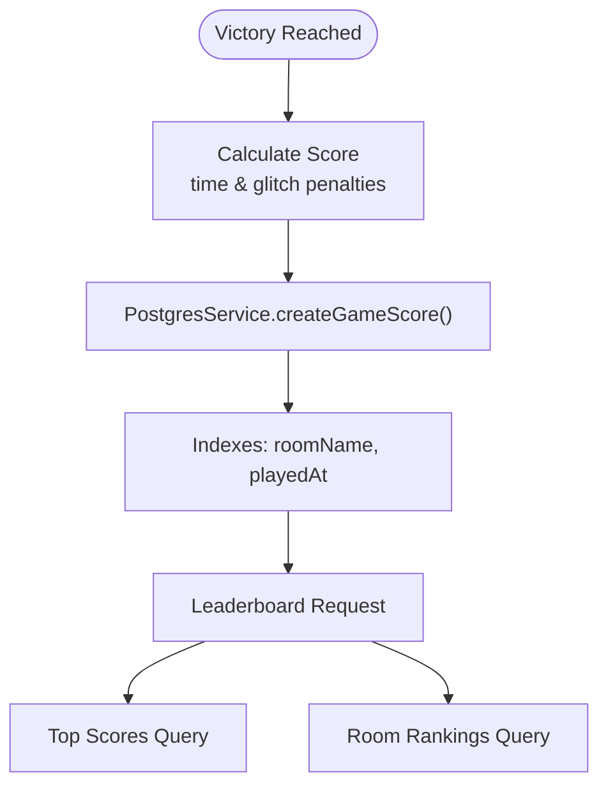
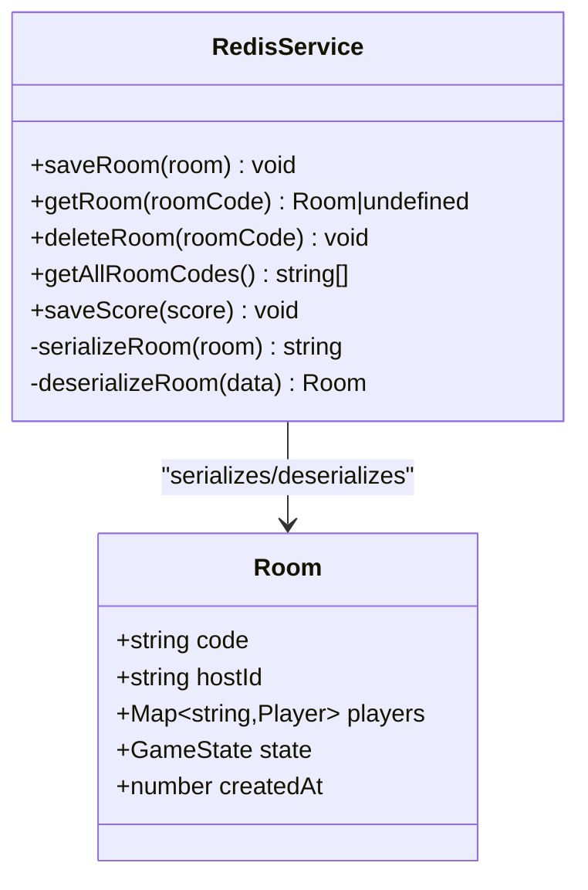
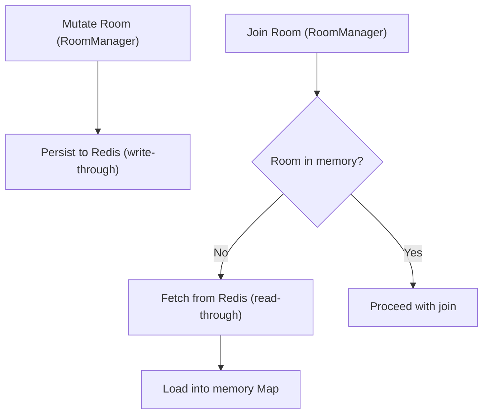
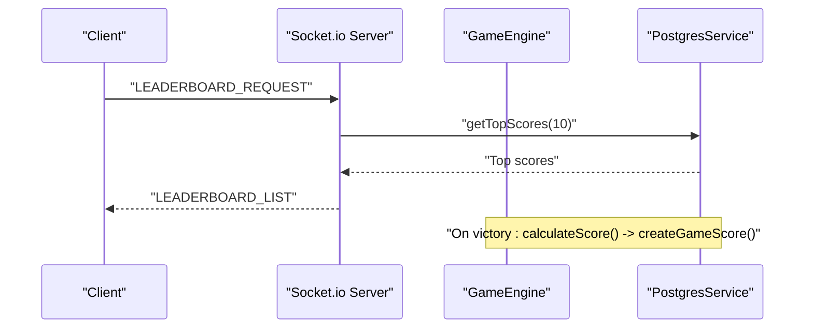
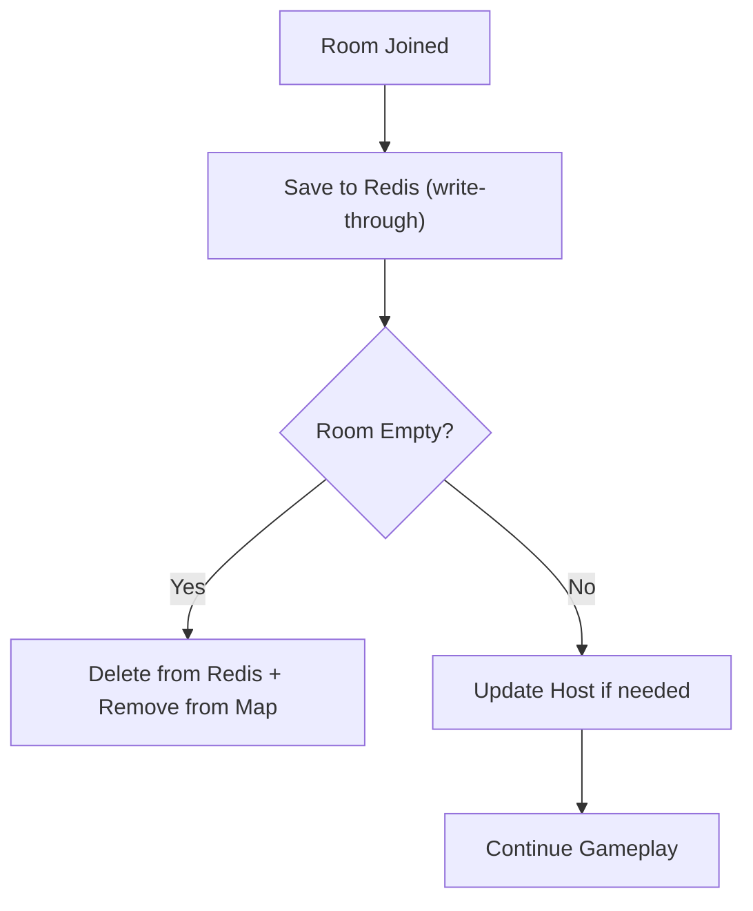
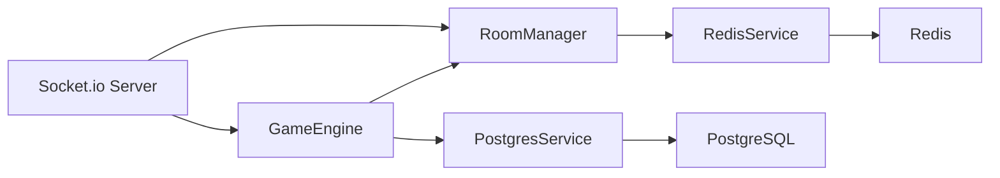
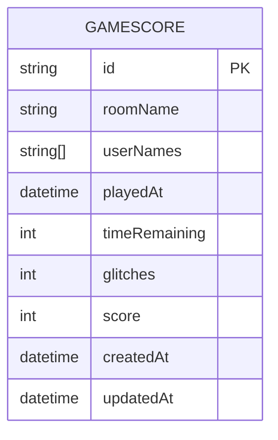

# Data Persistence & Caching

<cite>
**Referenced Files in This Document**
- [postgres-service.ts](file://src/server/repositories/postgres-service.ts)
- [redis-service.ts](file://src/server/repositories/redis-service.ts)
- [room-manager.ts](file://src/server/services/room-manager.ts)
- [game-engine.ts](file://src/server/services/game-engine.ts)
- [index.ts](file://src/server/index.ts)
- [schema.prisma](file://prisma/schema.prisma)
- [types.ts](file://shared/types.ts)
- [events.ts](file://shared/events.ts)
- [docker-compose.yml](file://docker-compose.yml)
- [ARCHITECTURE.md](file://ARCHITECTURE.md)
</cite>

## Table of Contents
1. [Introduction](#introduction)
2. [Project Structure](#project-structure)
3. [Core Components](#core-components)
4. [Architecture Overview](#architecture-overview)
5. [Detailed Component Analysis](#detailed-component-analysis)
6. [Dependency Analysis](#dependency-analysis)
7. [Performance Considerations](#performance-considerations)
8. [Troubleshooting Guide](#troubleshooting-guide)
9. [Conclusion](#conclusion)
10. [Appendices](#appendices)

## Introduction
This document explains how the application persists and caches data across the stack. It covers:
- PostgreSQL persistence for game scores and leaderboards
- Redis caching for real-time room state and player session management
- Write-through and read-through caching patterns
- Data consistency, eventual consistency handling, and conflict resolution
- Leaderboard workflow, score calculation, ranking updates, and historical data management
- Performance benchmarks, cache invalidation strategies, memory management, lifecycle management, and storage optimization

## Project Structure
The persistence and caching architecture spans three layers:
- In-memory authoritative state for rooms
- Redis for durable, serialized room snapshots and multi-instance synchronization
- PostgreSQL via Prisma for immutable historical scores and leaderboards

**Diagram sources**
- [index.ts](file://src/server/index.ts#L1-L321)
- [room-manager.ts](file://src/server/services/room-manager.ts#L1-L262)
- [game-engine.ts](file://src/server/services/game-engine.ts#L1-L711)
- [postgres-service.ts](file://src/server/repositories/postgres-service.ts#L1-L68)
- [redis-service.ts](file://src/server/repositories/redis-service.ts#L1-L68)
- [docker-compose.yml](file://docker-compose.yml#L1-L45)

**Section sources**
- [ARCHITECTURE.md](file://ARCHITECTURE.md#L190-L194)

## Core Components
- RoomManager: In-memory authoritative store for rooms with Redis-backed persistence and restoration.
- RedisService: Serializes Room instances to JSON with Map-to-object conversion and TTL-based eviction.
- GameEngine: Orchestrates game phases, persists room snapshots on state transitions, calculates final score, and records it to PostgreSQL.
- PostgresService: CRUD for GameScore records with top-N queries and room-scoped rankings.
- Socket.io + Redis Adapter: Enables multi-instance server scaling and real-time broadcast synchronization.

**Section sources**
- [room-manager.ts](file://src/server/services/room-manager.ts#L1-L262)
- [redis-service.ts](file://src/server/repositories/redis-service.ts#L1-L68)
- [game-engine.ts](file://src/server/services/game-engine.ts#L1-L711)
- [postgres-service.ts](file://src/server/repositories/postgres-service.ts#L1-L68)
- [index.ts](file://src/server/index.ts#L47-L61)

## Architecture Overview
The system uses a hybrid pattern:
- Write-through caching: Room mutations are persisted to Redis immediately after in-memory updates.
- Read-through caching: On join, missing rooms are restored from Redis into memory.
- Multi-instance synchronization: Redis streams ensure consistent state across nodes.

**Diagram sources**
- [index.ts](file://src/server/index.ts#L112-L146)
- [room-manager.ts](file://src/server/services/room-manager.ts#L89-L154)
- [redis-service.ts](file://src/server/repositories/redis-service.ts#L46-L50)

**Section sources**
- [room-manager.ts](file://src/server/services/room-manager.ts#L89-L154)
- [redis-service.ts](file://src/server/repositories/redis-service.ts#L17-L37)
- [index.ts](file://src/server/index.ts#L47-L61)

## Detailed Component Analysis

### PostgreSQL Persistence for Scores and Leaderboards
- Schema: GameScore model with indexes on roomName and playedAt for efficient queries.
- Operations:
  - Create: Final score recorded after victory with room metadata.
  - Read: Top N scores and room-scoped rankings.
  - Delete: Per-record deletion capability.

**Diagram sources**
- [game-engine.ts](file://src/server/services/game-engine.ts#L451-L483)
- [postgres-service.ts](file://src/server/repositories/postgres-service.ts#L28-L62)
- [schema.prisma](file://prisma/schema.prisma#L10-L24)
- [index.ts](file://src/server/index.ts#L275-L295)

**Section sources**
- [schema.prisma](file://prisma/schema.prisma#L10-L24)
- [postgres-service.ts](file://src/server/repositories/postgres-service.ts#L28-L62)
- [game-engine.ts](file://src/server/services/game-engine.ts#L451-L483)
- [index.ts](file://src/server/index.ts#L275-L295)

### Redis Caching for Room State and Sessions
- Serialization: Room is transformed to a serializable object before storing; Map-based players are converted to plain objects for JSON.
- Deserialization: JSON is parsed back and players Map is reconstructed.
- TTL: Rooms expire after 1 hour; ephemeral score cache entries expire after 24 hours.
- Keys: room:{code}, score:{value}.
- Multi-instance: Redis adapter broadcasts Socket.io events across nodes.

**Diagram sources**
- [redis-service.ts](file://src/server/repositories/redis-service.ts#L17-L67)
- [types.ts](file://shared/types.ts#L16-L22)

**Section sources**
- [redis-service.ts](file://src/server/repositories/redis-service.ts#L17-L67)
- [types.ts](file://shared/types.ts#L16-L22)
- [index.ts](file://src/server/index.ts#L47-L61)

### Write-Through and Read-Through Patterns
- Write-through: Every mutating operation in RoomManager persists to Redis immediately after updating the in-memory Map.
- Read-through: On join, if the room is not in memory, it is fetched from Redis and loaded into memory.
- Leaderboard reads: Leaderboard requests fetch top scores from PostgreSQL and return normalized payloads.

**Diagram sources**
- [room-manager.ts](file://src/server/services/room-manager.ts#L89-L154)
- [redis-service.ts](file://src/server/repositories/redis-service.ts#L40-L50)

**Section sources**
- [room-manager.ts](file://src/server/services/room-manager.ts#L89-L154)
- [redis-service.ts](file://src/server/repositories/redis-service.ts#L40-L50)

### Data Consistency, Eventual Consistency, and Conflict Resolution
- Authoritative in-memory state: RoomManager’s Map is the single source of truth for current room state.
- Redis durability: Ensures state survives restarts and supports multi-instance deployments.
- Real-time consistency: Socket.io + Redis adapter ensures broadcast consistency across nodes.
- Eventual consistency: Clients receive updates via events; transient inconsistencies are resolved by subsequent state broadcasts.
- Conflict resolution: Last-write-wins semantics on room mutations; no cross-player concurrent writes are modeled, so conflicts are avoided by design.

**Section sources**
- [room-manager.ts](file://src/server/services/room-manager.ts#L18-L19)
- [index.ts](file://src/server/index.ts#L47-L61)
- [events.ts](file://shared/events.ts#L26-L90)

### Leaderboard Workflow: Score Calculation, Ranking, Historical Data
- Score calculation: Based on elapsed time and final glitch value with bounded penalties.
- Recording: After victory, GameEngine constructs a DTO and calls PostgresService to persist.
- Retrieval: Leaderboard request handler queries top scores and returns normalized entries.
- Historical data: Scores include timestamps and player lists for auditability.

**Diagram sources**
- [game-engine.ts](file://src/server/services/game-engine.ts#L451-L483)
- [index.ts](file://src/server/index.ts#L275-L295)
- [postgres-service.ts](file://src/server/repositories/postgres-service.ts#L44-L62)

**Section sources**
- [game-engine.ts](file://src/server/services/game-engine.ts#L451-L483)
- [index.ts](file://src/server/index.ts#L275-L295)
- [postgres-service.ts](file://src/server/repositories/postgres-service.ts#L44-L62)

### Memory Management and Lifecycle
- In-memory rooms: Stored in a Map keyed by room code; cleared on room destruction.
- Player presence: Tracks connected/disconnected state per player; empty rooms are removed and deleted from Redis.
- Timers: Server maintains per-room timers; on restart, timers are resumed from persisted room state.

**Diagram sources**
- [room-manager.ts](file://src/server/services/room-manager.ts#L156-L189)
- [redis-service.ts](file://src/server/repositories/redis-service.ts#L52-L55)

**Section sources**
- [room-manager.ts](file://src/server/services/room-manager.ts#L156-L189)
- [redis-service.ts](file://src/server/repositories/redis-service.ts#L52-L55)

## Dependency Analysis
- RoomManager depends on RedisService for persistence and restoration.
- GameEngine depends on RoomManager for room access and PostgresService for score persistence.
- Socket.io server integrates Redis adapter for multi-instance support.
- PostgreSQL schema defines indexes used by leaderboard queries.

**Diagram sources**
- [game-engine.ts](file://src/server/services/game-engine.ts#L41-L48)
- [room-manager.ts](file://src/server/services/room-manager.ts#L14-L16)
- [postgres-service.ts](file://src/server/repositories/postgres-service.ts#L1-L22)
- [redis-service.ts](file://src/server/repositories/redis-service.ts#L1-L7)
- [index.ts](file://src/server/index.ts#L28-L44)

**Section sources**
- [game-engine.ts](file://src/server/services/game-engine.ts#L41-L48)
- [room-manager.ts](file://src/server/services/room-manager.ts#L14-L16)
- [postgres-service.ts](file://src/server/repositories/postgres-service.ts#L1-L22)
- [redis-service.ts](file://src/server/repositories/redis-service.ts#L1-L7)
- [index.ts](file://src/server/index.ts#L28-L44)

## Performance Considerations
- Redis:
  - TTL-based eviction prevents memory bloat; choose appropriate TTLs for room vs. score entries.
  - JSON serialization overhead is acceptable for small room payloads; consider binary formats if needed.
- PostgreSQL:
  - Indexes on roomName and playedAt optimize leaderboard queries.
  - Batch leaderboard requests; avoid frequent polling.
- In-memory:
  - Room Map provides O(1) lookup by code; keep player counts reasonable to avoid large serialized payloads.
- Multi-instance:
  - Redis adapter ensures low-latency pub/sub; monitor Redis memory and network latency.

[No sources needed since this section provides general guidance]

## Troubleshooting Guide
- Redis connectivity:
  - Verify REDIS_URL and that Redis is healthy in Docker Compose.
  - Check Redis logs and ensure adapter is initialized.
- PostgreSQL connectivity:
  - Confirm DATABASE_URL and Prisma client initialization.
  - Validate indexes exist and queries perform as expected.
- Room restoration:
  - If a room does not appear after restart, confirm Redis keys exist and deserialization succeeds.
- Leaderboard issues:
  - Ensure top-score queries return expected rows; verify DTO mapping on server emits.

**Section sources**
- [index.ts](file://src/server/index.ts#L76-L84)
- [redis-service.ts](file://src/server/repositories/redis-service.ts#L9-L15)
- [docker-compose.yml](file://docker-compose.yml#L37-L43)

## Conclusion
The system combines in-memory authoritative state with Redis for durability and multi-instance scalability, and PostgreSQL for immutable historical scoring. Write-through and read-through caching ensure consistent, low-latency room state, while Socket.io + Redis adapter guarantees real-time synchronization. Leaderboards leverage indexed queries for performance, and TTL-based cache invalidation keeps memory usage predictable.

[No sources needed since this section summarizes without analyzing specific files]

## Appendices

### Data Models and Indexes

**Diagram sources**
- [schema.prisma](file://prisma/schema.prisma#L10-L24)

### Environment and Deployment Notes
- Redis and PostgreSQL are provisioned via Docker Compose.
- Socket.io Redis adapter requires a Redis instance for multi-node deployments.

**Section sources**
- [docker-compose.yml](file://docker-compose.yml#L1-L45)
- [index.ts](file://src/server/index.ts#L47-L61)