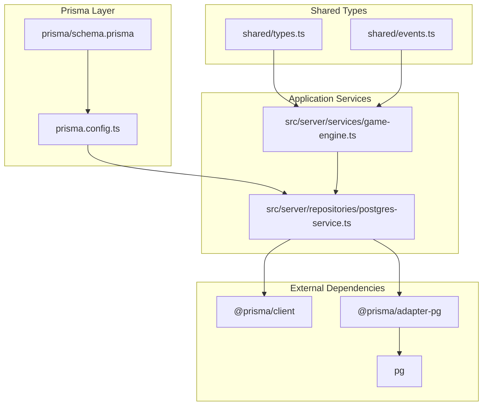
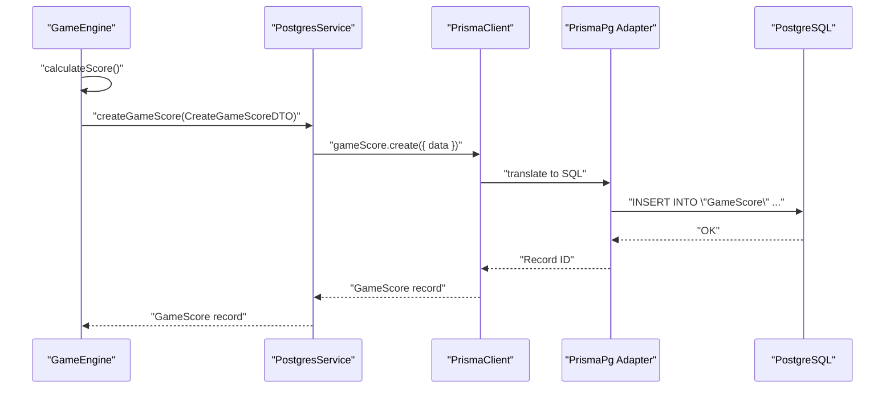
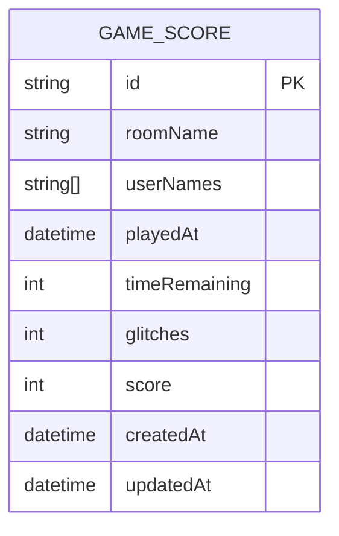
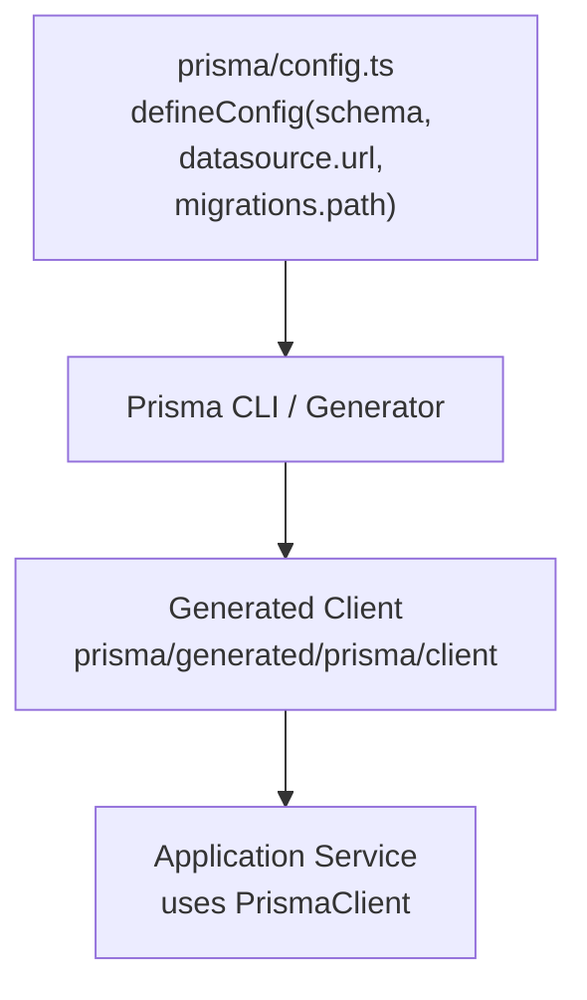
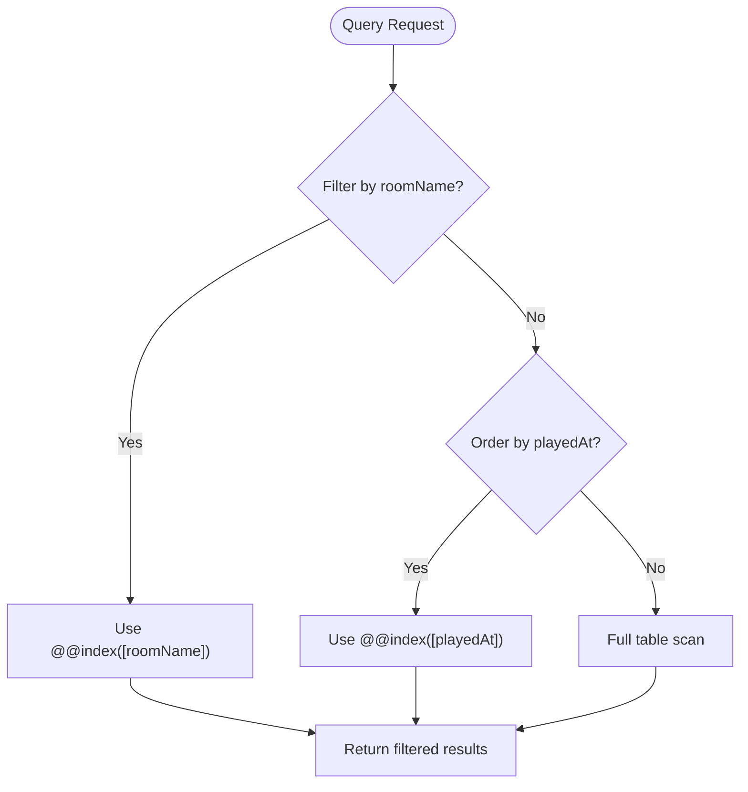
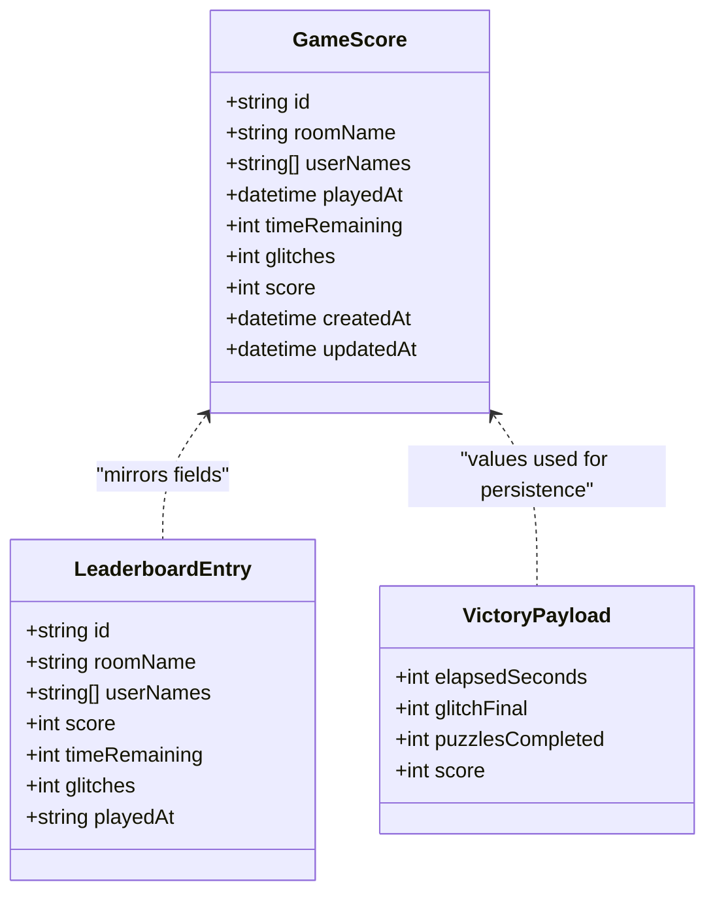
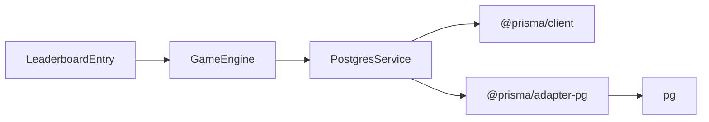

# Database Design

<cite>
**Referenced Files in This Document**
- [schema.prisma](file://prisma/schema.prisma)
- [prisma.config.ts](file://prisma.config.ts)
- [postgres-service.ts](file://src/server/repositories/postgres-service.ts)
- [types.ts](file://shared/types.ts)
- [events.ts](file://shared/events.ts)
- [package.json](file://package.json)
- [game-engine.ts](file://src/server/services/game-engine.ts)
</cite>

## Table of Contents
1. [Introduction](#introduction)
2. [Project Structure](#project-structure)
3. [Core Components](#core-components)
4. [Architecture Overview](#architecture-overview)
5. [Detailed Component Analysis](#detailed-component-analysis)
6. [Dependency Analysis](#dependency-analysis)
7. [Performance Considerations](#performance-considerations)
8. [Troubleshooting Guide](#troubleshooting-guide)
9. [Conclusion](#conclusion)

## Introduction
This document describes the database design architecture for the escape room MVP, focusing on the Prisma ORM schema, PostgreSQL provider configuration, client generation setup, indexing strategy, primary key pattern, timestamps, TypeScript interface relationships, migration and schema evolution strategy, constraints and referential integrity, and practical query examples using the generated Prisma client.

## Project Structure
The database layer is organized around Prisma schema definitions, configuration, and a thin service wrapper that integrates with PostgreSQL via the Prisma adapter for pg. The service exposes methods to create and query GameScore records, while the rest of the system calculates scores and persists them upon game completion.

**Diagram sources**
- [schema.prisma](file://prisma/schema.prisma#L1-L24)
- [prisma.config.ts](file://prisma.config.ts#L1-L14)
- [postgres-service.ts](file://src/server/repositories/postgres-service.ts#L1-L68)
- [game-engine.ts](file://src/server/services/game-engine.ts#L1-L711)
- [types.ts](file://shared/types.ts#L172-L187)
- [events.ts](file://shared/events.ts#L213-L227)
- [package.json](file://package.json#L16-L29)

**Section sources**
- [schema.prisma](file://prisma/schema.prisma#L1-L24)
- [prisma.config.ts](file://prisma.config.ts#L1-L14)
- [postgres-service.ts](file://src/server/repositories/postgres-service.ts#L1-L68)
- [game-engine.ts](file://src/server/services/game-engine.ts#L458-L483)
- [types.ts](file://shared/types.ts#L172-L187)
- [events.ts](file://shared/events.ts#L213-L227)
- [package.json](file://package.json#L16-L29)

## Core Components
- Prisma ORM schema defines the GameScore model with UUID primary key, array field for user names, timestamps, and indexes.
- PostgreSQL provider configured via Prisma config and adapter for pg.
- Generated Prisma client used by the PostgresService for database operations.
- TypeScript interfaces define the shape of leaderboard entries and payloads, aligning with database records.

Key observations:
- The GameScore model uses a UUID string as the primary key with a default generator.
- Auto-generated timestamps track creation and updates.
- Indexes are defined on roomName and playedAt to optimize common queries.
- The leaderboard entry interface mirrors the database record structure.

**Section sources**
- [schema.prisma](file://prisma/schema.prisma#L10-L24)
- [prisma.config.ts](file://prisma.config.ts#L4-L14)
- [postgres-service.ts](file://src/server/repositories/postgres-service.ts#L1-L68)
- [types.ts](file://shared/types.ts#L172-L187)

## Architecture Overview
The database architecture centers on Prisma managing schema and migrations, PostgreSQL as the datastore, and a service layer that encapsulates Prisma client usage. The game engine computes the final score and delegates persistence to the PostgresService, which translates DTOs into Prisma operations.

**Diagram sources**
- [game-engine.ts](file://src/server/services/game-engine.ts#L458-L483)
- [postgres-service.ts](file://src/server/repositories/postgres-service.ts#L28-L39)
- [schema.prisma](file://prisma/schema.prisma#L10-L24)

## Detailed Component Analysis

### Prisma ORM Schema: GameScore Model
The GameScore model defines the core database entity for storing match outcomes. It includes:
- id: String, @id, @default(uuid()) — UUID primary key
- roomName: String — room identifier
- userNames: String[] — array of player names
- playedAt: DateTime, @default(now()) — timestamp of game completion
- timeRemaining: Int — seconds remaining at completion
- glitches: Int — final glitch percentage
- score: Int — computed score
- createdAt: DateTime, @default(now()) — auto timestamp
- updatedAt: DateTime, @updatedAt — auto timestamp
- Indexes: @@index([roomName]), @@index([playedAt])

Constraints and defaults:
- UUID primary key ensures globally unique identifiers.
- playedAt defaults to current timestamp.
- createdAt defaults to current timestamp; updatedAt auto-updates on modification.
- Indexes support filtering by room and sorting by time.

**Diagram sources**
- [schema.prisma](file://prisma/schema.prisma#L10-L24)

**Section sources**
- [schema.prisma](file://prisma/schema.prisma#L10-L24)

### PostgreSQL Provider Configuration and Client Generation
- Provider: postgresql
- Client generator configured to output to prisma/generated/prisma/client
- Prisma config sets schema path, datasource URL from environment, and migrations path
- Dependencies include @prisma/client, @prisma/adapter-pg, and pg

**Diagram sources**
- [prisma.config.ts](file://prisma.config.ts#L4-L14)
- [package.json](file://package.json#L16-L29)

**Section sources**
- [prisma.config.ts](file://prisma.config.ts#L4-L14)
- [package.json](file://package.json#L16-L29)

### Database Indexing Strategy
Indexes defined:
- roomName: supports efficient retrieval of scores by room
- playedAt: supports chronological queries and leaderboards

These indexes align with typical access patterns observed in the service layer:
- Fetch all scores ordered by playedAt
- Filter scores by roomName
- Retrieve top scores by score value

**Diagram sources**
- [schema.prisma](file://prisma/schema.prisma#L22-L23)
- [postgres-service.ts](file://src/server/repositories/postgres-service.ts#L44-L62)

**Section sources**
- [schema.prisma](file://prisma/schema.prisma#L22-L23)
- [postgres-service.ts](file://src/server/repositories/postgres-service.ts#L44-L62)

### UUID Primary Key Pattern and Auto-Generated Timestamps
- id: String, @id, @default(uuid()) — ensures unique identifiers without exposing sequential patterns
- createdAt: DateTime, @default(now()) — captures insertion time
- updatedAt: DateTime, @updatedAt — automatically updated on record modifications

These patterns improve security and simplify audit trails.

**Section sources**
- [schema.prisma](file://prisma/schema.prisma#L11-L20)

### Relationship Between Database Models and TypeScript Interfaces
Leaderboard entry interface mirrors the GameScore record:
- LeaderboardEntry corresponds to stored fields: id, roomName, userNames, score, timeRemaining, glitches, playedAt
- VictoryPayload carries computed values used to construct the record

This alignment ensures type-safe persistence and consumption of leaderboard data.

**Diagram sources**
- [schema.prisma](file://prisma/schema.prisma#L10-L24)
- [types.ts](file://shared/types.ts#L172-L187)
- [events.ts](file://shared/events.ts#L213-L218)

**Section sources**
- [types.ts](file://shared/types.ts#L172-L187)
- [events.ts](file://shared/events.ts#L213-L218)
- [schema.prisma](file://prisma/schema.prisma#L10-L24)

### Migration Strategy, Schema Evolution, and Versioning
- Prisma manages schema evolution through migrations stored under prisma/migrations
- The Prisma config specifies the migrations path, enabling automated migration generation and deployment
- The repository does not currently include migration files; they would be generated by Prisma CLI commands (outside the current snapshot)

Operational guidance:
- Run Prisma CLI to generate and apply migrations when schema changes occur
- Keep DATABASE_URL in environment for migration targeting
- Review migration SQL before applying to production

**Section sources**
- [prisma.config.ts](file://prisma.config.ts#L11-L14)

### Data Validation Rules, Constraints, and Referential Integrity
Observed constraints from the schema:
- roomName is a non-nullable string
- userNames is a non-empty array of strings
- timeRemaining, glitches, and score are integers
- playedAt defaults to current timestamp
- createdAt defaults to current timestamp; updatedAt auto-updated

Referential integrity:
- No foreign keys are defined in the schema; therefore, referential integrity is not enforced at the database level for GameScore
- Application-level logic should ensure data consistency (e.g., roomName validity)

**Section sources**
- [schema.prisma](file://prisma/schema.prisma#L10-L24)

### Examples of Database Queries and Operations Using the Generated Prisma Client
The PostgresService demonstrates typical Prisma operations for GameScore:

- Create a new score record
  - Path: [createGameScore](file://src/server/repositories/postgres-service.ts#L28-L39)
- Retrieve all scores ordered by playedAt descending
  - Path: [getAllScores](file://src/server/repositories/postgres-service.ts#L44-L48)
- Retrieve scores for a specific room ordered by score descending
  - Path: [getScoresByRoom](file://src/server/repositories/postgres-service.ts#L50-L55)
- Retrieve top N scores ordered by score descending
  - Path: [getTopScores](file://src/server/repositories/postgres-service.ts#L57-L62)
- Delete a score by id
  - Path: [deleteScore](file://src/server/repositories/postgres-service.ts#L65-L67)

Integration flow:
- The game engine computes the final score and calls PostgresService.createGameScore
  - Path: [storeScore](file://src/server/services/game-engine.ts#L458-L483)

**Section sources**
- [postgres-service.ts](file://src/server/repositories/postgres-service.ts#L28-L67)
- [game-engine.ts](file://src/server/services/game-engine.ts#L458-L483)

## Dependency Analysis
The database layer depends on Prisma for schema and client generation, and on PostgreSQL via the adapter and pg driver. The service layer encapsulates Prisma usage and exposes domain-focused methods.

**Diagram sources**
- [postgres-service.ts](file://src/server/repositories/postgres-service.ts#L1-L22)
- [package.json](file://package.json#L16-L29)
- [game-engine.ts](file://src/server/services/game-engine.ts#L458-L483)
- [types.ts](file://shared/types.ts#L172-L187)

**Section sources**
- [postgres-service.ts](file://src/server/repositories/postgres-service.ts#L1-L22)
- [package.json](file://package.json#L16-L29)
- [game-engine.ts](file://src/server/services/game-engine.ts#L458-L483)
- [types.ts](file://shared/types.ts#L172-L187)

## Performance Considerations
- Indexes on roomName and playedAt enable efficient filtering and sorting for leaderboard queries.
- Using UUID primary keys avoids hotspots in clustered indexes compared to sequential integers.
- Auto timestamps reduce application-level overhead for audit fields.
- Consider partitioning or materialized views for very large datasets if leaderboard queries become a bottleneck.

## Troubleshooting Guide
Common issues and resolutions:
- Missing migrations directory: Ensure Prisma migrations path is configured and run Prisma CLI to generate migrations.
  - Reference: [prisma.config.ts](file://prisma.config.ts#L11-L14)
- Connection failures: Verify DATABASE_URL environment variable and network connectivity to PostgreSQL.
  - Reference: [postgres-service.ts](file://src/server/repositories/postgres-service.ts#L14-L16)
- Type mismatches: Align DTOs and interfaces with schema fields to prevent runtime errors.
  - References: [types.ts](file://shared/types.ts#L172-L187), [events.ts](file://shared/events.ts#L213-L218)
- Missing indexes: Add indexes for frequently queried columns if performance degrades.
  - Reference: [schema.prisma](file://prisma/schema.prisma#L22-L23)

**Section sources**
- [prisma.config.ts](file://prisma.config.ts#L11-L14)
- [postgres-service.ts](file://src/server/repositories/postgres-service.ts#L14-L16)
- [types.ts](file://shared/types.ts#L172-L187)
- [events.ts](file://shared/events.ts#L213-L218)
- [schema.prisma](file://prisma/schema.prisma#L22-L23)

## Conclusion
The database design leverages Prisma for robust schema management and client generation, PostgreSQL for reliable persistence, and a service layer that encapsulates database operations. The GameScore model employs UUID primary keys, auto timestamps, and targeted indexes to support common leaderboard queries. While referential integrity is not enforced at the database level, TypeScript interfaces and service methods provide strong typing and operational safety. The Prisma migration configuration enables controlled schema evolution, and the generated client simplifies database interactions across the application.