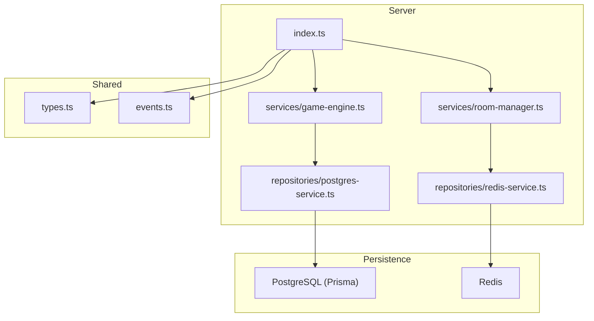
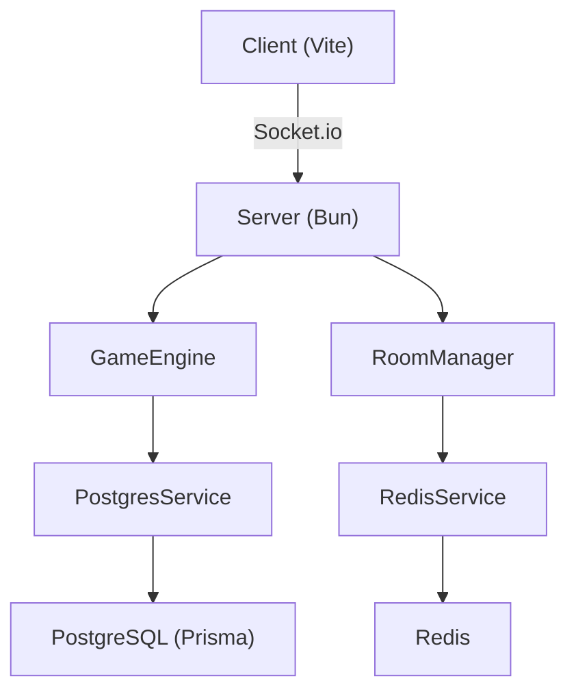
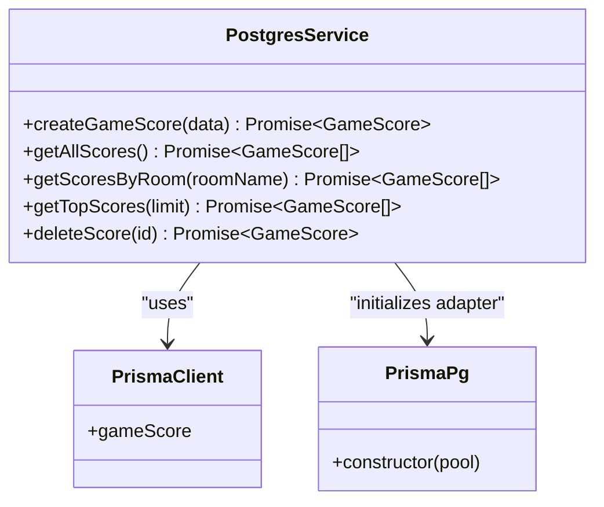
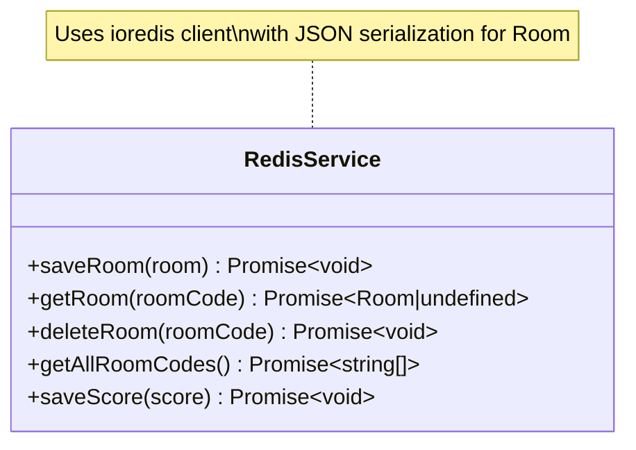
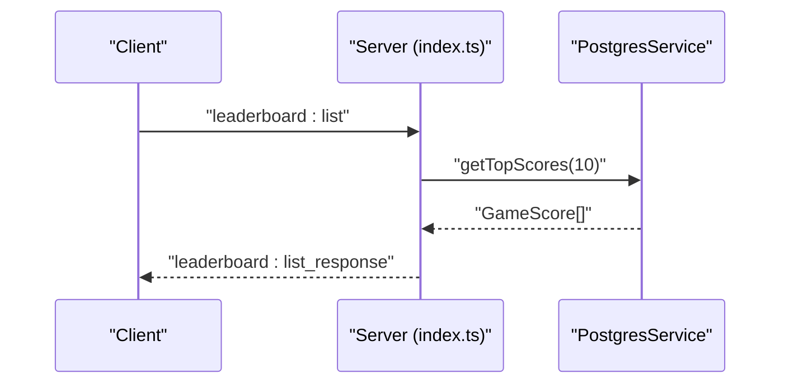
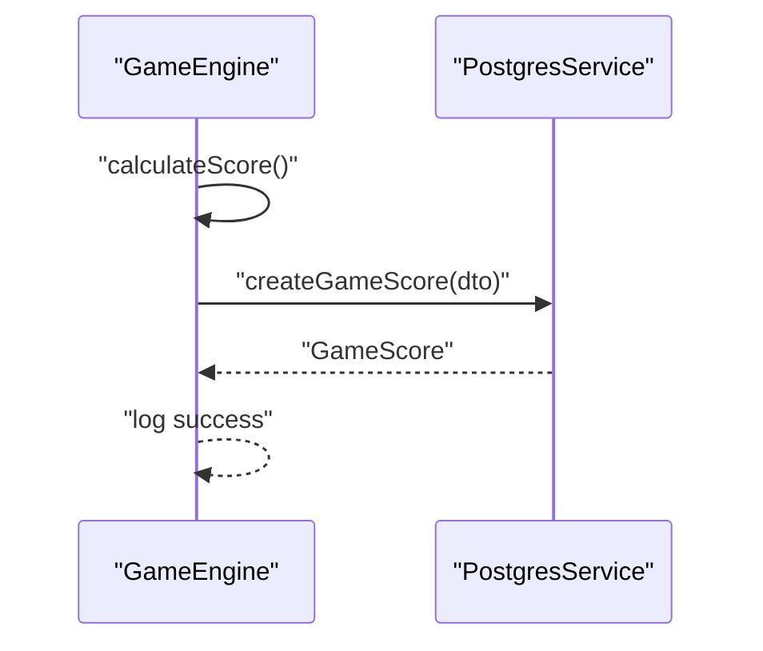
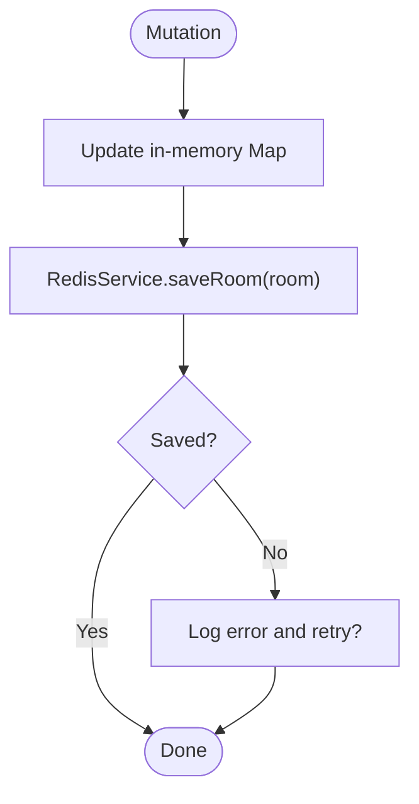
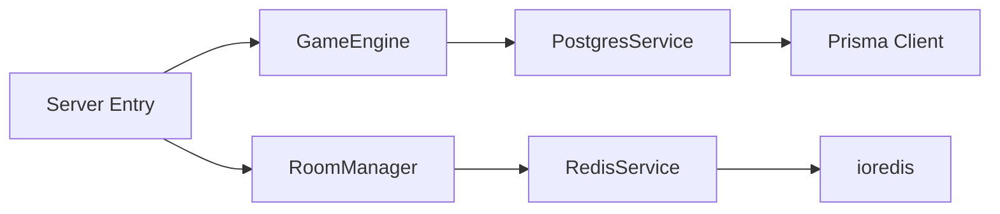

# Repository Pattern Implementation

<cite>
**Referenced Files in This Document**
- [postgres-service.ts](file://src/server/repositories/postgres-service.ts)
- [redis-service.ts](file://src/server/repositories/redis-service.ts)
- [game-engine.ts](file://src/server/services/game-engine.ts)
- [room-manager.ts](file://src/server/services/room-manager.ts)
- [index.ts](file://src/server/index.ts)
- [schema.prisma](file://prisma/schema.prisma)
- [prisma.config.ts](file://prisma.config.ts)
- [types.ts](file://shared/types.ts)
- [events.ts](file://shared/events.ts)
- [ARCHITECTURE.md](file://ARCHITECTURE.md)
- [game-engine.test.ts](file://src/server/services/game-engine.test.ts)
- [room-manager.test.ts](file://src/server/services/room-manager.test.ts)
</cite>

## Table of Contents
1. [Introduction](#introduction)
2. [Project Structure](#project-structure)
3. [Core Components](#core-components)
4. [Architecture Overview](#architecture-overview)
5. [Detailed Component Analysis](#detailed-component-analysis)
6. [Dependency Analysis](#dependency-analysis)
7. [Performance Considerations](#performance-considerations)
8. [Troubleshooting Guide](#troubleshooting-guide)
9. [Conclusion](#conclusion)
10. [Appendices](#appendices)

## Introduction
This document explains the repository pattern implementation used for database and session state abstraction in the escape room MVP. It covers:
- PostgreSQL service for leaderboard operations (score persistence, retrieval, and ranking)
- Redis service for session state management and real-time data synchronization
- Interface contracts and method signatures for both repositories
- Error handling, connection pooling, and transaction management
- Separation of concerns between data access logic and business logic
- Examples of repository usage in the game engine and room manager services
- Performance optimization techniques, caching strategies, and connection management
- Testing approach for repository implementations and mocking strategies

## Project Structure
The repository pattern is implemented in dedicated service modules under src/server/repositories, with usage spread across services and the server entry point.

**Diagram sources**
- [index.ts](file://src/server/index.ts#L1-L321)
- [game-engine.ts](file://src/server/services/game-engine.ts#L1-L711)
- [room-manager.ts](file://src/server/services/room-manager.ts#L1-L262)
- [postgres-service.ts](file://src/server/repositories/postgres-service.ts#L1-L68)
- [redis-service.ts](file://src/server/repositories/redis-service.ts#L1-L68)

**Section sources**
- [ARCHITECTURE.md](file://ARCHITECTURE.md#L1-L202)
- [index.ts](file://src/server/index.ts#L1-L321)

## Core Components
- PostgreSQL repository (leaderboard): Encapsulates Prisma client initialization with a connection pool and exposes methods for creating scores, retrieving top scores, and deleting scores.
- Redis repository (session/state): Encapsulates Redis client initialization, serialization/deserialization of room state, and provides methods for saving, loading, deleting rooms, listing room codes, and saving scores.

Key responsibilities:
- Data access encapsulation
- Connection management and lifecycle
- Serialization/deserialization for complex types
- Error logging and propagation

**Section sources**
- [postgres-service.ts](file://src/server/repositories/postgres-service.ts#L1-L68)
- [redis-service.ts](file://src/server/repositories/redis-service.ts#L1-L68)

## Architecture Overview
The system integrates Socket.io for real-time communication, with repositories abstracting persistence concerns. The game engine orchestrates gameplay and persists room state to Redis, while scores are persisted to PostgreSQL upon game completion.

**Diagram sources**
- [index.ts](file://src/server/index.ts#L1-L321)
- [game-engine.ts](file://src/server/services/game-engine.ts#L1-L711)
- [room-manager.ts](file://src/server/services/room-manager.ts#L1-L262)
- [postgres-service.ts](file://src/server/repositories/postgres-service.ts#L1-L68)
- [redis-service.ts](file://src/server/repositories/redis-service.ts#L1-L68)

## Detailed Component Analysis

### PostgreSQL Service (Leaderboard)
The PostgreSQL service initializes a Prisma client with a PostgreSQL connection pool and exposes CRUD operations for leaderboard entries.

- Initialization and connection pooling:
  - Uses a generic PostgreSQL pool configured via DATABASE_URL
  - Wraps the pool with PrismaPg adapter and instantiates PrismaClient
- Methods:
  - createGameScore(CreateGameScoreDTO): Inserts a new score record
  - getAllScores(): Retrieves all scores ordered by playedAt desc
  - getScoresByRoom(roomName): Lists scores for a room ordered by score desc
  - getTopScores(limit=10): Returns top N scores ordered by score desc
  - deleteScore(id): Removes a score by ID

**Diagram sources**
- [postgres-service.ts](file://src/server/repositories/postgres-service.ts#L1-L68)
- [schema.prisma](file://prisma/schema.prisma#L10-L24)

**Section sources**
- [postgres-service.ts](file://src/server/repositories/postgres-service.ts#L1-L68)
- [schema.prisma](file://prisma/schema.prisma#L10-L24)
- [prisma.config.ts](file://prisma.config.ts#L1-L14)

Usage examples:
- Game engine stores scores after victory by invoking createGameScore with derived metrics
- Server entry point fetches top scores for leaderboard display

**Section sources**
- [game-engine.ts](file://src/server/services/game-engine.ts#L458-L483)
- [index.ts](file://src/server/index.ts#L275-L295)

### Redis Service (Session State and Real-time)
The Redis service manages room state persistence and real-time synchronization across instances.

- Initialization and connection management:
  - Creates a Redis client from REDIS_URL with automatic error and connect logging
- Serialization and deserialization:
  - serializeRoom: Converts Room to a JSON-serializable form (Map to Object)
  - deserializeRoom: Restores Room from JSON (Object to Map)
- Methods:
  - saveRoom(room): Stores room with 1-hour TTL
  - getRoom(roomCode): Loads room by code
  - deleteRoom(roomCode): Removes room
  - getAllRoomCodes(): Lists all room keys
  - saveScore(score): Stores score with 24-hour TTL

**Diagram sources**
- [redis-service.ts](file://src/server/repositories/redis-service.ts#L1-L68)

**Section sources**
- [redis-service.ts](file://src/server/repositories/redis-service.ts#L1-L68)

Usage examples:
- RoomManager persists room mutations to Redis after every change
- Server uses Redis adapter for multi-instance Socket.io synchronization

**Section sources**
- [room-manager.ts](file://src/server/services/room-manager.ts#L1-L262)
- [index.ts](file://src/server/index.ts#L47-L61)

### Interface Contracts and Method Signatures
- PostgresService:
  - createGameScore(data: CreateGameScoreDTO): Promise<GameScore>
  - getAllScores(): Promise<GameScore[]>
  - getScoresByRoom(roomName: string): Promise<GameScore[]>
  - getTopScores(limit?: number): Promise<GameScore[]>
  - deleteScore(id: string): Promise<GameScore>
- RedisService:
  - saveRoom(room: Room): Promise<void>
  - getRoom(roomCode: string): Promise<Room | undefined>
  - deleteRoom(roomCode: string): Promise<void>
  - getAllRoomCodes(): Promise<string[]>
  - saveScore(score: number): Promise<void>

**Section sources**
- [postgres-service.ts](file://src/server/repositories/postgres-service.ts#L24-L68)
- [redis-service.ts](file://src/server/repositories/redis-service.ts#L39-L67)

### Error Handling, Connection Pooling, and Transactions
- Error handling:
  - Redis client emits "error" and "connect" events; errors are logged
  - Game engine and room manager wrap operations in try/catch and log failures
  - Server entry point wraps critical operations (e.g., leaderboard fetch) in try/catch
- Connection pooling:
  - PostgreSQL: PrismaPg adapter wraps a generic pg Pool initialized from DATABASE_URL
  - Redis: ioredis client instantiated once; Socket.io adapter uses pub/sub clients
- Transactions:
  - No explicit transaction blocks observed in repository code; Prisma operations appear non-atomic across multiple calls

**Section sources**
- [redis-service.ts](file://src/server/repositories/redis-service.ts#L9-L15)
- [game-engine.ts](file://src/server/services/game-engine.ts#L58-L139)
- [room-manager.ts](file://src/server/services/room-manager.ts#L80-L86)
- [index.ts](file://src/server/index.ts#L76-L84)

### Separation of Concerns
- Data access (repositories) handles persistence logic independently
- Business logic (game engine, room manager) orchestrates state transitions and delegates persistence to repositories
- Shared types and events define contracts between layers

**Section sources**
- [game-engine.ts](file://src/server/services/game-engine.ts#L48-L483)
- [room-manager.ts](file://src/server/services/room-manager.ts#L60-L87)
- [types.ts](file://shared/types.ts#L1-L187)
- [events.ts](file://shared/events.ts#L1-L228)

### Examples of Repository Usage
- Game engine:
  - Calculates final score and calls createGameScore to persist results
  - Persists room state to Redis via RoomManager after major state changes
- Server entry point:
  - Fetches top scores from PostgresService for leaderboard requests
  - Initializes Redis adapter for multi-instance Socket.io support

**Section sources**
- [game-engine.ts](file://src/server/services/game-engine.ts#L458-L521)
- [room-manager.ts](file://src/server/services/room-manager.ts#L239-L245)
- [index.ts](file://src/server/index.ts#L275-L295)

### Sequence: Leaderboard Retrieval Flow

**Diagram sources**
- [index.ts](file://src/server/index.ts#L275-L295)
- [postgres-service.ts](file://src/server/repositories/postgres-service.ts#L57-L62)

### Sequence: Score Persistence on Victory

**Diagram sources**
- [game-engine.ts](file://src/server/services/game-engine.ts#L458-L483)
- [postgres-service.ts](file://src/server/repositories/postgres-service.ts#L28-L39)

### Flowchart: Room Save/Persist Flow

**Diagram sources**
- [room-manager.ts](file://src/server/services/room-manager.ts#L239-L245)
- [redis-service.ts](file://src/server/repositories/redis-service.ts#L40-L44)

## Dependency Analysis
Repositories depend on external systems and are consumed by services and the server entry point.

**Diagram sources**
- [game-engine.ts](file://src/server/services/game-engine.ts#L46-L48)
- [room-manager.ts](file://src/server/services/room-manager.ts#L15-L15)
- [index.ts](file://src/server/index.ts#L28-L44)
- [postgres-service.ts](file://src/server/repositories/postgres-service.ts#L1-L3)
- [redis-service.ts](file://src/server/repositories/redis-service.ts#L1-L2)

**Section sources**
- [index.ts](file://src/server/index.ts#L1-L321)
- [game-engine.ts](file://src/server/services/game-engine.ts#L1-L711)
- [room-manager.ts](file://src/server/services/room-manager.ts#L1-L262)

## Performance Considerations
- Connection pooling:
  - PostgreSQL: Leverage PrismaPg adapter with a shared pg Pool for efficient reuse
  - Redis: Single client instance; consider connection pooling for high concurrency
- Caching strategies:
  - Redis TTLs (1 hour for rooms, 24 hours for scores) balance freshness and cost
  - Consider caching top scores in memory for frequent leaderboard reads
- Indexing:
  - PostgreSQL schema includes indexes on roomName and playedAt for efficient queries
- Network:
  - Redis adapter enables multi-instance Socket.io scaling without duplicating work
- Transactions:
  - No explicit transactions; batch operations should be considered if atomicity is required

**Section sources**
- [postgres-service.ts](file://src/server/repositories/postgres-service.ts#L14-L22)
- [redis-service.ts](file://src/server/repositories/redis-service.ts#L42-L66)
- [schema.prisma](file://prisma/schema.prisma#L22-L23)
- [index.ts](file://src/server/index.ts#L47-L61)

## Troubleshooting Guide
- Redis connectivity:
  - Verify REDIS_URL environment variable; check "connect" and "error" logs
- PostgreSQL connectivity:
  - Confirm DATABASE_URL; test connection on startup
- Leaderboard not updating:
  - Ensure handleVictory calls createGameScore and that exceptions are logged
- Room state inconsistencies:
  - Confirm RoomManager persists after every mutation and that Redis operations succeed
- Multi-instance synchronization:
  - Ensure Redis adapter is configured and pub/sub clients are created

**Section sources**
- [redis-service.ts](file://src/server/repositories/redis-service.ts#L6-L15)
- [index.ts](file://src/server/index.ts#L76-L84)
- [game-engine.ts](file://src/server/services/game-engine.ts#L488-L521)
- [room-manager.ts](file://src/server/services/room-manager.ts#L239-L245)

## Conclusion
The repository pattern cleanly separates data access concerns from business logic. PostgreSQL and Redis repositories encapsulate persistence details, enabling robust leaderboard storage and real-time room state management. The design supports scalability via Redis adapters and connection pooling, with clear contracts and logging for maintainability.

## Appendices

### Testing Approach and Mocking Strategies
- Game engine tests mock:
  - Config loader, role assigner, puzzle handler, and timer to isolate engine logic
  - PostgresService mocked to avoid DB writes during tests
  - Logger mocked to assert logs without emitting output
- Room manager tests mock ioredis to avoid external dependencies

**Section sources**
- [game-engine.test.ts](file://src/server/services/game-engine.test.ts#L1-L340)
- [room-manager.test.ts](file://src/server/services/room-manager.test.ts#L1-L56)