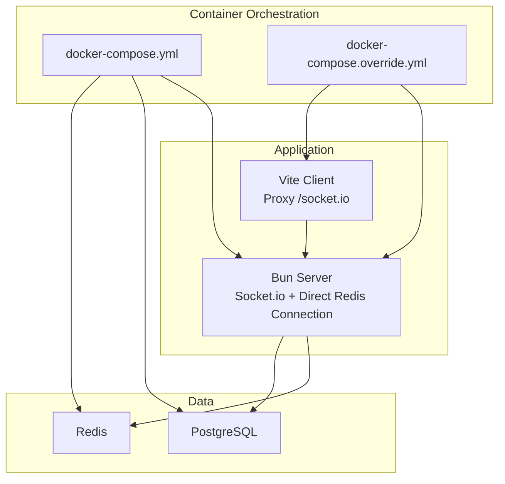
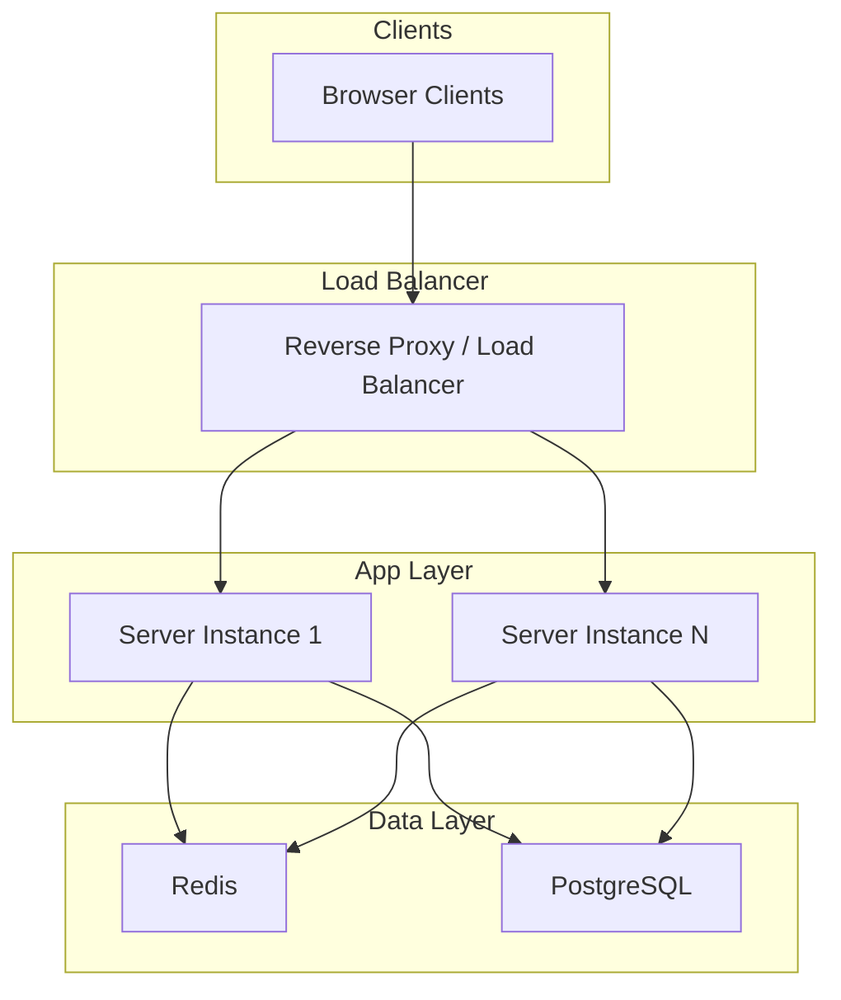
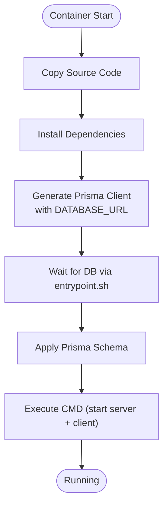
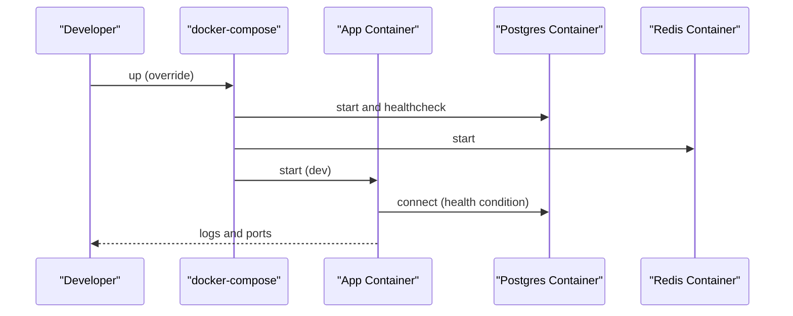
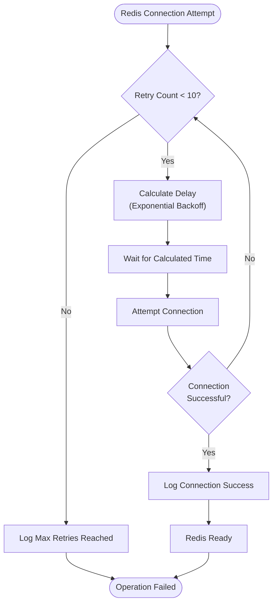
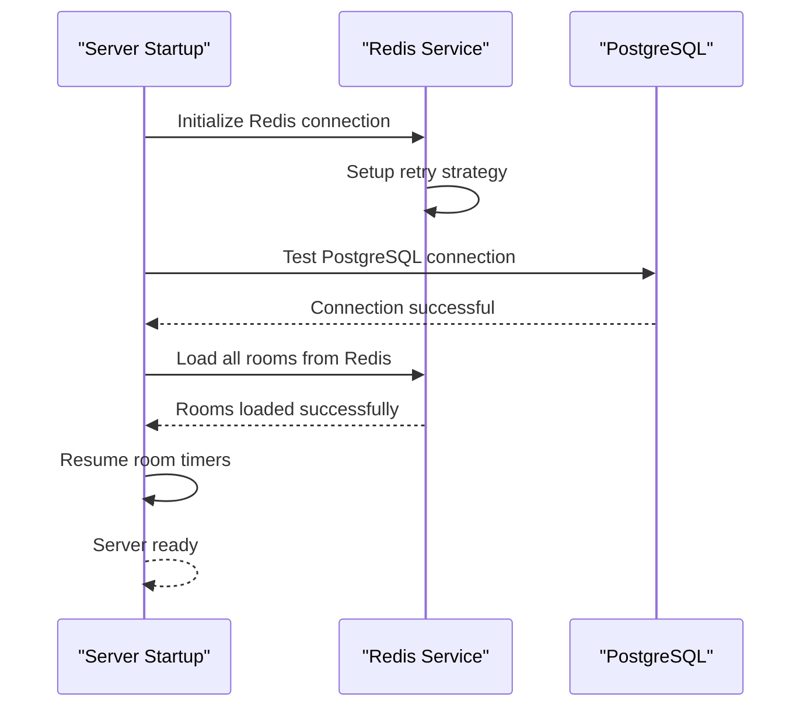
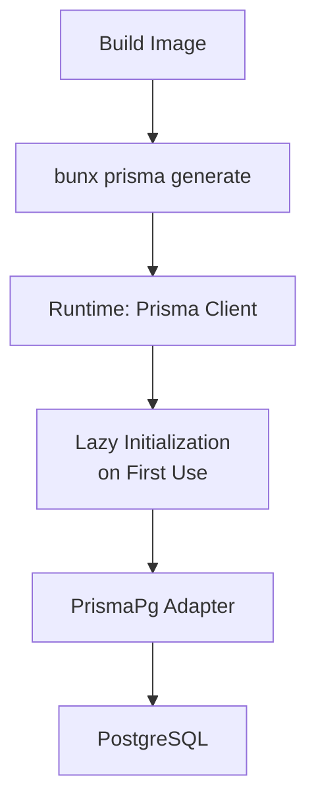
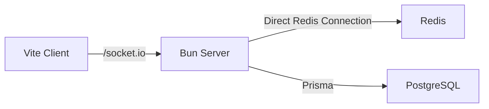

# Deployment & Operations

<cite>
**Referenced Files in This Document**
- [Dockerfile](file://Dockerfile)
- [docker-compose.yml](file://docker-compose.yml)
- [docker-compose.override.yml](file://docker-compose.override.yml)
- [entrypoint.sh](file://entrypoint.sh)
- [package.json](file://package.json)
- [src/server/index.ts](file://src/server/index.ts)
- [src/server/repositories/postgres-service.ts](file://src/server/repositories/postgres-service.ts)
- [src/server/repositories/redis-service.ts](file://src/server/repositories/redis-service.ts)
- [src/server/services/room-manager.ts](file://src/server/services/room-manager.ts)
- [prisma.config.ts](file://prisma.config.ts)
- [prisma/schema.prisma](file://prisma/schema.prisma)
- [vite.config.ts](file://vite.config.ts)
- [ARCHITECTURE.md](file://ARCHITECTURE.md)
</cite>

## Update Summary
**Changes Made**
- Updated Redis connection management section to reflect enhanced retry strategies and error handling improvements
- Revised server startup section to clarify that Redis adapter initialization has been removed
- Updated architecture diagrams to remove Redis adapter references
- Enhanced Redis service reliability documentation with improved connection resilience

## Table of Contents
1. [Introduction](#introduction)
2. [Project Structure](#project-structure)
3. [Core Components](#core-components)
4. [Architecture Overview](#architecture-overview)
5. [Detailed Component Analysis](#detailed-component-analysis)
6. [Dependency Analysis](#dependency-analysis)
7. [Performance Considerations](#performance-considerations)
8. [Troubleshooting Guide](#troubleshooting-guide)
9. [Conclusion](#conclusion)
10. [Appendices](#appendices)

## Introduction
This document provides comprehensive deployment and operations guidance for Project ODYSSEY. It covers containerized deployment with Docker multi-stage builds, docker-compose orchestration for Redis and PostgreSQL, environment variable configuration, secrets management, scaling strategies, load balancing, performance monitoring, production workflows, rollback procedures, security considerations, logging, health checks, and troubleshooting.

## Project Structure
Project ODYSSEY is a Bun-based real-time co-op escape room server with a Vite client, Socket.io for real-time communication, Redis for room/session persistence, and PostgreSQL with Prisma for score persistence. The repository includes:
- Containerization and orchestration: Dockerfile, docker-compose files, entrypoint script
- Server runtime: Bun, Socket.io, Redis direct connection, Prisma client
- Client runtime: Vite, proxy configuration for Socket.io
- Database: Prisma schema and configuration
- Utilities: Environment-driven ports, CORS configuration, and development overrides

**Diagram sources**
- [docker-compose.yml](file://docker-compose.yml#L1-L45)
- [docker-compose.override.yml](file://docker-compose.override.yml#L1-L14)
- [src/server/index.ts](file://src/server/index.ts#L47-L61)
- [vite.config.ts](file://vite.config.ts#L27-L32)

**Section sources**
- [ARCHITECTURE.md](file://ARCHITECTURE.md#L1-L202)
- [docker-compose.yml](file://docker-compose.yml#L1-L45)
- [docker-compose.override.yml](file://docker-compose.override.yml#L1-L14)
- [vite.config.ts](file://vite.config.ts#L1-L44)

## Core Components
- Containerization and runtime
  - Dockerfile defines a multi-stage build using the official Bun image, installs dependencies, generates Prisma client, and sets an entrypoint script for pre-start initialization.
  - The entrypoint waits for the database to be reachable and applies Prisma schema before starting the application.
- Orchestration
  - docker-compose.yml defines three services: app, postgres, and redis, with health checks, environment injection, and volume mounts.
  - docker-compose.override.yml enables development mode with hot reload, dual ports, and development environment variables.
- Application server
  - Socket.io server listens on a configurable port and manages real-time connections directly.
  - PostgresService uses Prisma with a connection string from environment variables.
  - RedisService provides enhanced connection management with retry strategies and error handling.
- Client
  - Vite proxy routes Socket.io traffic to the server port and supports allowed hosts configuration.

**Section sources**
- [Dockerfile](file://Dockerfile#L1-L23)
- [entrypoint.sh](file://entrypoint.sh#L1-L15)
- [docker-compose.yml](file://docker-compose.yml#L1-L45)
- [docker-compose.override.yml](file://docker-compose.override.yml#L1-L14)
- [src/server/index.ts](file://src/server/index.ts#L47-L76)
- [src/server/repositories/postgres-service.ts](file://src/server/repositories/postgres-service.ts#L14-L22)
- [src/server/repositories/redis-service.ts](file://src/server/repositories/redis-service.ts#L6-L16)
- [vite.config.ts](file://vite.config.ts#L27-L32)

## Architecture Overview
The deployment architecture integrates the Bun server, Vite client, Redis, and PostgreSQL. The server uses direct Redis connections for room persistence and Socket.io for real-time communication. Prisma manages PostgreSQL schema and queries for leaderboards and persisted scores.

**Diagram sources**
- [src/server/index.ts](file://src/server/index.ts#L47-L61)
- [src/server/repositories/postgres-service.ts](file://src/server/repositories/postgres-service.ts#L14-L22)
- [src/server/repositories/redis-service.ts](file://src/server/repositories/redis-service.ts#L6-L16)

## Detailed Component Analysis

### Containerized Deployment with Docker
- Multi-stage build
  - Base stage installs Bun dependencies and copies source; Prisma client generation runs with DATABASE_URL argument and environment variable.
  - Release stage copies the entrypoint script, sets executable permissions, and starts the server with Bun.
- Entrypoint behavior
  - Waits for database readiness using Prisma db push, then executes the command passed to the container.
- Production command
  - Starts both server and client concurrently in production mode.

**Diagram sources**
- [Dockerfile](file://Dockerfile#L1-L23)
- [entrypoint.sh](file://entrypoint.sh#L4-L14)
- [package.json](file://package.json#L10-L12)

**Section sources**
- [Dockerfile](file://Dockerfile#L1-L23)
- [entrypoint.sh](file://entrypoint.sh#L1-L15)
- [package.json](file://package.json#L1-L41)

### Docker Compose Orchestration
- Services
  - app: Builds from the repository root, exposes SERVER_PORT, injects .env, depends on postgres health and redis availability, runs Bun start.
  - postgres: Uses postgres:15-alpine, healthchecks with pg_isready, persistent volume for data, environment variables from .env.
  - redis: Uses redis:alpine, exposed port 6379.
- Overrides for development
  - Adds CLIENT_PORT, runs dev command, mounts source and ignores node_modules, sets development environment variables.

**Diagram sources**
- [docker-compose.yml](file://docker-compose.yml#L1-L45)
- [docker-compose.override.yml](file://docker-compose.override.yml#L1-L14)

**Section sources**
- [docker-compose.yml](file://docker-compose.yml#L1-L45)
- [docker-compose.override.yml](file://docker-compose.override.yml#L1-L14)

### Environment Variables and Secrets Management
- Required variables
  - DATABASE_URL: Postgres connection string for Prisma.
  - REDIS_URL: Redis connection string for direct RedisService connection.
  - SERVER_PORT: Server port for the Bun application.
  - CLIENT_PORT: Vite dev server port (development).
  - VITE_ALLOWED_HOSTS: Comma-separated allowed hosts for Vite dev server.
  - LOG_LEVEL, VITE_LOG_LEVEL: Logging verbosity for server and client.
- Recommended practices
  - Store secrets in a secrets manager or compose secrets and pass them via secure mechanisms.
  - Use separate .env files per environment and avoid committing secrets to version control.
  - Validate presence of critical variables at startup (consider adding explicit checks in the server).

**Section sources**
- [docker-compose.yml](file://docker-compose.yml#L10-L15)
- [docker-compose.yml](file://docker-compose.yml#L22-L28)
- [docker-compose.override.yml](file://docker-compose.override.yml#L11-L13)
- [src/server/index.ts](file://src/server/index.ts#L47-L52)
- [src/server/repositories/postgres-service.ts](file://src/server/repositories/postgres-service.ts#L14-L16)
- [src/server/repositories/redis-service.ts](file://src/server/repositories/redis-service.ts#L6-L7)
- [vite.config.ts](file://vite.config.ts#L10-L13)

### Enhanced Redis Connection Management
**Updated** Enhanced with comprehensive retry strategies and error handling improvements

The Redis service now implements robust connection management with automatic retry capabilities and intelligent error handling:

- **Retry Strategy**: Configured with exponential backoff (up to 10 seconds between retries) and maximum 10 retry attempts
- **Error Cooldown**: Prevents log spam by limiting Redis error messages to once every 30 seconds
- **Connection Events**: Comprehensive logging for connect, error, and reconnect events
- **Request Retries**: Up to 3 retry attempts per individual request for improved reliability

**Diagram sources**
- [src/server/repositories/redis-service.ts](file://src/server/repositories/redis-service.ts#L8-L18)
- [src/server/repositories/redis-service.ts](file://src/server/repositories/redis-service.ts#L26-L32)

**Section sources**
- [src/server/repositories/redis-service.ts](file://src/server/repositories/redis-service.ts#L8-L18)
- [src/server/repositories/redis-service.ts](file://src/server/repositories/redis-service.ts#L22-L36)

### Simplified Server Startup
**Updated** Server startup has been simplified by removing Redis adapter initialization

The server startup process has been streamlined to improve reliability and reduce complexity:

- **Direct Redis Connection**: The server now uses direct Redis connections instead of Socket.io Redis adapter
- **Enhanced Room Persistence**: Room management continues to use RedisService for persistence with improved error handling
- **Simplified Initialization**: Reduced startup complexity by eliminating adapter-specific initialization steps
- **Maintained Functionality**: All room persistence and state management features remain fully functional

**Diagram sources**
- [src/server/index.ts](file://src/server/index.ts#L58-L67)
- [src/server/repositories/redis-service.ts](file://src/server/repositories/redis-service.ts#L20)
- [src/server/repositories/postgres-service.ts](file://src/server/repositories/postgres-service.ts#L72-L79)

**Section sources**
- [src/server/index.ts](file://src/server/index.ts#L58-L67)
- [src/server/repositories/redis-service.ts](file://src/server/repositories/redis-service.ts#L20)
- [src/server/repositories/postgres-service.ts](file://src/server/repositories/postgres-service.ts#L72-L79)

### Load Balancing Strategies
- Reverse proxy or load balancer
  - Place a reverse proxy (e.g., Nginx, Traefik, or cloud LB) in front of multiple server instances.
  - Enable sticky sessions if required, or rely on Redis direct connections for state persistence.
- Health checks
  - Use the server's internal readiness signals (after Prisma initialization) and container health checks for dependent services.
  - Expose a lightweight health endpoint for external probes if desired.

**Section sources**
- [docker-compose.yml](file://docker-compose.yml#L31-L35)
- [entrypoint.sh](file://entrypoint.sh#L4-L11)

### Database and Prisma Configuration
- Prisma client generation
  - Generated client is included in the image; DATABASE_URL is injected during build and runtime.
- Schema and migrations
  - Prisma schema defines the GameScore model with indexes; migrations path is configured.
- Connection
  - PostgresService constructs a Prisma client lazily with DATABASE_URL and uses PrismaPg adapter.

**Diagram sources**
- [Dockerfile](file://Dockerfile#L12-L16)
- [prisma.config.ts](file://prisma.config.ts#L4-L9)
- [prisma/schema.prisma](file://prisma/schema.prisma#L10-L24)
- [src/server/repositories/postgres-service.ts](file://src/server/repositories/postgres-service.ts#L15-L31)

**Section sources**
- [Dockerfile](file://Dockerfile#L12-L16)
- [prisma.config.ts](file://prisma.config.ts#L1-L14)
- [prisma/schema.prisma](file://prisma/schema.prisma#L1-L24)
- [src/server/repositories/postgres-service.ts](file://src/server/repositories/postgres-service.ts#L15-L31)

### Client Proxy and Ports
- Vite proxy
  - Proxies /socket.io to the server port, enabling seamless development and production routing.
- Port configuration
  - SERVER_PORT and CLIENT_PORT are environment-driven and mapped in docker-compose.

**Section sources**
- [vite.config.ts](file://vite.config.ts#L27-L32)
- [docker-compose.yml](file://docker-compose.yml#L8-L9)
- [docker-compose.override.yml](file://docker-compose.override.yml#L4-L6)

### Security Considerations
- CORS
  - Server allows origin from http://localhost:CLIENT_PORT; adjust for production domains.
- TLS/SSL
  - Terminate TLS at the reverse proxy or load balancer; configure HTTPS listeners and certificates externally.
- Network security
  - Restrict inbound ports to necessary ranges; isolate Redis and Postgres behind application networks.
  - Use private networks and secrets management for credentials.

**Section sources**
- [src/server/index.ts](file://src/server/index.ts#L54-L58)
- [docker-compose.yml](file://docker-compose.yml#L18-L43)

### Logging, Health Checks, and Monitoring
- Logging
  - Winston-based logger is used across server utilities; configure log levels via environment variables.
- Health checks
  - Postgres healthcheck uses pg_isready; Redis uses enhanced connection monitoring.
- Monitoring
  - Track CPU/memory/disk of containers; monitor Redis and Postgres metrics; instrument application logs for key events.

**Section sources**
- [src/server/repositories/redis-service.ts](file://src/server/repositories/redis-service.ts#L22-L36)
- [docker-compose.yml](file://docker-compose.yml#L31-L35)

### Production Deployment Workflows and Rollback Procedures
- Deployment workflow
  - Build images with DATABASE_URL and deploy orchestrator (compose or platform).
  - Start postgres and redis, wait for health, then start app instances behind a load balancer.
- Rollback
  - Keep previous image tags; redeploy with the prior tag and reverse proxy configuration.
  - For database changes, maintain migration safety and consider backup/restore procedures.

### Maintenance Tasks
- Database maintenance
  - Regularly vacuum/analyze PostgreSQL; prune old data as needed; monitor indexes.
- Redis maintenance
  - Monitor memory usage, evictions, and slowlog; tune maxmemory policy.
- Certificates and secrets rotation
  - Rotate TLS certificates at the reverse proxy; rotate DATABASE_URL and REDIS_URL secrets and redeploy.

## Dependency Analysis
The server depends on Redis for room persistence and on PostgreSQL via Prisma for score persistence. The client depends on the server over Socket.io with Vite proxy routing.

**Diagram sources**
- [src/server/index.ts](file://src/server/index.ts#L29-L30)
- [src/server/repositories/postgres-service.ts](file://src/server/repositories/postgres-service.ts#L1-L3)
- [vite.config.ts](file://vite.config.ts#L27-L32)

**Section sources**
- [src/server/index.ts](file://src/server/index.ts#L29-L30)
- [src/server/repositories/postgres-service.ts](file://src/server/repositories/postgres-service.ts#L1-L3)
- [vite.config.ts](file://vite.config.ts#L27-L32)

## Performance Considerations
- Container sizing
  - Allocate sufficient CPU/memory to Bun server and database; monitor GC and thread usage.
- Database tuning
  - Use connection pooling; optimize Prisma queries; add appropriate indexes.
- Redis tuning
  - Enhanced retry strategy reduces connection failures; monitor latency and memory usage.
- Client delivery
  - Serve static assets via CDN or reverse proxy; enable compression and caching.

## Troubleshooting Guide
- Database connectivity
  - Verify DATABASE_URL correctness; ensure Postgres is healthy and accepting connections.
- Redis connectivity
  - Confirm REDIS_URL and network reachability; check Redis logs for errors.
- Socket.io scaling
  - Since Redis adapter is not used, ensure Redis direct connection is working properly.
- Health checks failing
  - Review postgres healthcheck interval/timeout; check container logs for initialization errors.
- Port conflicts
  - Ensure SERVER_PORT and CLIENT_PORT are not in use; verify docker-compose port mappings.

**Section sources**
- [docker-compose.yml](file://docker-compose.yml#L31-L35)
- [src/server/repositories/postgres-service.ts](file://src/server/repositories/postgres-service.ts#L14-L16)
- [src/server/repositories/redis-service.ts](file://src/server/repositories/redis-service.ts#L6-L16)
- [src/server/index.ts](file://src/server/index.ts#L47-L61)

## Conclusion
Project ODYSSEY is designed for containerized deployment with clear separation of concerns between the Bun server, Vite client, Redis, and PostgreSQL. The enhanced Redis connection management with retry strategies and simplified server startup provide improved reliability and reduced operational complexity. The provided docker-compose configuration, environment-driven settings, and direct Redis connections enable robust operations. Adopt the recommended practices for secrets, security, monitoring, and maintenance to ensure reliable production deployments.

## Appendices
- Quick reference: Ensure DATABASE_URL, REDIS_URL, SERVER_PORT, CLIENT_PORT are set; run docker-compose up; verify health checks; leverage enhanced Redis retry strategies for improved reliability.