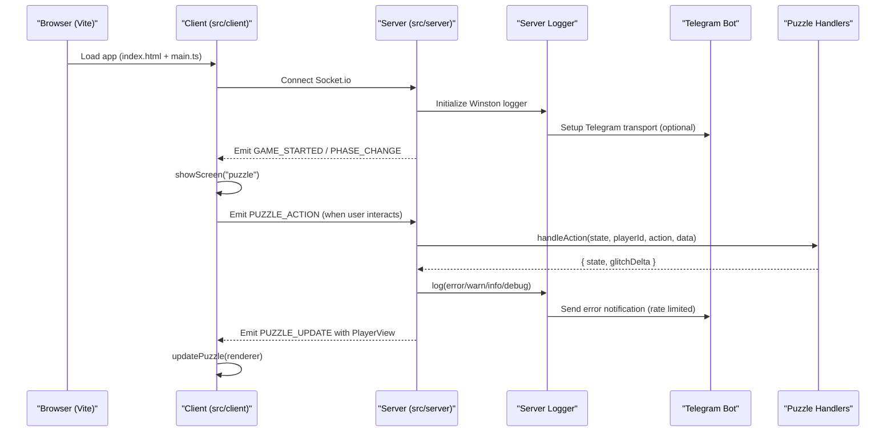
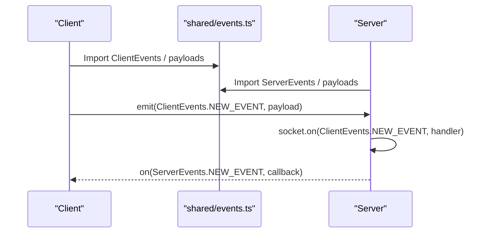
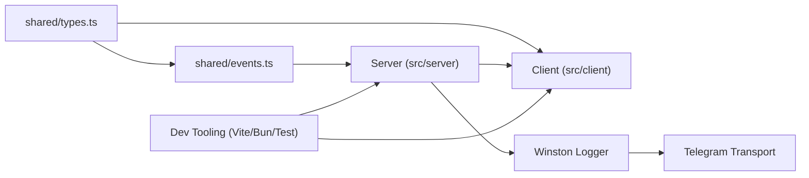

# Development Guidelines

<cite>
**Referenced Files in This Document**
- [README.md](file://README.md)
- [ARCHITECTURE.md](file://ARCHITECTURE.md)
- [package.json](file://package.json)
- [vite.config.ts](file://vite.config.ts)
- [vitest.config.ts](file://vitest.config.ts)
- [TESTING.md](file://TESTING.md)
- [shared/types.ts](file://shared/types.ts)
- [shared/events.ts](file://shared/events.ts)
- [shared/logger.ts](file://shared/logger.ts)
- [src/server/puzzles/puzzle-handler.ts](file://src/server/puzzles/puzzle-handler.ts)
- [src/server/puzzles/register.ts](file://src/server/puzzles/register.ts)
- [src/server/puzzles/asymmetric-symbols.ts](file://src/server/puzzles/asymmetric-symbols.ts)
- [src/server/puzzles/rhythm-tap.ts](file://src/server/puzzles/rhythm-tap.ts)
- [src/client/screens/puzzle.ts](file://src/client/screens/puzzle.ts)
- [src/client/puzzles/asymmetric-symbols.ts](file://src/client/puzzles/asymmetric-symbols.ts)
- [src/client/puzzles/rhythm-tap.ts](file://src/client/puzzles/rhythm-tap.ts)
- [src/server/utils/logger.ts](file://src/server/utils/logger.ts)
- [src/client/logger.ts](file://src/client/logger.ts)
- [src/server/services/room-manager.test.ts](file://src/server/services/room-manager.test.ts)
- [src/client/__tests__/setup.ts](file://src/client/__tests__/setup.ts)
- [e2e/puzzle-runner.ts](file://e2e/puzzle-runner.ts)
- [e2e/puzzles.spec.ts](file://e2e/puzzles.spec.ts)
- [playwright.config.ts](file://playwright.config.ts)
</cite>

## Update Summary
**Changes Made**
- Added comprehensive Telegram bot integration documentation with rate limiting and environment variable configuration
- Updated logging infrastructure to include server-side error notifications via Telegram
- Enhanced troubleshooting guide with Telegram integration setup and configuration
- Added environment variable management guidance for production deployments

## Table of Contents
1. [Introduction](#introduction)
2. [Project Structure](#project-structure)
3. [Core Components](#core-components)
4. [Architecture Overview](#architecture-overview)
5. [Detailed Component Analysis](#detailed-component-analysis)
6. [Environment Configuration](#environment-configuration)
7. [Logging and Error Notifications](#logging-and-error-notifications)
8. [Dependency Analysis](#dependency-analysis)
9. [Performance Considerations](#performance-considerations)
10. [Troubleshooting Guide](#troubleshooting-guide)
11. [Conclusion](#conclusion)
12. [Appendices](#appendices)

## Introduction
This document provides comprehensive development guidelines for extending and contributing to Project ODYSSEY. It explains how to add new puzzle types, update typed contracts, implement client-side UI and audio effects, and maintain code quality. It also covers development server setup, hot reloading, debugging, performance, accessibility, cross-browser compatibility, and production monitoring through Telegram error notifications.

## Project Structure
Project ODYSSEY follows a clean, config-first architecture with a strong separation between server and client. The server exposes a Socket.io API and orchestrates game state, while the client renders screens and puzzle UIs. Shared types and events define the contract between client and server. Levels are configured via YAML files. The system now includes comprehensive logging infrastructure with optional Telegram error notifications.

```mermaid
graph TB
subgraph "Shared"
T["shared/types.ts"]
E["shared/events.ts"]
L["shared/logger.ts"]
end
subgraph "Server"
SMain["src/server/index.ts"]
PReg["src/server/puzzles/register.ts"]
PBase["src/server/puzzles/puzzle-handler.ts"]
PSym["src/server/puzzles/asymmetric-symbols.ts"]
PRhy["src/server/puzzles/rhythm-tap.ts"]
Utils["src/server/utils/logger.ts"]
end
subgraph "Client"
CMain["src/client/main.ts"]
ScrPuz["src/client/screens/puzzle.ts"]
CA Sym["src/client/puzzles/asymmetric-symbols.ts"]
CA Rhy["src/client/puzzles/rhythm-tap.ts"]
CL["src/client/logger.ts"]
end
T --> E
E --> SMain
SMain --> PReg
PReg --> PBase
PBase --> PSym
PBase --> PRhy
SMain --> Utils
Utils --> L
SMain --> ScrPuz
ScrPuz --> CA Sym
ScrPuz --> CA Rhy
```

**Diagram sources**
- [shared/types.ts](file://shared/types.ts#L1-L187)
- [shared/events.ts](file://shared/events.ts#L1-L228)
- [shared/logger.ts](file://shared/logger.ts#L1-L22)
- [src/server/puzzles/register.ts](file://src/server/puzzles/register.ts#L1-L21)
- [src/server/puzzles/puzzle-handler.ts](file://src/server/puzzles/puzzle-handler.ts#L1-L57)
- [src/server/puzzles/asymmetric-symbols.ts](file://src/server/puzzles/asymmetric-symbols.ts#L1-L156)
- [src/server/puzzles/rhythm-tap.ts](file://src/server/puzzles/rhythm-tap.ts#L1-L134)
- [src/server/utils/logger.ts](file://src/server/utils/logger.ts#L1-L88)
- [src/client/screens/puzzle.ts](file://src/client/screens/puzzle.ts#L1-L101)
- [src/client/puzzles/asymmetric-symbols.ts](file://src/client/puzzles/asymmetric-symbols.ts#L1-L221)
- [src/client/puzzles/rhythm-tap.ts](file://src/client/puzzles/rhythm-tap.ts#L1-L168)
- [src/client/logger.ts](file://src/client/logger.ts#L1-L39)

**Section sources**
- [README.md](file://README.md#L79-L101)
- [ARCHITECTURE.md](file://ARCHITECTURE.md#L35-L107)

## Core Components
- Shared contracts: Types and events define the single source of truth for state, roles, puzzle configurations, and Socket.io payloads.
- Server puzzle handlers: Implement the PuzzleHandler interface to encapsulate puzzle logic, actions, win conditions, and role-specific views.
- Client puzzle renderers: Provide render and update functions to display role-specific UI and handle user interactions.
- Screen dispatcher: Routes to the correct client renderer based on puzzle type.
- Logging infrastructure: Unified logging system with optional Telegram error notifications for production monitoring.
- Development scripts and tooling: Vite dev server, Bun watch mode, Bun test runner, and Vitest for client-side testing.

Key implementation references:
- Shared types and enums: [shared/types.ts](file://shared/types.ts#L26-L93)
- Socket event names and payloads: [shared/events.ts](file://shared/events.ts#L28-L90)
- Logger interfaces: [shared/logger.ts](file://shared/logger.ts#L6-L21)
- PuzzleHandler interface and registry: [src/server/puzzles/puzzle-handler.ts](file://src/server/puzzles/puzzle-handler.ts#L12-L57)
- Handler registration: [src/server/puzzles/register.ts](file://src/server/puzzles/register.ts#L1-L21)
- Example server handlers: [src/server/puzzles/asymmetric-symbols.ts](file://src/server/puzzles/asymmetric-symbols.ts#L18-L156), [src/server/puzzles/rhythm-tap.ts](file://src/server/puzzles/rhythm-tap.ts#L19-L134)
- Client puzzle dispatcher: [src/client/screens/puzzle.ts](file://src/client/screens/puzzle.ts#L36-L100)
- Example client renderers: [src/client/puzzles/asymmetric-symbols.ts](file://src/client/puzzles/asymmetric-symbols.ts#L28-L221), [src/client/puzzles/rhythm-tap.ts](file://src/client/puzzles/rhythm-tap.ts#L14-L168)
- Server logging with Telegram integration: [src/server/utils/logger.ts](file://src/server/utils/logger.ts#L1-L88)
- Client logging: [src/client/logger.ts](file://src/client/logger.ts#L1-L39)

**Section sources**
- [shared/types.ts](file://shared/types.ts#L1-L187)
- [shared/events.ts](file://shared/events.ts#L1-L228)
- [shared/logger.ts](file://shared/logger.ts#L1-L22)
- [src/server/puzzles/puzzle-handler.ts](file://src/server/puzzles/puzzle-handler.ts#L1-L57)
- [src/server/puzzles/register.ts](file://src/server/puzzles/register.ts#L1-L21)
- [src/client/screens/puzzle.ts](file://src/client/screens/puzzle.ts#L1-L101)
- [src/server/utils/logger.ts](file://src/server/utils/logger.ts#L1-L88)
- [src/client/logger.ts](file://src/client/logger.ts#L1-L39)

## Architecture Overview
The system uses a real-time Socket.io bridge between a Vite-powered client and a Bun-powered server. The server maintains a state machine for game phases and delegates puzzle logic to pluggable handlers. The client renders screens and puzzle UIs and reacts to server events. The logging system provides comprehensive error monitoring with optional Telegram notifications.



**Diagram sources**
- [shared/events.ts](file://shared/events.ts#L28-L90)
- [src/client/screens/puzzle.ts](file://src/client/screens/puzzle.ts#L23-L34)
- [src/server/puzzles/puzzle-handler.ts](file://src/server/puzzles/puzzle-handler.ts#L12-L44)
- [src/server/utils/logger.ts](file://src/server/utils/logger.ts#L6-L56)

**Section sources**
- [ARCHITECTURE.md](file://ARCHITECTURE.md#L5-L27)
- [shared/events.ts](file://shared/events.ts#L143-L192)
- [src/server/utils/logger.ts](file://src/server/utils/logger.ts#L1-L88)

## Detailed Component Analysis

### Adding a New Puzzle Type
Follow the end-to-end workflow to add a new puzzle type across server, client, and configuration layers.


**Diagram sources**
- [shared/types.ts](file://shared/types.ts#L85-L93)
- [src/server/puzzles/puzzle-handler.ts](file://src/server/puzzles/puzzle-handler.ts#L12-L44)
- [src/server/puzzles/register.ts](file://src/server/puzzles/register.ts#L1-L21)
- [src/client/screens/puzzle.ts](file://src/client/screens/puzzle.ts#L48-L73)

Implementation references:
- Server handler interface and registry: [src/server/puzzles/puzzle-handler.ts](file://src/server/puzzles/puzzle-handler.ts#L12-L57)
- Handler registration pattern: [src/server/puzzles/register.ts](file://src/server/puzzles/register.ts#L1-L21)
- Client dispatcher pattern: [src/client/screens/puzzle.ts](file://src/client/screens/puzzle.ts#L48-L73)
- Example server handler: [src/server/puzzles/asymmetric-symbols.ts](file://src/server/puzzles/asymmetric-symbols.ts#L18-L156)
- Example client renderer: [src/client/puzzles/asymmetric-symbols.ts](file://src/client/puzzles/asymmetric-symbols.ts#L28-L221)

**Section sources**
- [shared/types.ts](file://shared/types.ts#L85-L93)
- [src/server/puzzles/puzzle-handler.ts](file://src/server/puzzles/puzzle-handler.ts#L1-L57)
- [src/server/puzzles/register.ts](file://src/server/puzzles/register.ts#L1-L21)
- [src/client/screens/puzzle.ts](file://src/client/screens/puzzle.ts#L1-L101)
- [src/client/puzzles/asymmetric-symbols.ts](file://src/client/puzzles/asymmetric-symbols.ts#L1-L221)

### Event Addition Workflow and Typed Contract Updates
To add a new Socket.io event:
1. Add the event name to ClientEvents or ServerEvents in shared/events.ts.
2. Define the payload interface in the same file.
3. On the server, add a socket.on(ClientEvents.X, handler) in src/server/index.ts.
4. On the client, use on(ServerEvents.X, callback) and emit(ClientEvents.X, payload) from src/client/lib/socket.ts.



**Diagram sources**
- [shared/events.ts](file://shared/events.ts#L28-L90)

**Section sources**
- [ARCHITECTURE.md](file://ARCHITECTURE.md#L172-L178)
- [shared/events.ts](file://shared/events.ts#L1-L228)

### Implementing New Puzzle Mechanics
Server-side mechanics:
- Implement init to seed state from config and players.
- Implement handleAction to process player actions and compute glitch penalties.
- Implement checkWin to determine completion.
- Implement getPlayerView to return role-specific view data.

Client-side rendering:
- Export renderX and updateX in the client puzzle module.
- Use DOM helpers (h, mount, clear) to build UI.
- Emit PUZZLE_ACTION events for user interactions.
- Update UI reactively on PUZZLE_UPDATE.

References:
- Server handler contract: [src/server/puzzles/puzzle-handler.ts](file://src/server/puzzles/puzzle-handler.ts#L12-L44)
- Example server logic: [src/server/puzzles/rhythm-tap.ts](file://src/server/puzzles/rhythm-tap.ts#L58-L105)
- Example client UI and events: [src/client/puzzles/rhythm-tap.ts](file://src/client/puzzles/rhythm-tap.ts#L14-L127)

**Section sources**
- [src/server/puzzles/puzzle-handler.ts](file://src/server/puzzles/puzzle-handler.ts#L1-L57)
- [src/server/puzzles/rhythm-tap.ts](file://src/server/puzzles/rhythm-tap.ts#L1-L134)
- [src/client/puzzles/rhythm-tap.ts](file://src/client/puzzles/rhythm-tap.ts#L1-L168)

### UI Components and Audio Effects
UI components:
- Use src/client/lib/dom.ts helpers to construct and update DOM nodes.
- Keep renderX pure and deterministic; use updateX for reactive DOM diffs.
- Manage timers and intervals in renderers and clean them up on unmount.

Audio effects:
- Use src/client/audio/audio-manager.ts to trigger SFX and music cues.
- Integrate audio callbacks in response to puzzle state changes (e.g., success/fail).

References:
- Client DOM helpers: [src/client/puzzles/asymmetric-symbols.ts](file://src/client/puzzles/asymmetric-symbols.ts#L5-L8)
- Audio manager usage: [src/client/puzzles/asymmetric-symbols.ts](file://src/client/puzzles/asymmetric-symbols.ts#L7-L7), [src/client/puzzles/rhythm-tap.ts](file://src/client/puzzles/rhythm-tap.ts#L6-L8)

**Section sources**
- [src/client/puzzles/asymmetric-symbols.ts](file://src/client/puzzles/asymmetric-symbols.ts#L1-L221)
- [src/client/puzzles/rhythm-tap.ts](file://src/client/puzzles/rhythm-tap.ts#L1-L168)

### Testing Strategies and Code Review Processes
Testing:
- Run type checks using the project scripts.
- Server-side tests use Bun's built-in test runner with bun test.
- Client-side tests use Vitest with bun test:client.
- End-to-end testing uses a custom TypeScript test runner in e2e/puzzle-runner.ts.

Code review:
- Ensure all new puzzle types are added to shared/types.ts and registered in src/server/puzzles/register.ts.
- Verify client dispatcher wiring and CSS.
- Confirm YAML configuration entries and hot-reload behavior.

References:
- Scripts and commands: [package.json](file://package.json#L5-L18)
- Bun test runner: [TESTING.md](file://TESTING.md#L3-L11)
- Vitest configuration: [vitest.config.ts](file://vitest.config.ts#L1-L42)
- Custom e2e runner: [e2e/puzzle-runner.ts](file://e2e/puzzle-runner.ts#L1-L601)

**Section sources**
- [package.json](file://package.json#L1-L52)
- [TESTING.md](file://TESTING.md#L1-L102)
- [vitest.config.ts](file://vitest.config.ts#L1-L42)
- [e2e/puzzle-runner.ts](file://e2e/puzzle-runner.ts#L1-L601)

## Environment Configuration
The application supports environment variable configuration for production deployments, including Telegram error notifications and logging levels.

### Environment Variables
- `TELEGRAM_BOT_TOKEN`: Telegram bot token for error notifications (optional)
- `TELEGRAM_CHAT_ID`: Telegram chat ID for receiving error alerts (optional)
- `LOG_LEVEL`: Server logging level (default: DEBUG)
- `SERVER_PORT`: Server port (default: 3000)
- `CLIENT_PORT`: Client port (default: 5173)
- `CORS_ORIGIN`: CORS origin configuration (default: allows all in production)

### Production Deployment Setup
1. Set up Telegram bot and obtain bot token and chat ID
2. Configure environment variables in production
3. Deploy server with proper logging configuration
4. Monitor error notifications via Telegram

**Section sources**
- [src/server/utils/logger.ts](file://src/server/utils/logger.ts#L62-L72)
- [src/server/index.ts](file://src/server/index.ts#L45-L49)

## Logging and Error Notifications
The server implements a comprehensive logging system with optional Telegram error notifications for production monitoring.

### Server Logging Infrastructure
The server uses Winston for structured logging with the following features:
- Console transport with colored output
- Optional Telegram transport for error notifications
- Rate limiting (1-minute cooldown between alerts)
- Support for multiple log levels (ERROR, WARN, INFO, DEBUG)
- Structured metadata support for debugging

### Telegram Integration Features
- Automatic error detection and notification
- Rate limiting to prevent notification spam
- MarkdownV2 formatting for rich message presentation
- Environment variable configuration for bot token and chat ID
- Graceful fallback if Telegram API is unavailable

### Log Level Configuration
- Server: Uses `process.env.LOG_LEVEL` or defaults to DEBUG
- Client: Uses `import.meta.env.VITE_LOG_LEVEL` or defaults to DEBUG in development
- Automatic filtering based on current log level

### Implementation Details
The Telegram transport implements Winston's Transport interface and:
- Filters only ERROR level logs
- Checks cooldown period before sending notifications
- Formats messages with optional metadata
- Handles API errors gracefully without crashing the server

**Section sources**
- [src/server/utils/logger.ts](file://src/server/utils/logger.ts#L1-L88)
- [shared/logger.ts](file://shared/logger.ts#L6-L21)
- [src/client/logger.ts](file://src/client/logger.ts#L1-L39)

## Dependency Analysis
The server's puzzle system depends on shared types and events, while the client depends on shared types and the Socket.io client wrapper. The logging system adds Winston and winston-transport dependencies for enhanced error monitoring. The development toolchain ties everything together with Vite, Bun, and the integrated testing frameworks.



**Diagram sources**
- [shared/types.ts](file://shared/types.ts#L1-L187)
- [shared/events.ts](file://shared/events.ts#L1-L228)
- [shared/logger.ts](file://shared/logger.ts#L1-L22)
- [package.json](file://package.json#L20-L35)

**Section sources**
- [shared/types.ts](file://shared/types.ts#L1-L187)
- [shared/events.ts](file://shared/events.ts#L1-L228)
- [shared/logger.ts](file://shared/logger.ts#L1-L22)
- [package.json](file://package.json#L1-L52)

## Performance Considerations
- Minimize DOM updates: Prefer updateX to patch only changed elements.
- Manage timers and intervals: Clear intervals on unmount to prevent leaks.
- Keep puzzle state flat and serializable to reduce serialization overhead.
- Use seeded PRNGs for deterministic client-side animations to avoid desync.
- Avoid heavy synchronous work on the main thread; offload where possible.
- **Updated** Implement rate limiting in logging to prevent performance impact from excessive error notifications.
- **Updated** Use environment variables for conditional logging features in production.

## Troubleshooting Guide
Common issues and resolutions:
- Type errors after adding a new puzzle type: Ensure the type is added to shared/types.ts and the client dispatcher includes a case for the new type.
- Client not receiving updates: Verify the client emits PUZZLE_ACTION and listens for PUZZLE_UPDATE.
- Handler not invoked: Confirm the handler is imported and registered in src/server/puzzles/register.ts.
- Hot reload not applying: Restart the dev server; Vite proxies Socket.io and supports HMR for client code.
- Test failures: Check Bun test runner output for server-side tests and Vitest output for client-side tests.
- **Updated** Telegram notifications not working: Verify TELEGRAM_BOT_TOKEN and TELEGRAM_CHAT_ID environment variables are set correctly.
- **Updated** Excessive Telegram notifications: Check rate limiting configuration (1-minute cooldown) and adjust if needed.
- **Updated** Logging level issues: Verify LOG_LEVEL environment variable and ensure proper Winston configuration.

### Telegram Integration Troubleshooting
1. **Bot token invalid**: Check TELEGRAM_BOT_TOKEN format and permissions
2. **Chat ID incorrect**: Verify TELEGRAM_CHAT_ID belongs to the configured chat
3. **Rate limiting active**: Wait 1 minute between error notifications
4. **Network connectivity**: Ensure server can reach Telegram API
5. **Environment variables**: Confirm variables are exported in production environment

**Section sources**
- [shared/types.ts](file://shared/types.ts#L85-L93)
- [src/client/screens/puzzle.ts](file://src/client/screens/puzzle.ts#L48-L73)
- [src/server/puzzles/register.ts](file://src/server/puzzles/register.ts#L1-L21)
- [src/server/utils/logger.ts](file://src/server/utils/logger.ts#L62-L72)
- [README.md](file://README.md#L122-L131)

## Conclusion
By following the established patterns—typed contracts, pluggable puzzle handlers, and a clear client dispatcher—you can reliably add new puzzle mechanics, integrate UI and audio, and maintain a robust, scalable system. The enhanced logging infrastructure with optional Telegram error notifications provides comprehensive monitoring capabilities for production deployments. Use the provided scripts and workflows to streamline development, testing, and deployment with the current Bun-based testing approach.

## Appendices

### Development Server Setup and Hot Reloading
- Start both server and client concurrently with the dev script.
- Vite serves the client on port 5173 and proxies Socket.io to the server.
- The server runs in watch mode for rapid iteration.
- **Updated** Server logging automatically configures Telegram transport if environment variables are present.

References:
- Dev scripts: [package.json](file://package.json#L5-L12)
- Vite config and proxy: [vite.config.ts](file://vite.config.ts#L15-L33)
- Server logging configuration: [src/server/utils/logger.ts](file://src/server/utils/logger.ts#L62-L72)

**Section sources**
- [package.json](file://package.json#L1-L52)
- [vite.config.ts](file://vite.config.ts#L1-L44)
- [src/server/utils/logger.ts](file://src/server/utils/logger.ts#L1-L88)

### Testing Framework Overview
The project uses a hybrid testing approach:
- **Server-side testing**: Bun's built-in test runner with bun test
- **Client-side testing**: Vitest with bun test:client and bun test:client:watch
- **End-to-end testing**: Custom TypeScript test runner in e2e/puzzle-runner.ts
- **Playwright integration**: Optional e2e tests available but not part of core workflow

References:
- Bun test runner: [TESTING.md](file://TESTING.md#L3-L11)
- Vitest configuration: [vitest.config.ts](file://vitest.config.ts#L1-L42)
- Custom e2e runner: [e2e/puzzle-runner.ts](file://e2e/puzzle-runner.ts#L1-L601)

**Section sources**
- [TESTING.md](file://TESTING.md#L1-L102)
- [vitest.config.ts](file://vitest.config.ts#L1-L42)
- [e2e/puzzle-runner.ts](file://e2e/puzzle-runner.ts#L1-L601)

### Accessibility and Cross-Browser Compatibility
- Keyboard navigation: Ensure interactive elements (buttons, pads) are focusable and operable via keyboard.
- ARIA attributes: Use accessible labels for dynamic content updates.
- Color contrast: Maintain sufficient contrast for roles, HUD, and feedback states.
- Cross-browser: Test on modern browsers; ensure ES2020+ features are transpiled as needed by your toolchain.

### Environment Variable Reference
Complete list of supported environment variables:
- `TELEGRAM_BOT_TOKEN`: Telegram bot authentication token
- `TELEGRAM_CHAT_ID`: Target chat identifier for notifications
- `LOG_LEVEL`: Logging verbosity level (ERROR, WARN, INFO, DEBUG)
- `SERVER_PORT`: Backend server port (default: 3000)
- `CLIENT_PORT`: Frontend client port (default: 5173)
- `CORS_ORIGIN`: Allowed origins for cross-origin requests
- `NODE_ENV`: Environment mode (development/production)

**Section sources**
- [src/server/utils/logger.ts](file://src/server/utils/logger.ts#L62-L72)
- [src/server/index.ts](file://src/server/index.ts#L45-L49)
- [src/client/logger.ts](file://src/client/logger.ts#L10-L11)
- [src/server/utils/logger.ts](file://src/server/utils/logger.ts#L74-L75)