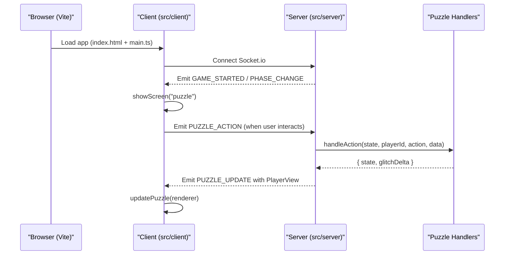
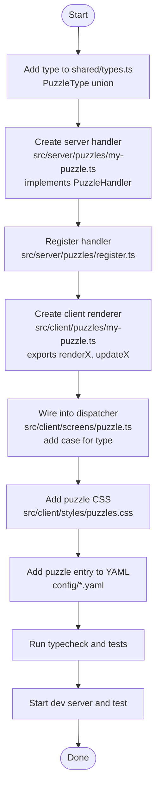
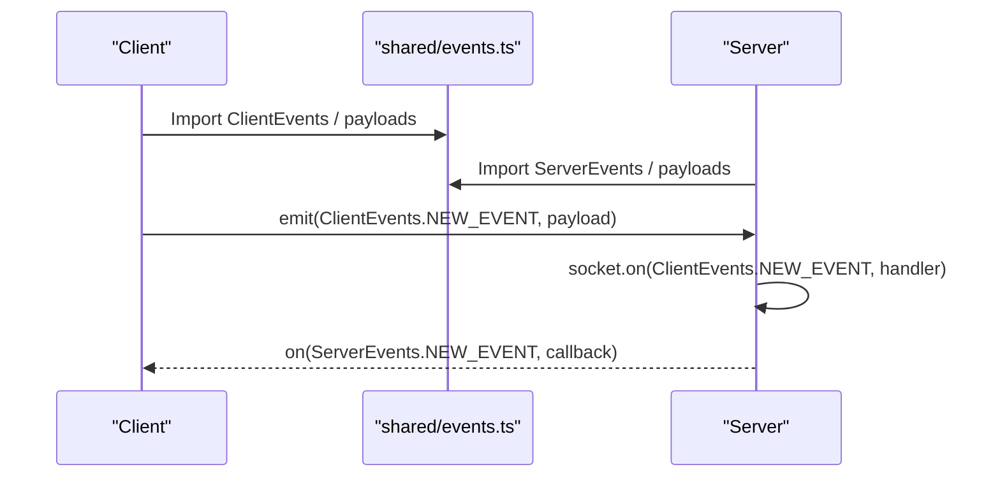
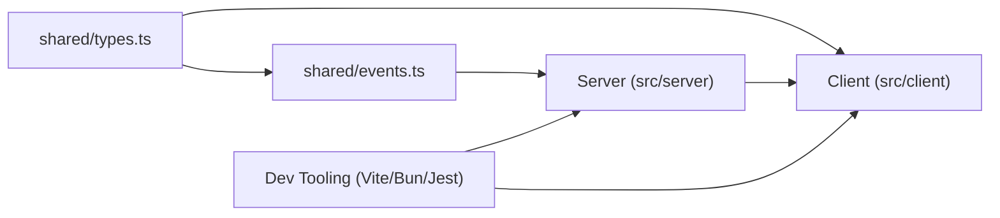

# Development Guidelines

<cite>
**Referenced Files in This Document**
- [README.md](file://README.md)
- [ARCHITECTURE.md](file://ARCHITECTURE.md)
- [package.json](file://package.json)
- [vite.config.ts](file://vite.config.ts)
- [jest.config.js](file://jest.config.js)
- [shared/types.ts](file://shared/types.ts)
- [shared/events.ts](file://shared/events.ts)
- [src/server/puzzles/puzzle-handler.ts](file://src/server/puzzles/puzzle-handler.ts)
- [src/server/puzzles/register.ts](file://src/server/puzzles/register.ts)
- [src/server/puzzles/asymmetric-symbols.ts](file://src/server/puzzles/asymmetric-symbols.ts)
- [src/server/puzzles/rhythm-tap.ts](file://src/server/puzzles/rhythm-tap.ts)
- [src/client/screens/puzzle.ts](file://src/client/screens/puzzle.ts)
- [src/client/puzzles/asymmetric-symbols.ts](file://src/client/puzzles/asymmetric-symbols.ts)
- [src/client/puzzles/rhythm-tap.ts](file://src/client/puzzles/rhythm-tap.ts)
- [.agents/workflows/add-puzzle.md](file://.agents/workflows/add-puzzle.md)
</cite>

## Table of Contents
1. [Introduction](#introduction)
2. [Project Structure](#project-structure)
3. [Core Components](#core-components)
4. [Architecture Overview](#architecture-overview)
5. [Detailed Component Analysis](#detailed-component-analysis)
6. [Dependency Analysis](#dependency-analysis)
7. [Performance Considerations](#performance-considerations)
8. [Troubleshooting Guide](#troubleshooting-guide)
9. [Conclusion](#conclusion)
10. [Appendices](#appendices)

## Introduction
This document provides comprehensive development guidelines for extending and contributing to Project ODYSSEY. It explains how to add new puzzle types, update typed contracts, implement client-side UI and audio effects, and maintain code quality. It also covers development server setup, hot reloading, debugging, performance, accessibility, and cross-browser compatibility.

## Project Structure
Project ODYSSEY follows a clean, config-first architecture with a strong separation between server and client. The server exposes a Socket.io API and orchestrates game state, while the client renders screens and puzzle UIs. Shared types and events define the contract between client and server. Levels are configured via YAML files.

```mermaid
graph TB
subgraph "Shared"
T["shared/types.ts"]
E["shared/events.ts"]
end
subgraph "Server"
SMain["src/server/index.ts"]
PReg["src/server/puzzles/register.ts"]
PBase["src/server/puzzles/puzzle-handler.ts"]
PSym["src/server/puzzles/asymmetric-symbols.ts"]
PRhy["src/server/puzzles/rhythm-tap.ts"]
end
subgraph "Client"
CMain["src/client/main.ts"]
ScrPuz["src/client/screens/puzzle.ts"]
CA Sym["src/client/puzzles/asymmetric-symbols.ts"]
CA Rhy["src/client/puzzles/rhythm-tap.ts"]
end
T --> E
E --> SMain
SMain --> PReg
PReg --> PBase
PBase --> PSym
PBase --> PRhy
SMain --> ScrPuz
ScrPuz --> CA Sym
ScrPuz --> CA Rhy
```

**Diagram sources**
- [shared/types.ts](file://shared/types.ts#L1-L187)
- [shared/events.ts](file://shared/events.ts#L1-L228)
- [src/server/puzzles/register.ts](file://src/server/puzzles/register.ts#L1-L21)
- [src/server/puzzles/puzzle-handler.ts](file://src/server/puzzles/puzzle-handler.ts#L1-L57)
- [src/server/puzzles/asymmetric-symbols.ts](file://src/server/puzzles/asymmetric-symbols.ts#L1-L156)
- [src/server/puzzles/rhythm-tap.ts](file://src/server/puzzles/rhythm-tap.ts#L1-L134)
- [src/client/screens/puzzle.ts](file://src/client/screens/puzzle.ts#L1-L101)
- [src/client/puzzles/asymmetric-symbols.ts](file://src/client/puzzles/asymmetric-symbols.ts#L1-L221)
- [src/client/puzzles/rhythm-tap.ts](file://src/client/puzzles/rhythm-tap.ts#L1-L168)

**Section sources**
- [README.md](file://README.md#L79-L101)
- [ARCHITECTURE.md](file://ARCHITECTURE.md#L35-L107)

## Core Components
- Shared contracts: Types and events define the single source of truth for state, roles, puzzle configurations, and Socket.io payloads.
- Server puzzle handlers: Implement the PuzzleHandler interface to encapsulate puzzle logic, actions, win conditions, and role-specific views.
- Client puzzle renderers: Provide render and update functions to display role-specific UI and handle user interactions.
- Screen dispatcher: Routes to the correct client renderer based on puzzle type.
- Development scripts and tooling: Vite dev server, Bun watch mode, Jest tests, and Prisma client generation.

Key implementation references:
- Shared types and enums: [shared/types.ts](file://shared/types.ts#L26-L93)
- Socket event names and payloads: [shared/events.ts](file://shared/events.ts#L28-L90)
- PuzzleHandler interface and registry: [src/server/puzzles/puzzle-handler.ts](file://src/server/puzzles/puzzle-handler.ts#L12-L57)
- Handler registration: [src/server/puzzles/register.ts](file://src/server/puzzles/register.ts#L1-L21)
- Example server handlers: [src/server/puzzles/asymmetric-symbols.ts](file://src/server/puzzles/asymmetric-symbols.ts#L18-L156), [src/server/puzzles/rhythm-tap.ts](file://src/server/puzzles/rhythm-tap.ts#L19-L134)
- Client puzzle dispatcher: [src/client/screens/puzzle.ts](file://src/client/screens/puzzle.ts#L36-L100)
- Example client renderers: [src/client/puzzles/asymmetric-symbols.ts](file://src/client/puzzles/asymmetric-symbols.ts#L28-L221), [src/client/puzzles/rhythm-tap.ts](file://src/client/puzzles/rhythm-tap.ts#L14-L168)

**Section sources**
- [shared/types.ts](file://shared/types.ts#L1-L187)
- [shared/events.ts](file://shared/events.ts#L1-L228)
- [src/server/puzzles/puzzle-handler.ts](file://src/server/puzzles/puzzle-handler.ts#L1-L57)
- [src/server/puzzles/register.ts](file://src/server/puzzles/register.ts#L1-L21)
- [src/client/screens/puzzle.ts](file://src/client/screens/puzzle.ts#L1-L101)

## Architecture Overview
The system uses a real-time Socket.io bridge between a Vite-powered client and a Bun-powered server. The server maintains a state machine for game phases and delegates puzzle logic to pluggable handlers. The client renders screens and puzzle UIs and reacts to server events.



**Diagram sources**
- [shared/events.ts](file://shared/events.ts#L28-L90)
- [src/client/screens/puzzle.ts](file://src/client/screens/puzzle.ts#L23-L34)
- [src/server/puzzles/puzzle-handler.ts](file://src/server/puzzles/puzzle-handler.ts#L12-L44)

**Section sources**
- [ARCHITECTURE.md](file://ARCHITECTURE.md#L5-L27)
- [shared/events.ts](file://shared/events.ts#L143-L192)

## Detailed Component Analysis

### Adding a New Puzzle Type
Follow the end-to-end workflow to add a new puzzle type across server, client, and configuration layers.



**Diagram sources**
- [shared/types.ts](file://shared/types.ts#L85-L93)
- [src/server/puzzles/puzzle-handler.ts](file://src/server/puzzles/puzzle-handler.ts#L12-L44)
- [src/server/puzzles/register.ts](file://src/server/puzzles/register.ts#L1-L21)
- [src/client/screens/puzzle.ts](file://src/client/screens/puzzle.ts#L48-L73)
- [.agents/workflows/add-puzzle.md](file://.agents/workflows/add-puzzle.md#L11-L172)

Implementation references:
- Server handler interface and registry: [src/server/puzzles/puzzle-handler.ts](file://src/server/puzzles/puzzle-handler.ts#L12-L57)
- Handler registration pattern: [src/server/puzzles/register.ts](file://src/server/puzzles/register.ts#L1-L21)
- Client dispatcher pattern: [src/client/screens/puzzle.ts](file://src/client/screens/puzzle.ts#L48-L73)
- Example server handler: [src/server/puzzles/asymmetric-symbols.ts](file://src/server/puzzles/asymmetric-symbols.ts#L18-L156)
- Example client renderer: [src/client/puzzles/asymmetric-symbols.ts](file://src/client/puzzles/asymmetric-symbols.ts#L28-L221)

**Section sources**
- [.agents/workflows/add-puzzle.md](file://.agents/workflows/add-puzzle.md#L1-L172)
- [shared/types.ts](file://shared/types.ts#L85-L93)
- [src/server/puzzles/puzzle-handler.ts](file://src/server/puzzles/puzzle-handler.ts#L1-L57)
- [src/server/puzzles/register.ts](file://src/server/puzzles/register.ts#L1-L21)
- [src/client/screens/puzzle.ts](file://src/client/screens/puzzle.ts#L1-L101)
- [src/client/puzzles/asymmetric-symbols.ts](file://src/client/puzzles/asymmetric-symbols.ts#L1-L221)

### Event Addition Workflow and Typed Contract Updates
To add a new Socket.io event:
1. Add the event name to ClientEvents or ServerEvents in shared/events.ts.
2. Define the payload interface in the same file.
3. On the server, add a socket.on(ClientEvents.X, handler) in src/server/index.ts.
4. On the client, use on(ServerEvents.X, callback) and emit(ClientEvents.X, payload) from src/client/lib/socket.ts.



**Diagram sources**
- [shared/events.ts](file://shared/events.ts#L28-L90)

**Section sources**
- [ARCHITECTURE.md](file://ARCHITECTURE.md#L172-L178)
- [shared/events.ts](file://shared/events.ts#L1-L228)

### Implementing New Puzzle Mechanics
Server-side mechanics:
- Implement init to seed state from config and players.
- Implement handleAction to process player actions and compute glitch penalties.
- Implement checkWin to determine completion.
- Implement getPlayerView to return role-specific view data.

Client-side rendering:
- Export renderX and updateX in the client puzzle module.
- Use DOM helpers (h, mount, clear) to build UI.
- Emit PUZZLE_ACTION events for user interactions.
- Update UI reactively on PUZZLE_UPDATE.

References:
- Server handler contract: [src/server/puzzles/puzzle-handler.ts](file://src/server/puzzles/puzzle-handler.ts#L12-L44)
- Example server logic: [src/server/puzzles/rhythm-tap.ts](file://src/server/puzzles/rhythm-tap.ts#L58-L105)
- Example client UI and events: [src/client/puzzles/rhythm-tap.ts](file://src/client/puzzles/rhythm-tap.ts#L14-L127)

**Section sources**
- [src/server/puzzles/puzzle-handler.ts](file://src/server/puzzles/puzzle-handler.ts#L1-L57)
- [src/server/puzzles/rhythm-tap.ts](file://src/server/puzzles/rhythm-tap.ts#L1-L134)
- [src/client/puzzles/rhythm-tap.ts](file://src/client/puzzles/rhythm-tap.ts#L1-L168)

### UI Components and Audio Effects
UI components:
- Use src/client/lib/dom.ts helpers to construct and update DOM nodes.
- Keep renderX pure and deterministic; use updateX for reactive DOM diffs.
- Manage timers and intervals in renderers and clean them up on unmount.

Audio effects:
- Use src/client/audio/audio-manager.ts to trigger SFX and music cues.
- Integrate audio callbacks in response to puzzle state changes (e.g., success/fail).

References:
- Client DOM helpers: [src/client/puzzles/asymmetric-symbols.ts](file://src/client/puzzles/asymmetric-symbols.ts#L5-L8)
- Audio manager usage: [src/client/puzzles/asymmetric-symbols.ts](file://src/client/puzzles/asymmetric-symbols.ts#L7-L7), [src/client/puzzles/rhythm-tap.ts](file://src/client/puzzles/rhythm-tap.ts#L6-L8)

**Section sources**
- [src/client/puzzles/asymmetric-symbols.ts](file://src/client/puzzles/asymmetric-symbols.ts#L1-L221)
- [src/client/puzzles/rhythm-tap.ts](file://src/client/puzzles/rhythm-tap.ts#L1-L168)

### Testing Strategies and Code Review Processes
Testing:
- Run type checks and unit tests using the project scripts.
- Coverage is enabled via Jest configuration.

Code review:
- Ensure all new puzzle types are added to shared/types.ts and registered in src/server/puzzles/register.ts.
- Verify client dispatcher wiring and CSS.
- Confirm YAML configuration entries and hot-reload behavior.

References:
- Scripts and commands: [package.json](file://package.json#L5-L14)
- Jest config: [jest.config.js](file://jest.config.js#L1-L6)
- Add-puzzle workflow: [.agents/workflows/add-puzzle.md](file://.agents/workflows/add-puzzle.md#L157-L172)

**Section sources**
- [package.json](file://package.json#L1-L41)
- [jest.config.js](file://jest.config.js#L1-L6)
- [.agents/workflows/add-puzzle.md](file://.agents/workflows/add-puzzle.md#L1-L172)

## Dependency Analysis
The server’s puzzle system depends on shared types and events, while the client depends on shared types and the Socket.io client wrapper. The development toolchain ties everything together with Vite and Bun.



**Diagram sources**
- [shared/types.ts](file://shared/types.ts#L1-L187)
- [shared/events.ts](file://shared/events.ts#L1-L228)
- [package.json](file://package.json#L5-L14)

**Section sources**
- [shared/types.ts](file://shared/types.ts#L1-L187)
- [shared/events.ts](file://shared/events.ts#L1-L228)
- [package.json](file://package.json#L1-L41)

## Performance Considerations
- Minimize DOM updates: Prefer updateX to patch only changed elements.
- Manage timers and intervals: Clear intervals on unmount to prevent leaks.
- Keep puzzle state flat and serializable to reduce serialization overhead.
- Use seeded PRNGs for deterministic client-side animations to avoid desync.
- Avoid heavy synchronous work on the main thread; offload where possible.

[No sources needed since this section provides general guidance]

## Troubleshooting Guide
Common issues and resolutions:
- Type errors after adding a new puzzle type: Ensure the type is added to shared/types.ts and the client dispatcher includes a case for the new type.
- Client not receiving updates: Verify the client emits PUZZLE_ACTION and listens for PUZZLE_UPDATE.
- Handler not invoked: Confirm the handler is imported and registered in src/server/puzzles/register.ts.
- Hot reload not applying: Restart the dev server; Vite proxies Socket.io and supports HMR for client code.

**Section sources**
- [shared/types.ts](file://shared/types.ts#L85-L93)
- [src/client/screens/puzzle.ts](file://src/client/screens/puzzle.ts#L48-L73)
- [src/server/puzzles/register.ts](file://src/server/puzzles/register.ts#L1-L21)
- [README.md](file://README.md#L122-L131)

## Conclusion
By following the established patterns—typed contracts, pluggable puzzle handlers, and a clear client dispatcher—you can reliably add new puzzle mechanics, integrate UI and audio, and maintain a robust, scalable system. Use the provided scripts and workflows to streamline development, testing, and deployment.

[No sources needed since this section summarizes without analyzing specific files]

## Appendices

### Development Server Setup and Hot Reloading
- Start both server and client concurrently with the dev script.
- Vite serves the client on port 5173 and proxies Socket.io to the server.
- The server runs in watch mode for rapid iteration.

References:
- Dev scripts: [package.json](file://package.json#L5-L14)
- Vite config and proxy: [vite.config.ts](file://vite.config.ts#L15-L33)

**Section sources**
- [package.json](file://package.json#L1-L41)
- [vite.config.ts](file://vite.config.ts#L1-L44)

### Accessibility and Cross-Browser Compatibility
- Keyboard navigation: Ensure interactive elements (buttons, pads) are focusable and operable via keyboard.
- ARIA attributes: Use accessible labels for dynamic content updates.
- Color contrast: Maintain sufficient contrast for roles, HUD, and feedback states.
- Cross-browser: Test on modern browsers; ensure ES2020+ features are transpiled as needed by your toolchain.

[No sources needed since this section provides general guidance]