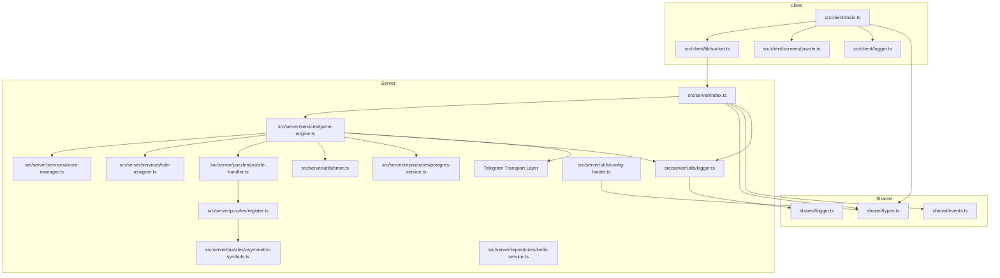
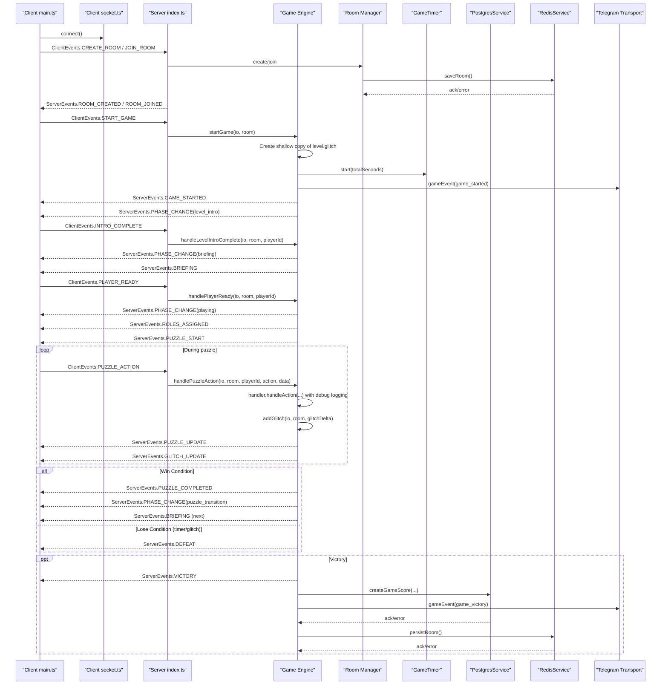
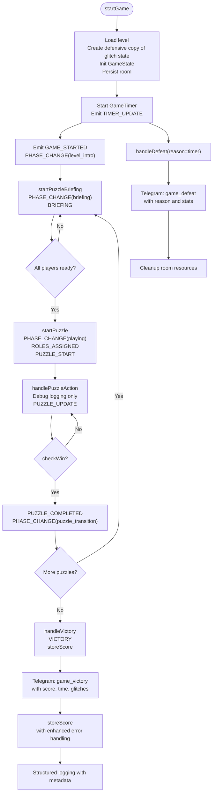
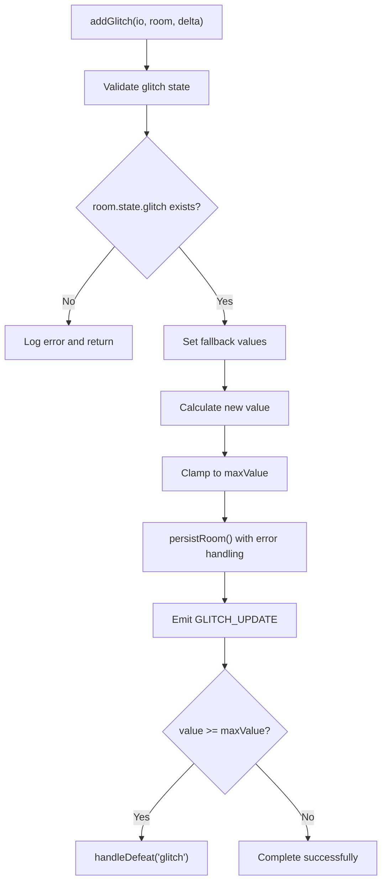
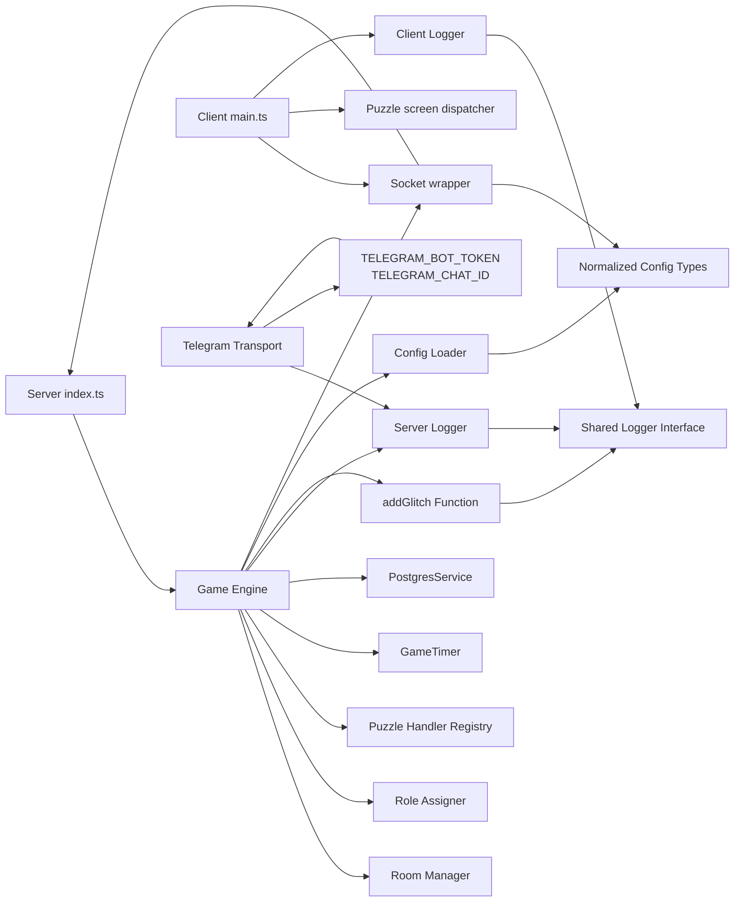

# Game Engine

<cite>
**Referenced Files in This Document**
- [ARCHITECTURE.md](file://ARCHITECTURE.md)
- [README.md](file://README.md)
- [src/server/index.ts](file://src/server/index.ts)
- [src/server/services/game-engine.ts](file://src/server/services/game-engine.ts)
- [src/server/services/room-manager.ts](file://src/server/services/room-manager.ts)
- [src/server/services/role-assigner.ts](file://src/server/services/role-assigner.ts)
- [src/server/puzzles/puzzle-handler.ts](file://src/server/puzzles/puzzle-handler.ts)
- [src/server/puzzles/register.ts](file://src/server/puzzles/register.ts)
- [src/server/puzzles/asymmetric-symbols.ts](file://src/server/puzzles/asymmetric-symbols.ts)
- [src/server/utils/timer.ts](file://src/server/utils/timer.ts)
- [src/server/repositories/postgres-service.ts](file://src/server/repositories/postgres-service.ts)
- [src/server/repositories/redis-service.ts](file://src/server/repositories/redis-service.ts)
- [src/server/utils/logger.ts](file://src/server/utils/logger.ts)
- [src/server/utils/config-loader.ts](file://src/server/utils/config-loader.ts)
- [shared/types.ts](file://shared/types.ts)
- [shared/events.ts](file://shared/events.ts)
- [shared/logger.ts](file://shared/logger.ts)
- [src/client/main.ts](file://src/client/main.ts)
- [src/client/lib/socket.ts](file://src/client/lib/socket.ts)
- [src/client/screens/puzzle.ts](file://src/client/screens/puzzle.ts)
- [src/client/logger.ts](file://src/client/logger.ts)
</cite>

## Update Summary
**Changes Made**
- Integrated Telegram notification system into game engine for automatic game event notifications
- Added comprehensive Telegram transport with error handling and cooldown mechanisms
- Implemented automatic notifications for game starts, victories, and defeats with rich metadata
- Enhanced logging infrastructure with game event tracking capabilities
- Added environment variable configuration for Telegram bot integration
- Implemented structured game event notifications with room codes, player counts, scores, and completion statistics

## Table of Contents
1. [Introduction](#introduction)
2. [Project Structure](#project-structure)
3. [Core Components](#core-components)
4. [Architecture Overview](#architecture-overview)
5. [Detailed Component Analysis](#detailed-component-analysis)
6. [Enhanced Error Handling and Logging](#enhanced-error-handling-and-logging)
7. [Telegram Notification System](#telegram-notification-system)
8. [Glitch Management System](#glitch-management-system)
9. [Scoring System Enhancement](#scoring-system-enhancement)
10. [Dependency Analysis](#dependency-analysis)
11. [Performance Considerations](#performance-considerations)
12. [Troubleshooting Guide](#troubleshooting-guide)
13. [Conclusion](#conclusion)

## Introduction
This document describes the Game Engine that powers Project ODYSSEY, a co-op escape room experience for 2–6 players. The engine orchestrates game phases, puzzle lifecycle, asynchronous roles, and persistent state across a real-time multiplayer environment. It is implemented with Bun (server), Socket.io (real-time), and a vanilla TypeScript/Vite client. Levels and puzzles are configured via YAML, enabling rapid iteration without touching core engine code.

**Updated** Enhanced with comprehensive error handling, defensive programming, robust glitch management, improved game state immutability, a fixed critical scoring calculation bug, and integrated Telegram notification system for automated game event communications.

## Project Structure
The repository is organized into server, client, shared, and data layers:
- Server: Socket.io entry point, game engine, room management, puzzle handlers, persistence, and utilities
- Client: Vite-served vanilla TypeScript UI with screens, puzzle renderers, and audio
- Shared: Strongly typed domain models, events, and logging infrastructure
- Data: Prisma schema and PostgreSQL service for scores; Redis-backed room persistence



**Diagram sources**
- [src/client/main.ts:1-266](file://src/client/main.ts#L1-L266)
- [src/client/lib/socket.ts:1-85](file://src/client/lib/socket.ts#L1-L85)
- [src/client/screens/puzzle.ts:1-101](file://src/client/screens/puzzle.ts#L1-L101)
- [src/client/logger.ts:1-38](file://src/client/logger.ts#L1-L38)
- [src/server/index.ts:1-321](file://src/server/index.ts#L1-L321)
- [src/server/services/game-engine.ts:1-820](file://src/server/services/game-engine.ts#L1-L820)
- [src/server/services/room-manager.ts:1-283](file://src/server/services/room-manager.ts#L1-L283)
- [src/server/services/role-assigner.ts:1-78](file://src/server/services/role-assigner.ts#L1-L78)
- [src/server/puzzles/puzzle-handler.ts:1-56](file://src/server/puzzles/puzzle-handler.ts#L1-L56)
- [src/server/puzzles/register.ts:1-21](file://src/server/puzzles/register.ts#L1-L21)
- [src/server/puzzles/asymmetric-symbols.ts:1-170](file://src/server/puzzles/asymmetric-symbols.ts#L1-L170)
- [src/server/utils/timer.ts:1-81](file://src/server/utils/timer.ts#L1-L81)
- [src/server/repositories/postgres-service.ts:1-83](file://src/server/repositories/postgres-service.ts#L1-L83)
- [src/server/repositories/redis-service.ts:1-50](file://src/server/repositories/redis-service.ts#L1-L50)
- [src/server/utils/logger.ts:1-181](file://src/server/utils/logger.ts#L1-L181)
- [src/server/utils/config-loader.ts:1-147](file://src/server/utils/config-loader.ts#L1-L147)
- [shared/types.ts:1-181](file://shared/types.ts#L1-L181)
- [shared/events.ts:1-228](file://shared/events.ts#L1-L228)
- [shared/logger.ts:1-22](file://shared/logger.ts#L1-L22)

**Section sources**
- [ARCHITECTURE.md:35-107](file://ARCHITECTURE.md#L35-L107)
- [README.md:79-98](file://README.md#L79-L98)

## Core Components
- Game Engine: Central state machine managing phases (lobby → level_intro → briefing → playing → puzzle_transition → … → victory/defeat), timers, glitch mechanics, and scoring
- Room Manager: In-memory room CRUD with Redis serialization/deserialization for persistence
- Role Assigner: Randomized role assignment per puzzle based on YAML layout definitions
- Puzzle Handlers: Pluggable implementations of a common interface for puzzle logic, views, and win conditions
- Timer: Server-authoritative countdown with resume on restart
- Postgres Service: Score persistence and leaderboard queries with enhanced error handling
- Redis Service: Persistent room storage with comprehensive error logging
- Client: Socket.io wrapper, screen orchestration, puzzle renderers, and structured logging
- Logger Infrastructure: Unified logging system with Winston for server and custom logger for client, now enhanced with Telegram notification capabilities
- Config Loader: YAML-based level configuration loading with hot-reload and property normalization

**Updated** Enhanced with defensive copying of configuration objects to prevent direct modifications, improved logging granularity for production environments, robust error handling across all components, a fixed critical scoring calculation bug that ensures fairer gameplay experiences, and integrated Telegram notification system for automated game event communications.

**Section sources**
- [src/server/services/game-engine.ts:1-820](file://src/server/services/game-engine.ts#L1-L820)
- [src/server/services/room-manager.ts:1-283](file://src/server/services/room-manager.ts#L1-L283)
- [src/server/services/role-assigner.ts:1-78](file://src/server/services/role-assigner.ts#L1-L78)
- [src/server/puzzles/puzzle-handler.ts:1-56](file://src/server/puzzles/puzzle-handler.ts#L1-L56)
- [src/server/utils/timer.ts:1-81](file://src/server/utils/timer.ts#L1-L81)
- [src/server/repositories/postgres-service.ts:1-83](file://src/server/repositories/postgres-service.ts#L1-L83)
- [src/server/repositories/redis-service.ts:1-50](file://src/server/repositories/redis-service.ts#L1-L50)
- [src/client/main.ts:1-266](file://src/client/main.ts#L1-L266)
- [src/client/logger.ts:1-38](file://src/client/logger.ts#L1-L38)
- [src/server/utils/logger.ts:1-181](file://src/server/utils/logger.ts#L1-L181)
- [shared/logger.ts:1-22](file://shared/logger.ts#L1-L22)
- [src/server/utils/config-loader.ts:1-147](file://src/server/utils/config-loader.ts#L1-L147)

## Architecture Overview
The system uses a real-time, event-driven architecture with enhanced error handling, robust state management, and defensive programming practices:
- Client connects via Socket.io and listens for server events
- Server routes events to the Game Engine, which updates room state and broadcasts UI updates
- Puzzle handlers encapsulate game logic; the engine delegates actions to them generically
- Roles and views are computed per puzzle; only the engine knows the current phase and state
- Comprehensive error handling with structured logging and metadata for debugging
- Robust glitch management with defensive programming and fallback mechanisms
- **Enhanced** Game state immutability through defensive copying of configuration objects
- **Enhanced** Fair scoring system using level-specific time constraints instead of arbitrary constants
- **Enhanced** Integrated Telegram notification system for automated game event communications



**Diagram sources**
- [src/client/main.ts:1-266](file://src/client/main.ts#L1-L266)
- [src/client/lib/socket.ts:1-85](file://src/client/lib/socket.ts#L1-L85)
- [src/server/index.ts:1-321](file://src/server/index.ts#L1-L321)
- [src/server/services/game-engine.ts:1-820](file://src/server/services/game-engine.ts#L1-L820)
- [src/server/utils/timer.ts:1-81](file://src/server/utils/timer.ts#L1-L81)
- [src/server/repositories/postgres-service.ts:1-83](file://src/server/repositories/postgres-service.ts#L1-L83)
- [src/server/repositories/redis-service.ts:1-50](file://src/server/repositories/redis-service.ts#L1-L50)
- [src/server/utils/logger.ts:1-181](file://src/server/utils/logger.ts#L1-L181)

## Detailed Component Analysis

### Game Engine
Responsibilities:
- Initialize and transition between game phases
- Manage timers and broadcast updates
- Coordinate puzzle start, action handling, and completion
- Compute scores and persist results
- Handle reconnections and debug utilities
- **Enhanced** Implement defensive copying to prevent level configuration mutations
- **Enhanced** Comprehensive error handling with structured logging and metadata
- **Enhanced** Robust glitch management with defensive programming and fallback mechanisms
- **Enhanced** Fair scoring system using level-specific time constraints
- **Enhanced** Integrated Telegram notification system for automated game event communications

Key flows:
- startGame: validates level, creates defensive copy of glitch state, initializes state, starts global timer, emits start events, and sends Telegram notification with room code, level ID, and player count
- handlePlayerReady: advances from briefing to puzzle when all players are ready
- handlePuzzleAction: delegates to the active handler with debug logging, applies glitch penalties, and rebroadcasts views
- handleVictory/handleDefeat: computes score using level.timer_seconds, persists to DB, sends Telegram notifications with comprehensive metadata including scores, completion times, and puzzle statistics, and cleans up timers with enhanced logging
- **Enhanced** addGlitch: centralized glitch management with comprehensive validation and error handling

**Updated** Enhanced error handling with comprehensive error metadata including error messages, stack traces, and error names for better debugging. Improved logging coverage for victory handling processes including room validation, player verification, persistence attempts, and event emissions. Implemented defensive copying of level configuration objects to prevent direct mutations. Fixed critical scoring calculation bug to ensure fairer gameplay experiences. Integrated Telegram notification system for automated game event communications.



**Diagram sources**
- [src/server/services/game-engine.ts:125-147](file://src/server/services/game-engine.ts#L125-L147)
- [src/server/services/game-engine.ts:595-621](file://src/server/services/game-engine.ts#L595-L621)
- [src/server/services/game-engine.ts:626-659](file://src/server/services/game-engine.ts#L626-L659)

**Section sources**
- [src/server/services/game-engine.ts:1-820](file://src/server/services/game-engine.ts#L1-L820)

### Room Manager
Responsibilities:
- Create, join, leave rooms
- Serialize/deserialize rooms to/from Redis
- Track players, host, and room state
- Provide room lookup and player lists
- **Enhanced** Comprehensive error logging for all persistence operations
- **Enhanced** Room state migration and validation for legacy configurations

Integration:
- Used by the Game Engine for room state and persistence
- Used by the server's Socket.io handlers for room operations
- **Enhanced** Structured error logging for Redis operations and room state management
- **Enhanced** Automatic migration of legacy room state formats

**Updated** Enhanced with comprehensive error logging for all persistence operations including room creation, joining, leaving, and state synchronization. Implemented automatic room state migration to fix legacy configurations and ensure consistent glitch state properties.

**Section sources**
- [src/server/services/room-manager.ts:1-283](file://src/server/services/room-manager.ts#L1-L283)

### Role Assigner
Responsibilities:
- Randomly assign roles per puzzle based on layout definitions
- Support "remaining" distribution and single-player debug behavior

Behavior:
- Fisher–Yates shuffle ensures randomized role distribution
- Ensures deterministic assignment per puzzle start

**Section sources**
- [src/server/services/role-assigner.ts:1-78](file://src/server/services/role-assigner.ts#L1-L78)

### Puzzle Handler Interface and Registry
Responsibilities:
- Define the contract for all puzzle logic
- Provide registration and retrieval of handlers

Contract:
- init: build initial puzzle state
- handleAction: process player actions and return state + glitch delta
- checkWin: determine victory
- getPlayerView: role-specific view data

Registration:
- All puzzle handlers are imported and registered at startup

**Section sources**
- [src/server/puzzles/puzzle-handler.ts:1-56](file://src/server/puzzles/puzzle-handler.ts#L1-L56)
- [src/server/puzzles/register.ts:1-21](file://src/server/puzzles/register.ts#L1-L21)

### Example Puzzle: Asymmetric Symbols
Logic highlights:
- Words are shuffled and a subset selected per round
- Capturing correct letters completes segments; wrong captures incur glitch penalty
- Navigator sees solution; decoders see fly-in letters and capture state

Client rendering:
- The puzzle screen dispatches to the appropriate renderer based on type

**Section sources**
- [src/server/puzzles/asymmetric-symbols.ts:1-170](file://src/server/puzzles/asymmetric-symbols.ts#L1-L170)
- [src/client/screens/puzzle.ts:1-101](file://src/client/screens/puzzle.ts#L1-L101)

### Timer
Responsibilities:
- Server-authoritative countdown
- Resume on server restart using persisted room state
- Emit periodic updates and expire on zero

**Section sources**
- [src/server/utils/timer.ts:1-81](file://src/server/utils/timer.ts#L1-L81)
- [src/server/services/game-engine.ts:679-705](file://src/server/services/game-engine.ts#L679-L705)

### Postgres Service
Responsibilities:
- Persist game scores after victory
- Retrieve top scores for leaderboard
- **Enhanced** Comprehensive error handling with structured logging

Schema:
- GameScore model stores room, players, time remaining, glitches, score, and timestamp

**Updated** Enhanced error handling with comprehensive error metadata including error messages, stack traces, and error names for better debugging.

**Section sources**
- [src/server/repositories/postgres-service.ts:1-83](file://src/server/repositories/postgres-service.ts#L1-L83)
- [shared/types.ts:174-182](file://shared/types.ts#L174-L182)

### Redis Service
Responsibilities:
- Persistent room storage with JSON serialization
- Room restoration from Redis on join attempts
- Connection monitoring with structured logging

**Updated** Enhanced with comprehensive error logging for Redis operations including connection errors, save operations, and room restoration attempts.

**Section sources**
- [src/server/repositories/redis-service.ts:1-50](file://src/server/repositories/redis-service.ts#L1-L50)

### Config Loader
Responsibilities:
- Load YAML level configurations with hot-reload capability
- Normalize snake_case properties to camelCase for runtime compatibility
- Validate level configurations and provide hot-reload functionality

Key Features:
- Property transformation: Converts YAML properties like `max`, `decay_rate` to `maxValue`, `decayRate`
- Hot-reload: Watches for configuration file changes and automatically reloads
- Validation: Ensures all required fields are present and properly formatted

**Updated** Enhanced with comprehensive property normalization from YAML snake_case to TypeScript camelCase format, ensuring consistent runtime behavior across different configuration sources.

**Section sources**
- [src/server/utils/config-loader.ts:1-147](file://src/server/utils/config-loader.ts#L1-L147)

### Client: Socket Wrapper and Screens
Responsibilities:
- Typed Socket.io wrapper for emitting and listening to events
- Screen orchestration and HUD updates (timer, glitch meter)
- Puzzle renderer dispatch based on type
- **Enhanced** Structured logging with configurable log levels

Event wiring:
- Client listens for game flow events and triggers screen transitions
- Emits gameplay events like puzzle actions and readiness
- **Enhanced** Configurable log levels (DEBUG, INFO, WARN, ERROR) with metadata support

**Updated** Enhanced with configurable log levels and structured logging capabilities for better debugging and operational visibility.

**Section sources**
- [src/client/lib/socket.ts:1-85](file://src/client/lib/socket.ts#L1-L85)
- [src/client/main.ts:1-266](file://src/client/main.ts#L1-L266)
- [src/client/screens/puzzle.ts:1-101](file://src/client/screens/puzzle.ts#L1-L101)
- [src/client/logger.ts:1-38](file://src/client/logger.ts#L1-L38)

## Enhanced Error Handling and Logging

### Server-Side Logging Infrastructure
The server implements a comprehensive logging system using Winston with structured logging capabilities and enhanced Telegram integration:

- **Log Levels**: DEBUG, INFO, WARN, ERROR with configurable thresholds
- **Structured Metadata**: All log entries include timestamps, levels, messages, and contextual metadata
- **Error Context**: Comprehensive error metadata including error messages, stack traces, and error names
- **Component-Specific Logging**: Each module maintains its own logger instance with appropriate context
- **Enhanced** Telegram Notification Integration: Automatic Telegram alerts for critical errors and game events

### Key Logging Enhancements
- **Error Metadata**: All error logs now include comprehensive metadata such as error messages, stack traces, and error names
- **Room Validation**: Enhanced logging for room operations including validation, persistence, and state changes
- **Player Verification**: Detailed logging for player actions, role assignments, and state synchronization
- **Persistence Attempts**: Comprehensive logging for Redis and database operations with success/failure indicators
- **Event Emissions**: Structured logging for all server-client communications and state changes
- **Production Optimization**: Reduced logging verbosity by changing puzzle action processing from INFO to DEBUG level
- **Enhanced** Game Event Tracking: Structured logging specifically for game events with comprehensive metadata
- **Enhanced** Telegram Integration: Automatic notifications for game starts, victories, and defeats

### Client-Side Logging
The client implements a lightweight logging system with configurable levels:

- **Configurable Levels**: Runtime control of log verbosity via environment variables
- **Metadata Support**: Console logging with structured metadata for debugging
- **Environment-Based**: Development environments default to DEBUG level, production to INFO

### Error Handling Patterns
All major functions now follow consistent error handling patterns:

```typescript
try {
  // Main operation
} catch (err) {
  const errorDetails = err instanceof Error 
    ? { message: err.message, stack: err.stack, name: err.name }
    : { value: String(err) };
  logger.error("Operation failed", { err: errorDetails, context: additionalContext });
}
```

**Updated** Enhanced logging granularity with puzzle action processing now using DEBUG level instead of INFO to reduce production log noise while maintaining detailed debugging information. Integrated comprehensive Telegram notification system for automated game event communications.

**Section sources**
- [src/server/utils/logger.ts:1-181](file://src/server/utils/logger.ts#L1-L181)
- [src/server/services/game-engine.ts:131-137](file://src/server/services/game-engine.ts#L131-L137)
- [src/server/services/game-engine.ts:604-611](file://src/server/services/game-engine.ts#L604-L611)
- [src/server/services/game-engine.ts:647-653](file://src/server/services/game-engine.ts#L647-L653)
- [src/server/services/room-manager.ts:78-244](file://src/server/services/room-manager.ts#L78-L244)
- [src/server/repositories/postgres-service.ts:42-54](file://src/server/repositories/postgres-service.ts#L42-L54)
- [src/server/repositories/redis-service.ts:9-15](file://src/server/repositories/redis-service.ts#L9-L15)
- [src/client/logger.ts:1-38](file://src/client/logger.ts#L1-L38)
- [shared/logger.ts:1-22](file://shared/logger.ts#L1-L22)

## Telegram Notification System

### Integrated Telegram Transport Layer
The Telegram notification system is implemented as a custom Winston transport that automatically handles error notifications and game event communications:

**Telegram Transport Features:**
- **Automatic Error Alerts**: Critical errors trigger Telegram notifications with cooldown protection (1-minute minimum between alerts)
- **Game Event Notifications**: Automatic notifications for game starts, victories, and defeats with comprehensive metadata
- **MarkdownV2 Formatting**: Rich text formatting with bold headers and code blocks for readability
- **Environment Configuration**: Seamless integration using TELEGRAM_BOT_TOKEN and TELEGRAM_CHAT_ID environment variables
- **Non-blocking Operations**: Notifications don't interfere with normal game operations

**Error Alert Mechanism:**
- **Cooldown Protection**: Prevents spam by limiting error notifications to once per minute
- **Structured Error Messages**: Includes error messages, stack traces, and contextual metadata
- **Escaped Markdown**: Special characters are properly escaped to prevent Markdown parsing issues

**Game Event Notification Formats:**
- **Game Started**: Room code, level ID, and player count
- **Victory**: Room code, score, completion time, glitch count, and puzzles completed
- **Defeat**: Room code, reason, puzzles completed, and puzzle reached index

**Environment Configuration:**
- **TELEGRAM_BOT_TOKEN**: Bot token for authentication with Telegram API
- **TELEGRAM_CHAT_ID**: Target chat ID for receiving notifications
- **Automatic Activation**: Transport is added to Winston logger when both environment variables are present

**Section sources**
- [src/server/utils/logger.ts:1-181](file://src/server/utils/logger.ts#L1-L181)
- [src/server/services/game-engine.ts:131-137](file://src/server/services/game-engine.ts#L131-L137)
- [src/server/services/game-engine.ts:604-611](file://src/server/services/game-engine.ts#L604-L611)
- [src/server/services/game-engine.ts:647-653](file://src/server/services/game-engine.ts#L647-L653)

## Glitch Management System

### Enhanced addGlitch Function
The addGlitch function has been significantly enhanced with comprehensive defensive programming and error handling:

**Defensive Programming Checks:**
- Validates that room.state.glitch exists before processing
- Provides fallback values for maxValue (defaults to 100) and currentValue (defaults to 0)
- Ensures state integrity by setting maxValue consistently

**Enhanced Error Handling:**
- Comprehensive try-catch blocks with detailed error metadata
- Structured logging with room codes, delta values, and current glitch states
- Graceful degradation when persistence fails

**Improved Persistence Handling:**
- Non-blocking persistence attempts with error catching
- Detailed error reporting with stack traces and contextual information
- Continued operation even when persistence fails

**State Validation:**
- Prevents overflow by using Math.min for value clamping
- Maintains consistency between value and maxValue fields
- Triggers defeat conditions when glitch reaches maximum threshold

**Client Integration:**
- Emits GLITCH_UPDATE events with complete glitch state
- Updates client HUD with visual feedback and screen shake effects
- Provides real-time glitch intensity visualization



**Diagram sources**
- [src/server/services/game-engine.ts:458-506](file://src/server/services/game-engine.ts#L458-L506)

**Section sources**
- [src/server/services/game-engine.ts:458-506](file://src/server/services/game-engine.ts#L458-L506)
- [src/client/main.ts:113-140](file://src/client/main.ts#L113-L140)
- [shared/types.ts:51-56](file://shared/types.ts#L51-L56)
- [shared/events.ts:205-207](file://shared/events.ts#L205-L207)

## Scoring System Enhancement

### Fixed Critical Scoring Calculation Bug
The scoring system has been enhanced with a critical bug fix that ensures fairer gameplay experiences:

**Previous Issues:**
- Scoring algorithm used hardcoded constants (1000 seconds and 1000 glitch penalty caps)
- Scores were not proportional to intended difficulty and time constraints of each level
- Different levels with varying time limits produced unfair score comparisons

**Fixed Implementation:**
- The `calculateScore` function now properly uses `level.timer_seconds` instead of hardcoded constants
- Time-based scoring is now proportional to the intended difficulty of each level
- Glitch penalties maintain their relative weight while being applied to level-specific time limits
- Score calculation formula: `(Math.max(0, levelTime - elapsedSeconds) * 10) - (glitchFinal * 50)`

**Benefits:**
- Fairer gameplay across different level difficulties
- Scores now accurately reflect player performance relative to level constraints
- Elimination of arbitrary constants that previously skewed scoring
- Consistent scoring mechanics regardless of level design

**Algorithm Details:**
- Time score: `Math.max(0, levelTime - elapsedSeconds) * 10`
- Glitch penalty: `glitchFinal * 50`
- Final score: `Math.max(0, timeScore - glitchPenalty)`

**Section sources**
- [src/server/services/game-engine.ts:509-514](file://src/server/services/game-engine.ts#L509-L514)
- [src/server/services/game-engine.ts:584-589](file://src/server/services/game-engine.ts#L584-L589)

## Dependency Analysis
High-level dependencies:
- Server entry depends on Game Engine, Room Manager, Puzzle Registry, Timer, and Postgres
- Game Engine depends on Room Manager, Role Assigner, Timer, Postgres, and Puzzle Registry
- Client depends on Socket wrapper and event definitions
- **Enhanced** All components depend on unified logging infrastructure with Telegram integration
- **Enhanced** Glitch management system integrates with all puzzle handlers
- **Enhanced** Config Loader provides normalized configuration data to Game Engine
- **Enhanced** Scoring system now depends on level-specific timer constraints
- **Enhanced** Telegram notification system integrates with Winston logging infrastructure



**Diagram sources**
- [src/server/index.ts:1-321](file://src/server/index.ts#L1-L321)
- [src/server/services/game-engine.ts:1-820](file://src/server/services/game-engine.ts#L1-L820)
- [src/server/services/room-manager.ts:1-283](file://src/server/services/room-manager.ts#L1-L283)
- [src/server/services/role-assigner.ts:1-78](file://src/server/services/role-assigner.ts#L1-L78)
- [src/server/puzzles/puzzle-handler.ts:1-56](file://src/server/puzzles/puzzle-handler.ts#L1-L56)
- [src/server/utils/timer.ts:1-81](file://src/server/utils/timer.ts#L1-L81)
- [src/server/repositories/postgres-service.ts:1-83](file://src/server/repositories/postgres-service.ts#L1-L83)
- [src/client/main.ts:1-266](file://src/client/main.ts#L1-L266)
- [src/client/lib/socket.ts:1-85](file://src/client/lib/socket.ts#L1-L85)
- [src/client/screens/puzzle.ts:1-101](file://src/client/screens/puzzle.ts#L1-L101)
- [src/client/logger.ts:1-38](file://src/client/logger.ts#L1-L38)
- [src/server/utils/logger.ts:1-181](file://src/server/utils/logger.ts#L1-L181)
- [shared/logger.ts:1-22](file://shared/logger.ts#L1-L22)
- [src/server/utils/config-loader.ts:1-147](file://src/server/utils/config-loader.ts#L1-L147)

**Section sources**
- [src/server/index.ts:1-321](file://src/server/index.ts#L1-L321)
- [src/server/services/game-engine.ts:1-820](file://src/server/services/game-engine.ts#L1-L820)

## Performance Considerations
- Real-time updates: Keep puzzle update payloads minimal; avoid frequent full-state replays
- Network resilience: Socket.io reconnection is enabled; ensure client-side backoff and retry logic
- Timer accuracy: Server-authoritative timing prevents desync; clients should treat server updates as canonical
- Persistence: Redis serialization occurs on every mutation; batch operations if extending
- Scrolling leaderboards: Fetch paginated top scores to reduce payload sizes
- **Enhanced** Logging overhead: Structured logging adds minimal performance impact while providing comprehensive debugging capabilities
- **Enhanced** Glitch management: Defensive programming adds minimal overhead but prevents critical failures
- **Enhanced** Client-side glitch HUD: Optimized DOM manipulation with efficient CSS property updates
- **Enhanced** Game state immutability: Defensive copying of configuration objects adds negligible overhead for security benefits
- **Enhanced** Scoring performance: Fixed scoring calculation eliminates unnecessary constant operations and improves algorithmic efficiency
- **Enhanced** Telegram integration: Non-blocking notifications don't interfere with game operations; cooldown protection prevents spam
- **Enhanced** Environment variable loading: Telegram configuration is checked once during logger initialization

## Troubleshooting Guide
Common issues and diagnostics:
- Connection failures: Verify Socket.io client initialization and CORS configuration
- Missing level or invalid room state: Check level selection and Room Manager persistence
- Stuck timers: Confirm GameTimer lifecycle and resume on startup
- Score recording errors: Validate DATABASE_URL and Prisma client generation
- Asymmetric roles not applied: Ensure Role Assigner runs before puzzle start and getPlayerView is invoked per player
- **Enhanced** Error debugging: Use structured logs with error metadata for comprehensive troubleshooting
- **Enhanced** Room persistence issues: Monitor Redis connectivity and error logs for persistence failures
- **Enhanced** Client-side debugging: Configure log levels via environment variables for different verbosity levels
- **Enhanced** Glitch state corruption: Check for null/undefined glitch states and verify fallback mechanisms
- **Enhanced** Persistence failures: Monitor error logs for failed room saves and implement retry strategies
- **Enhanced** Configuration object mutations: Verify that level configurations are not being directly modified by checking for defensive copying
- **Enhanced** Scoring inconsistencies: Verify that level.timer_seconds is properly loaded and used in calculateScore function
- **Enhanced** Telegram notification issues: Check TELEGRAM_BOT_TOKEN and TELEGRAM_CHAT_ID environment variables; verify network connectivity to Telegram API
- **Enhanced** Game event tracking: Use logger.gameEvent() calls to monitor game progress and verify notification delivery

Operational checks:
- Server logs indicate initialization steps and error contexts with comprehensive metadata
- Client logs surface event handling and UI updates with configurable verbosity
- Use debug toggle to inspect role-specific views
- **Enhanced** Error correlation: Use room codes and player IDs to correlate server and client logs
- **Enhanced** Error patterns: Monitor for recurring error patterns and metadata anomalies
- **Enhanced** Glitch state monitoring: Track glitch value changes and persistence failures
- **Enhanced** Production logging: Verify that puzzle action processing uses DEBUG level to minimize log noise
- **Enhanced** Scoring verification: Compare calculated scores with expected level-specific time constraints
- **Enhanced** Telegram configuration: Verify environment variables are properly set and logger indicates Telegram transport activation
- **Enhanced** Game event verification: Monitor Telegram channel for automatic notifications during game sessions

**Section sources**
- [src/server/index.ts:64-84](file://src/server/index.ts#L64-L84)
- [src/server/services/game-engine.ts:679-705](file://src/server/services/game-engine.ts#L679-L705)
- [src/server/repositories/postgres-service.ts:1-83](file://src/server/repositories/postgres-service.ts#L1-L83)
- [src/client/main.ts:1-266](file://src/client/main.ts#L1-L266)
- [src/server/utils/logger.ts:1-181](file://src/server/utils/logger.ts#L1-L181)
- [src/client/logger.ts:1-38](file://src/client/logger.ts#L1-L38)

## Conclusion
The Game Engine provides a robust, extensible foundation for co-op escape rooms with significantly enhanced error handling, defensive programming, comprehensive glitch management capabilities, and integrated Telegram notification system. The enhanced addGlitch function exemplifies these improvements with its comprehensive validation, fallback mechanisms, and graceful error handling. The robust logging system with Winston provides consistent error tracking across all components, while the client-side logging infrastructure offers configurable verbosity levels for different deployment scenarios.

**Critical Bug Fix**: The most significant enhancement is the fix to the critical scoring calculation bug in the `calculateScore` function. The scoring algorithm now properly uses `level.timer_seconds` instead of hardcoded constants (1000 seconds and 1000 glitch penalty caps). This ensures scores are proportional to intended difficulty and time constraints of each level, providing fairer gameplay experiences across different level designs.

**Telegram Notification Integration**: The most notable addition is the comprehensive Telegram notification system that automatically communicates game events to administrators and operators. This system provides real-time visibility into game progress with rich metadata including room codes, player counts, scores, completion times, and puzzle statistics. The integration is seamless, non-blocking, and includes intelligent error handling with cooldown protection.

**Additional Improvements**: The removal of the TODO comment regarding Redis persistence for timer state indicates progress toward more robust state management. The enhanced game state immutability through defensive copying of configuration objects ensures game stability and prevents configuration corruption. The adjustment to DEBUG level logging for puzzle actions reduces production log noise while maintaining detailed debugging information. The integration of Telegram notifications enhances operational oversight and provides immediate alerts for critical game events.

The separation of concerns across server, client, and shared modules yields maintainability and clarity for both contributors and operators, now enhanced with comprehensive error handling, defensive programming, resilient state management, improved configuration safety, a fairer scoring system, and comprehensive Telegram notification capabilities that make the overall system significantly more robust, production-ready, and operable.