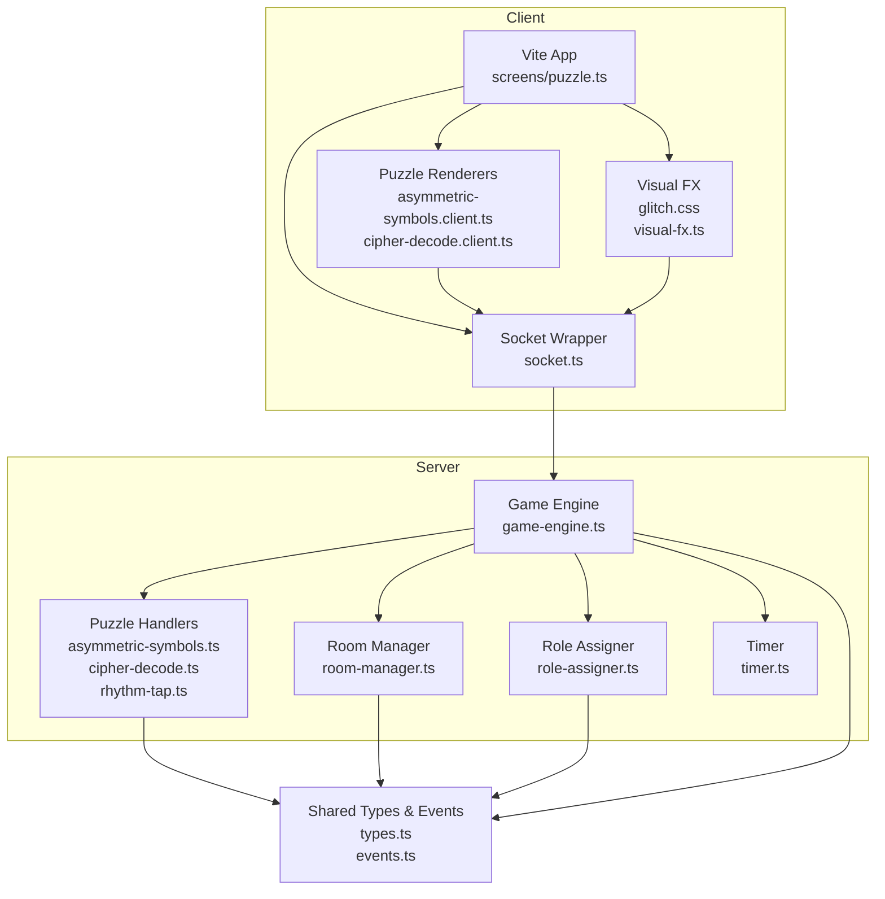
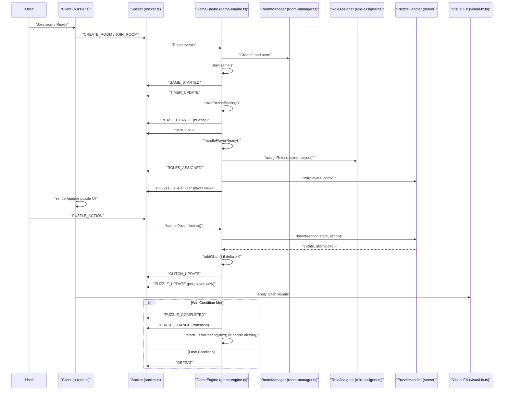
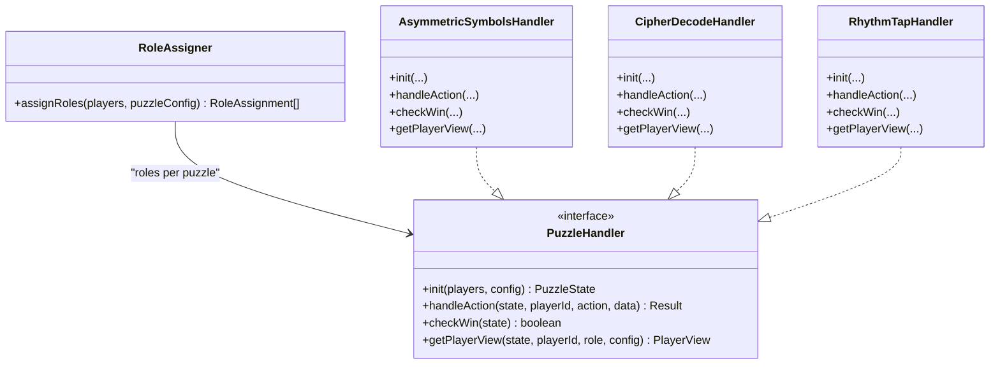
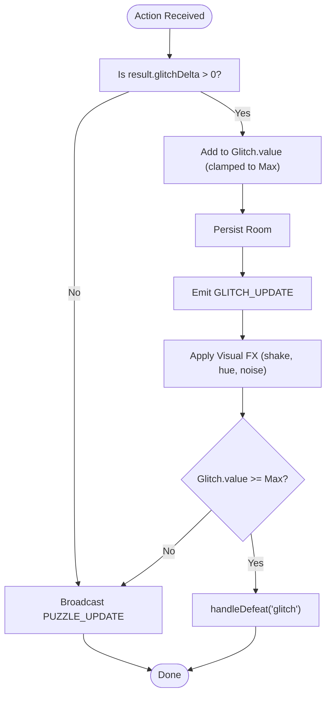
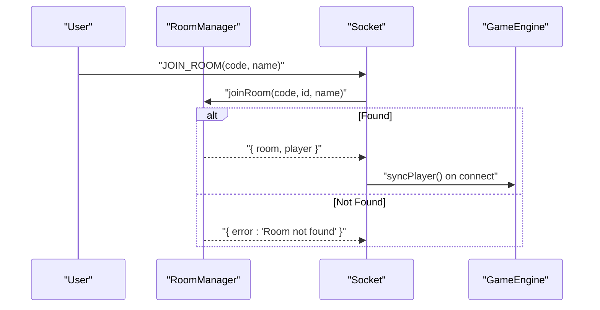
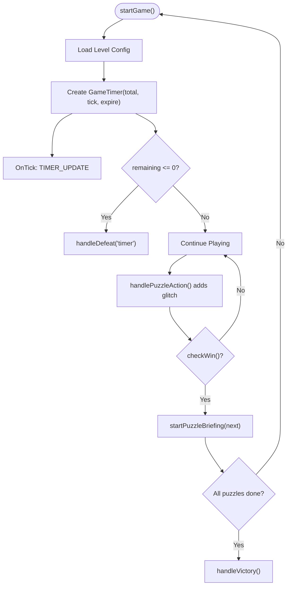
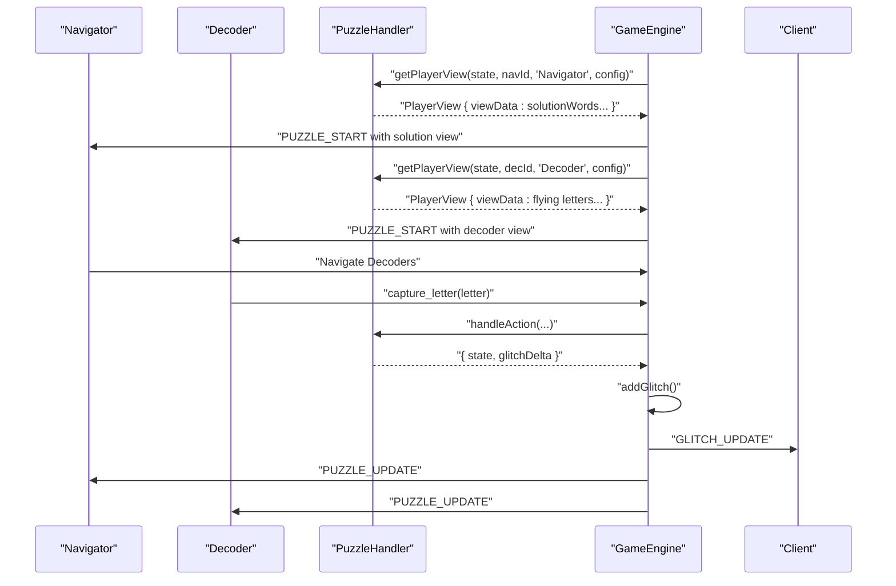
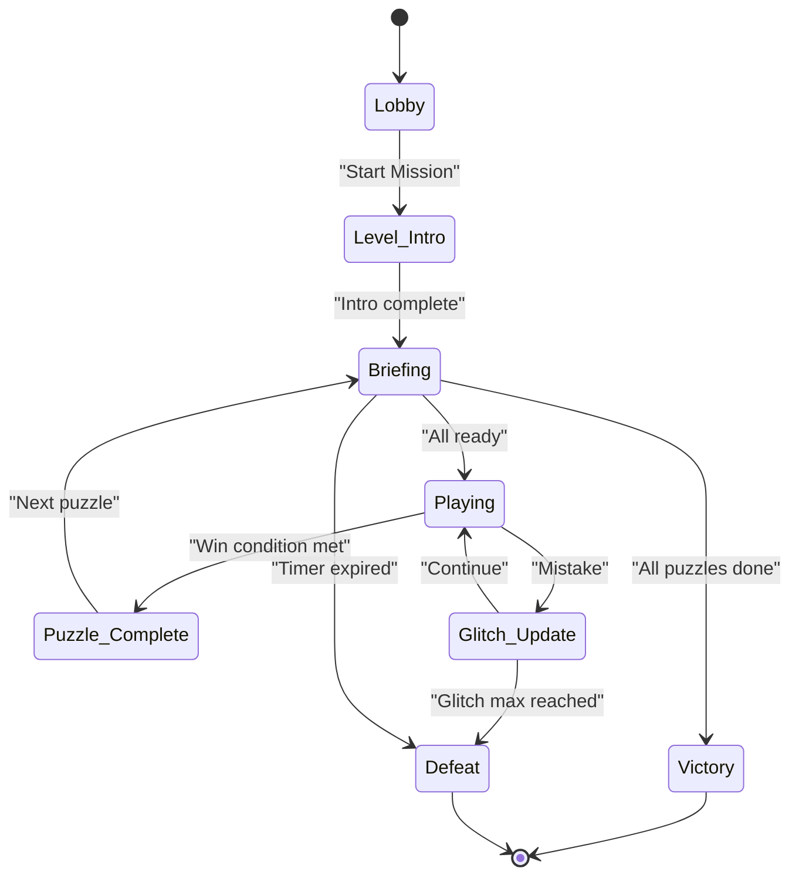
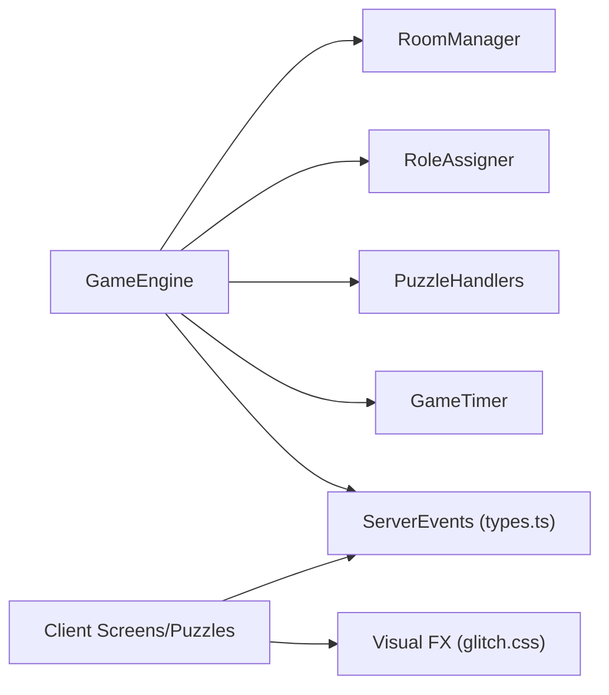

# Game Mechanics

<cite>
**Referenced Files in This Document**
- [README.md](file://README.md)
- [ARCHITECTURE.md](file://ARCHITECTURE.md)
- [types.ts](file://shared/types.ts)
- [events.ts](file://shared/events.ts)
- [game-engine.ts](file://src/server/services/game-engine.ts)
- [room-manager.ts](file://src/server/services/room-manager.ts)
- [role-assigner.ts](file://src/server/services/role-assigner.ts)
- [timer.ts](file://src/server/utils/timer.ts)
- [puzzle-handler.ts](file://src/server/puzzles/puzzle-handler.ts)
- [register.ts](file://src/server/puzzles/register.ts)
- [asymmetric-symbols.ts](file://src/server/puzzles/asymmetric-symbols.ts)
- [cipher-decode.ts](file://src/server/puzzles/cipher-decode.ts)
- [rhythm-tap.ts](file://src/server/puzzles/rhythm-tap.ts)
- [puzzle.ts](file://src/client/screens/puzzle.ts)
- [glitch.css](file://src/client/styles/glitch.css)
- [visual-fx.ts](file://src/client/lib/visual-fx.ts)
- [asymmetric-symbols.client.ts](file://src/client/puzzles/asymmetric-symbols.ts)
- [cipher-decode.client.ts](file://src/client/puzzles/cipher-decode.ts)
- [socket.ts](file://src/client/lib/socket.ts)
- [level_01.yaml](file://config/level_01.yaml)
</cite>

## Table of Contents
1. [Introduction](#introduction)
2. [Project Structure](#project-structure)
3. [Core Components](#core-components)
4. [Architecture Overview](#architecture-overview)
5. [Detailed Component Analysis](#detailed-component-analysis)
6. [Dependency Analysis](#dependency-analysis)
7. [Performance Considerations](#performance-considerations)
8. [Troubleshooting Guide](#troubleshooting-guide)
9. [Conclusion](#conclusion)
10. [Appendices](#appendices)

## Introduction
Project ODYSSEY is a co-op escape room engine designed for 2 to 6 players to collaboratively solve asymmetric, logic-based puzzles under time pressure and environmental stress. The game emphasizes role-based information asymmetry, shared glitch mechanics that increase tension, and a no-registration entry system using short room codes. This document explains the core game mechanics, including the role randomization system, asymmetric puzzle views, glitch meter and its visual/audio effects, no-registration room entry, progressive difficulty and timer mechanics, victory/defeat conditions, and the balance between individual puzzle skills and team coordination.

## Project Structure
The project follows a clean architecture with a server (Bun + Socket.io) and a vanilla TypeScript/Vite client. Levels and puzzles are configured via YAML, enabling rapid iteration without changing core engine code. The server orchestrates game phases, timers, and puzzle logic; the client renders puzzle UIs and applies visual effects synchronized to shared game state.

**Diagram sources**
- [puzzle.ts](file://src/client/screens/puzzle.ts#L1-L101)
- [asymmetric-symbols.client.ts](file://src/client/puzzles/asymmetric-symbols.ts#L1-L221)
- [cipher-decode.client.ts](file://src/client/puzzles/cipher-decode.ts#L1-L152)
- [glitch.css](file://src/client/styles/glitch.css#L1-L421)
- [visual-fx.ts](file://src/client/lib/visual-fx.ts#L1-L112)
- [socket.ts](file://src/client/lib/socket.ts#L1-L85)
- [game-engine.ts](file://src/server/services/game-engine.ts#L1-L711)
- [room-manager.ts](file://src/server/services/room-manager.ts#L1-L262)
- [role-assigner.ts](file://src/server/services/role-assigner.ts#L1-L78)
- [asymmetric-symbols.ts](file://src/server/puzzles/asymmetric-symbols.ts#L1-L156)
- [cipher-decode.ts](file://src/server/puzzles/cipher-decode.ts#L1-L142)
- [rhythm-tap.ts](file://src/server/puzzles/rhythm-tap.ts#L1-L134)
- [timer.ts](file://src/server/utils/timer.ts#L1-L81)
- [types.ts](file://shared/types.ts#L1-L187)
- [events.ts](file://shared/events.ts)

**Section sources**
- [README.md](file://README.md#L79-L101)
- [ARCHITECTURE.md](file://ARCHITECTURE.md#L35-L107)

## Core Components
- Role Randomization and Asymmetric Views
  - Roles are assigned per puzzle using a randomized layout definition. Different roles receive distinct PlayerView payloads, enabling asymmetric information. For example, one player may see the solution while others see interactive controls.
- Glitch Meter and Effects
  - A shared GlitchState tracks accumulated error penalties. Exceeding the maximum value triggers defeat. Visual and audio effects intensify with glitch intensity, including screen shake, chromatic aberration, scanlines, and VHS noise.
- No-Registration Room Entry
  - Rooms are identified by short, memorable 4-character codes. Players join by entering a code; names are not persisted across sessions.
- Progressive Difficulty and Timer
  - Levels define a global timer and per-puzzle glitch penalties. Puzzles expose glitch_penalty values; mistakes increment the shared meter. The mission concludes either by completing all puzzles or failing via timer or glitch thresholds.
- Victory/Defeat Conditions
  - Victory occurs when all puzzles are completed within time and glitch limits. Defeat occurs on timer expiration or reaching the glitch threshold.
- Collaborative Puzzle Solving and Communication
  - Many puzzles require role-specific knowledge and coordinated actions. Examples include guiding teammates (Navigator), decoding messages (Cryptographer), and synchronizing inputs (Rhythm Tap).

**Section sources**
- [README.md](file://README.md#L70-L76)
- [ARCHITECTURE.md](file://ARCHITECTURE.md#L111-L151)
- [types.ts](file://shared/types.ts#L51-L62)
- [glitch.css](file://src/client/styles/glitch.css#L1-L421)
- [visual-fx.ts](file://src/client/lib/visual-fx.ts#L1-L112)
- [room-manager.ts](file://src/server/services/room-manager.ts#L21-L42)
- [game-engine.ts](file://src/server/services/game-engine.ts#L429-L449)
- [level_01.yaml](file://config/level_01.yaml#L17-L24)

## Architecture Overview
The server maintains a GamePhase state machine and coordinates room lifecycle, role assignment, puzzle execution, and scoring. Clients subscribe to typed Socket events and render puzzle UIs tailored to each player’s role. Visual effects are applied client-side based on shared glitch state.

**Diagram sources**
- [puzzle.ts](file://src/client/screens/puzzle.ts#L23-L34)
- [socket.ts](file://src/client/lib/socket.ts#L51-L65)
- [game-engine.ts](file://src/server/services/game-engine.ts#L57-L139)
- [room-manager.ts](file://src/server/services/room-manager.ts#L60-L87)
- [role-assigner.ts](file://src/server/services/role-assigner.ts#L24-L77)
- [asymmetric-symbols.ts](file://src/server/puzzles/asymmetric-symbols.ts#L18-L52)
- [visual-fx.ts](file://src/client/lib/visual-fx.ts#L79-L90)

**Section sources**
- [ARCHITECTURE.md](file://ARCHITECTURE.md#L111-L151)
- [game-engine.ts](file://src/server/services/game-engine.ts#L169-L236)
- [room-manager.ts](file://src/server/services/room-manager.ts#L89-L154)

## Detailed Component Analysis

### Role Randomization and Asymmetric Views
- Role Assignment
  - Players are shuffled and assigned roles according to the puzzle’s layout definition. Roles can specify exact counts or “remaining” slots. Single-player scenarios are supported for debugging.
- Asymmetric Views
  - Each puzzle handler implements getPlayerView to return role-specific viewData. For example, the Navigator sees solution words and progress, while Decoders see flying letters and capture state. Similarly, the Cryptographer sees the cipher key, while Scribes see encrypted text and hints.

**Diagram sources**
- [role-assigner.ts](file://src/server/services/role-assigner.ts#L24-L77)
- [puzzle-handler.ts](file://src/server/puzzles/puzzle-handler.ts)
- [asymmetric-symbols.ts](file://src/server/puzzles/asymmetric-symbols.ts#L18-L156)
- [cipher-decode.ts](file://src/server/puzzles/cipher-decode.ts#L18-L142)
- [rhythm-tap.ts](file://src/server/puzzles/rhythm-tap.ts#L19-L134)

**Section sources**
- [role-assigner.ts](file://src/server/services/role-assigner.ts#L24-L77)
- [asymmetric-symbols.ts](file://src/server/puzzles/asymmetric-symbols.ts#L103-L154)
- [cipher-decode.ts](file://src/server/puzzles/cipher-decode.ts#L96-L140)
- [level_01.yaml](file://config/level_01.yaml#L40-L61)

### Glitch Meter and Visual Effects
- Glitch State
  - GlitchState includes current value, maximum threshold, and optional decay rate. The server increments the value on incorrect actions and broadcasts updates to clients.
- Client Effects
  - Visual FX apply CSS animations and filters based on glitch intensity. Effects include screen shake, chromatic aberration, scanlines, VHS noise, and matrix glitches. Audio cues accompany glitch hits.

**Diagram sources**
- [game-engine.ts](file://src/server/services/game-engine.ts#L324-L383)
- [game-engine.ts](file://src/server/services/game-engine.ts#L429-L449)
- [glitch.css](file://src/client/styles/glitch.css#L6-L210)
- [visual-fx.ts](file://src/client/lib/visual-fx.ts#L79-L111)

**Section sources**
- [types.ts](file://shared/types.ts#L51-L56)
- [game-engine.ts](file://src/server/services/game-engine.ts#L429-L449)
- [glitch.css](file://src/client/styles/glitch.css#L1-L421)
- [visual-fx.ts](file://src/client/lib/visual-fx.ts#L1-L112)

### No-Registration Player Entry and Room Management
- Room Codes
  - Room codes are generated from memorable words or random 4-character strings. Players join by entering a code; names are not persisted across sessions.
- Room Lifecycle
  - Rooms support creation, joining, leaving, and host reassignment. Redis persists room state; on restart, rooms are reloaded.

**Diagram sources**
- [room-manager.ts](file://src/server/services/room-manager.ts#L89-L154)
- [room-manager.ts](file://src/server/services/room-manager.ts#L21-L42)

**Section sources**
- [room-manager.ts](file://src/server/services/room-manager.ts#L21-L42)
- [room-manager.ts](file://src/server/services/room-manager.ts#L89-L154)

### Progressive Difficulty, Timer Mechanics, and Scoring
- Level Configuration
  - Levels define timer_seconds and global glitch parameters. Puzzles define glitch_penalty values that contribute to the shared meter.
- Timer
  - A server-side GameTimer decrements every second and triggers defeat on expiration. Timers resume after server restarts.
- Scoring
  - Final score considers elapsed time and final glitch value, encouraging speed and precision.

**Diagram sources**
- [game-engine.ts](file://src/server/services/game-engine.ts#L57-L139)
- [timer.ts](file://src/server/utils/timer.ts#L30-L42)
- [game-engine.ts](file://src/server/services/game-engine.ts#L124-L127)
- [game-engine.ts](file://src/server/services/game-engine.ts#L488-L521)
- [level_01.yaml](file://config/level_01.yaml#L19-L24)

**Section sources**
- [level_01.yaml](file://config/level_01.yaml#L17-L24)
- [timer.ts](file://src/server/utils/timer.ts#L1-L81)
- [game-engine.ts](file://src/server/services/game-engine.ts#L451-L456)

### Asymmetric Puzzle Views in Practice
- Asymmetric Symbols
  - One player (Navigator) sees target words and progress; others (Decoders) see flying letters and capture state. Navigators guide Decoders to capture correct letters.
- Cipher Decode
  - Cryptographer sees the substitution key and current encrypted sentence; Scribes submit decoded text using the key.
- Rhythm Tap
  - All players tap colors in sync to a sequence; success advances rounds.

**Diagram sources**
- [asymmetric-symbols.ts](file://src/server/puzzles/asymmetric-symbols.ts#L103-L154)
- [asymmetric-symbols.client.ts](file://src/client/puzzles/asymmetric-symbols.ts#L28-L105)
- [cipher-decode.ts](file://src/server/puzzles/cipher-decode.ts#L96-L140)
- [cipher-decode.client.ts](file://src/client/puzzles/cipher-decode.ts#L10-L20)
- [rhythm-tap.ts](file://src/server/puzzles/rhythm-tap.ts#L107-L132)

**Section sources**
- [asymmetric-symbols.ts](file://src/server/puzzles/asymmetric-symbols.ts#L103-L154)
- [cipher-decode.ts](file://src/server/puzzles/cipher-decode.ts#L96-L140)
- [rhythm-tap.ts](file://src/server/puzzles/rhythm-tap.ts#L107-L132)
- [asymmetric-symbols.client.ts](file://src/client/puzzles/asymmetric-symbols.ts#L28-L105)
- [cipher-decode.client.ts](file://src/client/puzzles/cipher-decode.ts#L10-L20)

### Gameplay Flow: From Room Creation to Results
- Room Creation and Entry
  - Host creates a room; guests join via 4-character code. The lobby allows level selection and readiness.
- Mission Start
  - After readiness, the level intro plays, followed by puzzle briefings and transitions.
- Puzzle Loop
  - Each puzzle begins with role assignment and a role-specific view. Players submit actions; correct actions advance, mistakes increase glitch.
- Completion and Results
  - Completing all puzzles leads to victory; otherwise, defeat via timer or glitch. Scores are recorded post-victory.

**Diagram sources**
- [game-engine.ts](file://src/server/services/game-engine.ts#L169-L236)
- [game-engine.ts](file://src/server/services/game-engine.ts#L388-L424)
- [game-engine.ts](file://src/server/services/game-engine.ts#L488-L550)

**Section sources**
- [game-engine.ts](file://src/server/services/game-engine.ts#L57-L139)
- [room-manager.ts](file://src/server/services/room-manager.ts#L60-L87)

## Dependency Analysis
- Server Services
  - GameEngine depends on RoomManager, RoleAssigner, puzzle handlers, and timer utilities. It emits typed events consumed by clients.
- Client Screens and Puzzles
  - The puzzle screen dynamically renders the appropriate client-side renderer based on puzzle type. Visual FX depend on CSS classes and event-driven triggers.
- Shared Contracts
  - Types and events define the canonical interfaces for state, roles, puzzle configurations, and Socket payloads.

**Diagram sources**
- [game-engine.ts](file://src/server/services/game-engine.ts#L14-L48)
- [types.ts](file://shared/types.ts#L1-L187)
- [puzzle.ts](file://src/client/screens/puzzle.ts#L11-L19)
- [glitch.css](file://src/client/styles/glitch.css#L1-L421)

**Section sources**
- [types.ts](file://shared/types.ts#L1-L187)
- [events.ts](file://shared/events.ts)

## Performance Considerations
- Client-Side Rendering
  - Minimal DOM updates via targeted selectors and incremental DOM patches reduce overhead.
- Visual Effects
  - CSS animations and transforms are GPU-friendly; avoid excessive concurrent effects to maintain smoothness.
- Network Efficiency
  - Server emits compact payloads (PlayerView, TimerState, GlitchState). Client updates only affected DOM nodes.
- Timer Precision
  - Server-authoritative timers prevent drift; clients rely on periodic updates.

[No sources needed since this section provides general guidance]

## Troubleshooting Guide
- Room Join Failures
  - Verify the room exists and is not full. Check Redis connectivity if rooms fail to persist.
- Stuck in Briefing
  - Ensure all players press “Ready”; readiness requires all players in the current phase.
- Glitch Not Increasing
  - Confirm puzzle actions produce errors; verify glitch_penalty values in level config.
- Visual FX Not Triggering
  - Check CSS class toggling and that effects are registered in the FX registry.
- Timer Not Counting Down
  - Inspect server logs for timer start/resume and ensure no lingering intervals.

**Section sources**
- [room-manager.ts](file://src/server/services/room-manager.ts#L89-L154)
- [game-engine.ts](file://src/server/services/game-engine.ts#L169-L236)
- [game-engine.ts](file://src/server/services/game-engine.ts#L429-L449)
- [visual-fx.ts](file://src/client/lib/visual-fx.ts#L1-L112)
- [timer.ts](file://src/server/utils/timer.ts#L30-L42)

## Conclusion
Project ODYSSEY blends asymmetric role mechanics, shared environmental stress via the glitch meter, and tight collaboration to deliver a compelling co-op escape room experience. The config-first design enables rapid iteration on puzzles and levels, while the clean separation of concerns ensures maintainability. Success hinges on balancing individual puzzle skills with team communication and coordination.

[No sources needed since this section summarizes without analyzing specific files]

## Appendices
- Example Level Configuration
  - See the first mission’s YAML for puzzle definitions, roles, and glitch parameters.
- Adding a New Puzzle
  - Implement a server handler, register it, add client renderer and dispatch, extend the type union, and configure in YAML.

**Section sources**
- [level_01.yaml](file://config/level_01.yaml#L1-L226)
- [ARCHITECTURE.md](file://ARCHITECTURE.md#L154-L178)