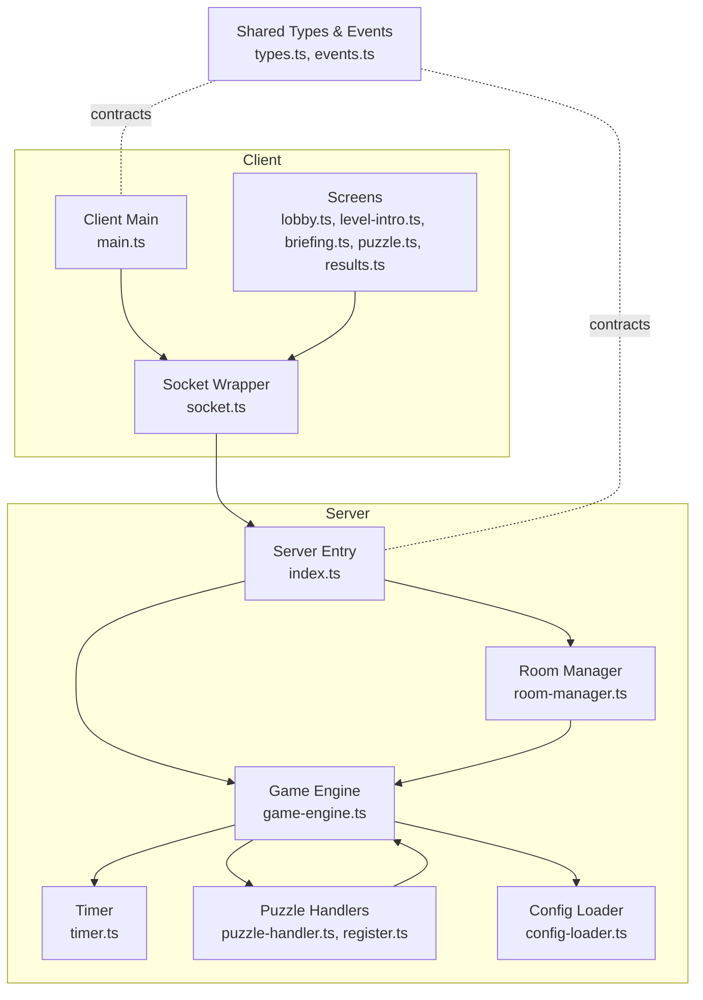
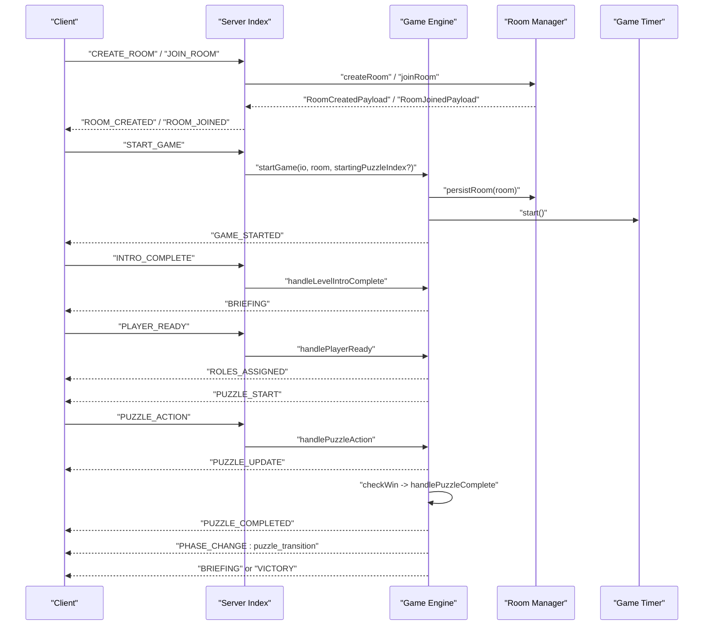
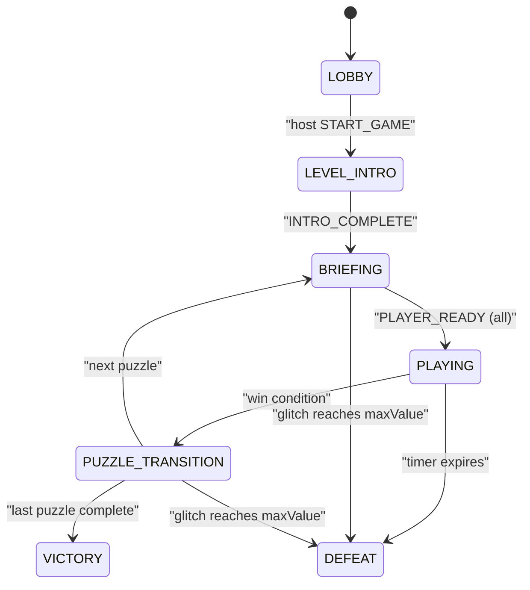
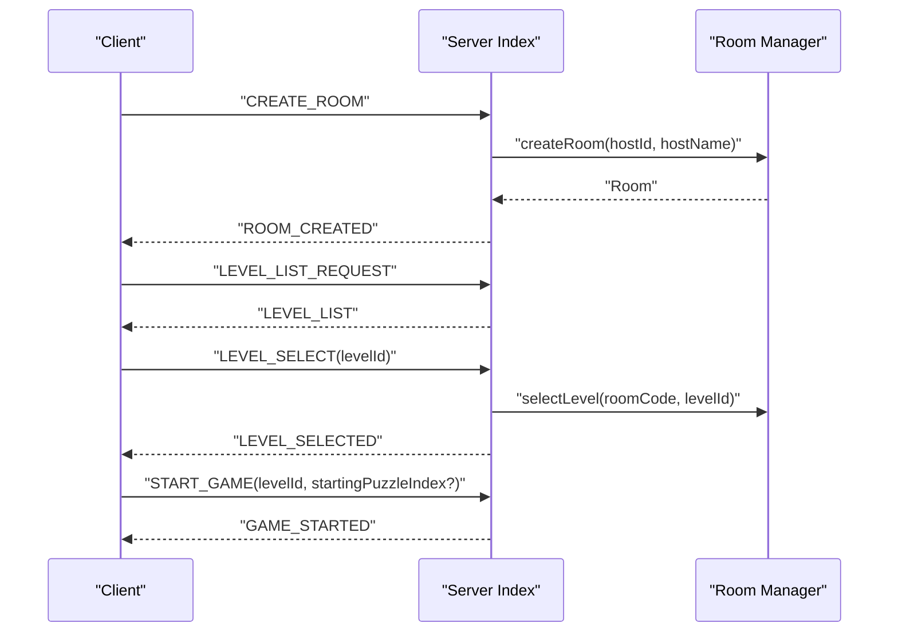
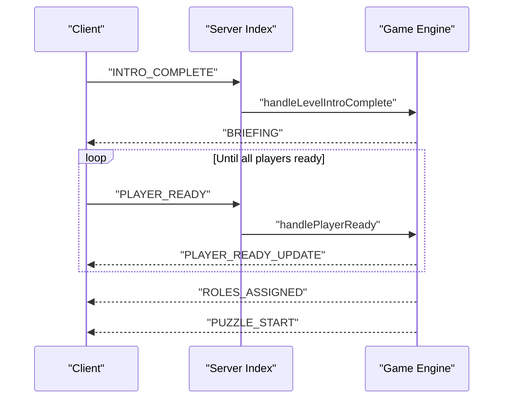
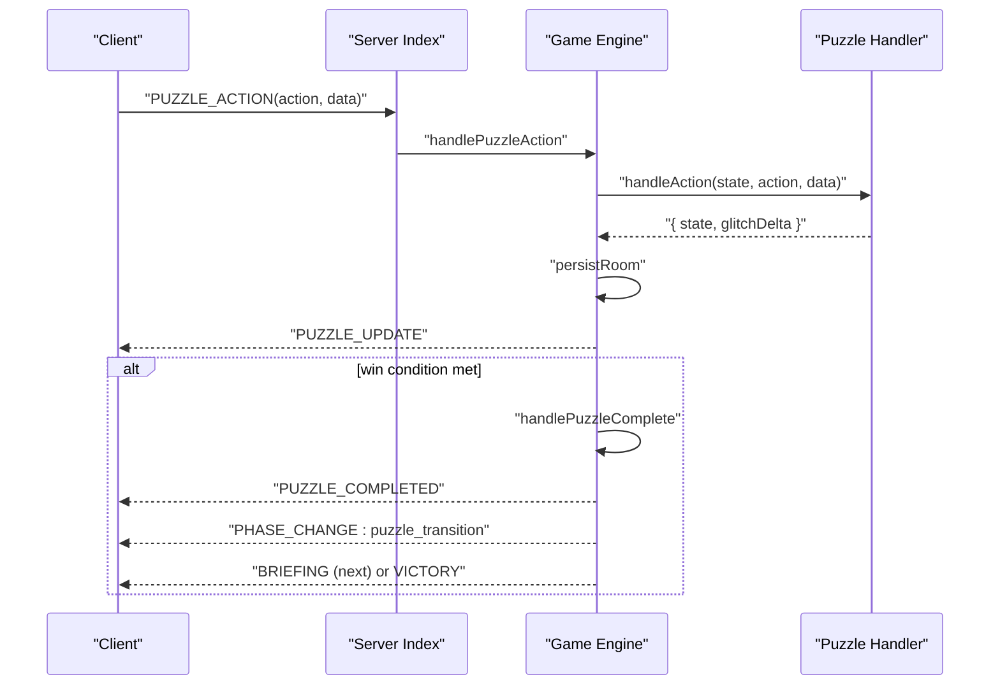
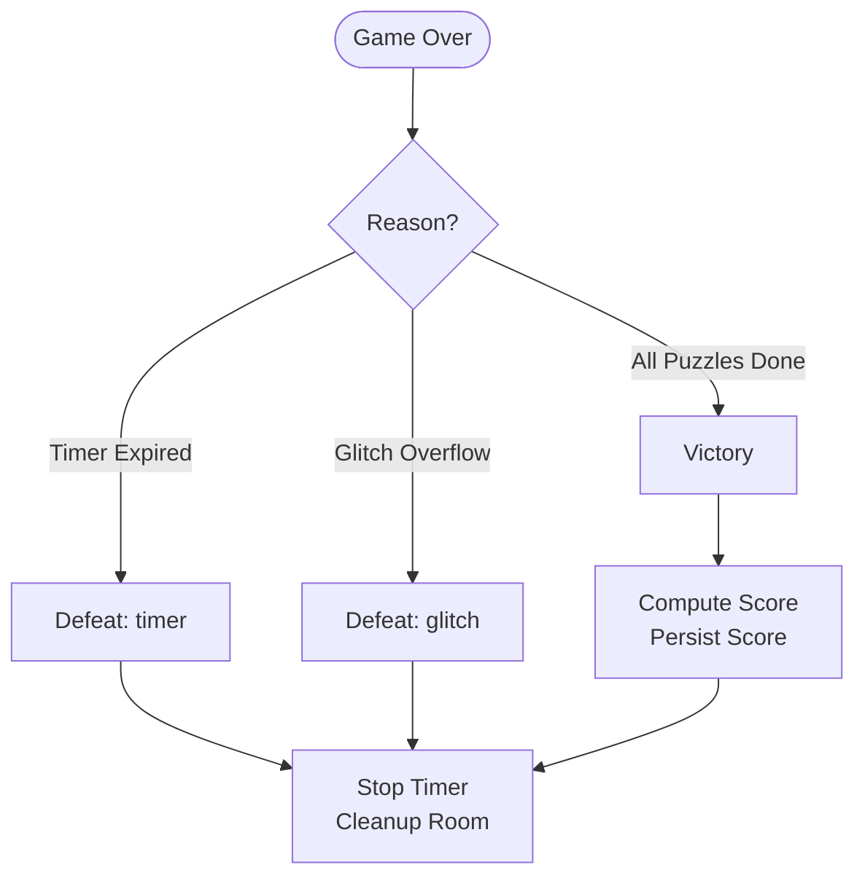
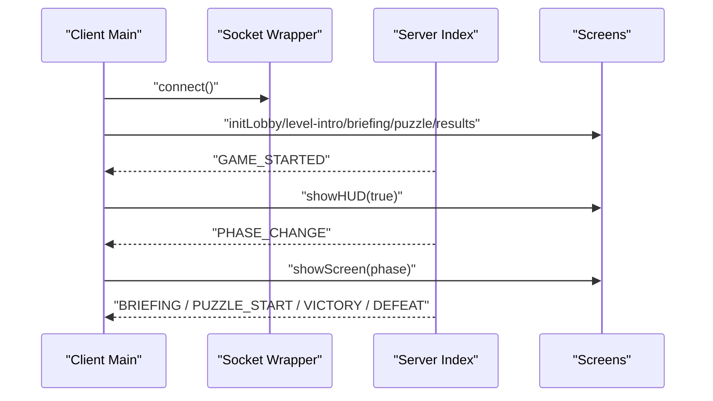
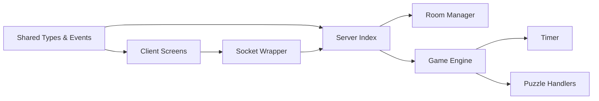

# Game Phases and Flow

<cite>
**Referenced Files in This Document**
- [game-engine.ts](file://src/server/services/game-engine.ts)
- [room-manager.ts](file://src/server/services/room-manager.ts)
- [index.ts](file://src/server/index.ts)
- [events.ts](file://shared/events.ts)
- [types.ts](file://shared/types.ts)
- [timer.ts](file://src/server/utils/timer.ts)
- [puzzle-handler.ts](file://src/server/puzzles/puzzle-handler.ts)
- [register.ts](file://src/server/puzzles/register.ts)
- [main.ts](file://src/client/main.ts)
- [lobby.ts](file://src/client/screens/lobby.ts)
- [level-intro.ts](file://src/client/screens/level-intro.ts)
- [briefing.ts](file://src/client/screens/briefing.ts)
- [puzzle.ts](file://src/client/screens/puzzle.ts)
- [results.ts](file://src/client/screens/results.ts)
- [socket.ts](file://src/client/lib/socket.ts)
</cite>

## Table of Contents
1. [Introduction](#introduction)
2. [Project Structure](#project-structure)
3. [Core Components](#core-components)
4. [Architecture Overview](#architecture-overview)
5. [Detailed Component Analysis](#detailed-component-analysis)
6. [Dependency Analysis](#dependency-analysis)
7. [Performance Considerations](#performance-considerations)
8. [Troubleshooting Guide](#troubleshooting-guide)
9. [Conclusion](#conclusion)

## Introduction
This document explains the complete game flow and phase transitions that orchestrate the player experience in the escape room platform. It documents the seven-phase state machine (lobby, level_intro, briefing, playing, puzzle_transition, victory, and defeat), the event coordination between client and server, and state persistence across each phase. It also covers room creation, player readiness, briefing presentations, puzzle completion sequences, timing considerations, client-server synchronization, error handling, recovery mechanisms, and graceful degradation.

## Project Structure
The game flow spans both server and client layers:
- Server orchestrates rooms, game phases, timers, puzzle lifecycle, and persistence.
- Client renders screens, handles user input, and synchronizes UI with server events.
- Shared types and events define the contract between client and server.

**Diagram sources**
- [main.ts](file://src/client/main.ts#L1-L266)
- [lobby.ts](file://src/client/screens/lobby.ts#L1-L435)
- [level-intro.ts](file://src/client/screens/level-intro.ts#L1-L125)
- [briefing.ts](file://src/client/screens/briefing.ts#L1-L135)
- [puzzle.ts](file://src/client/screens/puzzle.ts#L1-L101)
- [results.ts](file://src/client/screens/results.ts#L1-L93)
- [socket.ts](file://src/client/lib/socket.ts#L1-L85)
- [index.ts](file://src/server/index.ts#L1-L321)
- [room-manager.ts](file://src/server/services/room-manager.ts#L1-L262)
- [game-engine.ts](file://src/server/services/game-engine.ts#L1-L711)
- [timer.ts](file://src/server/utils/timer.ts#L1-L81)
- [puzzle-handler.ts](file://src/server/puzzles/puzzle-handler.ts#L1-L57)
- [register.ts](file://src/server/puzzles/register.ts#L1-L21)
- [events.ts](file://shared/events.ts#L1-L228)
- [types.ts](file://shared/types.ts#L1-L187)

**Section sources**
- [main.ts](file://src/client/main.ts#L1-L266)
- [index.ts](file://src/server/index.ts#L1-L321)
- [events.ts](file://shared/events.ts#L1-L228)
- [types.ts](file://shared/types.ts#L1-L187)

## Core Components
- Game Engine: Central state machine managing phases, timers, puzzle lifecycle, and persistence.
- Room Manager: In-memory room store with Redis persistence for multi-instance deployments.
- Timer: Server-authoritative countdown with resume and cleanup.
- Puzzle Handlers: Pluggable implementations for each puzzle type.
- Client Screens: UI for lobby, level intro, briefing, puzzle gameplay, and results.
- Socket Layer: Typed client wrapper around Socket.io with reconnection and error logging.

Key responsibilities:
- Server emits typed events to clients; clients render appropriate screens and send actions.
- Game Engine enforces phase transitions and persists state after each mutation.
- Timer drives global time and triggers defeat on expiration.
- Puzzle handlers encapsulate game logic and asymmetric views.

**Section sources**
- [game-engine.ts](file://src/server/services/game-engine.ts#L1-L711)
- [room-manager.ts](file://src/server/services/room-manager.ts#L1-L262)
- [timer.ts](file://src/server/utils/timer.ts#L1-L81)
- [puzzle-handler.ts](file://src/server/puzzles/puzzle-handler.ts#L1-L57)
- [register.ts](file://src/server/puzzles/register.ts#L1-L21)
- [main.ts](file://src/client/main.ts#L1-L266)
- [lobby.ts](file://src/client/screens/lobby.ts#L1-L435)
- [level-intro.ts](file://src/client/screens/level-intro.ts#L1-L125)
- [briefing.ts](file://src/client/screens/briefing.ts#L1-L135)
- [puzzle.ts](file://src/client/screens/puzzle.ts#L1-L101)
- [results.ts](file://src/client/screens/results.ts#L1-L93)
- [socket.ts](file://src/client/lib/socket.ts#L1-L85)

## Architecture Overview
The system uses a server-authoritative model:
- Rooms are stored in memory with Redis persistence.
- Socket.io broadcasts phase and state updates to all clients in a room.
- The Game Engine controls the seven-phase state machine and delegates puzzle logic to registered handlers.
- Clients render screens and synchronize with server events.

**Diagram sources**
- [index.ts](file://src/server/index.ts#L86-L305)
- [game-engine.ts](file://src/server/services/game-engine.ts#L57-L139)
- [room-manager.ts](file://src/server/services/room-manager.ts#L60-L86)
- [timer.ts](file://src/server/utils/timer.ts#L30-L45)
- [lobby.ts](file://src/client/screens/lobby.ts#L342-L434)
- [level-intro.ts](file://src/client/screens/level-intro.ts#L14-L96)
- [briefing.ts](file://src/client/screens/briefing.ts#L16-L28)
- [puzzle.ts](file://src/client/screens/puzzle.ts#L23-L34)

## Detailed Component Analysis

### Seven-Phase State Machine
The GamePhase enum defines the canonical order of phases. The Game Engine advances through them based on events and conditions.

**Diagram sources**
- [types.ts](file://shared/types.ts#L26-L34)
- [game-engine.ts](file://src/server/services/game-engine.ts#L144-L164)
- [game-engine.ts](file://src/server/services/game-engine.ts#L169-L202)
- [game-engine.ts](file://src/server/services/game-engine.ts#L263-L319)
- [game-engine.ts](file://src/server/services/game-engine.ts#L388-L424)
- [game-engine.ts](file://src/server/services/game-engine.ts#L488-L521)
- [game-engine.ts](file://src/server/services/game-engine.ts#L526-L550)

**Section sources**
- [types.ts](file://shared/types.ts#L26-L34)
- [game-engine.ts](file://src/server/services/game-engine.ts#L57-L139)
- [game-engine.ts](file://src/server/services/game-engine.ts#L144-L236)
- [game-engine.ts](file://src/server/services/game-engine.ts#L263-L424)
- [game-engine.ts](file://src/server/services/game-engine.ts#L488-L550)

### Room Creation and Lobby Flow
- Room creation generates a unique room code and initializes GameState in LOBBY.
- Host selects a level; clients receive level summaries and can choose a mission.
- Start requires host authority and minimum player thresholds.

**Diagram sources**
- [index.ts](file://src/server/index.ts#L89-L204)
- [room-manager.ts](file://src/server/services/room-manager.ts#L60-L86)
- [room-manager.ts](file://src/server/services/room-manager.ts#L191-L204)
- [lobby.ts](file://src/client/screens/lobby.ts#L342-L434)

**Section sources**
- [index.ts](file://src/server/index.ts#L89-L204)
- [room-manager.ts](file://src/server/services/room-manager.ts#L60-L86)
- [room-manager.ts](file://src/server/services/room-manager.ts#L191-L204)
- [lobby.ts](file://src/client/screens/lobby.ts#L342-L434)

### Level Intro and Briefing
- Level Intro shows narrative and optional audio; clients signal completion to proceed.
- Briefing presents puzzle story and waits for all players to press READY.

**Diagram sources**
- [index.ts](file://src/server/index.ts#L232-L243)
- [game-engine.ts](file://src/server/services/game-engine.ts#L144-L164)
- [game-engine.ts](file://src/server/services/game-engine.ts#L207-L236)
- [game-engine.ts](file://src/server/services/game-engine.ts#L263-L319)
- [level-intro.ts](file://src/client/screens/level-intro.ts#L93-L96)
- [briefing.ts](file://src/client/screens/briefing.ts#L17-L28)

**Section sources**
- [index.ts](file://src/server/index.ts#L232-L243)
- [game-engine.ts](file://src/server/services/game-engine.ts#L144-L164)
- [game-engine.ts](file://src/server/services/game-engine.ts#L207-L236)
- [game-engine.ts](file://src/server/services/game-engine.ts#L263-L319)
- [level-intro.ts](file://src/client/screens/level-intro.ts#L93-L96)
- [briefing.ts](file://src/client/screens/briefing.ts#L17-L28)

### Playing Phase and Puzzle Completion
- Roles are assigned per puzzle; each player receives a role-specific view.
- Actions are sent client→server→handler; updates broadcast to all clients.
- Win condition triggers puzzle completion and a short transition pause before the next briefing or victory.

**Diagram sources**
- [index.ts](file://src/server/index.ts#L206-L217)
- [game-engine.ts](file://src/server/services/game-engine.ts#L324-L383)
- [game-engine.ts](file://src/server/services/game-engine.ts#L388-L424)
- [puzzle-handler.ts](file://src/server/puzzles/puzzle-handler.ts#L12-L44)
- [puzzle.ts](file://src/client/screens/puzzle.ts#L23-L34)

**Section sources**
- [index.ts](file://src/server/index.ts#L206-L217)
- [game-engine.ts](file://src/server/services/game-engine.ts#L324-L383)
- [game-engine.ts](file://src/server/services/game-engine.ts#L388-L424)
- [puzzle-handler.ts](file://src/server/puzzles/puzzle-handler.ts#L12-L44)
- [puzzle.ts](file://src/client/screens/puzzle.ts#L23-L34)

### Victory and Defeat
- Victory computes score from elapsed time and final glitch value, records to database, and cleans up timers.
- Defeat occurs on timer expiration or glitch overflow; cleanup stops timers and notifies clients.

**Diagram sources**
- [game-engine.ts](file://src/server/services/game-engine.ts#L488-L550)
- [results.ts](file://src/client/screens/results.ts#L21-L84)
- [timer.ts](file://src/server/utils/timer.ts#L47-L53)

**Section sources**
- [game-engine.ts](file://src/server/services/game-engine.ts#L488-L550)
- [results.ts](file://src/client/screens/results.ts#L21-L84)
- [timer.ts](file://src/server/utils/timer.ts#L47-L53)

### Client-Side Synchronization and UI Flow
- Client boots, connects to Socket.io, initializes screens, and listens for typed events.
- On GAME_STARTED, theme and background music are applied; HUD visibility toggled.
- PHASE_CHANGE updates progress; BRIEFING displays story; PUZZLE_START renders the puzzle; RESULTS shows outcomes.

**Diagram sources**
- [main.ts](file://src/client/main.ts#L47-L262)
- [socket.ts](file://src/client/lib/socket.ts#L11-L41)
- [lobby.ts](file://src/client/screens/lobby.ts#L418-L421)
- [briefing.ts](file://src/client/screens/briefing.ts#L17-L28)
- [puzzle.ts](file://src/client/screens/puzzle.ts#L24-L34)
- [results.ts](file://src/client/screens/results.ts#L12-L18)

**Section sources**
- [main.ts](file://src/client/main.ts#L47-L262)
- [socket.ts](file://src/client/lib/socket.ts#L11-L41)
- [lobby.ts](file://src/client/screens/lobby.ts#L418-L421)
- [briefing.ts](file://src/client/screens/briefing.ts#L17-L28)
- [puzzle.ts](file://src/client/screens/puzzle.ts#L24-L34)
- [results.ts](file://src/client/screens/results.ts#L12-L18)

## Dependency Analysis
- Server depends on Room Manager for room CRUD and persistence, Game Engine for state machine, Timer for countdown, and Puzzle Handlers for game logic.
- Client depends on Socket Wrapper for transport and typed events, and on screens for rendering.
- Shared types and events define contracts across boundaries.

**Diagram sources**
- [events.ts](file://shared/events.ts#L1-L228)
- [types.ts](file://shared/types.ts#L1-L187)
- [index.ts](file://src/server/index.ts#L1-L321)
- [room-manager.ts](file://src/server/services/room-manager.ts#L1-L262)
- [game-engine.ts](file://src/server/services/game-engine.ts#L1-L711)
- [timer.ts](file://src/server/utils/timer.ts#L1-L81)
- [puzzle-handler.ts](file://src/server/puzzles/puzzle-handler.ts#L1-L57)
- [main.ts](file://src/client/main.ts#L1-L266)
- [socket.ts](file://src/client/lib/socket.ts#L1-L85)

**Section sources**
- [index.ts](file://src/server/index.ts#L1-L321)
- [game-engine.ts](file://src/server/services/game-engine.ts#L1-L711)
- [room-manager.ts](file://src/server/services/room-manager.ts#L1-L262)
- [timer.ts](file://src/server/utils/timer.ts#L1-L81)
- [puzzle-handler.ts](file://src/server/puzzles/puzzle-handler.ts#L1-L57)
- [main.ts](file://src/client/main.ts#L1-L266)
- [socket.ts](file://src/client/lib/socket.ts#L1-L85)
- [events.ts](file://shared/events.ts#L1-L228)
- [types.ts](file://shared/types.ts#L1-L187)

## Performance Considerations
- Server-authoritative timers prevent client drift; timers are resumed on startup and cleaned up on game end.
- Minimal per-frame updates: only PHASE_CHANGE, TIMER_UPDATE, GLITCH_UPDATE, and puzzle-specific events are emitted.
- Asymmetric views reduce payload sizes by sending only role-relevant data.
- Redis-backed room persistence enables multi-instance scaling; consider moving timer state to Redis for crash recovery.

[No sources needed since this section provides general guidance]

## Troubleshooting Guide
Common issues and recovery mechanisms:
- Room not found or invalid state: server emits ROOM_ERROR; client shows error messages and remains in lobby.
- Player disconnects: server marks player inactive; Room Manager persists state; reconnection logic allows reclaiming a seat.
- Timer expiration: triggers DEFEAT with reason "timer".
- Glitch overflow: triggers DEFEAT with reason "glitch".
- Persistent state failures: Game Engine logs errors and continues; ensure Redis connectivity and disk space.

Recovery steps:
- Reconnect clients; server will sync state via syncPlayer for non-LOBBY phases.
- Resume timers on restart; server loads persisted rooms and resumes countdowns.
- Verify Redis adapter configuration for multi-instance deployments.

**Section sources**
- [index.ts](file://src/server/index.ts#L112-L146)
- [index.ts](file://src/server/index.ts#L297-L320)
- [room-manager.ts](file://src/server/services/room-manager.ts#L94-L154)
- [room-manager.ts](file://src/server/services/room-manager.ts#L225-L237)
- [game-engine.ts](file://src/server/services/game-engine.ts#L526-L550)
- [game-engine.ts](file://src/server/services/game-engine.ts#L569-L596)
- [main.ts](file://src/client/main.ts#L112-L139)

## Conclusion
The game flow is a robust, server-authoritative state machine that coordinates room lifecycle, narrative presentation, puzzle gameplay, and outcomes. Typed events and shared contracts ensure reliable client-server synchronization. Persistence and timer resumption enable graceful recovery, while modular puzzle handlers support extensibility. The documented phases, transitions, and error handling provide a blueprint for maintaining and extending the experience.