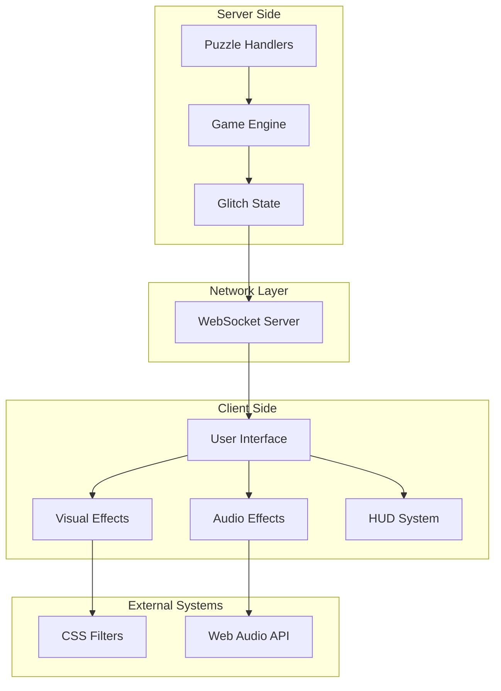
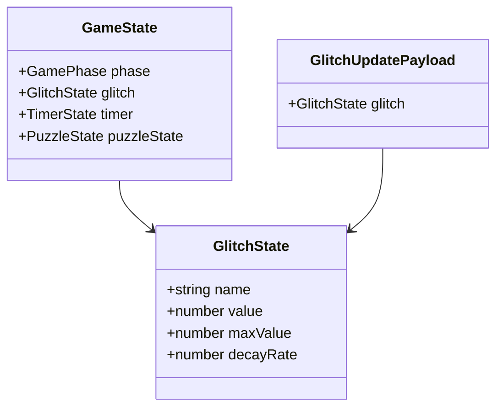
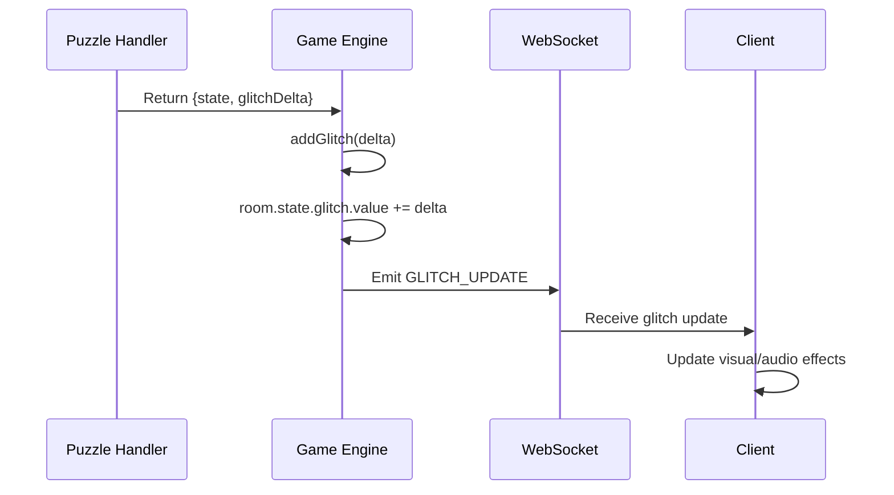
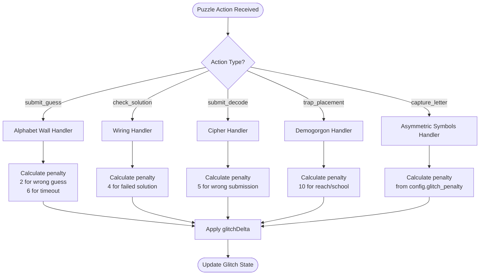
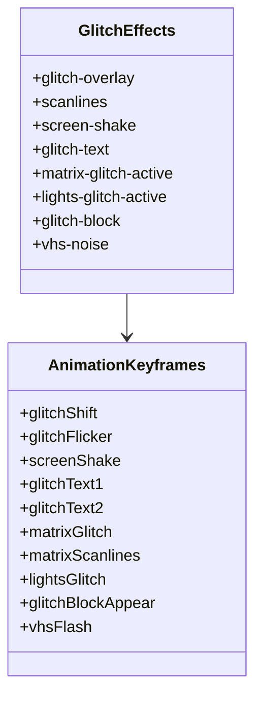
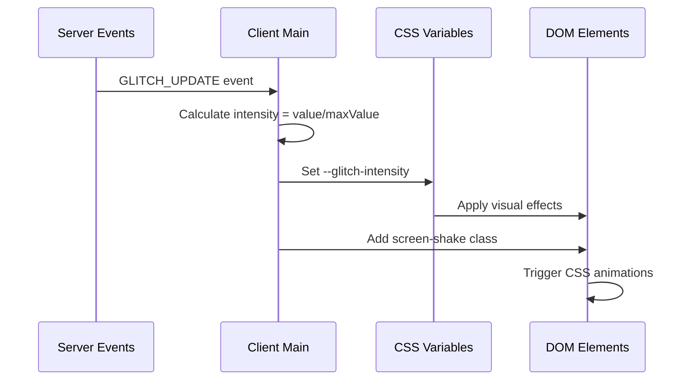
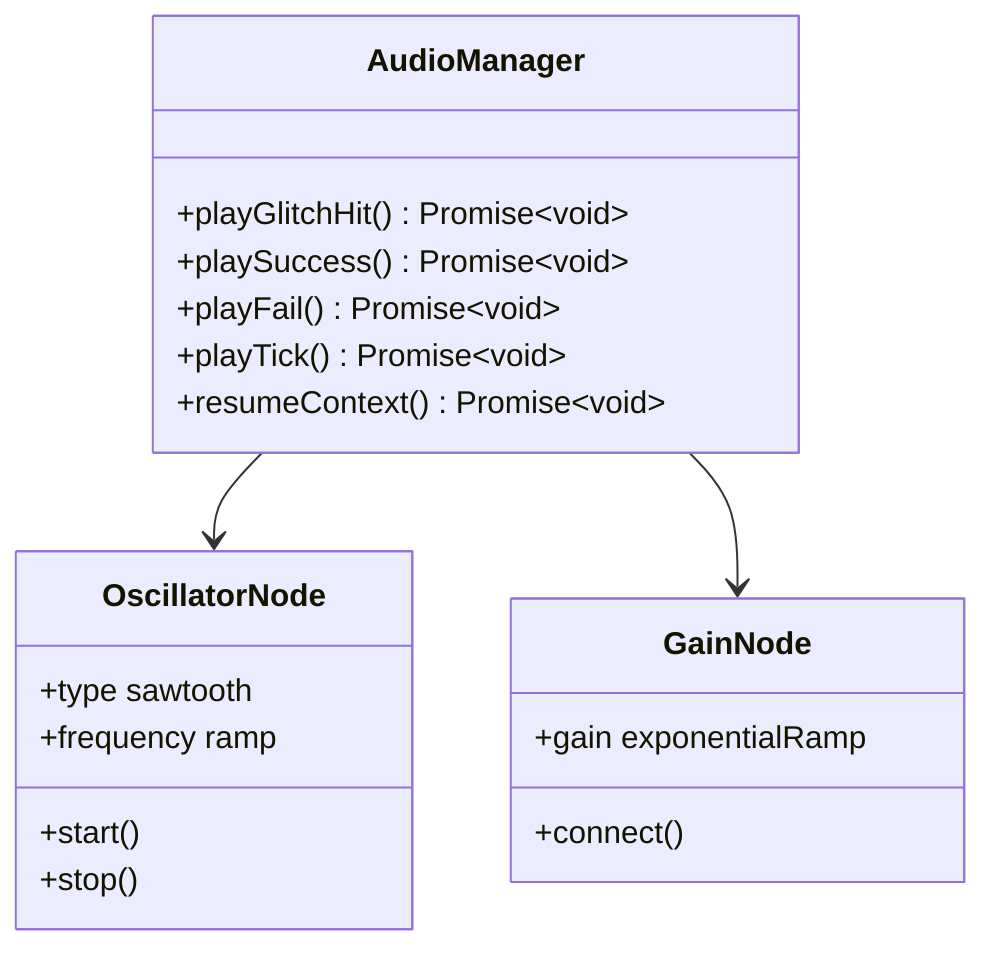
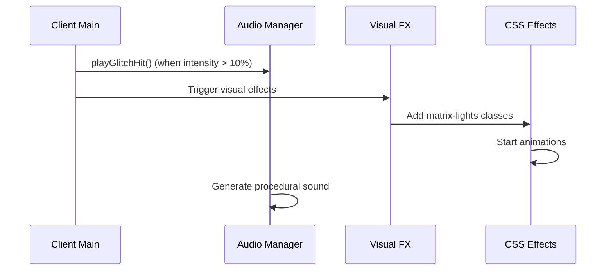
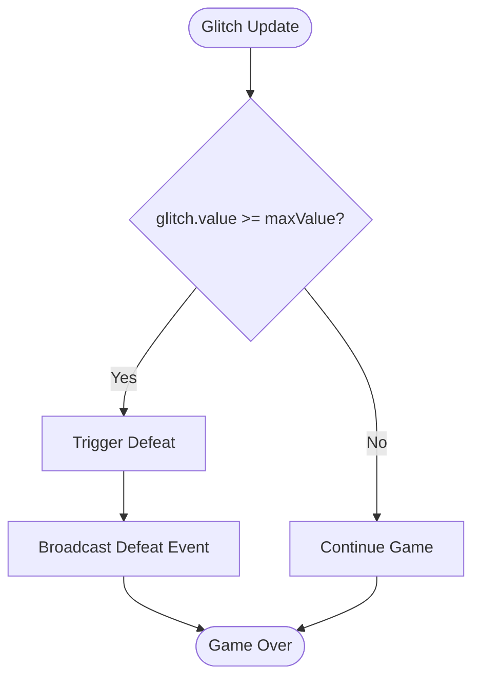
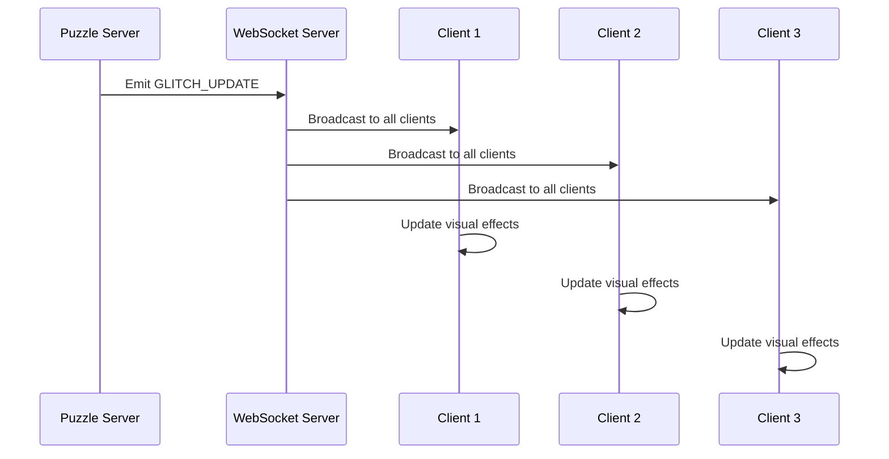

# Glitch Meter System

<cite>
**Referenced Files in This Document**
- [glitch.css](file://src/client/styles/glitch.css)
- [visual-fx.ts](file://src/client/lib/visual-fx.ts)
- [audio-manager.ts](file://src/client/audio/audio-manager.ts)
- [main.ts](file://src/client/main.ts)
- [game-engine.ts](file://src/server/services/game-engine.ts)
- [types.ts](file://shared/types.ts)
- [events.ts](file://shared/events.ts)
- [alphabet-wall.ts](file://src/server/puzzles/alphabet-wall.ts)
- [collaborative-wiring.ts](file://src/server/puzzles/collaborative-wiring.ts)
- [demogorgon-hunt.ts](file://src/server/puzzles/demogorgon-hunt.ts)
- [cipher-decode.ts](file://src/server/puzzles/cipher-decode.ts)
- [puzzle.ts](file://src/client/screens/puzzle.ts)
- [SCHEMA.md](file://config/SCHEMA.md)
</cite>

## Table of Contents
1. [Introduction](#introduction)
2. [System Architecture](#system-architecture)
3. [Core Components](#core-components)
4. [Glitch Calculation Mechanics](#glitch-calculation-mechanics)
5. [Visual Effects Implementation](#visual-effects-implementation)
6. [Audio Effects Implementation](#audio-effects-implementation)
7. [Puzzle Integration Points](#puzzle-integration-points)
8. [Game Over Conditions](#game-over-conditions)
9. [Real-time Feedback Mechanisms](#real-time-feedback-mechanisms)
10. [Performance Considerations](#performance-considerations)
11. [Troubleshooting Guide](#troubleshooting-guide)
12. [Conclusion](#conclusion)

## Introduction

The Glitch Meter System is a core gameplay mechanic that introduces timing pressure and visual feedback into the escape room experience. This system creates tension by accumulating "glitch" values through incorrect puzzle actions and environmental factors, causing screen distortion effects and audio interference that intensifies as the meter fills.

The system operates on a client-server architecture where the server maintains the authoritative glitch state and broadcasts updates to all clients, while the client handles real-time visual and audio feedback based on the current glitch intensity level.

## System Architecture

**Diagram sources**
- [game-engine.ts](file://src/server/services/game-engine.ts#L429-L449)
- [main.ts](file://src/client/main.ts#L113-L139)
- [visual-fx.ts](file://src/client/lib/visual-fx.ts#L1-L112)

## Core Components

### Glitch State Management

The glitch system is built around a centralized state structure defined in the shared types:

**Diagram sources**
- [types.ts](file://shared/types.ts#L51-L56)
- [types.ts](file://shared/types.ts#L36-L49)
- [events.ts](file://shared/events.ts#L205-L207)

**Section sources**
- [types.ts](file://shared/types.ts#L51-L56)
- [events.ts](file://shared/events.ts#L205-L207)

### Server-Side Glitch Processing

The server maintains strict control over glitch accumulation and applies penalties through puzzle handlers:

**Diagram sources**
- [game-engine.ts](file://src/server/services/game-engine.ts#L324-L352)
- [game-engine.ts](file://src/server/services/game-engine.ts#L429-L449)

**Section sources**
- [game-engine.ts](file://src/server/services/game-engine.ts#L429-L449)

## Glitch Calculation Mechanics

### Base Glitch Accumulation

The glitch system operates on a simple accumulation model where each incorrect action adds predetermined penalty values:

| Puzzle Action | Glitch Penalty | Description |
|---------------|----------------|-------------|
| Wrong letter guess | 2 points | Alphabet Wall puzzle |
| Timeout round | 6 points | Alphabet Wall puzzle |
| Wrong wiring check | 4 points | Collaborative Wiring |
| Wrong cipher submission | 5 points | Cipher Decode |
| Demogorgon reach/school | 10 points | Demogorgon Hunt |
| Wrong letter capture | Config-based | Asymmetric Symbols |

### Dynamic Penalty Application

Each puzzle handler determines its own penalty values based on the nature of the mistake:

**Diagram sources**
- [alphabet-wall.ts](file://src/server/puzzles/alphabet-wall.ts#L126-L132)
- [collaborative-wiring.ts](file://src/server/puzzles/collaborative-wiring.ts#L135)
- [cipher-decode.ts](file://src/server/puzzles/cipher-decode.ts#L84)
- [demogorgon-hunt.ts](file://src/server/puzzles/demogorgon-hunt.ts#L138-L144)

**Section sources**
- [alphabet-wall.ts](file://src/server/puzzles/alphabet-wall.ts#L126-L132)
- [collaborative-wiring.ts](file://src/server/puzzles/collaborative-wiring.ts#L135)
- [cipher-decode.ts](file://src/server/puzzles/cipher-decode.ts#L84)
- [demogorgon-hunt.ts](file://src/server/puzzles/demogorgon-hunt.ts#L138-L144)

### Maximum Threshold and Decay

The glitch system includes configurable maximum values and optional natural decay:

- **Maximum Value**: Default 100 points (configurable per level)
- **Decay Rate**: Optional natural decay (0 = no decay)
- **Game Over Condition**: Reached when glitch value equals or exceeds maximum

**Section sources**
- [types.ts](file://shared/types.ts#L51-L56)
- [SCHEMA.md](file://config/SCHEMA.md#L15-L16)

## Visual Effects Implementation

### CSS-Based Visual Feedback

The visual effects are implemented entirely through CSS animations and filters, controlled by the `--glitch-intensity` CSS variable:

**Diagram sources**
- [glitch.css](file://src/client/styles/glitch.css#L7-L420)

### Intensity-Based Effects

The visual intensity scales proportionally with the glitch meter:

- **Low Intensity (0-10%)**: Subtle scanlines and minor screen shake
- **Medium Intensity (10-40%)**: Chromatic aberration and text distortion
- **High Intensity (40-70%)**: Color blocks and VHS noise
- **Critical Intensity (70%+)**: Full matrix glitch and extreme screen distortion

**Section sources**
- [glitch.css](file://src/client/styles/glitch.css#L1-L421)

### Real-time CSS Variable Updates

The client continuously updates CSS variables based on glitch intensity:

**Diagram sources**
- [main.ts](file://src/client/main.ts#L113-L139)

**Section sources**
- [main.ts](file://src/client/main.ts#L113-L139)

## Audio Effects Implementation

### Procedural Audio Generation

The audio system uses Web Audio API for dynamic glitch sounds:

**Diagram sources**
- [audio-manager.ts](file://src/client/audio/audio-manager.ts#L118-L137)

### Audio Processing Pipeline

The glitch hit sound is generated procedurally with specific parameters:

- **Waveform**: Sawtooth oscillator
- **Frequency**: Starts at 200Hz, ramps to 50Hz over 0.15s
- **Volume**: Peaks at 0.3, decays to 0.001 over 0.2s
- **Trigger**: Automatic when glitch intensity exceeds 10%

**Section sources**
- [audio-manager.ts](file://src/client/audio/audio-manager.ts#L118-L137)

### Audio Integration with Visual Effects

The audio system coordinates with visual effects for maximum impact:

**Diagram sources**
- [main.ts](file://src/client/main.ts#L127-L135)
- [visual-fx.ts](file://src/client/lib/visual-fx.ts#L80-L90)

**Section sources**
- [main.ts](file://src/client/main.ts#L127-L135)
- [visual-fx.ts](file://src/client/lib/visual-fx.ts#L80-L90)

## Puzzle Integration Points

### Alphabet Wall Integration

The Alphabet Wall puzzle applies different penalties based on action type:

- **Wrong Guess**: +2 glitch points
- **Timeout**: +6 glitch points
- **Successful Round**: No penalty, advances to next round

### Collaborative Wiring Integration

Wiring puzzle applies penalties for failed solutions:

- **Failed Solution Check**: +4 glitch points
- **Successful Wiring**: No penalty, advances to next board

### Demogorgon Hunt Integration

This puzzle has environmental triggers:

- **Reach School**: +10 glitch points
- **Exceed Max Rounds**: +10 glitch points
- **Successful Trap Placement**: No penalty

### Cipher Decode Integration

Each wrong submission incurs a penalty:

- **Wrong Submission**: +5 glitch points
- **Correct Submission**: No penalty

**Section sources**
- [alphabet-wall.ts](file://src/server/puzzles/alphabet-wall.ts#L126-L132)
- [collaborative-wiring.ts](file://src/server/puzzles/collaborative-wiring.ts#L135)
- [demogorgon-hunt.ts](file://src/server/puzzles/demogorgon-hunt.ts#L138-L144)
- [cipher-decode.ts](file://src/server/puzzles/cipher-decode.ts#L84)

## Game Over Conditions

### Glitch-Based Defeat

The game ends in defeat when the glitch meter reaches its maximum threshold:

**Diagram sources**
- [game-engine.ts](file://src/server/services/game-engine.ts#L442-L445)

### Defeat Payload Structure

When game over occurs, the server broadcasts a standardized defeat payload:

| Field | Type | Description |
|-------|------|-------------|
| reason | "timer" \| "glitch" | Cause of defeat |
| puzzlesCompleted | number | Number of puzzles completed |
| puzzleReachedIndex | number | Index of puzzle reached |

**Section sources**
- [game-engine.ts](file://src/server/services/game-engine.ts#L442-L445)
- [events.ts](file://shared/events.ts#L220-L224)

## Real-time Feedback Mechanisms

### HUD Integration

The client updates the Heads-Up Display in real-time:

- **Glitch Bar**: Width proportional to current intensity
- **Intensity Indicator**: CSS variable `--glitch-intensity` for visual effects
- **Screen Shake**: Automatic when intensity exceeds 10%

### Network Synchronization

All clients receive synchronized glitch updates through WebSocket events:

**Diagram sources**
- [events.ts](file://shared/events.ts#L73)
- [main.ts](file://src/client/main.ts#L113-L139)

**Section sources**
- [main.ts](file://src/client/main.ts#L113-L139)
- [events.ts](file://shared/events.ts#L73)

## Performance Considerations

### Client-Side Efficiency

The visual effects are optimized for performance:

- **CSS Animations**: Hardware-accelerated via GPU
- **Minimal JavaScript**: Pure CSS-based effects
- **Efficient Updates**: Batched DOM manipulation
- **Memory Management**: Proper cleanup of timeouts and intervals

### Network Optimization

- **Event Compression**: Only essential glitch data transmitted
- **Rate Limiting**: Visual effects triggered at appropriate intervals
- **Conditional Updates**: Effects only applied when intensity threshold exceeded

### Audio Performance

- **Procedural Generation**: No asset loading overhead
- **Resource Cleanup**: Automatic oscillator disposal
- **Volume Control**: Efficient gain node management

## Troubleshooting Guide

### Common Issues

**Visual Effects Not Appearing**
- Verify `--glitch-intensity` CSS variable is being set
- Check browser support for CSS animations
- Ensure glitch value is actually increasing

**Audio Not Playing**
- Confirm audio context is resumed on user interaction
- Verify Web Audio API compatibility
- Check for browser autoplay restrictions

**Inconsistent Glitch Behavior**
- Verify puzzle handlers return correct `glitchDelta` values
- Check server-side persistence of glitch state
- Ensure all clients receive GLITCH_UPDATE events

### Debugging Steps

1. **Enable Logging**: Check client and server logs for error messages
2. **Network Inspection**: Verify GLITCH_UPDATE events are being broadcast
3. **State Verification**: Confirm glitch values are incrementing correctly
4. **Visual Inspection**: Use browser dev tools to inspect CSS variables

**Section sources**
- [main.ts](file://src/client/main.ts#L113-L139)
- [audio-manager.ts](file://src/client/audio/audio-manager.ts#L33-L54)

## Conclusion

The Glitch Meter System successfully creates immersive timing pressure through a sophisticated combination of visual and audio feedback mechanisms. By implementing a client-server architecture with pure CSS-based effects and procedural audio generation, the system achieves both performance efficiency and compelling gameplay impact.

The modular design allows for easy expansion with new puzzle integrations and visual effects, while the configurable threshold system enables level designers to tailor the difficulty and intensity of the glitch experience. The real-time synchronization ensures all players share a consistent and responsive feedback loop, enhancing the collaborative escape room atmosphere.

Through careful attention to performance optimization and cross-platform compatibility, the system delivers a polished gaming experience that effectively communicates the consequences of player actions while maintaining smooth gameplay performance.