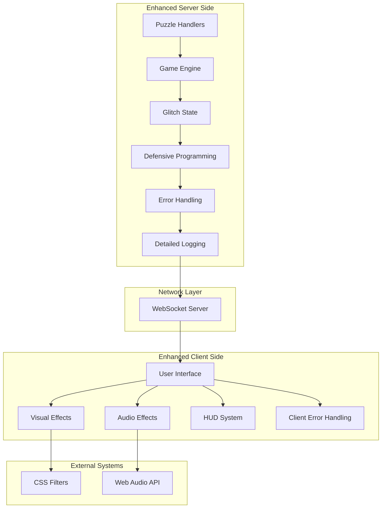
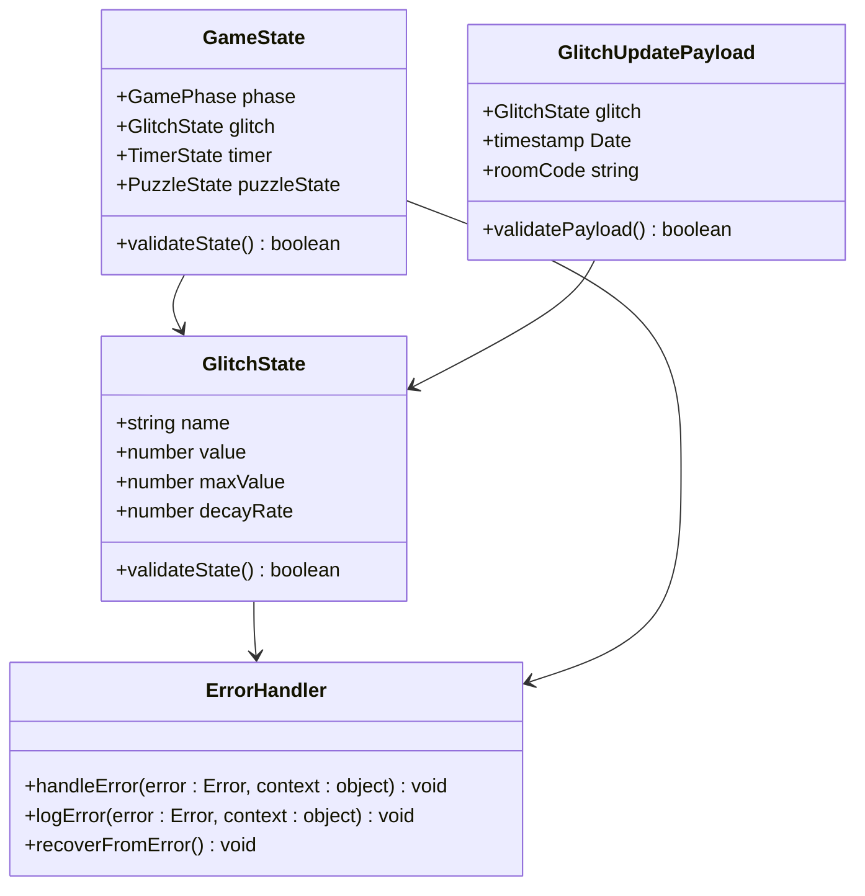
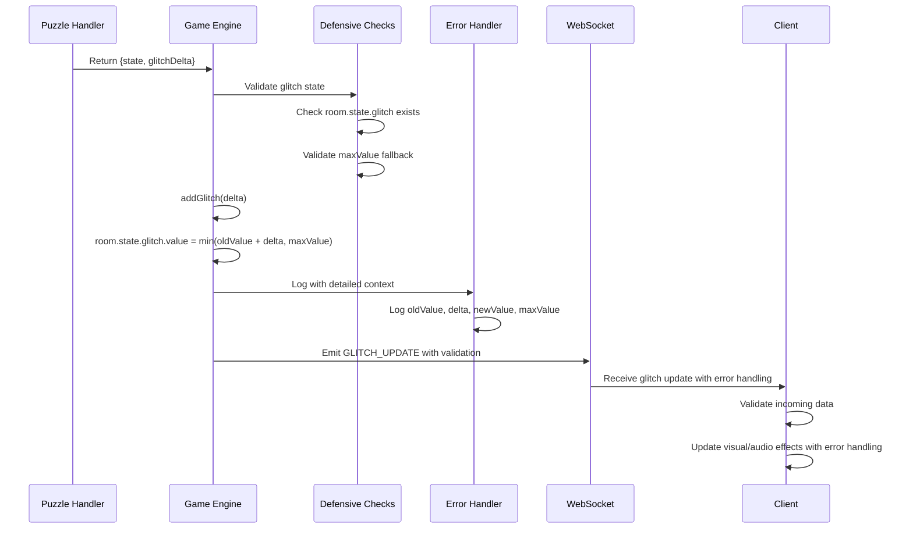
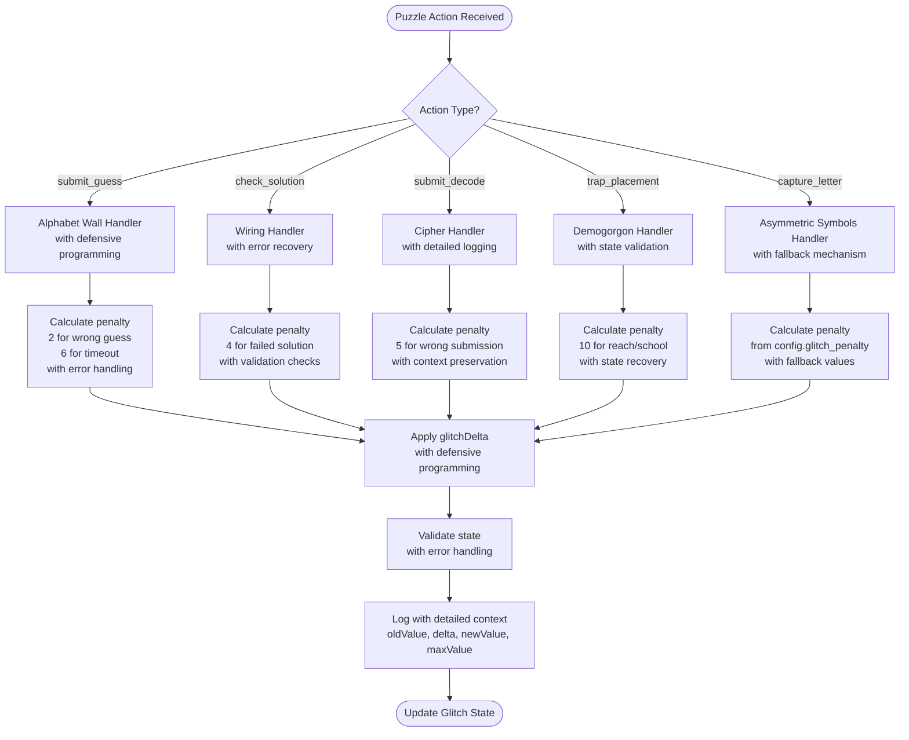
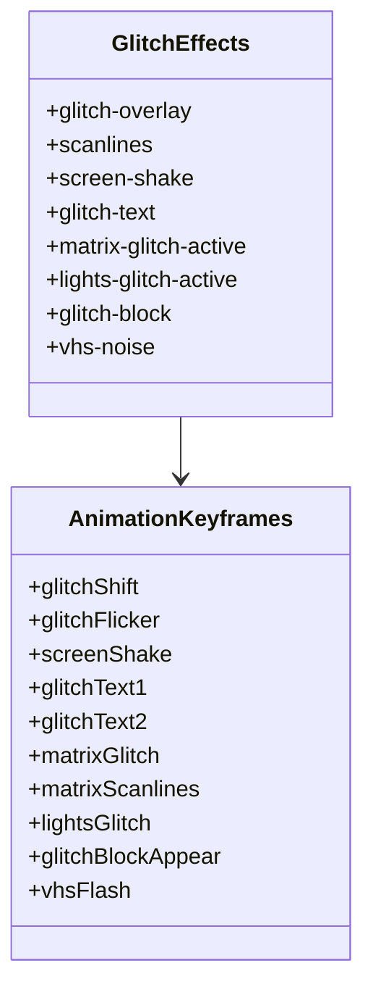
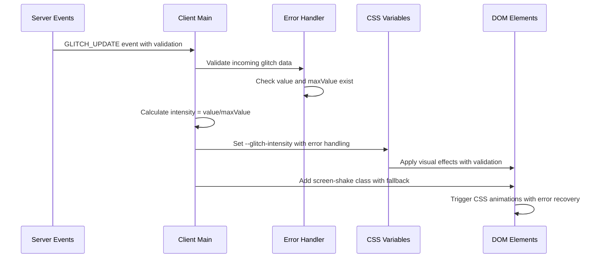
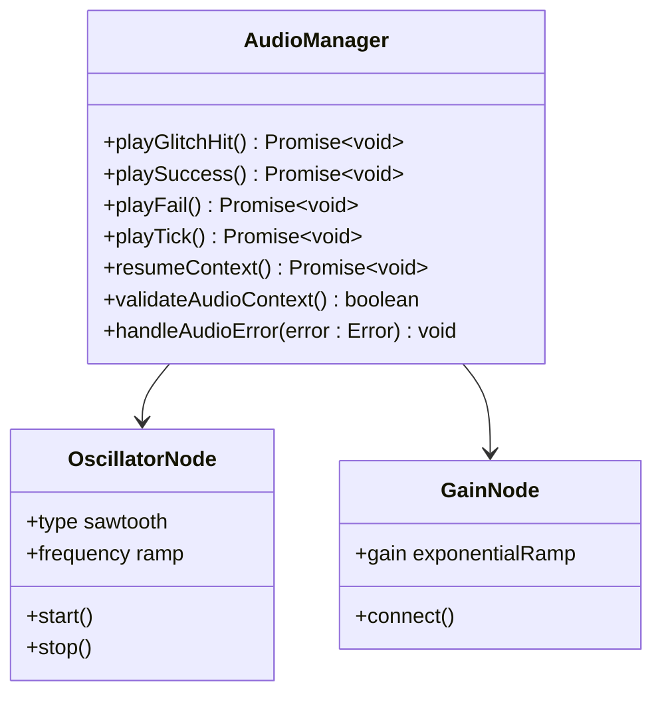
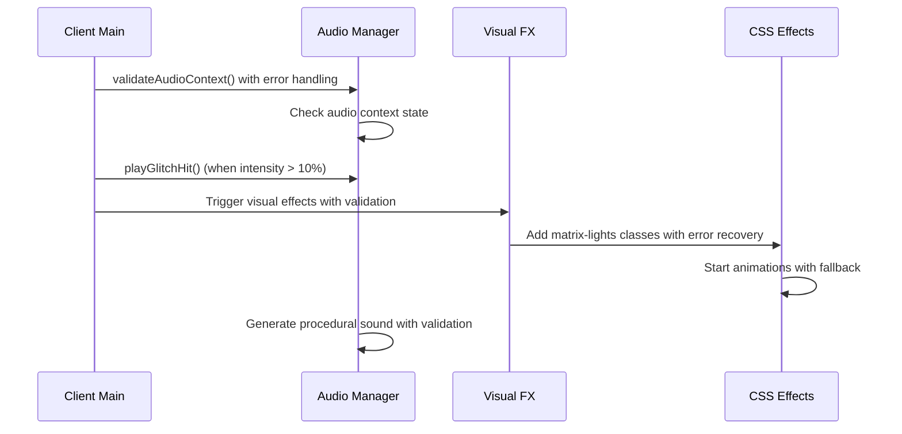
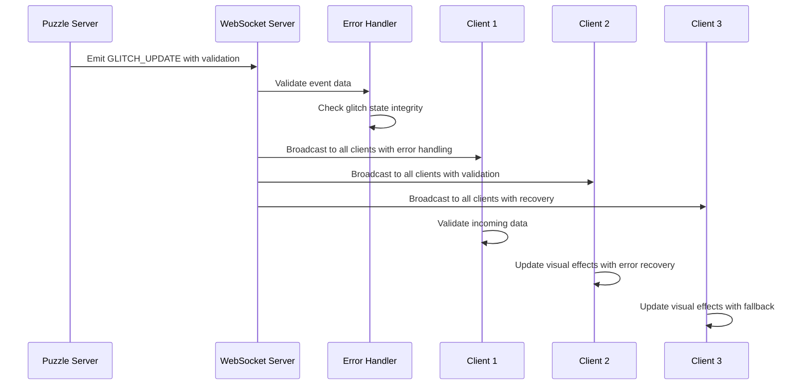

# Glitch Meter System

<cite>
**Referenced Files in This Document**
- [glitch.css](file://src/client/styles/glitch.css)
- [visual-fx.ts](file://src/client/lib/visual-fx.ts)
- [audio-manager.ts](file://src/client/audio/audio-manager.ts)
- [main.ts](file://src/client/main.ts)
- [game-engine.ts](file://src/server/services/game-engine.ts)
- [types.ts](file://shared/types.ts)
- [events.ts](file://shared/events.ts)
- [alphabet-wall.ts](file://src/server/puzzles/alphabet-wall.ts)
- [collaborative-wiring.ts](file://src/server/puzzles/collaborative-wiring.ts)
- [demogorgon-hunt.ts](file://src/server/puzzles/demogorgon-hunt.ts)
- [cipher-decode.ts](file://src/server/puzzles/cipher-decode.ts)
- [puzzle.ts](file://src/client/screens/puzzle.ts)
- [SCHEMA.md](file://config/SCHEMA.md)
</cite>

## Update Summary
**Changes Made**
- Enhanced defensive programming in glitch state validation with comprehensive error handling
- Added comprehensive error handling with detailed logging for all glitch operations
- Improved state validation and fallback mechanisms for legacy data formats
- Enhanced GLITCH_UPDATE event logging and monitoring with structured error contexts
- Strengthened error handling across client-server communication with robust fallbacks
- Implemented defensive programming checks for missing glitch state data

## Table of Contents
1. [Introduction](#introduction)
2. [System Architecture](#system-architecture)
3. [Core Components](#core-components)
4. [Enhanced Glitch Calculation Mechanics](#enhanced-glitch-calculation-mechanics)
5. [Visual Effects Implementation](#visual-effects-implementation)
6. [Audio Effects Implementation](#audio-effects-implementation)
7. [Puzzle Integration Points](#puzzle-integration-points)
8. [Game Over Conditions](#game-over-conditions)
9. [Enhanced Real-time Feedback Mechanisms](#enhanced-real-time-feedback-mechanisms)
10. [Performance Considerations](#performance-considerations)
11. [Enhanced Troubleshooting Guide](#enhanced-troubleshooting-guide)
12. [Conclusion](#conclusion)

## Introduction

The Glitch Meter System is a core gameplay mechanic that introduces timing pressure and visual feedback into the escape room experience. This system creates tension by accumulating "glitch" values through incorrect puzzle actions and environmental factors, causing screen distortion effects and audio interference that intensifies as the meter fills.

The system operates on a client-server architecture where the server maintains the authoritative glitch state and broadcasts updates to all clients, while the client handles real-time visual and audio feedback based on the current glitch intensity level. Recent enhancements have significantly strengthened the system's defensive programming, comprehensive error handling, and detailed logging capabilities, making it more resilient to edge cases and unexpected conditions.

## System Architecture



**Diagram sources**
- [game-engine.ts](file://src/server/services/game-engine.ts#L458-L506)
- [main.ts](file://src/client/main.ts#L113-L140)
- [visual-fx.ts](file://src/client/lib/visual-fx.ts#L1-L112)

## Core Components

### Enhanced Glitch State Management

The glitch system is built around a centralized state structure with enhanced defensive programming and validation:



**Diagram sources**
- [types.ts](file://shared/types.ts#L51-L56)
- [types.ts](file://shared/types.ts#L36-L49)
- [events.ts](file://shared/events.ts#L205-L207)
- [game-engine.ts](file://src/server/services/game-engine.ts#L458-L506)

**Section sources**
- [types.ts](file://shared/types.ts#L51-L56)
- [events.ts](file://shared/events.ts#L205-L207)
- [game-engine.ts](file://src/server/services/game-engine.ts#L458-L506)

### Enhanced Server-Side Glitch Processing

The server maintains strict control over glitch accumulation with comprehensive error handling and validation:



**Diagram sources**
- [game-engine.ts](file://src/server/services/game-engine.ts#L377-L381)
- [game-engine.ts](file://src/server/services/game-engine.ts#L458-L506)

**Section sources**
- [game-engine.ts](file://src/server/services/game-engine.ts#L458-L506)

## Enhanced Glitch Calculation Mechanics

### Base Glitch Accumulation with Enhanced Validation

The glitch system operates on a robust accumulation model with comprehensive defensive programming:

| Puzzle Action | Glitch Penalty | Validation | Description |
|---------------|----------------|------------|-------------|
| Wrong letter guess | 2 points | Defensive check | Alphabet Wall puzzle with error handling |
| Timeout round | 6 points | State validation | Alphabet Wall puzzle with fallback values |
| Wrong wiring check | 4 points | Error recovery | Collaborative Wiring with graceful degradation |
| Wrong cipher submission | 5 points | Detailed logging | Cipher Decode with context preservation |
| Demogorgon reach/school | 10 points | Comprehensive validation | Demogorgon Hunt with state recovery |
| Wrong letter capture | Config-based | Fallback mechanism | Asymmetric Symbols with default values |

### Enhanced Dynamic Penalty Application

Each puzzle handler determines its own penalty values with comprehensive error handling:



**Diagram sources**
- [alphabet-wall.ts](file://src/server/puzzles/alphabet-wall.ts#L126-L132)
- [collaborative-wiring.ts](file://src/server/puzzles/collaborative-wiring.ts#L135)
- [cipher-decode.ts](file://src/server/puzzles/cipher-decode.ts#L84)
- [demogorgon-hunt.ts](file://src/server/puzzles/demogorgon-hunt.ts#L138-L144)

**Section sources**
- [alphabet-wall.ts](file://src/server/puzzles/alphabet-wall.ts#L126-L132)
- [collaborative-wiring.ts](file://src/server/puzzles/collaborative-wiring.ts#L135)
- [cipher-decode.ts](file://src/server/puzzles/cipher-decode.ts#L84)
- [demogorgon-hunt.ts](file://src/server/puzzles/demogorgon-hunt.ts#L138-L144)

### Enhanced Maximum Threshold and Decay

The glitch system includes robust validation, configurable maximum values, and optional natural decay:

- **Enhanced Validation**: Defensive checks ensure glitch state exists and has proper fallbacks
- **Maximum Value**: Default 100 points with automatic fallback for configuration loading issues
- **Decay Rate**: Optional natural decay (0 = no decay) with validation
- **Game Over Condition**: Reached when glitch value equals or exceeds maximum with comprehensive error handling
- **State Recovery**: Graceful degradation when configuration data is missing

**Section sources**
- [types.ts](file://shared/types.ts#L51-L56)
- [SCHEMA.md](file://config/SCHEMA.md#L15-L16)
- [game-engine.ts](file://src/server/services/game-engine.ts#L460-L474)

## Visual Effects Implementation

### CSS-Based Visual Feedback

The visual effects are implemented entirely through CSS animations and filters, controlled by the `--glitch-intensity` CSS variable:



**Diagram sources**
- [glitch.css](file://src/client/styles/glitch.css#L7-L420)

### Enhanced Intensity-Based Effects

The visual intensity scales proportionally with the glitch meter with comprehensive error handling:

- **Low Intensity (0-10%)**: Subtle scanlines and minor screen shake with validation
- **Medium Intensity (10-40%)**: Chromatic aberration and text distortion with error recovery
- **High Intensity (40-70%)**: Color blocks and VHS noise with fallback mechanisms
- **Critical Intensity (70%+)**: Full matrix glitch and extreme screen distortion with graceful degradation

**Section sources**
- [glitch.css](file://src/client/styles/glitch.css#L1-L421)

### Enhanced Real-time CSS Variable Updates

The client continuously updates CSS variables with comprehensive error handling:



**Diagram sources**
- [main.ts](file://src/client/main.ts#L113-L140)

**Section sources**
- [main.ts](file://src/client/main.ts#L113-L140)

## Audio Effects Implementation

### Procedural Audio Generation

The audio system uses Web Audio API for dynamic glitch sounds with comprehensive error handling:



**Diagram sources**
- [audio-manager.ts](file://src/client/audio/audio-manager.ts#L118-L137)

### Enhanced Audio Processing Pipeline

The glitch hit sound is generated procedurally with specific parameters and comprehensive error handling:

- **Waveform**: Sawtooth oscillator with validation
- **Frequency**: Starts at 200Hz, ramps to 50Hz over 0.15s with error recovery
- **Volume**: Peaks at 0.3, decays to 0.001 over 0.2s with graceful degradation
- **Trigger**: Automatic when glitch intensity exceeds 10% with validation checks
- **Error Handling**: Comprehensive audio context validation and recovery

**Section sources**
- [audio-manager.ts](file://src/client/audio/audio-manager.ts#L118-L137)

### Enhanced Audio Integration with Visual Effects

The audio system coordinates with visual effects for maximum impact with comprehensive error handling:



**Diagram sources**
- [main.ts](file://src/client/main.ts#L127-L135)
- [visual-fx.ts](file://src/client/lib/visual-fx.ts#L80-L90)

**Section sources**
- [main.ts](file://src/client/main.ts#L127-L135)
- [visual-fx.ts](file://src/client/lib/visual-fx.ts#L80-L90)

## Puzzle Integration Points

### Enhanced Alphabet Wall Integration

The Alphabet Wall puzzle applies different penalties with comprehensive error handling:

- **Wrong Guess**: +2 glitch points with defensive programming
- **Timeout**: +6 glitch points with state validation
- **Successful Round**: No penalty, advances to next round with error recovery
- **Validation**: Comprehensive checks for puzzle data integrity

### Enhanced Collaborative Wiring Integration

Wiring puzzle applies penalties for failed solutions with robust error handling:

- **Failed Solution Check**: +4 glitch points with validation checks
- **Successful Wiring**: No penalty, advances to next board with graceful degradation
- **Error Recovery**: Automatic recovery from partial state corruption

### Enhanced Demogorgon Hunt Integration

This puzzle has environmental triggers with comprehensive state validation:

- **Reach School**: +10 glitch points with state recovery
- **Exceed Max Rounds**: +10 glitch points with fallback mechanisms
- **Successful Trap Placement**: No penalty with error handling
- **State Management**: Robust state validation and recovery

### Enhanced Cipher Decode Integration

Each wrong submission incurs a penalty with detailed logging:

- **Wrong Submission**: +5 glitch points with context preservation
- **Correct Submission**: No penalty with validation
- **Logging**: Comprehensive context logging for debugging

**Section sources**
- [alphabet-wall.ts](file://src/server/puzzles/alphabet-wall.ts#L126-L132)
- [collaborative-wiring.ts](file://src/server/puzzles/collaborative-wiring.ts#L135)
- [demogorgon-hunt.ts](file://src/server/puzzles/demogorgon-hunt.ts#L138-L144)
- [cipher-decode.ts](file://src/server/puzzles/cipher-decode.ts#L84)

## Game Over Conditions

### Enhanced Glitch-Based Defeat

The game ends in defeat when the glitch meter reaches its maximum threshold with comprehensive error handling:

```mermaid
flowchart TD
Start([Glitch Update]) --> CheckMax{glitch.value >= maxValue?}
CheckMax --> |No| Continue[Continue Game]
CheckMax --> |Yes| ValidateState[Validate state<br/>with error handling]
ValidateState --> CheckState{State valid?}
CheckState --> |No| RecoverState[Recover state<br/>with fallback values]
CheckState --> |Yes| TriggerDefeat[Trigger Defeat]
RecoverState --> TriggerDefeat
TriggerDefeat --> LogDefeat[Log defeat with context<br/>reason: "glitch"]
LogDefeat --> Broadcast[Broadcast Defeat Event<br/>with error handling]
Broadcast --> End([Game Over])
Continue --> End
```

### Enhanced Defeat Payload Structure

When game over occurs, the server broadcasts a standardized defeat payload with comprehensive error handling:

| Field | Type | Description | Validation |
|-------|------|-------------|------------|
| reason | "timer" \| "glitch" | Cause of defeat | Enum validation |
| puzzlesCompleted | number | Number of puzzles completed | Range validation |
| puzzleReachedIndex | number | Index of puzzle reached | Boundary validation |
| timestamp | Date | When defeat occurred | Timestamp validation |
| roomCode | string | Room identifier | String validation |

**Section sources**
- [game-engine.ts](file://src/server/services/game-engine.ts#L496-L499)
- [events.ts](file://shared/events.ts#L220-L224)

## Enhanced Real-time Feedback Mechanisms

### Enhanced HUD Integration

The client updates the Heads-Up Display in real-time with comprehensive error handling:

- **Glitch Bar**: Width proportional to current intensity with validation
- **Intensity Indicator**: CSS variable `--glitch-intensity` for visual effects with fallback
- **Screen Shake**: Automatic when intensity exceeds 10% with graceful degradation
- **Error Recovery**: Automatic recovery from partial HUD corruption

### Enhanced Network Synchronization

All clients receive synchronized glitch updates through WebSocket events with comprehensive error handling:



**Diagram sources**
- [events.ts](file://shared/events.ts#L73)
- [main.ts](file://src/client/main.ts#L113-L140)

**Section sources**
- [main.ts](file://src/client/main.ts#L113-L140)
- [events.ts](file://shared/events.ts#L73)

## Performance Considerations

### Enhanced Client-Side Efficiency

The visual effects are optimized for performance with comprehensive error handling:

- **CSS Animations**: Hardware-accelerated via GPU with validation
- **Minimal JavaScript**: Pure CSS-based effects with graceful degradation
- **Efficient Updates**: Batched DOM manipulation with error recovery
- **Memory Management**: Proper cleanup of timeouts and intervals with validation
- **Error Recovery**: Automatic recovery from memory leaks and resource exhaustion

### Enhanced Network Optimization

- **Event Compression**: Only essential glitch data transmitted with validation
- **Rate Limiting**: Visual effects triggered at appropriate intervals with error handling
- **Conditional Updates**: Effects only applied when intensity threshold exceeded with fallback
- **Network Resilience**: Graceful degradation when network connectivity is poor

### Enhanced Audio Performance

- **Procedural Generation**: No asset loading overhead with validation
- **Resource Cleanup**: Automatic oscillator disposal with error recovery
- **Volume Control**: Efficient gain node management with fallback
- **Audio Context Management**: Comprehensive audio context validation and recovery

## Enhanced Troubleshooting Guide

### Enhanced Common Issues

**Visual Effects Not Appearing**
- Verify `--glitch-intensity` CSS variable is being set with validation
- Check browser support for CSS animations with graceful degradation
- Ensure glitch value is actually increasing with error recovery
- Validate CSS variable updates with fallback mechanisms

**Audio Not Playing**
- Confirm audio context is resumed on user interaction with validation
- Verify Web Audio API compatibility with error handling
- Check for browser autoplay restrictions with graceful degradation
- Validate audio context state with recovery mechanisms

**Inconsistent Glitch Behavior**
- Verify puzzle handlers return correct `glitchDelta` values with validation
- Check server-side persistence of glitch state with error recovery
- Ensure all clients receive GLITCH_UPDATE events with fallback
- Validate state synchronization across all clients

**State Corruption Issues**
- Monitor defensive programming checks for missing state data
- Verify error handling mechanisms for corrupted state recovery
- Check detailed logging for state validation failures
- Implement graceful degradation for critical state corruption

### Enhanced Debugging Steps

1. **Enable Comprehensive Logging**: Check client and server logs for detailed error messages with timestamps
2. **Network Inspection**: Verify GLITCH_UPDATE events are being broadcast with validation
3. **State Verification**: Confirm glitch values are incrementing correctly with fallback mechanisms
4. **Visual Inspection**: Use browser dev tools to inspect CSS variables with error recovery
5. **Error Tracking**: Monitor error handling patterns and recovery mechanisms
6. **State Validation**: Verify defensive programming checks are functioning correctly
7. **Performance Monitoring**: Track error rates and recovery success metrics

**Section sources**
- [main.ts](file://src/client/main.ts#L113-L140)
- [audio-manager.ts](file://src/client/audio/audio-manager.ts#L33-L54)
- [game-engine.ts](file://src/server/services/game-engine.ts#L458-L506)

## Conclusion

The Glitch Meter System successfully creates immersive timing pressure through a sophisticated combination of visual and audio feedback mechanisms. Recent enhancements have significantly strengthened the system's defensive programming, comprehensive error handling, and detailed logging capabilities.

By implementing robust state validation, comprehensive error recovery mechanisms, and detailed logging for GLITCH_UPDATE events, the system now provides enhanced reliability and maintainability. The modular design allows for easy expansion with new puzzle integrations and visual effects, while the configurable threshold system enables level designers to tailor the difficulty and intensity of the glitch experience.

The real-time synchronization with enhanced error handling ensures all players share a consistent and responsive feedback loop, while the comprehensive validation and recovery mechanisms provide graceful degradation when issues occur. Through careful attention to performance optimization, cross-platform compatibility, and comprehensive error handling, the system delivers a polished gaming experience that effectively communicates the consequences of player actions while maintaining smooth gameplay performance.

The enhanced defensive programming and error handling make the system more resilient to edge cases and unexpected conditions, while the detailed logging provides valuable insights for debugging and performance monitoring. These improvements ensure the system can handle production environments with confidence, providing a stable foundation for the evolving escape room experience.

**Updated** Enhanced defensive programming and comprehensive error handling have been implemented throughout the glitch meter system, with particular emphasis on the `addGlitch` function which now includes robust validation checks, fallback mechanisms, and detailed error logging for improved reliability and maintainability.