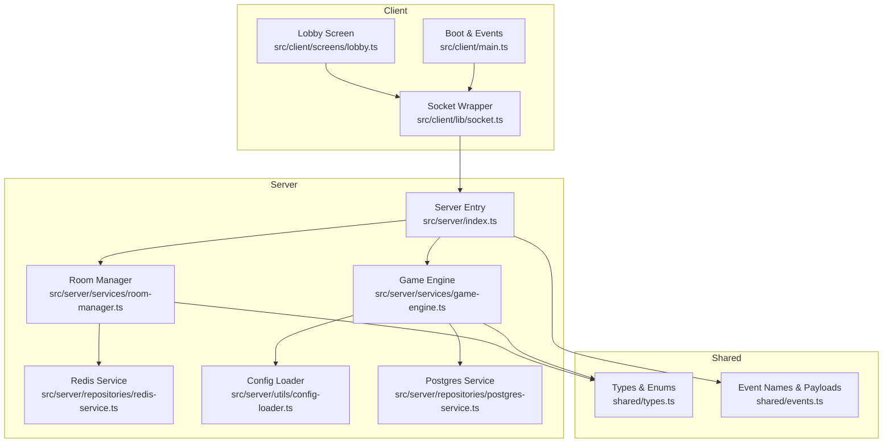
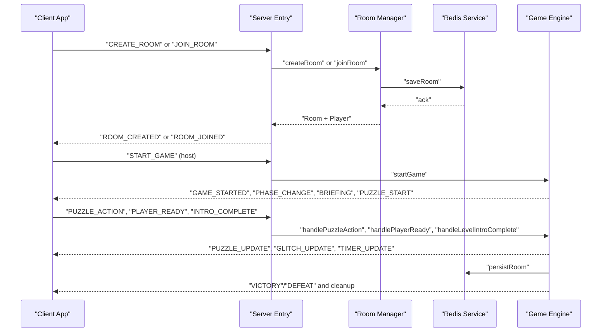
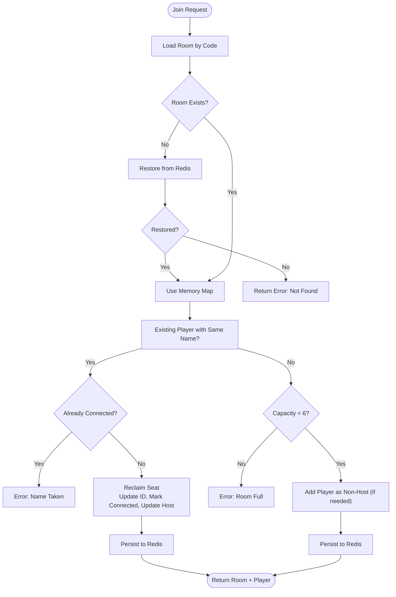
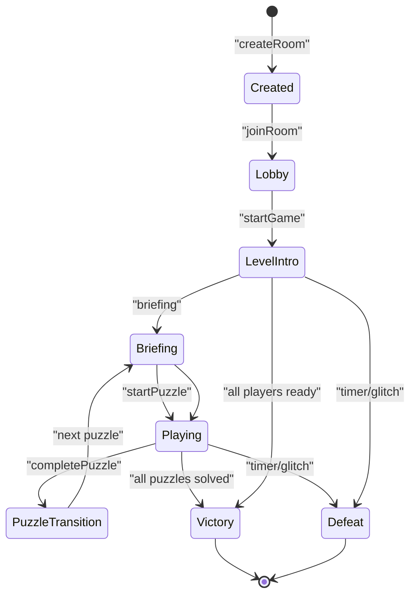
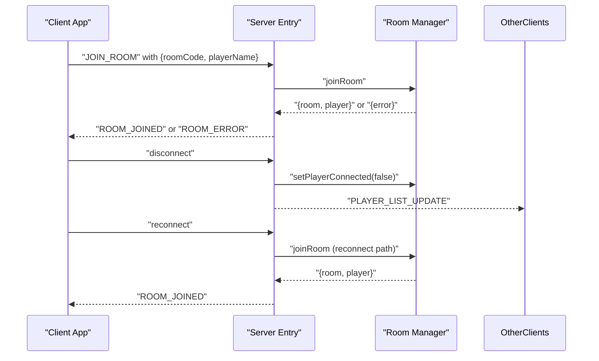
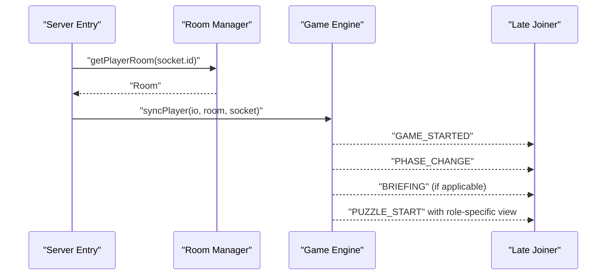
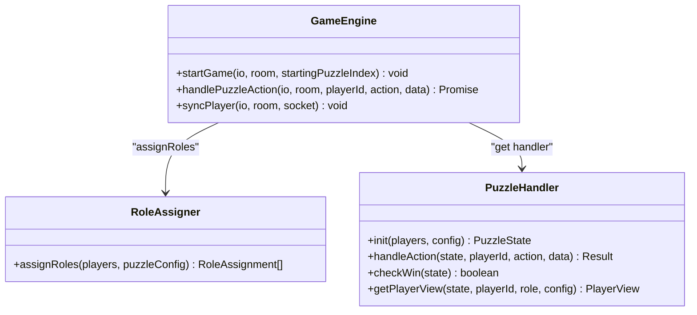
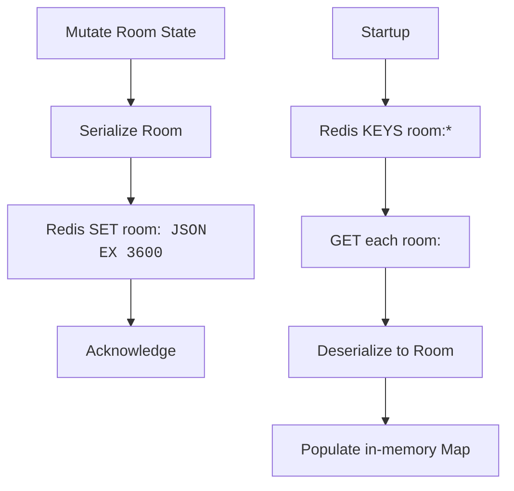
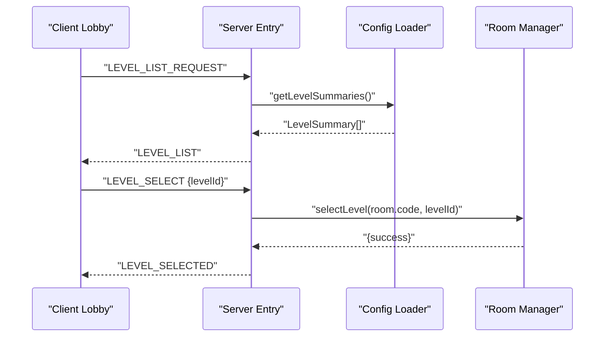
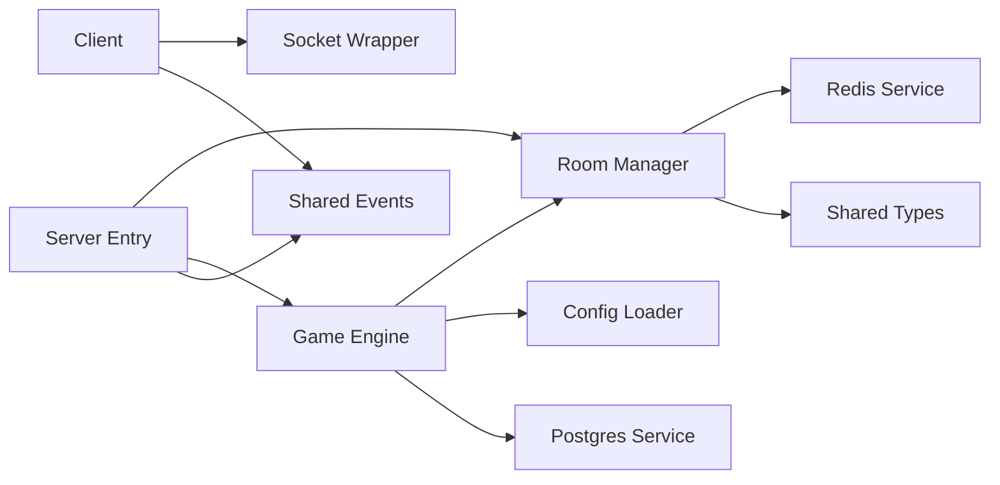

# Player Entry and Room Management

<cite>
**Referenced Files in This Document**
- [room-manager.ts](file://src/server/services/room-manager.ts)
- [game-engine.ts](file://src/server/services/game-engine.ts)
- [redis-service.ts](file://src/server/repositories/redis-service.ts)
- [types.ts](file://shared/types.ts)
- [events.ts](file://shared/events.ts)
- [index.ts](file://src/server/index.ts)
- [lobby.ts](file://src/client/screens/lobby.ts)
- [socket.ts](file://src/client/lib/socket.ts)
- [main.ts](file://src/client/main.ts)
- [role-assigner.ts](file://src/server/services/role-assigner.ts)
- [config-loader.ts](file://src/server/utils/config-loader.ts)
- [puzzle-handler.ts](file://src/server/puzzles/puzzle-handler.ts)
- [level_01.yaml](file://config/level_01.yaml)
- [SCHEMA.md](file://config/SCHEMA.md)
- [postgres-service.ts](file://src/server/repositories/postgres-service.ts)
</cite>

## Update Summary
**Changes Made**
- Updated Room Code Generation Details section to reflect the current CODE_WORDS array
- Removed mention of "deplhi" from room code generation examples
- Updated room code generation statistics to reflect the current 18-word array
- Enhanced room code generation reliability section with current word count

## Table of Contents
1. [Introduction](#introduction)
2. [Project Structure](#project-structure)
3. [Core Components](#core-components)
4. [Architecture Overview](#architecture-overview)
5. [Detailed Component Analysis](#detailed-component-analysis)
6. [Dependency Analysis](#dependency-analysis)
7. [Performance Considerations](#performance-considerations)
8. [Troubleshooting Guide](#troubleshooting-guide)
9. [Conclusion](#conclusion)
10. [Appendices](#appendices)

## Introduction
This document explains the player entry system that enables no-registration gameplay using 4-character room codes. It covers room creation, joining, and management, including room code generation, player authentication bypass, and session management. It also details the room lifecycle from creation to cleanup, player role assignment upon entry, and late-joiner synchronization mechanisms. Finally, it documents room state persistence, player tracking, and how the system handles player disconnections and reconnections, along with examples of room configuration, capacity limits, and the integration between room management and game engine orchestration.

## Project Structure
The player entry system spans client and server layers:
- Client: socket connection, lobby UI, and event-driven UI updates
- Server: room manager (in-memory with Redis persistence), game engine orchestration, and configuration loader
- Shared: strongly typed domain models and event definitions

**Diagram sources**
- [index.ts](file://src/server/index.ts#L86-L305)
- [room-manager.ts](file://src/server/services/room-manager.ts#L1-L262)
- [game-engine.ts](file://src/server/services/game-engine.ts#L1-L711)
- [redis-service.ts](file://src/server/repositories/redis-service.ts#L1-L68)
- [types.ts](file://shared/types.ts#L1-L187)
- [events.ts](file://shared/events.ts#L1-L228)
- [lobby.ts](file://src/client/screens/lobby.ts#L1-L435)
- [socket.ts](file://src/client/lib/socket.ts#L1-L85)
- [main.ts](file://src/client/main.ts#L1-L266)
- [config-loader.ts](file://src/server/utils/config-loader.ts#L1-L135)
- [postgres-service.ts](file://src/server/repositories/postgres-service.ts#L1-L68)

**Section sources**
- [index.ts](file://src/server/index.ts#L1-L321)
- [room-manager.ts](file://src/server/services/room-manager.ts#L1-L262)
- [game-engine.ts](file://src/server/services/game-engine.ts#L1-L711)
- [redis-service.ts](file://src/server/repositories/redis-service.ts#L1-L68)
- [types.ts](file://shared/types.ts#L1-L187)
- [events.ts](file://shared/events.ts#L1-L228)
- [lobby.ts](file://src/client/screens/lobby.ts#L1-L435)
- [socket.ts](file://src/client/lib/socket.ts#L1-L85)
- [main.ts](file://src/client/main.ts#L1-L266)
- [config-loader.ts](file://src/server/utils/config-loader.ts#L1-L135)
- [postgres-service.ts](file://src/server/repositories/postgres-service.ts#L1-L68)

## Core Components
- Room Manager: Creates rooms, assigns host, enforces capacity, tracks players, persists state to Redis, and handles reconnections.
- Game Engine: Orchestrates game lifecycle, phase transitions, role assignment, puzzle actions, and post-game cleanup.
- Redis Service: Serializes/deserializes rooms and scores, provides TTL-based persistence.
- Client Lobby: Captures player name and room code, emits join/create/start events, renders room state, and auto-restores sessions.
- Socket Layer: Typed client wrapper around Socket.IO with reconnection and error logging.
- Configuration Loader: Loads level configs, validates assets, and exposes summaries for the lobby.
- Postgres Service: Records game scores after victories.

**Section sources**
- [room-manager.ts](file://src/server/services/room-manager.ts#L1-L262)
- [game-engine.ts](file://src/server/services/game-engine.ts#L1-L711)
- [redis-service.ts](file://src/server/repositories/redis-service.ts#L1-L68)
- [lobby.ts](file://src/client/screens/lobby.ts#L1-L435)
- [socket.ts](file://src/client/lib/socket.ts#L1-L85)
- [config-loader.ts](file://src/server/utils/config-loader.ts#L1-L135)
- [postgres-service.ts](file://src/server/repositories/postgres-service.ts#L1-L68)

## Architecture Overview
The system uses Socket.IO for real-time communication, with Redis for multi-instance scalability and persistence of room state. Rooms are ephemeral in-memory structures with Redis-backed serialization. The game engine coordinates phases and puzzle orchestration, while the client renders UI and synchronizes state for late joiners.

**Diagram sources**
- [index.ts](file://src/server/index.ts#L86-L305)
- [room-manager.ts](file://src/server/services/room-manager.ts#L60-L154)
- [redis-service.ts](file://src/server/repositories/redis-service.ts#L40-L60)
- [game-engine.ts](file://src/server/services/game-engine.ts#L57-L139)
- [events.ts](file://shared/events.ts#L28-L90)

## Detailed Component Analysis

### Room Creation and Joining
- Room code generation uses memorable Greek-themed words first, falling back to random 4-character alphanumeric codes. Codes are unique per room and stored in an in-memory Map keyed by code.
- On create, the first player becomes host and is placed into the room with initial lobby state.
- On join, the system checks Redis for restoration if not present in memory. It supports reconnection of a player with the same name who previously disconnected, reclaiming their seat and updating host ownership if needed. Capacity is enforced at 6 players per room.
- Player identity is derived from the Socket.IO socket id; no external authentication is required.

**Diagram sources**
- [room-manager.ts](file://src/server/services/room-manager.ts#L89-L154)
- [redis-service.ts](file://src/server/repositories/redis-service.ts#L46-L50)

**Section sources**
- [room-manager.ts](file://src/server/services/room-manager.ts#L21-L42)
- [room-manager.ts](file://src/server/services/room-manager.ts#L89-L154)
- [redis-service.ts](file://src/server/repositories/redis-service.ts#L40-L50)

### Room Lifecycle and Persistence
- Creation: Generates code, creates initial state, stores in memory and Redis.
- Joining: Updates in-memory Map and Redis; late joiners receive sync payloads.
- Leaving: Removes player; if empty, deletes room from Redis; if host leaves, reassigns host to the next player.
- Persistence: All mutations persist via Redis saveRoom/getRoom/deleteRoom. TTL is applied to rooms.

**Diagram sources**
- [room-manager.ts](file://src/server/services/room-manager.ts#L60-L87)
- [game-engine.ts](file://src/server/services/game-engine.ts#L57-L139)
- [types.ts](file://shared/types.ts#L26-L49)

**Section sources**
- [room-manager.ts](file://src/server/services/room-manager.ts#L156-L189)
- [room-manager.ts](file://src/server/services/room-manager.ts#L239-L245)
- [redis-service.ts](file://src/server/repositories/redis-service.ts#L40-L55)

### Player Authentication Bypass and Session Management
- Authentication: No registration required. Player identity is the Socket.IO socket id; name is provided by the client.
- Session: Client stores player name and room code in localStorage for auto-restore. On reconnect, the client re-emits a join request if saved data is recent.
- Disconnection: Server marks player as disconnected and notifies others; reconnection logic allows reclaiming the seat.

**Diagram sources**
- [lobby.ts](file://src/client/screens/lobby.ts#L50-L82)
- [index.ts](file://src/server/index.ts#L297-L320)
- [room-manager.ts](file://src/server/services/room-manager.ts#L111-L131)

**Section sources**
- [lobby.ts](file://src/client/screens/lobby.ts#L40-L82)
- [index.ts](file://src/server/index.ts#L297-L320)
- [room-manager.ts](file://src/server/services/room-manager.ts#L111-L131)

### Late-Joiner Synchronization
- When a player joins mid-game, the server detects the non-lobby phase and invokes syncPlayer to replay mission context, current phase, and puzzle state for that player's role.

**Diagram sources**
- [index.ts](file://src/server/index.ts#L133-L136)
- [game-engine.ts](file://src/server/services/game-engine.ts#L601-L665)

**Section sources**
- [index.ts](file://src/server/index.ts#L133-L136)
- [game-engine.ts](file://src/server/services/game-engine.ts#L601-L665)

### Role Assignment and Puzzle Orchestration
- Roles are assigned per puzzle using a shuffled player list and the puzzle's layout definition. The last role may use "remaining" to capture all unassigned players.
- The game engine initializes puzzle state, broadcasts role assignments, and sends role-specific views to each player.

**Diagram sources**
- [role-assigner.ts](file://src/server/services/role-assigner.ts#L24-L77)
- [game-engine.ts](file://src/server/services/game-engine.ts#L263-L319)
- [puzzle-handler.ts](file://src/server/puzzles/puzzle-handler.ts#L12-L44)

**Section sources**
- [role-assigner.ts](file://src/server/services/role-assigner.ts#L24-L77)
- [game-engine.ts](file://src/server/services/game-engine.ts#L263-L319)
- [puzzle-handler.ts](file://src/server/puzzles/puzzle-handler.ts#L12-L44)

### Room State Persistence and Redis Integration
- Rooms are serialized to Redis with a TTL to prevent indefinite growth. Keys follow a pattern that includes the room code.
- Room restoration occurs on join if not found in memory, ensuring continuity across server restarts.

**Diagram sources**
- [redis-service.ts](file://src/server/repositories/redis-service.ts#L20-L37)
- [redis-service.ts](file://src/server/repositories/redis-service.ts#L40-L60)
- [room-manager.ts](file://src/server/services/room-manager.ts#L247-L261)

**Section sources**
- [redis-service.ts](file://src/server/repositories/redis-service.ts#L17-L67)
- [room-manager.ts](file://src/server/services/room-manager.ts#L247-L261)

### Room Configuration, Capacity Limits, and Integration
- Capacity limits are defined in level configuration files. The minimum and maximum player counts are validated and used by the lobby to enable/disable start buttons.
- The lobby requests level summaries and presents selectable missions. Hosts can choose a mission and optionally jump to a specific puzzle index.

**Diagram sources**
- [lobby.ts](file://src/client/screens/lobby.ts#L197-L236)
- [index.ts](file://src/server/index.ts#L173-L204)
- [config-loader.ts](file://src/server/utils/config-loader.ts#L122-L134)
- [room-manager.ts](file://src/server/services/room-manager.ts#L191-L204)

**Section sources**
- [level_01.yaml](file://config/level_01.yaml#L17-L24)
- [SCHEMA.md](file://config/SCHEMA.md#L12-L18)
- [lobby.ts](file://src/client/screens/lobby.ts#L197-L236)
- [index.ts](file://src/server/index.ts#L173-L204)
- [config-loader.ts](file://src/server/utils/config-loader.ts#L122-L134)
- [room-manager.ts](file://src/server/services/room-manager.ts#L191-L204)

## Dependency Analysis
- Room Manager depends on Redis service for persistence and on shared types for Room and Player models.
- Game Engine depends on Room Manager for room state, on Config Loader for level metadata, and on Postgres for scoring.
- Client depends on Socket wrapper for typed events and on shared events for payload contracts.

**Diagram sources**
- [room-manager.ts](file://src/server/services/room-manager.ts#L14-L16)
- [game-engine.ts](file://src/server/services/game-engine.ts#L14-L46)
- [index.ts](file://src/server/index.ts#L16-L44)
- [socket.ts](file://src/client/lib/socket.ts#L5-L7)
- [events.ts](file://shared/events.ts#L14-L25)

**Section sources**
- [room-manager.ts](file://src/server/services/room-manager.ts#L14-L16)
- [game-engine.ts](file://src/server/services/game-engine.ts#L14-L46)
- [index.ts](file://src/server/index.ts#L16-L44)
- [socket.ts](file://src/client/lib/socket.ts#L5-L7)
- [events.ts](file://shared/events.ts#L14-L25)

## Performance Considerations
- In-memory Map provides fast room lookup; Redis ensures durability and multi-instance consistency.
- Room TTL prevents stale data accumulation; consider periodic cleanup jobs if needed.
- Shuffling players for role assignment is O(n) per puzzle; keep player lists small for minimal overhead.
- Game timers are per active room; ensure cleanup on victory/defeat to avoid resource leaks.

## Troubleshooting Guide
- Room not found: Verify room code spelling and case normalization; ensure Redis connectivity.
- Name already taken: Choose a different name; disconnected players can reclaim their seat automatically.
- Room full: Increase capacity via level configuration or wait for a slot to free up.
- Persistent state not restored: Confirm Redis availability and that room keys exist under the expected pattern.
- Scores not recorded: Check Postgres connectivity and table permissions.

**Section sources**
- [room-manager.ts](file://src/server/services/room-manager.ts#L93-L116)
- [redis-service.ts](file://src/server/repositories/redis-service.ts#L9-L15)
- [postgres-service.ts](file://src/server/repositories/postgres-service.ts#L14-L22)

## Conclusion
The player entry system delivers a seamless no-registration experience with memorable 4-character room codes. Room Manager and Redis provide robust, scalable room state management, while the Game Engine orchestrates game phases and puzzle interactions. The client integrates tightly with Socket.IO to offer responsive UI updates and automatic session restoration. Together, these components support a smooth player journey from creation to completion, with resilient handling of disconnections and reconnections.

## Appendices

### Room Code Generation Details
- Uses a curated list of 18 memorable Greek-themed words for room codes. The current CODE_WORDS array includes: zeus, hera, ares, iris, nike, echo, gaia, eros, ajax, orph, stoa, muse, sparta, athens, myth, aegean, crete, and minoan.
- If a collision occurs with any of these words, the system falls back to generating random 4-character alphanumeric codes.
- The system ensures uniqueness by checking presence in the in-memory Map before accepting a code.
- Room code generation is highly reliable with 18 words providing 18 unique memorable codes, with fallback to 1.6 million possible alphanumeric combinations.

**Updated** The CODE_WORDS array has been cleaned up to improve consistency in memorable room code naming conventions, removing any potentially confusing or non-standard entries while maintaining system functionality.

**Section sources**
- [room-manager.ts](file://src/server/services/room-manager.ts#L20-L41)

### Player Role Assignment Examples
- Layout supports fixed counts and "remaining" roles; the assigner shuffles players to distribute roles fairly.
- Single-player scenarios are supported with appropriate debug behavior.

**Section sources**
- [role-assigner.ts](file://src/server/services/role-assigner.ts#L24-L77)
- [level_01.yaml](file://config/level_01.yaml#L40-L47)

### Room Capacity and Level Configuration
- Levels define min/max players and timer settings; lobby enforces these constraints when enabling start actions.
- Theme CSS and audio cues are validated against filesystem locations.

**Section sources**
- [level_01.yaml](file://config/level_01.yaml#L17-L24)
- [SCHEMA.md](file://config/SCHEMA.md#L12-L18)
- [config-validator.ts](file://src/server/utils/config-validator.ts#L30-L53)