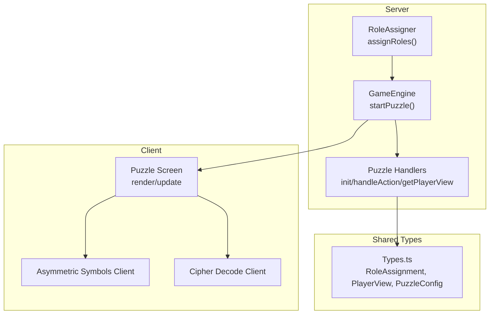
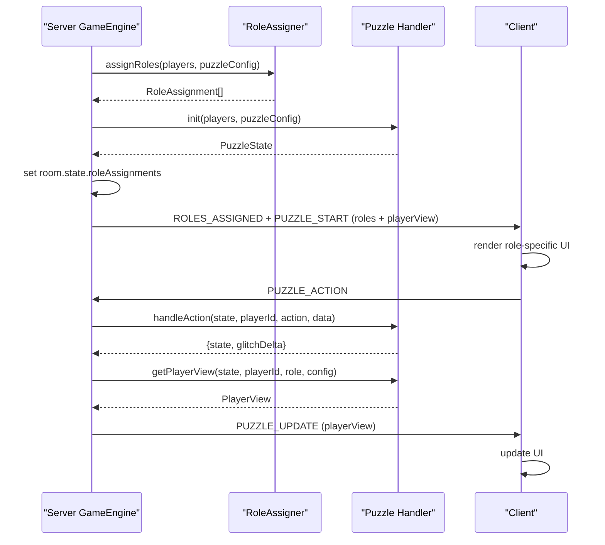
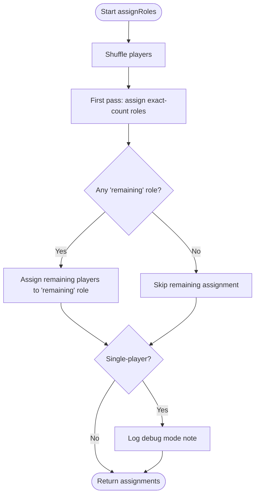
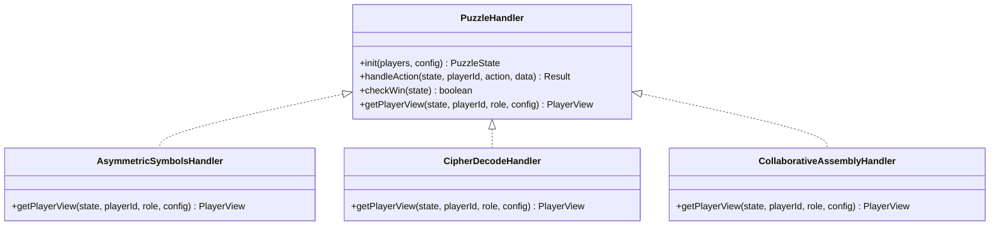
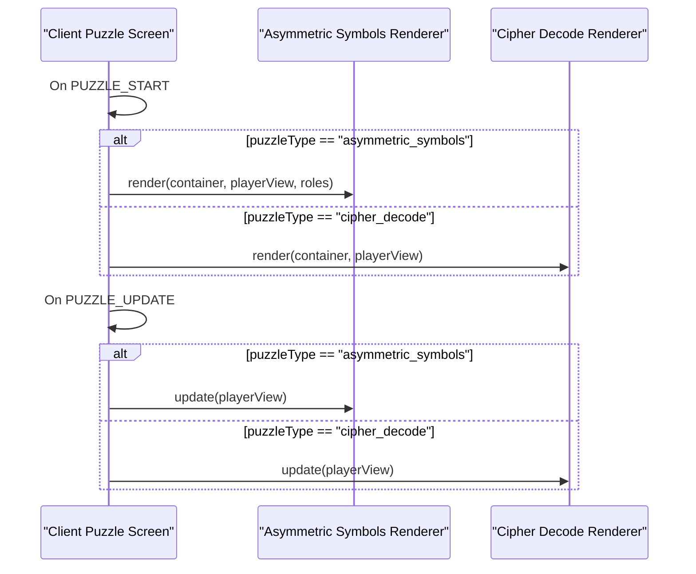
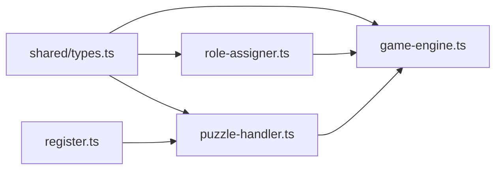

# Role Assignment System

<cite>
**Referenced Files in This Document**
- [role-assigner.ts](file://src/server/services/role-assigner.ts)
- [game-engine.ts](file://src/server/services/game-engine.ts)
- [types.ts](file://shared/types.ts)
- [puzzle-handler.ts](file://src/server/puzzles/puzzle-handler.ts)
- [asymmetric-symbols.ts](file://src/server/puzzles/asymmetric-symbols.ts)
- [cipher-decode.ts](file://src/server/puzzles/cipher-decode.ts)
- [collaborative-assembly.ts](file://src/server/puzzles/collaborative-assembly.ts)
- [puzzle.ts](file://src/client/screens/puzzle.ts)
- [asymmetric-symbols-client.ts](file://src/client/puzzles/asymmetric-symbols.ts)
- [cipher-decode-client.ts](file://src/client/puzzles/cipher-decode.ts)
- [level_01.yaml](file://config/level_01.yaml)
- [level_02.yaml](file://config/level_02.yaml)
- [register.ts](file://src/server/puzzles/register.ts)
</cite>

## Table of Contents
1. [Introduction](#introduction)
2. [Project Structure](#project-structure)
3. [Core Components](#core-components)
4. [Architecture Overview](#architecture-overview)
5. [Detailed Component Analysis](#detailed-component-analysis)
6. [Dependency Analysis](#dependency-analysis)
7. [Performance Considerations](#performance-considerations)
8. [Troubleshooting Guide](#troubleshooting-guide)
9. [Conclusion](#conclusion)

## Introduction
This document explains the role assignment system that creates asymmetric puzzle experiences. It covers how players are randomly assigned roles (such as "Navigator", "Decoder", "Cryptographer", "Scribe", "Architect", "Builder") at the start of each puzzle, how the assignment algorithm works, how roles affect puzzle state visibility, and how client-side components render different interfaces based on assigned roles. It also includes examples of role assignments across different puzzle types and describes the collaborative gameplay mechanics that require players to communicate and coordinate despite having different information.

## Project Structure
The role assignment system spans server-side orchestration, puzzle-specific handlers, and client-side rendering. Key areas:
- Server services: role assignment and game engine orchestration
- Puzzle handlers: initialization, actions, win conditions, and role-specific views
- Client screens and puzzle renderers: UI composition and event handling
- Configuration: YAML level files define roles per puzzle

**Diagram sources**
- [role-assigner.ts](file://src/server/services/role-assigner.ts#L24-L77)
- [game-engine.ts](file://src/server/services/game-engine.ts#L263-L319)
- [puzzle-handler.ts](file://src/server/puzzles/puzzle-handler.ts#L12-L44)
- [types.ts](file://shared/types.ts#L64-L164)
- [puzzle.ts](file://src/client/screens/puzzle.ts#L23-L101)
- [asymmetric-symbols-client.ts](file://src/client/puzzles/asymmetric-symbols.ts#L28-L105)
- [cipher-decode-client.ts](file://src/client/puzzles/cipher-decode.ts#L10-L20)

**Section sources**
- [role-assigner.ts](file://src/server/services/role-assigner.ts#L1-L78)
- [game-engine.ts](file://src/server/services/game-engine.ts#L263-L319)
- [types.ts](file://shared/types.ts#L64-L164)
- [puzzle-handler.ts](file://src/server/puzzles/puzzle-handler.ts#L12-L44)
- [puzzle.ts](file://src/client/screens/puzzle.ts#L23-L101)

## Core Components
- RoleAssigner: Shuffles players and assigns roles according to puzzle layout definitions, supporting exact counts and "remaining" distribution.
- GameEngine: Coordinates puzzle lifecycle, triggers role assignment, initializes puzzle state, and sends role-specific views to clients.
- Puzzle Handlers: Implement init, handleAction, checkWin, and getPlayerView to enforce asymmetric information per role.
- Client Screens/Puzzles: Render role-specific UI and handle user interactions that are forwarded to the server.

**Section sources**
- [role-assigner.ts](file://src/server/services/role-assigner.ts#L24-L77)
- [game-engine.ts](file://src/server/services/game-engine.ts#L263-L319)
- [puzzle-handler.ts](file://src/server/puzzles/puzzle-handler.ts#L12-L44)
- [types.ts](file://shared/types.ts#L64-L164)

## Architecture Overview
The system follows a strict separation of concerns:
- Roles are computed server-side and persisted in room state.
- Each puzzle handler defines what each role can see via getPlayerView.
- Clients receive a PlayerView tailored to their role and render accordingly.
- Actions are validated server-side and broadcast updated views to all players.

**Diagram sources**
- [game-engine.ts](file://src/server/services/game-engine.ts#L263-L319)
- [role-assigner.ts](file://src/server/services/role-assigner.ts#L24-L77)
- [puzzle-handler.ts](file://src/server/puzzles/puzzle-handler.ts#L12-L44)

## Detailed Component Analysis

### Role Assignment Algorithm
The algorithm randomizes players and assigns roles based on the puzzle’s layout:
- Shuffles a copy of the players array.
- Iterates through roles defined in the puzzle layout.
- Assigns exact-count roles first; remaining players are assigned to the role marked as "remaining".
- Single-player debug mode ensures the one player receives all role information.

**Diagram sources**
- [role-assigner.ts](file://src/server/services/role-assigner.ts#L24-L77)

**Section sources**
- [role-assigner.ts](file://src/server/services/role-assigner.ts#L24-L77)

### Role Distribution Logic
Role definitions live in puzzle configuration under layout.roles. Each definition specifies:
- name: display name of the role
- count: either an exact number or "remaining"
- description: contextual narrative for the role

Examples:
- Asymmetric Symbols: one Navigator, remaining Decoders
- Cipher Decode: one Cryptographer, remaining Scribes
- Collaborative Assembly: one Architect, remaining Builders

**Section sources**
- [level_01.yaml](file://config/level_01.yaml#L40-L47)
- [level_01.yaml](file://config/level_01.yaml#L141-L148)
- [level_01.yaml](file://config/level_01.yaml#L197-L204)
- [level_02.yaml](file://config/level_02.yaml#L49-L56)
- [level_02.yaml](file://config/level_02.yaml#L118-L122)
- [level_02.yaml](file://config/level_02.yaml#L188-L194)

### Role-Specific View Generation
Each puzzle handler implements getPlayerView to tailor data to the player’s role:
- Asymmetric Symbols: Navigator sees solution words and progress; Decoders see current word length, captured letters, and counters.
- Cipher Decode: Cryptographer sees cipher key and current encrypted text; Scribes see encrypted text and their own attempts.
- Collaborative Assembly: Architect sees blueprint; Builders see their own pieces and placed pieces.

**Diagram sources**
- [puzzle-handler.ts](file://src/server/puzzles/puzzle-handler.ts#L12-L44)
- [asymmetric-symbols.ts](file://src/server/puzzles/asymmetric-symbols.ts#L103-L154)
- [cipher-decode.ts](file://src/server/puzzles/cipher-decode.ts#L96-L140)
- [collaborative-assembly.ts](file://src/server/puzzles/collaborative-assembly.ts#L147-L216)

**Section sources**
- [asymmetric-symbols.ts](file://src/server/puzzles/asymmetric-symbols.ts#L103-L154)
- [cipher-decode.ts](file://src/server/puzzles/cipher-decode.ts#L96-L140)
- [collaborative-assembly.ts](file://src/server/puzzles/collaborative-assembly.ts#L147-L216)

### Client-Side Rendering and Interaction
Client-side screens and puzzle renderers:
- The puzzle screen listens for PUZZLE_START and routes to the appropriate renderer based on puzzle type.
- Renderers switch UI depending on the player’s role and update DOM on PUZZLE_UPDATE.
- Interactions (e.g., capturing letters, submitting decodes, placing pieces) are emitted to the server as PUZZLE_ACTION messages.

**Diagram sources**
- [puzzle.ts](file://src/client/screens/puzzle.ts#L23-L101)
- [asymmetric-symbols-client.ts](file://src/client/puzzles/asymmetric-symbols.ts#L28-L105)
- [cipher-decode-client.ts](file://src/client/puzzles/cipher-decode.ts#L10-L20)

**Section sources**
- [puzzle.ts](file://src/client/screens/puzzle.ts#L23-L101)
- [asymmetric-symbols-client.ts](file://src/client/puzzles/asymmetric-symbols.ts#L28-L105)
- [cipher-decode-client.ts](file://src/client/puzzles/cipher-decode.ts#L10-L20)

### Examples of Role Assignments Across Puzzles
- Asymmetric Symbols (Akropolis Defragmentation):
  - Layout: 1 Navigator, remaining Decoders
  - Example: 3 players → one Navigator, two Decoders
- Cipher Decode (Philosopher's Cipher):
  - Layout: 1 Cryptographer, remaining Scribes
  - Example: 4 players → one Cryptographer, three Scribes
- Collaborative Assembly (Parthenon Reconstruction):
  - Layout: 1 Architect, remaining Builders
  - Example: 5 players → one Architect, four Builders

These assignments are defined in level configuration YAML files and enforced by the RoleAssigner.

**Section sources**
- [level_01.yaml](file://config/level_01.yaml#L40-L47)
- [level_01.yaml](file://config/level_01.yaml#L141-L148)
- [level_01.yaml](file://config/level_01.yaml#L197-L204)
- [level_02.yaml](file://config/level_02.yaml#L49-L56)
- [level_02.yaml](file://config/level_02.yaml#L118-L122)
- [level_02.yaml](file://config/level_02.yaml#L188-L194)

### Collaborative Gameplay Mechanics
Despite asymmetric information, collaboration is essential:
- Asymmetric Symbols: Navigator calls out letters; Decoders capture them to spell words.
- Cipher Decode: Cryptographer shares the key; Scribes submit decoded sentences.
- Collaborative Assembly: Architect provides blueprint; Builders place pieces.
- Communication channels (voice/text) are required to coordinate actions and share insights.

**Section sources**
- [asymmetric-symbols.ts](file://src/server/puzzles/asymmetric-symbols.ts#L120-L153)
- [cipher-decode.ts](file://src/server/puzzles/cipher-decode.ts#L113-L139)
- [collaborative-assembly.ts](file://src/server/puzzles/collaborative-assembly.ts#L155-L215)

## Dependency Analysis
The role assignment system relies on:
- Shared types for consistent data contracts (RoleAssignment, PlayerView, PuzzleConfig)
- Puzzle registration to bind types to handlers
- Game engine orchestration to trigger role assignment and view distribution

**Diagram sources**
- [types.ts](file://shared/types.ts#L64-L164)
- [role-assigner.ts](file://src/server/services/role-assigner.ts#L5-L6)
- [game-engine.ts](file://src/server/services/game-engine.ts#L14-L46)
- [puzzle-handler.ts](file://src/server/puzzles/puzzle-handler.ts#L5-L6)
- [register.ts](file://src/server/puzzles/register.ts#L5-L21)

**Section sources**
- [types.ts](file://shared/types.ts#L64-L164)
- [register.ts](file://src/server/puzzles/register.ts#L5-L21)

## Performance Considerations
- Role assignment is O(n) in the number of players due to shuffling and linear passes.
- getPlayerView is invoked per player on each update; keep view computations lightweight.
- Client-side rendering updates should batch DOM changes to minimize reflows.
- Avoid excessive logging in production to reduce overhead.

## Troubleshooting Guide
Common issues and resolutions:
- Roles not assigned: Verify layout.roles includes a "remaining" role when not all players are covered by exact counts.
- Incorrect role distribution: Confirm player count meets minimum requirements and that the assignment occurs before puzzle start.
- Client not receiving role-specific view: Ensure the handler’s getPlayerView returns a valid PlayerView for the current role.
- Action not processed: Check that handleAction validates ownership and correctness before updating state.

**Section sources**
- [role-assigner.ts](file://src/server/services/role-assigner.ts#L24-L77)
- [game-engine.ts](file://src/server/services/game-engine.ts#L324-L383)
- [puzzle-handler.ts](file://src/server/puzzles/puzzle-handler.ts#L12-L44)

## Conclusion
The role assignment system enables asymmetric puzzle experiences by:
- Randomizing role assignments per puzzle
- Enforcing role-specific visibility via getPlayerView
- Driving client-side UI rendering and interaction
- Requiring communication and coordination among players with different information

This design supports diverse puzzle types while maintaining fairness and challenge through asymmetric roles and collaborative mechanics.