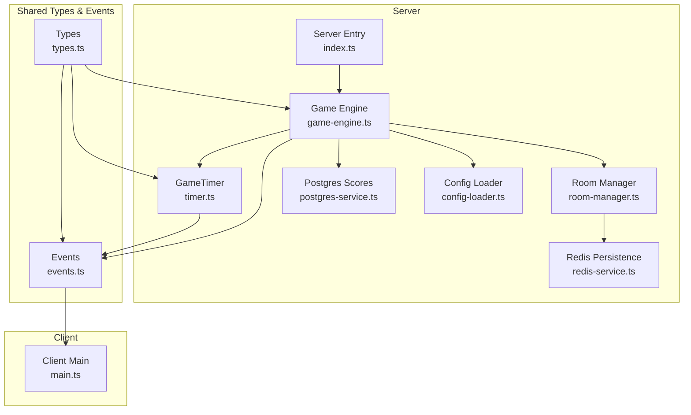
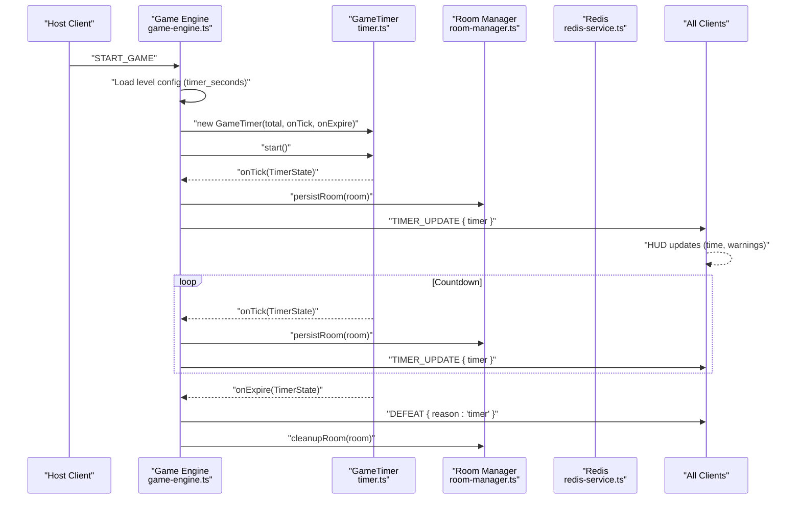
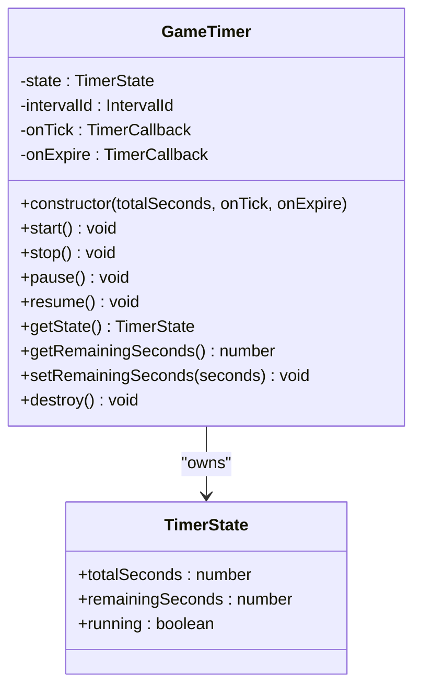
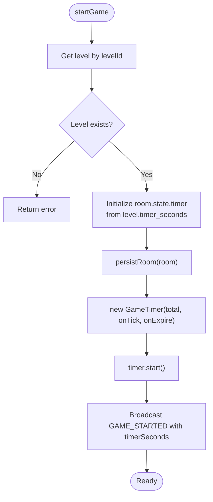
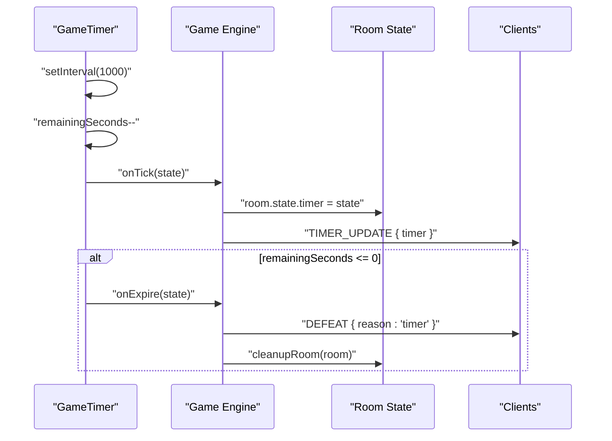
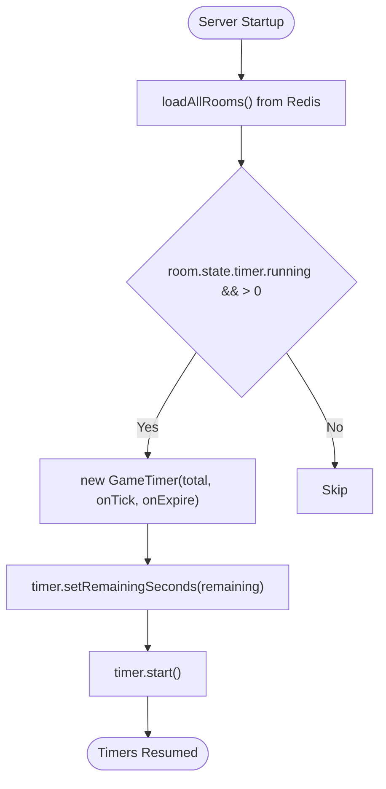
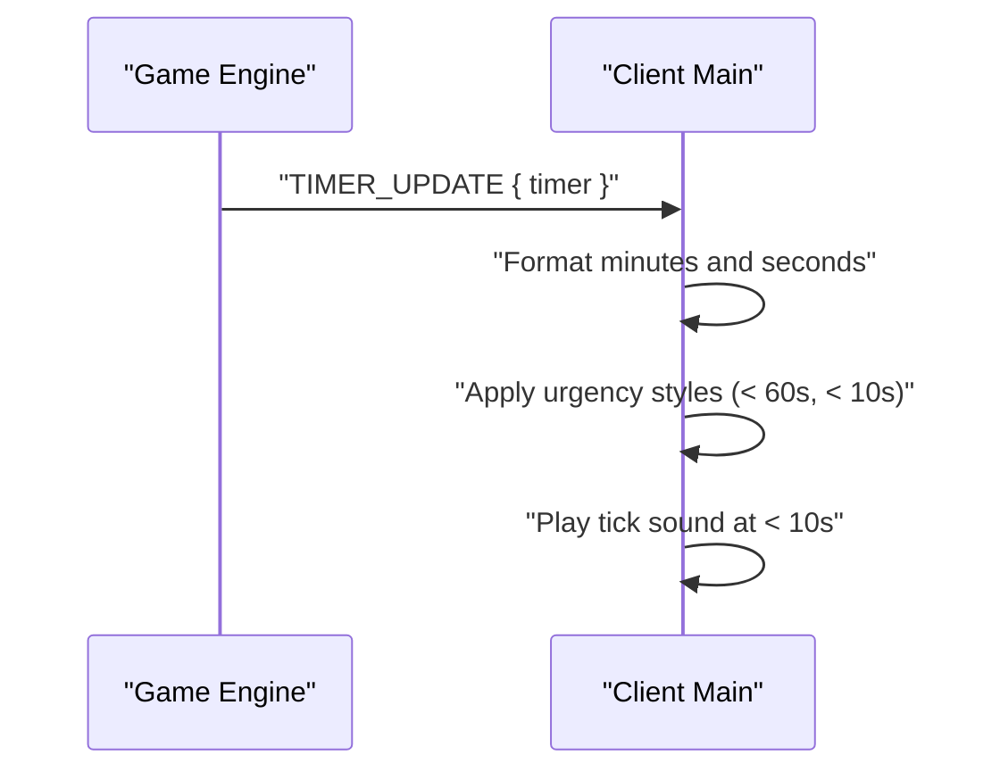
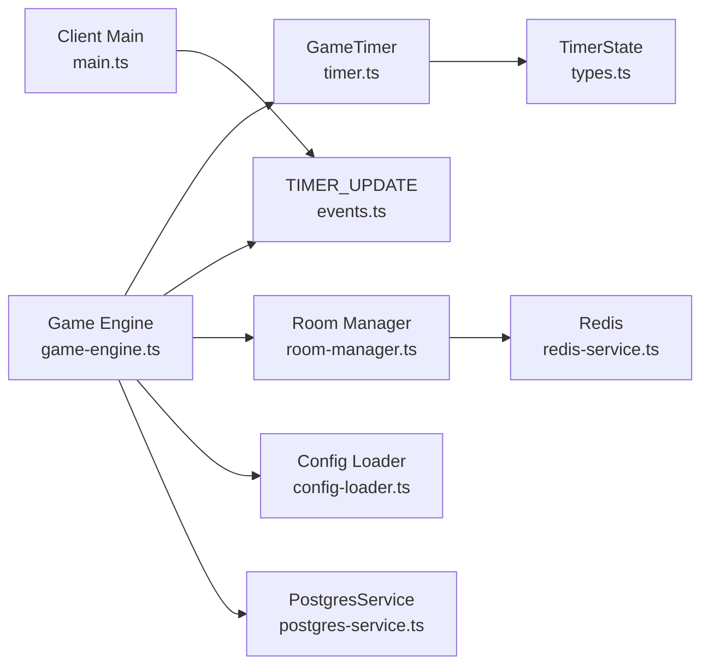
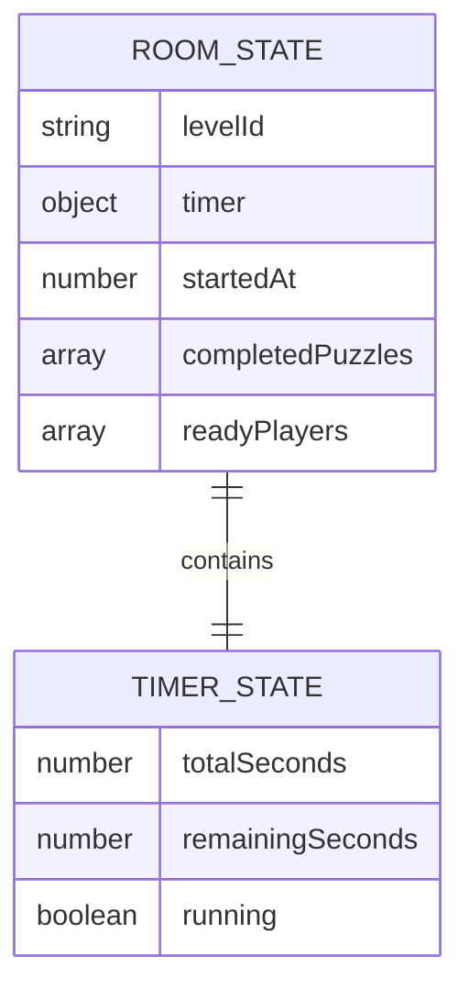

# Timer Mechanics

<cite>
**Referenced Files in This Document**
- [timer.ts](file://src/server/utils/timer.ts)
- [game-engine.ts](file://src/server/services/game-engine.ts)
- [events.ts](file://shared/events.ts)
- [types.ts](file://shared/types.ts)
- [config-loader.ts](file://src/server/utils/config-loader.ts)
- [room-manager.ts](file://src/server/services/room-manager.ts)
- [redis-service.ts](file://src/server/repositories/redis-service.ts)
- [postgres-service.ts](file://src/server/repositories/postgres-service.ts)
- [index.ts](file://src/server/index.ts)
- [main.ts](file://src/client/main.ts)
- [level_01.yaml](file://config/level_01.yaml)
- [SCHEMA.md](file://config/SCHEMA.md)
</cite>

## Table of Contents
1. [Introduction](#introduction)
2. [Project Structure](#project-structure)
3. [Core Components](#core-components)
4. [Architecture Overview](#architecture-overview)
5. [Detailed Component Analysis](#detailed-component-analysis)
6. [Dependency Analysis](#dependency-analysis)
7. [Performance Considerations](#performance-considerations)
8. [Troubleshooting Guide](#troubleshooting-guide)
9. [Conclusion](#conclusion)
10. [Appendices](#appendices)

## Introduction
This document explains the timer system that governs game duration and creates urgency in the escape room game. It covers the GameTimer class implementation, initialization with level configurations, real-time countdown mechanics, persistence across server restarts, resume functionality, cleanup processes, timer update events, broadcast mechanisms, and client-side synchronization. It also provides examples of timer configuration per level, state management, and how timer expiration leads to defeat conditions. Finally, it addresses timer accuracy, performance considerations, and integration with other game systems.

## Project Structure
The timer system spans several modules:
- Server-side timer implementation and orchestration
- Level configuration that defines game duration
- Room state persistence and restoration
- Real-time event broadcasting to clients
- Client-side HUD synchronization and UX feedback



**Diagram sources**
- [timer.ts](file://src/server/utils/timer.ts#L1-L81)
- [game-engine.ts](file://src/server/services/game-engine.ts#L1-L711)
- [room-manager.ts](file://src/server/services/room-manager.ts#L1-L262)
- [redis-service.ts](file://src/server/repositories/redis-service.ts#L1-L68)
- [postgres-service.ts](file://src/server/repositories/postgres-service.ts#L1-L68)
- [config-loader.ts](file://src/server/utils/config-loader.ts#L1-L135)
- [index.ts](file://src/server/index.ts#L1-L321)
- [types.ts](file://shared/types.ts#L1-L187)
- [events.ts](file://shared/events.ts#L1-L228)
- [main.ts](file://src/client/main.ts#L1-L266)

**Section sources**
- [timer.ts](file://src/server/utils/timer.ts#L1-L81)
- [game-engine.ts](file://src/server/services/game-engine.ts#L1-L711)
- [room-manager.ts](file://src/server/services/room-manager.ts#L1-L262)
- [redis-service.ts](file://src/server/repositories/redis-service.ts#L1-L68)
- [postgres-service.ts](file://src/server/repositories/postgres-service.ts#L1-L68)
- [config-loader.ts](file://src/server/utils/config-loader.ts#L1-L135)
- [index.ts](file://src/server/index.ts#L1-L321)
- [types.ts](file://shared/types.ts#L1-L187)
- [events.ts](file://shared/events.ts#L1-L228)
- [main.ts](file://src/client/main.ts#L1-L266)

## Core Components
- GameTimer: A server-authoritative countdown with tick callbacks, expiration handling, and lifecycle controls (start, stop, pause, resume, destroy).
- Game Engine: Initializes the timer per room from level configuration, broadcasts updates, and triggers defeat on expiration.
- Room Manager: Persists room state (including timer) to Redis and restores it on startup.
- Config Loader: Loads level YAML files containing timer_seconds and other game parameters.
- Client Main: Subscribes to timer updates and renders the HUD with urgency cues.

Key responsibilities:
- Timer initialization: The engine reads level.timer_seconds and constructs a GameTimer.
- Real-time updates: Each second, the timer emits a TIMER_UPDATE event with the current TimerState.
- Expiration: On reaching zero, the timer stops and emits a defeat condition.
- Persistence: Room state is saved to Redis; server restarts can resume timers from persisted state.
- Client sync: The client listens for TIMER_UPDATE and updates the HUD.

**Section sources**
- [timer.ts](file://src/server/utils/timer.ts#L10-L80)
- [game-engine.ts](file://src/server/services/game-engine.ts#L57-L139)
- [room-manager.ts](file://src/server/services/room-manager.ts#L239-L245)
- [config-loader.ts](file://src/server/utils/config-loader.ts#L98-L110)
- [main.ts](file://src/client/main.ts#L92-L111)

## Architecture Overview
The timer system is orchestrated by the Game Engine and implemented by GameTimer. The engine loads level configuration, initializes the timer, and manages its lifecycle. Room state is persisted to Redis so the timer can resume after server restarts. Clients receive real-time updates via Socket.io events and synchronize their HUD accordingly.



**Diagram sources**
- [game-engine.ts](file://src/server/services/game-engine.ts#L57-L139)
- [timer.ts](file://src/server/utils/timer.ts#L30-L45)
- [room-manager.ts](file://src/server/services/room-manager.ts#L239-L245)
- [redis-service.ts](file://src/server/repositories/redis-service.ts#L40-L55)
- [events.ts](file://shared/events.ts#L74-L80)
- [main.ts](file://src/client/main.ts#L92-L111)

## Detailed Component Analysis

### GameTimer Class
The GameTimer encapsulates a server-authoritative countdown with:
- State: totalSeconds, remainingSeconds, running
- Callbacks: onTick(timerState), onExpire(timerState)
- Methods: start, stop, pause, resume, getState, getRemainingSeconds, setRemainingSeconds, destroy

Behavior:
- start: Creates a 1-second interval; decrements remainingSeconds and invokes onTick; if remainingSeconds reaches zero, stops and invokes onExpire.
- stop/pause: Clears the interval and marks running=false.
- resume: Starts the timer again (useful after pause).
- destroy: Stops the timer to release resources.



**Diagram sources**
- [timer.ts](file://src/server/utils/timer.ts#L10-L80)
- [types.ts](file://shared/types.ts#L58-L62)

**Section sources**
- [timer.ts](file://src/server/utils/timer.ts#L10-L80)
- [types.ts](file://shared/types.ts#L58-L62)

### Timer Initialization with Level Configurations
The Game Engine initializes the timer using level configuration:
- Retrieves level by room.state.levelId
- Uses level.timer_seconds to seed the timer
- Emits GAME_STARTED with timerSeconds for client-side initialization
- Creates a GameTimer with onTick and onExpire callbacks



**Diagram sources**
- [game-engine.ts](file://src/server/services/game-engine.ts#L57-L139)
- [config-loader.ts](file://src/server/utils/config-loader.ts#L98-L110)
- [events.ts](file://shared/events.ts#L153-L164)

**Section sources**
- [game-engine.ts](file://src/server/services/game-engine.ts#L57-L139)
- [config-loader.ts](file://src/server/utils/config-loader.ts#L98-L110)
- [events.ts](file://shared/events.ts#L153-L164)

### Real-Time Countdown Mechanics and Broadcast
Each tick:
- GameTimer decrements remainingSeconds and calls onTick with a copy of the state
- The engine updates room.state.timer and emits TIMER_UPDATE to all clients
- Clients render the time and switch to urgent visuals when time is low

Expiration:
- When remainingSeconds reaches zero, GameTimer stops and calls onExpire
- The engine transitions to defeat with reason "timer" and cleans up



**Diagram sources**
- [timer.ts](file://src/server/utils/timer.ts#L30-L45)
- [game-engine.ts](file://src/server/services/game-engine.ts#L118-L129)
- [events.ts](file://shared/events.ts#L74-L80)

**Section sources**
- [timer.ts](file://src/server/utils/timer.ts#L30-L45)
- [game-engine.ts](file://src/server/services/game-engine.ts#L118-L129)
- [events.ts](file://shared/events.ts#L209-L211)

### Timer Persistence Across Server Restarts
Persistence strategy:
- Room state (including timer) is persisted to Redis on state changes
- On server startup, all rooms are loaded from Redis
- The resumeRoomTimers function reconstructs timers for rooms whose timer is running and has remaining time
- It sets the remainingSeconds from persisted state and starts the timer



**Diagram sources**
- [index.ts](file://src/server/index.ts#L64-L72)
- [room-manager.ts](file://src/server/services/room-manager.ts#L247-L261)
- [game-engine.ts](file://src/server/services/game-engine.ts#L569-L596)
- [redis-service.ts](file://src/server/repositories/redis-service.ts#L40-L55)

**Section sources**
- [index.ts](file://src/server/index.ts#L64-L72)
- [room-manager.ts](file://src/server/services/room-manager.ts#L247-L261)
- [game-engine.ts](file://src/server/services/game-engine.ts#L569-L596)
- [redis-service.ts](file://src/server/repositories/redis-service.ts#L40-L55)

### Timer Update Events and Client-Side Synchronization
Server emits TIMER_UPDATE with the current TimerState. The client:
- Parses remainingSeconds
- Formats MM:SS display
- Applies visual warnings when time is low
- Plays urgency sounds when time drops below thresholds



**Diagram sources**
- [events.ts](file://shared/events.ts#L209-L211)
- [main.ts](file://src/client/main.ts#L92-L111)

**Section sources**
- [events.ts](file://shared/events.ts#L209-L211)
- [main.ts](file://src/client/main.ts#L92-L111)

### Timer State Management and Cleanup
Lifecycle:
- Creation: startGame initializes room.state.timer and creates a GameTimer
- Running: periodic ticks update state and persist
- Pause/Resume: stop/pause/resume manipulate the interval and running flag
- Cleanup: victory/defeat routes stop the timer and remove it from roomTimers

```mermaid
flowchart TD
Create(["Create Timer"]) --> Start["start()"]
Start --> Tick["onTick(state)"]
Tick --> Persist["persistRoom(room)"]
Tick --> Broadcast["emit TIMER_UPDATE"]
alt running?
Tick --> Tick
else expired?
Expire["onExpire(state)"] --> Defeat["emit DEFEAT"]
Defeat --> Cleanup["cleanupRoom(room)"]
end
```

**Diagram sources**
- [game-engine.ts](file://src/server/services/game-engine.ts#L526-L565)
- [timer.ts](file://src/server/utils/timer.ts#L30-L80)

**Section sources**
- [game-engine.ts](file://src/server/services/game-engine.ts#L526-L565)
- [timer.ts](file://src/server/utils/timer.ts#L30-L80)

### Timer Accuracy and Performance Considerations
Accuracy:
- The timer relies on JavaScript setInterval with 1000ms intervals. While simple, this can drift slightly over time due to event loop delays and GC pauses.
- For higher accuracy, consider using Date.now() deltas and adjusting the next tick dynamically.

Performance:
- Each tick performs a shallow copy of the state before emitting, minimizing mutation side effects.
- Persistence occurs on each tick; batching writes could reduce database pressure if needed.
- The engine maintains a Map of roomTimers keyed by room code for efficient lookup and cleanup.

Integration:
- Timer integrates with puzzle systems via glitch penalties that can indirectly shorten effective game time.
- Victory/defeat logic uses elapsed time and glitch metrics to compute scores.

**Section sources**
- [timer.ts](file://src/server/utils/timer.ts#L30-L45)
- [game-engine.ts](file://src/server/services/game-engine.ts#L451-L456)
- [postgres-service.ts](file://src/server/repositories/postgres-service.ts#L28-L39)

### Examples of Timer Configuration Per Level
Timer configuration is defined in level YAML files:
- timer_seconds: total game duration in seconds
- glitch: max and decay settings influence game balance

Example references:
- Level 01 YAML defines timer_seconds and glitch parameters.
- Schema documentation enumerates required fields and defaults.

**Section sources**
- [level_01.yaml](file://config/level_01.yaml#L19-L23)
- [SCHEMA.md](file://config/SCHEMA.md#L14-L16)

## Dependency Analysis
The timer system depends on:
- Types for TimerState and GameState
- Events for TIMER_UPDATE and related payloads
- Room Manager for persistence hooks
- Redis for cross-instance and restart resilience
- Config Loader for level parameters
- Postgres for scoring post-game



**Diagram sources**
- [timer.ts](file://src/server/utils/timer.ts#L1-L81)
- [game-engine.ts](file://src/server/services/game-engine.ts#L1-L711)
- [types.ts](file://shared/types.ts#L58-L62)
- [events.ts](file://shared/events.ts#L74-L80)
- [room-manager.ts](file://src/server/services/room-manager.ts#L1-L262)
- [redis-service.ts](file://src/server/repositories/redis-service.ts#L1-L68)
- [config-loader.ts](file://src/server/utils/config-loader.ts#L1-L135)
- [postgres-service.ts](file://src/server/repositories/postgres-service.ts#L1-L68)
- [main.ts](file://src/client/main.ts#L1-L266)

**Section sources**
- [timer.ts](file://src/server/utils/timer.ts#L1-L81)
- [game-engine.ts](file://src/server/services/game-engine.ts#L1-L711)
- [types.ts](file://shared/types.ts#L58-L62)
- [events.ts](file://shared/events.ts#L74-L80)
- [room-manager.ts](file://src/server/services/room-manager.ts#L1-L262)
- [redis-service.ts](file://src/server/repositories/redis-service.ts#L1-L68)
- [config-loader.ts](file://src/server/utils/config-loader.ts#L1-L135)
- [postgres-service.ts](file://src/server/repositories/postgres-service.ts#L1-L68)
- [main.ts](file://src/client/main.ts#L1-L266)

## Performance Considerations
- Timer frequency: 1-second intervals are lightweight but can drift under heavy load. Consider Date.now() delta-based scheduling for stricter accuracy.
- Persistence cadence: Persisting on every tick ensures durability but may increase write volume. Consider debouncing or batched writes if needed.
- Memory footprint: roomTimers grows with active rooms; ensure cleanup on victory/defeat and idle room removal.
- Network overhead: TIMER_UPDATE is emitted frequently; ensure clients efficiently update the DOM and avoid unnecessary reflows.

[No sources needed since this section provides general guidance]

## Troubleshooting Guide
Common issues and remedies:
- Timer not starting: Verify levelId is set and level exists; confirm startGame path executes and GameTimer.start() is called.
- Timer not persisting: Ensure persistRoom is invoked on state changes and Redis connectivity is healthy.
- Timer not resuming after restart: Confirm resumeRoomTimers iterates running timers with remaining time and reconstructs them.
- Client not updating: Check that the client listens to TIMER_UPDATE and parses remainingSeconds correctly.
- Defeat not triggered: Verify onExpire callback is wired and handleDefeat is invoked with reason "timer".

**Section sources**
- [game-engine.ts](file://src/server/services/game-engine.ts#L57-L139)
- [game-engine.ts](file://src/server/services/game-engine.ts#L569-L596)
- [main.ts](file://src/client/main.ts#L92-L111)
- [room-manager.ts](file://src/server/services/room-manager.ts#L239-L245)
- [redis-service.ts](file://src/server/repositories/redis-service.ts#L40-L55)

## Conclusion
The timer system provides a robust, server-authoritative countdown integrated with level configuration, room persistence, and real-time client synchronization. It supports restart resilience via Redis, accurate broadcast via Socket.io events, and clear defeat conditions upon expiration. With minor enhancements—such as delta-based scheduling and optional persistence batching—the system can achieve higher accuracy and scalability.

[No sources needed since this section summarizes without analyzing specific files]

## Appendices

### Appendix A: Timer State Model


**Diagram sources**
- [types.ts](file://shared/types.ts#L36-L62)

**Section sources**
- [types.ts](file://shared/types.ts#L36-L62)