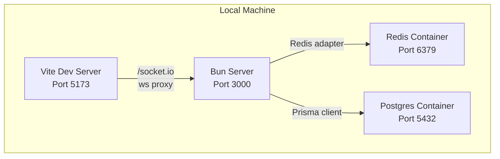
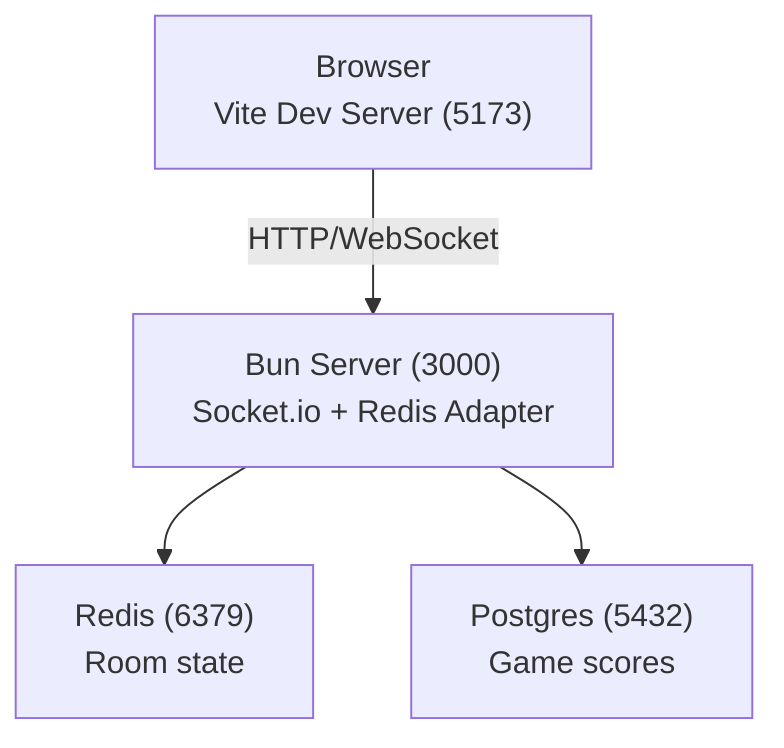
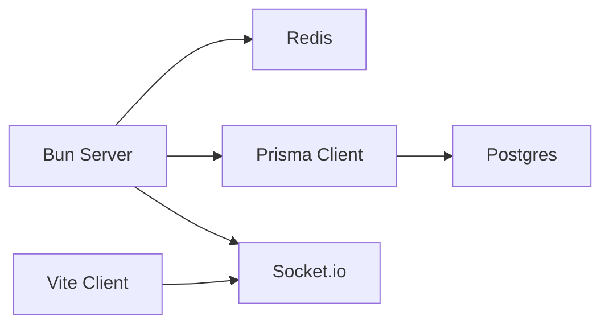

# Getting Started

<cite>
**Referenced Files in This Document**
- [README.md](file://README.md)
- [package.json](file://package.json)
- [docker-compose.yml](file://docker-compose.yml)
- [docker-compose.override.yml](file://docker-compose.override.yml)
- [vite.config.ts](file://vite.config.ts)
- [src/server/index.ts](file://src/server/index.ts)
- [src/server/repositories/postgres-service.ts](file://src/server/repositories/postgres-service.ts)
- [src/server/repositories/redis-service.ts](file://src/server/repositories/redis-service.ts)
- [prisma/schema.prisma](file://prisma/schema.prisma)
- [entrypoint.sh](file://entrypoint.sh)
- [ARCHITECTURE.md](file://ARCHITECTURE.md)
- [TESTING.md](file://TESTING.md)
</cite>

## Table of Contents
1. [Introduction](#introduction)
2. [Project Structure](#project-structure)
3. [Core Components](#core-components)
4. [Architecture Overview](#architecture-overview)
5. [Detailed Component Analysis](#detailed-component-analysis)
6. [Dependency Analysis](#dependency-analysis)
7. [Performance Considerations](#performance-considerations)
8. [Troubleshooting Guide](#troubleshooting-guide)
9. [Conclusion](#conclusion)
10. [Appendices](#appendices)

## Introduction
This guide helps you set up the Project ODYSSEY development environment from scratch. You will install prerequisites, configure environment variables, start Redis and PostgreSQL with Docker Compose, generate the Prisma client, and launch the development server and client. You will also learn how to verify your setup, run tests, and troubleshoot common issues.

## Project Structure
Project ODYSSEY is a Bun-based backend with a Vite-powered frontend, real-time communication via Socket.io, and persistent state using Redis and PostgreSQL. The repository includes:
- Frontend: Vite-managed vanilla TypeScript/CSS in src/client
- Backend: Bun server in src/server
- Configuration: YAML level definitions in config/
- Database: Prisma schema in prisma/
- DevOps: Docker Compose for Redis and PostgreSQL

**Diagram sources**
- [vite.config.ts](file://vite.config.ts#L23-L32)
- [src/server/index.ts](file://src/server/index.ts#L48-L61)
- [docker-compose.yml](file://docker-compose.yml#L37-L43)
- [docker-compose.yml](file://docker-compose.yml#L18-L35)

**Section sources**
- [README.md](file://README.md#L79-L98)
- [ARCHITECTURE.md](file://ARCHITECTURE.md#L35-L107)

## Core Components
- Bun runtime and scripts: The project uses Bun for fast TypeScript execution and concurrently runs the server and client during development.
- Vite dev server: Provides live-reload and proxies Socket.io WebSocket traffic to the Bun server.
- Docker Compose: Starts Redis and PostgreSQL containers and mounts volumes for persistence.
- Prisma: Generates a client for PostgreSQL and is used to initialize the database schema.
- Environment variables: Control ports, Redis and database URLs, logging, and allowed hosts.

Key ports:
- Server: 3000
- Client: 5173
- Redis: 6379
- PostgreSQL: 5432

**Section sources**
- [package.json](file://package.json#L5-L14)
- [vite.config.ts](file://vite.config.ts#L23-L32)
- [docker-compose.yml](file://docker-compose.yml#L8-L9)
- [docker-compose.yml](file://docker-compose.yml#L29-L30)
- [docker-compose.yml](file://docker-compose.yml#L41-L42)

## Architecture Overview
The development stack integrates the client, server, and data stores as follows:

**Diagram sources**
- [src/server/index.ts](file://src/server/index.ts#L48-L61)
- [src/server/repositories/redis-service.ts](file://src/server/repositories/redis-service.ts#L6-L7)
- [src/server/repositories/postgres-service.ts](file://src/server/repositories/postgres-service.ts#L14-L22)
- [docker-compose.yml](file://docker-compose.yml#L37-L43)
- [docker-compose.yml](file://docker-compose.yml#L18-L35)

## Detailed Component Analysis

### Prerequisites
- Bun runtime (latest)
- Docker (for Redis and PostgreSQL)

Install instructions:
- Bun: https://bun.sh/docs/installation
- Docker: https://docs.docker.com/get-docker/

Verify installation:
- bun --version
- docker --version && docker compose version

**Section sources**
- [README.md](file://README.md#L106-L110)

### Step-by-Step Installation

1) Install dependencies
- Run: bun install

2) Start databases with Docker Compose
- Run: docker compose up -d
- Confirm containers are healthy:
  - docker ps
  - docker compose ps

3) Initialize the database schema
- Option A (recommended): Use the entrypoint script to wait for DB readiness and push schema
  - Run: docker compose exec app ./entrypoint.sh
- Option B: Manually generate and push schema
  - Run: bunx prisma generate
  - Run: bunx prisma db push

4) Start the development environment
- Run: bun run dev
- This concurrently starts:
  - Bun server on port 3000
  - Vite client on port 5173

5) Verify the setup
- Open http://localhost:5173 in your browser
- Create a room, invite others via the room code, and play a few puzzles
- Check server logs for successful Redis and Postgres connections

**Section sources**
- [README.md](file://README.md#L111-L118)
- [docker-compose.yml](file://docker-compose.yml#L1-L16)
- [docker-compose.yml](file://docker-compose.yml#L37-L43)
- [entrypoint.sh](file://entrypoint.sh#L4-L11)
- [prisma/schema.prisma](file://prisma/schema.prisma#L1-L8)
- [src/server/index.ts](file://src/server/index.ts#L76-L84)

### Environment Variables
Configure the following environment variables in your environment or .env file consumed by Docker Compose:

- DATABASE_URL: PostgreSQL connection string for Prisma
- REDIS_URL: Redis connection URL for ioredis
- SERVER_PORT: Server port (default 3000)
- CLIENT_PORT: Client port (default 5173)
- LOG_LEVEL: Logging verbosity for the server
- VITE_LOG_LEVEL: Logging verbosity for the client
- VITE_ALLOWED_HOSTS: Comma-separated list of allowed hosts for Vite dev server

Notes:
- The Bun server binds to SERVER_PORT and allows CORS from localhost:CLIENT_PORT.
- The Vite dev server listens on CLIENT_PORT and proxies /socket.io WebSocket traffic to the Bun server.

**Section sources**
- [src/server/index.ts](file://src/server/index.ts#L52-L58)
- [vite.config.ts](file://vite.config.ts#L23-L32)
- [docker-compose.yml](file://docker-compose.yml#L8-L16)
- [docker-compose.override.yml](file://docker-compose.override.yml#L11-L13)

### Development Workflow and Local Testing
- Start dev: bun run dev
- Edit frontend: src/client (Vite hot reload)
- Edit backend: src/server (Bun watch mode)
- Add or edit levels: config/*.yaml
- Add a new puzzle:
  - Implement server handler in src/server/puzzles
  - Register it in src/server/puzzles/register.ts
  - Add client renderer in src/client/puzzles
  - Add a case in src/client/screens/puzzle.ts
  - Extend the PuzzleType union in shared/types.ts
  - Add an entry in your level YAML
- Run tests: bun test (Bun test runner)
- Type check: bun run typecheck

**Section sources**
- [README.md](file://README.md#L122-L129)
- [TESTING.md](file://TESTING.md#L1-L17)
- [package.json](file://package.json#L5-L14)

## Dependency Analysis
The development environment relies on these external dependencies:
- Bun runtime for server execution
- Docker Compose for Redis and PostgreSQL
- Prisma client for PostgreSQL schema and queries
- Socket.io with Redis adapter for multi-instance scaling
- Vite for frontend dev server and proxying

**Diagram sources**
- [package.json](file://package.json#L16-L30)
- [src/server/index.ts](file://src/server/index.ts#L29-L30)
- [src/server/repositories/postgres-service.ts](file://src/server/repositories/postgres-service.ts#L1-L3)
- [prisma/schema.prisma](file://prisma/schema.prisma#L1-L8)

**Section sources**
- [package.json](file://package.json#L16-L30)
- [docker-compose.yml](file://docker-compose.yml#L37-L43)
- [docker-compose.yml](file://docker-compose.yml#L18-L35)

## Performance Considerations
- Keep Redis and PostgreSQL running locally for minimal latency.
- Use Bun’s watch mode for rapid backend iteration.
- Limit allowed hosts in Vite to reduce unnecessary CORS overhead.
- Prefer incremental schema updates with Prisma migrations for production-like environments.

## Troubleshooting Guide

Common issues and resolutions:

- Network connectivity
  - Symptom: Client cannot connect to server via WebSocket
  - Check: CLIENT_PORT and SERVER_PORT match between Vite proxy and server CORS
  - Fix: Ensure VITE_ALLOWED_HOSTS includes localhost and ports align with SERVER_PORT/CLIENT_PORT
  - References:
    - [vite.config.ts](file://vite.config.ts#L23-L32)
    - [src/server/index.ts](file://src/server/index.ts#L52-L58)

- Database initialization failures
  - Symptom: Prisma push fails or server cannot connect to Postgres
  - Check: PostgreSQL health status and DATABASE_URL
  - Fix: Re-run docker compose up -d and the entrypoint script to push schema
  - References:
    - [docker-compose.yml](file://docker-compose.yml#L31-L35)
    - [entrypoint.sh](file://entrypoint.sh#L4-L11)
    - [src/server/repositories/postgres-service.ts](file://src/server/repositories/postgres-service.ts#L14-L22)

- Redis connection errors
  - Symptom: Server logs show Redis error messages
  - Check: REDIS_URL and container status
  - Fix: Confirm Redis container is healthy and reachable on port 6379
  - References:
    - [src/server/repositories/redis-service.ts](file://src/server/repositories/redis-service.ts#L6-L11)
    - [docker-compose.yml](file://docker-compose.yml#L37-L43)

- Port conflicts
  - Symptom: Ports 3000 or 5173 already in use
  - Fix: Change SERVER_PORT or CLIENT_PORT and update Vite proxy accordingly
  - References:
    - [vite.config.ts](file://vite.config.ts#L23-L32)
    - [src/server/index.ts](file://src/server/index.ts#L52-L58)

- Hot reload not working
  - Symptom: Changes to server or client not reflected
  - Check: bun run dev is running and volumes are mounted in override file
  - Fix: Ensure docker-compose.override.yml is active and volumes are present
  - References:
    - [docker-compose.override.yml](file://docker-compose.override.yml#L7-L10)

## Conclusion
You now have a fully functional Project ODYSSEY development environment. With Bun, Docker Compose, Prisma, and Vite, you can iterate quickly on both frontend and backend. Use the provided scripts and environment variables to keep your setup consistent, and consult the troubleshooting section when encountering common issues.

## Appendices

### Initial Verification Checklist
- [ ] Dependencies installed: bun, docker
- [ ] Redis and PostgreSQL containers running and healthy
- [ ] Prisma client generated and schema pushed
- [ ] bun run dev started (server on 3000, client on 5173)
- [ ] Browser opens http://localhost:5173 and connects to server
- [ ] Basic gameplay verified (create room, join, play a puzzle)

### Ports Reference
- Server: 3000
- Client: 5173
- Redis: 6379
- PostgreSQL: 5432

**Section sources**
- [README.md](file://README.md#L120-L121)
- [docker-compose.yml](file://docker-compose.yml#L8-L9)
- [docker-compose.yml](file://docker-compose.yml#L29-L30)
- [docker-compose.yml](file://docker-compose.yml#L41-L42)