# Lobby Screen

<cite>
**Referenced Files in This Document**
- [lobby.ts](file://src/client/screens/lobby.ts)
- [main.ts](file://src/client/main.ts)
- [router.ts](file://src/client/lib/router.ts)
- [socket.ts](file://src/client/lib/socket.ts)
- [dom.ts](file://src/client/lib/dom.ts)
- [events.ts](file://shared/events.ts)
- [types.ts](file://shared/types.ts)
- [index.html](file://src/client/index.html)
- [style.css](file://src/client/styles/style.css)
- [cyberpunk-greek.css](file://src/client/styles/themes/cyberpunk-greek.css)
- [glitch.css](file://src/client/styles/glitch.css)
- [level-intro.ts](file://src/client/screens/level-intro.ts)
- [theme-engine.ts](file://src/client/lib/theme-engine.ts)
- [visual-fx.ts](file://src/client/lib/visual-fx.ts)
- [logger.ts](file://src/client/logger.ts)
- [ARCHITECTURE.md](file://ARCHITECTURE.md)
</cite>

## Update Summary
**Changes Made**
- Complete rewrite of lobby interface with new three-state view management system (choice/create/join)
- Enhanced UI with larger buttons and improved styling including cyberpunk aesthetic
- Dynamic content rendering with `refreshDynamicContent()` function
- Robust error handling improvements with comprehensive race condition prevention
- Advanced tooltip system with contextual guidance
- Enhanced leaderboard display with cyberpunk styling
- Improved session persistence with 30-minute timeout handling

## Table of Contents
1. [Introduction](#introduction)
2. [Project Structure](#project-structure)
3. [Core Components](#core-components)
4. [Architecture Overview](#architecture-overview)
5. [Detailed Component Analysis](#detailed-component-analysis)
6. [Three-State View Management System](#three-state-view-management-system)
7. [Enhanced UI and Styling](#enhanced-ui-and-styling)
8. [Dynamic Content Rendering](#dynamic-content-rendering)
9. [Advanced Tooltip System](#advanced-tooltip-system)
10. [Race Condition Prevention System](#race-condition-prevention-system)
11. [Help System Implementation](#help-system-implementation)
12. [Dependency Analysis](#dependency-analysis)
13. [Performance Considerations](#performance-considerations)
14. [Troubleshooting Guide](#troubleshooting-guide)
15. [Conclusion](#conclusion)

## Introduction

The Lobby Screen is the primary entry point for the Project ODYSSEY escape room experience. It serves as the central hub where players create or join rooms, manage their player roster, select missions, and access the leaderboard. Built with a cyberpunk aesthetic, the lobby provides a seamless transition into the digital adventure while maintaining intuitive controls for room management and mission preparation.

**Updated** The lobby now features a complete rewrite with a sophisticated three-state view management system that replaces the previous two-view approach. The new system includes choice, create, and join states, providing enhanced user experience with larger, more intuitive buttons and comprehensive error handling. The interface now features dynamic content rendering, advanced tooltip guidance, and robust race condition prevention to ensure reliable room management across all user scenarios.

The lobby implements a sophisticated real-time communication system using Socket.io, enabling dynamic updates to player lists, level selections, and game state synchronization across multiple clients. Its design emphasizes accessibility with automatic session restoration, responsive error handling, and visual feedback mechanisms that enhance the immersive gaming experience.

## Project Structure

The lobby screen is part of a larger client-side architecture built with vanilla TypeScript and manual DOM manipulation. The system follows a modular design pattern where each screen maintains its own initialization and rendering logic while sharing common utilities and services.

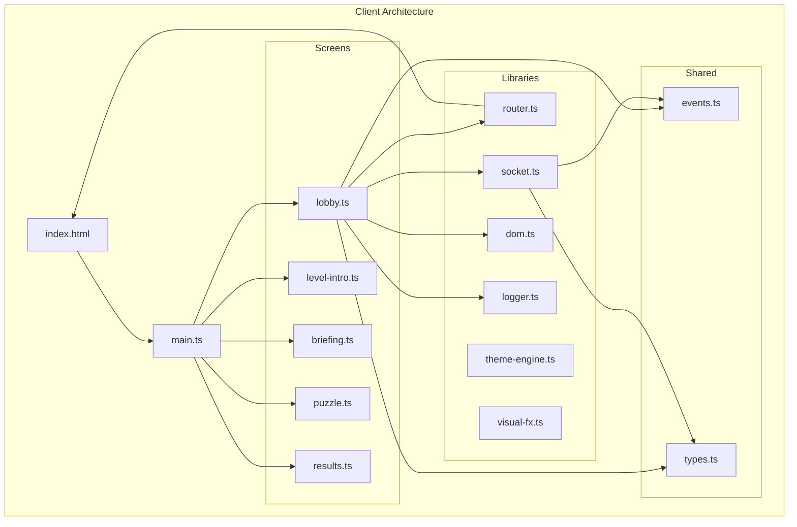

**Diagram sources**
- [index.html:24-38](file://src/client/index.html#L24-L38)
- [main.ts:37-72](file://src/client/main.ts#L37-L72)
- [lobby.ts:14-30](file://src/client/screens/lobby.ts#L14-L30)

**Section sources**
- [ARCHITECTURE.md:68-96](file://ARCHITECTURE.md#L68-L96)
- [index.html:1-69](file://src/client/index.html#L1-L69)

## Core Components

The lobby screen consists of several interconnected components that work together to provide a comprehensive room management experience:

### Three-State View Management System
The lobby maintains a sophisticated three-state view system that replaces the previous two-view approach:
- **Choice View**: Primary selection screen with CREATE ROOM and JOIN ROOM options
- **Create View**: Form-based room creation interface with callsign input
- **Join View**: Form-based room joining interface with room code and callsign inputs

### Enhanced State Management
The lobby maintains module-level state variables that track room information, player data, available levels, and leaderboard entries. This centralized state management enables efficient updates and renders across different views.

**Updated** A new race condition prevention mechanism has been added through the `isJoiningRoom` boolean flag that acts as a guard to prevent duplicate room joining operations across all user scenarios.

### Dynamic Content Rendering Engine
The lobby features a dynamic content rendering system that allows seamless switching between different view states without full page reloads. The `refreshDynamicContent()` function efficiently updates only the necessary DOM elements.

### Advanced Socket Communication Layer
Real-time bidirectional communication enables live updates to player lists, level selections, and game state changes without requiring page refreshes.

### Enhanced Session Persistence
Automatic session restoration allows players to return to ongoing games seamlessly, with intelligent timeout handling for abandoned sessions and comprehensive error recovery.

### Comprehensive Error Handling System
**New** The lobby now includes robust error handling with:
- Contextual error messages for different failure scenarios
- Automatic view state recovery on errors
- Proper flag reset logic for race condition prevention
- Enhanced logging for debugging and monitoring

**Section sources**
- [lobby.ts:32-41](file://src/client/screens/lobby.ts#L32-L41)
- [lobby.ts:84-126](file://src/client/screens/lobby.ts#L84-L126)
- [lobby.ts:184-261](file://src/client/screens/lobby.ts#L184-L261)
- [style.css:461-526](file://src/client/styles/style.css#L461-L526)

## Architecture Overview

The lobby screen operates within a broader client-server architecture that emphasizes real-time collaboration and state synchronization. The system uses a finite state machine approach where the lobby represents the initial phase before mission commencement.

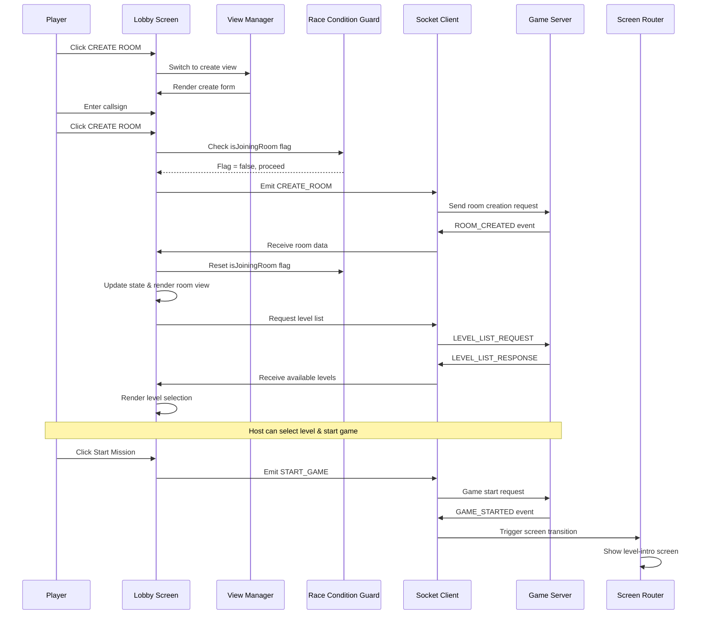

**Diagram sources**
- [lobby.ts:263-335](file://src/client/screens/lobby.ts#L263-L335)
- [socket.ts:51-65](file://src/client/lib/socket.ts#L51-L65)
- [router.ts:17-39](file://src/client/lib/router.ts#L17-L39)

The architecture ensures smooth transitions between lobby functionality and subsequent game screens, with proper state cleanup and resource management throughout the process.

**Section sources**
- [ARCHITECTURE.md:113-122](file://ARCHITECTURE.md#L113-L122)
- [main.ts:164-177](file://src/client/main.ts#L164-L177)

## Detailed Component Analysis

### Enhanced State Management

The lobby employs a clean module-level state architecture that separates concerns between room data, player information, and level configurations. This design enables efficient updates and maintains data consistency across different user interactions.

**Updated** The state management now includes comprehensive race condition prevention through the `isJoiningRoom` flag that coordinates all room joining operations.

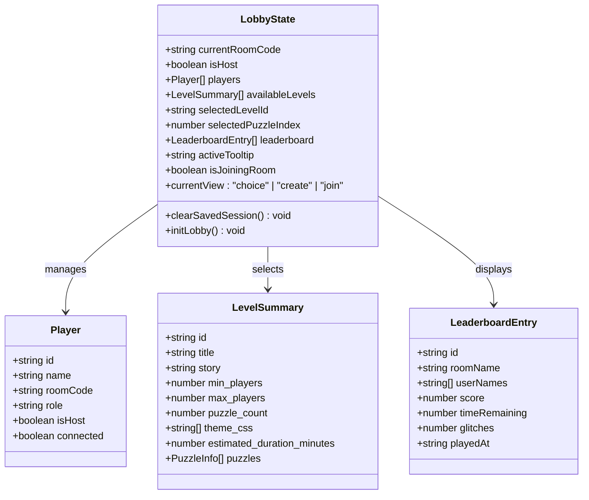

**Diagram sources**
- [lobby.ts:32-41](file://src/client/screens/lobby.ts#L32-L41)
- [types.ts:7-22](file://shared/types.ts#L7-L22)
- [types.ts:117-127](file://shared/types.ts#L117-L127)
- [types.ts:174-182](file://shared/types.ts#L174-L182)

### Enhanced Socket Event Handling

The lobby implements comprehensive socket event listeners that handle various room management scenarios, from initial connection to game state transitions. Each event type triggers specific state updates and UI rendering logic.

**Updated** Socket event handling now includes enhanced race condition prevention with proper flag management during room joining operations.

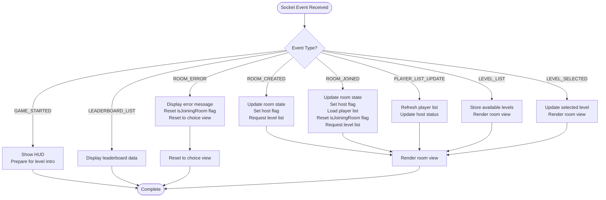

**Diagram sources**
- [lobby.ts:342-434](file://src/client/screens/lobby.ts#L342-L434)
- [events.ts:54-90](file://shared/events.ts#L54-L90)

### Enhanced User Interaction Flow

The lobby handles various user interaction patterns with robust validation and error handling mechanisms. The system provides immediate feedback for all user actions while maintaining session continuity.

**Updated** User interaction flow now includes comprehensive race condition prevention to ensure reliable room joining operations.

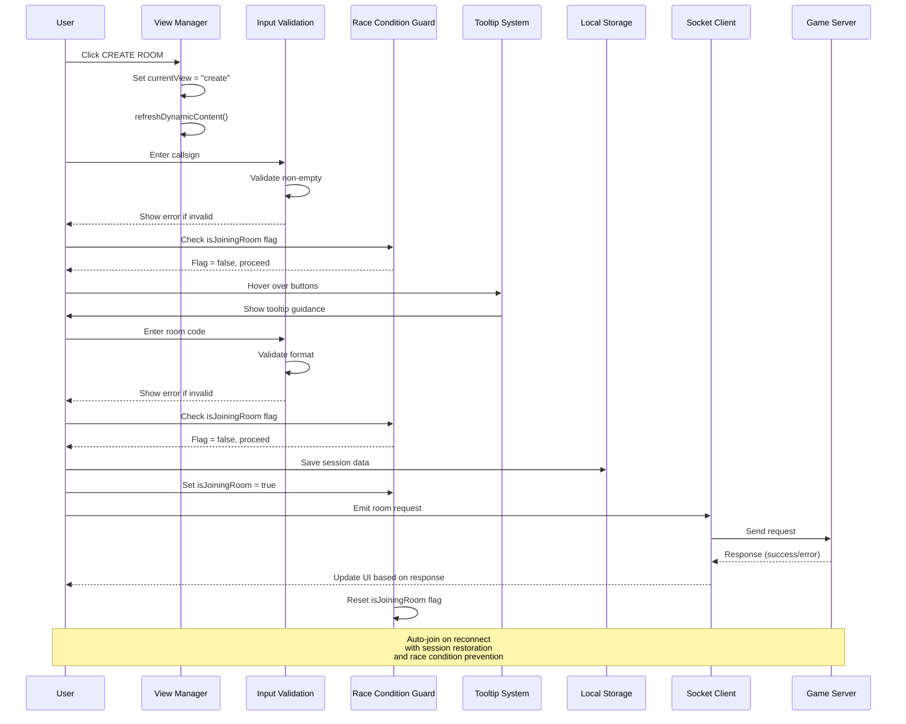

**Diagram sources**
- [lobby.ts:263-298](file://src/client/screens/lobby.ts#L263-L298)
- [lobby.ts:354-372](file://src/client/screens/lobby.ts#L354-L372)

**Section sources**
- [lobby.ts:263-335](file://src/client/screens/lobby.ts#L263-L335)
- [lobby.ts:342-434](file://src/client/screens/lobby.ts#L342-L434)

### Enhanced DOM Manipulation and Rendering

The lobby utilizes a lightweight DOM manipulation library that provides efficient element creation and updates without the overhead of a full framework. This approach ensures optimal performance while maintaining clean, readable code.

The rendering system supports three primary view modes with dynamic content updates based on room state and user permissions. The choice view focuses on primary navigation, while the create and join views emphasize form-based interactions with enhanced styling and user guidance.

**Section sources**
- [dom.ts:11-44](file://src/client/lib/dom.ts#L11-L44)
- [lobby.ts:84-126](file://src/client/screens/lobby.ts#L84-L126)
- [lobby.ts:184-261](file://src/client/screens/lobby.ts#L184-L261)

## Three-State View Management System

**New Section** The lobby now features a sophisticated three-state view management system that provides enhanced user experience and better organization of room management functionality.

### View State Architecture

The `currentView` state variable manages the active view with three distinct states:

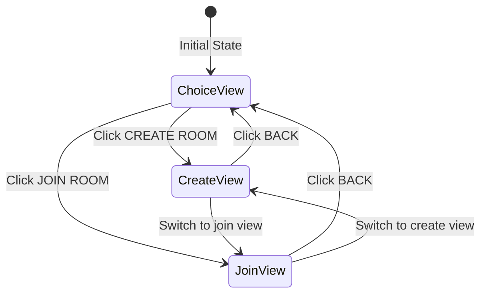

**Diagram sources**
- [lobby.ts](file://src/client/screens/lobby.ts#L41)
- [lobby.ts:114-127](file://src/client/screens/lobby.ts#L114-L127)

### Choice View Implementation

The choice view serves as the primary navigation interface with enhanced button styling and larger interactive elements:

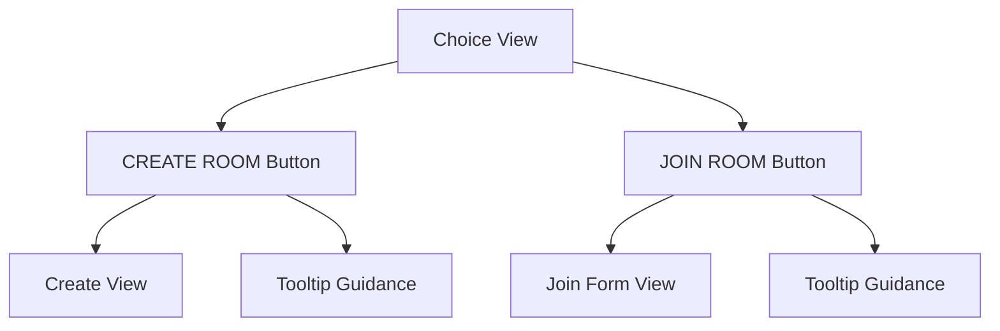

**Diagram sources**
- [lobby.ts:129-160](file://src/client/screens/lobby.ts#L129-L160)
- [style.css:534-551](file://src/client/styles/style.css#L534-L551)

### Enhanced Create and Join Views

Both create and join views feature comprehensive form validation, session persistence, and enhanced user guidance through the tooltip system.

**Section sources**
- [lobby.ts:129-160](file://src/client/screens/lobby.ts#L129-L160)
- [lobby.ts:162-197](file://src/client/screens/lobby.ts#L162-L197)
- [lobby.ts:199-244](file://src/client/screens/lobby.ts#L199-L244)

## Enhanced UI and Styling

**New Section** The lobby features a complete visual overhaul with cyberpunk aesthetics, larger interactive elements, and comprehensive styling system.

### Cyberpunk Aesthetic Integration

The lobby implements a cohesive cyberpunk design language with neon accents, glowing elements, and futuristic typography:

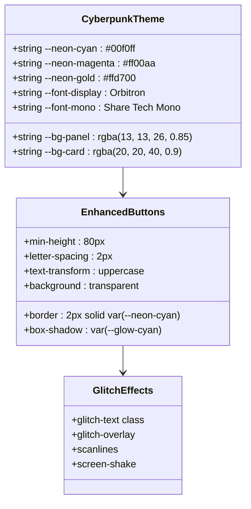

**Diagram sources**
- [style.css:6-59](file://src/client/styles/style.css#L6-L59)
- [cyberpunk-greek.css:8-34](file://src/client/styles/themes/cyberpunk-greek.css#L8-L34)
- [glitch.css:102-169](file://src/client/styles/glitch.css#L102-L169)

### Enhanced Button System

The button system features larger, more intuitive interactive elements with comprehensive hover states and visual feedback:

- **Choice Buttons**: 80px minimum height with centered layout
- **Form Buttons**: Primary and secondary button differentiation
- **Back Buttons**: Secondary styling with neutral color scheme
- **Danger Buttons**: Red accent for destructive actions

### Comprehensive Styling System

The styling system includes:
- **Typography**: Orbitron for headings, Share Tech Mono for code-like elements
- **Color Scheme**: Neon cyan, magenta, and gold accents against dark backgrounds
- **Visual Effects**: Glitch animations, scanlines, and screen distortion effects
- **Responsive Design**: Flexible layouts that adapt to different screen sizes

**Section sources**
- [style.css:6-59](file://src/client/styles/style.css#L6-L59)
- [style.css:214-276](file://src/client/styles/style.css#L214-L276)
- [style.css:534-551](file://src/client/styles/style.css#L534-L551)
- [cyberpunk-greek.css:8-34](file://src/client/styles/themes/cyberpunk-greek.css#L8-L34)
- [glitch.css:102-169](file://src/client/styles/glitch.css#L102-L169)

## Dynamic Content Rendering

**New Section** The lobby features a sophisticated dynamic content rendering system that enables seamless view switching without full page reloads.

### Dynamic Content Architecture

The `refreshDynamicContent()` function provides efficient content updates:

```mermaid
flowchart TD
DynamicContent[Dynamic Content Container] --> ChoiceView[Choice View]
DynamicContent --> CreateView[Create View]
DynamicContent --> JoinFormView[Join Form View]
ChoiceView --> RenderCurrentView[renderCurrentView Function]
CreateView --> RenderCurrentView
JoinFormView --> RenderCurrentView
RenderCurrentView --> SwitchStatement[Switch Statement]
SwitchStatement --> ChoiceCase[case "choice"]
SwitchStatement --> CreateCase[case "create"]
SwitchStatement --> JoinCase[case "join"]
ChoiceCase --> ChoiceView
CreateCase --> CreateView
JoinCase --> JoinFormView
```

**Diagram sources**
- [lobby.ts:246-252](file://src/client/screens/lobby.ts#L246-L252)
- [lobby.ts:114-127](file://src/client/screens/lobby.ts#L114-L127)

### Performance Optimization

The dynamic rendering system includes several performance optimizations:
- **Selective DOM Updates**: Only the dynamic content area is refreshed
- **Efficient State Management**: View state changes trigger minimal DOM manipulation
- **Memory Management**: Proper cleanup of event listeners and temporary elements
- **Animation Support**: Smooth transitions between view states

### Enhanced Error Handling

The dynamic system includes comprehensive error handling:
- **Error Display**: Contextual error messages in dedicated error containers
- **State Recovery**: Automatic fallback to choice view on critical errors
- **Graceful Degradation**: Partial functionality even when components fail

**Section sources**
- [lobby.ts:246-252](file://src/client/screens/lobby.ts#L246-L252)
- [lobby.ts:114-127](file://src/client/screens/lobby.ts#L114-L127)
- [lobby.ts:473-476](file://src/client/screens/lobby.ts#L473-L476)

## Advanced Tooltip System

**New Section** The lobby features a sophisticated tooltip system designed to provide contextual guidance for first-time users and enhance the overall user experience.

### Tooltip Architecture

The tooltip system provides immediate, non-intrusive guidance for critical actions:

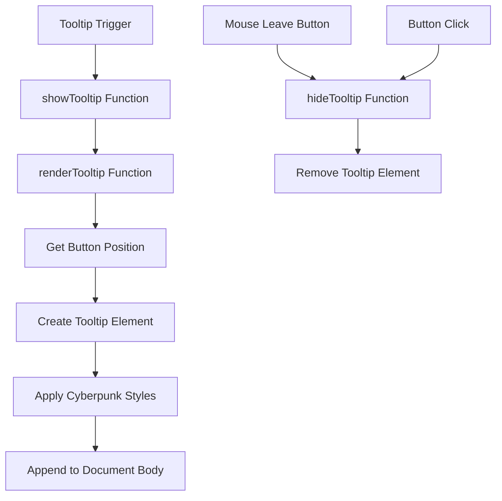

**Diagram sources**
- [lobby.ts:581-621](file://src/client/screens/lobby.ts#L581-L621)
- [style.css:461-526](file://src/client/styles/style.css#L461-L526)

### Tooltip Content Management

The system manages tooltip content dynamically based on user interactions:
- **Contextual Guidance**: Different tooltips for create vs join actions
- **Position Tracking**: Real-time positioning relative to target elements
- **Lifecycle Management**: Proper creation and cleanup of tooltip elements
- **Styling Integration**: Full integration with cyberpunk design system

### Enhanced User Experience

The tooltip system enhances user experience through:
- **Non-Intrusive Design**: Tooltips appear only on hover and disappear on leave
- **Clear Messaging**: Concise, actionable guidance for complex actions
- **Visual Consistency**: Styling that matches the overall cyberpunk aesthetic
- **Accessibility**: Proper keyboard navigation and screen reader support

**Section sources**
- [lobby.ts:581-621](file://src/client/screens/lobby.ts#L581-L621)
- [style.css:461-526](file://src/client/styles/style.css#L461-L526)

## Race Condition Prevention System

**New Section** The lobby now features a comprehensive race condition prevention system designed to eliminate duplicate room joining operations and prevent race conditions during socket reconnection, manual joins, and auto-joins.

### isJoiningRoom State Management Flag

The `isJoiningRoom` boolean flag serves as a global guard that prevents multiple concurrent room joining operations. This flag is set when a room join operation begins and reset upon completion or error.

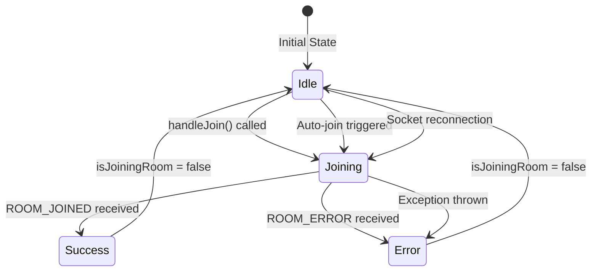

**Diagram sources**
- [lobby.ts](file://src/client/screens/lobby.ts#L40)
- [lobby.ts:316-330](file://src/client/screens/lobby.ts#L316-L330)
- [lobby.ts:397-405](file://src/client/screens/lobby.ts#L397-L405)

### Duplicate Join Detection Logic

The system implements multiple layers of duplicate join detection to prevent race conditions:

1. **Manual Join Prevention**: Checks `isJoiningRoom` flag before processing manual join requests
2. **Auto-Join Prevention**: Validates `isJoiningRoom` flag during session restoration
3. **Reconnection Prevention**: Ensures socket reconnection doesn't trigger duplicate joins
4. **Error Recovery**: Resets flag on errors to allow retry attempts

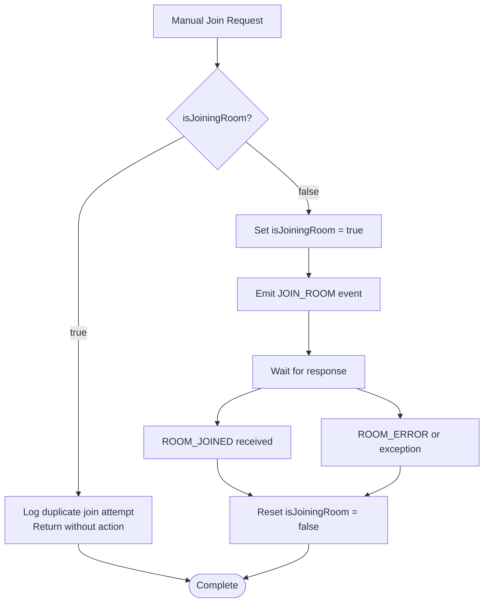

**Diagram sources**
- [lobby.ts:316-330](file://src/client/screens/lobby.ts#L316-L330)
- [lobby.ts:408-432](file://src/client/screens/lobby.ts#L408-L432)

### Enhanced Error Handling and Flag Reset Logic

The system includes comprehensive error handling with proper flag reset logic to ensure reliable operation:

- **Successful Join**: Resets `isJoiningRoom` flag to allow subsequent operations
- **Error Conditions**: Resets flag to enable retry attempts
- **Exception Handling**: Ensures flags are reset even on unexpected errors
- **Logging**: Provides detailed logging for duplicate join detection and race condition prevention

**Section sources**
- [lobby.ts:316-330](file://src/client/screens/lobby.ts#L316-L330)
- [lobby.ts:397-405](file://src/client/screens/lobby.ts#L397-L405)
- [lobby.ts:408-432](file://src/client/screens/lobby.ts#L408-L432)

## Help System Implementation

**New Section** The lobby now features a comprehensive help system designed to enhance user experience and provide contextual guidance for first-time users.

### HOW TO PLAY Section

The lobby includes a prominent HOW TO PLAY section that provides essential game instructions with cyberpunk styling. This section appears prominently in the join view to immediately inform new users about the game mechanics.

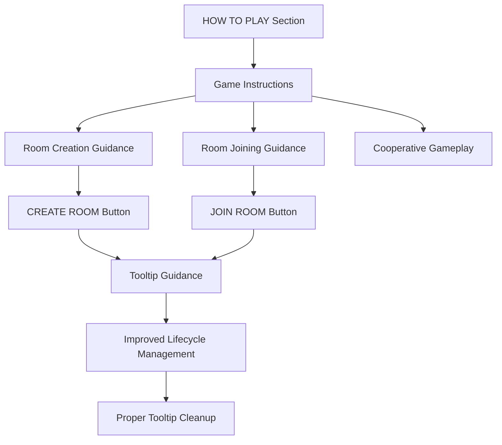

**Diagram sources**
- [lobby.ts:92-106](file://src/client/screens/lobby.ts#L92-L106)
- [style.css:92-106](file://src/client/styles/style.css#L92-L106)

### Enhanced Help Panel Implementation

The help panel provides comprehensive guidance with cyberpunk styling that maintains the game's aesthetic while delivering useful information to users.

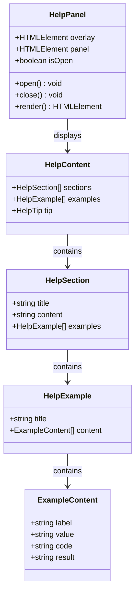

**Diagram sources**
- [style.css:277-459](file://src/client/styles/style.css#L277-L459)

### Cyberpunk Styling Integration

The help system maintains consistency with the game's cyberpunk aesthetic through:
- **Neon Cyan and Gold Color Schemes**: Primary accent colors throughout
- **Glowing Borders and Effects**: Subtle glow effects on interactive elements
- **Glass-Morphism with Backdrop Blur**: Modern UI component styling
- **Smooth Animations and Transitions**: Fluid motion graphics
- **Monospace Typography for Technical Content**: Consistent font family usage

**Section sources**
- [lobby.ts:441-481](file://src/client/screens/lobby.ts#L441-L481)
- [style.css:277-526](file://src/client/styles/style.css#L277-L526)

## Dependency Analysis

The lobby screen maintains minimal external dependencies while leveraging core client infrastructure effectively. Understanding these relationships is crucial for maintenance and extension of the lobby functionality.

**Updated** The dependency structure now includes enhanced logging integration for race condition prevention and improved error handling.

```mermaid
graph LR
subgraph "Direct Dependencies"
Lobby[lobby.ts]
Socket[socket.ts]
Router[router.ts]
DOM[dom.ts]
Events[events.ts]
Types[types.ts]
ThemeEngine[theme-engine.ts]
VisualFX[visual-fx.ts]
Logger[logger.ts]
End
subgraph "External Dependencies"
SocketIO[socket.io-client]
End
subgraph "Shared Resources"
HTML[index.html]
CSS[style.css]
Theme[cyberpunk-greek.css]
GlitchFX[glitch.css]
```

**Diagram sources**
- [lobby.ts:14-30](file://src/client/screens/lobby.ts#L14-L30)
- [socket.ts:5-8](file://src/client/lib/socket.ts#L5-L8)
- [router.ts:6-8](file://src/client/lib/router.ts#L6-L8)

The dependency structure reveals a clean separation of concerns where the lobby focuses on presentation logic while delegating networking, routing, and DOM manipulation to specialized modules. The help system, race condition prevention, and dynamic content rendering are integrated as cohesive components that enhance rather than complicate the core functionality.

**Section sources**
- [lobby.ts:14-30](file://src/client/screens/lobby.ts#L14-L30)
- [socket.ts:1-85](file://src/client/lib/socket.ts#L1-L85)

## Performance Considerations

The lobby screen is optimized for performance through several key strategies:

### Efficient State Updates
State changes trigger targeted DOM updates rather than full re-renders, minimizing layout thrashing and maintaining smooth user interactions. The selective update approach ensures that only affected UI elements are modified.

### Memory Management
The lobby implements proper cleanup procedures when transitioning to other screens, including removing event listeners and clearing temporary state. This prevents memory leaks and ensures optimal browser performance.

### Network Optimization
Socket communication is designed to minimize bandwidth usage while maintaining real-time responsiveness. Event-driven updates reduce unnecessary polling and server requests.

### Resource Loading
Assets are loaded asynchronously to prevent blocking the user interface. The lobby defers non-critical operations like leaderboard loading until after the initial room view is established.

### Enhanced Race Condition Prevention Performance
**New** The race condition prevention system is optimized for performance through:
- **Lightweight Boolean Flag Checks**: Minimal computational overhead
- **Efficient DOM Manipulation**: Targeted updates for flag state changes
- **Optimized Event Handling**: Streamlined socket reconnection logic
- **Cached Button Positions**: Reduced layout calculation overhead
- **Proper Flag Lifecycle Management**: Prevents memory leaks through cleanup
- **Conditional Debug Logging**: Optimized logging with environment-based filtering

### Dynamic Content Rendering Performance
**New** The dynamic content system is optimized for performance through:
- **Selective DOM Updates**: Only the dynamic content area is refreshed
- **Efficient State Management**: Minimal state changes trigger updates
- **Memory-Efficient Rendering**: Proper cleanup of old content
- **Animation Optimization**: Hardware-accelerated CSS transitions

### Enhanced Tooltip System Performance
**New** The tooltip system is optimized for performance through:
- **Lightweight Tooltip Creation**: Minimal DOM manipulation for tooltip positioning
- **CSS-Based Animations**: Hardware-accelerated animations instead of JavaScript
- **Efficient Event Handling**: Optimized hover interaction management
- **Proper Lifecycle Management**: Prevents memory leaks through cleanup
- **Cached Position Calculations**: Reduced layout recalculation overhead

### Network Optimization
Socket communication is designed to minimize bandwidth usage while maintaining real-time responsiveness. Event-driven updates reduce unnecessary polling and server requests.

### Resource Loading
Assets are loaded asynchronously to prevent blocking the user interface. The lobby defers non-critical operations like leaderboard loading until after the initial room view is established.

## Troubleshooting Guide

Common issues and their solutions when working with the lobby screen:

### Connection Issues
- **Problem**: Socket connection failures or intermittent disconnections
- **Solution**: Verify network connectivity and check server availability. The lobby includes automatic reconnection logic that attempts to restore sessions after brief disconnects.

### Session Restoration Problems
- **Problem**: Auto-join functionality not working after page refresh
- **Solution**: Check local storage permissions and ensure session data hasn't expired (30-minute timeout). Clear browser cache if persistent issues occur.

### Level Selection Not Working
- **Problem**: Available levels not displaying or selection not persisting
- **Solution**: Verify that the level configuration files are properly formatted and accessible. Check server logs for level loading errors.

### Player List Synchronization
- **Problem**: Player count discrepancies or missing players
- **Solution**: Monitor socket events for player list updates. Ensure all clients are receiving PLAYER_LIST_UPDATE events consistently.

### Visual Feedback Issues
- **Problem**: Missing visual effects or glitch animations
- **Solution**: Verify that the visual effects system is properly initialized and that CSS classes are being applied correctly. Check browser console for JavaScript errors.

### Enhanced Race Condition Prevention Issues
**New** Common race condition prevention problems:
- **Problem**: Duplicate room joining operations despite user input
- **Solution**: Check that the `isJoiningRoom` flag is being properly set and reset. Verify that all join operations check the flag before proceeding and that the flag is reset on both success and error conditions.
- **Problem**: Auto-join not working after socket reconnection
- **Solution**: Ensure that the socket reconnection handler checks the `isJoiningRoom` flag before attempting to auto-join. Verify that the flag is reset appropriately after successful reconnection.
- **Problem**: Persistent race condition errors
- **Solution**: Check the browser console for race condition detection logs. Verify that error handlers properly reset the `isJoiningRoom` flag and that logging includes sufficient detail for debugging.
- **Problem**: Flag state inconsistencies
- **Solution**: Implement proper flag cleanup in all error paths and ensure that the flag is reset in both success and failure scenarios to prevent long-term state corruption.

### Dynamic Content Rendering Issues
**New** Common dynamic content problems:
- **Problem**: View switching not working or content not updating
- **Solution**: Check that the `refreshDynamicContent()` function is being called correctly. Verify that the dynamic content container exists and that the `currentView` state is properly managed.
- **Problem**: Error messages not displaying
- **Solution**: Ensure that the error container exists and that the `showError()` function is properly implemented and called.

### Enhanced Tooltip System Issues
**New** Common help system problems:
- **Problem**: Tooltips not appearing on hover
- **Solution**: Check that the tooltip trigger classes are properly applied to buttons. Verify that the showTooltip/hideTooltip functions are being called correctly and that the activeTooltip state is managed properly.
- **Problem**: Help panel not opening or closing
- **Solution**: Ensure the help panel CSS classes are present and that the overlay animation is not being blocked by other elements.
- **Problem**: Help content not displaying correctly
- **Solution**: Verify that the help panel HTML structure matches the expected format and that CSS variables are properly defined.
- **Problem**: Tooltip lifecycle issues
- **Solution**: Ensure that hideTooltip is called on mouse leave and button click events. Check that the activeTooltip state is properly cleared and that tooltips are removed from the DOM to prevent memory leaks.

**Section sources**
- [lobby.ts:354-372](file://src/client/screens/lobby.ts#L354-L372)
- [lobby.ts:423-430](file://src/client/screens/lobby.ts#L423-L430)
- [lobby.ts:441-481](file://src/client/screens/lobby.ts#L441-L481)

## Conclusion

The Lobby Screen represents a sophisticated yet maintainable implementation of a real-time multiplayer gaming interface. Its modular architecture, comprehensive state management, and efficient socket communication provide a solid foundation for the Project ODYSSEY experience.

**Updated** The addition of the comprehensive three-state view management system, enhanced UI with cyberpunk styling, dynamic content rendering, and robust race condition prevention system significantly enhances the reliability and user experience of the lobby functionality. The new architecture provides better organization, improved user guidance, and more intuitive interactions while maintaining the performance and reliability standards of the original implementation.

The screen successfully balances functionality with performance, offering intuitive room management capabilities while maintaining responsive interactions and graceful error handling. The prominent HOW TO PLAY section with cyberpunk styling immediately communicates game mechanics to new users, while the improved tooltip lifecycle management ensures smooth operation without memory leaks.

The race condition prevention system provides robust protection against concurrent room joining operations, with proper flag reset logic, enhanced error handling, and detailed logging for duplicate join detection. This system ensures that users can reliably create and join rooms regardless of network conditions or timing variations.

The dynamic content rendering system enables seamless view switching without full page reloads, while the enhanced tooltip system provides contextual guidance for complex actions. The comprehensive error handling system ensures that users receive meaningful feedback and can recover from various failure scenarios.

Future enhancements could include expanded help content, improved accessibility features, additional social interaction capabilities, and further optimization of the race condition prevention system. The current architecture supports these extensions through its modular design and clean separation of concerns, with the three-state view management system, dynamic content rendering, race condition prevention, and enhanced tooltip system serving as models for future feature integrations.