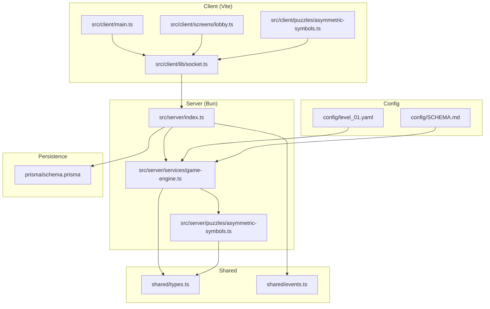
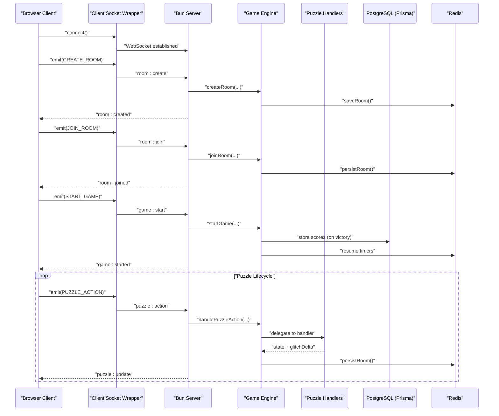
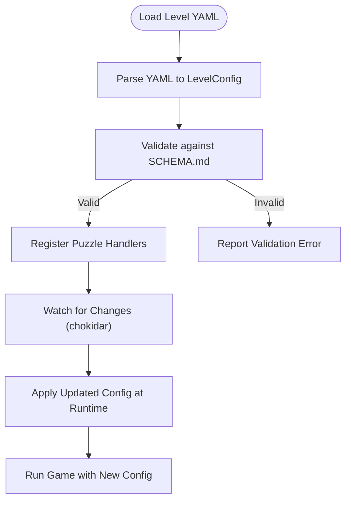
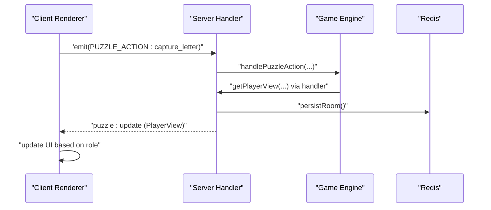
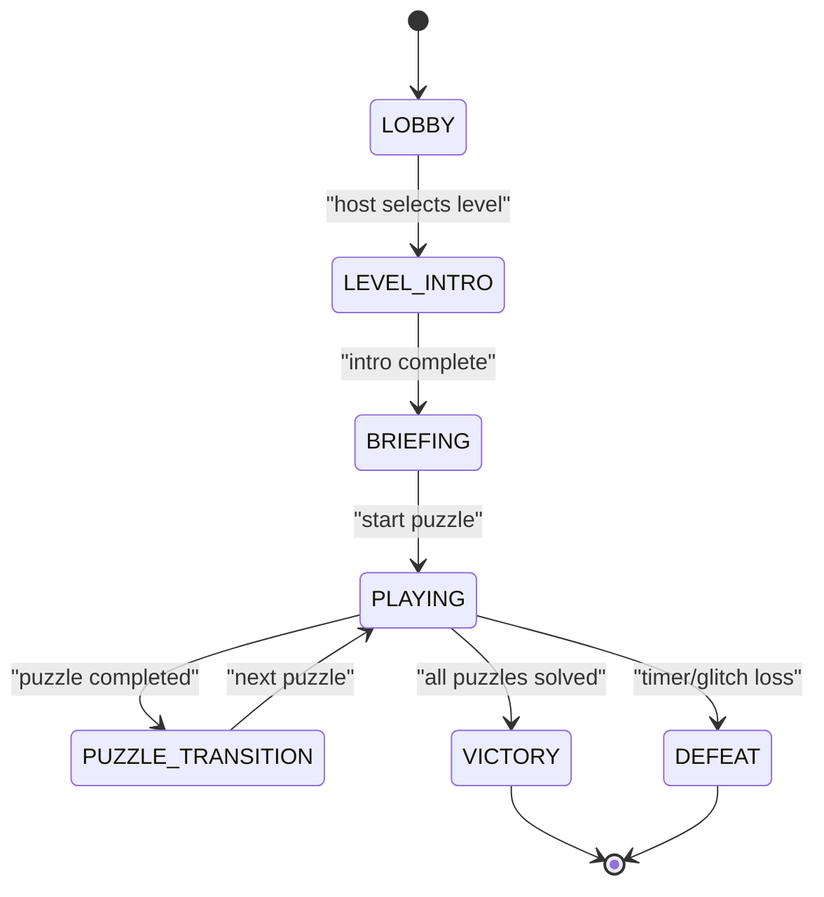
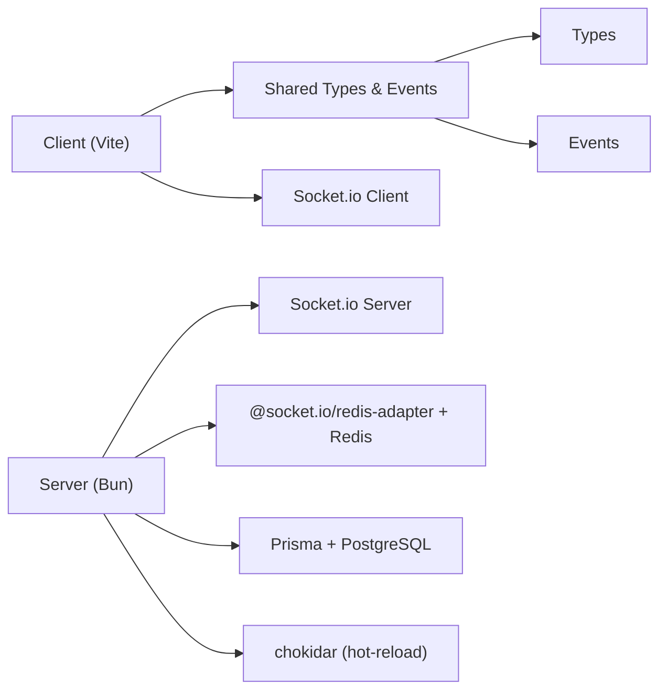

# Project Overview

<cite>
**Referenced Files in This Document**
- [README.md](file://README.md)
- [ARCHITECTURE.md](file://ARCHITECTURE.md)
- [package.json](file://package.json)
- [config/SCHEMA.md](file://config/SCHEMA.md)
- [prisma/schema.prisma](file://prisma/schema.prisma)
- [shared/types.ts](file://shared/types.ts)
- [shared/events.ts](file://shared/events.ts)
- [src/server/index.ts](file://src/server/index.ts)
- [src/client/main.ts](file://src/client/main.ts)
- [src/client/lib/socket.ts](file://src/client/lib/socket.ts)
- [src/client/screens/lobby.ts](file://src/client/screens/lobby.ts)
- [src/server/services/game-engine.ts](file://src/server/services/game-engine.ts)
- [src/server/puzzles/asymmetric-symbols.ts](file://src/server/puzzles/asymmetric-symbols.ts)
- [src/client/puzzles/asymmetric-symbols.ts](file://src/client/puzzles/asymmetric-symbols.ts)
- [config/level_01.yaml](file://config/level_01.yaml)
</cite>

## Table of Contents
1. [Introduction](#introduction)
2. [Project Structure](#project-structure)
3. [Core Components](#core-components)
4. [Architecture Overview](#architecture-overview)
5. [Detailed Component Analysis](#detailed-component-analysis)
6. [Dependency Analysis](#dependency-analysis)
7. [Performance Considerations](#performance-considerations)
8. [Troubleshooting Guide](#troubleshooting-guide)
9. [Conclusion](#conclusion)
10. [Appendices](#appendices)

## Introduction
Project ODYSSEY is an open-source, high-performance co-op escape room engine designed for 2 to 6 players. It immerses teams in a high-stakes, glitching digital world where asymmetric, logic-based puzzles must be solved collaboratively. The platform emphasizes a config-first, data-driven architecture that lets designers author missions and puzzles in YAML, while the engine handles real-time synchronization, state management, and persistence.

Narrative context:
- Year 2084. The global history of Greece is stored in a supercomputer beneath Athens. A group known as The Erasers uploaded the Chronos Virus, causing pixels to replace marble and erasing heroes from memory. Players are Cyber-Hoplites—digital soldiers sent into the simulation to repair the “Glitch” before the Parthenon (and democracy) is deleted forever.
- The first mission is titled “The Akropolis Defragmentation.”

Educational and entertainment value:
- Encourages teamwork, asymmetric communication, pattern recognition, and timed problem-solving.
- Demonstrates modern web technologies in a cohesive, real-time system with strong separation of concerns.

**Section sources**
- [README.md](file://README.md#L1-L132)
- [config/level_01.yaml](file://config/level_01.yaml#L1-L226)

## Project Structure
The repository is organized around a clear separation of concerns:
- Frontend (Vite + Vanilla TypeScript + CSS) under src/client
- Backend (Bun + Socket.io) under src/server
- Shared types and events under shared/
- Configuration under config/
- Database schema under prisma/

**Diagram sources**
- [src/client/main.ts](file://src/client/main.ts#L1-L266)
- [src/client/lib/socket.ts](file://src/client/lib/socket.ts#L1-L85)
- [src/client/screens/lobby.ts](file://src/client/screens/lobby.ts#L1-L200)
- [src/client/puzzles/asymmetric-symbols.ts](file://src/client/puzzles/asymmetric-symbols.ts#L1-L221)
- [src/server/index.ts](file://src/server/index.ts#L1-L321)
- [src/server/services/game-engine.ts](file://src/server/services/game-engine.ts#L1-L200)
- [src/server/puzzles/asymmetric-symbols.ts](file://src/server/puzzles/asymmetric-symbols.ts#L1-L156)
- [shared/types.ts](file://shared/types.ts#L1-L187)
- [shared/events.ts](file://shared/events.ts#L1-L228)
- [config/level_01.yaml](file://config/level_01.yaml#L1-L226)
- [config/SCHEMA.md](file://config/SCHEMA.md#L1-L117)
- [prisma/schema.prisma](file://prisma/schema.prisma#L1-L24)

**Section sources**
- [README.md](file://README.md#L79-L101)
- [ARCHITECTURE.md](file://ARCHITECTURE.md#L35-L107)

## Core Components
- Real-time engine: Socket.io-powered bidirectional communication with typed events and payloads.
- Game state machine: Room lifecycle spans lobby → level intro → briefing → playing → puzzle transitions → results.
- Config-first design: Levels and puzzles are defined in YAML and validated at runtime.
- Asymmetric views: Roles reveal different information; collaboration is essential for success.
- Persistence: Redis for room/session persistence; PostgreSQL via Prisma for scores.
- Audio: ElevenLabs AI voiceovers integrated with Web Audio/zzfx for glitch SFX.

Key capabilities:
- Role assignment per puzzle
- Shared glitch meter affecting all players
- Timed gameplay with configurable decay
- Hot-reloadable level configs

**Section sources**
- [README.md](file://README.md#L17-L76)
- [ARCHITECTURE.md](file://ARCHITECTURE.md#L111-L151)
- [shared/types.ts](file://shared/types.ts#L24-L93)
- [shared/events.ts](file://shared/events.ts#L26-L90)

## Architecture Overview
The system follows a clean architecture with a strong separation between client and server, using a typed event bus for all interactions.

**Diagram sources**
- [src/client/lib/socket.ts](file://src/client/lib/socket.ts#L1-L85)
- [src/server/index.ts](file://src/server/index.ts#L85-L305)
- [src/server/services/game-engine.ts](file://src/server/services/game-engine.ts#L57-L139)
- [shared/events.ts](file://shared/events.ts#L28-L90)
- [prisma/schema.prisma](file://prisma/schema.prisma#L10-L24)

**Section sources**
- [ARCHITECTURE.md](file://ARCHITECTURE.md#L5-L27)
- [src/server/index.ts](file://src/server/index.ts#L14-L74)

## Detailed Component Analysis

### Narrative and First Mission: The Akropolis Defragmentation
- Setting: 2084 Athens beneath the Acropolis; the Chronos Virus fragments reality.
- Objective: Repair the Glitch before the Parthenon and democracy are erased.
- Mission 01 (“The Akropolis Defragmentation”) introduces five puzzles across four themed areas, with asymmetric roles and increasing difficulty.

**Section sources**
- [README.md](file://README.md#L11-L15)
- [config/level_01.yaml](file://config/level_01.yaml#L1-L226)

### Technology Stack
- Runtime: Bun (fast TS/JS runtime)
- Language: TypeScript
- Communication: Socket.io (real-time state sync)
- Frontend: Vite dev server + vanilla TypeScript + CSS
- Configuration: YAML (levels, puzzles, roles)
- Audio: ElevenLabs AI voiceovers + Web Audio API (zzfx)
- Databases: PostgreSQL + Prisma ORM (scores), Redis (rooms/sessions)

**Section sources**
- [README.md](file://README.md#L17-L26)
- [package.json](file://package.json#L16-L29)

### Config-First Architecture and Data-Driven Design
- Levels are authored in YAML under config/. Each level defines puzzles, roles, timers, glitch thresholds, and audio cues.
- The engine loads, validates, and hot-reloads configurations at runtime.
- Adding a new puzzle requires:
  - Implementing a server-side handler
  - Registering it
  - Creating a client-side renderer
  - Extending types and adding YAML entries

**Diagram sources**
- [config/SCHEMA.md](file://config/SCHEMA.md#L1-L117)
- [ARCHITECTURE.md](file://ARCHITECTURE.md#L181-L189)

**Section sources**
- [ARCHITECTURE.md](file://ARCHITECTURE.md#L181-L189)
- [config/SCHEMA.md](file://config/SCHEMA.md#L1-L117)

### Asymmetric Puzzles and Role System
- Role assignment occurs per puzzle; getPlayerView returns role-specific data.
- Example: Asymmetric Symbols gives the Navigator a view of solutions while Decoders must catch flying letters.
- Client renders distinct UIs for each role and synchronizes actions via PUZZLE_ACTION events.

**Diagram sources**
- [src/server/puzzles/asymmetric-symbols.ts](file://src/server/puzzles/asymmetric-symbols.ts#L54-L101)
- [src/client/puzzles/asymmetric-symbols.ts](file://src/client/puzzles/asymmetric-symbols.ts#L148-L160)
- [shared/events.ts](file://shared/events.ts#L112-L116)
- [shared/types.ts](file://shared/types.ts#L155-L164)

**Section sources**
- [shared/types.ts](file://shared/types.ts#L64-L93)
- [shared/events.ts](file://shared/events.ts#L184-L192)
- [src/server/puzzles/asymmetric-symbols.ts](file://src/server/puzzles/asymmetric-symbols.ts#L103-L154)
- [src/client/puzzles/asymmetric-symbols.ts](file://src/client/puzzles/asymmetric-symbols.ts#L28-L105)

### Game Flow and State Machine
- Phases: lobby → level_intro → briefing → playing → puzzle_transition → victory/defeat.
- The engine orchestrates transitions, timers, glitch accumulation, and readiness checks.
- Clients react to PHASE_CHANGE and related events to switch screens and update HUD.

**Diagram sources**
- [shared/types.ts](file://shared/types.ts#L26-L34)
- [src/server/services/game-engine.ts](file://src/server/services/game-engine.ts#L57-L139)

**Section sources**
- [ARCHITECTURE.md](file://ARCHITECTURE.md#L113-L122)
- [src/server/services/game-engine.ts](file://src/server/services/game-engine.ts#L1-L200)

### Client Bootstrapping and Real-Time Updates
- The client connects to the server, initializes screens, and listens for timer, glitch, and phase events.
- It applies themes, manages background music, and triggers visual effects (e.g., screen shake) based on glitch intensity.

**Section sources**
- [src/client/main.ts](file://src/client/main.ts#L47-L266)
- [src/client/lib/socket.ts](file://src/client/lib/socket.ts#L1-L85)
- [src/client/screens/lobby.ts](file://src/client/screens/lobby.ts#L1-L200)

### Persistence and Scoring
- Redis persists rooms and sessions; the server reloads rooms on startup.
- PostgreSQL stores game scores via Prisma after a team completes a mission.

**Section sources**
- [ARCHITECTURE.md](file://ARCHITECTURE.md#L190-L194)
- [prisma/schema.prisma](file://prisma/schema.prisma#L10-L24)

## Dependency Analysis
High-level dependencies:
- Client depends on shared types/events and Socket.io client.
- Server depends on Socket.io server, Redis adapter, Prisma, and chokidar for hot-reload.
- Both sides depend on shared types/events for type safety.

**Diagram sources**
- [package.json](file://package.json#L16-L29)
- [src/client/lib/socket.ts](file://src/client/lib/socket.ts#L1-L85)
- [src/server/index.ts](file://src/server/index.ts#L29-L61)
- [ARCHITECTURE.md](file://ARCHITECTURE.md#L190-L194)

**Section sources**
- [package.json](file://package.json#L16-L29)
- [ARCHITECTURE.md](file://ARCHITECTURE.md#L195-L202)

## Performance Considerations
- Bun’s native performance and minimal overhead enable high-frequency real-time updates.
- Client-side rendering is lightweight (vanilla DOM) to reduce latency.
- Redis ensures fast room persistence and multi-instance synchronization.
- Hot-reload of YAML reduces iteration time during design.
- Consider batching frequent UI updates and throttling network emissions for very large rooms.

[No sources needed since this section provides general guidance]

## Troubleshooting Guide
Common issues and remedies:
- Cannot connect to server:
  - Verify client proxy and CORS settings; ensure the client connects to the same origin or configured port.
- Redis/PostgreSQL connectivity:
  - Confirm Docker Compose is running Redis and Postgres; check environment variables and Prisma migration status.
- Level not loading:
  - Validate YAML against SCHEMA.md; check for typos in ids, types, and required fields.
- Puzzles not updating:
  - Ensure the handler is registered and the client renderer supports the puzzle type.
- Glitch or timer anomalies:
  - Review level config glitch_max and decay_rate; confirm GameEngine timers are running.

**Section sources**
- [src/server/index.ts](file://src/server/index.ts#L54-L61)
- [ARCHITECTURE.md](file://ARCHITECTURE.md#L190-L194)
- [config/SCHEMA.md](file://config/SCHEMA.md#L1-L117)

## Conclusion
Project ODYSSEY delivers a robust, extensible co-op escape room platform that balances narrative immersion with technical excellence. Its config-first design, real-time engine, and asymmetric puzzle mechanics offer a scalable foundation for educators and creators to build engaging, collaborative experiences. The first mission “The Akropolis Defragmentation” showcases the platform’s potential for combining logic, communication, and thematic storytelling.

[No sources needed since this section summarizes without analyzing specific files]

## Appendices

### Appendix A: Event Reference
- ClientEvents (client → server): room:create, room:join, room:leave, game:start, puzzle:action, puzzle:hint, game:ready, game:intro_complete, debug:toggle, debug:jump, level:list, level:select, leaderboard:list
- ServerEvents (server → client): room:created, room:joined, room:left, room:players, room:error, game:started, game:phase, game:briefing, puzzle:start, puzzle:update, puzzle:completed, puzzle:transition, game:ready_update, roles:assigned, glitch:update, timer:update, player:view, game:victory, game:defeat, debug:update, level:list_response, level:selected, leaderboard:list_response

**Section sources**
- [shared/events.ts](file://shared/events.ts#L28-L90)

### Appendix B: Sample Level Configuration Highlights
- Level identity, title, story, min/max players, timer, glitch thresholds, and theme CSS
- Puzzle entries with id, type, title, briefing, layout roles, data, and audio cues
- Global audio cues for level intro, background, glitch warning, victory, defeat

**Section sources**
- [README.md](file://README.md#L35-L66)
- [config/level_01.yaml](file://config/level_01.yaml#L7-L226)
- [config/SCHEMA.md](file://config/SCHEMA.md#L5-L31)