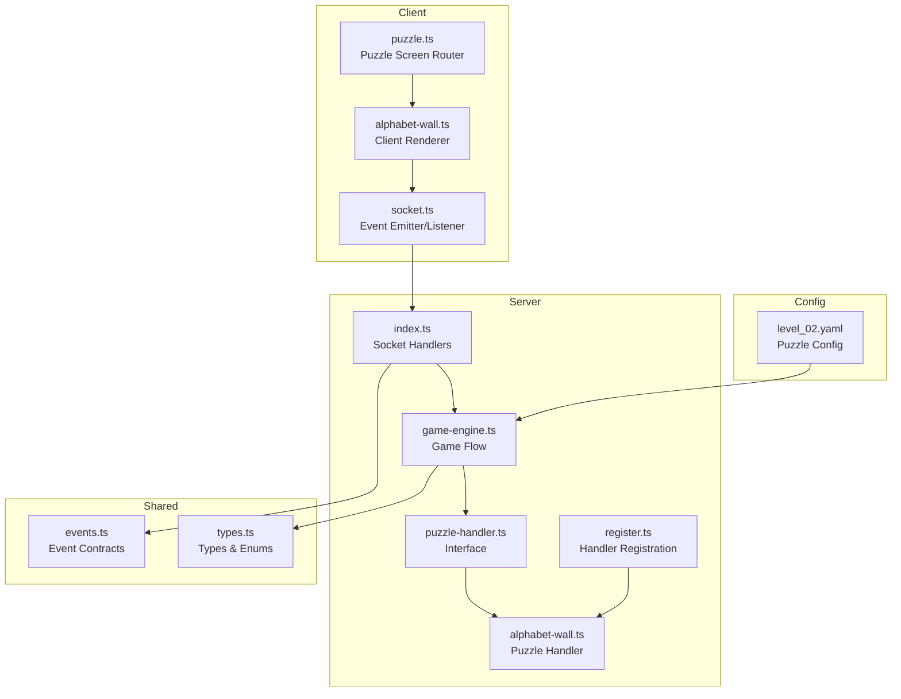
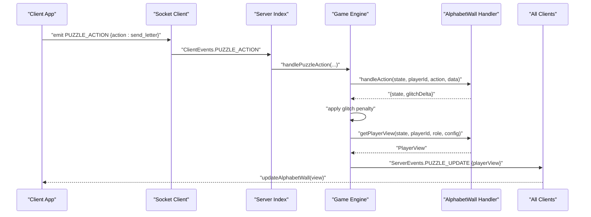
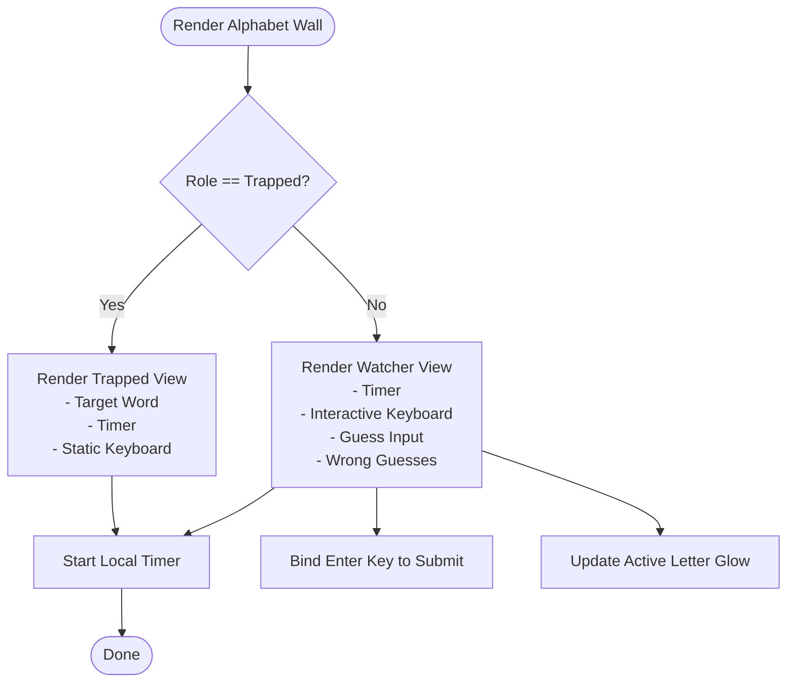
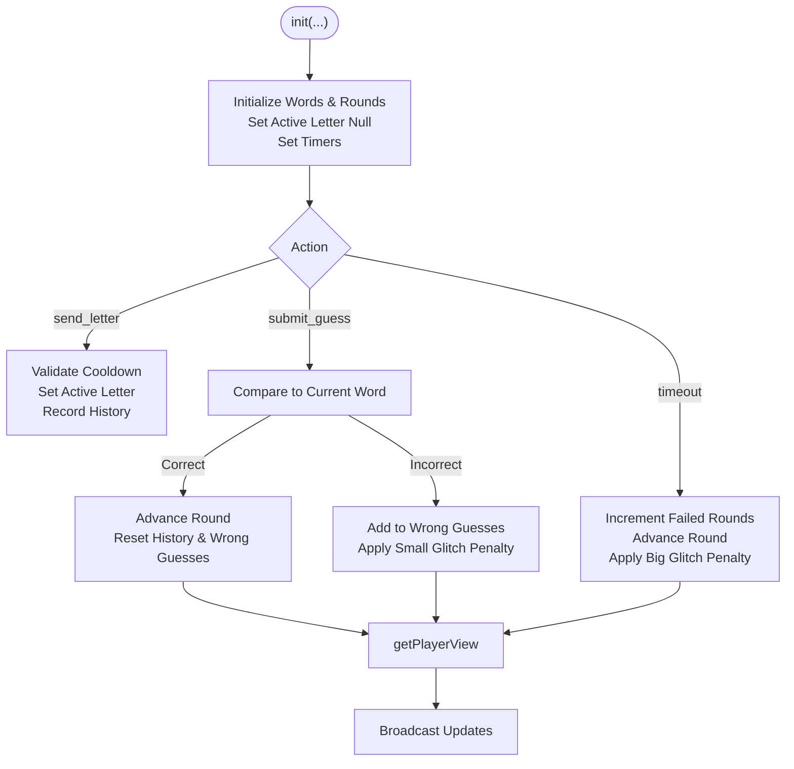
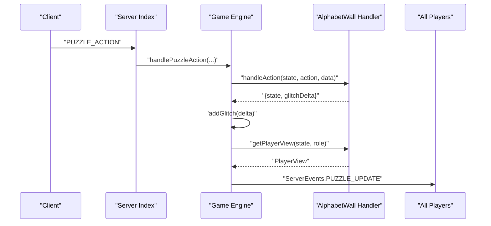
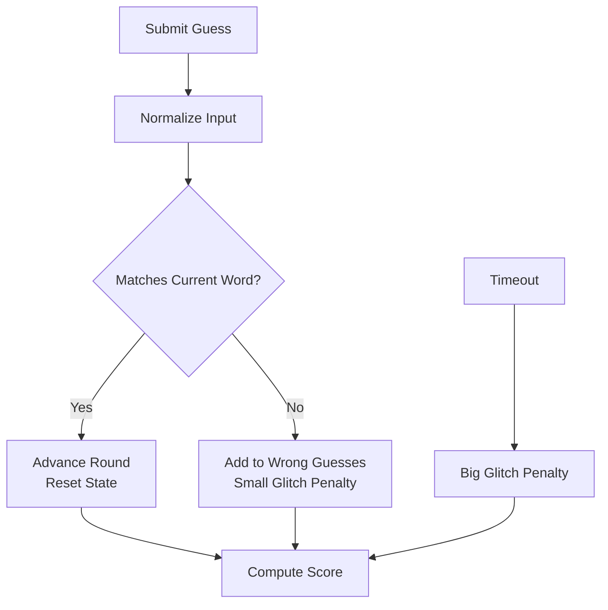
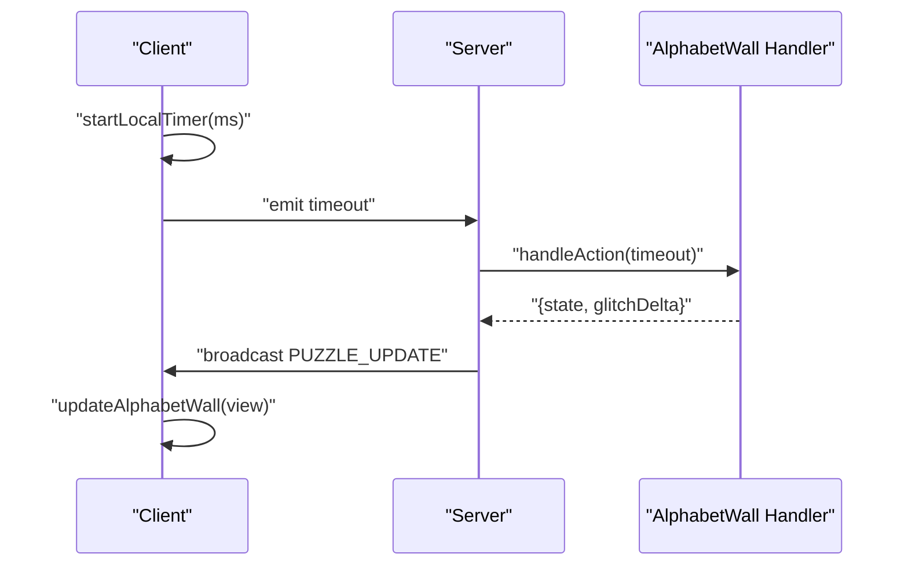
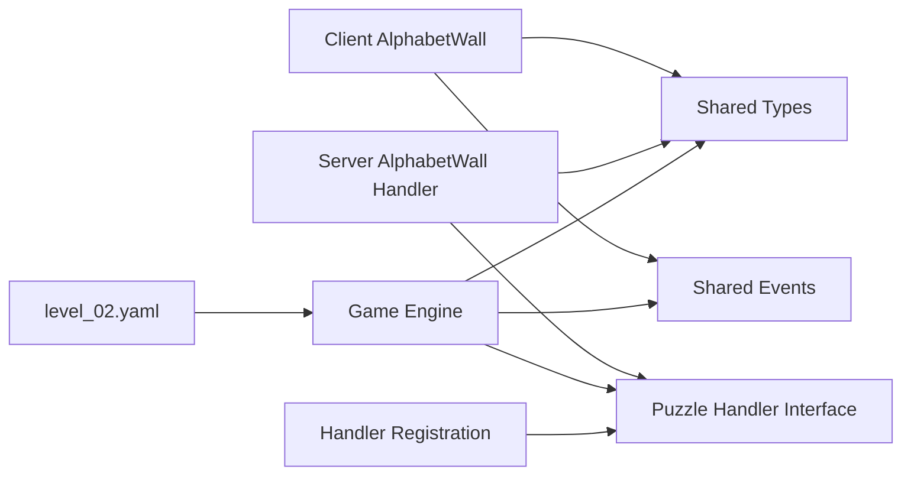

# Alphabet Wall Puzzle

<cite>
**Referenced Files in This Document**
- [alphabet-wall.ts](file://src/client/puzzles/alphabet-wall.ts)
- [alphabet-wall.ts](file://src/server/puzzles/alphabet-wall.ts)
- [puzzle-handler.ts](file://src/server/puzzles/puzzle-handler.ts)
- [puzzle.ts](file://src/client/screens/puzzle.ts)
- [game-engine.ts](file://src/server/services/game-engine.ts)
- [events.ts](file://shared/events.ts)
- [types.ts](file://shared/types.ts)
- [index.ts](file://src/server/index.ts)
- [register.ts](file://src/server/puzzles/register.ts)
- [level_02.yaml](file://config/level_02.yaml)
- [socket.ts](file://src/client/lib/socket.ts)
</cite>

## Table of Contents
1. [Introduction](#introduction)
2. [Project Structure](#project-structure)
3. [Core Components](#core-components)
4. [Architecture Overview](#architecture-overview)
5. [Detailed Component Analysis](#detailed-component-analysis)
6. [Dependency Analysis](#dependency-analysis)
7. [Performance Considerations](#performance-considerations)
8. [Troubleshooting Guide](#troubleshooting-guide)
9. [Conclusion](#conclusion)
10. [Appendices](#appendices)

## Introduction
The Alphabet Wall puzzle is a constrained-communication challenge where one player (the Trapped) sees a target word and activates letters one at a time to communicate it to the Watcher(s). The Watchers observe the glowing letters and must guess the word before the time runs out. This document explains the client-side grid interaction, server-side state management, role-based letter visibility, word validation, and scoring mechanics.

## Project Structure
The Alphabet Wall implementation spans client and server layers:
- Client-side rendering and interaction live under src/client/puzzles and src/client/screens.
- Server-side puzzle logic lives under src/server/puzzles and integrates with the game engine under src/server/services.
- Shared types and events define the contract between client and server.
- Configuration for the puzzle is defined in YAML under config.



**Diagram sources**
- [puzzle.ts](file://src/client/screens/puzzle.ts#L1-L101)
- [alphabet-wall.ts](file://src/client/puzzles/alphabet-wall.ts#L1-L239)
- [socket.ts](file://src/client/lib/socket.ts#L1-L85)
- [index.ts](file://src/server/index.ts#L1-L321)
- [game-engine.ts](file://src/server/services/game-engine.ts#L1-L711)
- [puzzle-handler.ts](file://src/server/puzzles/puzzle-handler.ts#L1-L57)
- [alphabet-wall.ts](file://src/server/puzzles/alphabet-wall.ts#L1-L208)
- [register.ts](file://src/server/puzzles/register.ts#L1-L21)
- [events.ts](file://shared/events.ts#L1-L228)
- [types.ts](file://shared/types.ts#L1-L187)
- [level_02.yaml](file://config/level_02.yaml#L239-L294)

**Section sources**
- [puzzle.ts](file://src/client/screens/puzzle.ts#L1-L101)
- [alphabet-wall.ts](file://src/client/puzzles/alphabet-wall.ts#L1-L239)
- [alphabet-wall.ts](file://src/server/puzzles/alphabet-wall.ts#L1-L208)
- [puzzle-handler.ts](file://src/server/puzzles/puzzle-handler.ts#L1-L57)
- [game-engine.ts](file://src/server/services/game-engine.ts#L1-L711)
- [events.ts](file://shared/events.ts#L1-L228)
- [types.ts](file://shared/types.ts#L1-L187)
- [index.ts](file://src/server/index.ts#L1-L321)
- [register.ts](file://src/server/puzzles/register.ts#L1-L21)
- [level_02.yaml](file://config/level_02.yaml#L239-L294)

## Core Components
- Client-side renderer for the Alphabet Wall puzzle, including the Greek letter keyboard, timer, and role-specific UI.
- Server-side puzzle handler managing state transitions, actions, and player views.
- Game engine orchestrating puzzle lifecycle, role assignment, and broadcast updates.
- Shared event contracts and types ensuring type-safe client-server communication.

Key responsibilities:
- Client: Render UI, handle user input, emit actions, update HUD and timers.
- Server: Validate actions, enforce cooldowns, track active letters, compute timeouts, and compute player views.
- Game engine: Route actions, apply glitch penalties, and broadcast updates.

**Section sources**
- [alphabet-wall.ts](file://src/client/puzzles/alphabet-wall.ts#L1-L239)
- [alphabet-wall.ts](file://src/server/puzzles/alphabet-wall.ts#L1-L208)
- [game-engine.ts](file://src/server/services/game-engine.ts#L324-L383)
- [events.ts](file://shared/events.ts#L28-L90)
- [types.ts](file://shared/types.ts#L72-L164)

## Architecture Overview
The Alphabet Wall puzzle follows a client-server architecture with role-based asymmetric information:
- Roles: Trapped (sees target word) and Watcher (observes glowing letters and submits guesses).
- Client emits actions (send_letter, submit_guess, timeout).
- Server validates actions, updates state, applies penalties, and broadcasts updated views.
- Game engine coordinates role assignment and puzzle lifecycle.



**Diagram sources**
- [socket.ts](file://src/client/lib/socket.ts#L51-L57)
- [index.ts](file://src/server/index.ts#L206-L217)
- [game-engine.ts](file://src/server/services/game-engine.ts#L324-L383)
- [alphabet-wall.ts](file://src/server/puzzles/alphabet-wall.ts#L83-L143)
- [events.ts](file://shared/events.ts#L36-L37)
- [events.ts](file://shared/events.ts#L65-L66)
- [events.ts](file://shared/events.ts#L194-L197)

## Detailed Component Analysis

### Client-Side Alphabet Wall Renderer
The client renders two distinct views based on role:
- Trapped view: displays the target word, a timer, and a static alphabet keyboard.
- Watcher view: displays a timer, interactive alphabet keyboard, a guess input, and a list of wrong guesses.

Interaction highlights:
- Interactive keyboard for Trapped players triggers send_letter actions with a client-side cooldown.
- Watchers can submit guesses via input or Enter key.
- Local timer updates and visual feedback for active letters.



**Diagram sources**
- [alphabet-wall.ts](file://src/client/puzzles/alphabet-wall.ts#L11-L33)
- [alphabet-wall.ts](file://src/client/puzzles/alphabet-wall.ts#L35-L53)
- [alphabet-wall.ts](file://src/client/puzzles/alphabet-wall.ts#L55-L99)
- [alphabet-wall.ts](file://src/client/puzzles/alphabet-wall.ts#L101-L119)
- [alphabet-wall.ts](file://src/client/puzzles/alphabet-wall.ts#L121-L139)
- [alphabet-wall.ts](file://src/client/puzzles/alphabet-wall.ts#L141-L152)
- [alphabet-wall.ts](file://src/client/puzzles/alphabet-wall.ts#L169-L201)
- [alphabet-wall.ts](file://src/client/puzzles/alphabet-wall.ts#L203-L238)

**Section sources**
- [alphabet-wall.ts](file://src/client/puzzles/alphabet-wall.ts#L1-L239)
- [puzzle.ts](file://src/client/screens/puzzle.ts#L64-L72)
- [puzzle.ts](file://src/client/screens/puzzle.ts#L93-L95)

### Server-Side Alphabet Wall Handler
The server maintains puzzle state and enforces rules:
- State fields include selected words, current round, active letter, history, wrong guesses, and timing.
- Actions:
  - send_letter: validates cooldown, sets active letter with expiration, records history.
  - submit_guess: compares uppercase trimmed guess to current word; correct advances rounds; incorrect adds to wrong guesses and applies glitch penalty.
  - timeout: increments failed rounds and advances to next round with penalties.
- Player views:
  - Trapped sees current word, history size, last sent time, cooldown, and time remaining.
  - Watchers see active letter, history size, wrong guesses, and time remaining.
- Win condition: puzzle completes when rounds are finished or successful rounds meet threshold.



**Diagram sources**
- [alphabet-wall.ts](file://src/server/puzzles/alphabet-wall.ts#L27-L81)
- [alphabet-wall.ts](file://src/server/puzzles/alphabet-wall.ts#L83-L143)
- [alphabet-wall.ts](file://src/server/puzzles/alphabet-wall.ts#L155-L206)

**Section sources**
- [alphabet-wall.ts](file://src/server/puzzles/alphabet-wall.ts#L1-L208)
- [puzzle-handler.ts](file://src/server/puzzles/puzzle-handler.ts#L12-L44)

### Game Engine Integration
The game engine routes actions, applies glitch penalties, and broadcasts updates:
- On PUZZLE_ACTION, the engine retrieves the handler, processes the action, persists state, and sends updated views to all players.
- It checks win conditions and transitions to the next puzzle or ends the game accordingly.
- Player views are role-specific and derived from the puzzle handler.



**Diagram sources**
- [index.ts](file://src/server/index.ts#L206-L217)
- [game-engine.ts](file://src/server/services/game-engine.ts#L324-L383)
- [alphabet-wall.ts](file://src/server/puzzles/alphabet-wall.ts#L83-L143)
- [events.ts](file://shared/events.ts#L65-L66)

**Section sources**
- [index.ts](file://src/server/index.ts#L206-L217)
- [game-engine.ts](file://src/server/services/game-engine.ts#L324-L383)
- [events.ts](file://shared/events.ts#L194-L197)

### Role-Based Letter Visibility System
The puzzle uses asymmetric information:
- Trapped role receives a view with the current word and time remaining.
- Watcher role receives a view with the active letter (if any), wrong guesses, and time remaining.
- The active letter expires automatically based on configured duration.

```mermaid
classDiagram
class AlphabetWallData {
+string[] selectedWords
+number currentRoundIndex
+number successfulRounds
+number failedRounds
+number roundsToPlay
+number roundsToWin
+number letterGlowDurationMs
+number cooldownMs
+number guessTimeoutMs
+string currentWord
+string activeLetter
+number activeLetterExpiresAt
+number lastLetterSentAt
+number roundStartedAt
+string[] sentLettersHistory
+string[] wrongGuesses
}
class PlayerView {
+string playerId
+string role
+string puzzleId
+PuzzleType puzzleType
+string puzzleTitle
+Record~string,unknown~ viewData
}
class AlphabetWallHandler {
+init(players, config) PuzzleState
+handleAction(state, playerId, action, data) {state, glitchDelta}
+checkWin(state) boolean
+getPlayerView(state, playerId, role, config) PlayerView
}
AlphabetWallHandler --> AlphabetWallData : "manages"
AlphabetWallHandler --> PlayerView : "produces"
```

**Diagram sources**
- [alphabet-wall.ts](file://src/server/puzzles/alphabet-wall.ts#L5-L24)
- [alphabet-wall.ts](file://src/server/puzzles/alphabet-wall.ts#L155-L206)
- [types.ts](file://shared/types.ts#L72-L164)

**Section sources**
- [alphabet-wall.ts](file://src/server/puzzles/alphabet-wall.ts#L155-L206)
- [types.ts](file://shared/types.ts#L157-L164)

### Word Validation and Scoring
- Word validation occurs on the server when a guess is submitted. The guess is normalized (uppercase, trimmed) and compared to the current word.
- Correct guesses advance rounds; incorrect guesses incur a small glitch penalty; timeouts incur a larger penalty.
- The game engine calculates a score based on elapsed time and final glitch value, and stores it in the database.



**Diagram sources**
- [alphabet-wall.ts](file://src/server/puzzles/alphabet-wall.ts#L107-L127)
- [game-engine.ts](file://src/server/services/game-engine.ts#L451-L456)

**Section sources**
- [alphabet-wall.ts](file://src/server/puzzles/alphabet-wall.ts#L107-L140)
- [game-engine.ts](file://src/server/services/game-engine.ts#L451-L456)

### Real-Time Feedback and Timer Mechanics
- Client-side timers update every second and emit a timeout action when time elapses.
- Server-side timers compute time remaining based on round start time and configured timeout.
- Active letter glow is synchronized across clients; the Trapped role sees the target word, while Watchers see the active letter.



**Diagram sources**
- [alphabet-wall.ts](file://src/client/puzzles/alphabet-wall.ts#L169-L201)
- [alphabet-wall.ts](file://src/server/puzzles/alphabet-wall.ts#L128-L140)
- [events.ts](file://shared/events.ts#L65-L66)

**Section sources**
- [alphabet-wall.ts](file://src/client/puzzles/alphabet-wall.ts#L169-L201)
- [alphabet-wall.ts](file://src/server/puzzles/alphabet-wall.ts#L128-L140)

## Dependency Analysis
- Client puzzle renderer depends on shared types for PlayerView and on socket events for emitting actions.
- Server puzzle handler depends on shared types and puzzle handler interface.
- Game engine depends on puzzle handlers via registration and on shared events and types.
- Configuration defines puzzle roles, difficulty pools, and timing parameters.



**Diagram sources**
- [alphabet-wall.ts](file://src/client/puzzles/alphabet-wall.ts#L1-L3)
- [alphabet-wall.ts](file://src/server/puzzles/alphabet-wall.ts#L1-L3)
- [puzzle-handler.ts](file://src/server/puzzles/puzzle-handler.ts#L1-L57)
- [game-engine.ts](file://src/server/services/game-engine.ts#L1-L711)
- [events.ts](file://shared/events.ts#L1-L228)
- [types.ts](file://shared/types.ts#L1-L187)
- [register.ts](file://src/server/puzzles/register.ts#L1-L21)
- [level_02.yaml](file://config/level_02.yaml#L239-L294)

**Section sources**
- [alphabet-wall.ts](file://src/client/puzzles/alphabet-wall.ts#L1-L3)
- [alphabet-wall.ts](file://src/server/puzzles/alphabet-wall.ts#L1-L3)
- [puzzle-handler.ts](file://src/server/puzzles/puzzle-handler.ts#L1-L57)
- [game-engine.ts](file://src/server/services/game-engine.ts#L1-L711)
- [register.ts](file://src/server/puzzles/register.ts#L1-L21)
- [level_02.yaml](file://config/level_02.yaml#L239-L294)

## Performance Considerations
- Client-side debouncing prevents rapid repeated letter activations.
- Server-side cooldown enforcement avoids spamming and ensures fair gameplay.
- Minimal DOM updates in client renderer reduce layout thrash.
- Timer updates occur at fixed intervals to balance responsiveness and performance.

[No sources needed since this section provides general guidance]

## Troubleshooting Guide
Common issues and resolutions:
- No updates received: Verify socket connection and that PUZZLE_UPDATE events are emitted and handled.
- Incorrect guess not recognized: Ensure guess normalization (uppercase, trimmed) and that the current word matches.
- Active letter not lighting: Confirm cooldown elapsed and that active letter expiration is recalculated.
- Timer discrepancies: Check roundStartedAt synchronization and that local timer aligns with server time remaining.

**Section sources**
- [socket.ts](file://src/client/lib/socket.ts#L51-L57)
- [alphabet-wall.ts](file://src/client/puzzles/alphabet-wall.ts#L121-L139)
- [alphabet-wall.ts](file://src/server/puzzles/alphabet-wall.ts#L93-L96)
- [alphabet-wall.ts](file://src/server/puzzles/alphabet-wall.ts#L168-L170)

## Conclusion
The Alphabet Wall puzzle combines role-based asymmetric information with real-time letter activation and word guessing. The client provides responsive UI and immediate feedback, while the server enforces fairness, validates actions, and computes outcomes. Configuration-driven difficulty and timing parameters enable flexible puzzle design.

[No sources needed since this section summarizes without analyzing specific files]

## Appendices

### Puzzle Configuration Example
- Roles: Trapped (1), Watcher (remaining).
- Difficulty pools: easy, medium, hard words.
- Timing: letter glow duration, cooldown, guess timeout.
- Rounds: total rounds to play and rounds to win.

**Section sources**
- [level_02.yaml](file://config/level_02.yaml#L248-L294)

### Dictionary Integration Notes
- Words are drawn from configured pools (easy/medium/hard) and mixed according to rounds to play.
- No external dictionary is checked server-side; correctness depends on exact equality to the selected word.

**Section sources**
- [alphabet-wall.ts](file://src/server/puzzles/alphabet-wall.ts#L37-L52)
- [alphabet-wall.ts](file://src/server/puzzles/alphabet-wall.ts#L108-L112)

### Multi-Letter Bonus Systems
- The Alphabet Wall handler does not implement multi-letter bonuses. Scoring is computed by the game engine based on elapsed time and glitch accumulation.

**Section sources**
- [alphabet-wall.ts](file://src/server/puzzles/alphabet-wall.ts#L1-L208)
- [game-engine.ts](file://src/server/services/game-engine.ts#L451-L456)