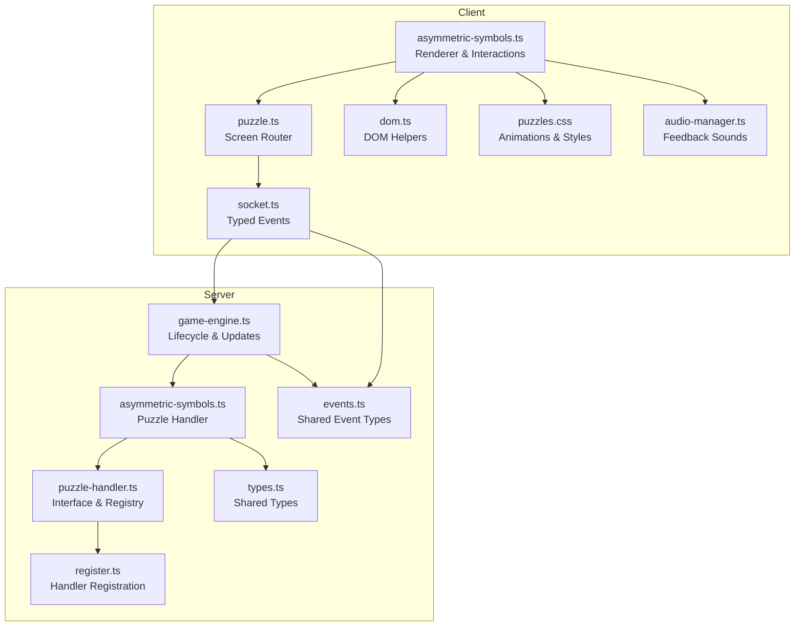
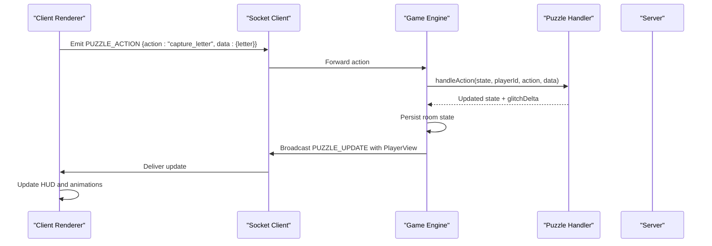
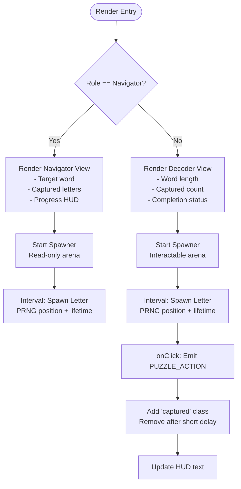
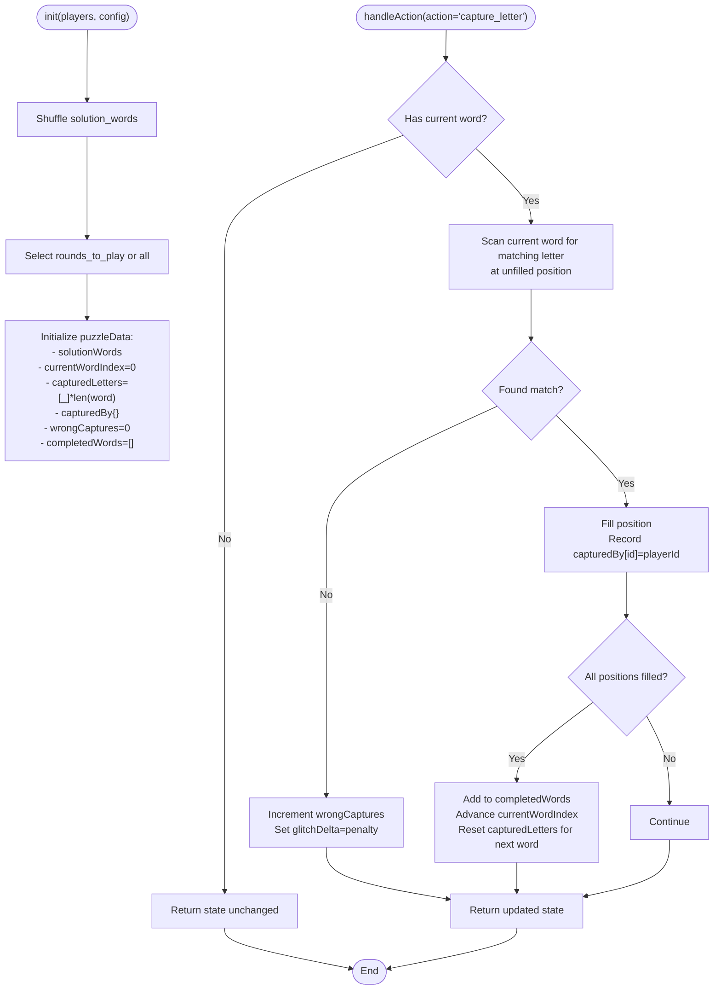
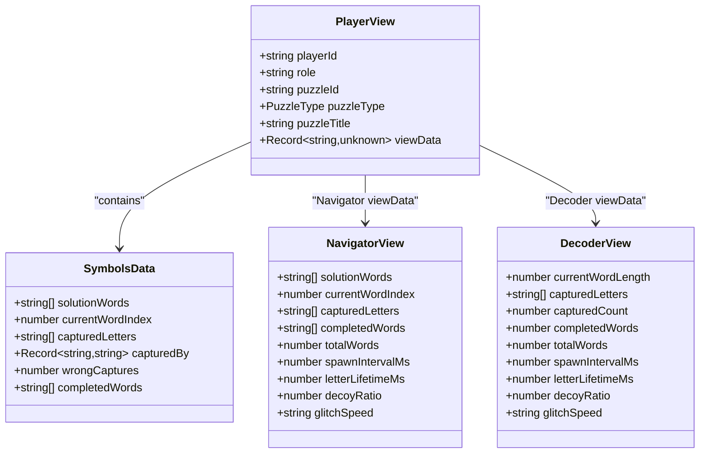
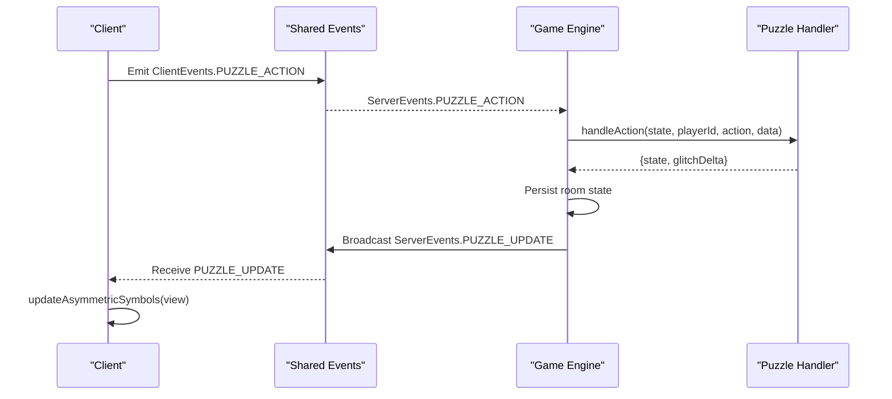
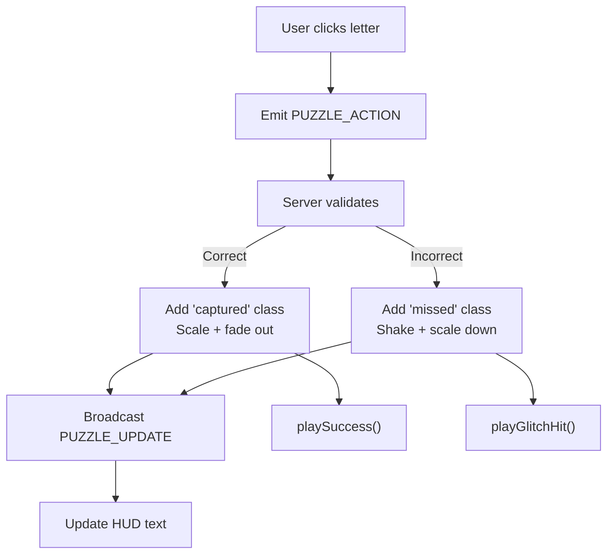
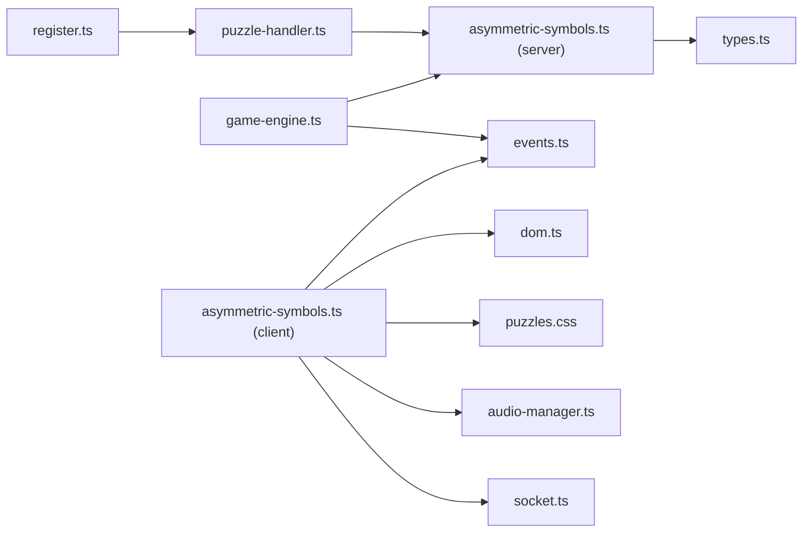

# Asymmetric Symbols Puzzle

<cite>
**Referenced Files in This Document**
- [asymmetric-symbols.ts](file://src/client/puzzles/asymmetric-symbols.ts)
- [asymmetric-symbols.ts](file://src/server/puzzles/asymmetric-symbols.ts)
- [puzzle-handler.ts](file://src/server/puzzles/puzzle-handler.ts)
- [register.ts](file://src/server/puzzles/register.ts)
- [game-engine.ts](file://src/server/services/game-engine.ts)
- [events.ts](file://shared/events.ts)
- [types.ts](file://shared/types.ts)
- [socket.ts](file://src/client/lib/socket.ts)
- [dom.ts](file://src/client/lib/dom.ts)
- [puzzle.ts](file://src/client/screens/puzzle.ts)
- [puzzles.css](file://src/client/styles/puzzles.css)
- [audio-manager.ts](file://src/client/audio/audio-manager.ts)
</cite>

## Table of Contents
1. [Introduction](#introduction)
2. [Project Structure](#project-structure)
3. [Core Components](#core-components)
4. [Architecture Overview](#architecture-overview)
5. [Detailed Component Analysis](#detailed-component-analysis)
6. [Dependency Analysis](#dependency-analysis)
7. [Performance Considerations](#performance-considerations)
8. [Troubleshooting Guide](#troubleshooting-guide)
9. [Conclusion](#conclusion)

## Introduction
The Asymmetric Symbols puzzle is a collaborative, role-based challenge where players must arrange symbols into asymmetric patterns. The puzzle enforces asymmetric information: one player (Navigator) sees the target words and guides the team, while other players (Decoders) see flying letters and must capture the correct symbols in order. The implementation spans client-side rendering with animated flying letters, dragless interaction via clicks, and server-side validation ensuring correct symbol placement and scoring.

## Project Structure
The puzzle integrates across client and server layers:
- Client-side puzzle renderer and DOM helpers
- Socket event orchestration and screen routing
- Server-side puzzle handler implementing game logic and role-based visibility
- Shared types and events for typed communication
- Audio feedback and CSS animations for immersive UX

**Diagram sources**
- [asymmetric-symbols.ts](file://src/client/puzzles/asymmetric-symbols.ts#L1-L221)
- [puzzle.ts](file://src/client/screens/puzzle.ts#L1-L101)
- [socket.ts](file://src/client/lib/socket.ts#L1-L85)
- [dom.ts](file://src/client/lib/dom.ts#L1-L73)
- [puzzles.css](file://src/client/styles/puzzles.css#L1-L155)
- [audio-manager.ts](file://src/client/audio/audio-manager.ts#L1-L164)
- [asymmetric-symbols.ts](file://src/server/puzzles/asymmetric-symbols.ts#L1-L156)
- [puzzle-handler.ts](file://src/server/puzzles/puzzle-handler.ts#L1-L57)
- [register.ts](file://src/server/puzzles/register.ts#L1-L21)
- [game-engine.ts](file://src/server/services/game-engine.ts#L1-L711)
- [events.ts](file://shared/events.ts#L1-L228)
- [types.ts](file://shared/types.ts#L1-L187)

**Section sources**
- [asymmetric-symbols.ts](file://src/client/puzzles/asymmetric-symbols.ts#L1-L221)
- [asymmetric-symbols.ts](file://src/server/puzzles/asymmetric-symbols.ts#L1-L156)
- [puzzle-handler.ts](file://src/server/puzzles/puzzle-handler.ts#L1-L57)
- [register.ts](file://src/server/puzzles/register.ts#L1-L21)
- [game-engine.ts](file://src/server/services/game-engine.ts#L1-L711)
- [events.ts](file://shared/events.ts#L1-L228)
- [types.ts](file://shared/types.ts#L1-L187)
- [socket.ts](file://src/client/lib/socket.ts#L1-L85)
- [dom.ts](file://src/client/lib/dom.ts#L1-L73)
- [puzzle.ts](file://src/client/screens/puzzle.ts#L1-L101)
- [puzzles.css](file://src/client/styles/puzzles.css#L1-L155)
- [audio-manager.ts](file://src/client/audio/audio-manager.ts#L1-L164)

## Core Components
- Client Renderer: Creates the UI for both Navigator and Decoder views, spawns animated flying letters, handles click interactions, and updates HUD displays.
- Server Handler: Manages puzzle initialization, validates captures, tracks progress, and computes win conditions.
- Game Engine: Coordinates puzzle lifecycle, role assignment, broadcasting updates, and applying penalties.
- Shared Contracts: Strongly typed events and data structures ensure reliable client-server communication.

Key responsibilities:
- Asymmetric Information: Navigator sees target words and progress; Decoders see flying letters and capture state.
- Symbol Positioning: Flying letters spawn at random positions with deterministic seeding for synchronization.
- Validation: Correct letters fill blanks in word order; wrong captures increment glitch.
- Scoring: Derived from elapsed time and final glitch value.

**Section sources**
- [asymmetric-symbols.ts](file://src/client/puzzles/asymmetric-symbols.ts#L28-L221)
- [asymmetric-symbols.ts](file://src/server/puzzles/asymmetric-symbols.ts#L18-L156)
- [game-engine.ts](file://src/server/services/game-engine.ts#L263-L383)
- [events.ts](file://shared/events.ts#L112-L197)
- [types.ts](file://shared/types.ts#L157-L164)

## Architecture Overview
The puzzle follows a clear separation of concerns:
- Client renders the puzzle and sends actions via typed events.
- Server validates actions, updates state, and broadcasts view updates.
- Game engine orchestrates lifecycle transitions and scoring.

**Diagram sources**
- [socket.ts](file://src/client/lib/socket.ts#L51-L57)
- [events.ts](file://shared/events.ts#L36-L37)
- [game-engine.ts](file://src/server/services/game-engine.ts#L324-L383)
- [asymmetric-symbols.ts](file://src/server/puzzles/asymmetric-symbols.ts#L54-L96)

**Section sources**
- [socket.ts](file://src/client/lib/socket.ts#L1-L85)
- [events.ts](file://shared/events.ts#L28-L90)
- [game-engine.ts](file://src/server/services/game-engine.ts#L324-L383)
- [asymmetric-symbols.ts](file://src/server/puzzles/asymmetric-symbols.ts#L54-L96)

## Detailed Component Analysis

### Client: Asymmetric Symbols Renderer
Responsibilities:
- Render Navigator vs Decoder views with role badges and contextual instructions.
- Spawn flying letters at randomized positions with synchronized PRNG.
- Handle click interactions and provide immediate visual feedback.
- Update HUD counters and progress displays.
- Manage cleanup of intervals and DOM nodes.

Rendering logic:
- Navigator view shows target word, captured letters, and progress.
- Decoder view shows current word length, captured letters, and completion status.
- Arena areas are populated with animated letter elements.

Interaction model:
- Clicking a letter emits a capture action to the server.
- Visual feedback includes scaling, glow, and removal animations.

**Diagram sources**
- [asymmetric-symbols.ts](file://src/client/puzzles/asymmetric-symbols.ts#L28-L160)
- [dom.ts](file://src/client/lib/dom.ts#L11-L44)
- [puzzles.css](file://src/client/styles/puzzles.css#L77-L154)

**Section sources**
- [asymmetric-symbols.ts](file://src/client/puzzles/asymmetric-symbols.ts#L28-L221)
- [dom.ts](file://src/client/lib/dom.ts#L1-L73)
- [puzzles.css](file://src/client/styles/puzzles.css#L66-L154)
- [audio-manager.ts](file://src/client/audio/audio-manager.ts#L142-L164)

### Server: Asymmetric Symbols Handler
Responsibilities:
- Initialize puzzle with shuffled solution words and round limits.
- Validate capture actions and update captured letters in order.
- Track completed words and move to the next word when complete.
- Compute win condition when all selected words are completed.
- Provide role-specific views with asymmetric data.

Validation logic:
- Find the first unfilled position matching the captured letter in the current word.
- On match, mark the position and record who captured it.
- On miss, increment wrong captures and apply glitch penalty.

**Diagram sources**
- [asymmetric-symbols.ts](file://src/server/puzzles/asymmetric-symbols.ts#L18-L101)

**Section sources**
- [asymmetric-symbols.ts](file://src/server/puzzles/asymmetric-symbols.ts#L18-L156)
- [types.ts](file://shared/types.ts#L72-L83)

### Role-Based Visibility System
The server constructs distinct PlayerView payloads per role:
- Navigator: Receives full solution words, current index, captured letters, completed words, and timing parameters.
- Decoder: Receives current word length, captured letters, captured count, completed words, and timing parameters.

This ensures asymmetric information and prevents Decoders from seeing the target words directly.

**Diagram sources**
- [types.ts](file://shared/types.ts#L157-L164)
- [asymmetric-symbols.ts](file://src/server/puzzles/asymmetric-symbols.ts#L103-L154)

**Section sources**
- [asymmetric-symbols.ts](file://src/server/puzzles/asymmetric-symbols.ts#L103-L154)
- [types.ts](file://shared/types.ts#L157-L164)

### Client-Server Communication Patterns
- Client emits typed actions using the shared event namespace.
- Server responds with PUZZLE_UPDATE containing the updated PlayerView for all clients.
- The game engine persists state and applies glitch penalties when mistakes occur.

**Diagram sources**
- [events.ts](file://shared/events.ts#L28-L90)
- [socket.ts](file://src/client/lib/socket.ts#L51-L57)
- [game-engine.ts](file://src/server/services/game-engine.ts#L324-L383)
- [asymmetric-symbols.ts](file://src/server/puzzles/asymmetric-symbols.ts#L54-L96)

**Section sources**
- [events.ts](file://shared/events.ts#L112-L197)
- [socket.ts](file://src/client/lib/socket.ts#L51-L57)
- [game-engine.ts](file://src/server/services/game-engine.ts#L324-L383)

### Visual Feedback and Animations
- CSS keyframes define floating, capture, and miss animations for flying letters.
- Navigator HUD highlights captured letters and progress.
- Decoder HUD shows captured count and word completion.
- Audio feedback plays upon successful captures.

**Diagram sources**
- [asymmetric-symbols.ts](file://src/client/puzzles/asymmetric-symbols.ts#L148-L160)
- [puzzles.css](file://src/client/styles/puzzles.css#L111-L154)
- [audio-manager.ts](file://src/client/audio/audio-manager.ts#L118-L164)

**Section sources**
- [puzzles.css](file://src/client/styles/puzzles.css#L77-L154)
- [audio-manager.ts](file://src/client/audio/audio-manager.ts#L118-L164)
- [asymmetric-symbols.ts](file://src/client/puzzles/asymmetric-symbols.ts#L148-L160)

## Dependency Analysis
- Handler registration binds puzzle type to its implementation.
- Game engine depends on the handler registry and role assignments.
- Client depends on shared events and types for reliable communication.
- CSS and audio enhance UX without changing core logic.

**Diagram sources**
- [register.ts](file://src/server/puzzles/register.ts#L14-L20)
- [puzzle-handler.ts](file://src/server/puzzles/puzzle-handler.ts#L46-L56)
- [asymmetric-symbols.ts](file://src/server/puzzles/asymmetric-symbols.ts#L1-L156)
- [game-engine.ts](file://src/server/services/game-engine.ts#L263-L319)
- [events.ts](file://shared/events.ts#L1-L228)
- [types.ts](file://shared/types.ts#L1-L187)
- [asymmetric-symbols.ts](file://src/client/puzzles/asymmetric-symbols.ts#L1-L221)
- [dom.ts](file://src/client/lib/dom.ts#L1-L73)
- [puzzles.css](file://src/client/styles/puzzles.css#L1-L155)
- [audio-manager.ts](file://src/client/audio/audio-manager.ts#L1-L164)
- [socket.ts](file://src/client/lib/socket.ts#L1-L85)

**Section sources**
- [register.ts](file://src/server/puzzles/register.ts#L1-L21)
- [puzzle-handler.ts](file://src/server/puzzles/puzzle-handler.ts#L1-L57)
- [asymmetric-symbols.ts](file://src/server/puzzles/asymmetric-symbols.ts#L1-L156)
- [game-engine.ts](file://src/server/services/game-engine.ts#L263-L319)
- [events.ts](file://shared/events.ts#L1-L228)
- [types.ts](file://shared/types.ts#L1-L187)
- [asymmetric-symbols.ts](file://src/client/puzzles/asymmetric-symbols.ts#L1-L221)
- [dom.ts](file://src/client/lib/dom.ts#L1-L73)
- [puzzles.css](file://src/client/styles/puzzles.css#L1-L155)
- [audio-manager.ts](file://src/client/audio/audio-manager.ts#L1-L164)
- [socket.ts](file://src/client/lib/socket.ts#L1-L85)

## Performance Considerations
- Deterministic PRNG ensures synchronized letter generation across clients without excessive network traffic.
- CSS animations minimize JavaScript overhead for smooth visuals.
- Interval-based spawning avoids continuous polling; intervals are cleared on unmount.
- Server-side validation is O(n) per action, where n is the current word length—efficient for typical word sizes.

## Troubleshooting Guide
Common issues and resolutions:
- No letters spawning: Verify spawn interval and lifetime parameters are present in view data; ensure the arena element exists.
- Clicks not registering: Confirm interactive mode is enabled for Decoders and that event listeners are attached.
- HUD not updating: Check that PUZZLE_UPDATE messages are received and update functions are invoked.
- Glitch not increasing: Ensure wrong captures are being counted and glitch deltas are applied by the engine.
- Audio not playing: Resume audio context on user gesture and verify buffers are decoded before playback.

**Section sources**
- [asymmetric-symbols.ts](file://src/client/puzzles/asymmetric-symbols.ts#L107-L160)
- [game-engine.ts](file://src/server/services/game-engine.ts#L349-L352)
- [audio-manager.ts](file://src/client/audio/audio-manager.ts#L33-L54)

## Conclusion
The Asymmetric Symbols puzzle demonstrates a clean separation of concerns with robust role-based visibility, efficient client-server communication, and immersive visual feedback. The server enforces precise validation and scoring, while the client delivers responsive interactions and animations. Together, these components create a cohesive collaborative experience tailored for escape room gameplay.