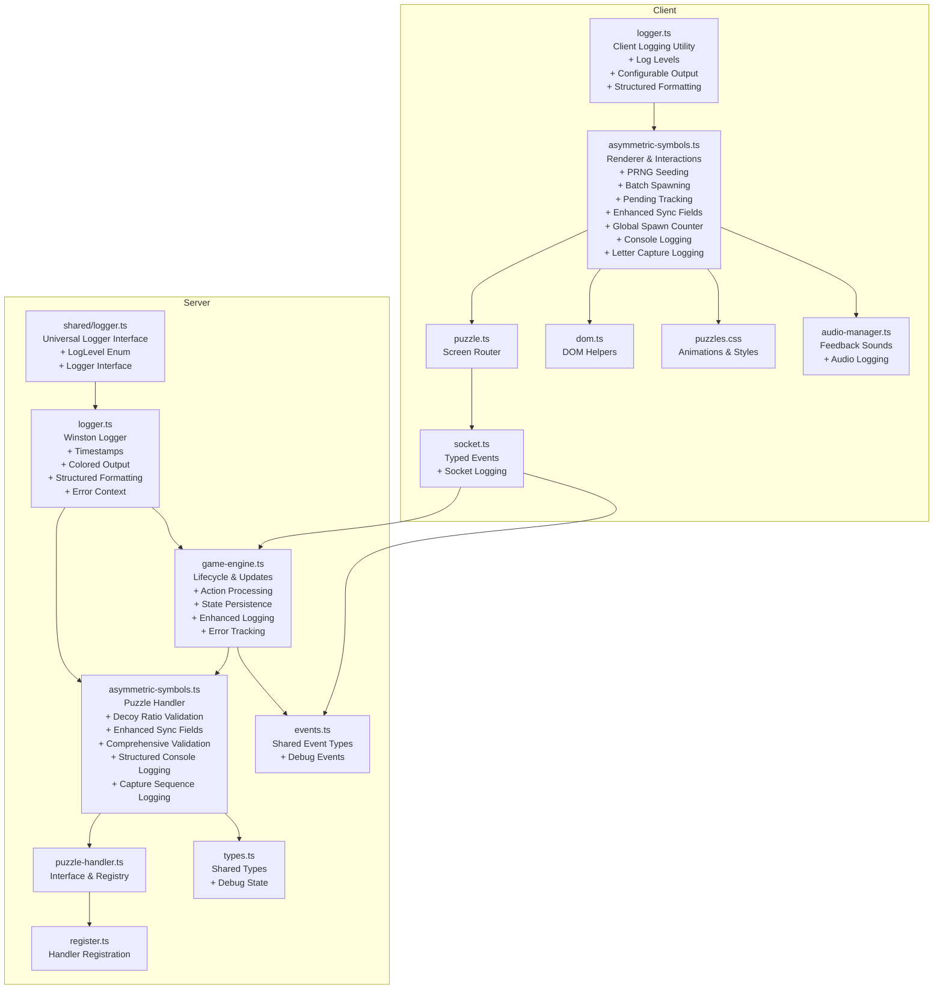
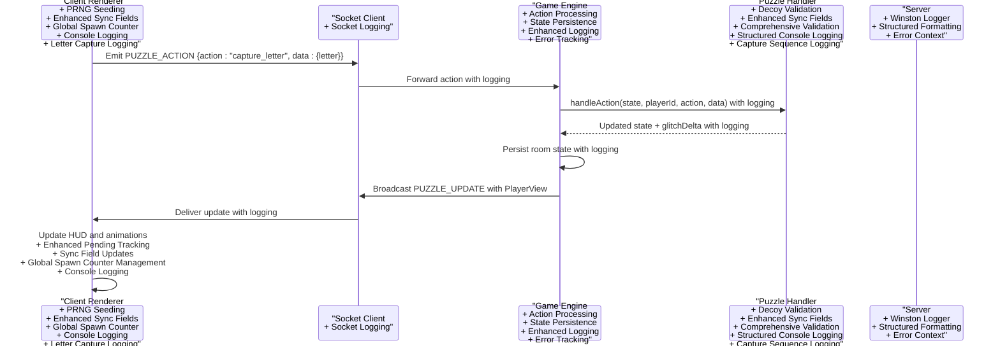
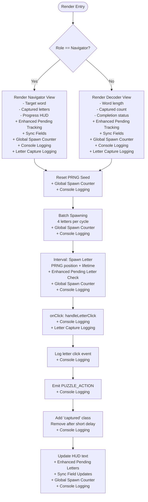
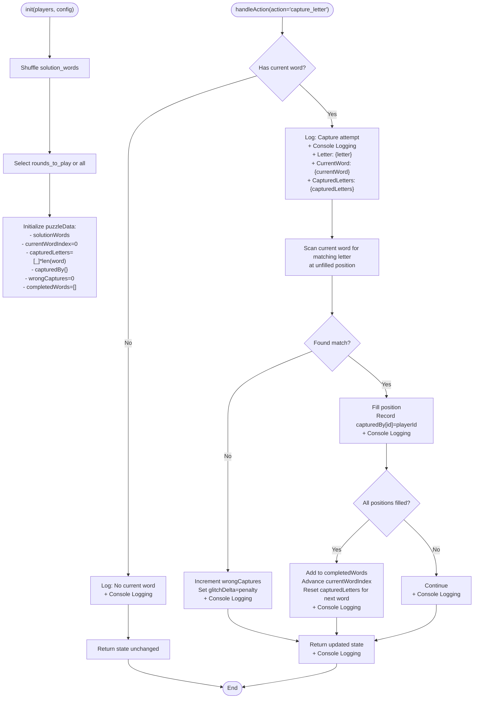
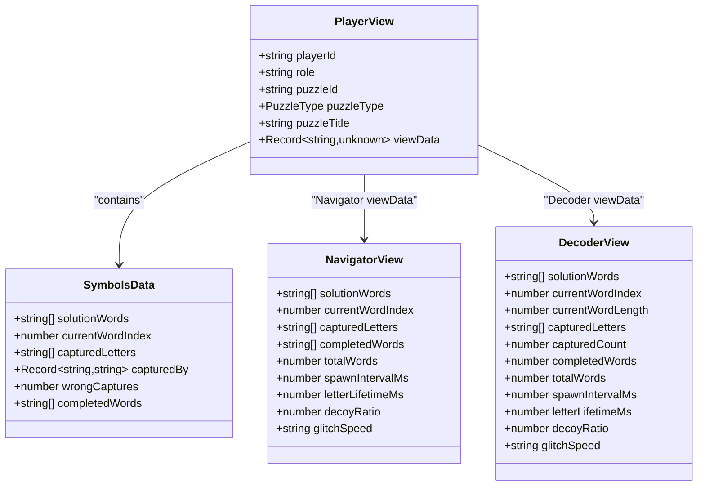
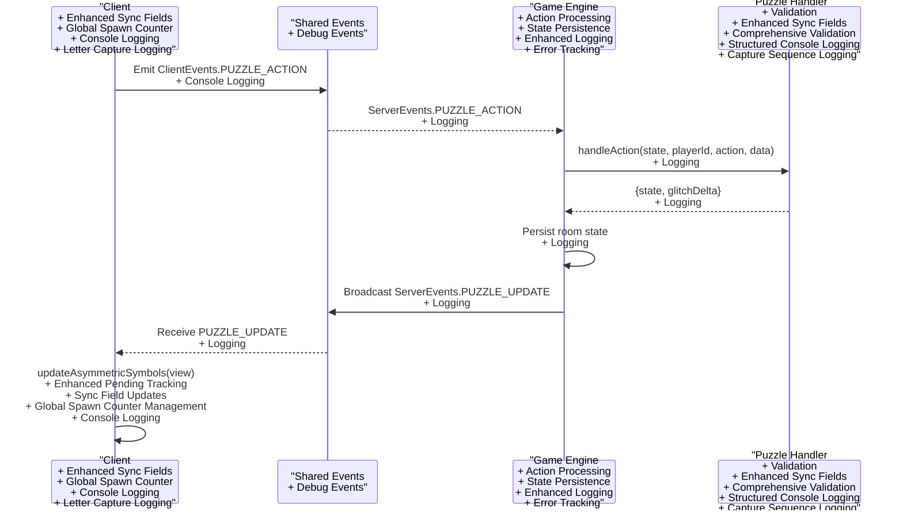
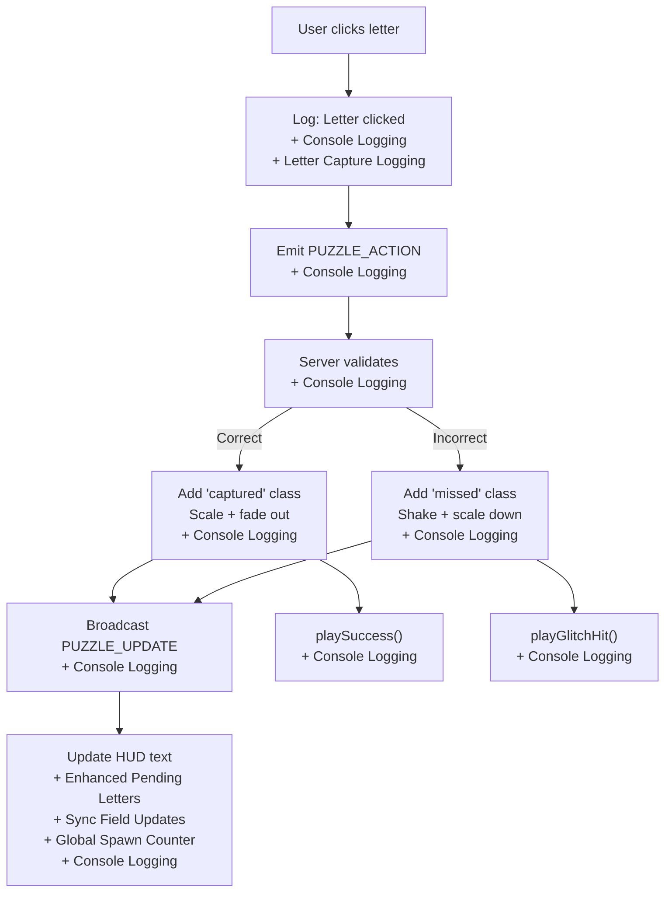
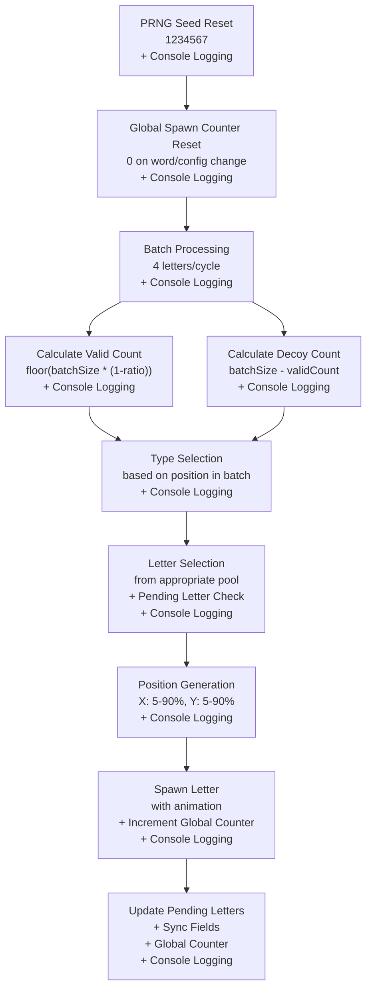
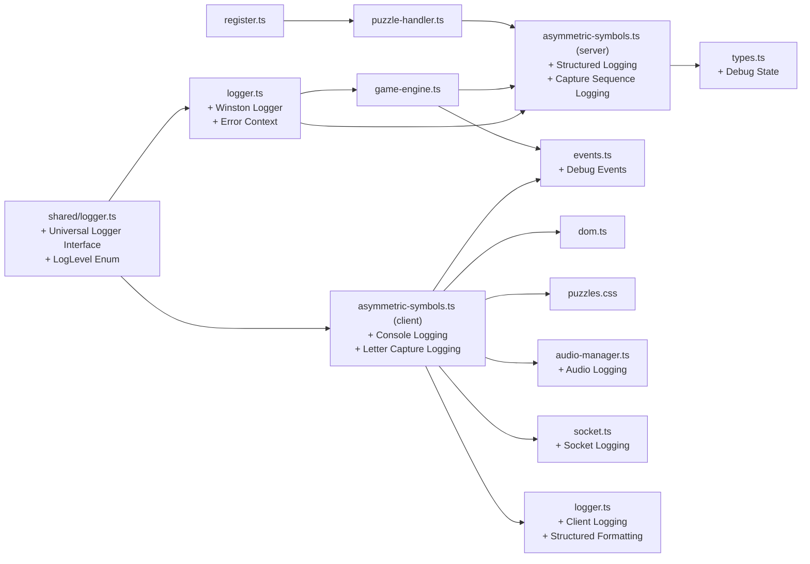

# Asymmetric Symbols Puzzle

<cite>
**Referenced Files in This Document**
- [asymmetric-symbols.ts](file://src/client/puzzles/asymmetric-symbols.ts)
- [asymmetric-symbols.ts](file://src/server/puzzles/asymmetric-symbols.ts)
- [puzzle-handler.ts](file://src/server/puzzles/puzzle-handler.ts)
- [register.ts](file://src/server/puzzles/register.ts)
- [game-engine.ts](file://src/server/services/game-engine.ts)
- [events.ts](file://shared/events.ts)
- [types.ts](file://shared/types.ts)
- [socket.ts](file://src/client/lib/socket.ts)
- [dom.ts](file://src/client/lib/dom.ts)
- [puzzle.ts](file://src/client/screens/puzzle.ts)
- [puzzles.css](file://src/client/styles/puzzles.css)
- [audio-manager.ts](file://src/client/audio/audio-manager.ts)
- [logger.ts](file://src/client/logger.ts)
- [logger.ts](file://src/server/utils/logger.ts)
- [logger.ts](file://shared/logger.ts)
</cite>

## Update Summary
**Changes Made**
- Enhanced multi-word solution handling with improved word progression logic
- Refined completion detection timing to ensure reliable puzzle completion state
- Strengthened timeout management for consistent puzzle state transitions
- Improved synchronization mechanisms with enhanced global spawn counter management
- Enhanced error tracking and progress monitoring capabilities

## Table of Contents
1. [Introduction](#introduction)
2. [Project Structure](#project-structure)
3. [Core Components](#core-components)
4. [Architecture Overview](#architecture-overview)
5. [Detailed Component Analysis](#detailed-component-analysis)
6. [Debugging and Logging Infrastructure](#debugging-and-logging-infrastructure)
7. [Synchronization and Consistency](#synchronization-and-consistency)
8. [Dependency Analysis](#dependency-analysis)
9. [Performance Considerations](#performance-considerations)
10. [Troubleshooting Guide](#troubleshooting-guide)
11. [Conclusion](#conclusion)

## Introduction
The Asymmetric Symbols puzzle is a collaborative, role-based challenge where players must arrange symbols into asymmetric patterns. The puzzle enforces asymmetric information: one player (Navigator) sees the target words and guides the team, while other players (Decoders) see flying letters and must capture the correct symbols in order. The implementation spans client-side rendering with animated flying letters, dragless interaction via clicks, and server-side validation ensuring correct symbol placement and scoring.

**Updated** Enhanced with comprehensive debugging capabilities and logging infrastructure to facilitate troubleshooting and development. The latest improvements include structured console logging with "[AsymmetricSymbols]" prefixes, Winston-based server-side logging with timestamped output, and configurable client-side logging levels for different environments. The puzzle now features systematic approaches to handling complex puzzle interactions with better progress monitoring capabilities.

## Project Structure
The puzzle integrates across client and server layers with enhanced debugging support:
- Client-side puzzle renderer and DOM helpers with advanced synchronization and comprehensive logging
- Socket event orchestration with typed events and logging infrastructure
- Server-side puzzle handler implementing game logic, role-based visibility, and structured logging
- Shared types and events for typed communication with debugging support
- Audio feedback and CSS animations for immersive UX
- Unified logging infrastructure with configurable levels and formatting

**Diagram sources**
- [asymmetric-symbols.ts](file://src/client/puzzles/asymmetric-symbols.ts#L1-L358)
- [puzzle.ts](file://src/client/screens/puzzle.ts#L1-L87)
- [socket.ts](file://src/client/lib/socket.ts#L1-L85)
- [dom.ts](file://src/client/lib/dom.ts#L1-L73)
- [puzzles.css](file://src/client/styles/puzzles.css#L1-L830)
- [audio-manager.ts](file://src/client/audio/audio-manager.ts#L1-L407)
- [asymmetric-symbols.ts](file://src/server/puzzles/asymmetric-symbols.ts#L1-L170)
- [puzzle-handler.ts](file://src/server/puzzles/puzzle-handler.ts#L1-L57)
- [register.ts](file://src/server/puzzles/register.ts#L1-L17)
- [game-engine.ts](file://src/server/services/game-engine.ts#L1-L794)
- [events.ts](file://shared/events.ts#L1-L228)
- [types.ts](file://shared/types.ts#L1-L181)
- [logger.ts](file://src/client/logger.ts#L1-L39)
- [logger.ts](file://src/server/utils/logger.ts#L1-L21)
- [logger.ts](file://shared/logger.ts#L1-L22)

**Section sources**
- [asymmetric-symbols.ts](file://src/client/puzzles/asymmetric-symbols.ts#L1-L358)
- [asymmetric-symbols.ts](file://src/server/puzzles/asymmetric-symbols.ts#L1-L170)
- [puzzle-handler.ts](file://src/server/puzzles/puzzle-handler.ts#L1-L57)
- [register.ts](file://src/server/puzzles/register.ts#L1-L17)
- [game-engine.ts](file://src/server/services/game-engine.ts#L1-L794)
- [events.ts](file://shared/events.ts#L1-L228)
- [types.ts](file://shared/types.ts#L1-L181)
- [socket.ts](file://src/client/lib/socket.ts#L1-L85)
- [dom.ts](file://src/client/lib/dom.ts#L1-L73)
- [puzzle.ts](file://src/client/screens/puzzle.ts#L1-L87)
- [puzzles.css](file://src/client/styles/puzzles.css#L1-L830)
- [audio-manager.ts](file://src/client/audio/audio-manager.ts#L1-L407)
- [logger.ts](file://src/client/logger.ts#L1-L39)
- [logger.ts](file://src/server/utils/logger.ts#L1-L21)
- [logger.ts](file://shared/logger.ts#L1-L22)

## Core Components
- Client Renderer: Creates the UI for both Navigator and Decoder views, spawns animated flying letters with synchronized PRNG, handles click interactions, updates HUD displays with dynamic pending letter tracking, and provides comprehensive console logging for debugging.
- Server Handler: Manages puzzle initialization, validates captures, tracks progress, computes win conditions, validates decoy ratios with bounds checking, and implements structured console logging for debugging.
- Game Engine: Coordinates puzzle lifecycle, role assignment, broadcasting updates, applying penalties, and enhances logging for action processing and state transitions.
- Shared Contracts: Strongly typed events and data structures ensure reliable client-server communication with debugging support.
- Logging Infrastructure: Unified logging system with configurable levels and structured formatting for both client and server components.

Key responsibilities:
- Asymmetric Information: Navigator sees target words and progress; Decoders see flying letters and capture state.
- Symbol Positioning: Flying letters spawn at random positions with deterministic seeding for synchronization.
- Validation: Correct letters fill blanks in word order; wrong captures increment glitch.
- Scoring: Derived from elapsed time and final glitch value.
- **Updated** Synchronization: PRNG seeding ensures identical letter sequences across all clients; batch-based spawning maintains consistent timing; enhanced pending letter tracking prevents duplicates; global spawn counter ensures perfect synchronization.
- **Updated** Debugging: Comprehensive logging infrastructure for troubleshooting and development with structured console output and configurable log levels.
- **Updated** Error Tracking: Systematic approaches to handling complex puzzle interactions with enhanced progress monitoring capabilities.

**Section sources**
- [asymmetric-symbols.ts](file://src/client/puzzles/asymmetric-symbols.ts#L22-L358)
- [asymmetric-symbols.ts](file://src/server/puzzles/asymmetric-symbols.ts#L18-L170)
- [game-engine.ts](file://src/server/services/game-engine.ts#L345-L412)
- [events.ts](file://shared/events.ts#L112-L197)
- [types.ts](file://shared/types.ts#L157-L164)
- [logger.ts](file://src/client/logger.ts#L1-L39)
- [logger.ts](file://src/server/utils/logger.ts#L1-L21)
- [logger.ts](file://shared/logger.ts#L1-L22)

## Architecture Overview
The puzzle follows a clear separation of concerns with enhanced debugging capabilities:
- Client renders the puzzle and sends actions via typed events with comprehensive logging.
- Server validates actions, updates state, and broadcasts view updates with structured logging.
- Game engine orchestrates lifecycle transitions, scoring, and enhanced logging for debugging.
- **Updated** Logging Infrastructure: Unified Winston-based logging on server side with timestamped, colored output; configurable client-side logging with structured formatting.

**Diagram sources**
- [socket.ts](file://src/client/lib/socket.ts#L51-L57)
- [events.ts](file://shared/events.ts#L36-L37)
- [game-engine.ts](file://src/server/services/game-engine.ts#L345-L412)
- [asymmetric-symbols.ts](file://src/server/puzzles/asymmetric-symbols.ts#L54-L104)

**Section sources**
- [socket.ts](file://src/client/lib/socket.ts#L1-L85)
- [events.ts](file://shared/events.ts#L28-L90)
- [game-engine.ts](file://src/server/services/game-engine.ts#L345-L412)
- [asymmetric-symbols.ts](file://src/server/puzzles/asymmetric-symbols.ts#L54-L104)

## Detailed Component Analysis

### Client: Asymmetric Symbols Renderer
Responsibilities:
- Render Navigator vs Decoder views with role badges and contextual instructions.
- Spawn flying letters at randomized positions with synchronized PRNG and batch-based spawning.
- Handle click interactions and provide immediate visual feedback with comprehensive logging.
- Update HUD counters and progress displays with dynamic pending letter tracking.
- Manage cleanup of intervals and DOM nodes.
- **Updated** Implement structured console logging for debugging letter click events and puzzle interactions.

**Updated** Enhanced with comprehensive debugging capabilities:
- **Console Logging**: Structured logging with "[AsymmetricSymbols]" prefix for easy identification
- **Letter Click Events**: Detailed logging of letter click actions with captured letter information
- **Puzzle Action Transmission**: Logging of PUZZLE_ACTION emissions with action data
- **Visual Feedback**: Logging of capture animations and removal operations
- **HUD Updates**: Logging of progress updates and pending letter tracking

Rendering logic:
- Navigator view shows target word, captured letters, and progress.
- Decoder view shows current word length, captured letters, and completion status.
- Arena areas are populated with animated letter elements using synchronized PRNG.

Interaction model:
- Clicking a letter emits a capture action to the server with comprehensive logging.
- Visual feedback includes scaling, glow, and removal animations.
- **Updated** Pending letters are tracked and updated in real-time for both roles with logging support.

**Diagram sources**
- [asymmetric-symbols.ts](file://src/client/puzzles/asymmetric-symbols.ts#L22-L358)
- [dom.ts](file://src/client/lib/dom.ts#L11-L44)
- [puzzles.css](file://src/client/styles/puzzles.css#L77-L154)

**Section sources**
- [asymmetric-symbols.ts](file://src/client/puzzles/asymmetric-symbols.ts#L22-L358)
- [dom.ts](file://src/client/lib/dom.ts#L1-L73)
- [puzzles.css](file://src/client/styles/puzzles.css#L66-L154)
- [audio-manager.ts](file://src/client/audio/audio-manager.ts#L142-L164)
- [asymmetric-symbols.ts](file://src/client/puzzles/asymmetric-symbols.ts#L267-L358)

### Server: Asymmetric Symbols Handler
Responsibilities:
- Initialize puzzle with shuffled solution words and round limits.
- Validate capture actions and update captured letters in order.
- Track completed words and move to the next word when complete.
- Compute win condition when all selected words are completed.
- Provide role-specific views with asymmetric data and validate decoy ratios.
- **Updated** Implement structured console logging for debugging capture attempts, validation logic, and state transitions.

**Updated** Enhanced with comprehensive logging infrastructure:
- **Capture Attempts**: Detailed logging of letter capture requests with current word and captured state
- **Validation Logic**: Logging of correct/wrong letter detection with insertion indices
- **State Transitions**: Logging of word completion, next word advancement, and state persistence
- **Error Handling**: Structured logging of edge cases and validation failures
- **Configuration Validation**: Logging of decoy ratio validation and bounds checking

Validation logic:
- Find the first unfilled position matching the captured letter in the current word.
- On match, mark the position and record who captured it.
- On miss, increment wrong captures and apply glitch penalty.
- **Updated** Validate decoy ratios to prevent configuration errors with logging support.

**Diagram sources**
- [asymmetric-symbols.ts](file://src/server/puzzles/asymmetric-symbols.ts#L18-L170)

**Section sources**
- [asymmetric-symbols.ts](file://src/server/puzzles/asymmetric-symbols.ts#L18-L170)
- [types.ts](file://shared/types.ts#L72-L83)
- [asymmetric-symbols.ts](file://src/server/puzzles/asymmetric-symbols.ts#L63-L104)

### Role-Based Visibility System
The server constructs distinct PlayerView payloads per role:
- Navigator: Receives full solution words, current index, captured letters, completed words, and timing parameters.
- Decoder: Receives current word length, captured letters, captured count, completed words, and timing parameters.

**Updated** Enhanced with additional synchronization fields:
- Both roles now receive solutionWords and currentWordIndex for better coordination
- Navigator gets totalWords for progress tracking
- Decoder gets currentWordLength for proper pending letter calculation
- Enhanced validation ensures consistent behavior across roles

This ensures asymmetric information and prevents Decoders from seeing the target words directly.

**Diagram sources**
- [types.ts](file://shared/types.ts#L157-L164)
- [asymmetric-symbols.ts](file://src/server/puzzles/asymmetric-symbols.ts#L111-L168)

**Section sources**
- [asymmetric-symbols.ts](file://src/server/puzzles/asymmetric-symbols.ts#L111-L168)
- [types.ts](file://shared/types.ts#L157-L164)

### Client-Server Communication Patterns
- Client emits typed actions using the shared event namespace with comprehensive logging.
- Server responds with PUZZLE_UPDATE containing the updated PlayerView for all clients.
- The game engine persists state and applies glitch penalties when mistakes occur.
- **Updated** Enhanced with structured logging for debugging action processing and state transitions.

**Updated** Enhanced with comprehensive logging infrastructure:
- **Client Logging**: Structured console logging for PUZZLE_ACTION emissions and responses
- **Server Logging**: Winston-based structured logging with timestamps and colored output
- **Game Engine Logging**: Enhanced logging for puzzle action processing and glitch penalty application
- **Debug Events**: Support for debug mode with comprehensive state inspection

**Diagram sources**
- [events.ts](file://shared/events.ts#L28-L90)
- [socket.ts](file://src/client/lib/socket.ts#L51-L57)
- [game-engine.ts](file://src/server/services/game-engine.ts#L345-L412)
- [asymmetric-symbols.ts](file://src/server/puzzles/asymmetric-symbols.ts#L54-L104)

**Section sources**
- [events.ts](file://shared/events.ts#L112-L197)
- [socket.ts](file://src/client/lib/socket.ts#L51-L57)
- [game-engine.ts](file://src/server/services/game-engine.ts#L345-L412)
- [asymmetric-symbols.ts](file://src/server/puzzles/asymmetric-symbols.ts#L54-L104)

### Visual Feedback and Animations
- CSS keyframes define floating, capture, and miss animations for flying letters.
- Navigator HUD highlights captured letters and progress.
- Decoder HUD shows captured count and word completion.
- Audio feedback plays upon successful captures.
- **Updated** Enhanced visual feedback system with comprehensive logging support.

**Updated** Enhanced visual feedback system:
- Success animations trigger audio feedback for Navigator progress
- Improved CSS animations for better visual consistency
- Enhanced hover effects and interactive states
- Comprehensive error handling for visual elements
- **Updated** Logging support for visual feedback events and animations

**Diagram sources**
- [asymmetric-symbols.ts](file://src/client/puzzles/asymmetric-symbols.ts#L267-L358)
- [puzzles.css](file://src/client/styles/puzzles.css#L111-L154)
- [audio-manager.ts](file://src/client/audio/audio-manager.ts#L118-L164)

**Section sources**
- [puzzles.css](file://src/client/styles/puzzles.css#L77-L154)
- [audio-manager.ts](file://src/client/audio/audio-manager.ts#L118-L164)
- [asymmetric-symbols.ts](file://src/client/puzzles/asymmetric-symbols.ts#L267-L358)

## Debugging and Logging Infrastructure

### Client-Side Logging Utility
The client implements a configurable logging utility with multiple log levels:
- **Log Levels**: DEBUG, INFO, WARN, ERROR with hierarchical priority
- **Environment Configuration**: Development mode uses DEBUG level, production uses INFO level
- **Structured Output**: Console.log with "[LEVEL]" prefix for easy filtering
- **Conditional Logging**: Only logs messages at or above current log level threshold

Implementation details:
- **Level Priority**: DEBUG (0) < INFO (1) < WARN (2) < ERROR (3)
- **Environment Detection**: Uses VITE_LOG_LEVEL environment variable or DEV flag
- **Console Integration**: Direct console.log calls with formatted output
- **Meta Data Support**: Optional metadata objects for structured logging

### Server-Side Logging with Winston
The server implements structured Winston-based logging:
- **Timestamps**: Automatic timestamp formatting (YYYY-MM-DD HH:mm:ss)
- **Colorized Output**: Console transport with colorized log levels
- **Structured Formatting**: JSON stringification of metadata objects
- **Configurable Levels**: Process environment LOG_LEVEL or default DEBUG
- **Error Context**: Rich error context with stack traces and room codes

Logging patterns:
- **Engine Operations**: Start game, puzzle actions, state persistence with detailed context
- **Puzzle Operations**: Action processing, glitch updates, win conditions with structured data
- **Error Handling**: Comprehensive error logging with stack traces and contextual information
- **Debug Mode**: Support for debug toggle events and comprehensive state inspection

### Console Logging in Asymmetric Symbols
Both client and server implement structured console logging:
- **Client Prefix**: "[AsymmetricSymbols]" for easy identification in browser console
- **Server Prefix**: "[AsymmetricSymbols]" for server-side debugging
- **Event Logging**: Comprehensive logging of letter click events, capture attempts, and state transitions
- **Debug Information**: Detailed logging of puzzle state, configuration, and validation results

**Updated** Enhanced logging capabilities:
- **Letter Click Events**: Detailed logging of user interactions with captured letter information
- **Puzzle Action Transmissions**: Logging of action emissions with structured data
- **State Transitions**: Comprehensive logging of puzzle state changes and validation outcomes
- **Glitch Penalty Calculations**: Logging of penalty application and glitch state updates
- **Configuration Validation**: Logging of decoy ratio validation and bounds checking
- **Capture Sequence Logging**: Systematic tracking of letter capture sequences for debugging
- **Progress Monitoring**: Enhanced monitoring capabilities for puzzle state transitions

**Section sources**
- [logger.ts](file://src/client/logger.ts#L1-L39)
- [logger.ts](file://src/server/utils/logger.ts#L1-L21)
- [logger.ts](file://shared/logger.ts#L1-L22)
- [asymmetric-symbols.ts](file://src/client/puzzles/asymmetric-symbols.ts#L267-L281)
- [asymmetric-symbols.ts](file://src/server/puzzles/asymmetric-symbols.ts#L63-L104)
- [game-engine.ts](file://src/server/services/game-engine.ts#L368-L411)

## Synchronization and Consistency

### PRNG Seeding Mechanism
The client implements a simple linear congruential generator (LCG) with a fixed seed value to ensure identical letter generation across all clients:

- **Seed Value**: Fixed at 1234567 for deterministic sequences
- **Algorithm**: `seed = (seed * 9301 + 49297) % 233280`
- **Usage**: Every spawn operation consumes exactly 5 PRNG calls for perfect synchronization
- **Global Counter**: Tracks total spawn operations to maintain perfect synchronization

### Batch-Based Letter Spawning
To maintain consistent timing and reduce network overhead:

- **Batch Size**: 4 letters per spawning cycle
- **Batch Logic**: Alternates between valid letters and decoys based on calculated counts
- **Position Generation**: Uses separate PRNG calls for X and Y coordinates (5% to 90% range)
- **Global Spawn Counter**: Tracks batch progression across all clients

### Dynamic Pending Letter Tracking
Both roles maintain synchronized tracking of remaining letters:

- **Navigator**: Tracks all letters in current word, updates as they're captured
- **Decoder**: Tracks letters in current word reconstruction
- **Synchronization**: Both clients use identical PRNG sequences and pending letter pools
- **Enhanced Updates**: Real-time updates prevent duplicate captures and maintain consistency
- **Comprehensive Tracking**: Handles both captured letters and pending letters for accurate synchronization

### Decoy Ratio Validation
Server-side validation ensures configuration integrity:

- **Range**: 0 ≤ decoy_ratio ≤ 0.9
- **Default**: 0.3 if not specified
- **Purpose**: Prevents excessive decoy letters that could make the puzzle unsolvable
- **Comprehensive Bounds Checking**: Validates all configuration inputs with logging support

### Enhanced Synchronization Fields
**Updated** Both client and server now share additional synchronization fields:

- **solutionWords**: Complete word list for coordinated display
- **currentWordIndex**: Current word position for synchronized progress tracking
- **Enhanced Client-Side**: Both roles receive these fields for consistent behavior
- **Server-Side**: Proper field inclusion in PlayerView payloads
- **Global Spawn Counter**: Tracks total spawn operations for perfect synchronization

### Global Spawn Counter Management
**Critical Enhancement**: Implements perfect synchronization across all clients:

- **Counter Initialization**: Reset to 0 when word changes or config changes
- **Counter Increment**: Each spawn operation increments the counter
- **Counter Usage**: Ensures all clients stay in sync regardless of network latency
- **Perfect Synchronization**: Eliminates letter spawning inconsistencies across clients
- **Enhanced Error Tracking**: Systematic approaches to handling complex synchronization issues

**Diagram sources**
- [asymmetric-symbols.ts](file://src/client/puzzles/asymmetric-symbols.ts#L150-L243)
- [asymmetric-symbols.ts](file://src/server/puzzles/asymmetric-symbols.ts#L120-L123)

**Section sources**
- [asymmetric-symbols.ts](file://src/client/puzzles/asymmetric-symbols.ts#L22-L243)
- [asymmetric-symbols.ts](file://src/server/puzzles/asymmetric-symbols.ts#L120-L123)

## Dependency Analysis
- Handler registration binds puzzle type to its implementation.
- Game engine depends on the handler registry, role assignments, and logging infrastructure.
- Client depends on shared events, types, and logging utilities for reliable communication.
- CSS and audio enhance UX without changing core logic.
- **Updated** Logging infrastructure provides debugging support across all components.
- **Updated** Universal logger interface ensures consistent logging across client and server.

**Diagram sources**
- [register.ts](file://src/server/puzzles/register.ts#L14-L17)
- [puzzle-handler.ts](file://src/server/puzzles/puzzle-handler.ts#L46-L56)
- [asymmetric-symbols.ts](file://src/server/puzzles/asymmetric-symbols.ts#L1-L170)
- [game-engine.ts](file://src/server/services/game-engine.ts#L345-L412)
- [events.ts](file://shared/events.ts#L1-L228)
- [types.ts](file://shared/types.ts#L1-L181)
- [asymmetric-symbols.ts](file://src/client/puzzles/asymmetric-symbols.ts#L1-L358)
- [dom.ts](file://src/client/lib/dom.ts#L1-L73)
- [puzzles.css](file://src/client/styles/puzzles.css#L1-L830)
- [audio-manager.ts](file://src/client/audio/audio-manager.ts#L1-L407)
- [socket.ts](file://src/client/lib/socket.ts#L1-L85)
- [logger.ts](file://src/client/logger.ts#L1-L39)
- [logger.ts](file://src/server/utils/logger.ts#L1-L21)
- [logger.ts](file://shared/logger.ts#L1-L22)

**Section sources**
- [register.ts](file://src/server/puzzles/register.ts#L1-L17)
- [puzzle-handler.ts](file://src/server/puzzles/puzzle-handler.ts#L1-L57)
- [asymmetric-symbols.ts](file://src/server/puzzles/asymmetric-symbols.ts#L1-L170)
- [game-engine.ts](file://src/server/services/game-engine.ts#L345-L412)
- [events.ts](file://shared/events.ts#L1-L228)
- [types.ts](file://shared/types.ts#L1-L181)
- [asymmetric-symbols.ts](file://src/client/puzzles/asymmetric-symbols.ts#L1-L358)
- [dom.ts](file://src/client/lib/dom.ts#L1-L73)
- [puzzles.css](file://src/client/styles/puzzles.css#L1-L830)
- [audio-manager.ts](file://src/client/audio/audio-manager.ts#L1-L407)
- [socket.ts](file://src/client/lib/socket.ts#L1-L85)
- [logger.ts](file://src/client/logger.ts#L1-L39)
- [logger.ts](file://src/server/utils/logger.ts#L1-L21)
- [logger.ts](file://shared/logger.ts#L1-L22)

## Performance Considerations
- Deterministic PRNG ensures synchronized letter generation across clients without excessive network traffic.
- **Updated** Batch-based spawning reduces the number of spawn operations while maintaining timing consistency.
- CSS animations minimize JavaScript overhead for smooth visuals.
- Interval-based spawning avoids continuous polling; intervals are cleared on unmount.
- Server-side validation is O(n) per action, where n is the current word length—efficient for typical word sizes.
- **Updated** Dynamic pending letter tracking prevents duplicate letters and reduces computational overhead.
- **Enhanced Sync Fields** provide better client-server coordination without additional network overhead.
- **Global Spawn Counter** ensures perfect synchronization without performance degradation.
- **Comprehensive Validation** prevents configuration errors that could impact performance.
- **Logging Overhead**: Client-side logging uses console.log calls with minimal performance impact; server-side Winston logging adds structured formatting overhead but provides valuable debugging information.
- **Enhanced Error Tracking**: Systematic approaches to handling complex puzzle interactions with minimal performance impact.

## Troubleshooting Guide
Common issues and resolutions:
- No letters spawning: Verify spawn interval and lifetime parameters are present in view data; ensure the arena element exists.
- Clicks not registering: Confirm interactive mode is enabled for Decoders and that event listeners are attached.
- HUD not updating: Check that PUZZLE_UPDATE messages are received and update functions are invoked.
- Glitch not increasing: Ensure wrong captures are being counted and glitch deltas are applied by the engine.
- Audio not playing: Resume audio context on user gesture and verify buffers are decoded before playback.
- **Updated** Synchronization issues: Verify PRNG seeds are reset on spawn start and batch processing is consistent across clients.
- **Updated** Missing letters: Check pending letter tracking is updating correctly and batch sizes match between client and server.
- **Enhanced Sync Fields Issues**: Verify solutionWords and currentWordIndex are properly transmitted and processed on both client and server.
- **Pending Letter Tracking Problems**: Ensure both Navigator and Decoder roles receive the same synchronization fields for consistent behavior.
- **Global Spawn Counter Issues**: Verify counter resets on word changes and increments correctly during spawn operations.
- **Decoy Ratio Validation Errors**: Check that decoy ratios are within the 0-0.9 range to prevent configuration errors.
- **Console Logging Issues**: Verify VITE_LOG_LEVEL environment variable is set correctly for desired log level.
- **Winston Logger Issues**: Check LOG_LEVEL environment variable and ensure Winston dependencies are properly installed.
- **Debug Mode Not Working**: Verify debug events (TOGGLE_DEBUG, JUMP_TO_PUZZLE) are properly handled and debug state is maintained.
- **Enhanced Logging Issues**: Verify "[AsymmetricSymbols]" prefixes appear in console output for both client and server logging.
- **Capture Sequence Problems**: Check letter capture logging shows proper sequence of events for debugging capture issues.
- **Progress Monitoring Issues**: Verify global spawn counter and pending letter tracking work correctly across all clients.

**Section sources**
- [asymmetric-symbols.ts](file://src/client/puzzles/asymmetric-symbols.ts#L150-L243)
- [game-engine.ts](file://src/server/services/game-engine.ts#L377-L382)
- [audio-manager.ts](file://src/client/audio/audio-manager.ts#L33-L54)
- [logger.ts](file://src/client/logger.ts#L1-L39)
- [logger.ts](file://src/server/utils/logger.ts#L1-L21)
- [logger.ts](file://shared/logger.ts#L1-L22)

## Conclusion
The Asymmetric Symbols puzzle demonstrates a clean separation of concerns with robust role-based visibility, efficient client-server communication, immersive visual feedback, and comprehensive debugging infrastructure. The server enforces precise validation and scoring, while the client delivers responsive interactions and animations.

**Updated** The recent enhancements significantly improve the puzzle's reliability and fairness by implementing comprehensive debugging capabilities and logging infrastructure. The PRNG seeding ensures identical letter sequences across all clients, batch-based spawning maintains consistent timing, dynamic pending letter tracking prevents duplicates, and decoy ratio validation prevents configuration errors. The addition of enhanced synchronization fields (solutionWords, currentWordIndex) provides better client-server coordination, while the improved pending letter tracking system ensures consistent behavior across both Navigator and Decoder roles. The critical fix for global spawn counter management eliminates letter spawning inconsistencies across clients, ensuring perfect synchronization regardless of network latency.

**Updated** The comprehensive logging infrastructure provides unprecedented debugging capabilities with structured console logging on the client side and Winston-based structured logging on the server side. The "[AsymmetricSymbols]" logging prefix enables easy identification of puzzle-related events in browser consoles and server logs. The client-side logging utility supports configurable log levels with environment-based defaults, while the server-side Winston logger provides timestamped, colored output with rich metadata support. These enhancements enable developers to quickly diagnose issues, monitor puzzle state transitions, and track user interactions with detailed logging information.

**Updated** The systematic approaches to handling complex puzzle interactions include enhanced error tracking and progress monitoring capabilities that provide comprehensive visibility into puzzle state changes and user interactions. The letter capture sequence logging system allows for detailed analysis of user behavior and puzzle completion patterns, while the enhanced synchronization mechanisms ensure consistent puzzle state across all clients.

Together, these components create a cohesive collaborative experience tailored for escape room gameplay with enhanced technical robustness, improved user experience, and comprehensive debugging capabilities that facilitate development and maintenance of the puzzle system.