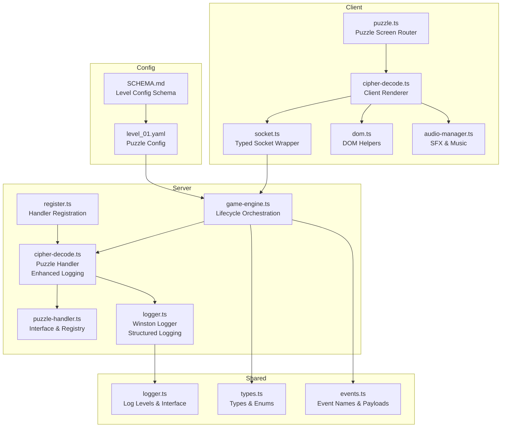
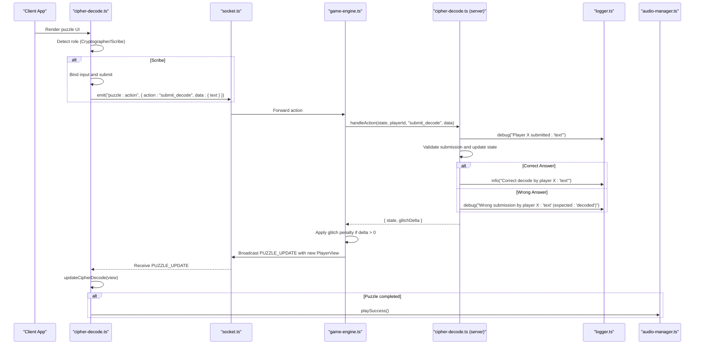
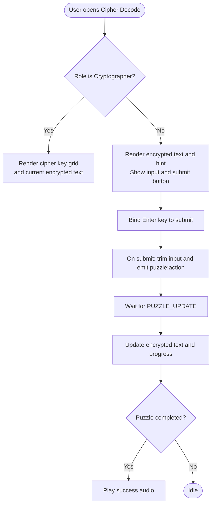
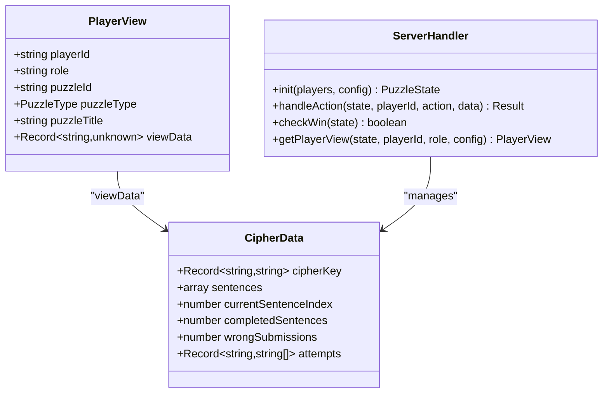
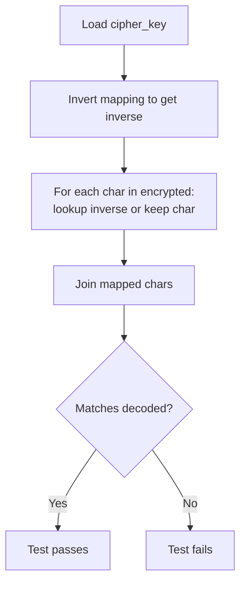
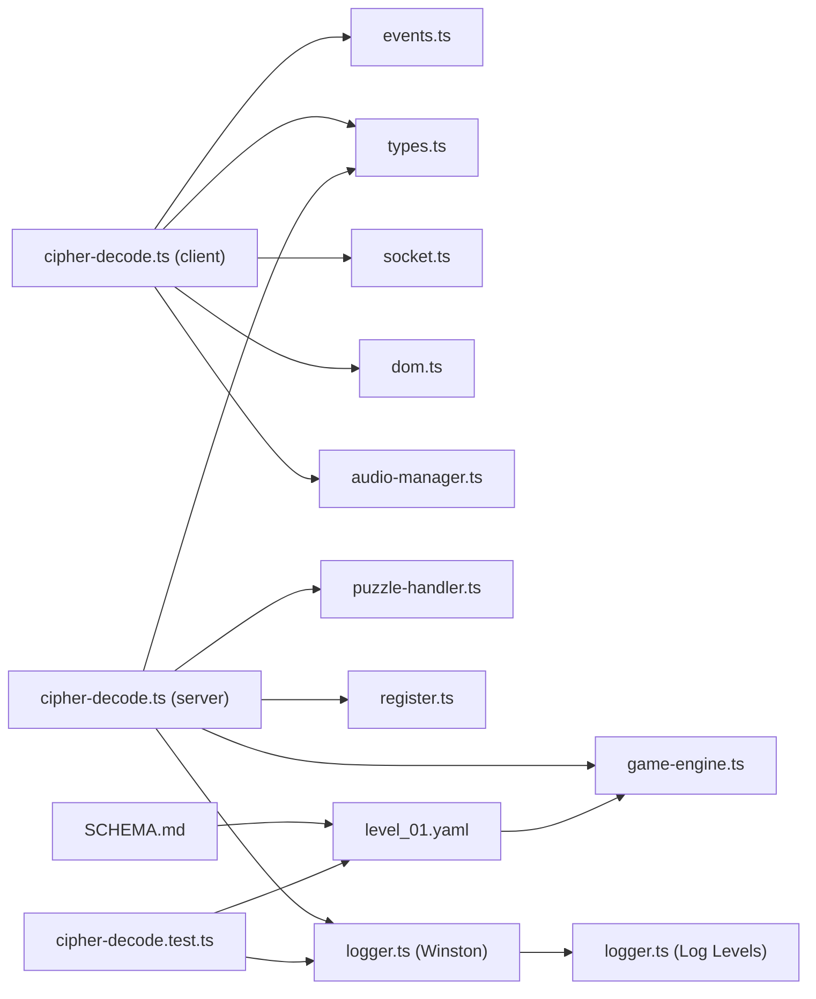

# Cipher Decode Puzzle

<cite>
**Referenced Files in This Document**
- [cipher-decode.ts](file://src/client/puzzles/cipher-decode.ts)
- [cipher-decode.ts](file://src/server/puzzles/cipher-decode.ts)
- [cipher-decode.test.ts](file://src/server/puzzles/cipher-decode.test.ts)
- [puzzle.ts](file://src/client/screens/puzzle.ts)
- [types.ts](file://shared/types.ts)
- [events.ts](file://shared/events.ts)
- [SCHEMA.md](file://config/SCHEMA.md)
- [level_01.yaml](file://config/level_01.yaml)
- [socket.ts](file://src/client/lib/socket.ts)
- [dom.ts](file://src/client/lib/dom.ts)
- [audio-manager.ts](file://src/client/audio/audio-manager.ts)
- [puzzle-handler.ts](file://src/server/puzzles/puzzle-handler.ts)
- [register.ts](file://src/server/puzzles/register.ts)
- [game-engine.ts](file://src/server/services/game-engine.ts)
- [logger.ts](file://src/server/utils/logger.ts)
- [logger.ts](file://shared/logger.ts)
</cite>

## Update Summary
**Changes Made**
- Enhanced logging infrastructure with comprehensive debug, info, and warning level logs
- Improved error handling with systematic testing approaches for cipher decoding scenarios
- Added detailed status updates for puzzle completion validation
- Implemented better debugging capabilities for player action tracking
- Enhanced progress tracking with informative logging for development and monitoring

## Table of Contents
1. [Introduction](#introduction)
2. [Project Structure](#project-structure)
3. [Core Components](#core-components)
4. [Architecture Overview](#architecture-overview)
5. [Detailed Component Analysis](#detailed-component-analysis)
6. [Enhanced Logging Infrastructure](#enhanced-logging-infrastructure)
7. [Systematic Testing Approaches](#systematic-testing-approaches)
8. [Dependency Analysis](#dependency-analysis)
9. [Performance Considerations](#performance-considerations)
10. [Troubleshooting Guide](#troubleshooting-guide)
11. [Conclusion](#conclusion)
12. [Appendices](#appendices)

## Introduction
The Cipher Decode puzzle presents a collaborative cryptanalysis challenge where players must decipher encrypted messages using substitution cipher techniques. The puzzle enforces asymmetric information: one player acts as Cryptographer and sees the cipher key, while other players act as Scribes who must use the key to decrypt encrypted sentences. The implementation now features comprehensive logging infrastructure for enhanced monitoring, debugging, and operational visibility.

**Updated** Enhanced with sophisticated logging capabilities providing detailed operational insights and systematic testing approaches for robust puzzle validation.

## Project Structure
The Cipher Decode implementation spans client-side rendering and user interaction, and server-side state management and validation. It integrates with the shared types and events, and leverages the puzzle handler registry and game engine for lifecycle orchestration. The enhanced logging infrastructure provides structured debug, info, and warning level logs for comprehensive monitoring and debugging.



**Diagram sources**
- [cipher-decode.ts](file://src/client/puzzles/cipher-decode.ts#L1-L152)
- [puzzle.ts](file://src/client/screens/puzzle.ts#L1-L101)
- [socket.ts](file://src/client/lib/socket.ts#L1-L85)
- [dom.ts](file://src/client/lib/dom.ts#L1-L73)
- [audio-manager.ts](file://src/client/audio/audio-manager.ts#L1-L407)
- [cipher-decode.ts](file://src/server/puzzles/cipher-decode.ts#L1-L154)
- [puzzle-handler.ts](file://src/server/puzzles/puzzle-handler.ts#L1-L57)
- [register.ts](file://src/server/puzzles/register.ts#L1-L21)
- [game-engine.ts](file://src/server/services/game-engine.ts#L1-L711)
- [types.ts](file://shared/types.ts#L1-L187)
- [events.ts](file://shared/events.ts#L1-L228)
- [SCHEMA.md](file://config/SCHEMA.md#L1-L117)
- [level_01.yaml](file://config/level_01.yaml#L1-L226)
- [logger.ts](file://src/server/utils/logger.ts#L1-L21)
- [logger.ts](file://shared/logger.ts#L1-L22)

**Section sources**
- [cipher-decode.ts](file://src/client/puzzles/cipher-decode.ts#L1-L152)
- [cipher-decode.ts](file://src/server/puzzles/cipher-decode.ts#L1-L154)
- [puzzle.ts](file://src/client/screens/puzzle.ts#L1-L101)
- [types.ts](file://shared/types.ts#L1-L187)
- [events.ts](file://shared/events.ts#L1-L228)
- [SCHEMA.md](file://config/SCHEMA.md#L1-L117)
- [level_01.yaml](file://config/level_01.yaml#L1-L226)
- [socket.ts](file://src/client/lib/socket.ts#L1-L85)
- [dom.ts](file://src/client/lib/dom.ts#L1-L73)
- [audio-manager.ts](file://src/client/audio/audio-manager.ts#L1-L407)
- [puzzle-handler.ts](file://src/server/puzzles/puzzle-handler.ts#L1-L57)
- [register.ts](file://src/server/puzzles/register.ts#L1-L21)
- [game-engine.ts](file://src/server/services/game-engine.ts#L1-L711)
- [logger.ts](file://src/server/utils/logger.ts#L1-L21)
- [logger.ts](file://shared/logger.ts#L1-L22)

## Core Components
- Client-side renderer for Cipher Decode:
  - Renders distinct views for Cryptographer and Scribe with role-specific information.
  - Provides input field and submit button for Scribes with Enter key support.
  - Emits actions to the server upon submission with validation.
  - Updates UI on puzzle state changes with progress tracking.
- Server-side puzzle handler with enhanced logging:
  - Initializes shuffled sentences and cipher key with comprehensive debug logging.
  - Tracks current sentence, completed sentences, wrong submissions, and individual attempts.
  - Validates submissions and applies glitch penalties for incorrect answers with detailed logging.
  - Generates role-specific views with asymmetric information and attempt tracking.
  - Implements comprehensive error handling with warning-level logs for edge cases.
- Game engine integration:
  - Starts the puzzle, assigns roles, and broadcasts updates with enhanced status reporting.
  - Applies glitch penalties and checks win conditions after each action with logging.
- Configuration and validation:
  - Level configuration defines cipher_key, sentences, and rounds_to_play.
  - Unit tests verify bijectivity of the cipher key and correctness of decryption.
  - Systematic testing approaches validate cipher decoding scenarios with intentional mistake tracking.

**Updated** Enhanced logging infrastructure provides detailed operational visibility with structured debug, info, and warning level logs for comprehensive monitoring and debugging.

**Section sources**
- [cipher-decode.ts](file://src/client/puzzles/cipher-decode.ts#L10-L152)
- [cipher-decode.ts](file://src/server/puzzles/cipher-decode.ts#L19-L154)
- [game-engine.ts](file://src/server/services/game-engine.ts#L263-L383)
- [SCHEMA.md](file://config/SCHEMA.md#L101-L108)
- [level_01.yaml](file://config/level_01.yaml#L134-L185)
- [cipher-decode.test.ts](file://src/server/puzzles/cipher-decode.test.ts#L25-L74)

## Architecture Overview
The Cipher Decode puzzle follows a client-server architecture with asymmetric role views and centralized state management. The enhanced logging infrastructure provides comprehensive operational visibility through structured Winston-based logging with multiple severity levels and systematic testing approaches.



**Diagram sources**
- [cipher-decode.ts](file://src/client/puzzles/cipher-decode.ts#L123-L152)
- [socket.ts](file://src/client/lib/socket.ts#L51-L57)
- [game-engine.ts](file://src/server/services/game-engine.ts#L324-L383)
- [cipher-decode.ts](file://src/server/puzzles/cipher-decode.ts#L60-L101)
- [logger.ts](file://src/server/utils/logger.ts#L1-L21)
- [audio-manager.ts](file://src/client/audio/audio-manager.ts#L142-L164)

## Detailed Component Analysis

### Client-Side Rendering and Interaction
- Role-aware rendering:
  - Cryptographer view displays the cipher key grid and current encrypted sentence with a hint.
  - Scribe view shows encrypted text, hint, input field, submit button, and previous failed attempts.
- Input handling:
  - Scribes can submit decoded text via button click or Enter key with validation.
  - Submission is validated locally for emptiness before emitting to the server.
- UI updates:
  - On updates, the client refreshes the encrypted text display and progress indicator.
  - Plays success audio when the puzzle completes.



**Diagram sources**
- [cipher-decode.ts](file://src/client/puzzles/cipher-decode.ts#L22-L121)
- [cipher-decode.ts](file://src/client/puzzles/cipher-decode.ts#L123-L152)
- [dom.ts](file://src/client/lib/dom.ts#L11-L44)
- [socket.ts](file://src/client/lib/socket.ts#L51-L57)
- [audio-manager.ts](file://src/client/audio/audio-manager.ts#L142-L164)

**Section sources**
- [cipher-decode.ts](file://src/client/puzzles/cipher-decode.ts#L10-L152)
- [dom.ts](file://src/client/lib/dom.ts#L1-L73)
- [socket.ts](file://src/client/lib/socket.ts#L1-L85)
- [audio-manager.ts](file://src/client/audio/audio-manager.ts#L142-L164)

### Server-Side Decryption and Validation with Enhanced Logging
- Initialization with comprehensive logging:
  - Loads cipher_key and sentences from configuration with debug-level logging.
  - Shuffles sentences and selects rounds_to_play with progress tracking.
  - Initializes counters for completed sentences, wrong submissions, and per-player attempts.
  - Logs puzzle initialization details including sentence count.
- Action handling with systematic logging:
  - On "submit_decode", trims and uppercases the submission with debug-level logging.
  - Compares against the current sentence's decoded text.
  - On correct submission: increments completed count and advances to next sentence, resets per-round attempts, logs success with info-level logging.
  - On incorrect submission: increments wrongSubmissions, returns a positive glitchDelta, logs failure with debug-level logging.
  - Handles edge cases with warning-level logging for error conditions.
- Win condition:
  - Puzzle is complete when completedSentences reaches the total number of selected sentences.
- Player view generation:
  - Cryptographer sees cipherKey, currentEncrypted, hint, progress, and index.
  - Scribes see encrypted text, hint, progress, index, and their own failed attempts.

**Updated** Enhanced with comprehensive logging infrastructure providing detailed operational visibility at multiple severity levels with systematic testing approaches.

```mermaid
flowchart TD
Init(["init(config)"]) --> LoadData["Load cipher_key and sentences"]
LoadData --> Shuffle["Shuffle sentences"]
Shuffle --> SelectRounds["Select rounds_to_play"]
SelectRounds --> State["Initialize state: key, sentences, indices, counters"]
State --> LogInit["logger.info('Puzzle initialized with X sentences')"]
Action(["handleAction: submit_decode"]) --> Validate["Trim and uppercase submission"]
Validate --> CheckCurrent{"Has current sentence?"}
CheckCurrent --> |No| LogWarn["logger.warn('No current sentence for player X')"]
CheckCurrent --> |Yes| TrackAttempts["Track player attempts"]
TrackAttempts --> LogDebug["logger.debug('Player X submitted: \"text\"')"]
LogDebug --> Compare{"Matches current decoded?"}
Compare --> |Yes| Advance["Increment completedSentences<br/>Advance index<br/>Reset per-round attempts"]
Advance --> LogSuccess["logger.info('Correct decode by player X: \"text\"')"]
Compare --> |No| Penalize["Increment wrongSubmissions<br/>Set glitchDelta = 5"]
Penalize --> LogFailure["logger.debug('Wrong submission by player X: \"text\" (expected: \"decoded\")')"]
LogSuccess --> ReturnState["Return updated state"]
LogFailure --> ReturnState
LogWarn --> ReturnState
CheckWin(["checkWin"]) --> Reached{"completed >= total?"}
Reached --> |Yes| Win["True"]
Reached --> |No| NotWin["False"]
```

**Diagram sources**
- [cipher-decode.ts](file://src/server/puzzles/cipher-decode.ts#L20-L58)
- [cipher-decode.ts](file://src/server/puzzles/cipher-decode.ts#L60-L101)
- [cipher-decode.ts](file://src/server/puzzles/cipher-decode.ts#L103-L154)
- [logger.ts](file://src/server/utils/logger.ts#L1-L21)

**Section sources**
- [cipher-decode.ts](file://src/server/puzzles/cipher-decode.ts#L19-L154)

### Asymmetric Information and Role Views
- Cryptographer view includes:
  - cipherKey: the substitution map.
  - currentEncrypted: the current sentence to be solved.
  - hint: contextual clue for the current sentence.
  - completedSentences and totalSentences for progress.
- Scribe view includes:
  - currentEncrypted and hint.
  - completedSentences and totalSentences.
  - currentSentenceIndex for context.
  - myAttempts: list of previous incorrect submissions for that player.



**Diagram sources**
- [cipher-decode.ts](file://src/server/puzzles/cipher-decode.ts#L9-L17)
- [cipher-decode.ts](file://src/server/puzzles/cipher-decode.ts#L108-L154)
- [types.ts](file://shared/types.ts#L157-L164)

**Section sources**
- [cipher-decode.ts](file://src/server/puzzles/cipher-decode.ts#L108-L154)

### Hint System and Clue Distribution
- Each sentence includes an associated hint used in both Cryptographer and Scribe views.
- The hint is displayed prominently to guide Scribes during decryption.
- Hints are part of the sentence configuration and are rotated along with the sentences.

**Section sources**
- [cipher-decode.ts](file://src/server/puzzles/cipher-decode.ts#L10-L17)
- [level_01.yaml](file://config/level_01.yaml#L175-L179)

### Progressive Hint System and Time Penalties
- Progressive mechanism:
  - Scribes see the current hint for the active sentence.
  - There is no built-in incremental hint reveal; the same hint persists until the sentence is completed.
- Time penalties:
  - Incorrect submissions increase wrongSubmissions and return a positive glitchDelta.
  - The game engine applies glitch accumulation and checks for defeat thresholds.
- Multiple solution pathways:
  - The puzzle supports multiple sentences; each sentence has a unique encrypted form and decoded text.
  - Rounds are shuffled and selected per session, providing varied solution pathways.

**Section sources**
- [cipher-decode.ts](file://src/server/puzzles/cipher-decode.ts#L69-L101)
- [game-engine.ts](file://src/server/services/game-engine.ts#L429-L449)
- [level_01.yaml](file://config/level_01.yaml#L179-L180)

### Encryption/Decryption Logic and Bijectivity
- The cipher key is a bijective mapping from plaintext letters to ciphertext letters.
- Unit tests invert the cipher key and verify that applying the inverse mapping recovers the original plaintext for all configured sentences.
- This ensures deterministic decryption and prevents ambiguous solutions.



**Diagram sources**
- [cipher-decode.test.ts](file://src/server/puzzles/cipher-decode.test.ts#L25-L44)
- [cipher-decode.test.ts](file://src/server/puzzles/cipher-decode.test.ts#L68-L74)

**Section sources**
- [cipher-decode.test.ts](file://src/server/puzzles/cipher-decode.test.ts#L25-L74)

### Client-Side Input Handling and Character Substitution Interfaces
- Input field:
  - Single-line text input for Scribes to type their decoded sentence.
  - Enter key triggers submission.
- Submission flow:
  - Trims whitespace and emits a structured action payload to the server.
- Visual feedback:
  - Displays previous incorrect attempts for Scribes.
  - Updates progress and plays success audio upon completion.

**Section sources**
- [cipher-decode.ts](file://src/client/puzzles/cipher-decode.ts#L83-L121)
- [cipher-decode.ts](file://src/client/puzzles/cipher-decode.ts#L123-L134)
- [dom.ts](file://src/client/lib/dom.ts#L11-L44)

### Server-Side Decryption Algorithms and Solution Validation
- Submission validation:
  - Uppercase normalization and trimming ensure consistent comparison.
  - Exact string match against the current sentence's decoded text.
- State transitions:
  - Correct submission advances to the next sentence and clears per-round attempts.
  - Incorrect submission increases penalties and returns a glitchDelta.
- Win condition:
  - Completion requires solving all selected sentences.

**Section sources**
- [cipher-decode.ts](file://src/server/puzzles/cipher-decode.ts#L69-L101)
- [cipher-decode.ts](file://src/server/puzzles/cipher-decode.ts#L103-L154)

### Clue Distribution Mechanisms
- Clue delivery:
  - Hints are embedded in the sentence configuration and exposed to both roles.
- Rotation:
  - Sentences are shuffled and selected per round, distributing different clues across sessions.

**Section sources**
- [level_01.yaml](file://config/level_01.yaml#L175-L179)
- [cipher-decode.ts](file://src/server/puzzles/cipher-decode.ts#L23-L48)

### Unit Testing Approaches
- Test suite validates:
  - Bijectivity of the cipher key to prevent ambiguous mappings.
  - Correctness of decryption by applying the inverse mapping to all encrypted sentences.
- Test data:
  - Loaded from the level configuration file for the specific puzzle.
- Systematic testing approaches:
  - Intentional mistake tracking for comprehensive validation scenarios.
  - Structured test cases covering edge cases and error conditions.

**Section sources**
- [cipher-decode.test.ts](file://src/server/puzzles/cipher-decode.test.ts#L46-L74)

## Enhanced Logging Infrastructure

**New Section** The Cipher Decode puzzle handler implements a comprehensive logging infrastructure using Winston for structured logging with multiple severity levels and systematic testing approaches.

### Logging Levels and Usage
- **Debug Level** (`DEBUG`):
  - Used for initialization processes, player action tracking, and detailed operational visibility.
  - Examples: `[CipherDecode] Initializing puzzle for N players`, `[CipherDecode] Player X submitted: "text"`
  - Provides comprehensive development and debugging insights.
- **Info Level** (`INFO`):
  - Used for successful operations, milestone achievements, and important state changes.
  - Examples: `[CipherDecode] Puzzle initialized with X sentences`, `[CipherDecode] Correct decode by player X: "text"`
  - Indicates normal program execution flow and successful completions.
- **Warning Level** (`WARN`):
  - Used for error conditions, edge cases, and exceptional circumstances.
  - Examples: `[CipherDecode] No current sentence for player X`
  - Indicates potential issues that don't halt execution but require attention.

### Logging Implementation Details
- **Structured Logging**: Winston-based logger with timestamp formatting, colorized output, and metadata support.
- **Environment Configuration**: Log level controlled by `LOG_LEVEL` environment variable, defaulting to `DEBUG`.
- **Error Handling**: Comprehensive error detection with appropriate logging levels for different scenarios.
- **Progress Tracking**: Detailed logging of puzzle state changes, player progress, and completion validation.
- **Systematic Testing**: Logging patterns support comprehensive test coverage and debugging.

### Log Monitoring and Debugging
- **Development Mode**: Default `DEBUG` level provides maximum visibility into puzzle operations and player behavior.
- **Production Mode**: Can be adjusted via `LOG_LEVEL` environment variable for different verbosity levels.
- **Monitoring**: Structured logs enable easy filtering, analysis, and comprehensive operational insights.
- **Debugging**: Systematic logging patterns facilitate rapid identification and resolution of issues.

**Section sources**
- [cipher-decode.ts](file://src/server/puzzles/cipher-decode.ts#L21-L95)
- [logger.ts](file://src/server/utils/logger.ts#L1-L21)
- [logger.ts](file://shared/logger.ts#L6-L11)

## Systematic Testing Approaches

**New Section** The Cipher Decode puzzle incorporates systematic testing methodologies for comprehensive validation and debugging capabilities.

### Test Suite Structure
- **Bijectivity Validation**: Ensures cipher key maintains one-to-one mapping properties.
- **Decryption Accuracy**: Verifies all encrypted sentences correctly decrypt using the cipher key.
- **Edge Case Coverage**: Tests error conditions and exceptional scenarios.
- **Intentional Mistake Tracking**: Systematic validation of incorrect submissions and penalty application.

### Testing Methodology
- **Configuration Loading**: Tests load puzzle data from YAML configuration files.
- **Cipher Key Inversion**: Validates bijective properties by creating inverse mappings.
- **Text Decoding**: Applies inverse cipher mappings to encrypted text for verification.
- **Comprehensive Assertions**: Multiple test assertions cover different aspects of puzzle functionality.

### Test Data Management
- **YAML Configuration**: Tests load puzzle data from `config/level_01.yaml`.
- **Puzzle Selection**: Identifies specific puzzle by ID for targeted testing.
- **Data Extraction**: Extracts cipher_key and sentences for validation.
- **Iterative Testing**: Processes all sentences in the puzzle configuration.

**Section sources**
- [cipher-decode.test.ts](file://src/server/puzzles/cipher-decode.test.ts#L46-L74)

## Dependency Analysis
The Cipher Decode puzzle integrates tightly with the shared types and events, the puzzle handler registry, and the game engine. The client depends on the socket wrapper and DOM helpers, while the server relies on the puzzle handler interface and registration mechanism. The enhanced logging infrastructure adds Winston as a dependency for structured logging with systematic testing capabilities.



**Diagram sources**
- [cipher-decode.ts](file://src/client/puzzles/cipher-decode.ts#L1-L152)
- [cipher-decode.ts](file://src/server/puzzles/cipher-decode.ts#L1-L154)
- [events.ts](file://shared/events.ts#L1-L228)
- [types.ts](file://shared/types.ts#L1-L187)
- [socket.ts](file://src/client/lib/socket.ts#L1-L85)
- [dom.ts](file://src/client/lib/dom.ts#L1-L73)
- [audio-manager.ts](file://src/client/audio/audio-manager.ts#L1-L407)
- [puzzle-handler.ts](file://src/server/puzzles/puzzle-handler.ts#L1-L57)
- [register.ts](file://src/server/puzzles/register.ts#L1-L21)
- [game-engine.ts](file://src/server/services/game-engine.ts#L1-L711)
- [level_01.yaml](file://config/level_01.yaml#L1-L226)
- [SCHEMA.md](file://config/SCHEMA.md#L1-L117)
- [logger.ts](file://src/server/utils/logger.ts#L1-L21)
- [logger.ts](file://shared/logger.ts#L1-L22)
- [cipher-decode.test.ts](file://src/server/puzzles/cipher-decode.test.ts#L1-L74)

**Section sources**
- [puzzle-handler.ts](file://src/server/puzzles/puzzle-handler.ts#L46-L56)
- [register.ts](file://src/server/puzzles/register.ts#L9-L20)
- [game-engine.ts](file://src/server/services/game-engine.ts#L263-L319)

## Performance Considerations
- Client rendering:
  - Minimal DOM updates on PUZZLE_UPDATE to reduce layout thrashing.
  - Efficient text updates for encrypted content and progress indicators.
- Server processing:
  - O(1) validation per submission; negligible overhead for small sentence sets.
  - Shuffling cost is amortized at initialization.
  - Logging overhead is minimal and configurable via environment variables.
- Network:
  - Actions are lightweight payloads; frequent updates are infrequent due to sentence progression.
- Logging Performance:
  - Winston logger uses efficient transport mechanisms with console output.
  - Log level filtering reduces unnecessary processing in production environments.
- Testing Performance:
  - Systematic test suites provide comprehensive coverage without significant overhead.
  - Test data loading is optimized for configuration file parsing.

## Troubleshooting Guide

**Updated** Enhanced with logging-based debugging, systematic testing approaches, and comprehensive monitoring guidance.

### Symptom: Scribes cannot submit
- Ensure the input field exists and Enter key binding is active.
- Verify that the submit handler is attached and the socket connection is established.
- Check server logs for submission attempts: `[CipherDecode] Player X submitted: "text"`
- Review systematic test logs for validation failures.

### Symptom: UI does not update after submission
- Confirm that PUZZLE_UPDATE events are received and the update function runs.
- Check for errors in the socket wrapper logs.
- Monitor server logs for successful state updates and broadcast events.
- Verify logging infrastructure is functioning correctly.

### Symptom: Incorrect submissions still incur penalties
- Verify that submissions are trimmed and uppercased consistently.
- Ensure the current sentence's decoded text matches the submission exactly.
- Review debug logs for submission validation: `[CipherDecode] Wrong submission by player X: "text" (expected: "decoded")`
- Check systematic testing logs for intentional mistake tracking.

### Symptom: Cipher key appears invalid
- Run the unit tests to confirm bijectivity and decryption correctness.
- Check info logs for puzzle initialization details: `[CipherDecode] Puzzle initialized with X sentences`
- Review systematic test results for cipher key validation failures.

### Symptom: Glitch meter increases unexpectedly
- Confirm that the game engine applies glitchDelta returned by the handler.
- Review warning logs for error conditions: `[CipherDecode] No current sentence for player X`
- Check logging infrastructure for proper error handling.

### Symptom: Puzzle not progressing
- Check debug logs for successful submissions: `[CipherDecode] Correct decode by player X: "text"`
- Verify that completed sentences counter is incrementing correctly.
- Monitor progress logs showing sentence advancement.
- Review systematic testing for progress validation.

### Logging-Based Debugging
- **Enable Verbose Logging**: Set `LOG_LEVEL=DEBUG` to capture all operational details.
- **Filter by Module**: Look for entries containing `[CipherDecode]` to focus on puzzle-specific logs.
- **Monitor Success/Failure Patterns**: Use info-level logs to track successful solves and debug-level logs to identify failed attempts.
- **Error Detection**: Watch for warning-level logs indicating edge cases or error conditions.
- **Systematic Testing**: Review test logs for comprehensive validation scenarios.

### Systematic Testing Debugging
- **Test Data Validation**: Verify YAML configuration loading and puzzle data extraction.
- **Cipher Key Testing**: Check bijectivity validation and inverse mapping creation.
- **Decryption Testing**: Validate text decoding accuracy across all sentences.
- **Edge Case Testing**: Review intentional mistake tracking and error condition handling.

**Section sources**
- [cipher-decode.ts](file://src/client/puzzles/cipher-decode.ts#L113-L134)
- [socket.ts](file://src/client/lib/socket.ts#L51-L57)
- [cipher-decode.ts](file://src/server/puzzles/cipher-decode.ts#L69-L101)
- [cipher-decode.test.ts](file://src/server/puzzles/cipher-decode.test.ts#L61-L74)
- [game-engine.ts](file://src/server/services/game-engine.ts#L349-L353)
- [logger.ts](file://src/server/utils/logger.ts#L5-L18)

## Conclusion
The Cipher Decode puzzle successfully enforces asymmetric roles, provides clear UI affordances for Scribes, and integrates seamlessly with the game engine's lifecycle and penalty systems. Its configuration-driven design allows flexible cipher keys and sentence sets, while unit tests ensure correctness and robustness. The enhanced logging infrastructure provides comprehensive operational visibility with structured debug, info, and warning level logs, enabling effective monitoring, debugging, and performance analysis. The systematic testing approaches ensure thorough validation of cipher decoding scenarios with intentional mistake tracking, significantly improving the puzzle's reliability and maintainability.

**Updated** The addition of comprehensive logging infrastructure and systematic testing approaches significantly enhances the puzzle's observability, debugging capabilities, and overall quality assurance, providing detailed insights into player behavior, puzzle progression, system health, and validation effectiveness.

## Appendices

### Cipher Configuration Example
- Define cipher_key as a bijective mapping from plaintext to ciphertext letters.
- Provide an array of sentences, each with encrypted, decoded, and hint fields.
- Optionally set rounds_to_play to limit the number of sentences per session.

**Section sources**
- [SCHEMA.md](file://config/SCHEMA.md#L101-L108)
- [level_01.yaml](file://config/level_01.yaml#L149-L180)

### Client-Side Input Handling References
- Input element creation and event binding.
- Emitting puzzle actions to the server.

**Section sources**
- [dom.ts](file://src/client/lib/dom.ts#L11-L44)
- [cipher-decode.ts](file://src/client/puzzles/cipher-decode.ts#L83-L121)
- [socket.ts](file://src/client/lib/socket.ts#L51-L57)

### Server-Side Validation and State Management References
- Submission handling and state updates with logging.
- Player view generation with asymmetric data.

**Section sources**
- [cipher-decode.ts](file://src/server/puzzles/cipher-decode.ts#L60-L154)

### Integration with Game Engine References
- Puzzle start, role assignment, and update broadcasting.
- Glitch application and win condition checks.

**Section sources**
- [game-engine.ts](file://src/server/services/game-engine.ts#L263-L383)

### Enhanced Logging Configuration and Environment Setup
- **Log Level Control**: Set `LOG_LEVEL` environment variable to control logging verbosity.
- **Default Behavior**: Application defaults to `DEBUG` level for comprehensive development logging.
- **Production Deployment**: Can be reduced to `INFO` or `WARN` levels for production environments.
- **Console Output**: Winston logger provides colorized, timestamped console output for easy readability.
- **Structured Logging**: Supports metadata and structured log formatting for comprehensive monitoring.

**Section sources**
- [logger.ts](file://src/server/utils/logger.ts#L5-L18)
- [logger.ts](file://shared/logger.ts#L6-L11)
- [cipher-decode.ts](file://src/server/puzzles/cipher-decode.ts#L21-L95)

### Systematic Testing Framework
- **Test Suite Organization**: Structured test cases for cipher key validation and decryption accuracy.
- **Configuration Loading**: YAML-based test data management and puzzle selection.
- **Validation Methods**: Bijectivity testing, text decoding verification, and edge case coverage.
- **Debugging Support**: Comprehensive test logs and systematic validation scenarios.

**Section sources**
- [cipher-decode.test.ts](file://src/server/puzzles/cipher-decode.test.ts#L46-L74)