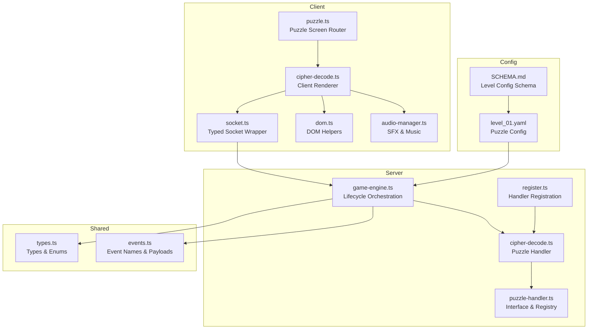
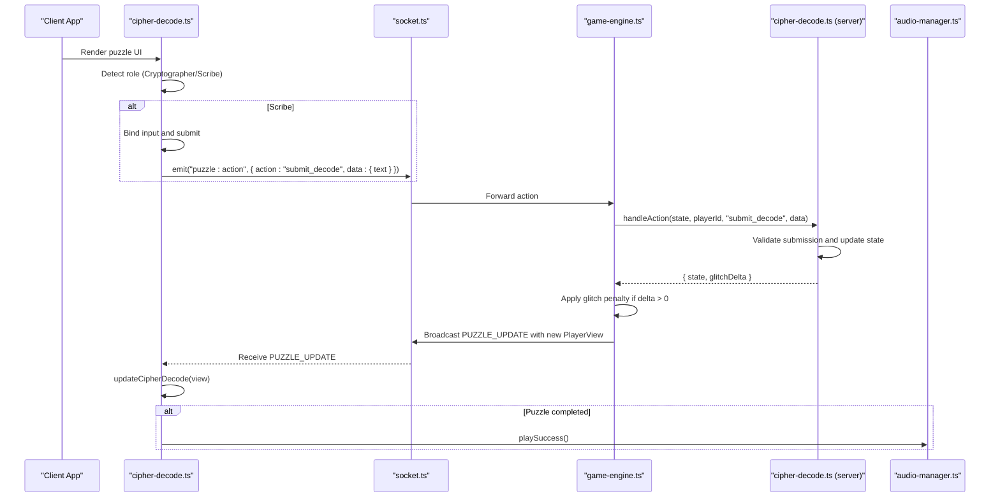
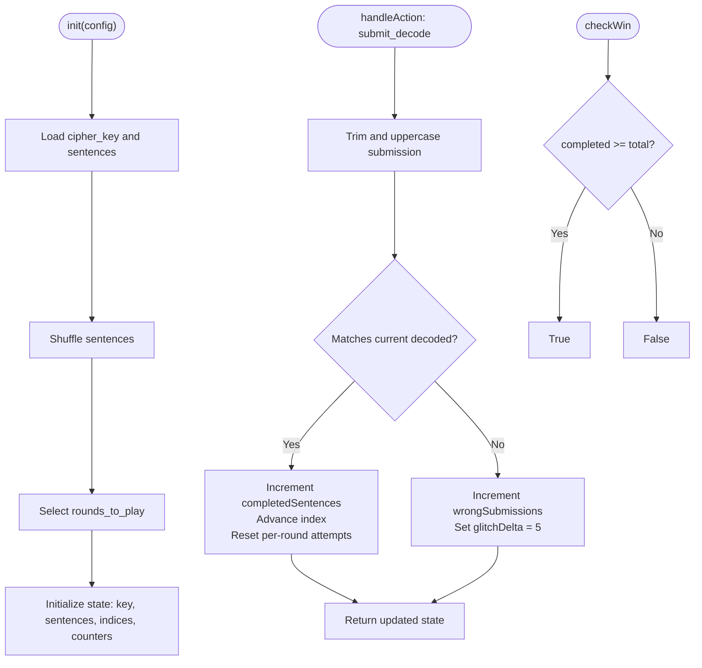
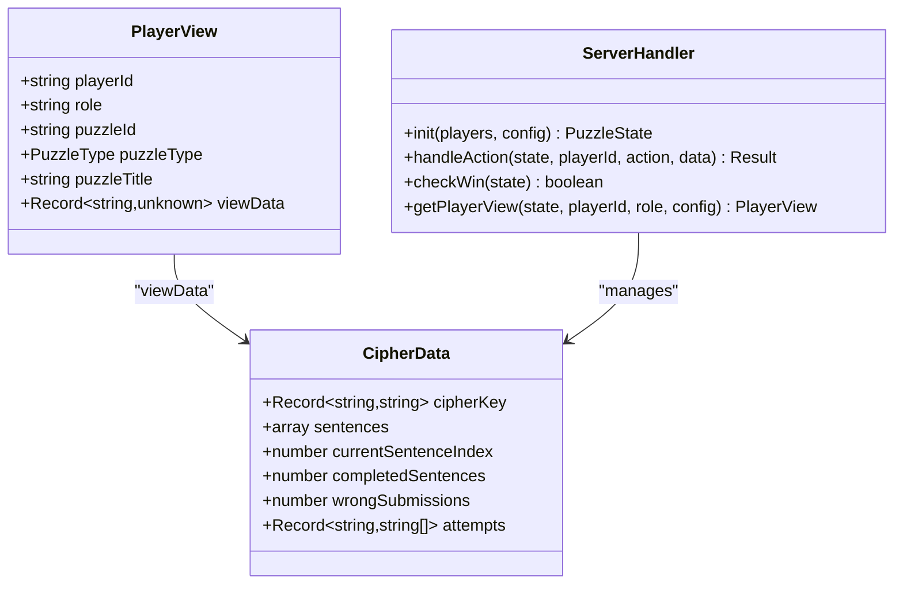
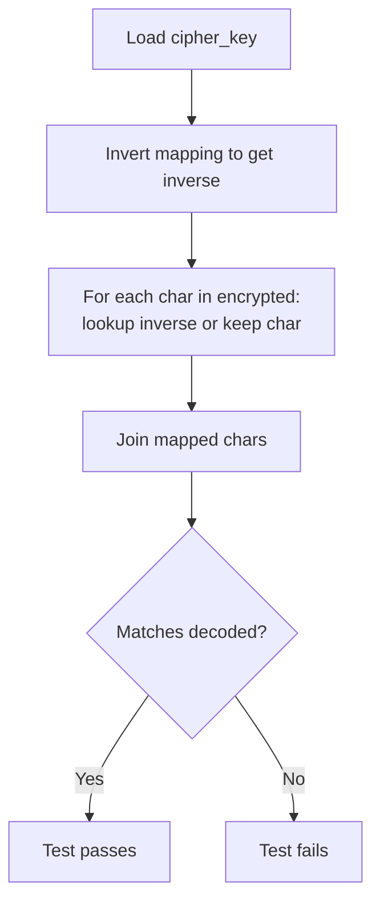
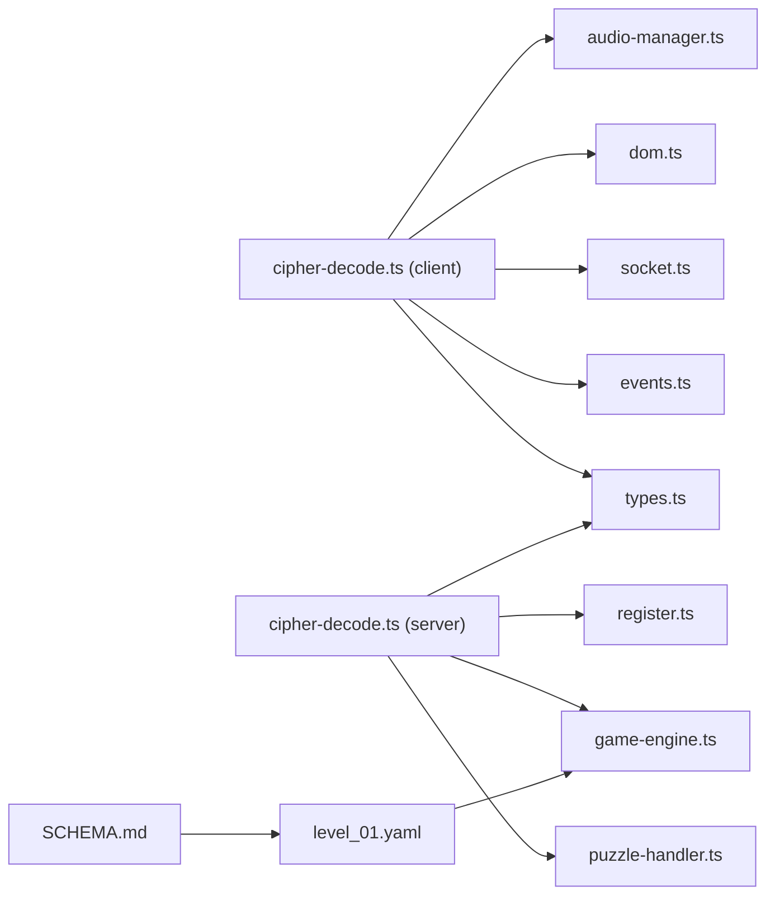

# Cipher Decode Puzzle

<cite>
**Referenced Files in This Document**
- [cipher-decode.ts](file://src/client/puzzles/cipher-decode.ts)
- [cipher-decode.ts](file://src/server/puzzles/cipher-decode.ts)
- [cipher-decode.test.ts](file://src/server/puzzles/cipher-decode.test.ts)
- [puzzle.ts](file://src/client/screens/puzzle.ts)
- [types.ts](file://shared/types.ts)
- [events.ts](file://shared/events.ts)
- [SCHEMA.md](file://config/SCHEMA.md)
- [level_01.yaml](file://config/level_01.yaml)
- [socket.ts](file://src/client/lib/socket.ts)
- [dom.ts](file://src/client/lib/dom.ts)
- [audio-manager.ts](file://src/client/audio/audio-manager.ts)
- [puzzle-handler.ts](file://src/server/puzzles/puzzle-handler.ts)
- [register.ts](file://src/server/puzzles/register.ts)
- [game-engine.ts](file://src/server/services/game-engine.ts)
</cite>

## Table of Contents
1. [Introduction](#introduction)
2. [Project Structure](#project-structure)
3. [Core Components](#core-components)
4. [Architecture Overview](#architecture-overview)
5. [Detailed Component Analysis](#detailed-component-analysis)
6. [Dependency Analysis](#dependency-analysis)
7. [Performance Considerations](#performance-considerations)
8. [Troubleshooting Guide](#troubleshooting-guide)
9. [Conclusion](#conclusion)
10. [Appendices](#appendices)

## Introduction
The Cipher Decode puzzle presents a collaborative cryptanalysis challenge. One player assumes the role of Cryptographer and is shown the cipher key, while other players act as Scribes and must use the key to decrypt a series of encrypted sentences. The puzzle enforces asymmetric information: the Cryptographer sees the cipher mapping and the current encrypted sentence, while Scribes see only the encrypted text and hints. Incorrect submissions trigger a time-based penalty via the glitch meter, encouraging collaboration and careful analysis.

## Project Structure
The Cipher Decode implementation spans client-side rendering and user interaction, and server-side state management and validation. It integrates with the shared types and events, and leverages the puzzle handler registry and game engine for lifecycle orchestration.

**Diagram sources**
- [cipher-decode.ts](file://src/client/puzzles/cipher-decode.ts#L1-L152)
- [puzzle.ts](file://src/client/screens/puzzle.ts#L1-L101)
- [socket.ts](file://src/client/lib/socket.ts#L1-L85)
- [dom.ts](file://src/client/lib/dom.ts#L1-L73)
- [audio-manager.ts](file://src/client/audio/audio-manager.ts#L1-L407)
- [cipher-decode.ts](file://src/server/puzzles/cipher-decode.ts#L1-L142)
- [puzzle-handler.ts](file://src/server/puzzles/puzzle-handler.ts#L1-L57)
- [register.ts](file://src/server/puzzles/register.ts#L1-L21)
- [game-engine.ts](file://src/server/services/game-engine.ts#L1-L711)
- [types.ts](file://shared/types.ts#L1-L187)
- [events.ts](file://shared/events.ts#L1-L228)
- [SCHEMA.md](file://config/SCHEMA.md#L1-L117)
- [level_01.yaml](file://config/level_01.yaml#L1-L226)

**Section sources**
- [cipher-decode.ts](file://src/client/puzzles/cipher-decode.ts#L1-L152)
- [cipher-decode.ts](file://src/server/puzzles/cipher-decode.ts#L1-L142)
- [puzzle.ts](file://src/client/screens/puzzle.ts#L1-L101)
- [types.ts](file://shared/types.ts#L1-L187)
- [events.ts](file://shared/events.ts#L1-L228)
- [SCHEMA.md](file://config/SCHEMA.md#L1-L117)
- [level_01.yaml](file://config/level_01.yaml#L1-L226)
- [socket.ts](file://src/client/lib/socket.ts#L1-L85)
- [dom.ts](file://src/client/lib/dom.ts#L1-L73)
- [audio-manager.ts](file://src/client/audio/audio-manager.ts#L1-L407)
- [puzzle-handler.ts](file://src/server/puzzles/puzzle-handler.ts#L1-L57)
- [register.ts](file://src/server/puzzles/register.ts#L1-L21)
- [game-engine.ts](file://src/server/services/game-engine.ts#L1-L711)

## Core Components
- Client-side renderer for Cipher Decode:
  - Renders distinct views for Cryptographer and Scribe.
  - Provides an input field and submit button for Scribes.
  - Emits actions to the server upon submission.
  - Updates the UI on puzzle state changes.
- Server-side puzzle handler:
  - Initializes shuffled sentences and cipher key.
  - Tracks current sentence, completed sentences, wrong submissions, and individual attempts.
  - Validates submissions and applies glitch penalties for incorrect answers.
  - Generates role-specific views with asymmetric information.
- Game engine integration:
  - Starts the puzzle, assigns roles, and broadcasts updates.
  - Applies glitch penalties and checks win conditions after each action.
- Configuration and validation:
  - Level configuration defines cipher_key, sentences, and rounds_to_play.
  - Unit tests verify bijectivity of the cipher key and correctness of decryption.

**Section sources**
- [cipher-decode.ts](file://src/client/puzzles/cipher-decode.ts#L10-L152)
- [cipher-decode.ts](file://src/server/puzzles/cipher-decode.ts#L18-L142)
- [game-engine.ts](file://src/server/services/game-engine.ts#L263-L383)
- [SCHEMA.md](file://config/SCHEMA.md#L101-L108)
- [level_01.yaml](file://config/level_01.yaml#L134-L185)
- [cipher-decode.test.ts](file://src/server/puzzles/cipher-decode.test.ts#L25-L74)

## Architecture Overview
The Cipher Decode puzzle follows a client-server architecture with asymmetric role views and centralized state management.

**Diagram sources**
- [cipher-decode.ts](file://src/client/puzzles/cipher-decode.ts#L123-L152)
- [socket.ts](file://src/client/lib/socket.ts#L51-L57)
- [game-engine.ts](file://src/server/services/game-engine.ts#L324-L383)
- [cipher-decode.ts](file://src/server/puzzles/cipher-decode.ts#L55-L89)
- [audio-manager.ts](file://src/client/audio/audio-manager.ts#L142-L164)

## Detailed Component Analysis

### Client-Side Rendering and Interaction
- Role-aware rendering:
  - Cryptographer view displays the cipher key grid and current encrypted sentence with a hint.
  - Scribe view shows encrypted text, hint, input field, submit button, and previous failed attempts.
- Input handling:
  - Scribes can submit decoded text via button click or Enter key.
  - Submission is validated locally for emptiness before emitting to the server.
- UI updates:
  - On updates, the client refreshes the encrypted text display and progress indicator.
  - Plays success audio when the puzzle completes.

**Diagram sources**
- [cipher-decode.ts](file://src/client/puzzles/cipher-decode.ts#L22-L121)
- [cipher-decode.ts](file://src/client/puzzles/cipher-decode.ts#L123-L152)
- [dom.ts](file://src/client/lib/dom.ts#L11-L44)
- [socket.ts](file://src/client/lib/socket.ts#L51-L57)
- [audio-manager.ts](file://src/client/audio/audio-manager.ts#L142-L164)

**Section sources**
- [cipher-decode.ts](file://src/client/puzzles/cipher-decode.ts#L10-L152)
- [dom.ts](file://src/client/lib/dom.ts#L1-L73)
- [socket.ts](file://src/client/lib/socket.ts#L1-L85)
- [audio-manager.ts](file://src/client/audio/audio-manager.ts#L142-L164)

### Server-Side Decryption and Validation
- Initialization:
  - Loads cipher_key and sentences from configuration.
  - Shuffles sentences and selects rounds_to_play.
  - Initializes counters for completed sentences, wrong submissions, and per-player attempts.
- Action handling:
  - On "submit_decode", trims and uppercases the submission.
  - Compares against the current sentence’s decoded text.
  - On correct submission: increments completed count and advances to next sentence, resets per-round attempts.
  - On incorrect submission: increments wrongSubmissions and returns a positive glitchDelta.
- Win condition:
  - Puzzle is complete when completedSentences reaches the total number of selected sentences.
- Player view generation:
  - Cryptographer sees cipherKey, currentEncrypted, hint, progress, and index.
  - Scribes see encrypted text, hint, progress, index, and their own failed attempts.

**Diagram sources**
- [cipher-decode.ts](file://src/server/puzzles/cipher-decode.ts#L19-L53)
- [cipher-decode.ts](file://src/server/puzzles/cipher-decode.ts#L55-L89)
- [cipher-decode.ts](file://src/server/puzzles/cipher-decode.ts#L91-L94)

**Section sources**
- [cipher-decode.ts](file://src/server/puzzles/cipher-decode.ts#L18-L142)

### Asymmetric Information and Role Views
- Cryptographer view includes:
  - cipherKey: the substitution map.
  - currentEncrypted: the current sentence to be solved.
  - hint: contextual clue for the current sentence.
  - completedSentences and totalSentences for progress.
- Scribe view includes:
  - currentEncrypted and hint.
  - completedSentences and totalSentences.
  - currentSentenceIndex for context.
  - myAttempts: list of previous incorrect submissions for that player.

**Diagram sources**
- [cipher-decode.ts](file://src/server/puzzles/cipher-decode.ts#L9-L16)
- [cipher-decode.ts](file://src/server/puzzles/cipher-decode.ts#L96-L140)
- [types.ts](file://shared/types.ts#L157-L164)

**Section sources**
- [cipher-decode.ts](file://src/server/puzzles/cipher-decode.ts#L96-L140)

### Hint System and Clue Distribution
- Each sentence includes an associated hint used in both Cryptographer and Scribe views.
- The hint is displayed prominently to guide Scribes during decryption.
- Hints are part of the sentence configuration and are rotated along with the sentences.

**Section sources**
- [cipher-decode.ts](file://src/server/puzzles/cipher-decode.ts#L10-L16)
- [level_01.yaml](file://config/level_01.yaml#L175-L179)

### Progressive Hint System and Time Penalties
- Progressive mechanism:
  - Scribes see the current hint for the active sentence.
  - There is no built-in incremental hint reveal; the same hint persists until the sentence is completed.
- Time penalties:
  - Incorrect submissions increase wrongSubmissions and return a positive glitchDelta.
  - The game engine applies glitch accumulation and checks for defeat thresholds.
- Multiple solution pathways:
  - The puzzle supports multiple sentences; each sentence has a unique encrypted form and decoded text.
  - Rounds are shuffled and selected per session, providing varied solution pathways.

**Section sources**
- [cipher-decode.ts](file://src/server/puzzles/cipher-decode.ts#L64-L86)
- [game-engine.ts](file://src/server/services/game-engine.ts#L429-L449)
- [level_01.yaml](file://config/level_01.yaml#L179-L180)

### Encryption/Decryption Logic and Bijectivity
- The cipher key is a bijective mapping from plaintext letters to ciphertext letters.
- Unit tests invert the cipher key and verify that applying the inverse mapping recovers the original plaintext for all configured sentences.
- This ensures deterministic decryption and prevents ambiguous solutions.

**Diagram sources**
- [cipher-decode.test.ts](file://src/server/puzzles/cipher-decode.test.ts#L25-L44)
- [cipher-decode.test.ts](file://src/server/puzzles/cipher-decode.test.ts#L68-L73)

**Section sources**
- [cipher-decode.test.ts](file://src/server/puzzles/cipher-decode.test.ts#L25-L74)

### Client-Side Input Handling and Character Substitution Interfaces
- Input field:
  - Single-line text input for Scribes to type their decoded sentence.
  - Enter key triggers submission.
- Submission flow:
  - Trims whitespace and emits a structured action payload to the server.
- Visual feedback:
  - Displays previous incorrect attempts for Scribes.
  - Updates progress and plays success audio upon completion.

**Section sources**
- [cipher-decode.ts](file://src/client/puzzles/cipher-decode.ts#L83-L121)
- [cipher-decode.ts](file://src/client/puzzles/cipher-decode.ts#L123-L134)
- [dom.ts](file://src/client/lib/dom.ts#L11-L44)

### Server-Side Decryption Algorithms and Solution Validation
- Submission validation:
  - Uppercase normalization and trimming ensure consistent comparison.
  - Exact string match against the current sentence’s decoded text.
- State transitions:
  - Correct submission advances to the next sentence and clears per-round attempts.
  - Incorrect submission increases penalties and returns a glitchDelta.
- Win condition:
  - Completion requires solving all selected sentences.

**Section sources**
- [cipher-decode.ts](file://src/server/puzzles/cipher-decode.ts#L64-L89)
- [cipher-decode.ts](file://src/server/puzzles/cipher-decode.ts#L91-L94)

### Clue Distribution Mechanisms
- Clue delivery:
  - Hints are embedded in the sentence configuration and exposed to both roles.
- Rotation:
  - Sentences are shuffled and selected per round, distributing different clues across sessions.

**Section sources**
- [level_01.yaml](file://config/level_01.yaml#L175-L179)
- [cipher-decode.ts](file://src/server/puzzles/cipher-decode.ts#L26-L36)

### Unit Testing Approaches
- Test suite validates:
  - Bijectivity of the cipher key to prevent ambiguous mappings.
  - Correctness of decryption by applying the inverse mapping to all encrypted sentences.
- Test data:
  - Loaded from the level configuration file for the specific puzzle.

**Section sources**
- [cipher-decode.test.ts](file://src/server/puzzles/cipher-decode.test.ts#L46-L74)

## Dependency Analysis
The Cipher Decode puzzle integrates tightly with the shared types and events, the puzzle handler registry, and the game engine. The client depends on the socket wrapper and DOM helpers, while the server relies on the puzzle handler interface and registration mechanism.

**Diagram sources**
- [cipher-decode.ts](file://src/client/puzzles/cipher-decode.ts#L1-L152)
- [cipher-decode.ts](file://src/server/puzzles/cipher-decode.ts#L1-L142)
- [events.ts](file://shared/events.ts#L1-L228)
- [types.ts](file://shared/types.ts#L1-L187)
- [socket.ts](file://src/client/lib/socket.ts#L1-L85)
- [dom.ts](file://src/client/lib/dom.ts#L1-L73)
- [audio-manager.ts](file://src/client/audio/audio-manager.ts#L1-L407)
- [puzzle-handler.ts](file://src/server/puzzles/puzzle-handler.ts#L1-L57)
- [register.ts](file://src/server/puzzles/register.ts#L1-L21)
- [game-engine.ts](file://src/server/services/game-engine.ts#L1-L711)
- [level_01.yaml](file://config/level_01.yaml#L1-L226)
- [SCHEMA.md](file://config/SCHEMA.md#L1-L117)

**Section sources**
- [puzzle-handler.ts](file://src/server/puzzles/puzzle-handler.ts#L46-L56)
- [register.ts](file://src/server/puzzles/register.ts#L9-L20)
- [game-engine.ts](file://src/server/services/game-engine.ts#L263-L319)

## Performance Considerations
- Client rendering:
  - Minimal DOM updates on PUZZLE_UPDATE to reduce layout thrashing.
  - Efficient text updates for encrypted content and progress indicators.
- Server processing:
  - O(1) validation per submission; negligible overhead for small sentence sets.
  - Shuffling cost is amortized at initialization.
- Network:
  - Actions are lightweight payloads; frequent updates are infrequent due to sentence progression.

## Troubleshooting Guide
- Symptom: Scribes cannot submit
  - Ensure the input field exists and Enter key binding is active.
  - Verify that the submit handler is attached and the socket connection is established.
- Symptom: UI does not update after submission
  - Confirm that PUZZLE_UPDATE events are received and the update function runs.
  - Check for errors in the socket wrapper logs.
- Symptom: Incorrect submissions still incur penalties
  - Verify that submissions are trimmed and uppercased consistently.
  - Ensure the current sentence’s decoded text matches the submission exactly.
- Symptom: Cipher key appears invalid
  - Run the unit tests to confirm bijectivity and decryption correctness.
- Symptom: Glitch meter increases unexpectedly
  - Confirm that the game engine applies glitchDelta returned by the handler.

**Section sources**
- [cipher-decode.ts](file://src/client/puzzles/cipher-decode.ts#L113-L134)
- [socket.ts](file://src/client/lib/socket.ts#L51-L57)
- [cipher-decode.ts](file://src/server/puzzles/cipher-decode.ts#L64-L86)
- [cipher-decode.test.ts](file://src/server/puzzles/cipher-decode.test.ts#L61-L73)
- [game-engine.ts](file://src/server/services/game-engine.ts#L349-L353)

## Conclusion
The Cipher Decode puzzle successfully enforces asymmetric roles, provides clear UI affordances for Scribes, and integrates seamlessly with the game engine’s lifecycle and penalty systems. Its configuration-driven design allows flexible cipher keys and sentence sets, while unit tests ensure correctness and robustness.

## Appendices

### Cipher Configuration Example
- Define cipher_key as a bijective mapping from plaintext to ciphertext letters.
- Provide an array of sentences, each with encrypted, decoded, and hint fields.
- Optionally set rounds_to_play to limit the number of sentences per session.

**Section sources**
- [SCHEMA.md](file://config/SCHEMA.md#L101-L108)
- [level_01.yaml](file://config/level_01.yaml#L149-L180)

### Client-Side Input Handling References
- Input element creation and event binding.
- Emitting puzzle actions to the server.

**Section sources**
- [dom.ts](file://src/client/lib/dom.ts#L11-L44)
- [cipher-decode.ts](file://src/client/puzzles/cipher-decode.ts#L83-L121)
- [socket.ts](file://src/client/lib/socket.ts#L51-L57)

### Server-Side Validation and State Management References
- Submission handling and state updates.
- Player view generation with asymmetric data.

**Section sources**
- [cipher-decode.ts](file://src/server/puzzles/cipher-decode.ts#L55-L140)

### Integration with Game Engine References
- Puzzle start, role assignment, and update broadcasting.
- Glitch application and win condition checks.

**Section sources**
- [game-engine.ts](file://src/server/services/game-engine.ts#L263-L383)