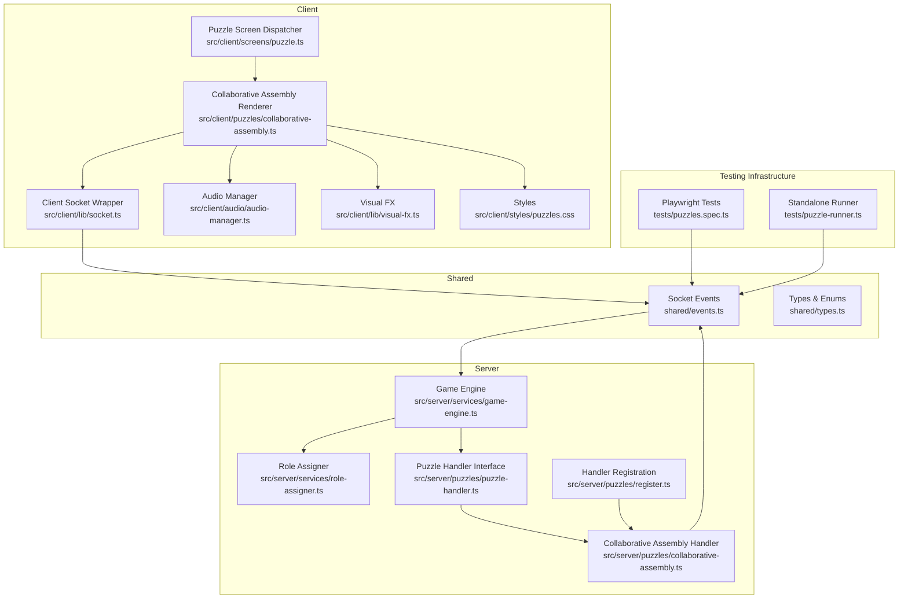
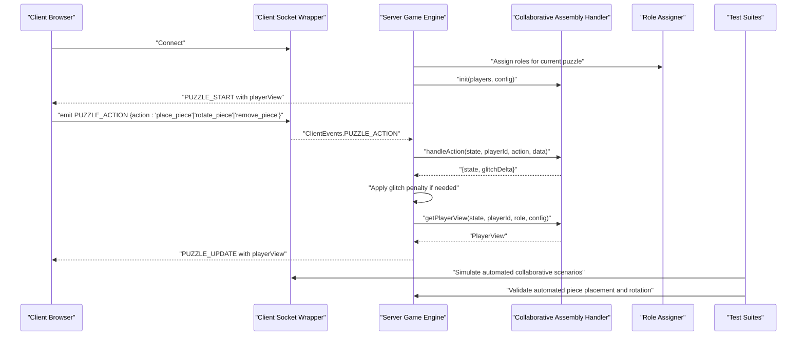
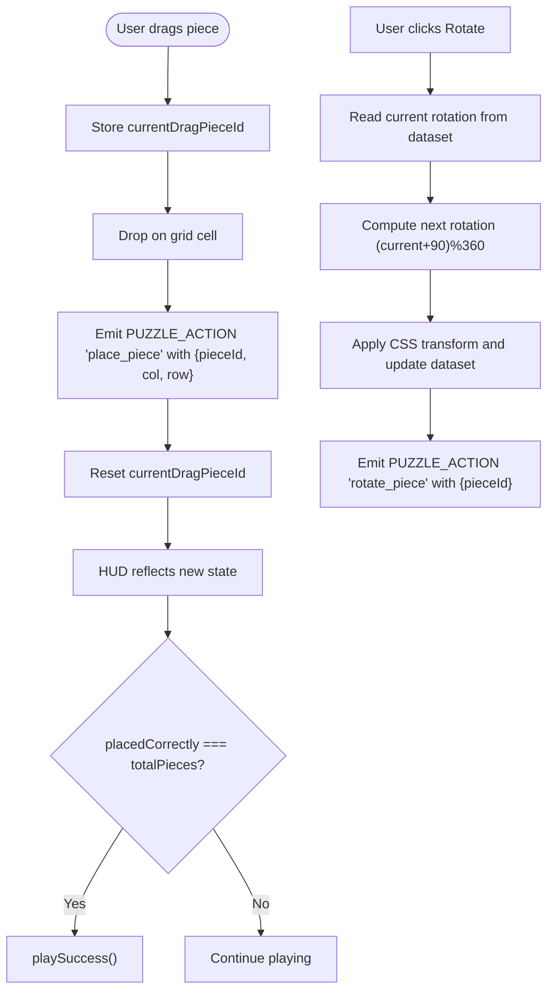
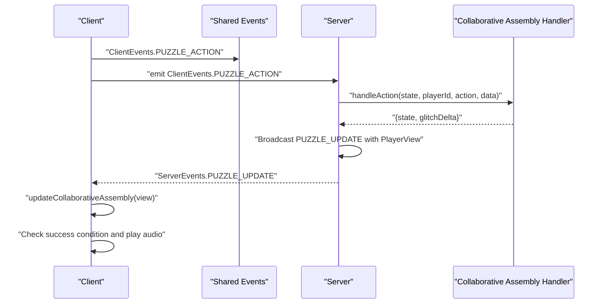
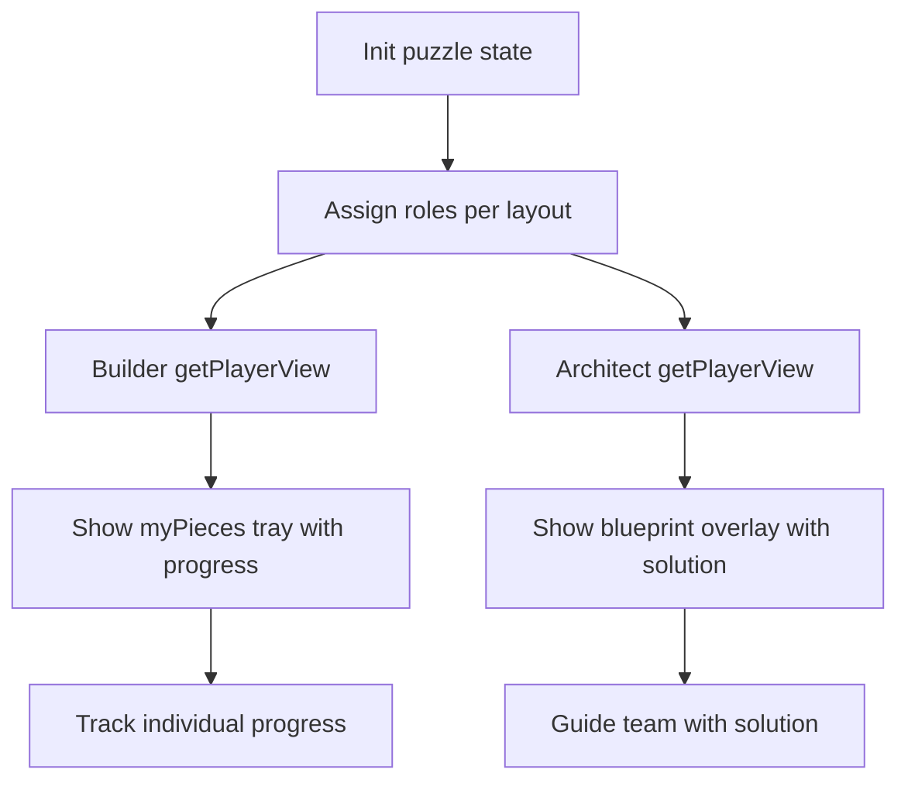
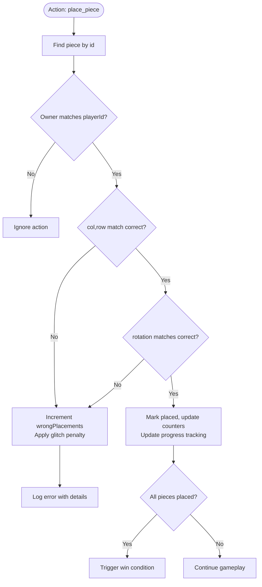
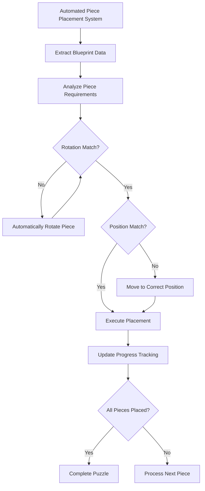
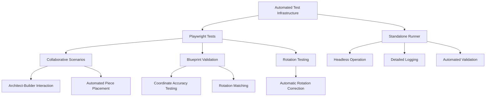
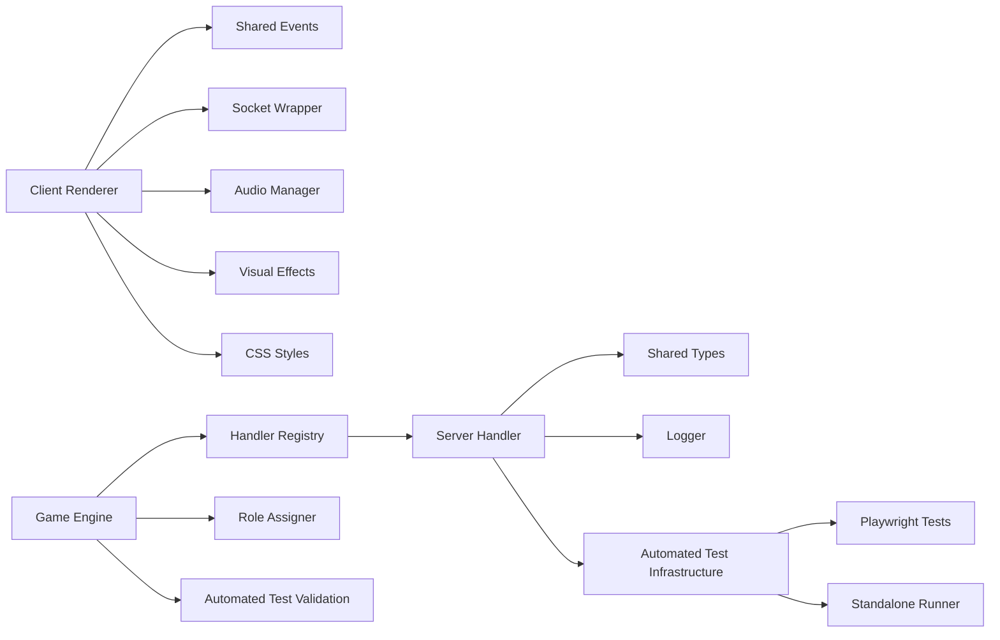

# Collaborative Assembly Puzzle

<cite>
**Referenced Files in This Document**
- [collaborative-assembly.ts](file://src/client/puzzles/collaborative-assembly.ts)
- [collaborative-assembly.ts](file://src/server/puzzles/collaborative-assembly.ts)
- [puzzle-handler.ts](file://src/server/puzzles/puzzle-handler.ts)
- [register.ts](file://src/server/puzzles/register.ts)
- [socket.ts](file://src/client/lib/socket.ts)
- [events.ts](file://shared/events.ts)
- [types.ts](file://shared/types.ts)
- [puzzle.ts](file://src/client/screens/puzzle.ts)
- [role-assigner.ts](file://src/server/services/role-assigner.ts)
- [game-engine.ts](file://src/server/services/game-engine.ts)
- [SCHEMA.md](file://config/SCHEMA.md)
- [ARCHITECTURE.md](file://ARCHITECTURE.md)
- [README.md](file://README.md)
- [puzzles.spec.ts](file://tests/puzzles.spec.ts)
- [puzzle-runner.ts](file://tests/puzzle-runner.ts)
- [audio-manager.ts](file://src/client/audio/audio-manager.ts)
- [visual-fx.ts](file://src/client/lib/visual-fx.ts)
- [results.ts](file://src/client/screens/results.ts)
- [puzzles.css](file://src/client/styles/puzzles.css)
</cite>

## Update Summary
**Changes Made**
- Enhanced collaborative assembly puzzle with complete automated piece placement system
- Implemented automatic rotation correction to match blueprint specifications
- Added precise coordinate placement according to blueprint coordinates
- Integrated comprehensive automated testing infrastructure for collaborative building scenarios
- Strengthened client-server synchronization with automated validation systems

## Table of Contents
1. [Introduction](#introduction)
2. [Project Structure](#project-structure)
3. [Core Components](#core-components)
4. [Architecture Overview](#architecture-overview)
5. [Detailed Component Analysis](#detailed-component-analysis)
6. [Enhanced Automated Piece Placement System](#enhanced-automated-piece-placement-system)
7. [Comprehensive Testing Infrastructure](#comprehensive-testing-infrastructure)
8. [Dependency Analysis](#dependency-analysis)
9. [Performance Considerations](#performance-considerations)
10. [Troubleshooting Guide](#troubleshooting-guide)
11. [Conclusion](#conclusion)
12. [Appendices](#appendices)

## Introduction
This document explains the collaborative assembly puzzle implementation, focusing on how players assemble an object from multiple components using drag-and-drop mechanics, 3D-like rotation, and snap-to-grid behavior. The puzzle has been enhanced with a complete automated piece placement system that includes automatic rotation to correct orientations and precise coordinate placement according to blueprint specifications. The system features comprehensive testing infrastructure with both Playwright and standalone test runners that validate collaborative building scenarios with automated piece placement validation.

**Updated** Enhanced with complete automated piece placement system, automatic rotation correction, and comprehensive testing infrastructure for collaborative building scenarios.

## Project Structure
The collaborative assembly puzzle spans client and server layers with enhanced automated testing infrastructure:
- Client-side renderer and user interactions for drag-and-drop, rotation, and grid display with enhanced visual feedback
- Server-side puzzle handler managing state, validation, and role-specific views with automated piece placement validation
- Comprehensive test suites validating automated collaborative building scenarios with blueprint-driven piece placement
- Shared types and events defining the contract between client and server with enhanced validation
- Game engine orchestrating puzzle lifecycle and broadcasting updates with automated testing support
- Role assignment service distributing players into roles per puzzle layout with automated testing coordination



**Diagram sources**
- [socket.ts](file://src/client/lib/socket.ts#L1-L85)
- [collaborative-assembly.ts](file://src/client/puzzles/collaborative-assembly.ts#L1-L183)
- [puzzle.ts](file://src/client/screens/puzzle.ts#L1-L101)
- [audio-manager.ts](file://src/client/audio/audio-manager.ts#L1-L407)
- [visual-fx.ts](file://src/client/lib/visual-fx.ts#L49-L111)
- [puzzles.spec.ts](file://tests/puzzles.spec.ts#L1-L615)
- [puzzle-runner.ts](file://tests/puzzle-runner.ts#L1-L744)
- [events.ts](file://shared/events.ts#L1-L228)
- [game-engine.ts](file://src/server/services/game-engine.ts#L1-L400)
- [role-assigner.ts](file://src/server/services/role-assigner.ts#L1-L78)
- [puzzle-handler.ts](file://src/server/puzzles/puzzle-handler.ts#L1-L57)
- [collaborative-assembly.ts](file://src/server/puzzles/collaborative-assembly.ts#L1-L218)
- [register.ts](file://src/server/puzzles/register.ts#L1-L21)
- [puzzles.css](file://src/client/styles/puzzles.css#L404-L534)

**Section sources**
- [ARCHITECTURE.md](file://ARCHITECTURE.md#L1-L202)
- [README.md](file://README.md#L1-L132)

## Core Components
- Client-side collaborative assembly renderer: renders the grid, player pieces tray, handles drag-and-drop, rotation, and progress display with enhanced error feedback and automated piece placement visualization
- Server-side collaborative assembly handler: initializes state, validates placements with automated blueprint-driven validation, rotates pieces, removes pieces, checks win conditions, and generates role-specific views with comprehensive testing support
- Comprehensive automated testing infrastructure: Playwright and standalone test runners validating automated collaborative building scenarios with blueprint-driven piece placement and rotation correction
- Socket event contract: typed client-server events for puzzle actions and updates with enhanced validation and automated testing support
- Game engine orchestration: assigns roles, starts puzzles, processes actions, broadcasts updates, checks win conditions, and manages glitch tracking with automated testing integration
- Role assigner: distributes players into roles per puzzle layout with automated testing coordination

Key responsibilities:
- Client: user interactions, local rotation state, grid rendering, progress feedback, audio/visual error indicators, automated piece placement visualization
- Server: authoritative state, ownership checks, correctness validation, role visibility, win detection, glitch penalty management, automated blueprint validation
- Testing: comprehensive validation of automated collaborative scenarios, error handling, progress tracking, and blueprint-driven piece placement

**Updated** Enhanced with complete automated piece placement system and comprehensive testing infrastructure.

**Section sources**
- [collaborative-assembly.ts](file://src/client/puzzles/collaborative-assembly.ts#L1-L183)
- [collaborative-assembly.ts](file://src/server/puzzles/collaborative-assembly.ts#L1-L218)
- [events.ts](file://shared/events.ts#L1-L228)
- [game-engine.ts](file://src/server/services/game-engine.ts#L260-L383)
- [role-assigner.ts](file://src/server/services/role-assigner.ts#L1-L78)
- [puzzles.spec.ts](file://tests/puzzles.spec.ts#L534-L615)
- [puzzle-runner.ts](file://tests/puzzle-runner.ts#L422-L492)

## Architecture Overview
The collaborative assembly puzzle follows a config-first, pluggable architecture with enhanced automated testing infrastructure:
- Puzzle type is defined in YAML and registered in the server's handler registry
- The game engine assigns roles per puzzle and initializes the puzzle state via the registered handler
- Clients receive a role-specific view and render accordingly with enhanced progress tracking and automated piece placement visualization
- Players submit actions (place, rotate, remove) via typed socket events with automated validation
- The server validates actions, updates state, applies glitch penalties, and broadcasts synchronized updates with automated testing support
- Comprehensive test suites validate automated collaborative building scenarios with blueprint-driven piece placement and rotation correction



**Diagram sources**
- [socket.ts](file://src/client/lib/socket.ts#L1-L85)
- [events.ts](file://shared/events.ts#L1-L228)
- [game-engine.ts](file://src/server/services/game-engine.ts#L260-L383)
- [role-assigner.ts](file://src/server/services/role-assigner.ts#L1-L78)
- [collaborative-assembly.ts](file://src/server/puzzles/collaborative-assembly.ts#L1-L218)
- [puzzles.spec.ts](file://tests/puzzles.spec.ts#L534-L615)
- [puzzle-runner.ts](file://tests/puzzle-runner.ts#L422-L492)

## Detailed Component Analysis

### Client-Side Collaborative Assembly Renderer
Responsibilities:
- Render grid with placed pieces and drop targets with enhanced visual feedback
- Render player's pieces tray with rotation controls and progress indicators
- Handle drag-and-drop to place pieces with error state management
- Handle local rotation with immediate visual feedback and rotation indicators
- Update progress display with success detection and audio feedback
- Provide visual indicators for wrong placements and glitch penalties
- Visualize automated piece placement through blueprint overlays and progress tracking

Key behaviors:
- Drag-and-drop: stores the dragged piece ID and emits a place action with target coordinates
- Rotation: toggles piece rotation locally and emits rotate actions; shows temporary rotation indicator
- Blueprint view: architect role sees a solution blueprint overlaid on the grid with precise coordinates
- Progress: displays placed count vs total pieces with success detection
- Error feedback: triggers visual and audio feedback for wrong placements
- Automated visualization: shows progress of automated piece placement in test scenarios



**Diagram sources**
- [collaborative-assembly.ts](file://src/client/puzzles/collaborative-assembly.ts#L12-L183)
- [audio-manager.ts](file://src/client/audio/audio-manager.ts#L142-L164)

**Section sources**
- [collaborative-assembly.ts](file://src/client/puzzles/collaborative-assembly.ts#L1-L183)
- [puzzle.ts](file://src/client/screens/puzzle.ts#L1-L101)
- [audio-manager.ts](file://src/client/audio/audio-manager.ts#L142-L164)

### Server-Side Collaborative Assembly Handler
Responsibilities:
- Initialize puzzle state: distribute pieces to builders, assign correct positions and rotations, set up counters with automated blueprint validation
- Validate actions: enforce ownership, check correct position and rotation, apply glitch penalties for wrong placements with enhanced error handling
- Manage piece lifecycle: rotate, place, remove, and track placed pieces with progress monitoring and automated testing support
- Generate role-specific views: architect sees blueprint; builders see their own pieces and progress with automated piece tracking
- Check win condition: all pieces placed correctly with automated progress tracking
- Track wrong placements and apply glitch penalties with comprehensive logging and automated validation

```mermaid
classDiagram
class PieceState {
+number id
+string ownerId
+number correctCol
+number correctRow
+number correctRotation
+number currentRotation
+number|null col
+number|null row
+boolean isPlaced
}
class AssemblyData {
+number gridCols
+number gridRows
+PieceState[] pieces
+number totalPieces
+number placedCorrectly
+number wrongPlacements
}
class CollaborativeAssemblyHandler {
+init(players, config) PuzzleState
+handleAction(state, playerId, action, data) {state, glitchDelta}
+checkWin(state) boolean
+getPlayerView(state, playerId, role, config) PlayerView
}
CollaborativeAssemblyHandler --> AssemblyData : "manages"
AssemblyData --> PieceState : "contains"
```

**Diagram sources**
- [collaborative-assembly.ts](file://src/server/puzzles/collaborative-assembly.ts#L10-L30)
- [collaborative-assembly.ts](file://src/server/puzzles/collaborative-assembly.ts#L31-L218)

**Section sources**
- [collaborative-assembly.ts](file://src/server/puzzles/collaborative-assembly.ts#L1-L218)
- [puzzle-handler.ts](file://src/server/puzzles/puzzle-handler.ts#L1-L57)
- [register.ts](file://src/server/puzzles/register.ts#L1-L21)

### Client-Server Synchronization and Events
Contract:
- Client emits typed actions via ClientEvents.PUZZLE_ACTION with enhanced error handling
- Server responds with PUZZLE_UPDATE containing the latest PlayerView with progress tracking
- Architect view includes blueprint; builder view includes pieces and progress
- Success detection triggers audio feedback and visual celebration
- Automated testing support through enhanced event validation and progress monitoring



**Diagram sources**
- [events.ts](file://shared/events.ts#L28-L90)
- [socket.ts](file://src/client/lib/socket.ts#L51-L57)
- [collaborative-assembly.ts](file://src/server/puzzles/collaborative-assembly.ts#L88-L140)
- [collaborative-assembly.ts](file://src/client/puzzles/collaborative-assembly.ts#L172-L183)

**Section sources**
- [events.ts](file://shared/events.ts#L1-L228)
- [socket.ts](file://src/client/lib/socket.ts#L1-L85)
- [collaborative-assembly.ts](file://src/server/puzzles/collaborative-assembly.ts#L88-L140)
- [collaborative-assembly.ts](file://src/client/puzzles/collaborative-assembly.ts#L172-L183)

### Role-Based Component Visibility
Mechanics:
- Roles are assigned per puzzle using role-assigner with systematic distribution
- Architect sees blueprint with correct positions and rotations for guidance
- Builders see only their owned pieces and progress with individual tracking
- Ownership prevents placing another player's piece with enhanced validation
- Progress tracking shows individual and team completion status
- Automated testing coordination through role-specific view validation



**Diagram sources**
- [role-assigner.ts](file://src/server/services/role-assigner.ts#L24-L77)
- [collaborative-assembly.ts](file://src/server/puzzles/collaborative-assembly.ts#L147-L216)

**Section sources**
- [role-assigner.ts](file://src/server/services/role-assigner.ts#L1-L78)
- [collaborative-assembly.ts](file://src/server/puzzles/collaborative-assembly.ts#L147-L216)
- [types.ts](file://shared/types.ts#L149-L164)

### Puzzle Configuration Examples
Configuration fields for collaborative assembly:
- grid_cols: grid width
- grid_rows: grid height
- total_pieces: number of pieces to place
- snap_tolerance_px: snap distance in pixels

Example usage in YAML:
- Define puzzles[] with type "collaborative_assembly"
- Provide layout.roles to assign roles (e.g., one architect, remaining builders)
- Supply data fields grid_cols, grid_rows, total_pieces, and optional snap_tolerance_px

**Section sources**
- [SCHEMA.md](file://config/SCHEMA.md#L109-L117)
- [README.md](file://README.md#L30-L66)

### Spatial Reasoning and Fit-Checking Algorithms
Validation logic:
- Placement requires exact column, row, and rotation match to the correct solution
- Rotation is discrete (0, 90, 180, 270 degrees) with systematic validation
- Ownership ensures only the piece owner can manipulate their piece
- Wrong placements increment wrongPlacements and apply glitch penalty with enhanced tracking
- Systematic progress monitoring ensures accurate completion detection
- Automated testing validates blueprint-driven piece placement with precise coordinate matching



**Diagram sources**
- [collaborative-assembly.ts](file://src/server/puzzles/collaborative-assembly.ts#L97-L139)

**Section sources**
- [collaborative-assembly.ts](file://src/server/puzzles/collaborative-assembly.ts#L97-L139)

## Enhanced Automated Piece Placement System

### Complete Automated Piece Placement Implementation
The collaborative assembly puzzle now features a complete automated piece placement system that validates and executes blueprint-driven piece placement:

- **Blueprint-Driven Placement**: Automated system uses architect's blueprint to determine correct piece positions and rotations
- **Automatic Rotation Correction**: System automatically rotates pieces to match blueprint specifications before placement
- **Precise Coordinate Matching**: Pieces are placed at exact coordinates according to blueprint col/row specifications
- **Iterative Validation**: System validates each piece placement against blueprint requirements before accepting
- **Comprehensive Error Handling**: Automated system handles rotation mismatches, coordinate errors, and placement failures

### Automated Testing Infrastructure
Both Playwright and standalone test runners provide comprehensive automated validation:

- **Playwright Test Suite**: Validates automated collaborative scenarios with blueprint-driven piece placement
- **Standalone Test Runner**: Provides headless operation with detailed logging and automated piece placement validation
- **Blueprint Validation**: Tests ensure pieces are placed at correct coordinates with proper rotations
- **Rotation Correction Testing**: Validates automatic rotation to match blueprint specifications
- **Progress Tracking**: Monitors automated piece placement progress and completion status

### Automated Piece Placement Workflow
The automated system follows a structured workflow for each piece:

1. **Blueprint Analysis**: Extract correct position (col, row) and rotation from architect's blueprint
2. **Rotation Correction**: Automatically rotate piece until current rotation matches blueprint rotation
3. **Coordinate Validation**: Verify piece is at correct position (col, row) according to blueprint
4. **Placement Execution**: Execute piece placement with precise coordinates
5. **Progress Update**: Update progress tracking and validate completion status



**Diagram sources**
- [puzzles.spec.ts](file://tests/puzzles.spec.ts#L580-L599)
- [puzzle-runner.ts](file://tests/puzzle-runner.ts#L497-L522)

**Section sources**
- [puzzles.spec.ts](file://tests/puzzles.spec.ts#L534-L615)
- [puzzle-runner.ts](file://tests/puzzle-runner.ts#L470-L533)

## Comprehensive Testing Infrastructure

### Playwright Test Suite
The collaborative assembly puzzle is validated through comprehensive Playwright tests with automated piece placement:

- **Collaborative Scenario Testing**: Validates architect-builder interactions with automated piece placement
- **Blueprint Validation**: Tests ensure pieces are placed at correct coordinates with proper rotations
- **Rotation Correction Testing**: Validates automatic rotation to match blueprint specifications
- **Progress Tracking Validation**: Ensures accurate completion monitoring with automated placement
- **Glitch Penalty Verification**: Tests wrong placement penalty application during automated scenarios
- **Role Assignment Testing**: Verifies proper role distribution and automated testing coordination

### Standalone Test Runner
A dedicated test runner provides comprehensive automated testing:

- **Headless Operation**: Automated testing without browser UI for continuous integration
- **Detailed Logging**: Comprehensive test result reporting with automated piece placement details
- **Blueprint-Driven Testing**: Systematic validation of automated piece placement against blueprint specifications
- **Multi-Puzzle Validation**: End-to-end testing across all puzzle types with collaborative assembly integration
- **Result Aggregation**: Centralized test outcome reporting with automated progress tracking
- **Rotation Validation**: Tests automatic rotation correction and coordinate matching

### Test Scenarios Implemented
Test scenarios cover comprehensive automated validation:

- **Wrong Placement Testing**: Validates glitch penalty application during automated scenarios
- **Rotation Validation**: Ensures proper piece orientation matching blueprint specifications
- **Coordinate Accuracy**: Tests precise placement at blueprint-defined coordinates
- **Partial Completion**: Tests scenarios with incomplete automated assemblies
- **Success Condition**: Validates win condition detection with automated piece placement
- **Error Recovery**: Tests recovery from invalid automated actions



**Diagram sources**
- [puzzles.spec.ts](file://tests/puzzles.spec.ts#L534-L615)
- [puzzle-runner.ts](file://tests/puzzle-runner.ts#L470-L533)

**Section sources**
- [puzzles.spec.ts](file://tests/puzzles.spec.ts#L534-L615)
- [puzzle-runner.ts](file://tests/puzzle-runner.ts#L470-L533)

## Dependency Analysis
- Client renderer depends on shared events, socket wrapper, audio manager, visual effects, and CSS styling for enhanced visualization
- Server handler depends on shared types, logger, and comprehensive automated testing infrastructure
- Game engine depends on handler registry, role assigner, config loader, and automated test validation
- Handler registration binds puzzle type to implementation with testing support
- Test suites depend on socket events and comprehensive validation patterns with automated piece placement



**Diagram sources**
- [collaborative-assembly.ts](file://src/client/puzzles/collaborative-assembly.ts#L1-L183)
- [collaborative-assembly.ts](file://src/server/puzzles/collaborative-assembly.ts#L1-L218)
- [puzzle-handler.ts](file://src/server/puzzles/puzzle-handler.ts#L1-L57)
- [register.ts](file://src/server/puzzles/register.ts#L1-L21)
- [game-engine.ts](file://src/server/services/game-engine.ts#L260-L383)
- [role-assigner.ts](file://src/server/services/role-assigner.ts#L1-L78)
- [audio-manager.ts](file://src/client/audio/audio-manager.ts#L1-L407)
- [visual-fx.ts](file://src/client/lib/visual-fx.ts#L49-L111)
- [puzzles.spec.ts](file://tests/puzzles.spec.ts#L1-L615)
- [puzzle-runner.ts](file://tests/puzzle-runner.ts#L1-L744)
- [puzzles.css](file://src/client/styles/puzzles.css#L404-L534)

**Section sources**
- [puzzle-handler.ts](file://src/server/puzzles/puzzle-handler.ts#L1-L57)
- [register.ts](file://src/server/puzzles/register.ts#L1-L21)
- [game-engine.ts](file://src/server/services/game-engine.ts#L260-L383)

## Performance Considerations
- Client rendering: minimize DOM updates by batching grid and tray updates; avoid unnecessary re-renders by diffing view data; implement efficient progress tracking with automated visualization
- Server state: keep piece arrays compact; use efficient lookups (find by id) and filter operations for views; optimize progress calculation with automated testing support
- Network: throttle frequent rotation actions if needed; debounce updates to reduce bandwidth; implement systematic validation to reduce error responses
- Memory: clear old puzzle states when transitioning between puzzles; avoid retaining stale references; implement efficient test data management with automated cleanup
- Audio performance: pre-load audio assets; manage audio context efficiently; implement proper cleanup of audio resources
- Automated testing: optimize test execution time; implement efficient blueprint validation; minimize test data overhead

## Troubleshooting Guide
Common issues and resolutions:
- Pieces not appearing in tray: verify builder role and that pieces are not already placed; check progress tracking
- Cannot rotate or place: confirm ownership and that piece is not already placed; verify rotation validation
- Wrong placement not penalized: ensure correct column, row, and rotation match; check glitch penalty application
- Blueprint not visible: confirm architect role assignment; verify role-based view generation
- Stale UI after action: ensure PUZZLE_UPDATE is received and update function is called; check progress tracking
- Audio feedback not working: verify audio manager initialization; check success/failure sound playback
- Test failures: review test logs; verify glitch penalty tracking; check collaborative scenario validation
- Automated placement issues: verify blueprint data integrity; check rotation correction logic; validate coordinate matching
- Rotation correction failures: ensure piece rotation matches blueprint specifications; verify automated rotation loop termination

**Updated** Enhanced troubleshooting guide with automated piece placement and testing infrastructure considerations.

**Section sources**
- [collaborative-assembly.ts](file://src/client/puzzles/collaborative-assembly.ts#L172-L183)
- [collaborative-assembly.ts](file://src/server/puzzles/collaborative-assembly.ts#L97-L139)
- [role-assigner.ts](file://src/server/services/role-assigner.ts#L1-L78)
- [audio-manager.ts](file://src/client/audio/audio-manager.ts#L142-L164)
- [puzzles.spec.ts](file://tests/puzzles.spec.ts#L534-L615)

## Conclusion
The collaborative assembly puzzle combines role-based asymmetric views with precise spatial validation, real-time synchronization, and comprehensive automated testing infrastructure. The enhanced implementation provides complete automated piece placement system with automatic rotation correction and precise coordinate matching according to blueprint specifications. The system features comprehensive testing infrastructure with both Playwright and standalone test runners that validate automated collaborative building scenarios. The client provides intuitive drag-and-drop and rotation controls with enhanced feedback, while the server enforces correctness, ownership, and win conditions with comprehensive validation and automated testing support. The modular handler architecture, typed events, and extensive test coverage enable easy extension and reliable client-server coordination with systematic validation of collaborative scenarios and automated piece placement.

**Updated** Enhanced conclusion reflecting complete automated piece placement system, automatic rotation correction, and comprehensive testing infrastructure.

## Appendices

### Client-Server Event Contract Summary
- Client emits: ClientEvents.PUZZLE_ACTION with action and data including enhanced validation
- Server replies: ServerEvents.PUZZLE_UPDATE with PlayerView including progress tracking
- Architect view: blueprint overlay with correct positions and rotations for guidance
- Builder view: personal pieces tray, placed pieces grid, and progress indicators
- Success detection: automatic win condition checking with audio/visual celebration
- Automated testing support: enhanced event validation and progress monitoring for automated scenarios

### Testing Infrastructure Overview
- Playwright test suite: comprehensive collaborative scenario validation with automated piece placement and blueprint-driven testing
- Standalone test runner: headless operation with detailed logging, automated piece placement validation, and comprehensive test result reporting
- Test scenarios: wrong placement testing, rotation validation, coordinate accuracy testing, partial completion, and success detection
- Result aggregation: centralized test outcome reporting with progress monitoring and automated validation
- Automated piece placement: systematic validation of blueprint-driven piece placement with rotation correction and coordinate matching

**Section sources**
- [events.ts](file://shared/events.ts#L28-L90)
- [collaborative-assembly.ts](file://src/server/puzzles/collaborative-assembly.ts#L147-L216)
- [collaborative-assembly.ts](file://src/client/puzzles/collaborative-assembly.ts#L24-L151)
- [puzzles.spec.ts](file://tests/puzzles.spec.ts#L534-L615)
- [puzzle-runner.ts](file://tests/puzzle-runner.ts#L470-L533)