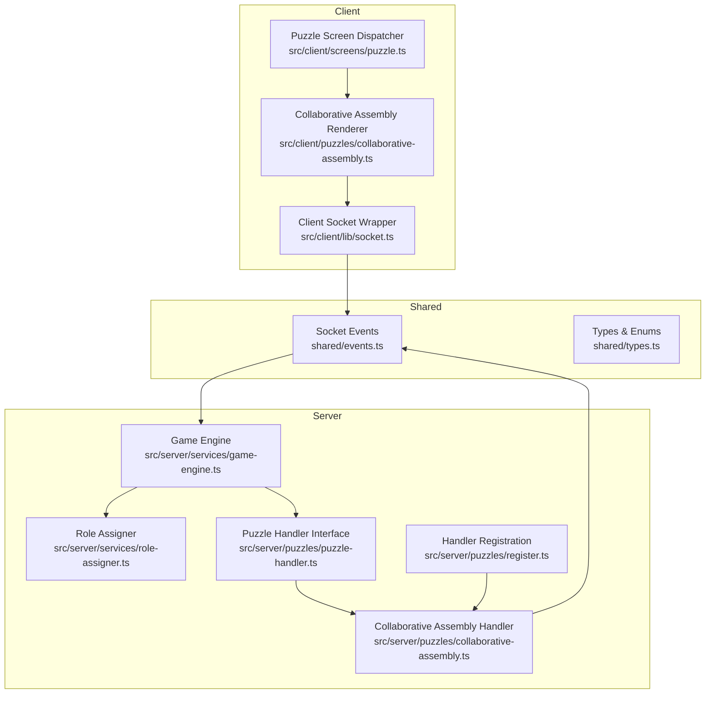
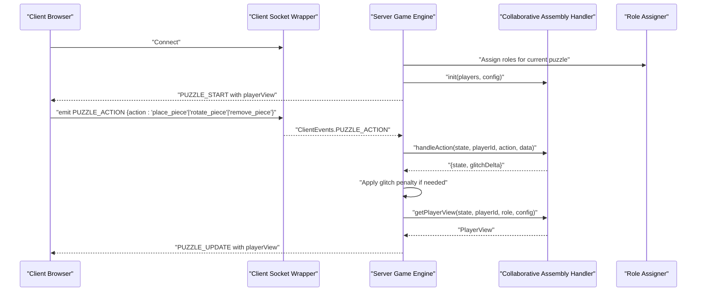
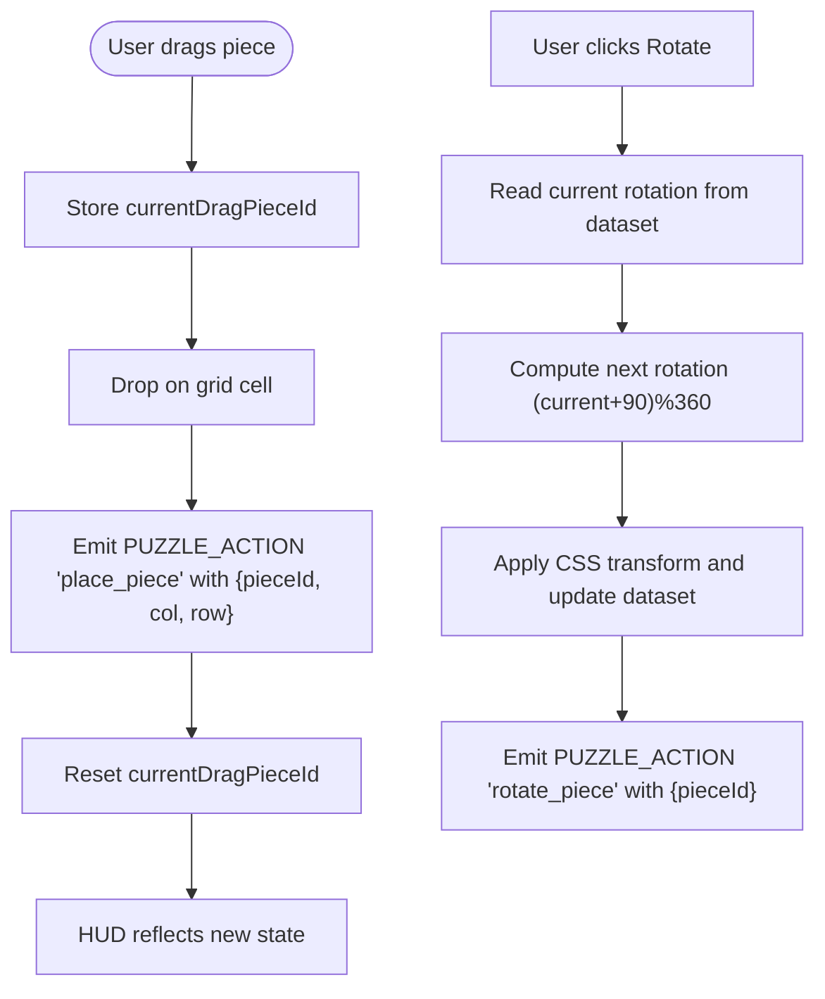
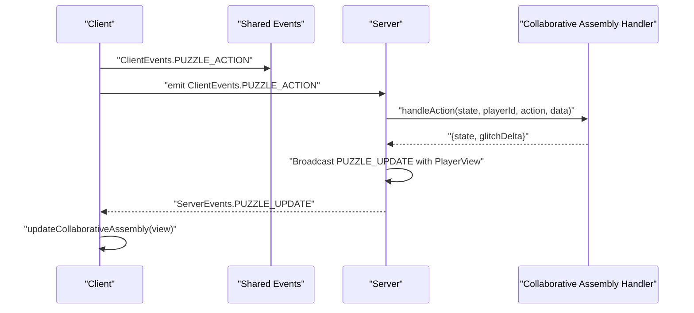
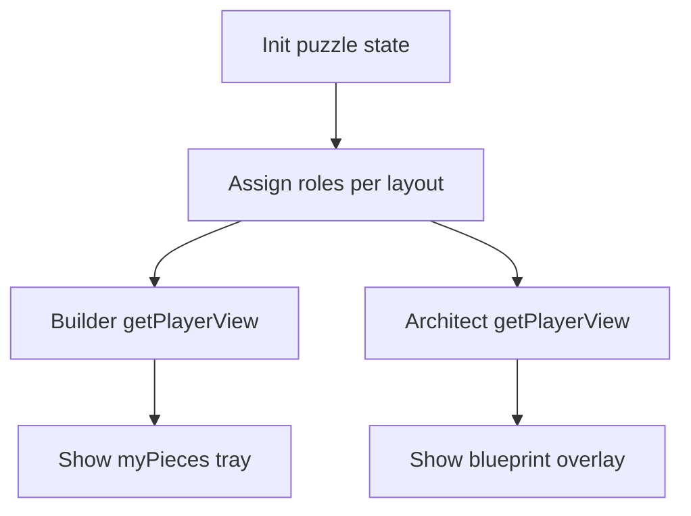
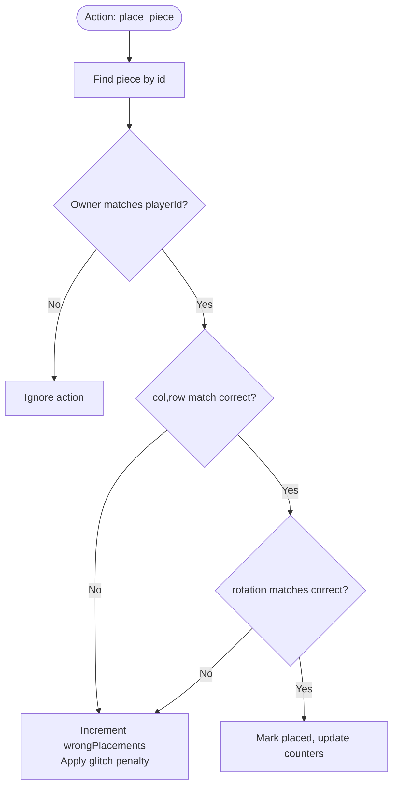
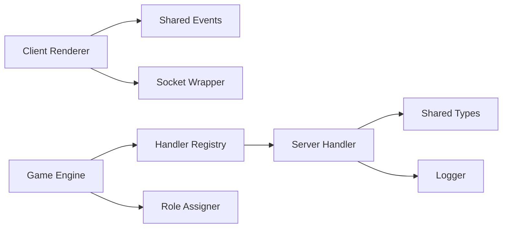

# Collaborative Assembly Puzzle

<cite>
**Referenced Files in This Document**
- [collaborative-assembly.ts](file://src/client/puzzles/collaborative-assembly.ts)
- [collaborative-assembly.ts](file://src/server/puzzles/collaborative-assembly.ts)
- [puzzle-handler.ts](file://src/server/puzzles/puzzle-handler.ts)
- [register.ts](file://src/server/puzzles/register.ts)
- [socket.ts](file://src/client/lib/socket.ts)
- [events.ts](file://shared/events.ts)
- [types.ts](file://shared/types.ts)
- [puzzle.ts](file://src/client/screens/puzzle.ts)
- [role-assigner.ts](file://src/server/services/role-assigner.ts)
- [game-engine.ts](file://src/server/services/game-engine.ts)
- [SCHEMA.md](file://config/SCHEMA.md)
- [ARCHITECTURE.md](file://ARCHITECTURE.md)
- [README.md](file://README.md)
</cite>

## Table of Contents
1. [Introduction](#introduction)
2. [Project Structure](#project-structure)
3. [Core Components](#core-components)
4. [Architecture Overview](#architecture-overview)
5. [Detailed Component Analysis](#detailed-component-analysis)
6. [Dependency Analysis](#dependency-analysis)
7. [Performance Considerations](#performance-considerations)
8. [Troubleshooting Guide](#troubleshooting-guide)
9. [Conclusion](#conclusion)
10. [Appendices](#appendices)

## Introduction
This document explains the collaborative assembly puzzle implementation, focusing on how players assemble an object from multiple components using drag-and-drop mechanics, 3D-like rotation, and snap-to-grid behavior. It covers the client-side 3D manipulation system, piece rotation algorithms, and snap-to-grid functionality, as well as the server-side assembly validation, fit-checking algorithms, and multi-player coordination. It also documents the role-based component visibility system that lets different players handle different parts of the assembly, and provides examples of puzzle configuration, spatial reasoning algorithms, and client-server object synchronization.

## Project Structure
The collaborative assembly puzzle spans client and server layers:
- Client-side renderer and user interactions for drag-and-drop, rotation, and grid display
- Server-side puzzle handler managing state, validation, and role-specific views
- Shared types and events defining the contract between client and server
- Game engine orchestrating puzzle lifecycle and broadcasting updates
- Role assignment service distributing players into roles per puzzle layout



**Diagram sources**
- [socket.ts](file://src/client/lib/socket.ts#L1-L85)
- [collaborative-assembly.ts](file://src/client/puzzles/collaborative-assembly.ts#L1-L183)
- [puzzle.ts](file://src/client/screens/puzzle.ts#L1-L101)
- [events.ts](file://shared/events.ts#L1-L228)
- [game-engine.ts](file://src/server/services/game-engine.ts#L1-L400)
- [role-assigner.ts](file://src/server/services/role-assigner.ts#L1-L78)
- [puzzle-handler.ts](file://src/server/puzzles/puzzle-handler.ts#L1-L57)
- [collaborative-assembly.ts](file://src/server/puzzles/collaborative-assembly.ts#L1-L218)
- [register.ts](file://src/server/puzzles/register.ts#L1-L21)

**Section sources**
- [ARCHITECTURE.md](file://ARCHITECTURE.md#L1-L202)
- [README.md](file://README.md#L1-L132)

## Core Components
- Client-side collaborative assembly renderer: renders the grid, player pieces tray, handles drag-and-drop, rotation, and progress display
- Server-side collaborative assembly handler: initializes state, validates placements, rotates pieces, removes pieces, checks win conditions, and generates role-specific views
- Socket event contract: typed client-server events for puzzle actions and updates
- Game engine orchestration: assigns roles, starts puzzles, processes actions, broadcasts updates, and checks win conditions
- Role assigner: distributes players into roles per puzzle layout

Key responsibilities:
- Client: user interactions, local rotation state, grid rendering, progress feedback
- Server: authoritative state, ownership checks, correctness validation, role visibility, win detection
- Shared: types and events ensure consistent contracts across client and server

**Section sources**
- [collaborative-assembly.ts](file://src/client/puzzles/collaborative-assembly.ts#L1-L183)
- [collaborative-assembly.ts](file://src/server/puzzles/collaborative-assembly.ts#L1-L218)
- [events.ts](file://shared/events.ts#L1-L228)
- [game-engine.ts](file://src/server/services/game-engine.ts#L260-L383)
- [role-assigner.ts](file://src/server/services/role-assigner.ts#L1-L78)

## Architecture Overview
The collaborative assembly puzzle follows a config-first, pluggable architecture:
- Puzzle type is defined in YAML and registered in the server’s handler registry
- The game engine assigns roles per puzzle and initializes the puzzle state via the registered handler
- Clients receive a role-specific view and render accordingly
- Players submit actions (place, rotate, remove) via typed socket events
- The server validates actions, updates state, applies glitch penalties, and broadcasts synchronized updates



**Diagram sources**
- [socket.ts](file://src/client/lib/socket.ts#L1-L85)
- [events.ts](file://shared/events.ts#L1-L228)
- [game-engine.ts](file://src/server/services/game-engine.ts#L260-L383)
- [role-assigner.ts](file://src/server/services/role-assigner.ts#L1-L78)
- [collaborative-assembly.ts](file://src/server/puzzles/collaborative-assembly.ts#L1-L218)

## Detailed Component Analysis

### Client-Side Collaborative Assembly Renderer
Responsibilities:
- Render grid with placed pieces and drop targets
- Render player’s pieces tray with rotation controls
- Handle drag-and-drop to place pieces
- Handle local rotation with immediate visual feedback
- Update progress display and trigger success sound when complete

Key behaviors:
- Drag-and-drop: stores the dragged piece ID and emits a place action with target coordinates
- Rotation: toggles piece rotation locally and emits rotate actions; shows temporary rotation indicator
- Blueprint view: architect role sees a solution blueprint overlaid on the grid
- Progress: displays placed count vs total pieces



**Diagram sources**
- [collaborative-assembly.ts](file://src/client/puzzles/collaborative-assembly.ts#L12-L183)

**Section sources**
- [collaborative-assembly.ts](file://src/client/puzzles/collaborative-assembly.ts#L1-L183)
- [puzzle.ts](file://src/client/screens/puzzle.ts#L1-L101)

### Server-Side Collaborative Assembly Handler
Responsibilities:
- Initialize puzzle state: distribute pieces to builders, assign correct positions and rotations, set up counters
- Validate actions: enforce ownership, check correct position and rotation, apply glitch penalties for wrong placements
- Manage piece lifecycle: rotate, place, remove, and track placed pieces
- Generate role-specific views: architect sees blueprint; builders see their own pieces and progress
- Check win condition: all pieces placed correctly

```mermaid
classDiagram
class PieceState {
+number id
+string ownerId
+number correctCol
+number correctRow
+number correctRotation
+number currentRotation
+number|null col
+number|null row
+boolean isPlaced
}
class AssemblyData {
+number gridCols
+number gridRows
+PieceState[] pieces
+number totalPieces
+number placedCorrectly
+number wrongPlacements
}
class CollaborativeAssemblyHandler {
+init(players, config) PuzzleState
+handleAction(state, playerId, action, data) {state, glitchDelta}
+checkWin(state) boolean
+getPlayerView(state, playerId, role, config) PlayerView
}
CollaborativeAssemblyHandler --> AssemblyData : "manages"
AssemblyData --> PieceState : "contains"
```

**Diagram sources**
- [collaborative-assembly.ts](file://src/server/puzzles/collaborative-assembly.ts#L10-L30)
- [collaborative-assembly.ts](file://src/server/puzzles/collaborative-assembly.ts#L31-L218)

**Section sources**
- [collaborative-assembly.ts](file://src/server/puzzles/collaborative-assembly.ts#L1-L218)
- [puzzle-handler.ts](file://src/server/puzzles/puzzle-handler.ts#L1-L57)
- [register.ts](file://src/server/puzzles/register.ts#L1-L21)

### Client-Server Synchronization and Events
Contract:
- Client emits typed actions via ClientEvents.PUZZLE_ACTION
- Server responds with PUZZLE_UPDATE containing the latest PlayerView
- Architect view includes blueprint; builder view includes pieces and progress



**Diagram sources**
- [events.ts](file://shared/events.ts#L28-L90)
- [socket.ts](file://src/client/lib/socket.ts#L51-L57)
- [collaborative-assembly.ts](file://src/server/puzzles/collaborative-assembly.ts#L88-L140)
- [collaborative-assembly.ts](file://src/client/puzzles/collaborative-assembly.ts#L172-L183)

**Section sources**
- [events.ts](file://shared/events.ts#L1-L228)
- [socket.ts](file://src/client/lib/socket.ts#L1-L85)
- [collaborative-assembly.ts](file://src/server/puzzles/collaborative-assembly.ts#L88-L140)
- [collaborative-assembly.ts](file://src/client/puzzles/collaborative-assembly.ts#L172-L183)

### Role-Based Component Visibility
Mechanics:
- Roles are assigned per puzzle using role-assigner
- Architect sees blueprint with correct positions and rotations
- Builders see only their owned pieces and progress
- Ownership prevents placing another player’s piece



**Diagram sources**
- [role-assigner.ts](file://src/server/services/role-assigner.ts#L24-L77)
- [collaborative-assembly.ts](file://src/server/puzzles/collaborative-assembly.ts#L147-L216)

**Section sources**
- [role-assigner.ts](file://src/server/services/role-assigner.ts#L1-L78)
- [collaborative-assembly.ts](file://src/server/puzzles/collaborative-assembly.ts#L147-L216)
- [types.ts](file://shared/types.ts#L149-L164)

### Puzzle Configuration Examples
Configuration fields for collaborative assembly:
- grid_cols: grid width
- grid_rows: grid height
- total_pieces: number of pieces to place
- snap_tolerance_px: snap distance in pixels

Example usage in YAML:
- Define puzzles[] with type "collaborative_assembly"
- Provide layout.roles to assign roles (e.g., one architect, remaining builders)
- Supply data fields grid_cols, grid_rows, total_pieces, and optional snap_tolerance_px

**Section sources**
- [SCHEMA.md](file://config/SCHEMA.md#L109-L117)
- [README.md](file://README.md#L30-L66)

### Spatial Reasoning and Fit-Checking Algorithms
Validation logic:
- Placement requires exact column, row, and rotation match to the correct solution
- Rotation is discrete (0, 90, 180, 270 degrees)
- Ownership ensures only the piece owner can manipulate their piece
- Wrong placements increment wrongPlacements and apply glitch penalty



**Diagram sources**
- [collaborative-assembly.ts](file://src/server/puzzles/collaborative-assembly.ts#L97-L139)

**Section sources**
- [collaborative-assembly.ts](file://src/server/puzzles/collaborative-assembly.ts#L97-L139)

## Dependency Analysis
- Client renderer depends on shared events and socket wrapper
- Server handler depends on shared types and logger
- Game engine depends on handler registry, role assigner, and config loader
- Handler registration binds puzzle type to implementation



**Diagram sources**
- [collaborative-assembly.ts](file://src/client/puzzles/collaborative-assembly.ts#L1-L183)
- [collaborative-assembly.ts](file://src/server/puzzles/collaborative-assembly.ts#L1-L218)
- [puzzle-handler.ts](file://src/server/puzzles/puzzle-handler.ts#L1-L57)
- [register.ts](file://src/server/puzzles/register.ts#L1-L21)
- [game-engine.ts](file://src/server/services/game-engine.ts#L260-L383)
- [role-assigner.ts](file://src/server/services/role-assigner.ts#L1-L78)

**Section sources**
- [puzzle-handler.ts](file://src/server/puzzles/puzzle-handler.ts#L1-L57)
- [register.ts](file://src/server/puzzles/register.ts#L1-L21)
- [game-engine.ts](file://src/server/services/game-engine.ts#L260-L383)

## Performance Considerations
- Client rendering: minimize DOM updates by batching grid and tray updates; avoid unnecessary re-renders by diffing view data
- Server state: keep piece arrays compact; use efficient lookups (find by id) and filter operations for views
- Network: throttle frequent rotation actions if needed; debounce updates to reduce bandwidth
- Memory: clear old puzzle states when transitioning between puzzles; avoid retaining stale references

## Troubleshooting Guide
Common issues and resolutions:
- Pieces not appearing in tray: verify builder role and that pieces are not already placed
- Cannot rotate or place: confirm ownership and that piece is not already placed
- Wrong placement not penalized: ensure correct column, row, and rotation match
- Blueprint not visible: confirm architect role assignment
- Stale UI after action: ensure PUZZLE_UPDATE is received and update function is called

**Section sources**
- [collaborative-assembly.ts](file://src/client/puzzles/collaborative-assembly.ts#L172-L183)
- [collaborative-assembly.ts](file://src/server/puzzles/collaborative-assembly.ts#L97-L139)
- [role-assigner.ts](file://src/server/services/role-assigner.ts#L1-L78)

## Conclusion
The collaborative assembly puzzle combines role-based asymmetric views with precise spatial validation and real-time synchronization. The client provides intuitive drag-and-drop and rotation controls, while the server enforces correctness, ownership, and win conditions. The modular handler architecture and typed events enable easy extension and reliable client-server coordination.

## Appendices

### Client-Server Event Contract Summary
- Client emits: ClientEvents.PUZZLE_ACTION with action and data
- Server replies: ServerEvents.PUZZLE_UPDATE with PlayerView
- Architect view: blueprint overlay with correct positions and rotations
- Builder view: personal pieces tray and placed pieces grid

**Section sources**
- [events.ts](file://shared/events.ts#L28-L90)
- [collaborative-assembly.ts](file://src/server/puzzles/collaborative-assembly.ts#L147-L216)
- [collaborative-assembly.ts](file://src/client/puzzles/collaborative-assembly.ts#L24-L151)