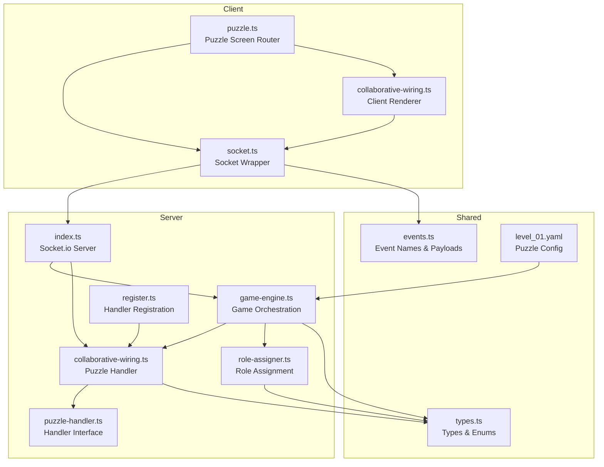
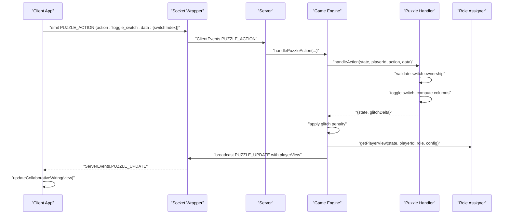
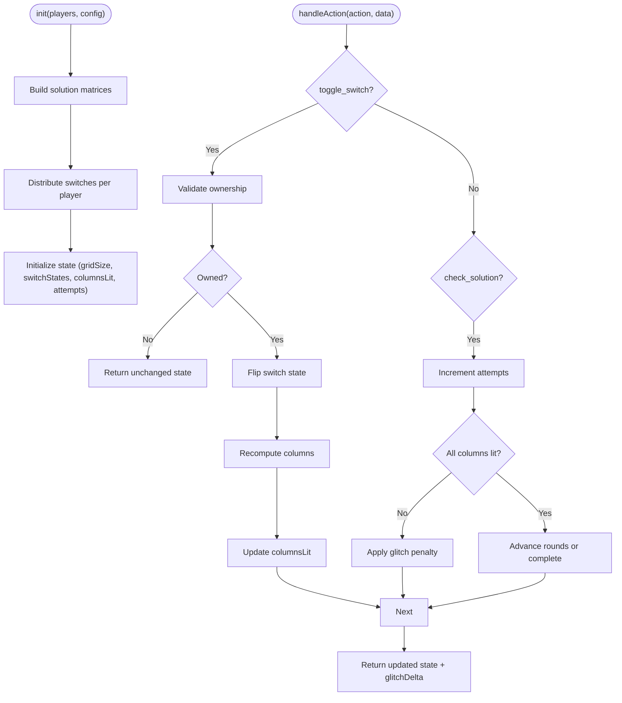
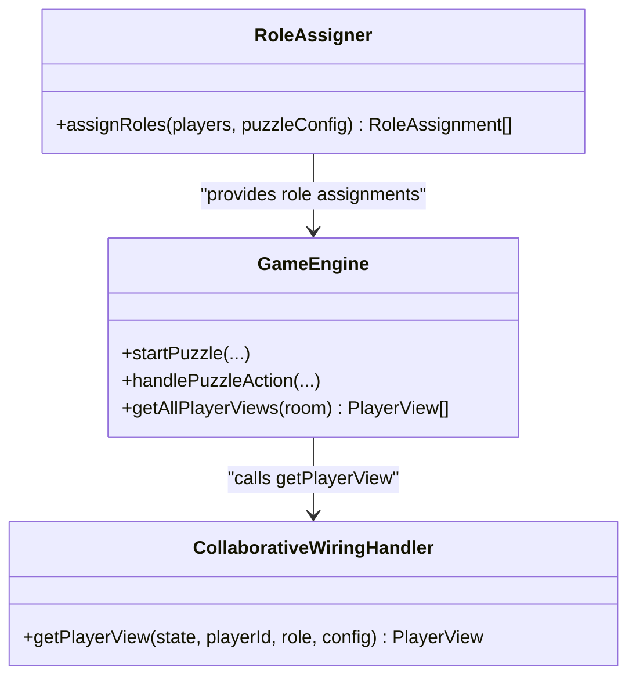
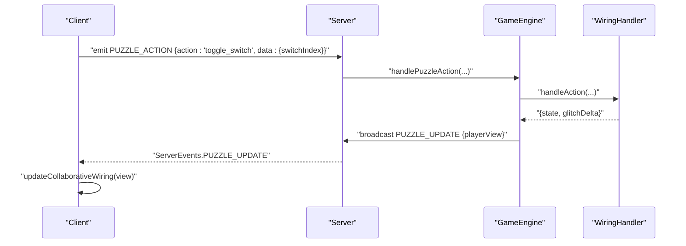
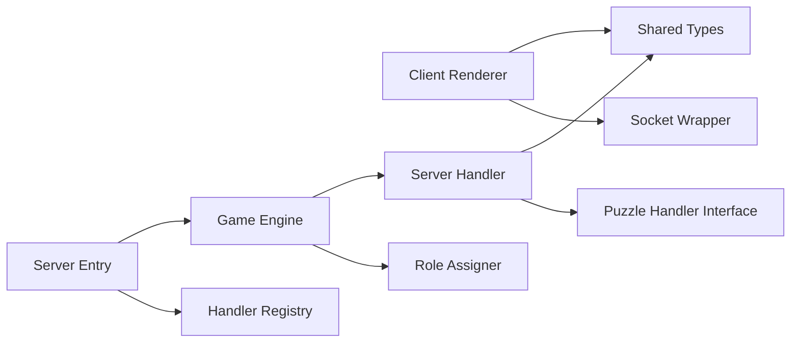

# Collaborative Wiring Puzzle

<cite>
**Referenced Files in This Document**
- [collaborative-wiring.ts](file://src/client/puzzles/collaborative-wiring.ts)
- [collaborative-wiring.ts](file://src/server/puzzles/collaborative-wiring.ts)
- [collaborative-wiring.test.ts](file://src/server/puzzles/collaborative-wiring.test.ts)
- [types.ts](file://shared/types.ts)
- [puzzle-handler.ts](file://src/server/puzzles/puzzle-handler.ts)
- [register.ts](file://src/server/puzzles/register.ts)
- [socket.ts](file://src/client/lib/socket.ts)
- [events.ts](file://shared/events.ts)
- [puzzle.ts](file://src/client/screens/puzzle.ts)
- [game-engine.ts](file://src/server/services/game-engine.ts)
- [role-assigner.ts](file://src/server/services/role-assigner.ts)
- [index.ts](file://src/server/index.ts)
- [level_01.yaml](file://config/level_01.yaml)
</cite>

## Table of Contents
1. [Introduction](#introduction)
2. [Project Structure](#project-structure)
3. [Core Components](#core-components)
4. [Architecture Overview](#architecture-overview)
5. [Detailed Component Analysis](#detailed-component-analysis)
6. [Dependency Analysis](#dependency-analysis)
7. [Performance Considerations](#performance-considerations)
8. [Troubleshooting Guide](#troubleshooting-guide)
9. [Conclusion](#conclusion)
10. [Appendices](#appendices)

## Introduction
This document explains the collaborative wiring puzzle implementation, where multiple players cooperatively connect switches to complete electrical circuits. The puzzle enforces role-based visibility so that each player manipulates only their assigned switches while observing the global circuit state. It covers client-side rendering and interaction, server-side circuit verification and constraint enforcement, multi-player coordination, and testing strategies.

## Project Structure
The collaborative wiring puzzle spans client and server layers:
- Client-side renderer and interaction logic for the wiring UI
- Server-side puzzle handler managing state, validation, and view generation
- Shared types and event definitions
- Game engine orchestrating puzzle lifecycle and broadcasting updates
- Role assignment service for per-puzzle role distribution
- Configuration-driven puzzle definition

**Diagram sources**
- [puzzle.ts](file://src/client/screens/puzzle.ts#L1-L101)
- [collaborative-wiring.ts](file://src/client/puzzles/collaborative-wiring.ts#L1-L121)
- [socket.ts](file://src/client/lib/socket.ts#L1-L85)
- [index.ts](file://src/server/index.ts#L1-L321)
- [game-engine.ts](file://src/server/services/game-engine.ts#L1-L711)
- [collaborative-wiring.ts](file://src/server/puzzles/collaborative-wiring.ts#L1-L203)
- [puzzle-handler.ts](file://src/server/puzzles/puzzle-handler.ts#L1-L57)
- [register.ts](file://src/server/puzzles/register.ts#L1-L21)
- [role-assigner.ts](file://src/server/services/role-assigner.ts#L1-L78)
- [types.ts](file://shared/types.ts#L1-L187)
- [events.ts](file://shared/events.ts#L1-L228)
- [level_01.yaml](file://config/level_01.yaml#L64-L98)

**Section sources**
- [collaborative-wiring.ts](file://src/client/puzzles/collaborative-wiring.ts#L1-L121)
- [collaborative-wiring.ts](file://src/server/puzzles/collaborative-wiring.ts#L1-L203)
- [puzzle-handler.ts](file://src/server/puzzles/puzzle-handler.ts#L1-L57)
- [register.ts](file://src/server/puzzles/register.ts#L1-L21)
- [socket.ts](file://src/client/lib/socket.ts#L1-L85)
- [events.ts](file://shared/events.ts#L1-L228)
- [puzzle.ts](file://src/client/screens/puzzle.ts#L1-L101)
- [game-engine.ts](file://src/server/services/game-engine.ts#L1-L711)
- [role-assigner.ts](file://src/server/services/role-assigner.ts#L1-L78)
- [index.ts](file://src/server/index.ts#L1-L321)
- [types.ts](file://shared/types.ts#L1-L187)
- [level_01.yaml](file://config/level_01.yaml#L64-L98)

## Core Components
- Client puzzle renderer: renders columns, switches, attempts, and rounds; handles user interactions; applies optimistic UI updates
- Server puzzle handler: initializes state, validates actions, computes column lighting, checks win conditions, and generates player-specific views
- Shared types and events: define puzzle types, roles, view data, and socket event contracts
- Game engine: coordinates puzzle lifecycle, role assignment, broadcasting updates, and win/loss conditions
- Role assigner: distributes roles per puzzle with randomization
- Configuration: defines puzzle parameters such as grid size, switch allocation, solution matrices, and rounds

**Section sources**
- [collaborative-wiring.ts](file://src/client/puzzles/collaborative-wiring.ts#L10-L121)
- [collaborative-wiring.ts](file://src/server/puzzles/collaborative-wiring.ts#L23-L174)
- [types.ts](file://shared/types.ts#L72-L164)
- [events.ts](file://shared/events.ts#L28-L90)
- [game-engine.ts](file://src/server/services/game-engine.ts#L263-L383)
- [role-assigner.ts](file://src/server/services/role-assigner.ts#L24-L77)
- [level_01.yaml](file://config/level_01.yaml#L64-L98)

## Architecture Overview
The collaborative wiring puzzle follows a client-server architecture with typed socket events and a centralized game engine. Players receive role-specific views and can toggle only their assigned switches. Actions are validated server-side, and updates are broadcast to all clients.

**Diagram sources**
- [socket.ts](file://src/client/lib/socket.ts#L51-L57)
- [events.ts](file://shared/events.ts#L28-L51)
- [index.ts](file://src/server/index.ts#L206-L217)
- [game-engine.ts](file://src/server/services/game-engine.ts#L324-L383)
- [collaborative-wiring.ts](file://src/server/puzzles/collaborative-wiring.ts#L94-L140)
- [role-assigner.ts](file://src/server/services/role-assigner.ts#L24-L77)

## Detailed Component Analysis

### Client-Side Wiring Renderer
The client renders:
- Columns display indicating whether each column is lit
- Switches grouped by ownership (only clickable if owned)
- Attempts counter and round indicator
- A “Check Solution” button

User interactions:
- Clicking a switch emits a toggle action to the server
- Optimistically toggles the UI state for immediate feedback
- On solution check, emits a check action

UI updates:
- Updates columns, switches, attempts, and rounds based on received view data
- Plays success sound when all columns are lit

**Diagram sources**
- [collaborative-wiring.ts](file://src/client/puzzles/collaborative-wiring.ts#L67-L121)
- [socket.ts](file://src/client/lib/socket.ts#L51-L57)

**Section sources**
- [collaborative-wiring.ts](file://src/client/puzzles/collaborative-wiring.ts#L10-L121)
- [socket.ts](file://src/client/lib/socket.ts#L51-L57)

### Server-Side Wiring Handler
Responsibilities:
- Initialization: builds solution matrices, assigns switches per player, sets initial state
- Action handling: validates ownership, toggles switches, recomputes columns, increments attempts, applies glitch penalty on failure
- Win condition: advances rounds or completes puzzle when all rounds are solved
- View generation: exposes only the subset of data relevant to each player’s role

Key logic:
- Switch ownership validation prevents cross-player manipulation
- Column lighting computed by iterating rows and applying XOR logic per column
- Rounds progression resets state for the next board when a solution is found

**Diagram sources**
- [collaborative-wiring.ts](file://src/server/puzzles/collaborative-wiring.ts#L24-L140)
- [collaborative-wiring.ts](file://src/server/puzzles/collaborative-wiring.ts#L179-L200)

**Section sources**
- [collaborative-wiring.ts](file://src/server/puzzles/collaborative-wiring.ts#L23-L174)
- [collaborative-wiring.ts](file://src/server/puzzles/collaborative-wiring.ts#L179-L200)

### Role-Based Visibility and Asymmetric Information
- Roles are assigned per puzzle with randomization
- The server generates a player-specific view containing only the data visible to that role
- In this puzzle, the “Engineer” role sees their own switches and the global column state

**Diagram sources**
- [role-assigner.ts](file://src/server/services/role-assigner.ts#L24-L77)
- [game-engine.ts](file://src/server/services/game-engine.ts#L263-L319)
- [collaborative-wiring.ts](file://src/server/puzzles/collaborative-wiring.ts#L147-L173)

**Section sources**
- [role-assigner.ts](file://src/server/services/role-assigner.ts#L24-L77)
- [collaborative-wiring.ts](file://src/server/puzzles/collaborative-wiring.ts#L147-L173)
- [game-engine.ts](file://src/server/services/game-engine.ts#L295-L313)

### Client-Server Wire Synchronization
- Client emits actions with typed payloads
- Server validates and updates state
- Server broadcasts PUZZLE_UPDATE with the latest view to all clients
- Client applies updates and plays feedback sounds

**Diagram sources**
- [events.ts](file://shared/events.ts#L36-L51)
- [socket.ts](file://src/client/lib/socket.ts#L51-L57)
- [index.ts](file://src/server/index.ts#L206-L217)
- [game-engine.ts](file://src/server/services/game-engine.ts#L324-L383)
- [collaborative-wiring.ts](file://src/server/puzzles/collaborative-wiring.ts#L94-L140)

**Section sources**
- [events.ts](file://shared/events.ts#L112-L116)
- [socket.ts](file://src/client/lib/socket.ts#L51-L57)
- [index.ts](file://src/server/index.ts#L206-L217)
- [game-engine.ts](file://src/server/services/game-engine.ts#L324-L383)

### Puzzle Configuration Examples
- Grid size: number of columns to light
- Switches per player: number of switches assigned to each player
- Solution matrices: one or more matrices defining valid combinations
- Rounds to play: number of boards to solve
- Max attempts: limit of solution checks per round

Example configuration keys and defaults are defined in the server handler initialization and validated against the level YAML.

**Section sources**
- [collaborative-wiring.ts](file://src/server/puzzles/collaborative-wiring.ts#L24-L92)
- [level_01.yaml](file://config/level_01.yaml#L64-L98)

## Dependency Analysis
- Client puzzle renderer depends on shared types and socket wrapper
- Server puzzle handler depends on shared types and puzzle handler interface
- Game engine depends on puzzle handler registry and role assigner
- Server entry point registers puzzle handlers and binds socket events

**Diagram sources**
- [collaborative-wiring.ts](file://src/client/puzzles/collaborative-wiring.ts#L5-L8)
- [collaborative-wiring.ts](file://src/server/puzzles/collaborative-wiring.ts#L6-L8)
- [puzzle-handler.ts](file://src/server/puzzles/puzzle-handler.ts#L5-L6)
- [game-engine.ts](file://src/server/services/game-engine.ts#L42-L46)
- [role-assigner.ts](file://src/server/services/role-assigner.ts#L5-L6)
- [index.ts](file://src/server/index.ts#L42-L43)
- [register.ts](file://src/server/puzzles/register.ts#L5-L12)

**Section sources**
- [collaborative-wiring.ts](file://src/client/puzzles/collaborative-wiring.ts#L5-L8)
- [collaborative-wiring.ts](file://src/server/puzzles/collaborative-wiring.ts#L6-L8)
- [puzzle-handler.ts](file://src/server/puzzles/puzzle-handler.ts#L5-L6)
- [game-engine.ts](file://src/server/services/game-engine.ts#L42-L46)
- [role-assigner.ts](file://src/server/services/role-assigner.ts#L5-L6)
- [index.ts](file://src/server/index.ts#L42-L43)
- [register.ts](file://src/server/puzzles/register.ts#L5-L12)

## Performance Considerations
- Column computation complexity is proportional to number of switches times number of columns; keep grids moderate in size
- Minimize DOM updates by batching class toggles and avoiding unnecessary re-renders
- Use optimistic UI updates to reduce perceived latency; reconcile with server state on receipt of updates
- Avoid heavy computations in hot paths; precompute matrices and distribute switches efficiently during initialization

## Troubleshooting Guide
Common issues and remedies:
- Switches not toggling: verify ownership validation and that the correct action name is emitted
- Incorrect column lighting: confirm matrix dimensions match switch count and grid size
- Glitch penalties not applied: ensure the handler returns a positive glitch delta on failed checks
- Out-of-sync UI: ensure PUZZLE_UPDATE is handled and updateCollaborativeWiring is invoked
- Role visibility problems: confirm getPlayerView returns only role-appropriate data

**Section sources**
- [collaborative-wiring.ts](file://src/server/puzzles/collaborative-wiring.ts#L103-L137)
- [collaborative-wiring.ts](file://src/client/puzzles/collaborative-wiring.ts#L67-L85)
- [game-engine.ts](file://src/server/services/game-engine.ts#L354-L374)

## Conclusion
The collaborative wiring puzzle integrates client-side rendering with robust server-side validation and role-based visibility. Players cooperatively solve multiple boards by toggling only their assigned switches, with immediate visual feedback and multi-player synchronization. The modular design allows easy extension to new puzzles and configurations.

## Appendices

### Testing Strategies
- Unit tests for column computation using solution matrices and known solutions
- Integration tests covering client-server action flow and view updates
- Role assignment tests to ensure deterministic and randomized role distribution
- End-to-end scenarios simulating multiple rounds and attempts

**Section sources**
- [collaborative-wiring.test.ts](file://src/server/puzzles/collaborative-wiring.test.ts#L1-L63)
- [collaborative-wiring.ts](file://src/server/puzzles/collaborative-wiring.ts#L202-L203)