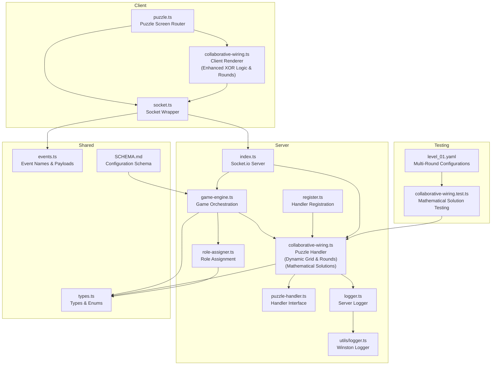
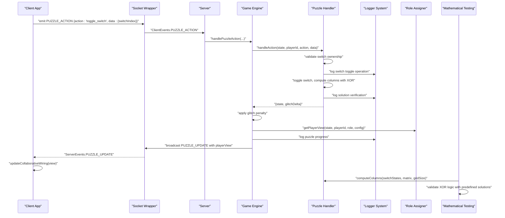
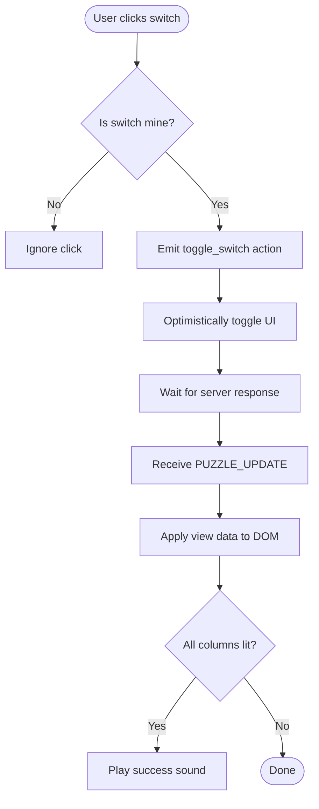
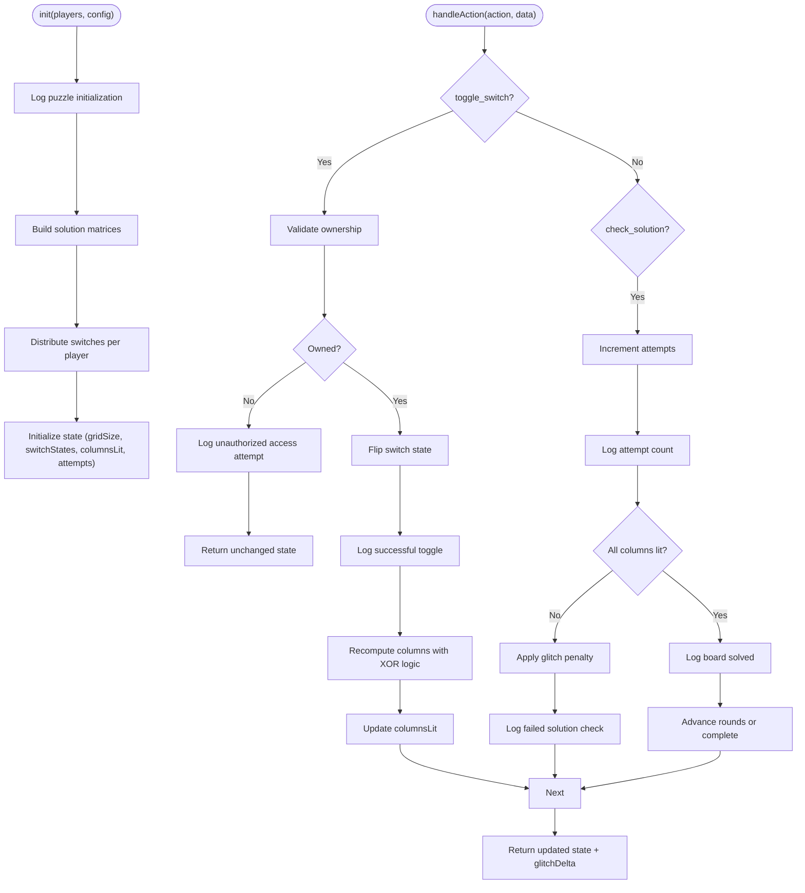
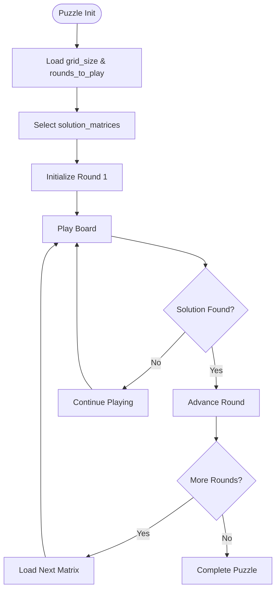
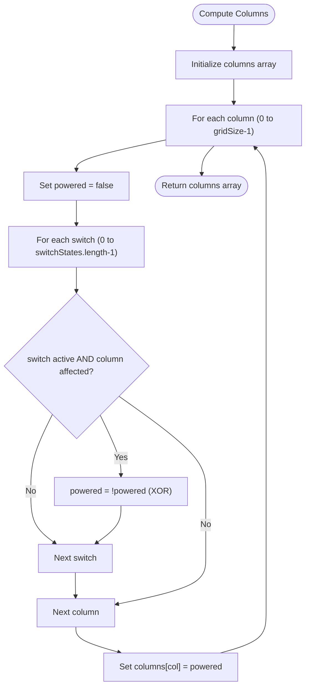
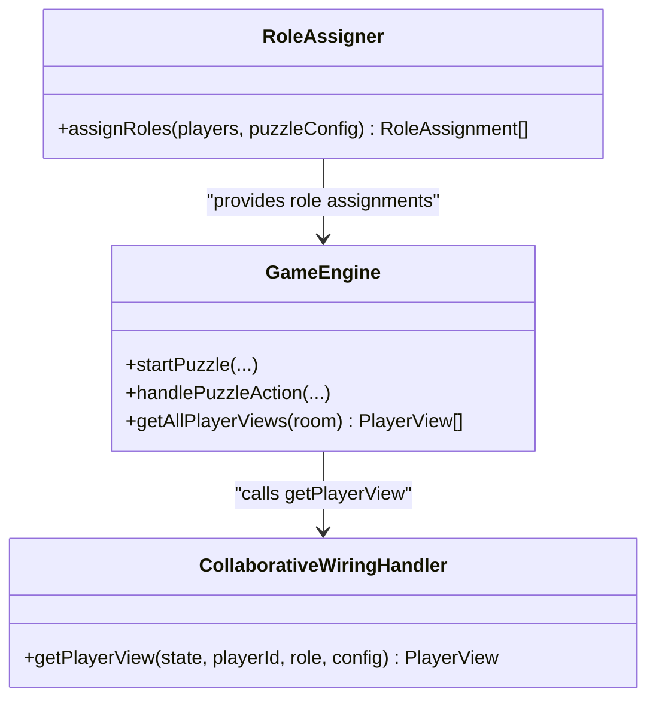
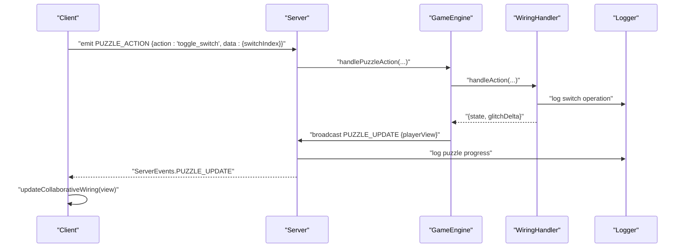
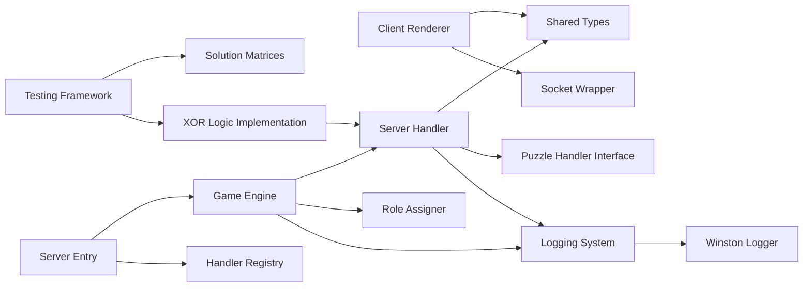

# Collaborative Wiring Puzzle

<cite>
**Referenced Files in This Document**
- [collaborative-wiring.ts](file://src/client/puzzles/collaborative-wiring.ts)
- [collaborative-wiring.ts](file://src/server/puzzles/collaborative-wiring.ts)
- [collaborative-wiring.test.ts](file://src/server/puzzles/collaborative-wiring.test.ts)
- [types.ts](file://shared/types.ts)
- [puzzle-handler.ts](file://src/server/puzzles/puzzle-handler.ts)
- [register.ts](file://src/server/puzzles/register.ts)
- [socket.ts](file://src/client/lib/socket.ts)
- [events.ts](file://shared/events.ts)
- [puzzle.ts](file://src/client/screens/puzzle.ts)
- [game-engine.ts](file://src/server/services/game-engine.ts)
- [role-assigner.ts](file://src/server/services/role-assigner.ts)
- [index.ts](file://src/server/index.ts)
- [logger.ts](file://src/server/utils/logger.ts)
- [logger.ts](file://shared/logger.ts)
- [SCHEMA.md](file://config/SCHEMA.md)
- [level_01.yaml](file://config/level_01.yaml)
</cite>

## Update Summary
**Changes Made**
- Enhanced collaborative wiring puzzle with dynamic grid size handling and multiple rounds support
- Implemented mathematical XOR solution approach with automated switch combination generation using bit manipulation
- Added comprehensive matrix validation testing with predefined solutions and systematic testing framework
- Introduced round-based puzzle progression with automatic board advancement
- Enhanced client-server synchronization with optimistic UI updates and comprehensive logging
- Improved role-based visibility system with asymmetric information handling

## Table of Contents
1. [Introduction](#introduction)
2. [Project Structure](#project-structure)
3. [Core Components](#core-components)
4. [Architecture Overview](#architecture-overview)
5. [Detailed Component Analysis](#detailed-component-analysis)
6. [Dynamic Grid Size and Multiple Rounds Support](#dynamic-grid-size-and-multiple-rounds-support)
7. [Mathematical XOR Solution Approach](#mathematical-xor-solution-approach)
8. [Automated Switch Combination Generation](#automated-switch-combination-generation)
9. [Enhanced Testing Framework](#enhanced-testing-framework)
10. [Progress Tracking and Round Management](#progress-tracking-and-round-management)
11. [Asymmetric Information and Role-Based Visibility](#asymmetric-information-and-role-based-visibility)
12. [Client-Server Synchronization](#client-server-synchronization)
13. [Performance Considerations](#performance-considerations)
14. [Troubleshooting Guide](#troubleshooting-guide)
15. [Conclusion](#conclusion)
16. [Appendices](#appendices)

## Introduction
This document explains the collaborative wiring puzzle implementation, where multiple players cooperatively connect switches to complete electrical circuits across multiple rounds. The puzzle enforces role-based visibility so that each player manipulates only their assigned switches while observing the global circuit state. It covers client-side rendering and interaction, server-side circuit verification and constraint enforcement, multi-player coordination, and comprehensive testing with mathematical solution validation. Recent enhancements include dynamic grid size handling, multiple rounds support, mathematical XOR logic implementation with calculated solutions, automated switch combination generation using bit manipulation, and improved progress tracking with round-based puzzle progression.

## Project Structure
The collaborative wiring puzzle spans client and server layers with enhanced logging capabilities and systematic XOR logic:
- Client-side renderer and interaction logic for the wiring UI with optimistic updates
- Server-side puzzle handler managing state, validation, and view generation with detailed logging
- Shared types and event definitions for typed communication
- Game engine orchestrating puzzle lifecycle and broadcasting updates
- Role assignment service for per-puzzle role distribution
- Configuration-driven puzzle definition with schema validation
- Comprehensive testing framework with mathematical solution validation
- Dynamic grid size handling and multiple rounds support
- Mathematical XOR computation for reliable column lighting determination

**Diagram sources**
- [puzzle.ts](file://src/client/screens/puzzle.ts#L1-L87)
- [collaborative-wiring.ts](file://src/client/puzzles/collaborative-wiring.ts#L1-L121)
- [socket.ts](file://src/client/lib/socket.ts#L1-L85)
- [index.ts](file://src/server/index.ts#L1-L325)
- [game-engine.ts](file://src/server/services/game-engine.ts#L1-L794)
- [collaborative-wiring.ts](file://src/server/puzzles/collaborative-wiring.ts#L1-L212)
- [puzzle-handler.ts](file://src/server/puzzles/puzzle-handler.ts#L1-L57)
- [register.ts](file://src/server/puzzles/register.ts#L1-L17)
- [role-assigner.ts](file://src/server/services/role-assigner.ts#L1-L78)
- [logger.ts](file://src/server/utils/logger.ts#L1-L21)
- [logger.ts](file://shared/logger.ts#L1-L22)
- [types.ts](file://shared/types.ts#L1-L181)
- [events.ts](file://shared/events.ts#L1-L228)
- [SCHEMA.md](file://config/SCHEMA.md#L91-L100)
- [collaborative-wiring.test.ts](file://src/server/puzzles/collaborative-wiring.test.ts#L1-L63)
- [level_01.yaml](file://config/level_01.yaml#L121-L198)

**Section sources**
- [collaborative-wiring.ts](file://src/client/puzzles/collaborative-wiring.ts#L1-L121)
- [collaborative-wiring.ts](file://src/server/puzzles/collaborative-wiring.ts#L1-L212)
- [puzzle-handler.ts](file://src/server/puzzles/puzzle-handler.ts#L1-L57)
- [register.ts](file://src/server/puzzles/register.ts#L1-L17)
- [socket.ts](file://src/client/lib/socket.ts#L1-L85)
- [events.ts](file://shared/events.ts#L1-L228)
- [puzzle.ts](file://src/client/screens/puzzle.ts#L1-L87)
- [game-engine.ts](file://src/server/services/game-engine.ts#L1-L794)
- [role-assigner.ts](file://src/server/services/role-assigner.ts#L1-L78)
- [index.ts](file://src/server/index.ts#L1-L325)
- [types.ts](file://shared/types.ts#L1-L181)
- [logger.ts](file://src/server/utils/logger.ts#L1-L21)
- [logger.ts](file://shared/logger.ts#L1-L22)
- [SCHEMA.md](file://config/SCHEMA.md#L91-L100)

## Core Components
- Client puzzle renderer: renders columns, switches, attempts, and rounds; handles user interactions; applies optimistic UI updates with enhanced XOR feedback
- Server puzzle handler: initializes state with dynamic grid sizes, validates actions, computes column lighting using systematic XOR logic, checks win conditions, and generates player-specific views with comprehensive logging
- Shared types and events: define puzzle types, roles, view data, and socket event contracts
- Game engine: coordinates puzzle lifecycle, role assignment, broadcasting updates, and win/loss conditions with enhanced retry handling
- Role assigner: distributes roles per puzzle with randomization
- Configuration: defines puzzle parameters such as grid size, switch allocation, solution matrices, and rounds with maximum attempts
- Mathematical solution testing: validates XOR logic implementation with calculated solutions from predefined matrices
- Logging system: provides structured logging for debugging, monitoring, and operational insights with progress tracking

**Section sources**
- [collaborative-wiring.ts](file://src/client/puzzles/collaborative-wiring.ts#L10-L121)
- [collaborative-wiring.ts](file://src/server/puzzles/collaborative-wiring.ts#L24-L174)
- [types.ts](file://shared/types.ts#L72-L164)
- [events.ts](file://shared/events.ts#L28-L90)
- [game-engine.ts](file://src/server/services/game-engine.ts#L343-L433)
- [role-assigner.ts](file://src/server/services/role-assigner.ts#L24-L77)
- [logger.ts](file://src/server/utils/logger.ts#L1-L21)
- [logger.ts](file://shared/logger.ts#L6-L11)

## Architecture Overview
The collaborative wiring puzzle follows a client-server architecture with typed socket events and a centralized game engine. Players receive role-specific views and can toggle only their assigned switches. Actions are validated server-side with comprehensive logging, and updates are broadcast to all clients. Enhanced XOR logic ensures systematic column lighting computation with improved reliability and mathematical precision. The system now supports multiple rounds with automatic board progression and dynamic grid size handling.

**Diagram sources**
- [socket.ts](file://src/client/lib/socket.ts#L51-L57)
- [events.ts](file://shared/events.ts#L28-L51)
- [index.ts](file://src/server/index.ts#L211-L221)
- [game-engine.ts](file://src/server/services/game-engine.ts#L346-L413)
- [collaborative-wiring.ts](file://src/server/puzzles/collaborative-wiring.ts#L99-L149)
- [logger.ts](file://src/server/utils/logger.ts#L1-L21)
- [role-assigner.ts](file://src/server/services/role-assigner.ts#L24-L77)
- [collaborative-wiring.test.ts](file://src/server/puzzles/collaborative-wiring.test.ts#L38-L63)

## Detailed Component Analysis

### Client-Side Wiring Renderer
The client renders:
- Columns display indicating whether each column is lit with enhanced XOR feedback
- Switches grouped by ownership (only clickable if owned)
- Attempts counter and round indicator with maximum attempts display
- A "Check Solution" button

User interactions:
- Clicking a switch emits a toggle action to the server
- Optimistically toggles the UI state for immediate feedback
- On solution check, emits a check action

UI updates:
- Updates columns, switches, attempts, and rounds based on received view data
- Plays success sound when all columns are lit
- Provides visual feedback for XOR-powered column states

**Diagram sources**
- [collaborative-wiring.ts](file://src/client/puzzles/collaborative-wiring.ts#L67-L121)
- [socket.ts](file://src/client/lib/socket.ts#L51-L57)

**Section sources**
- [collaborative-wiring.ts](file://src/client/puzzles/collaborative-wiring.ts#L10-L121)
- [socket.ts](file://src/client/lib/socket.ts#L51-L57)

### Server-Side Wiring Handler
Responsibilities:
- Initialization: builds solution matrices, assigns switches per player, sets initial state with logging
- Action handling: validates ownership, toggles switches, recomputes columns using systematic XOR logic, increments attempts, applies glitch penalty on failure
- Win condition: advances rounds or completes puzzle when all rounds are solved
- View generation: exposes only the subset of data relevant to each player's role
- Logging: comprehensive operational logging for debugging and monitoring

Key logic:
- Switch ownership validation prevents cross-player manipulation with warning logs
- Column lighting computed by iterating rows and applying XOR logic per column for systematic power calculation
- Rounds progression resets state for the next board when a solution is found
- Solution verification logs progress and attempts with enhanced error handling

**Diagram sources**
- [collaborative-wiring.ts](file://src/server/puzzles/collaborative-wiring.ts#L24-L149)
- [collaborative-wiring.ts](file://src/server/puzzles/collaborative-wiring.ts#L179-L200)
- [logger.ts](file://src/server/utils/logger.ts#L1-L21)

**Section sources**
- [collaborative-wiring.ts](file://src/server/puzzles/collaborative-wiring.ts#L23-L174)
- [collaborative-wiring.ts](file://src/server/puzzles/collaborative-wiring.ts#L179-L200)

### Dynamic Grid Size and Multiple Rounds Support
The puzzle now supports dynamic grid sizes and multiple rounds with automatic progression:

- **Dynamic Grid Size**: Grid size is configurable per puzzle configuration
- **Multiple Rounds**: Supports multiple solution matrices with automatic board advancement
- **Round Management**: Tracks `boardsSolved` and `currentRound` for multi-board puzzles
- **Automatic Progression**: Moves to next board when solution is found
- **State Persistence**: Maintains progress across round transitions

**Section sources**
- [collaborative-wiring.ts](file://src/server/puzzles/collaborative-wiring.ts#L25-L97)
- [collaborative-wiring.ts](file://src/server/puzzles/collaborative-wiring.ts#L129-L141)
- [level_01.yaml](file://config/level_01.yaml#L138-L140)

## Dynamic Grid Size and Multiple Rounds Support

### Dynamic Grid Size Handling
The puzzle now supports configurable grid sizes for flexible puzzle design:

- **Grid Size Configuration**: Defined in puzzle configuration as `grid_size`
- **Dynamic Matrix Creation**: Solution matrices adapt to grid size automatically
- **Flexible Switch Distribution**: Switches are distributed based on matrix dimensions
- **Scalable Architecture**: Handles varying grid sizes without code changes

### Multiple Rounds Implementation
The system supports multiple rounds with automatic progression:

- **Round Configuration**: `rounds_to_play` determines number of boards
- **Matrix Selection**: Random selection of solution matrices for each round
- **Progress Tracking**: `boardsSolved` tracks completed rounds
- **Automatic Advancement**: Moves to next round when solution is found
- **State Reset**: Fresh state initialization for each new board

**Diagram sources**
- [collaborative-wiring.ts](file://src/server/puzzles/collaborative-wiring.ts#L47-L87)
- [collaborative-wiring.ts](file://src/server/puzzles/collaborative-wiring.ts#L129-L141)

**Section sources**
- [collaborative-wiring.ts](file://src/server/puzzles/collaborative-wiring.ts#L25-L97)
- [collaborative-wiring.ts](file://src/server/puzzles/collaborative-wiring.ts#L129-L141)
- [level_01.yaml](file://config/level_01.yaml#L138-L140)

## Mathematical XOR Solution Approach

### Systematic XOR Logic Implementation
The puzzle now implements systematic XOR logic for column lighting computation:

- **XOR Power Calculation**: Each column is powered if an odd number of its connected switches are active
- **Matrix Mapping**: Solution matrices define which switches affect which columns
- **Reliable Computation**: Iterates through all switches and applies XOR logic systematically
- **Mathematical Precision**: Uses proper XOR operations where toggling affects column state

### Automated Switch Combination Generation
The system uses bit manipulation for automated switch combination generation:

- **Bit Manipulation**: Uses binary representation for switch combinations
- **Automated Testing**: Generates test cases from bit patterns
- **Solution Validation**: Validates combinations against mathematical expectations
- **Scalable Testing**: Supports various grid sizes and switch counts

**Diagram sources**
- [collaborative-wiring.ts](file://src/server/puzzles/collaborative-wiring.ts#L188-L209)

### Mathematical Solution Validation
The system now validates solutions using calculated mathematical approaches:

- **Predefined Solutions**: Each solution matrix comes with a known correct solution
- **Systematic Testing**: Tests apply solutions to matrices and verify XOR results
- **Matrix Coverage**: Validates all solution matrices in level configuration
- **Error Detection**: Identifies incorrect matrix configurations or solutions

**Section sources**
- [collaborative-wiring.ts](file://src/server/puzzles/collaborative-wiring.ts#L188-L209)
- [collaborative-wiring.test.ts](file://src/server/puzzles/collaborative-wiring.test.ts#L38-L63)
- [level_01.yaml](file://config/level_01.yaml#L141-L191)

## Automated Switch Combination Generation

### Bit Manipulation Approach
The system uses bit manipulation for generating switch combinations:

- **Binary Representation**: Uses bit patterns to represent switch states
- **Automated Generation**: Creates combinations programmatically from bit patterns
- **Mathematical Validation**: Validates combinations using XOR logic
- **Scalable Architecture**: Works with any grid size and switch count

### Test Case Generation
The testing framework generates comprehensive test cases:

- **Solution Arrays**: Predefined solutions for each matrix
- **Matrix Validation**: Tests all solution matrices from configuration
- **XOR Logic Testing**: Ensures proper XOR computation produces expected results
- **Error Handling**: Tests invalid solutions and edge cases with mathematical precision

**Section sources**
- [collaborative-wiring.test.ts](file://src/server/puzzles/collaborative-wiring.test.ts#L24-L36)
- [collaborative-wiring.test.ts](file://src/server/puzzles/collaborative-wiring.test.ts#L44-L63)

## Enhanced Testing Framework

### Mathematical Solution Testing
The testing framework implements comprehensive validation using mathematical approaches:

- **Solution Verification**: Tests each matrix against known mathematical solutions
- **Matrix Coverage**: Validates all solution matrices from level configuration
- **XOR Logic Validation**: Ensures proper XOR computation produces expected results
- **Error Handling**: Tests invalid solutions and edge cases with mathematical precision
- **Integration Testing**: Tests complete puzzle flow with real configurations and calculated solutions

### Test Structure and Mathematical Approach
- **Configuration Loading**: Reads level YAML and extracts puzzle data with solution matrices
- **Solution Application**: Applies known mathematical solutions to matrices
- **Result Validation**: Verifies all columns are lit using XOR logic computation
- **Error Reporting**: Provides detailed error messages for failing tests with mathematical analysis
- **Predefined Solutions**: Uses hardcoded solutions from configuration for validation

**Section sources**
- [collaborative-wiring.test.ts](file://src/server/puzzles/collaborative-wiring.test.ts#L1-L63)
- [collaborative-wiring.test.ts](file://src/server/puzzles/collaborative-wiring.test.ts#L24-L36)
- [collaborative-wiring.test.ts](file://src/server/puzzles/collaborative-wiring.test.ts#L44-L63)

## Progress Tracking and Round Management

### Enhanced Progress Tracking
The system now provides comprehensive progress feedback:

- **Round Advancement**: Tracks `boardsSolved` and `currentRound` for multi-board puzzles
- **Completion Detection**: Uses `checkWin()` method to detect puzzle completion
- **Detailed Logging**: Logs progress with `boardsSolved/roundsToPlay` ratio
- **State Persistence**: Maintains progress across round transitions

### Win Condition Implementation
The win condition is determined by:

- **Round Completion**: `boardsSolved >= roundsToPlay`
- **State Management**: Resets for next round or completes puzzle
- **Progress Updates**: Logs completion progress and final success

**Section sources**
- [collaborative-wiring.ts](file://src/server/puzzles/collaborative-wiring.ts#L151-L154)
- [collaborative-wiring.ts](file://src/server/puzzles/collaborative-wiring.ts#L129-L141)

## Asymmetric Information and Role-Based Visibility

### Role-Based Visibility System
- Roles are assigned per puzzle with randomization
- The server generates a player-specific view containing only the data visible to that role
- In this puzzle, the "Engineer" role sees their own switches and the global column state

**Diagram sources**
- [role-assigner.ts](file://src/server/services/role-assigner.ts#L24-L77)
- [game-engine.ts](file://src/server/services/game-engine.ts#L263-L319)
- [collaborative-wiring.ts](file://src/server/puzzles/collaborative-wiring.ts#L156-L182)

**Section sources**
- [role-assigner.ts](file://src/server/services/role-assigner.ts#L24-L77)
- [collaborative-wiring.ts](file://src/server/puzzles/collaborative-wiring.ts#L156-L182)
- [game-engine.ts](file://src/server/services/game-engine.ts#L295-L313)

## Client-Server Synchronization

### Enhanced Synchronization Mechanisms
- Client emits actions with typed payloads
- Server validates and updates state with logging
- Server broadcasts PUZZLE_UPDATE with the latest view to all clients
- Client applies updates and plays feedback sounds

**Diagram sources**
- [events.ts](file://shared/events.ts#L36-L51)
- [socket.ts](file://src/client/lib/socket.ts#L51-L57)
- [index.ts](file://src/server/index.ts#L211-L221)
- [game-engine.ts](file://src/server/services/game-engine.ts#L346-L413)
- [collaborative-wiring.ts](file://src/server/puzzles/collaborative-wiring.ts#L99-L149)
- [logger.ts](file://src/server/utils/logger.ts#L1-L21)

**Section sources**
- [events.ts](file://shared/events.ts#L112-L116)
- [socket.ts](file://src/client/lib/socket.ts#L51-L57)
- [index.ts](file://src/server/index.ts#L211-L221)
- [game-engine.ts](file://src/server/services/game-engine.ts#L346-L413)

### Puzzle Configuration Examples
- Grid size: number of columns to light
- Switches per player: number of switches assigned to each player
- Solution matrices: one or more matrices defining valid combinations
- Rounds to play: number of boards to solve
- Max attempts: limit of solution checks per round

Example configuration keys and defaults are defined in the server handler initialization and validated against the level YAML schema.

**Section sources**
- [collaborative-wiring.ts](file://src/server/puzzles/collaborative-wiring.ts#L24-L92)
- [SCHEMA.md](file://config/SCHEMA.md#L91-L100)

## Enhanced Logging System

### Logging Levels and Implementation
The collaborative wiring puzzle implements a comprehensive logging system using Winston with structured logging levels:

- **DEBUG**: Detailed operational information for troubleshooting
- **INFO**: General operational messages and progress tracking
- **WARN**: Warning conditions and security events
- **ERROR**: Error conditions and exceptions

### Key Logging Events

#### Initialization Logging
- `[CollaborativeWiring] Initializing puzzle for ${players.length} players`
- `[CollaborativeWiring] Puzzle initialized: ${totalSwitches} switches, ${roundsToPlay} round(s)`

#### Operational Logging
- `[CollaborativeWiring] Player ${playerId} toggled switch ${switchIdx}`
- `[CollaborativeWiring] Board solved! Progress: ${boardsSolved}/${roundsToPlay}`
- `[CollaborativeWiring] Incorrect solution check by player ${playerId} (attempt ${attempts})`

#### Security and Validation Logging
- `[CollaborativeWiring] Player ${playerId} tried to toggle switch ${switchIdx} (not assigned)`

#### Progress Tracking
- Real-time logging of puzzle completion progress
- Attempt counting and failure tracking
- Round progression notifications

### Logging Benefits
- **Debugging**: Detailed trace of all player actions and puzzle state changes
- **Monitoring**: Real-time progress tracking and performance metrics
- **Security**: Detection of unauthorized access attempts
- **Analytics**: Usage patterns and puzzle difficulty assessment
- **Troubleshooting**: Comprehensive audit trail for issue resolution

**Section sources**
- [collaborative-wiring.ts](file://src/server/puzzles/collaborative-wiring.ts#L26-L144)
- [logger.ts](file://src/server/utils/logger.ts#L1-L21)
- [logger.ts](file://shared/logger.ts#L6-L11)

## Dependency Analysis
- Client puzzle renderer depends on shared types and socket wrapper
- Server puzzle handler depends on shared types, puzzle handler interface, and logging utilities
- Game engine depends on puzzle handler registry, role assigner, and logging system
- Server entry point registers puzzle handlers and binds socket events with logging
- Testing framework depends on solution matrices from configuration files
- Mathematical computation depends on XOR logic implementation

**Diagram sources**
- [collaborative-wiring.ts](file://src/client/puzzles/collaborative-wiring.ts#L5-L8)
- [collaborative-wiring.ts](file://src/server/puzzles/collaborative-wiring.ts#L6-L8)
- [puzzle-handler.ts](file://src/server/puzzles/puzzle-handler.ts#L5-L6)
- [game-engine.ts](file://src/server/services/game-engine.ts#L42-L46)
- [role-assigner.ts](file://src/server/services/role-assigner.ts#L5-L6)
- [index.ts](file://src/server/index.ts#L42-L43)
- [register.ts](file://src/server/puzzles/register.ts#L5-L12)
- [logger.ts](file://src/server/utils/logger.ts#L1-L21)
- [collaborative-wiring.test.ts](file://src/server/puzzles/collaborative-wiring.test.ts#L3-L6)
- [collaborative-wiring.test.ts](file://src/server/puzzles/collaborative-wiring.test.ts#L38-L44)

**Section sources**
- [collaborative-wiring.ts](file://src/client/puzzles/collaborative-wiring.ts#L5-L8)
- [collaborative-wiring.ts](file://src/server/puzzles/collaborative-wiring.ts#L6-L8)
- [puzzle-handler.ts](file://src/server/puzzles/puzzle-handler.ts#L5-L6)
- [game-engine.ts](file://src/server/services/game-engine.ts#L42-L46)
- [role-assigner.ts](file://src/server/services/role-assigner.ts#L5-L6)
- [index.ts](file://src/server/index.ts#L42-L43)
- [register.ts](file://src/server/puzzles/register.ts#L5-L12)
- [logger.ts](file://src/server/utils/logger.ts#L1-L21)

## Performance Considerations
- Column computation complexity is proportional to number of switches times number of columns; keep grids moderate in size
- Minimize DOM updates by batching class toggles and avoiding unnecessary re-renders
- Use optimistic UI updates to reduce perceived latency; reconcile with server state on receipt of updates
- Avoid heavy computations in hot paths; precompute matrices and distribute switches efficiently during initialization
- Logging overhead is minimal due to conditional logging based on environment variables
- XOR logic optimization: early termination when all columns are already powered
- Mathematical computation caching for frequently accessed solution matrices
- Dynamic grid size handling: efficient memory allocation based on configuration

## Troubleshooting Guide
Common issues and remedies:
- Switches not toggling: verify ownership validation and that the correct action name is emitted
- Incorrect column lighting: confirm matrix dimensions match switch count and grid size, verify XOR logic implementation
- Glitch penalties not applied: ensure the handler returns a positive glitch delta on failed checks
- Out-of-sync UI: ensure PUZZLE_UPDATE is handled and updateCollaborativeWiring is invoked
- Role visibility problems: confirm getPlayerView returns only role-appropriate data
- **Enhanced Logging**: Use debug logs to trace unauthorized access attempts and solution verification failures
- **Retry Issues**: Verify max_attempts configuration and attempt tracking logic
- **Progress Detection**: Check checkWin() implementation and boardsSolved tracking
- **Mathematical Validation**: Use test logs to verify XOR logic correctness and solution matrix validity
- **Solution Testing**: Run mathematical solution tests to identify incorrect matrix configurations
- **Round Progression**: Verify automatic board advancement and state reset functionality
- **Grid Size Issues**: Ensure matrix dimensions match configured grid size

**Updated** Enhanced logging and mathematical validation provide detailed operational insights for troubleshooting

**Section sources**
- [collaborative-wiring.ts](file://src/server/puzzles/collaborative-wiring.ts#L108-L144)
- [collaborative-wiring.ts](file://src/client/puzzles/collaborative-wiring.ts#L67-L85)
- [game-engine.ts](file://src/server/services/game-engine.ts#L378-L413)

## Conclusion
The collaborative wiring puzzle integrates client-side rendering with robust server-side validation and role-based visibility. Players cooperatively solve multiple boards by toggling only their assigned switches, with immediate visual feedback and multi-player synchronization. The enhanced XOR logic provides systematic column lighting computation with mathematical precision, while improved retry mechanisms with configurable maximum attempts offer better player experience. The comprehensive logging system provides extensive operational insights, security monitoring, and debugging capabilities. The modular design allows easy extension to new puzzles and configurations with enhanced testing patterns for complex scenarios. The mathematical solution validation framework ensures reliability and correctness of the puzzle implementation. The dynamic grid size handling and multiple rounds support provide scalable puzzle design capabilities.

## Appendices

### Testing Strategies
- Unit tests for column computation using solution matrices and known solutions with systematic XOR validation
- Integration tests covering client-server action flow and view updates with retry mechanism validation
- Role assignment tests to ensure deterministic and randomized role distribution
- End-to-end scenarios simulating multiple rounds, attempts, and completion detection
- **Enhanced Logging Tests**: Verify log messages are generated for all major operations including XOR computations
- **Mathematical Solution Tests**: Comprehensive testing of all solution matrices from level configuration using calculated XOR logic
- **Progress Tracking Tests**: Verify round advancement and win condition detection with mathematical validation
- **Matrix Validation Tests**: Ensure solution matrices produce correct XOR results and prevent invalid configurations
- **Performance Testing**: Validate computational complexity and optimization of XOR logic implementation
- **Round Progression Tests**: Verify automatic board advancement and state management across rounds
- **Grid Size Compatibility Tests**: Ensure proper handling of various grid sizes and switch distributions

**Updated** Added mathematical solution testing, matrix validation testing, round progression testing, and grid size compatibility testing to comprehensive testing strategy

**Section sources**
- [collaborative-wiring.test.ts](file://src/server/puzzles/collaborative-wiring.test.ts#L1-L63)
- [collaborative-wiring.test.ts](file://src/server/puzzles/collaborative-wiring.test.ts#L24-L36)
- [collaborative-wiring.test.ts](file://src/server/puzzles/collaborative-wiring.test.ts#L44-L63)
- [collaborative-wiring.ts](file://src/server/puzzles/collaborative-wiring.ts#L212-L212)