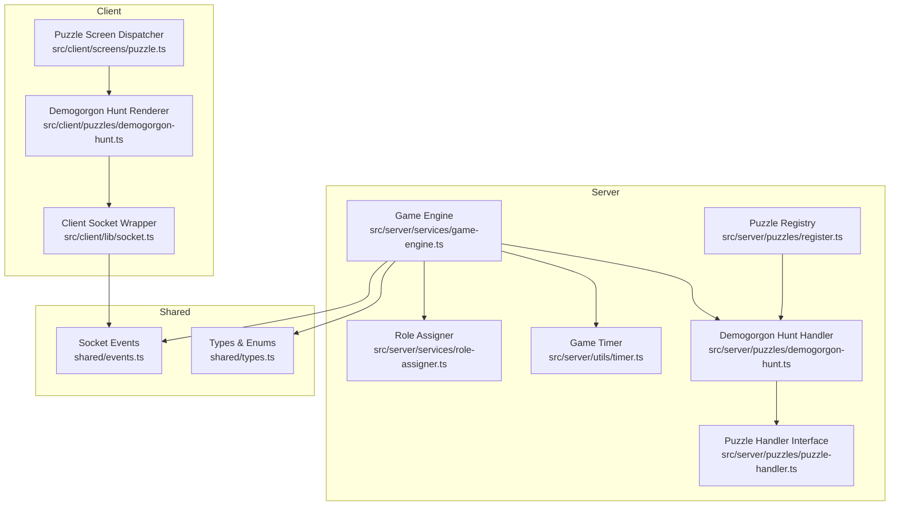
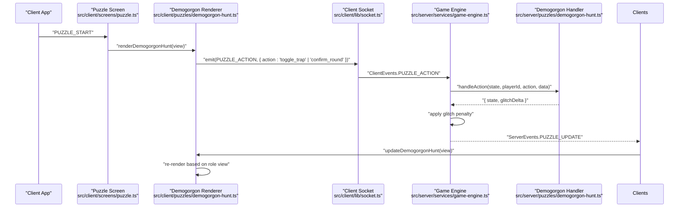
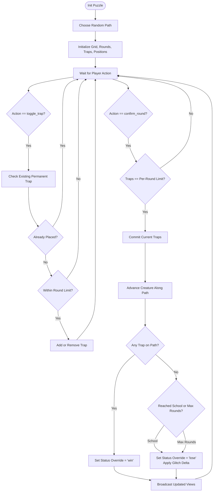
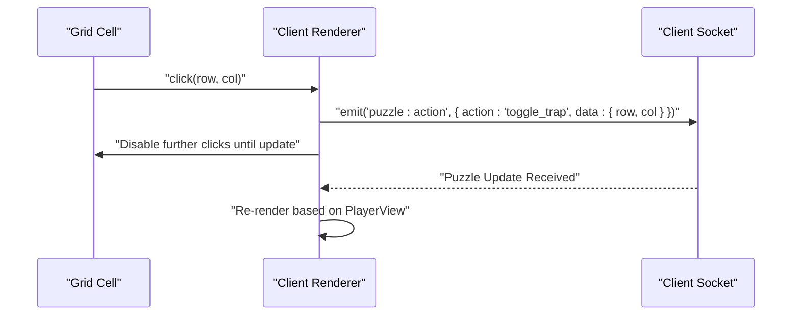
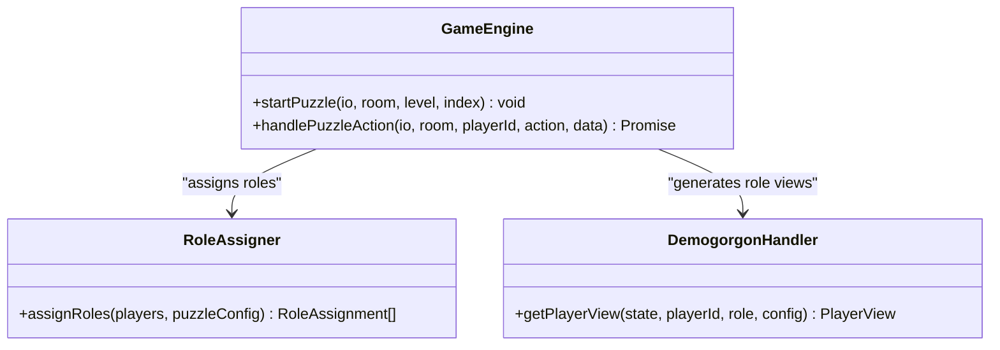
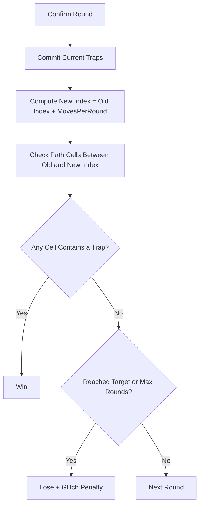
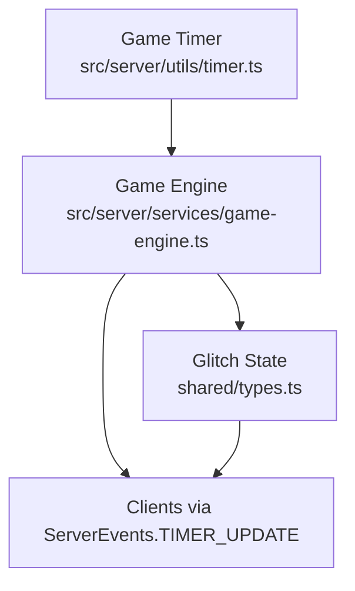
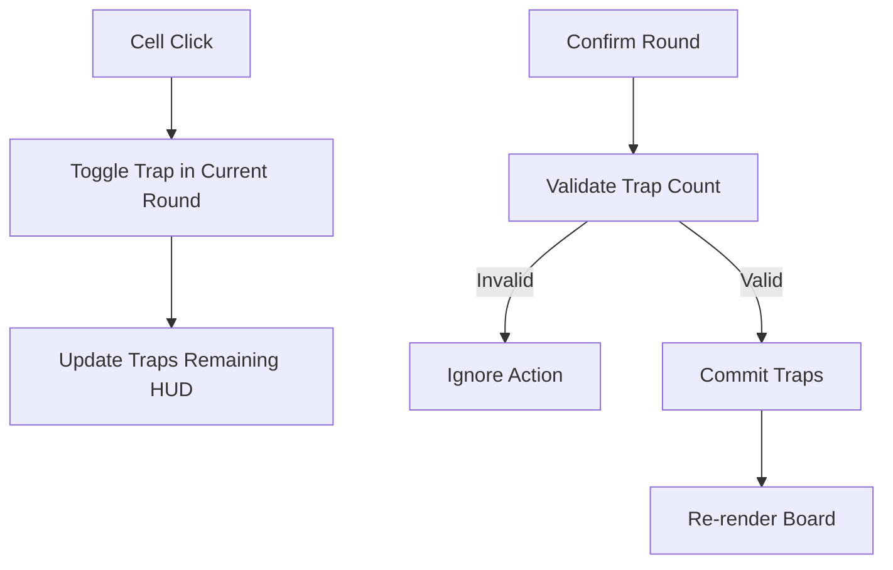
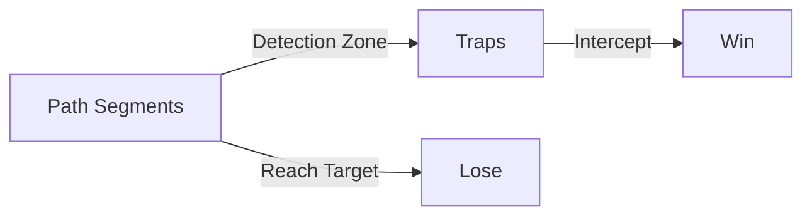
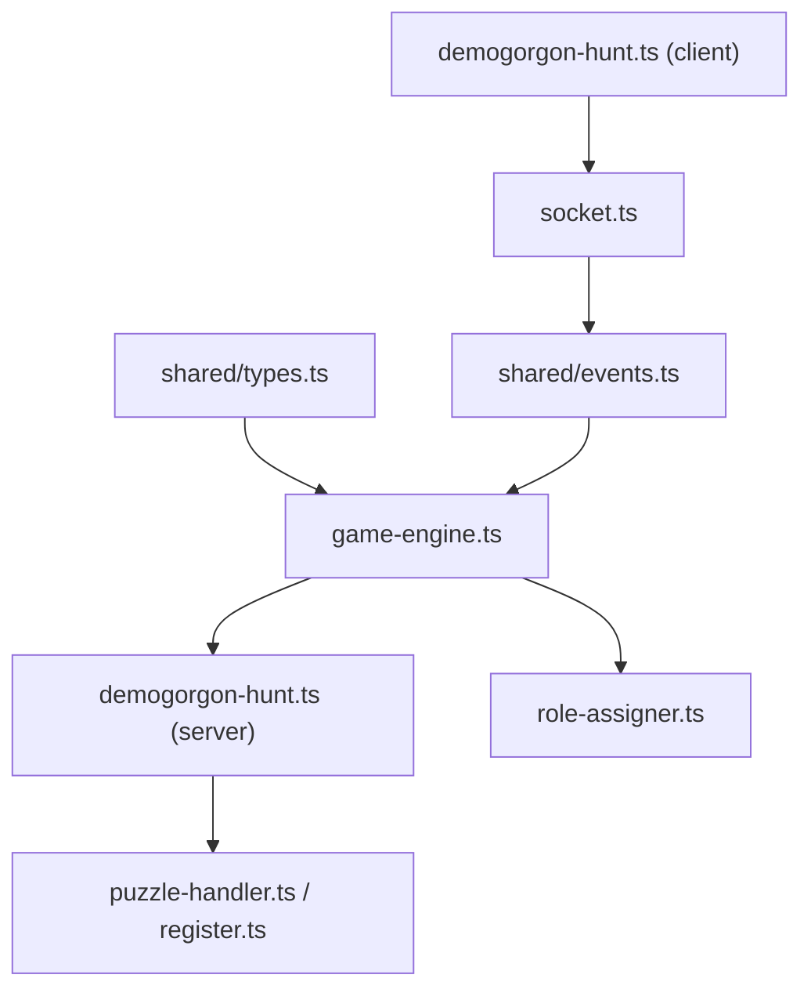

# Demogorgon Hunt Puzzle

<cite>
**Referenced Files in This Document**
- [demogorgon-hunt.ts](file://src/server/puzzles/demogorgon-hunt.ts)
- [demogorgon-hunt.ts](file://src/client/puzzles/demogorgon-hunt.ts)
- [socket.ts](file://src/client/lib/socket.ts)
- [puzzle.ts](file://src/client/screens/puzzle.ts)
- [role-assigner.ts](file://src/server/services/role-assigner.ts)
- [game-engine.ts](file://src/server/services/game-engine.ts)
- [events.ts](file://shared/events.ts)
- [types.ts](file://shared/types.ts)
- [puzzle-handler.ts](file://src/server/puzzles/puzzle-handler.ts)
- [register.ts](file://src/server/puzzles/register.ts)
- [timer.ts](file://src/server/utils/timer.ts)
- [ARCHITECTURE.md](file://ARCHITECTURE.md)
</cite>

## Table of Contents
1. [Introduction](#introduction)
2. [Project Structure](#project-structure)
3. [Core Components](#core-components)
4. [Architecture Overview](#architecture-overview)
5. [Detailed Component Analysis](#detailed-component-analysis)
6. [Dependency Analysis](#dependency-analysis)
7. [Performance Considerations](#performance-considerations)
8. [Troubleshooting Guide](#troubleshooting-guide)
9. [Conclusion](#conclusion)
10. [Appendices](#appendices)

## Introduction
The Demogorgon Hunt puzzle is a stealth-based chase challenge where players must collaborate to contain a supernatural threat. One player, designated as Eleven, has extrasensory perception of the creature’s location and provides directional intelligence. Other players act as Trappers, placing traps along the creature’s predetermined path to stop it from reaching a target (the school). The puzzle integrates role-based visibility, round-based progression, and server-authoritative state updates to maintain fairness and integrity.

## Project Structure
The Demogorgon Hunt puzzle spans both client and server layers:
- Client-side renderer handles UI rendering and user interactions (clicks, confirm actions).
- Server-side handler enforces game logic, validates actions, computes positions, and checks win/lose conditions.
- Shared types and events define the contract for state, roles, and communication.
- The game engine orchestrates puzzle lifecycle, role assignment, and broadcast of updates.

**Diagram sources**
- [socket.ts](file://src/client/lib/socket.ts#L1-L85)
- [demogorgon-hunt.ts](file://src/client/puzzles/demogorgon-hunt.ts#L1-L180)
- [puzzle.ts](file://src/client/screens/puzzle.ts#L1-L101)
- [game-engine.ts](file://src/server/services/game-engine.ts#L1-L711)
- [role-assigner.ts](file://src/server/services/role-assigner.ts#L1-L78)
- [timer.ts](file://src/server/utils/timer.ts#L1-L81)
- [demogorgon-hunt.ts](file://src/server/puzzles/demogorgon-hunt.ts#L1-L211)
- [puzzle-handler.ts](file://src/server/puzzles/puzzle-handler.ts#L1-L57)
- [register.ts](file://src/server/puzzles/register.ts#L1-L21)
- [events.ts](file://shared/events.ts#L1-L228)
- [types.ts](file://shared/types.ts#L1-L187)

**Section sources**
- [ARCHITECTURE.md](file://ARCHITECTURE.md#L1-L202)
- [puzzle.ts](file://src/client/screens/puzzle.ts#L1-L101)
- [socket.ts](file://src/client/lib/socket.ts#L1-L85)
- [demogorgon-hunt.ts](file://src/server/puzzles/demogorgon-hunt.ts#L1-L211)
- [role-assigner.ts](file://src/server/services/role-assigner.ts#L1-L78)
- [game-engine.ts](file://src/server/services/game-engine.ts#L1-L711)
- [events.ts](file://shared/events.ts#L1-L228)
- [types.ts](file://shared/types.ts#L1-L187)
- [puzzle-handler.ts](file://src/server/puzzles/puzzle-handler.ts#L1-L57)
- [register.ts](file://src/server/puzzles/register.ts#L1-L21)
- [timer.ts](file://src/server/utils/timer.ts#L1-L81)

## Core Components
- Server-side handler: Initializes puzzle state, processes actions (trap placement and round confirmation), moves the creature along a path, checks collisions, and determines win/lose outcomes.
- Client-side renderer: Renders role-specific views (Eleven’s radar vs. Trapper’s grid), handles clicks and confirm actions, and updates UI based on server-provided views.
- Role assignment: Randomly assigns roles per puzzle to ensure asymmetric information and collaboration.
- Game engine: Manages lifecycle, broadcasts updates, applies glitch penalties, and transitions between puzzles.
- Shared contracts: Strongly typed events and data structures ensure reliable client-server communication.

**Section sources**
- [demogorgon-hunt.ts](file://src/server/puzzles/demogorgon-hunt.ts#L27-L211)
- [demogorgon-hunt.ts](file://src/client/puzzles/demogorgon-hunt.ts#L6-L180)
- [role-assigner.ts](file://src/server/services/role-assigner.ts#L24-L78)
- [game-engine.ts](file://src/server/services/game-engine.ts#L263-L383)
- [events.ts](file://shared/events.ts#L28-L90)
- [types.ts](file://shared/types.ts#L72-L164)

## Architecture Overview
The puzzle follows a client-server architecture with a central game engine coordinating state and communication:
- Clients connect via Socket.io and receive role-specific views.
- Players submit actions (e.g., toggle trap, confirm round) which the server validates and processes.
- The server recalculates positions, checks win/lose conditions, and broadcasts updated views.
- The engine also manages the global timer and glitch state.

**Diagram sources**
- [puzzle.ts](file://src/client/screens/puzzle.ts#L23-L73)
- [demogorgon-hunt.ts](file://src/client/puzzles/demogorgon-hunt.ts#L132-L146)
- [socket.ts](file://src/client/lib/socket.ts#L51-L57)
- [game-engine.ts](file://src/server/services/game-engine.ts#L324-L383)
- [demogorgon-hunt.ts](file://src/server/puzzles/demogorgon-hunt.ts#L73-L150)
- [events.ts](file://shared/events.ts#L28-L90)

## Detailed Component Analysis

### Server-Side Handler: Demogorgon Hunt
The handler encapsulates all game logic:
- Initialization: Selects a random path from configured paths, sets grid/quadrant sizes, and initializes round/trap state.
- Action processing:
  - Toggle trap: Adds/removes a trap for the current round if under the per-round limit and not over a permanent trap.
  - Confirm round: Commits current traps, advances the creature along the path, checks for collisions, and evaluates win/lose conditions.
- Win/Lose evaluation: Win if a trap intercepts the creature along its path; lose if the creature reaches the school or exceeds max rounds.
- Player view generation:
  - Eleven sees the quadrant of the creature’s current position.
  - Trappers see the grid, placed traps, current round traps, and the school position.

**Diagram sources**
- [demogorgon-hunt.ts](file://src/server/puzzles/demogorgon-hunt.ts#L28-L150)

**Section sources**
- [demogorgon-hunt.ts](file://src/server/puzzles/demogorgon-hunt.ts#L27-L211)

### Client-Side Renderer: Demogorgon Hunt
The renderer adapts UI to the player’s role:
- Eleven view:
  - Displays a quadrant radar indicating the creature’s direction.
  - Shows a status message reflecting win/lose or current quadrant.
- Trapper view:
  - Renders a grid-based board with placed/current traps and the school marker.
  - Enables clicking cells to toggle traps and a confirm button to finalize the round.
  - Disables interactions when the game ends.
- Interaction:
  - Emits actions via the socket wrapper.
  - Updates the UI by re-rendering the container when the view changes.

**Diagram sources**
- [demogorgon-hunt.ts](file://src/client/puzzles/demogorgon-hunt.ts#L132-L146)
- [socket.ts](file://src/client/lib/socket.ts#L51-L57)

**Section sources**
- [demogorgon-hunt.ts](file://src/client/puzzles/demogorgon-hunt.ts#L6-L180)
- [socket.ts](file://src/client/lib/socket.ts#L51-L57)

### Role-Based Visibility System
- Roles are assigned per puzzle using a randomized assignment mechanism.
- Eleven sees directional intelligence (quadrant), while Trappers see the grid and trap placements.
- This asymmetric information encourages communication and coordinated play.

**Diagram sources**
- [role-assigner.ts](file://src/server/services/role-assigner.ts#L24-L78)
- [game-engine.ts](file://src/server/services/game-engine.ts#L263-L319)
- [demogorgon-hunt.ts](file://src/server/puzzles/demogorgon-hunt.ts#L157-L210)

**Section sources**
- [role-assigner.ts](file://src/server/services/role-assigner.ts#L24-L78)
- [game-engine.ts](file://src/server/services/game-engine.ts#L263-L319)
- [demogorgon-hunt.ts](file://src/server/puzzles/demogorgon-hunt.ts#L157-L210)

### Proximity Detection and Movement Mechanics
- Movement: The creature advances a fixed number of steps per round along a preselected path.
- Detection: Traps placed along the creature’s path within the movement window cause an interception.
- Win condition: Interception triggers immediate win.
- Lose conditions: Reaching the school or exceeding max rounds triggers loss and a glitch penalty.

**Diagram sources**
- [demogorgon-hunt.ts](file://src/server/puzzles/demogorgon-hunt.ts#L114-L146)

**Section sources**
- [demogorgon-hunt.ts](file://src/server/puzzles/demogorgon-hunt.ts#L114-L146)

### Time Pressure and Glitch Integration
- Global timer: A server-authoritative timer runs per room and triggers defeat on expiration.
- Glitch meter: Increases on invalid actions or certain puzzle outcomes; excessive glitch leads to defeat.
- Both mechanics add tension and reinforce the horror theme.

**Diagram sources**
- [timer.ts](file://src/server/utils/timer.ts#L10-L81)
- [game-engine.ts](file://src/server/services/game-engine.ts#L118-L129)
- [types.ts](file://shared/types.ts#L51-L62)

**Section sources**
- [timer.ts](file://src/server/utils/timer.ts#L10-L81)
- [game-engine.ts](file://src/server/services/game-engine.ts#L118-L129)
- [types.ts](file://shared/types.ts#L51-L62)

### Client-Side Movement Systems and Visual Indicators
- Trapper grid:
  - Grid size is dynamically set via CSS grid.
  - Clicking a cell toggles trap placement for the current round.
  - Confirms round only when the required number of traps is placed.
- Eleven radar:
  - Quadrant display updates based on the creature’s current position.
  - Visual feedback for win/lose states.

**Diagram sources**
- [demogorgon-hunt.ts](file://src/client/puzzles/demogorgon-hunt.ts#L78-L130)

**Section sources**
- [demogorgon-hunt.ts](file://src/client/puzzles/demogorgon-hunt.ts#L68-L130)

### Escape Route Indicators and Detection Zones
- Escape route: The school position marks the destination; reaching it results in a loss.
- Detection zones: The path segment traversed each round acts as a detection zone; traps placed within this zone prevent the creature from advancing.

**Diagram sources**
- [demogorgon-hunt.ts](file://src/server/puzzles/demogorgon-hunt.ts#L123-L131)
- [demogorgon-hunt.ts](file://src/client/puzzles/demogorgon-hunt.ts#L84-L90)

**Section sources**
- [demogorgon-hunt.ts](file://src/server/puzzles/demogorgon-hunt.ts#L123-L131)
- [demogorgon-hunt.ts](file://src/client/puzzles/demogorgon-hunt.ts#L84-L90)

### Player Interaction Validation
- Server-side validation ensures:
  - Only valid actions are processed.
  - Round confirmations require the exact number of traps.
  - Permanent traps cannot be modified mid-round.
- Client-side UI prevents invalid interactions and reflects server updates promptly.

**Section sources**
- [demogorgon-hunt.ts](file://src/server/puzzles/demogorgon-hunt.ts#L84-L108)
- [demogorgon-hunt.ts](file://src/client/puzzles/demogorgon-hunt.ts#L100-L122)

### Horror Theme Integration
- The puzzle’s theme is reflected in:
  - Role names and narrative framing.
  - Visual and audio cues defined in level configurations.
  - Glitch effects and atmospheric sound design.

**Section sources**
- [events.ts](file://shared/events.ts#L108-L114)
- [ARCHITECTURE.md](file://ARCHITECTURE.md#L1-L202)

## Dependency Analysis
The Demogorgon Hunt puzzle depends on:
- Shared types and events for consistent contracts.
- The game engine for orchestration and broadcasting.
- The role assigner for asymmetric views.
- The puzzle registry for handler resolution.

**Diagram sources**
- [types.ts](file://shared/types.ts#L72-L164)
- [events.ts](file://shared/events.ts#L28-L90)
- [game-engine.ts](file://src/server/services/game-engine.ts#L263-L319)
- [demogorgon-hunt.ts](file://src/server/puzzles/demogorgon-hunt.ts#L1-L211)
- [role-assigner.ts](file://src/server/services/role-assigner.ts#L1-L78)
- [puzzle-handler.ts](file://src/server/puzzles/puzzle-handler.ts#L46-L57)
- [register.ts](file://src/server/puzzles/register.ts#L1-L21)
- [demogorgon-hunt.ts](file://src/client/puzzles/demogorgon-hunt.ts#L1-L180)
- [socket.ts](file://src/client/lib/socket.ts#L1-L85)

**Section sources**
- [types.ts](file://shared/types.ts#L72-L164)
- [events.ts](file://shared/events.ts#L28-L90)
- [game-engine.ts](file://src/server/services/game-engine.ts#L263-L319)
- [demogorgon-hunt.ts](file://src/server/puzzles/demogorgon-hunt.ts#L1-L211)
- [role-assigner.ts](file://src/server/services/role-assigner.ts#L1-L78)
- [puzzle-handler.ts](file://src/server/puzzles/puzzle-handler.ts#L46-L57)
- [register.ts](file://src/server/puzzles/register.ts#L1-L21)
- [demogorgon-hunt.ts](file://src/client/puzzles/demogorgon-hunt.ts#L1-L180)
- [socket.ts](file://src/client/lib/socket.ts#L1-L85)

## Performance Considerations
- Client re-rendering: The client performs a full re-render of the puzzle container when the view updates, simplifying DOM synchronization for grid-heavy states.
- Server-side validation: All game logic resides on the server, preventing clients from manipulating state and ensuring deterministic outcomes.
- Minimal DOM operations: The renderer avoids incremental DOM updates for complex grids, trading CPU for reliability.

[No sources needed since this section provides general guidance]

## Troubleshooting Guide
Common issues and resolutions:
- No updates on client:
  - Verify socket connection and event handlers.
  - Ensure the puzzle screen dispatcher routes to the correct renderer.
- Actions ignored:
  - Confirm round validation requires the exact number of traps per round.
  - Permanent traps cannot be toggled mid-round.
- Unexpected win/lose:
  - Check that traps intersect the path segment moved this round.
  - Verify max rounds and target reach conditions.

**Section sources**
- [socket.ts](file://src/client/lib/socket.ts#L51-L57)
- [puzzle.ts](file://src/client/screens/puzzle.ts#L75-L100)
- [demogorgon-hunt.ts](file://src/server/puzzles/demogorgon-hunt.ts#L103-L146)
- [demogorgon-hunt.ts](file://src/client/puzzles/demogorgon-hunt.ts#L100-L122)

## Conclusion
The Demogorgon Hunt puzzle blends stealth mechanics, role-based asymmetry, and server-authoritative state management to deliver a tense, collaborative experience. Its modular design integrates cleanly with the broader game engine, enabling easy configuration and extension. The combination of directional intelligence for Eleven and strategic trap placement for Trappers creates a compelling horror-themed challenge.

[No sources needed since this section summarizes without analyzing specific files]

## Appendices

### Puzzle Configuration Examples
- Level configuration keys for the Demogorgon Hunt puzzle include grid size, quadrant size, moves per round, traps per round, max rounds, predefined paths, and school position.
- These values are passed to the handler during initialization and influence gameplay balance and difficulty.

**Section sources**
- [demogorgon-hunt.ts](file://src/server/puzzles/demogorgon-hunt.ts#L29-L63)

### AI Behavior Patterns
- The “AI” is deterministic: a randomly selected path guides the creature’s movement each round.
- Strategy implications:
  - Trappers should anticipate the creature’s movement window and place traps to block likely segments.
  - Eleven’s directional intelligence helps focus trap placement.

**Section sources**
- [demogorgon-hunt.ts](file://src/server/puzzles/demogorgon-hunt.ts#L39-L46)
- [demogorgon-hunt.ts](file://src/server/puzzles/demogorgon-hunt.ts#L114-L131)

### Integration with Horror Theme Elements
- Narrative and audio cues are defined per level and can be leveraged to enhance atmosphere.
- Visual glitch effects and distortion can be tied to the glitch meter and game events.

**Section sources**
- [events.ts](file://shared/events.ts#L108-L114)
- [ARCHITECTURE.md](file://ARCHITECTURE.md#L1-L202)