# Puzzle Architecture

<cite>
**Referenced Files in This Document**
- [puzzle-handler.ts](file://src/server/puzzles/puzzle-handler.ts)
- [register.ts](file://src/server/puzzles/register.ts)
- [game-engine.ts](file://src/server/services/game-engine.ts)
- [role-assigner.ts](file://src/server/services/role-assigner.ts)
- [types.ts](file://shared/types.ts)
- [events.ts](file://shared/events.ts)
- [config-loader.ts](file://src/server/utils/config-loader.ts)
- [asymmetric-symbols.ts](file://src/server/puzzles/asymmetric-symbols.ts)
- [cipher-decode.ts](file://src/server/puzzles/cipher-decode.ts)
- [collaborative-assembly.ts](file://src/server/puzzles/collaborative-assembly.ts)
- [rhythm-tap.ts](file://src/server/puzzles/rhythm-tap.ts)
- [alphabet-wall.ts](file://src/client/puzzles/alphabet-wall.ts)
- [cipher-decode.ts](file://src/client/puzzles/cipher-decode.ts)
- [main.ts](file://src/client/main.ts)
</cite>

## Table of Contents
1. [Introduction](#introduction)
2. [Project Structure](#project-structure)
3. [Core Components](#core-components)
4. [Architecture Overview](#architecture-overview)
5. [Detailed Component Analysis](#detailed-component-analysis)
6. [Dependency Analysis](#dependency-analysis)
7. [Performance Considerations](#performance-considerations)
8. [Troubleshooting Guide](#troubleshooting-guide)
9. [Conclusion](#conclusion)
10. [Appendices](#appendices)

## Introduction
This document explains the puzzle architecture and extensible handler system used to orchestrate diverse cooperative and asymmetric puzzles. It covers the puzzle handler interface design, registration mechanism, state management patterns, client-server synchronization, role-based visibility, and the complete puzzle lifecycle from initialization through completion. It also provides practical guidance for adding new puzzle types and integrating them with the game engine.

## Project Structure
The puzzle system is split between server-side handlers and client-side presentation layers:
- Server-side:
  - A central handler interface and registry
  - Individual puzzle implementations
  - Game engine orchestrating lifecycle and synchronization
  - Role assignment service
  - Configuration loader for level and puzzle metadata
- Client-side:
  - Shared types and events
  - Client puzzle renderers and UI logic
  - Main client bootstrap wiring server events to screens and UI

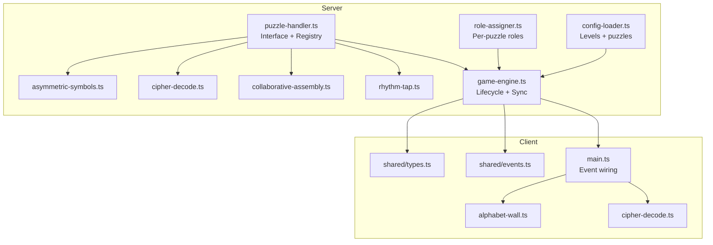

**Diagram sources**
- [puzzle-handler.ts](file://src/server/puzzles/puzzle-handler.ts#L1-L57)
- [asymmetric-symbols.ts](file://src/server/puzzles/asymmetric-symbols.ts#L1-L156)
- [cipher-decode.ts](file://src/server/puzzles/cipher-decode.ts#L1-L142)
- [collaborative-assembly.ts](file://src/server/puzzles/collaborative-assembly.ts#L1-L218)
- [rhythm-tap.ts](file://src/server/puzzles/rhythm-tap.ts#L1-L134)
- [game-engine.ts](file://src/server/services/game-engine.ts#L1-L711)
- [role-assigner.ts](file://src/server/services/role-assigner.ts#L1-L78)
- [config-loader.ts](file://src/server/utils/config-loader.ts#L1-L135)
- [types.ts](file://shared/types.ts#L1-L187)
- [events.ts](file://shared/events.ts#L1-L228)
- [main.ts](file://src/client/main.ts#L1-L266)
- [alphabet-wall.ts](file://src/client/puzzles/alphabet-wall.ts#L1-L239)
- [cipher-decode.ts](file://src/client/puzzles/cipher-decode.ts#L1-L152)

**Section sources**
- [puzzle-handler.ts](file://src/server/puzzles/puzzle-handler.ts#L1-L57)
- [register.ts](file://src/server/puzzles/register.ts#L1-L21)
- [game-engine.ts](file://src/server/services/game-engine.ts#L1-L711)
- [role-assigner.ts](file://src/server/services/role-assigner.ts#L1-L78)
- [config-loader.ts](file://src/server/utils/config-loader.ts#L1-L135)
- [types.ts](file://shared/types.ts#L1-L187)
- [events.ts](file://shared/events.ts#L1-L228)
- [main.ts](file://src/client/main.ts#L1-L266)

## Core Components
- PuzzleHandler interface: Defines the contract for all puzzle types—initialization, action handling, win checking, and per-player view generation.
- Registry: Centralized storage keyed by puzzle type, enabling dynamic lookup by the game engine.
- GameEngine: Manages the full lifecycle—briefing, start, action processing, win detection, transitions, and end-of-game scoring.
- RoleAssigner: Shuffles players and assigns roles per puzzle according to layout definitions.
- Shared types and events: Define state, enums, payloads, and the canonical event names used across server and client.

Key responsibilities:
- Base handler contract: init, handleAction, checkWin, getPlayerView
- State management: PuzzleState holds puzzleId, type, status, and a typed data bag
- Client-server synchronization: Server computes state and per-role views; client renders role-specific UI
- Role-based visibility: getPlayerView filters data by player role
- Lifecycle: startGame → briefing → startPuzzle → handlePuzzleAction → checkWin → handlePuzzleComplete → next puzzle or victory

**Section sources**
- [puzzle-handler.ts](file://src/server/puzzles/puzzle-handler.ts#L12-L44)
- [types.ts](file://shared/types.ts#L72-L83)
- [game-engine.ts](file://src/server/services/game-engine.ts#L263-L319)
- [role-assigner.ts](file://src/server/services/role-assigner.ts#L24-L77)
- [events.ts](file://shared/events.ts#L28-L90)

## Architecture Overview
The system follows a modular, extensible pattern:
- Handlers implement the PuzzleHandler interface and are registered under a unique type
- The game engine selects a handler by type from the level’s puzzle configuration
- Roles are assigned per puzzle; each player receives a PlayerView tailored to their role
- Actions are processed server-side; the engine broadcasts updates and checks win conditions

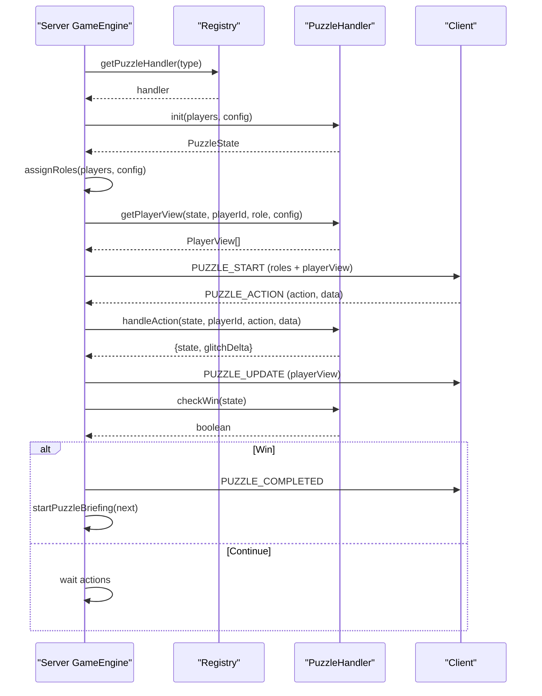

**Diagram sources**
- [game-engine.ts](file://src/server/services/game-engine.ts#L263-L383)
- [puzzle-handler.ts](file://src/server/puzzles/puzzle-handler.ts#L46-L56)
- [asymmetric-symbols.ts](file://src/server/puzzles/asymmetric-symbols.ts#L18-L101)
- [cipher-decode.ts](file://src/server/puzzles/cipher-decode.ts#L18-L94)
- [collaborative-assembly.ts](file://src/server/puzzles/collaborative-assembly.ts#L31-L145)
- [rhythm-tap.ts](file://src/server/puzzles/rhythm-tap.ts#L19-L105)

## Detailed Component Analysis

### Puzzle Handler Interface and Registry
- Interface defines four methods: init, handleAction, checkWin, getPlayerView
- Registry stores handlers by type and exposes registration and retrieval functions
- Registration occurs centrally in the register module, importing each handler and registering under a stable type string

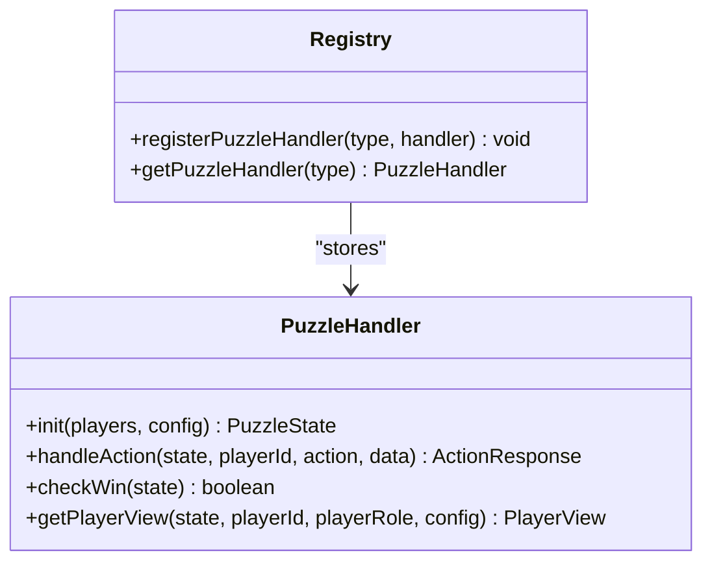

**Diagram sources**
- [puzzle-handler.ts](file://src/server/puzzles/puzzle-handler.ts#L12-L56)

**Section sources**
- [puzzle-handler.ts](file://src/server/puzzles/puzzle-handler.ts#L12-L56)
- [register.ts](file://src/server/puzzles/register.ts#L1-L21)

### Game Engine Lifecycle and Synchronization
- startGame validates level, initializes room state, starts global timer, and triggers level intro or immediate briefing
- startPuzzleBriefing prepares the next puzzle and waits for players to be ready
- startPuzzle loads the handler, assigns roles, initializes state, and sends role-specific views to clients
- handlePuzzleAction applies actions, updates state, applies glitch penalties, and broadcasts updates
- checkWin triggers handlePuzzleComplete, advances to next puzzle or ends the game
- syncPlayer ensures late/joined players receive current context and their view
- Persistent state is updated via room-manager and persisted to backing store

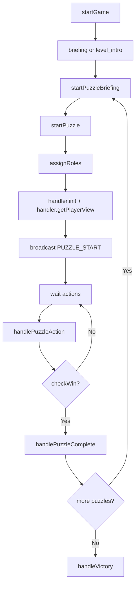

**Diagram sources**
- [game-engine.ts](file://src/server/services/game-engine.ts#L57-L139)
- [game-engine.ts](file://src/server/services/game-engine.ts#L169-L236)
- [game-engine.ts](file://src/server/services/game-engine.ts#L263-L319)
- [game-engine.ts](file://src/server/services/game-engine.ts#L324-L383)
- [game-engine.ts](file://src/server/services/game-engine.ts#L388-L424)
- [game-engine.ts](file://src/server/services/game-engine.ts#L488-L521)

**Section sources**
- [game-engine.ts](file://src/server/services/game-engine.ts#L57-L139)
- [game-engine.ts](file://src/server/services/game-engine.ts#L169-L236)
- [game-engine.ts](file://src/server/services/game-engine.ts#L263-L319)
- [game-engine.ts](file://src/server/services/game-engine.ts#L324-L383)
- [game-engine.ts](file://src/server/services/game-engine.ts#L388-L424)
- [game-engine.ts](file://src/server/services/game-engine.ts#L488-L521)

### Role-Based Visibility and Asymmetric Information
- Roles are assigned per puzzle using a deterministic shuffle and layout definitions
- getPlayerView returns a PlayerView containing role-specific viewData
- Clients render distinct UIs depending on role (e.g., Cryptographer sees cipher key; Scribes decode)

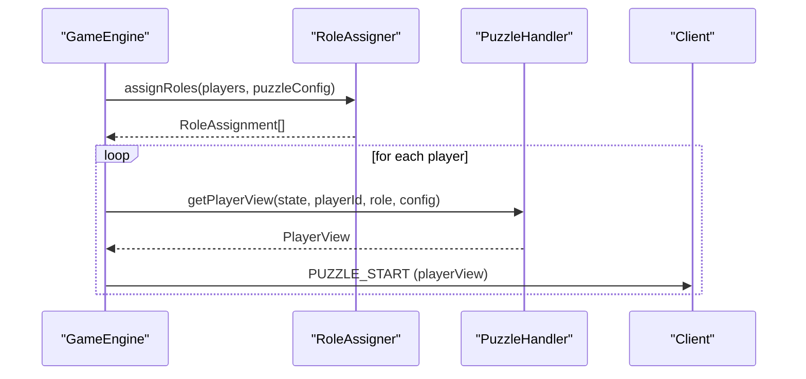

**Diagram sources**
- [role-assigner.ts](file://src/server/services/role-assigner.ts#L24-L77)
- [asymmetric-symbols.ts](file://src/server/puzzles/asymmetric-symbols.ts#L103-L154)
- [cipher-decode.ts](file://src/server/puzzles/cipher-decode.ts#L96-L141)

**Section sources**
- [role-assigner.ts](file://src/server/services/role-assigner.ts#L24-L77)
- [asymmetric-symbols.ts](file://src/server/puzzles/asymmetric-symbols.ts#L103-L154)
- [cipher-decode.ts](file://src/server/puzzles/cipher-decode.ts#L96-L141)

### Client-Server Synchronization and Rendering
- Client listens to ServerEvents and updates HUD, theme, and puzzle screens
- On PUZZLE_START, client renders the puzzle UI using the provided PlayerView
- On PUZZLE_UPDATE, client refreshes UI elements reflecting the latest viewData
- Client emits PUZZLE_ACTION events for user interactions

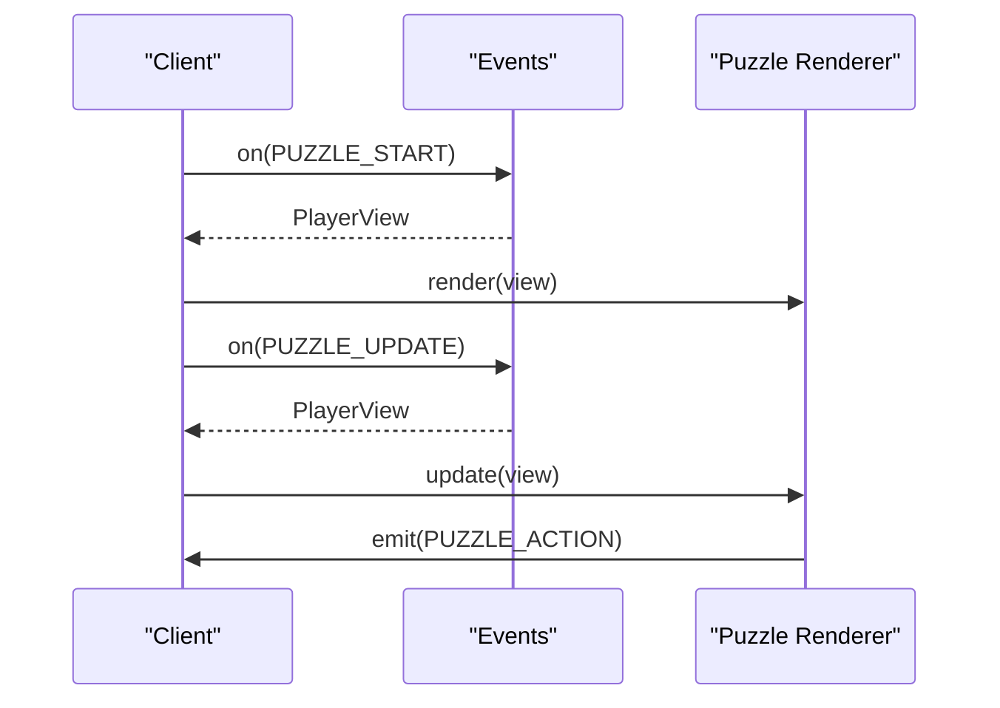

**Diagram sources**
- [main.ts](file://src/client/main.ts#L142-L206)
- [alphabet-wall.ts](file://src/client/puzzles/alphabet-wall.ts#L11-L33)
- [cipher-decode.ts](file://src/client/puzzles/cipher-decode.ts#L10-L20)

**Section sources**
- [main.ts](file://src/client/main.ts#L142-L206)
- [alphabet-wall.ts](file://src/client/puzzles/alphabet-wall.ts#L11-L33)
- [cipher-decode.ts](file://src/client/puzzles/cipher-decode.ts#L10-L20)

### Example Handlers and Data Models

#### Asymmetric Symbols
- Purpose: Players capture letters to spell words; Navigator sees targets, Decoder sees capture state
- Data model includes solution words, current word index, captured letters, wrong captures, completed words
- Actions: capture_letter increments progress or increases glitch on mistakes
- Win condition: all selected words completed

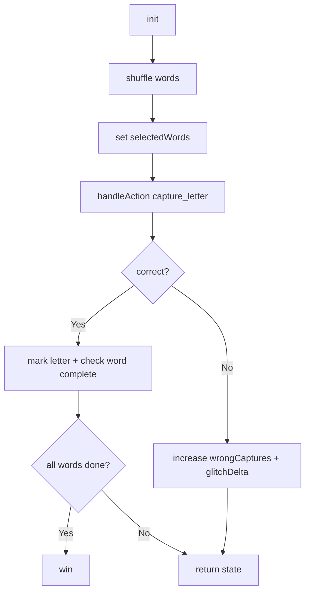

**Diagram sources**
- [asymmetric-symbols.ts](file://src/server/puzzles/asymmetric-symbols.ts#L19-L101)

**Section sources**
- [asymmetric-symbols.ts](file://src/server/puzzles/asymmetric-symbols.ts#L9-L156)

#### Cipher Decode
- Purpose: Cryptographer shares cipher key; Scribes decode sentences
- Data model includes cipherKey, sentences, current sentence index, attempts, wrong submissions
- Actions: submit_decode compares against decoded text
- Win condition: completedSentences reaches total

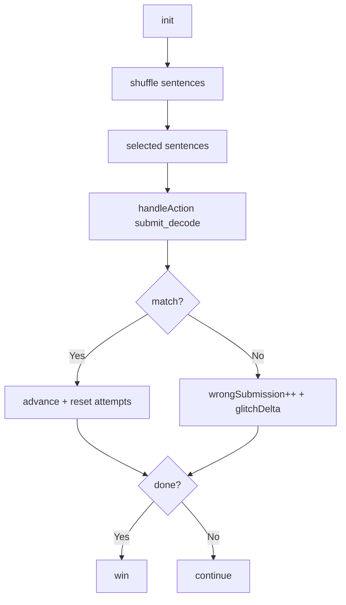

**Diagram sources**
- [cipher-decode.ts](file://src/server/puzzles/cipher-decode.ts#L19-L94)

**Section sources**
- [cipher-decode.ts](file://src/server/puzzles/cipher-decode.ts#L9-L142)

#### Collaborative Assembly
- Purpose: Each player owns unique pieces; assemble correct positions and rotations
- Data model tracks grid size, pieces with ownership and positions, placed counts
- Actions: rotate_piece, place_piece, remove_piece
- Win condition: all pieces placed correctly

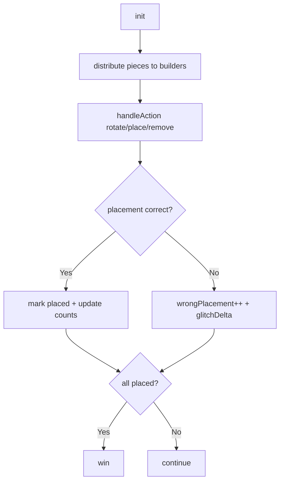

**Diagram sources**
- [collaborative-assembly.ts](file://src/server/puzzles/collaborative-assembly.ts#L32-L145)

**Section sources**
- [collaborative-assembly.ts](file://src/server/puzzles/collaborative-assembly.ts#L10-L218)

#### Rhythm Tap
- Purpose: Tap colors in sync to a sequence; Hoplite tracks successes
- Data model includes sequences, current round, hoplite stats, current sequence
- Actions: submit_sequence validates order
- Win condition: hopliteSuccesses meets roundsToWin

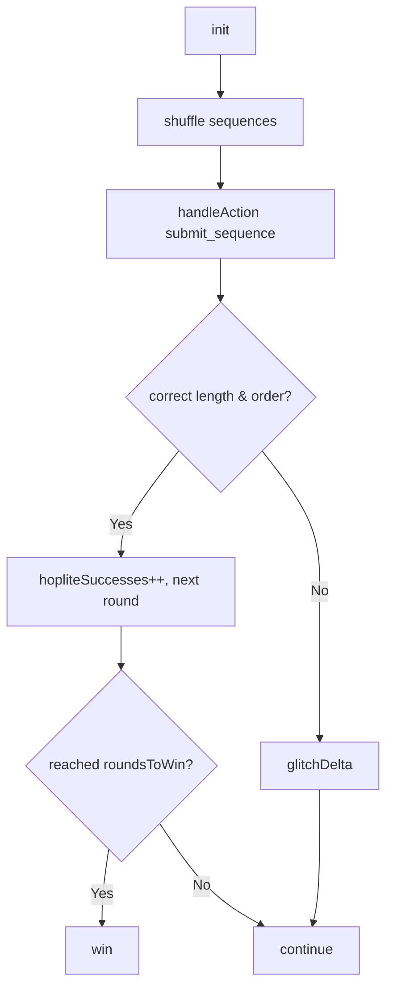

**Diagram sources**
- [rhythm-tap.ts](file://src/server/puzzles/rhythm-tap.ts#L20-L105)

**Section sources**
- [rhythm-tap.ts](file://src/server/puzzles/rhythm-tap.ts#L9-L134)

### Implementing a Custom Puzzle Handler and Registration Workflow
Steps to add a new puzzle:
1. Create a new handler module implementing the PuzzleHandler interface
   - Define a data model for your puzzle state
   - Implement init to seed state from config
   - Implement handleAction to mutate state and compute glitchDelta
   - Implement checkWin to detect completion
   - Implement getPlayerView to return role-specific viewData
2. Export your handler as a constant
3. Register your handler in the central registry by importing and calling registerPuzzleHandler with a unique type string
4. Add a puzzle entry to your level YAML with type matching the registered type and appropriate layout and data fields
5. On the client, create a renderer that consumes PlayerView.viewData and emits PUZZLE_ACTION events

Registration example references:
- Central registry import and registration calls
- Type strings align with PuzzleType enum and level configs

**Section sources**
- [puzzle-handler.ts](file://src/server/puzzles/puzzle-handler.ts#L12-L56)
- [register.ts](file://src/server/puzzles/register.ts#L1-L21)
- [types.ts](file://shared/types.ts#L85-L93)

## Dependency Analysis
- GameEngine depends on:
  - Config loader for level metadata
  - Role assigner for per-puzzle roles
  - Registry for handler lookup
  - Shared types and events for payloads
- Handlers depend on shared types for state and view contracts
- Client depends on shared types and events for rendering and emitting actions

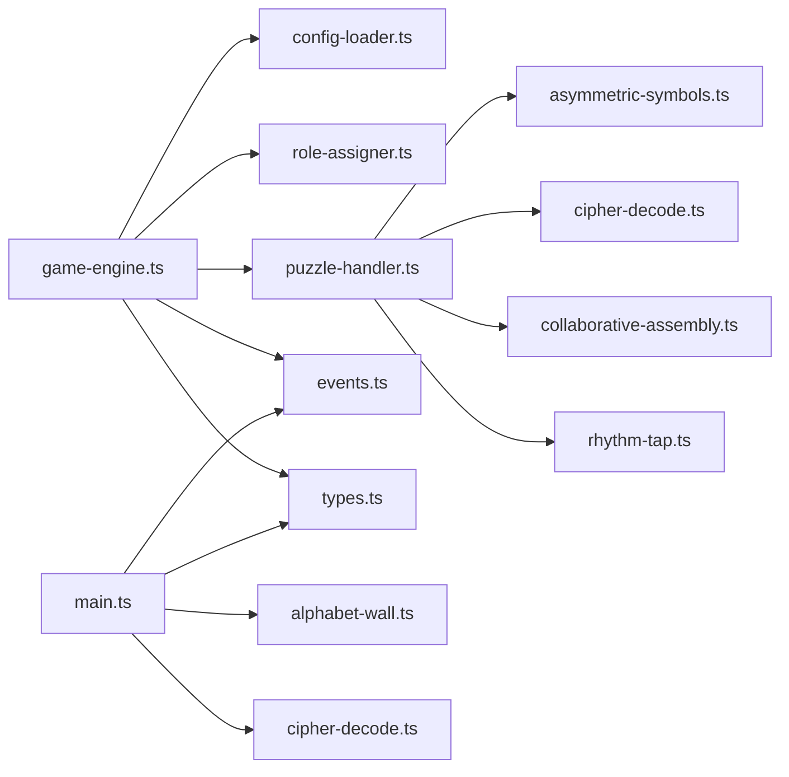

**Diagram sources**
- [game-engine.ts](file://src/server/services/game-engine.ts#L40-L46)
- [config-loader.ts](file://src/server/utils/config-loader.ts#L1-L135)
- [role-assigner.ts](file://src/server/services/role-assigner.ts#L1-L78)
- [puzzle-handler.ts](file://src/server/puzzles/puzzle-handler.ts#L1-L57)
- [asymmetric-symbols.ts](file://src/server/puzzles/asymmetric-symbols.ts#L1-L156)
- [cipher-decode.ts](file://src/server/puzzles/cipher-decode.ts#L1-L142)
- [collaborative-assembly.ts](file://src/server/puzzles/collaborative-assembly.ts#L1-L218)
- [rhythm-tap.ts](file://src/server/puzzles/rhythm-tap.ts#L1-L134)
- [main.ts](file://src/client/main.ts#L1-L266)
- [alphabet-wall.ts](file://src/client/puzzles/alphabet-wall.ts#L1-L239)
- [cipher-decode.ts](file://src/client/puzzles/cipher-decode.ts#L1-L152)
- [events.ts](file://shared/events.ts#L1-L228)
- [types.ts](file://shared/types.ts#L1-L187)

**Section sources**
- [game-engine.ts](file://src/server/services/game-engine.ts#L40-L46)
- [puzzle-handler.ts](file://src/server/puzzles/puzzle-handler.ts#L46-L56)
- [register.ts](file://src/server/puzzles/register.ts#L5-L21)

## Performance Considerations
- Handler computations occur on the server; keep state minimal and avoid heavy synchronous work in handleAction
- Use incremental view updates on the client to reduce DOM churn
- Debounce frequent client-side UI updates (e.g., timers) to prevent unnecessary re-renders
- Persist room state efficiently; consider offloading persistence to a database or cache as indicated by TODO comments
- Keep viewData concise; only transmit role-relevant fields to minimize bandwidth

## Troubleshooting Guide
Common issues and remedies:
- No handler found for puzzle type: Verify the type string matches registration and level config
- Player not receiving role view: Confirm role assignment occurred and getPlayerView returns a view for the player’s role
- Stuck in briefing: Ensure all players press ready and the ready count reaches total players
- Timer glitches: Check timer persistence and resumption logic on server restart
- Client not updating: Confirm event handlers are wired and PlayerView updates are applied in the renderer

**Section sources**
- [game-engine.ts](file://src/server/services/game-engine.ts#L268-L272)
- [game-engine.ts](file://src/server/services/game-engine.ts#L207-L236)
- [game-engine.ts](file://src/server/services/game-engine.ts#L570-L596)

## Conclusion
The puzzle architecture provides a clean, extensible foundation for building diverse cooperative and asymmetric experiences. The centralized handler interface and registry enable straightforward addition of new puzzle types, while the game engine manages lifecycle, roles, and client synchronization. By adhering to the handler contract and leveraging role-based visibility, developers can implement engaging puzzles that scale with level configurations and enhance team coordination.

## Appendices

### Data Model Overview
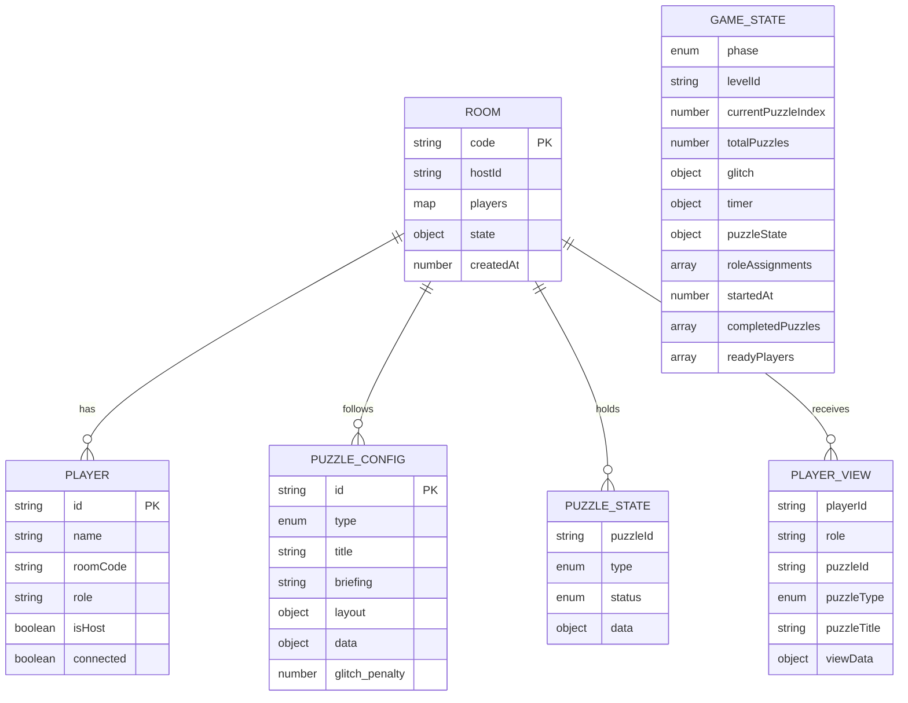

**Diagram sources**
- [types.ts](file://shared/types.ts#L7-L187)