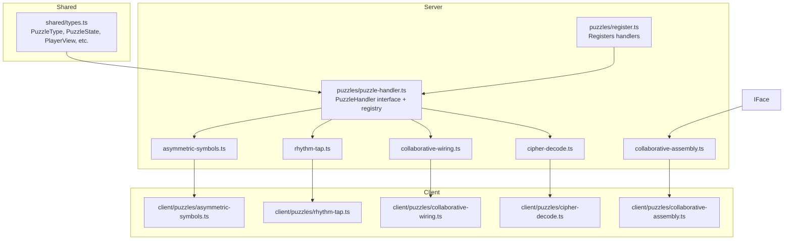
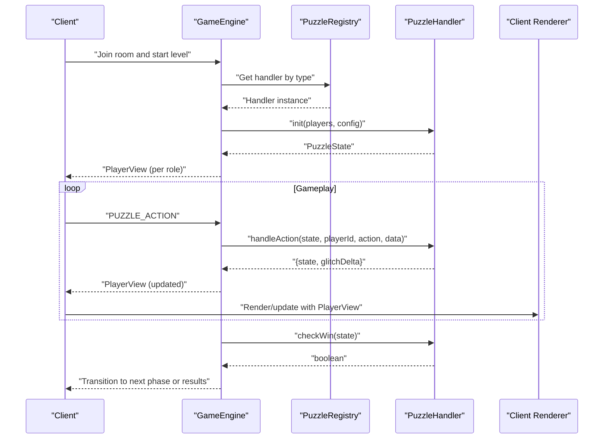
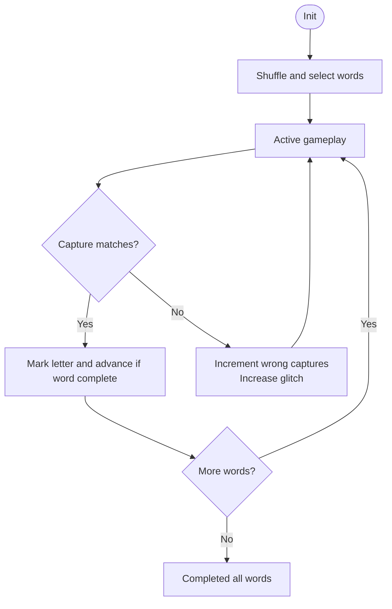
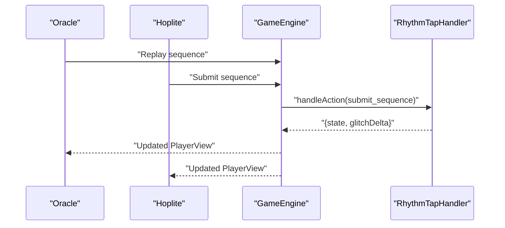
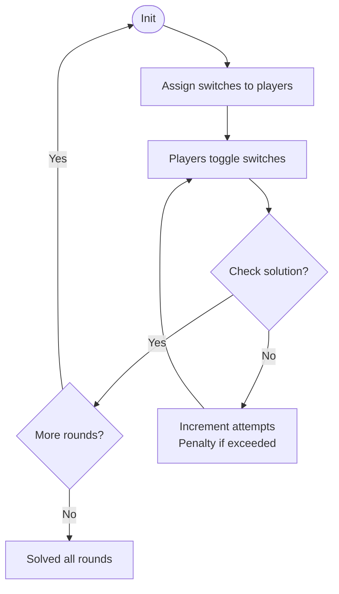
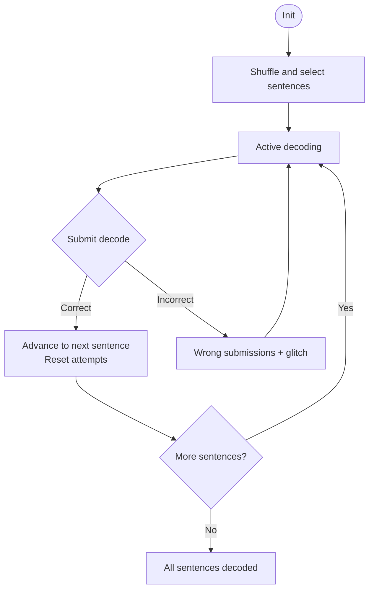
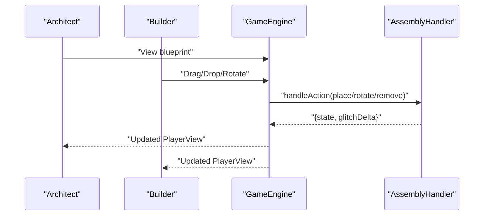
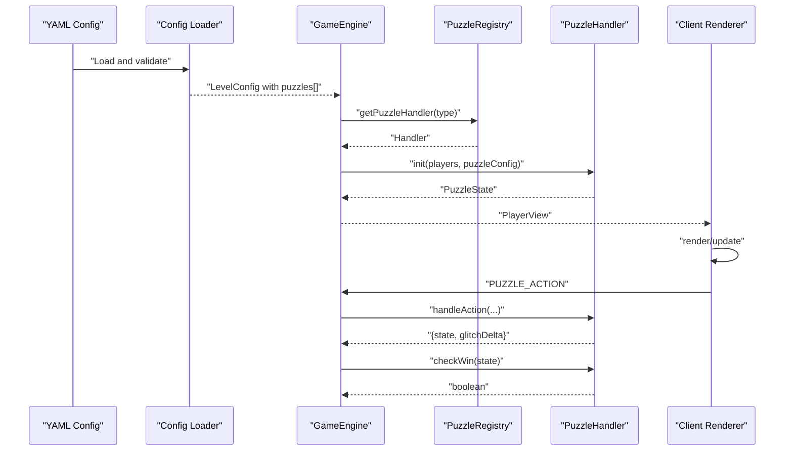
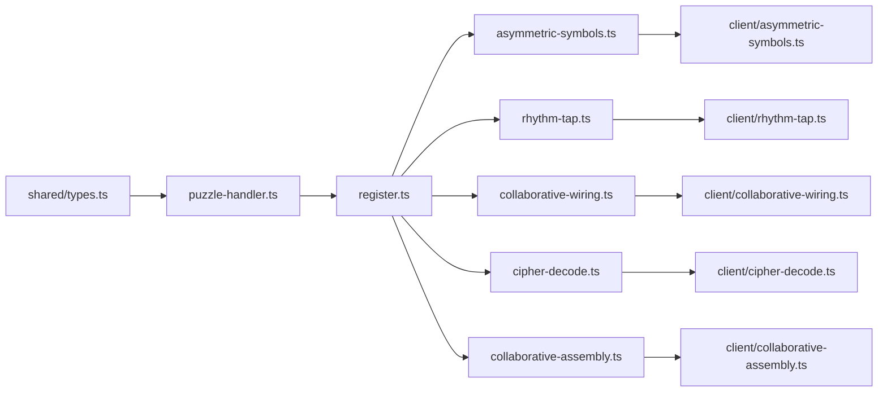

# Puzzle System

<cite>
**Referenced Files in This Document**
- [ARCHITECTURE.md](file://ARCHITECTURE.md)
- [README.md](file://README.md)
- [config/SCHEMA.md](file://config/SCHEMA.md)
- [shared/types.ts](file://shared/types.ts)
- [src/server/puzzles/puzzle-handler.ts](file://src/server/puzzles/puzzle-handler.ts)
- [src/server/puzzles/register.ts](file://src/server/puzzles/register.ts)
- [src/server/puzzles/asymmetric-symbols.ts](file://src/server/puzzles/asymmetric-symbols.ts)
- [src/server/puzzles/rhythm-tap.ts](file://src/server/puzzles/rhythm-tap.ts)
- [src/server/puzzles/collaborative-wiring.ts](file://src/server/puzzles/collaborative-wiring.ts)
- [src/server/puzzles/cipher-decode.ts](file://src/server/puzzles/cipher-decode.ts)
- [src/server/puzzles/collaborative-assembly.ts](file://src/server/puzzles/collaborative-assembly.ts)
- [src/client/puzzles/asymmetric-symbols.ts](file://src/client/puzzles/asymmetric-symbols.ts)
- [src/client/puzzles/rhythm-tap.ts](file://src/client/puzzles/rhythm-tap.ts)
- [src/client/puzzles/collaborative-wiring.ts](file://src/client/puzzles/collaborative-wiring.ts)
- [src/client/puzzles/cipher-decode.ts](file://src/client/puzzles/cipher-decode.ts)
- [src/client/puzzles/collaborative-assembly.ts](file://src/client/puzzles/collaborative-assembly.ts)
</cite>

## Table of Contents
1. [Introduction](#introduction)
2. [Project Structure](#project-structure)
3. [Core Components](#core-components)
4. [Architecture Overview](#architecture-overview)
5. [Detailed Component Analysis](#detailed-component-analysis)
6. [Dependency Analysis](#dependency-analysis)
7. [Performance Considerations](#performance-considerations)
8. [Troubleshooting Guide](#troubleshooting-guide)
9. [Conclusion](#conclusion)
10. [Appendices](#appendices)

## Introduction
This document explains the puzzle system architecture and implementation for Project ODYSSEY. It covers the extensible puzzle handler interface, the registration system, the five puzzle types currently implemented, the lifecycle from configuration to client rendering, the role-based visibility system, puzzle state management and validation, integration with the game engine, the configuration schema for custom puzzles, and the development workflow for adding new puzzle types.

## Project Structure
The puzzle system is organized around a shared contract (the PuzzleHandler interface) and a registry that binds puzzle types to implementations. Server-side handlers encapsulate state and logic, while client-side renderers consume role-specific view data to present UIs tailored to each player’s perspective.



**Diagram sources**
- [shared/types.ts](file://shared/types.ts#L85-L93)
- [src/server/puzzles/puzzle-handler.ts](file://src/server/puzzles/puzzle-handler.ts#L12-L44)
- [src/server/puzzles/register.ts](file://src/server/puzzles/register.ts#L14-L20)
- [src/server/puzzles/asymmetric-symbols.ts](file://src/server/puzzles/asymmetric-symbols.ts#L18-L52)
- [src/server/puzzles/rhythm-tap.ts](file://src/server/puzzles/rhythm-tap.ts#L19-L56)
- [src/server/puzzles/collaborative-wiring.ts](file://src/server/puzzles/collaborative-wiring.ts#L23-L92)
- [src/server/puzzles/cipher-decode.ts](file://src/server/puzzles/cipher-decode.ts#L18-L53)
- [src/server/puzzles/collaborative-assembly.ts](file://src/server/puzzles/collaborative-assembly.ts#L31-L86)
- [src/client/puzzles/asymmetric-symbols.ts](file://src/client/puzzles/asymmetric-symbols.ts#L28-L41)
- [src/client/puzzles/rhythm-tap.ts](file://src/client/puzzles/rhythm-tap.ts#L14-L23)
- [src/client/puzzles/collaborative-wiring.ts](file://src/client/puzzles/collaborative-wiring.ts#L10-L21)
- [src/client/puzzles/cipher-decode.ts](file://src/client/puzzles/cipher-decode.ts#L10-L21)
- [src/client/puzzles/collaborative-assembly.ts](file://src/client/puzzles/collaborative-assembly.ts#L24-L31)

**Section sources**
- [ARCHITECTURE.md](file://ARCHITECTURE.md#L35-L107)
- [README.md](file://README.md#L79-L98)

## Core Components
- PuzzleHandler interface: Defines the contract for all puzzle types: initialization, action handling, win checking, and role-based view computation.
- Registry: A centralized Map that registers handlers by type and exposes lookup by type.
- PuzzleType enum: Centralized enumeration of supported puzzle types.
- PuzzleState: Generic container for puzzle-specific state plus metadata.
- PlayerView: Role-scoped view data delivered to the client for rendering.

Key responsibilities:
- Extensibility: Adding a new puzzle requires implementing the interface and registering it.
- Role-based visibility: getPlayerView returns different viewData per role.
- State isolation: Each handler maintains its own typed state.

**Section sources**
- [src/server/puzzles/puzzle-handler.ts](file://src/server/puzzles/puzzle-handler.ts#L12-L44)
- [src/server/puzzles/puzzle-handler.ts](file://src/server/puzzles/puzzle-handler.ts#L46-L56)
- [shared/types.ts](file://shared/types.ts#L85-L93)
- [shared/types.ts](file://shared/types.ts#L72-L77)
- [shared/types.ts](file://shared/types.ts#L157-L164)

## Architecture Overview
The system follows a pluggable architecture:
- The server loads level configurations and assigns roles per puzzle.
- The game engine invokes the registered handler for each puzzle to initialize state, process actions, and check completion.
- Handlers compute role-specific views and return them to the client.
- The client renders the appropriate UI for each role.



**Diagram sources**
- [src/server/puzzles/puzzle-handler.ts](file://src/server/puzzles/puzzle-handler.ts#L12-L44)
- [src/server/puzzles/register.ts](file://src/server/puzzles/register.ts#L14-L20)
- [shared/types.ts](file://shared/types.ts#L72-L77)
- [shared/types.ts](file://shared/types.ts#L157-L164)

## Detailed Component Analysis

### Extensible Puzzle Handler Interface and Registration
- Interface: init, handleAction, checkWin, getPlayerView.
- Registry: registerPuzzleHandler(type, handler) and getPuzzleHandler(type).
- Registration: All handlers are imported and registered in register.ts.

```mermaid
classDiagram
class PuzzleHandler {
+init(players, config) PuzzleState
+handleAction(state, playerId, action, data) {state, glitchDelta}
+checkWin(state) boolean
+getPlayerView(state, playerId, playerRole, config) PlayerView
}
class Registry {
+registerPuzzleHandler(type, handler) void
+getPuzzleHandler(type) PuzzleHandler
}
class AsymmetricSymbolsHandler
class RhythmTapHandler
class WiringHandler
class CipherDecodeHandler
class AssemblyHandler
Registry --> PuzzleHandler : "stores"
AsymmetricSymbolsHandler ..|> PuzzleHandler
RhythmTapHandler ..|> PuzzleHandler
WiringHandler ..|> PuzzleHandler
CipherDecodeHandler ..|> PuzzleHandler
AssemblyHandler ..|> PuzzleHandler
```

**Diagram sources**
- [src/server/puzzles/puzzle-handler.ts](file://src/server/puzzles/puzzle-handler.ts#L12-L44)
- [src/server/puzzles/register.ts](file://src/server/puzzles/register.ts#L14-L20)
- [src/server/puzzles/asymmetric-symbols.ts](file://src/server/puzzles/asymmetric-symbols.ts#L18-L156)
- [src/server/puzzles/rhythm-tap.ts](file://src/server/puzzles/rhythm-tap.ts#L19-L134)
- [src/server/puzzles/collaborative-wiring.ts](file://src/server/puzzles/collaborative-wiring.ts#L23-L203)
- [src/server/puzzles/cipher-decode.ts](file://src/server/puzzles/cipher-decode.ts#L18-L142)
- [src/server/puzzles/collaborative-assembly.ts](file://src/server/puzzles/collaborative-assembly.ts#L31-L218)


**Section sources**
- [src/server/puzzles/puzzle-handler.ts](file://src/server/puzzles/puzzle-handler.ts#L12-L44)
- [src/server/puzzles/register.ts](file://src/server/puzzles/register.ts#L14-L20)

### Five Implemented Puzzle Types

#### Asymmetric Symbols
- Objective: One role (Navigator) sees solutions; others (Decoders) catch flying letters.
- State: Tracks selected words, current word index, captured letters, wrong captures, completed words.
- Actions: capture_letter updates progress; wrong captures incur glitch penalties.
- View: Navigator sees solution words and progress; Decoders see current word length and capture state.



**Diagram sources**
- [src/server/puzzles/asymmetric-symbols.ts](file://src/server/puzzles/asymmetric-symbols.ts#L19-L52)
- [src/server/puzzles/asymmetric-symbols.ts](file://src/server/puzzles/asymmetric-symbols.ts#L54-L96)
- [src/server/puzzles/asymmetric-symbols.ts](file://src/server/puzzles/asymmetric-symbols.ts#L98-L101)
- [src/server/puzzles/asymmetric-symbols.ts](file://src/server/puzzles/asymmetric-symbols.ts#L103-L154)

**Section sources**
- [src/server/puzzles/asymmetric-symbols.ts](file://src/server/puzzles/asymmetric-symbols.ts#L18-L156)
- [src/client/puzzles/asymmetric-symbols.ts](file://src/client/puzzles/asymmetric-symbols.ts#L28-L105)

#### Rhythm Tap
- Objective: Players tap colors in the correct sequence; one role (Oracle) shows the sequence, another (Hoplite) inputs.
- State: Sequences pool, current round, hoplite successes, current sequence.
- Actions: submit_sequence validates the sequence; correct advances rounds; incorrect incurs glitch penalty.
- View: Oracle can replay; Hoplite submits taps; progress tracked per round.



**Diagram sources**
- [src/server/puzzles/rhythm-tap.ts](file://src/server/puzzles/rhythm-tap.ts#L58-L100)
- [src/server/puzzles/rhythm-tap.ts](file://src/server/puzzles/rhythm-tap.ts#L102-L132)
- [src/client/puzzles/rhythm-tap.ts](file://src/client/puzzles/rhythm-tap.ts#L14-L83)

**Section sources**
- [src/server/puzzles/rhythm-tap.ts](file://src/server/puzzles/rhythm-tap.ts#L19-L134)
- [src/client/puzzles/rhythm-tap.ts](file://src/client/puzzles/rhythm-tap.ts#L14-L168)

#### Collaborative Wiring
- Objective: Toggle switches to power all columns; distributed among players.
- State: Grid size, switch states, solution matrices, assignments, columns lit, attempts, rounds.
- Actions: toggle_switch (only own switches), check_solution (verifies columns lit).
- View: Shows own switches, column states, attempts, rounds.



**Diagram sources**
- [src/server/puzzles/collaborative-wiring.ts](file://src/server/puzzles/collaborative-wiring.ts#L24-L92)
- [src/server/puzzles/collaborative-wiring.ts](file://src/server/puzzles/collaborative-wiring.ts#L94-L140)
- [src/server/puzzles/collaborative-wiring.ts](file://src/server/puzzles/collaborative-wiring.ts#L142-L173)
- [src/server/puzzles/collaborative-wiring.ts](file://src/server/puzzles/collaborative-wiring.ts#L179-L200)

**Section sources**
- [src/server/puzzles/collaborative-wiring.ts](file://src/server/puzzles/collaborative-wiring.ts#L23-L203)
- [src/client/puzzles/collaborative-wiring.ts](file://src/client/puzzles/collaborative-wiring.ts#L10-L121)

#### Cipher Decode
- Objective: One role (Cryptographer) sees the key; others (Scribes) decode encrypted sentences.
- State: Cipher key, sentences, current index, completed sentences, wrong submissions, attempts per player.
- Actions: submit_decode compares against decoded text; correct advances; incorrect incurs penalty.
- View: Cryptographer sees key and hint; Scribes see encrypted text and their attempts.



**Diagram sources**
- [src/server/puzzles/cipher-decode.ts](file://src/server/puzzles/cipher-decode.ts#L19-L53)
- [src/server/puzzles/cipher-decode.ts](file://src/server/puzzles/cipher-decode.ts#L55-L89)
- [src/server/puzzles/cipher-decode.ts](file://src/server/puzzles/cipher-decode.ts#L91-L140)

**Section sources**
- [src/server/puzzles/cipher-decode.ts](file://src/server/puzzles/cipher-decode.ts#L18-L142)
- [src/client/puzzles/cipher-decode.ts](file://src/client/puzzles/cipher-decode.ts#L10-L152)

#### Collaborative Assembly
- Objective: Drag-and-drop fragments onto a grid; each player owns specific pieces.
- State: Grid dimensions, pieces with owners, positions, rotations, placed counts.
- Actions: place_piece (owner only, correct position+rotation), rotate_piece, remove_piece.
- View: Architect sees blueprint; Builders see their pieces and progress.



**Diagram sources**
- [src/server/puzzles/collaborative-assembly.ts](file://src/server/puzzles/collaborative-assembly.ts#L88-L140)
- [src/server/puzzles/collaborative-assembly.ts](file://src/server/puzzles/collaborative-assembly.ts#L142-L152)
- [src/server/puzzles/collaborative-assembly.ts](file://src/server/puzzles/collaborative-assembly.ts#L155-L216)
- [src/client/puzzles/collaborative-assembly.ts](file://src/client/puzzles/collaborative-assembly.ts#L24-L151)

**Section sources**
- [src/server/puzzles/collaborative-assembly.ts](file://src/server/puzzles/collaborative-assembly.ts#L31-L218)
- [src/client/puzzles/collaborative-assembly.ts](file://src/client/puzzles/collaborative-assembly.ts#L24-L183)

### Puzzle Lifecycle: Configuration to Client Rendering
- Configuration loading: Levels are defined in YAML and validated; each puzzle entry includes type, layout, and data.
- Registration: Handlers are registered by type; the engine retrieves handlers by type.
- Initialization: init creates typed state from config and players.
- Action handling: handleAction mutates state and returns glitch deltas.
- Completion: checkWin determines victory.
- Role-based view: getPlayerView computes per-role viewData.
- Client rendering: Client renderers receive PlayerView and update UI accordingly.



**Diagram sources**
- [config/SCHEMA.md](file://config/SCHEMA.md#L33-L68)
- [src/server/puzzles/register.ts](file://src/server/puzzles/register.ts#L14-L20)
- [src/server/puzzles/puzzle-handler.ts](file://src/server/puzzles/puzzle-handler.ts#L46-L56)
- [shared/types.ts](file://shared/types.ts#L129-L143)
- [shared/types.ts](file://shared/types.ts#L72-L77)
- [shared/types.ts](file://shared/types.ts#L157-L164)

**Section sources**
- [config/SCHEMA.md](file://config/SCHEMA.md#L1-L117)
- [ARCHITECTURE.md](file://ARCHITECTURE.md#L181-L189)

### Role-Based Visibility System
- Layout: Each puzzle defines roles in its YAML layout.
- Assignment: Roles are assigned per puzzle by the role assignment service.
- getPlayerView: Returns different viewData depending on the player’s role, enforcing asymmetric information.
- Client: Renderers branch on role to show the appropriate UI.

Examples:
- Asymmetric Symbols: Navigator sees solutions; Decoders see capture state.
- Cipher Decode: Cryptographer sees key; Scribes see encrypted text.
- Collaborative Assembly: Architect sees blueprint; Builders see their pieces.

**Section sources**
- [config/SCHEMA.md](file://config/SCHEMA.md#L54-L64)
- [src/server/puzzles/asymmetric-symbols.ts](file://src/server/puzzles/asymmetric-symbols.ts#L103-L154)
- [src/server/puzzles/cipher-decode.ts](file://src/server/puzzles/cipher-decode.ts#L96-L140)
- [src/server/puzzles/collaborative-assembly.ts](file://src/server/puzzles/collaborative-assembly.ts#L147-L216)


### Puzzle State Management and Validation
- State shape: PuzzleState holds puzzleId, type, status, and data (typed by handler).
- Validation: YAML schema validates puzzle entries (type, layout, data).
- Win condition: Each handler implements checkWin deterministically.
- Glitch integration: Handlers return glitchDelta for mistakes; engine applies penalties.

**Section sources**
- [shared/types.ts](file://shared/types.ts#L72-L77)
- [config/SCHEMA.md](file://config/SCHEMA.md#L33-L68)
- [src/server/puzzles/asymmetric-symbols.ts](file://src/server/puzzles/asymmetric-symbols.ts#L98-L101)
- [src/server/puzzles/rhythm-tap.ts](file://src/server/puzzles/rhythm-tap.ts#L102-L105)
- [src/server/puzzles/collaborative-wiring.ts](file://src/server/puzzles/collaborative-wiring.ts#L142-L145)
- [src/server/puzzles/cipher-decode.ts](file://src/server/puzzles/cipher-decode.ts#L91-L94)
- [src/server/puzzles/collaborative-assembly.ts](file://src/server/puzzles/collaborative-assembly.ts#L142-L145)


### Integration with the Game Engine
- The engine drives transitions and invokes handlers generically via the registry.
- The engine also manages global state (glitch, timer) and coordinates with repositories and services.

**Section sources**
- [ARCHITECTURE.md](file://ARCHITECTURE.md#L111-L123)
- [ARCHITECTURE.md](file://ARCHITECTURE.md#L181-L189)

## Dependency Analysis
- Shared types define the contract for handlers, states, and views.
- Server handlers depend on shared types and are registered centrally.
- Client renderers depend on shared types and consume PlayerView.
- The engine depends on the registry and handlers to operate.



**Diagram sources**
- [shared/types.ts](file://shared/types.ts#L85-L93)
- [src/server/puzzles/puzzle-handler.ts](file://src/server/puzzles/puzzle-handler.ts#L12-L44)
- [src/server/puzzles/register.ts](file://src/server/puzzles/register.ts#L14-L20)
- [src/server/puzzles/asymmetric-symbols.ts](file://src/server/puzzles/asymmetric-symbols.ts#L18-L156)
- [src/server/puzzles/rhythm-tap.ts](file://src/server/puzzles/rhythm-tap.ts#L19-L134)
- [src/server/puzzles/collaborative-wiring.ts](file://src/server/puzzles/collaborative-wiring.ts#L23-L203)
- [src/server/puzzles/cipher-decode.ts](file://src/server/puzzles/cipher-decode.ts#L18-L142)
- [src/server/puzzles/collaborative-assembly.ts](file://src/server/puzzles/collaborative-assembly.ts#L31-L218)

- [src/client/puzzles/asymmetric-symbols.ts](file://src/client/puzzles/asymmetric-symbols.ts#L28-L105)
- [src/client/puzzles/rhythm-tap.ts](file://src/client/puzzles/rhythm-tap.ts#L14-L83)
- [src/client/puzzles/collaborative-wiring.ts](file://src/client/puzzles/collaborative-wiring.ts#L10-L65)
- [src/client/puzzles/cipher-decode.ts](file://src/client/puzzles/cipher-decode.ts#L10-L112)
- [src/client/puzzles/collaborative-assembly.ts](file://src/client/puzzles/collaborative-assembly.ts#L24-L100)

**Section sources**
- [shared/types.ts](file://shared/types.ts#L85-L93)
- [src/server/puzzles/register.ts](file://src/server/puzzles/register.ts#L14-L20)

## Performance Considerations
- Client-side deterministic randomness: Some renderers use seeded PRNGs for synchronized letter/spawn generation.
- Optimistic UI updates: Wiring toggles and assembly rotations update immediately and reconcile on server confirmation.
- Minimal state updates: Handlers return only necessary state and glitchDelta; clients update only changed DOM nodes.

**Section sources**
- [src/client/puzzles/asymmetric-symbols.ts](file://src/client/puzzles/asymmetric-symbols.ts#L21-L26)
- [src/client/puzzles/collaborative-wiring.ts](file://src/client/puzzles/collaborative-wiring.ts#L67-L77)
- [src/client/puzzles/collaborative-assembly.ts](file://src/client/puzzles/collaborative-assembly.ts#L111-L142)

## Troubleshooting Guide
- Handler not found: Verify the type string matches a registered handler and that the handler is imported and registered.
- Incorrect view data: Ensure getPlayerView returns the correct fields for the role and that the client renderer expects them.
- Action not applied: Confirm the action name and data shape match the handler’s expectations; check ownership constraints (e.g., wiring switch ownership).
- Win condition not triggered: Verify checkWin logic and that the engine calls it after each action.
- YAML errors: Validate against the schema; ensure required fields (type, layout, data) are present and correctly typed.

**Section sources**
- [src/server/puzzles/register.ts](file://src/server/puzzles/register.ts#L14-L20)
- [config/SCHEMA.md](file://config/SCHEMA.md#L33-L68)
- [src/server/puzzles/collaborative-wiring.ts](file://src/server/puzzles/collaborative-wiring.ts#L103-L110)
- [src/server/puzzles/asymmetric-symbols.ts](file://src/server/puzzles/asymmetric-symbols.ts#L63-L96)
- [src/server/puzzles/cipher-decode.ts](file://src/server/puzzles/cipher-decode.ts#L64-L89)

## Conclusion
The puzzle system is modular, data-driven, and role-aware. The extensible handler interface and central registry enable rapid iteration and experimentation. With clear separation between server logic and client rendering, teams can add new puzzle types quickly while maintaining consistent UX and gameplay mechanics.

## Appendices

### Configuration Schema for Custom Puzzles
- Level-level fields: id, title, story, min_players, max_players, timer_seconds, glitch, theme_css, puzzles, audio_cues.
- Puzzle-level fields: id, type, title, briefing, glitch_penalty, layout, data, audio_cues.
- Valid puzzle types include asymmetric_symbols, rhythm_tap, collaborative_wiring, cipher_decode, collaborative_assembly.
- Per-type data fields are documented in the schema for each puzzle.

**Section sources**
- [config/SCHEMA.md](file://config/SCHEMA.md#L1-L117)

### Development Workflow for New Puzzle Types
- Implement the server handler: create a new file under src/server/puzzles implementing the PuzzleHandler interface.
- Register the handler: add import and registerPuzzleHandler in src/server/puzzles/register.ts.
- Extend types: add the new type to PuzzleType in shared/types.ts.
- Implement client renderer: create a renderer under src/client/puzzles with renderX and updateX functions.
- Wire client dispatch: add a case in the client puzzle dispatcher to route by type.
- Configure YAML: add a puzzle entry in your level YAML with type, layout, and data.
- Style: add puzzle-specific CSS under src/client/styles/puzzles.css.

**Section sources**
- [ARCHITECTURE.md](file://ARCHITECTURE.md#L154-L163)
- [README.md](file://README.md#L122-L131)