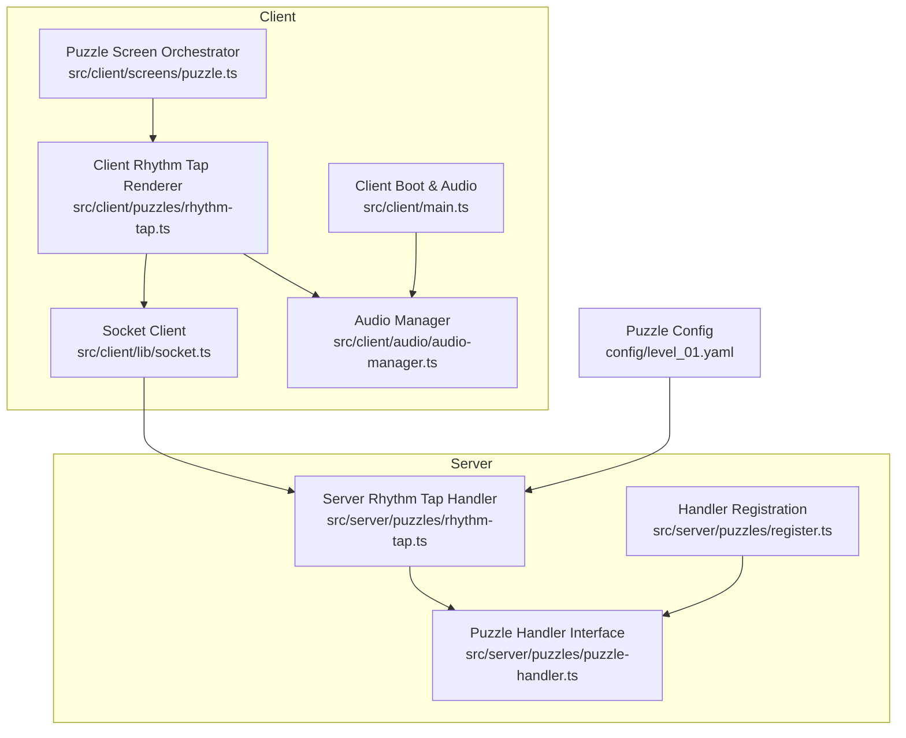
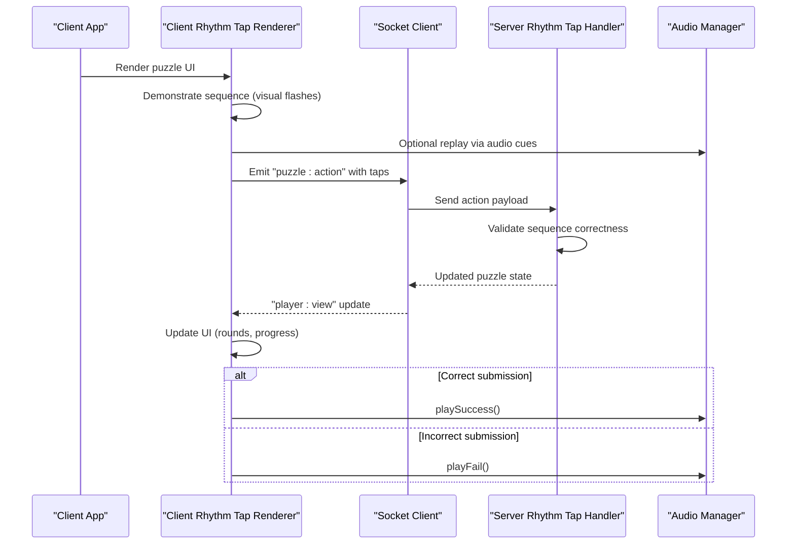
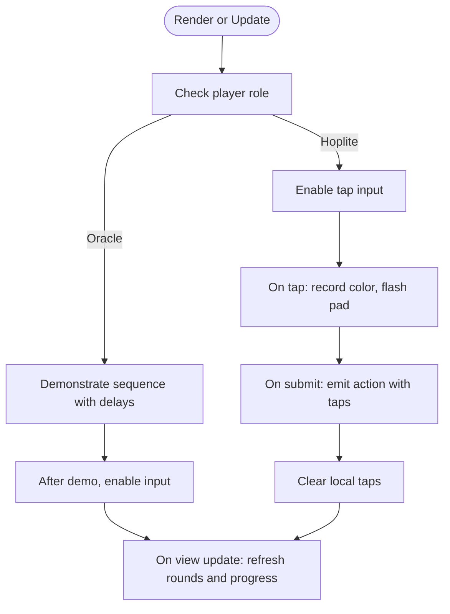
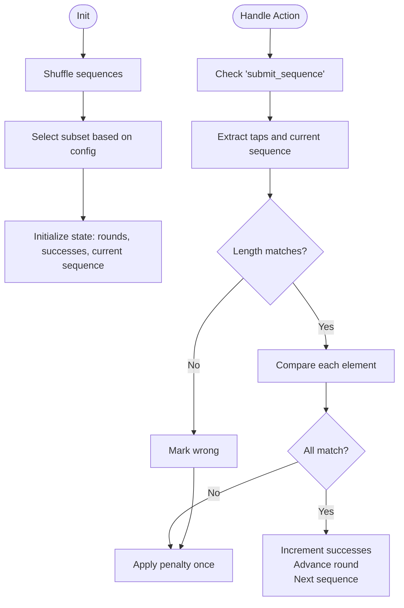
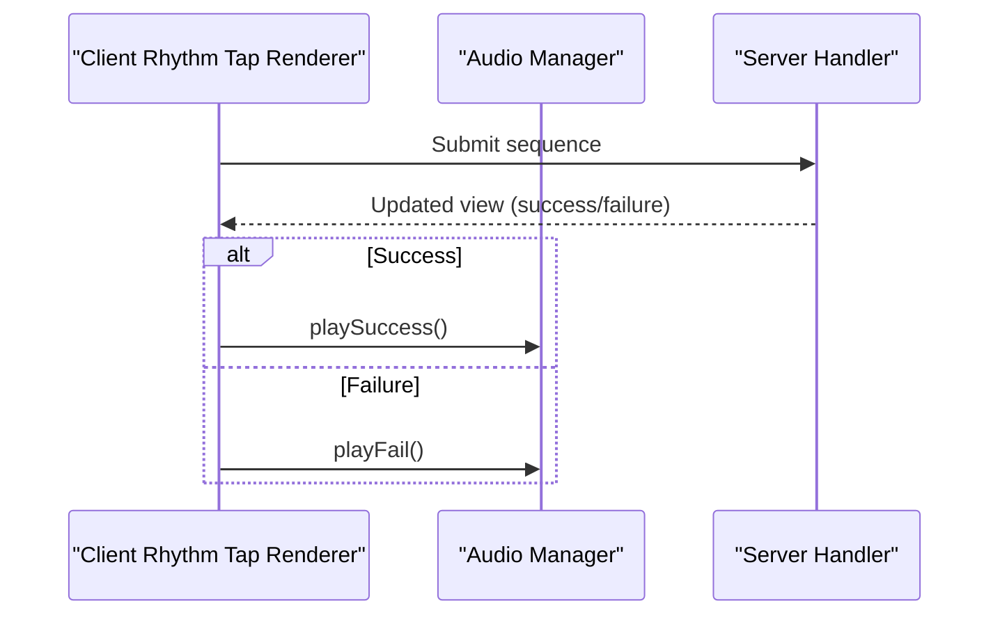
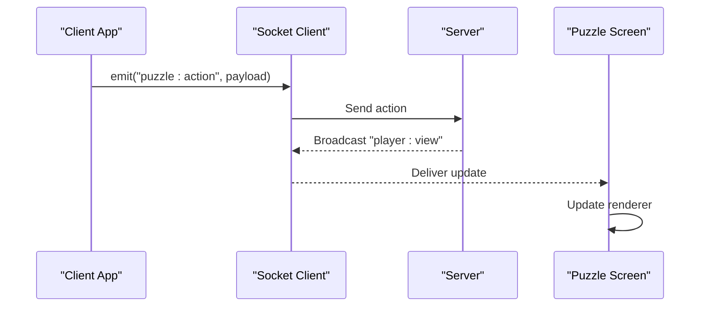
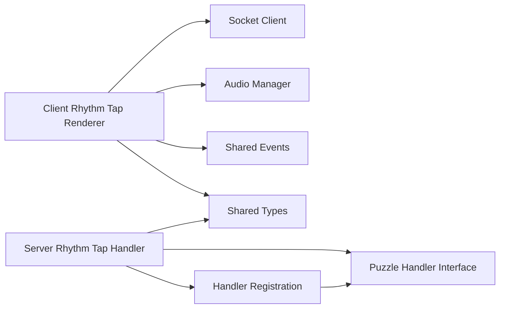

# Rhythm Tap Puzzle

<cite>
**Referenced Files in This Document**
- [rhythm-tap.ts](file://src/client/puzzles/rhythm-tap.ts)
- [rhythm-tap.ts](file://src/server/puzzles/rhythm-tap.ts)
- [audio-manager.ts](file://src/client/audio/audio-manager.ts)
- [socket.ts](file://src/client/lib/socket.ts)
- [events.ts](file://shared/events.ts)
- [types.ts](file://shared/types.ts)
- [puzzle.ts](file://src/client/screens/puzzle.ts)
- [register.ts](file://src/server/puzzles/register.ts)
- [puzzle-handler.ts](file://src/server/puzzles/puzzle-handler.ts)
- [level_01.yaml](file://config/level_01.yaml)
- [main.ts](file://src/client/main.ts)
</cite>

## Table of Contents
1. [Introduction](#introduction)
2. [Project Structure](#project-structure)
3. [Core Components](#core-components)
4. [Architecture Overview](#architecture-overview)
5. [Detailed Component Analysis](#detailed-component-analysis)
6. [Dependency Analysis](#dependency-analysis)
7. [Performance Considerations](#performance-considerations)
8. [Troubleshooting Guide](#troubleshooting-guide)
9. [Conclusion](#conclusion)
10. [Appendices](#appendices)

## Introduction
The Rhythm Tap puzzle is a timing-based collaborative challenge where players synchronize button presses to match a demonstrated sequence. It enforces precise timing through a demonstration mode, role-based interaction (Oracle and Hoplite), and server-side correctness checks. The client renders a visual rhythm interface, handles user interactions, and triggers audio feedback. The server validates submissions, advances rounds, and tracks win conditions.

## Project Structure
The Rhythm Tap implementation spans client and server layers:
- Client-side rendering and interaction live under src/client/puzzles/rhythm-tap.ts.
- Server-side puzzle logic resides under src/server/puzzles/rhythm-tap.ts.
- Audio feedback is centralized in src/client/audio/audio-manager.ts.
- Real-time communication uses Socket.io via src/client/lib/socket.ts and shared event definitions in shared/events.ts.
- The puzzle screen orchestrator in src/client/screens/puzzle.ts mounts the rhythm-tap renderer.
- Server-side handler registration is defined in src/server/puzzles/register.ts and the base interface in src/server/puzzles/puzzle-handler.ts.
- Configuration for the puzzle appears in config/level_01.yaml.
- Global audio preloading and background music orchestration are handled in src/client/main.ts.

**Diagram sources**
- [rhythm-tap.ts](file://src/client/puzzles/rhythm-tap.ts#L1-L168)
- [audio-manager.ts](file://src/client/audio/audio-manager.ts#L1-L407)
- [socket.ts](file://src/client/lib/socket.ts#L1-L85)
- [puzzle.ts](file://src/client/screens/puzzle.ts#L1-L101)
- [rhythm-tap.ts](file://src/server/puzzles/rhythm-tap.ts#L1-L134)
- [register.ts](file://src/server/puzzles/register.ts#L1-L21)
- [puzzle-handler.ts](file://src/server/puzzles/puzzle-handler.ts#L1-L57)
- [level_01.yaml](file://config/level_01.yaml#L100-L130)
- [main.ts](file://src/client/main.ts#L1-L266)

**Section sources**
- [rhythm-tap.ts](file://src/client/puzzles/rhythm-tap.ts#L1-L168)
- [rhythm-tap.ts](file://src/server/puzzles/rhythm-tap.ts#L1-L134)
- [audio-manager.ts](file://src/client/audio/audio-manager.ts#L1-L407)
- [socket.ts](file://src/client/lib/socket.ts#L1-L85)
- [events.ts](file://shared/events.ts#L1-L228)
- [types.ts](file://shared/types.ts#L1-L187)
- [puzzle.ts](file://src/client/screens/puzzle.ts#L1-L101)
- [register.ts](file://src/server/puzzles/register.ts#L1-L21)
- [puzzle-handler.ts](file://src/server/puzzles/puzzle-handler.ts#L1-L57)
- [level_01.yaml](file://config/level_01.yaml#L100-L130)
- [main.ts](file://src/client/main.ts#L1-L266)

## Core Components
- Client Rhythm Tap Renderer: Renders the puzzle UI, manages role-specific controls, plays demonstration sequences, and submits user taps.
- Server Rhythm Tap Handler: Initializes puzzle state, validates submissions, advances rounds, and computes win condition.
- Audio Manager: Provides procedural and file-based audio feedback for success/failure and ambient cues.
- Socket Client: Encapsulates Socket.io communication and typed event emission/reception.
- Puzzle Screen Orchestrator: Routes to the correct renderer based on the active puzzle type.
- Handler Registration and Interface: Registers puzzle handlers and defines the lifecycle contract.
- Configuration: Defines sequences, timing parameters, and difficulty metadata for the puzzle.

Key responsibilities:
- Client: UI rendering, visual feedback (flashes), user input capture, and event emission.
- Server: Deterministic sequence validation, round progression, and win state computation.
- Audio: Immediate feedback for correct/incorrect actions and background music orchestration.

**Section sources**
- [rhythm-tap.ts](file://src/client/puzzles/rhythm-tap.ts#L14-L168)
- [rhythm-tap.ts](file://src/server/puzzles/rhythm-tap.ts#L19-L134)
- [audio-manager.ts](file://src/client/audio/audio-manager.ts#L142-L187)
- [socket.ts](file://src/client/lib/socket.ts#L51-L57)
- [puzzle.ts](file://src/client/screens/puzzle.ts#L23-L101)
- [register.ts](file://src/server/puzzles/register.ts#L14-L21)
- [puzzle-handler.ts](file://src/server/puzzles/puzzle-handler.ts#L12-L44)
- [level_01.yaml](file://config/level_01.yaml#L117-L125)

## Architecture Overview
The Rhythm Tap puzzle follows a client-server split:
- Client renders the puzzle and captures user input.
- Client emits actions to the server via Socket.io.
- Server validates the submission and broadcasts updated views.
- Audio feedback is triggered locally on the client.

**Diagram sources**
- [rhythm-tap.ts](file://src/client/puzzles/rhythm-tap.ts#L85-L126)
- [socket.ts](file://src/client/lib/socket.ts#L51-L57)
- [rhythm-tap.ts](file://src/server/puzzles/rhythm-tap.ts#L58-L100)
- [audio-manager.ts](file://src/client/audio/audio-manager.ts#L142-L187)
- [events.ts](file://shared/events.ts#L28-L51)

## Detailed Component Analysis

### Client Rhythm Tap Renderer
Responsibilities:
- Build UI for Oracle and Hoplite roles.
- Demonstrate sequences with timed visual flashes.
- Capture Hoplite taps and submit them to the server.
- Update UI state on puzzle view changes.

Key behaviors:
- Role-aware rendering: Oracle sees a replay button; Hoplite sees input controls.
- Timed playback: Demonstrations schedule flashes with configurable speed.
- Submission: Emits a typed action event with collected taps.

**Diagram sources**
- [rhythm-tap.ts](file://src/client/puzzles/rhythm-tap.ts#L14-L83)
- [rhythm-tap.ts](file://src/client/puzzles/rhythm-tap.ts#L85-L126)
- [rhythm-tap.ts](file://src/client/puzzles/rhythm-tap.ts#L128-L168)

**Section sources**
- [rhythm-tap.ts](file://src/client/puzzles/rhythm-tap.ts#L14-L168)

### Server Rhythm Tap Handler
Responsibilities:
- Initialize puzzle state with shuffled sequences and target rounds.
- Validate submitted sequences against the current sequence.
- Advance rounds and track successes.
- Compute win condition based on rounds to win.

Validation logic:
- Length check followed by element-wise comparison.
- Penalty applied once per incorrect submission.

**Diagram sources**
- [rhythm-tap.ts](file://src/server/puzzles/rhythm-tap.ts#L20-L56)
- [rhythm-tap.ts](file://src/server/puzzles/rhythm-tap.ts#L58-L100)
- [rhythm-tap.ts](file://src/server/puzzles/rhythm-tap.ts#L102-L105)

**Section sources**
- [rhythm-tap.ts](file://src/server/puzzles/rhythm-tap.ts#L19-L134)

### Audio Feedback System
The client’s audio manager provides:
- Procedural sounds for success and failure.
- Ambient background music orchestration.
- Preloading and global mute support.

Integration points:
- Success and failure sounds are triggered by the client renderer upon receiving updated views.
- Background music is managed globally and can be toggled.

**Diagram sources**
- [audio-manager.ts](file://src/client/audio/audio-manager.ts#L142-L187)
- [rhythm-tap.ts](file://src/client/puzzles/rhythm-tap.ts#L116-L126)

**Section sources**
- [audio-manager.ts](file://src/client/audio/audio-manager.ts#L142-L187)
- [main.ts](file://src/client/main.ts#L16-L33)

### Real-Time Communication and Synchronization
- Client emits typed actions using the Socket client wrapper.
- Server responds with updated player views.
- The puzzle screen orchestrator mounts the correct renderer and applies updates.

**Diagram sources**
- [socket.ts](file://src/client/lib/socket.ts#L51-L57)
- [events.ts](file://shared/events.ts#L28-L51)
- [puzzle.ts](file://src/client/screens/puzzle.ts#L31-L33)

**Section sources**
- [socket.ts](file://src/client/lib/socket.ts#L1-L85)
- [events.ts](file://shared/events.ts#L28-L51)
- [puzzle.ts](file://src/client/screens/puzzle.ts#L23-L101)

### Progressive Difficulty and Scoring
- Difficulty is controlled by:
  - Playback speed for demonstrations.
  - Tolerance for timing variance.
  - Number of rounds to win.
- Scoring:
  - Success increments hoplite successes; reaching rounds-to-win completes the puzzle.
- Penalty:
  - Incorrect submissions incur a fixed glitch penalty.

Configuration highlights:
- Sequences, playback speed, tolerance, rounds to play/wins, and glitch penalty are defined in the level configuration.

**Section sources**
- [rhythm-tap.ts](file://src/server/puzzles/rhythm-tap.ts#L19-L56)
- [rhythm-tap.ts](file://src/server/puzzles/rhythm-tap.ts#L102-L105)
- [level_01.yaml](file://config/level_01.yaml#L117-L125)

### Integration with Audio System
- The client boot process preloads common sounds and exposes background music controls.
- The rhythm renderer triggers success/failure sounds based on server feedback.
- Background music is orchestrated around puzzle start/end and game phases.

**Section sources**
- [main.ts](file://src/client/main.ts#L64-L66)
- [main.ts](file://src/client/main.ts#L164-L189)
- [audio-manager.ts](file://src/client/audio/audio-manager.ts#L351-L361)

## Dependency Analysis
The Rhythm Tap puzzle depends on:
- Client renderer depending on DOM helpers, socket client, and audio manager.
- Server handler depending on shared types and the puzzle handler interface.
- Global audio orchestration and handler registration.

**Diagram sources**
- [rhythm-tap.ts](file://src/client/puzzles/rhythm-tap.ts#L5-L8)
- [socket.ts](file://src/client/lib/socket.ts#L5-L7)
- [events.ts](file://shared/events.ts#L14-L24)
- [types.ts](file://shared/types.ts#L6-L22)
- [rhythm-tap.ts](file://src/server/puzzles/rhythm-tap.ts#L6-L8)
- [puzzle-handler.ts](file://src/server/puzzles/puzzle-handler.ts#L5-L6)
- [register.ts](file://src/server/puzzles/register.ts#L4-L21)

**Section sources**
- [rhythm-tap.ts](file://src/client/puzzles/rhythm-tap.ts#L5-L8)
- [rhythm-tap.ts](file://src/server/puzzles/rhythm-tap.ts#L6-L8)
- [puzzle-handler.ts](file://src/server/puzzles/puzzle-handler.ts#L46-L57)
- [register.ts](file://src/server/puzzles/register.ts#L14-L21)

## Performance Considerations
- Client-side rendering and DOM updates are minimal and focused on round and progress indicators.
- Timed demonstrations rely on setTimeout; ensure reasonable playback speeds to avoid excessive scheduling overhead.
- Audio decoding occurs on demand after user interaction to satisfy browser autoplay policies.
- Server-side validation is linear in sequence length; keep sequences reasonably sized for responsiveness.

## Troubleshooting Guide
Common issues and resolutions:
- Audio does not play:
  - Ensure the audio context is resumed on first user interaction.
  - Verify that sounds are preloaded and buffers decoded.
- Submissions not accepted:
  - Confirm the sequence length matches the target.
  - Verify element-wise order matches exactly.
- Visual feedback not appearing:
  - Check that pad IDs match the expected color identifiers.
  - Ensure the flash classes are applied and removed after the animation duration.
- Socket errors:
  - Confirm the socket is initialized and connected before emitting events.
  - Inspect connection logs for disconnect or error events.

**Section sources**
- [audio-manager.ts](file://src/client/audio/audio-manager.ts#L33-L54)
- [audio-manager.ts](file://src/client/audio/audio-manager.ts#L59-L85)
- [rhythm-tap.ts](file://src/client/puzzles/rhythm-tap.ts#L108-L126)
- [socket.ts](file://src/client/lib/socket.ts#L11-L41)

## Conclusion
The Rhythm Tap puzzle combines precise timing, role-based collaboration, and immediate audio feedback to deliver an engaging synchronized challenge. Its client-server design cleanly separates presentation and interaction from validation and state management, while configuration-driven parameters enable progressive difficulty and scoring. The modular audio and socket layers integrate seamlessly to provide responsive, immersive gameplay.

## Appendices

### Puzzle Configuration Examples
- Sequences: Define ordered color arrays for demonstration and validation.
- Playback speed: Controls delay between sequence steps.
- Rounds to win: Target number of successful rounds to complete the puzzle.
- Glitch penalty: Fixed penalty applied for incorrect submissions.

Example configuration references:
- [Sequences and rounds](file://config/level_01.yaml#L117-L125)
- [Playback speed and tolerance](file://config/level_01.yaml#L117-L125)

**Section sources**
- [level_01.yaml](file://config/level_01.yaml#L117-L125)