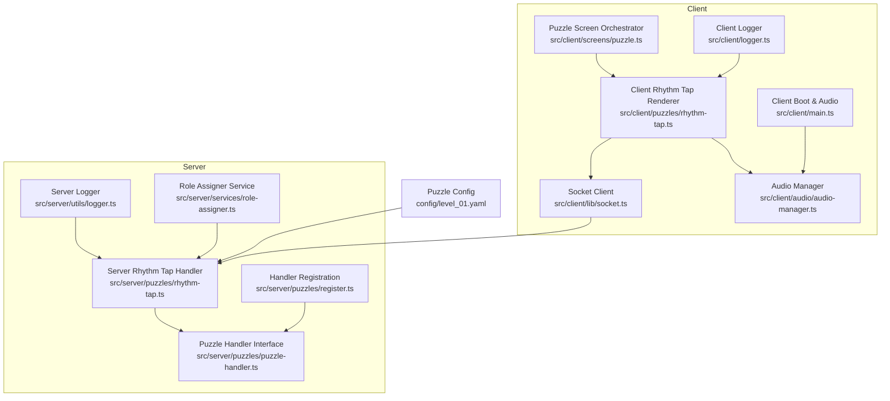
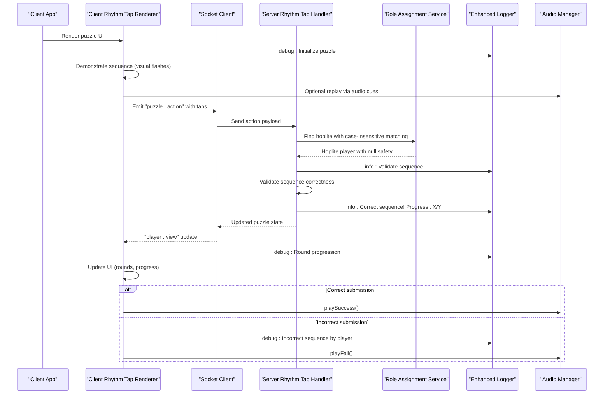
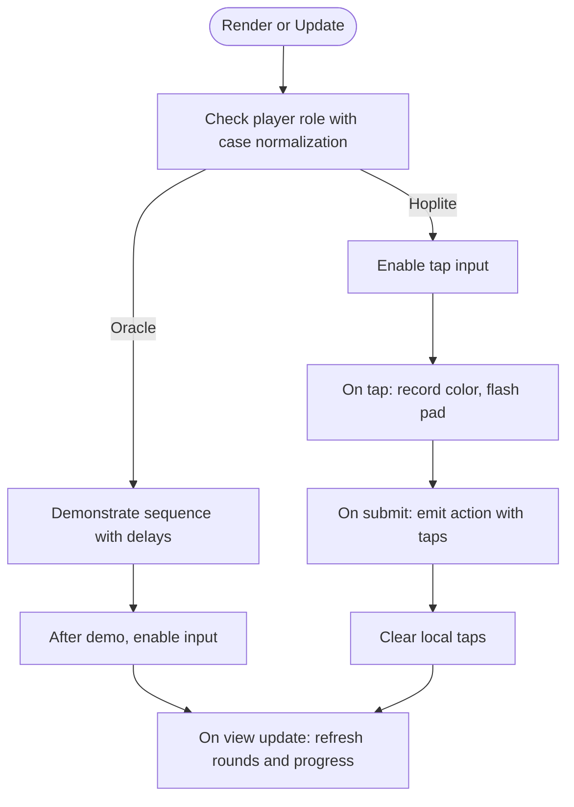
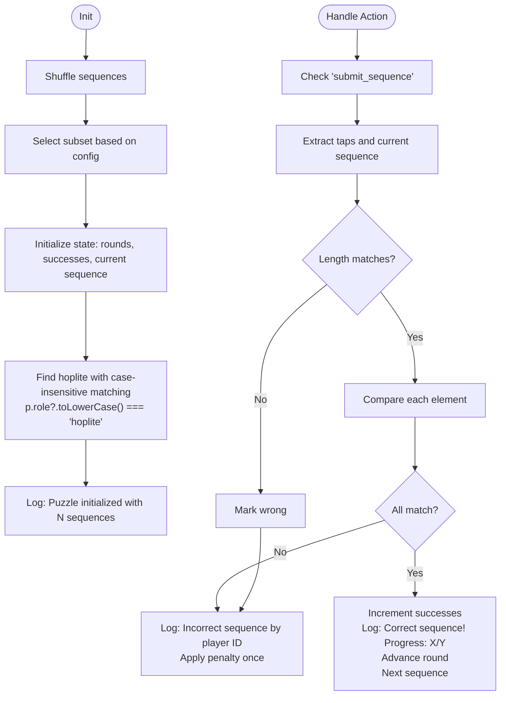
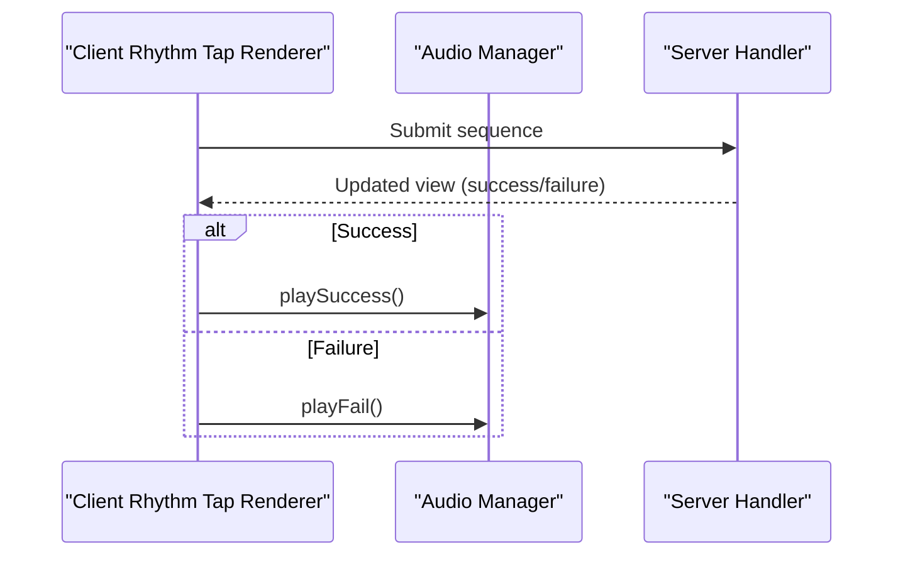
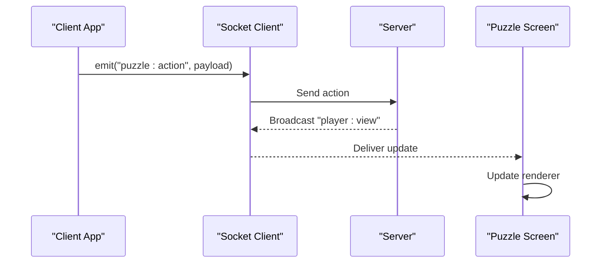
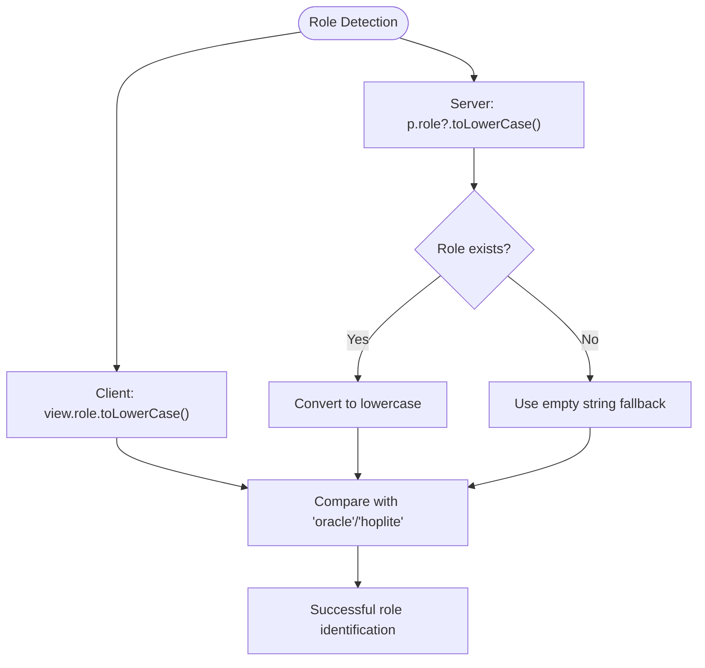
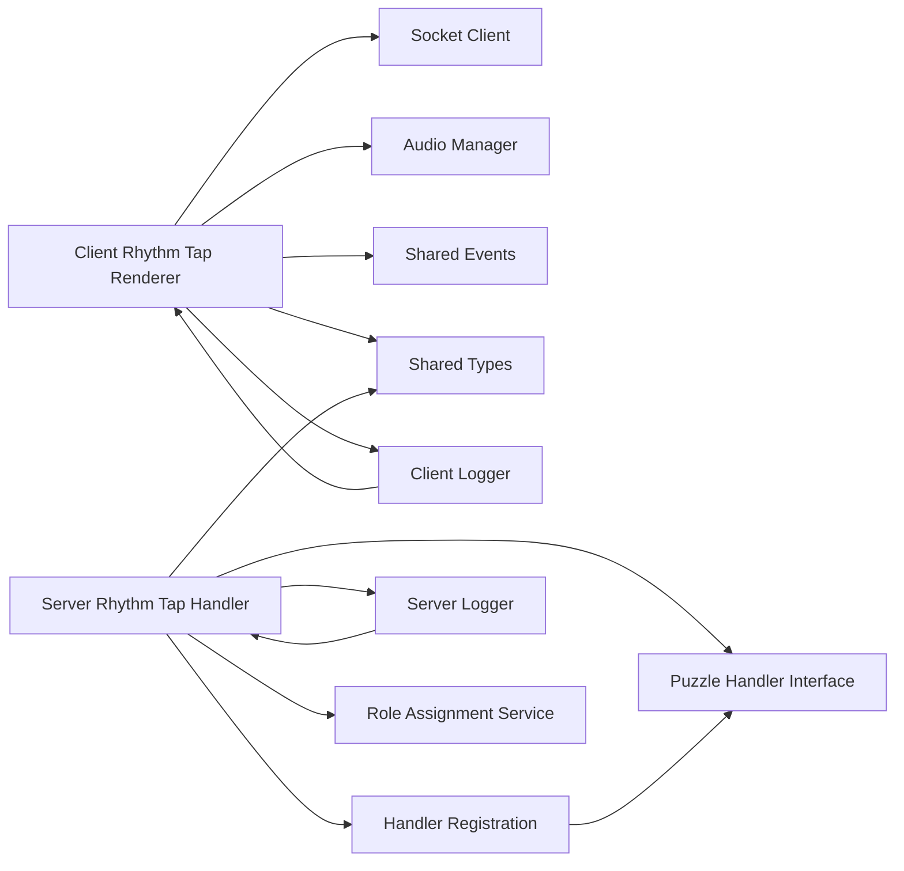

# Rhythm Tap Puzzle

<cite>
**Referenced Files in This Document**
- [rhythm-tap.ts](file://src/client/puzzles/rhythm-tap.ts)
- [rhythm-tap.ts](file://src/server/puzzles/rhythm-tap.ts)
- [audio-manager.ts](file://src/client/audio/audio-manager.ts)
- [socket.ts](file://src/client/lib/socket.ts)
- [events.ts](file://shared/events.ts)
- [types.ts](file://shared/types.ts)
- [puzzle.ts](file://src/client/screens/puzzle.ts)
- [register.ts](file://src/server/puzzles/register.ts)
- [puzzle-handler.ts](file://src/server/puzzles/puzzle-handler.ts)
- [role-assigner.ts](file://src/server/services/role-assigner.ts)
- [collaborative-assembly.ts](file://src/server/puzzles/collaborative-assembly.ts)
- [level_01.yaml](file://config/level_01.yaml)
- [main.ts](file://src/client/main.ts)
- [logger.ts](file://src/server/utils/logger.ts)
- [logger.ts](file://src/client/logger.ts)
- [logger.ts](file://shared/logger.ts)
</cite>

## Update Summary
**Changes Made**
- Enhanced role detection logic with case-insensitive matching and null safety for hoplite player identification
- Improved client-side role handling with consistent case-normalization
- Added robust null safety checks for player role properties across both client and server implementations
- Updated collaborative puzzle examples to demonstrate best practices for role detection

## Table of Contents
1. [Introduction](#introduction)
2. [Project Structure](#project-structure)
3. [Core Components](#core-components)
4. [Architecture Overview](#architecture-overview)
5. [Detailed Component Analysis](#detailed-component-analysis)
6. [Enhanced Role Detection System](#enhanced-role-detection-system)
7. [Enhanced Logging System](#enhanced-logging-system)
8. [Dependency Analysis](#dependency-analysis)
9. [Performance Considerations](#performance-considerations)
10. [Troubleshooting Guide](#troubleshooting-guide)
11. [Conclusion](#conclusion)
12. [Appendices](#appendices)

## Introduction
The Rhythm Tap puzzle is a timing-based collaborative challenge where players synchronize button presses to match a demonstrated sequence. It enforces precise timing through a demonstration mode, role-based interaction (Oracle and Hoplite), and server-side correctness checks. The client renders a visual rhythm interface, handles user interactions, and triggers audio feedback. The server validates submissions, advances rounds, and tracks win conditions.

**Updated** The puzzle now features enhanced role detection logic with case-insensitive matching and null safety for hoplite player identification, ensuring robust role-based functionality across different client implementations and preventing edge cases in role assignment.

## Project Structure
The Rhythm Tap implementation spans client and server layers:
- Client-side rendering and interaction live under src/client/puzzles/rhythm-tap.ts.
- Server-side puzzle logic resides under src/server/puzzles/rhythm-tap.ts.
- Audio feedback is centralized in src/client/audio/audio-manager.ts.
- Real-time communication uses Socket.io via src/client/lib/socket.ts and shared event definitions in shared/events.ts.
- The puzzle screen orchestrator in src/client/screens/puzzle.ts mounts the rhythm-tap renderer.
- Server-side handler registration is defined in src/server/puzzles/register.ts and the base interface in src/server/puzzles/puzzle-handler.ts.
- Role assignment service provides robust role detection with null safety in src/server/services/role-assigner.ts.
- Configuration for the puzzle appears in config/level_01.yaml.
- Global audio preloading and background music orchestration are handled in src/client/main.ts.
- Comprehensive logging infrastructure is provided by src/server/utils/logger.ts and shared across both client and server.

**Diagram sources**
- [rhythm-tap.ts](file://src/client/puzzles/rhythm-tap.ts#L1-L168)
- [audio-manager.ts](file://src/client/audio/audio-manager.ts#L1-L407)
- [socket.ts](file://src/client/lib/socket.ts#L1-L85)
- [puzzle.ts](file://src/client/screens/puzzle.ts#L1-L101)
- [rhythm-tap.ts](file://src/server/puzzles/rhythm-tap.ts#L1-L141)
- [register.ts](file://src/server/puzzles/register.ts#L1-L21)
- [puzzle-handler.ts](file://src/server/puzzles/puzzle-handler.ts#L1-L57)
- [role-assigner.ts](file://src/server/services/role-assigner.ts#L1-L78)
- [level_01.yaml](file://config/level_01.yaml#L100-L130)
- [main.ts](file://src/client/main.ts#L1-L266)
- [logger.ts](file://src/server/utils/logger.ts#L1-L21)
- [logger.ts](file://src/client/logger.ts#L1-L38)
- [logger.ts](file://shared/logger.ts#L1-L22)

**Section sources**
- [rhythm-tap.ts](file://src/client/puzzles/rhythm-tap.ts#L1-L168)
- [rhythm-tap.ts](file://src/server/puzzles/rhythm-tap.ts#L1-L141)
- [audio-manager.ts](file://src/client/audio/audio-manager.ts#L1-L407)
- [socket.ts](file://src/client/lib/socket.ts#L1-L85)
- [events.ts](file://shared/events.ts#L1-L228)
- [types.ts](file://shared/types.ts#L1-L187)
- [puzzle.ts](file://src/client/screens/puzzle.ts#L1-L101)
- [register.ts](file://src/server/puzzles/register.ts#L1-L21)
- [puzzle-handler.ts](file://src/server/puzzles/puzzle-handler.ts#L1-L57)
- [role-assigner.ts](file://src/server/services/role-assigner.ts#L1-L78)
- [level_01.yaml](file://config/level_01.yaml#L100-L130)
- [main.ts](file://src/client/main.ts#L1-L266)
- [logger.ts](file://src/server/utils/logger.ts#L1-L21)
- [logger.ts](file://src/client/logger.ts#L1-L38)
- [logger.ts](file://shared/logger.ts#L1-L22)

## Core Components
- Client Rhythm Tap Renderer: Renders the puzzle UI, manages role-specific controls, plays demonstration sequences, and submits user taps.
- Server Rhythm Tap Handler: Initializes puzzle state, validates submissions, advances rounds, and computes win condition with comprehensive logging.
- Audio Manager: Provides procedural and file-based audio feedback for success/failure and ambient cues.
- Socket Client: Encapsulates Socket.io communication and typed event emission/reception.
- Puzzle Screen Orchestrator: Routes to the correct renderer based on the active puzzle type.
- Handler Registration and Interface: Registers puzzle handlers and defines the lifecycle contract.
- Role Assignment Service: Provides robust role detection with case-insensitive matching and null safety.
- Configuration: Defines sequences, timing parameters, and difficulty metadata for the puzzle.
- Enhanced Logging System: Provides structured debug, info, warn, and error logging across client and server components.

Key responsibilities:
- Client: UI rendering, visual feedback (flashes), user input capture, and event emission.
- Server: Deterministic sequence validation, round progression, win state computation, and comprehensive logging.
- Audio: Immediate feedback for correct/incorrect actions and background music orchestration.
- Role Management: Case-insensitive role detection with null safety for reliable role-based functionality.
- Logging: Structured monitoring of puzzle operations, sequence validation, and gameplay progression.

**Section sources**
- [rhythm-tap.ts](file://src/client/puzzles/rhythm-tap.ts#L14-L168)
- [rhythm-tap.ts](file://src/server/puzzles/rhythm-tap.ts#L19-L141)
- [audio-manager.ts](file://src/client/audio/audio-manager.ts#L142-L187)
- [socket.ts](file://src/client/lib/socket.ts#L51-L57)
- [puzzle.ts](file://src/client/screens/puzzle.ts#L23-L101)
- [register.ts](file://src/server/puzzles/register.ts#L14-L21)
- [puzzle-handler.ts](file://src/server/puzzles/puzzle-handler.ts#L12-L44)
- [role-assigner.ts](file://src/server/services/role-assigner.ts#L24-L78)
- [level_01.yaml](file://config/level_01.yaml#L117-L125)
- [logger.ts](file://src/server/utils/logger.ts#L1-L21)
- [logger.ts](file://src/client/logger.ts#L1-L38)

## Architecture Overview
The Rhythm Tap puzzle follows a client-server split with enhanced role detection capabilities:
- Client renders the puzzle and captures user input with case-normalized role handling.
- Client emits actions to the server via Socket.io.
- Server validates the submission and broadcasts updated views with detailed logging.
- Audio feedback is triggered locally on the client.
- Both client and server components utilize structured logging for monitoring and debugging.
- Role detection uses case-insensitive matching with null safety to prevent edge cases.

**Diagram sources**
- [rhythm-tap.ts](file://src/client/puzzles/rhythm-tap.ts#L85-L126)
- [socket.ts](file://src/client/lib/socket.ts#L51-L57)
- [rhythm-tap.ts](file://src/server/puzzles/rhythm-tap.ts#L58-L100)
- [role-assigner.ts](file://src/server/services/role-assigner.ts#L24-L78)
- [audio-manager.ts](file://src/client/audio/audio-manager.ts#L142-L187)
- [events.ts](file://shared/events.ts#L28-L51)
- [logger.ts](file://src/server/utils/logger.ts#L1-L21)
- [logger.ts](file://src/client/logger.ts#L1-L38)

## Detailed Component Analysis

### Client Rhythm Tap Renderer
Responsibilities:
- Build UI for Oracle and Hoplite roles with case-normalized role handling.
- Demonstrate sequences with timed visual flashes.
- Capture Hoplite taps and submit them to the server.
- Update UI state on puzzle view changes.

Key behaviors:
- Role-aware rendering: Oracle sees a replay button; Hoplite sees input controls.
- Case-normalized role checking: Uses `view.role.toLowerCase()` for consistent comparisons.
- Timed playback: Demonstrations schedule flashes with configurable speed.
- Submission: Emits a typed action event with collected taps.

**Updated** The interface now uses inclusive 'team' terminology in instruction text, replacing 'your hoplite' guidance with 'your team' guidance for improved accessibility.

**Diagram sources**
- [rhythm-tap.ts](file://src/client/puzzles/rhythm-tap.ts#L14-L83)
- [rhythm-tap.ts](file://src/client/puzzles/rhythm-tap.ts#L85-L126)
- [rhythm-tap.ts](file://src/client/puzzles/rhythm-tap.ts#L128-L168)

**Section sources**
- [rhythm-tap.ts](file://src/client/puzzles/rhythm-tap.ts#L14-L168)

### Server Rhythm Tap Handler
Responsibilities:
- Initialize puzzle state with shuffled sequences and target rounds.
- Validate submitted sequences against the current sequence.
- Advance rounds and track successes.
- Compute win condition based on rounds to win.
- Provide comprehensive logging for debugging and monitoring.

Enhanced Role Detection Features:
- **Case-Insensitive Matching**: Uses `p.role?.toLowerCase() === "hoplite"` for robust role identification.
- **Null Safety**: Employs optional chaining operator (`?.`) to prevent null reference errors.
- **Fallback Logic**: Provides safe fallback with empty string when hoplite is not found.

Enhanced Logging Features:
- **Initialization Logging**: Logs puzzle initialization with player count and sequence details.
- **Progress Tracking**: Logs successful sequence completions with current progress.
- **Error Tracking**: Logs incorrect submissions with player identification.
- **Round Advancement**: Logs round progression and sequence changes.

Validation logic:
- Length check followed by element-wise comparison.
- Penalty applied once per incorrect submission.

**Diagram sources**
- [rhythm-tap.ts](file://src/server/puzzles/rhythm-tap.ts#L20-L56)
- [rhythm-tap.ts](file://src/server/puzzles/rhythm-tap.ts#L58-L100)
- [rhythm-tap.ts](file://src/server/puzzles/rhythm-tap.ts#L102-L105)
- [logger.ts](file://src/server/utils/logger.ts#L1-L21)

**Section sources**
- [rhythm-tap.ts](file://src/server/puzzles/rhythm-tap.ts#L19-L141)

### Audio Feedback System
The client's audio manager provides:
- Procedural sounds for success and failure.
- Ambient background music orchestration.
- Preloading and global mute support.

Integration points:
- Success and failure sounds are triggered by the client renderer upon receiving updated views.
- Background music is managed globally and can be toggled.

**Diagram sources**
- [audio-manager.ts](file://src/client/audio/audio-manager.ts#L142-L187)
- [rhythm-tap.ts](file://src/client/puzzles/rhythm-tap.ts#L116-L126)

**Section sources**
- [audio-manager.ts](file://src/client/audio/audio-manager.ts#L142-L187)
- [main.ts](file://src/client/main.ts#L16-L33)

### Real-Time Communication and Synchronization
- Client emits typed actions using the Socket client wrapper.
- Server responds with updated player views.
- The puzzle screen orchestrator mounts the correct renderer and applies updates.

**Diagram sources**
- [socket.ts](file://src/client/lib/socket.ts#L51-L57)
- [events.ts](file://shared/events.ts#L28-L51)
- [puzzle.ts](file://src/client/screens/puzzle.ts#L31-L33)

**Section sources**
- [socket.ts](file://src/client/lib/socket.ts#L1-L85)
- [events.ts](file://shared/events.ts#L28-L51)
- [puzzle.ts](file://src/client/screens/puzzle.ts#L23-L101)

### Progressive Difficulty and Scoring
- Difficulty is controlled by:
  - Playback speed for demonstrations.
  - Tolerance for timing variance.
  - Number of rounds to win.
- Scoring:
  - Success increments hoplite successes; reaching rounds-to-win completes the puzzle.
- Penalty:
  - Incorrect submissions incur a fixed glitch penalty.

**Updated** The scoring system continues to reference 'hoplite successes' internally, but the user-facing interface uses inclusive 'team' terminology.

Configuration highlights:
- Sequences, playback speed, tolerance, rounds to play/wins, and glitch penalty are defined in the level configuration.

**Section sources**
- [rhythm-tap.ts](file://src/server/puzzles/rhythm-tap.ts#L19-L56)
- [rhythm-tap.ts](file://src/server/puzzles/rhythm-tap.ts#L102-L105)
- [level_01.yaml](file://config/level_01.yaml#L117-L125)

### Integration with Audio System
- The client boot process preloads common sounds and exposes background music controls.
- The rhythm renderer triggers success/failure sounds based on server feedback.
- Background music is orchestrated around puzzle start/end and game phases.

**Section sources**
- [main.ts](file://src/client/main.ts#L64-L66)
- [main.ts](file://src/client/main.ts#L164-L189)
- [audio-manager.ts](file://src/client/audio/audio-manager.ts#L351-L361)

## Enhanced Role Detection System

### Case-Insensitive Role Matching
The Rhythm Tap puzzle implements robust role detection with case-insensitive matching to ensure reliable functionality across different client implementations:

**Client-Side Implementation:**
- Uses `view.role.toLowerCase()` for consistent role comparisons
- Handles mixed-case role names gracefully
- Prevents role mismatches due to capitalization differences

**Server-Side Implementation:**
- Employs `p.role?.toLowerCase() === "hoplite"` for hoplite identification
- Utilizes optional chaining operator (`?.`) for null safety
- Provides fallback logic with empty string when hoplite is not found
- Maintains backward compatibility with existing role assignment logic

**Best Practices Demonstrated:**
- The collaborative assembly puzzle shows similar patterns with `(p.role?.toLowerCase() ?? "builder") !== "architect"`
- Fallback to default values prevents edge cases
- Null-safe operations prevent runtime errors

**Diagram sources**
- [rhythm-tap.ts](file://src/client/puzzles/rhythm-tap.ts#L19-L20)
- [rhythm-tap.ts](file://src/server/puzzles/rhythm-tap.ts#L42-L48)
- [collaborative-assembly.ts](file://src/server/puzzles/collaborative-assembly.ts#L42-L45)

**Section sources**
- [rhythm-tap.ts](file://src/client/puzzles/rhythm-tap.ts#L19-L20)
- [rhythm-tap.ts](file://src/server/puzzles/rhythm-tap.ts#L42-L48)
- [collaborative-assembly.ts](file://src/server/puzzles/collaborative-assembly.ts#L42-L45)

## Enhanced Logging System

### Server-Side Logging Infrastructure
The server utilizes a comprehensive logging system built on Winston for structured logging:

**Logging Levels and Usage:**
- **Debug Level**: Used for initialization messages and detailed operational information
- **Info Level**: Used for significant events like puzzle initialization and successful sequence completions
- **Warn Level**: Used for warnings about potential issues
- **Error Level**: Used for error conditions and failures

**Enhanced Logging Features:**
- Timestamp formatting for all log entries
- Colorized output for console readability
- Structured metadata support for contextual information
- Environment-based log level configuration

**Logging Implementation Examples:**
- `[RhythmTap] Initializing puzzle for ${players.length} players` - Debug level
- `[RhythmTap] Puzzle initialized: ${selectedSequences.length} sequences, need ${roundsToWin} to win` - Info level  
- `[RhythmTap] Correct sequence! Progress: ${puzzleData.hopliteSuccesses}/${puzzleData.roundsToWin}` - Info level
- `[RhythmTap] Incorrect sequence by player ${playerId}` - Debug level

### Client-Side Logging Infrastructure
The client implements a lightweight logging system with environment-based filtering:

**Logging Levels and Usage:**
- **Debug Level**: Development-level information for detailed debugging
- **Info Level**: General informational messages
- **Warn Level**: Warning conditions that don't stop execution
- **Error Level**: Error conditions that affect functionality

**Client Logging Features:**
- Environment variable-based log level control
- Conditional logging based on current log level
- Simple console output formatting
- Shared logging interface with server-side implementation

**Section sources**
- [logger.ts](file://src/server/utils/logger.ts#L1-L21)
- [logger.ts](file://src/client/logger.ts#L1-L38)
- [logger.ts](file://shared/logger.ts#L1-L22)
- [rhythm-tap.ts](file://src/server/puzzles/rhythm-tap.ts#L22-L23)
- [rhythm-tap.ts](file://src/server/puzzles/rhythm-tap.ts#L53-L54)
- [rhythm-tap.ts](file://src/server/puzzles/rhythm-tap.ts#L90-L91)
- [rhythm-tap.ts](file://src/server/puzzles/rhythm-tap.ts#L101-L102)

## Dependency Analysis
The Rhythm Tap puzzle depends on:
- Client renderer depending on DOM helpers, socket client, and audio manager.
- Server handler depending on shared types, puzzle handler interface, and enhanced logging infrastructure.
- Role assignment service providing robust role detection with null safety.
- Global audio orchestration and handler registration.
- Unified logging system across client and server.

**Diagram sources**
- [rhythm-tap.ts](file://src/client/puzzles/rhythm-tap.ts#L5-L8)
- [socket.ts](file://src/client/lib/socket.ts#L5-L7)
- [events.ts](file://shared/events.ts#L14-L24)
- [types.ts](file://shared/types.ts#L6-L22)
- [rhythm-tap.ts](file://src/server/puzzles/rhythm-tap.ts#L6-L8)
- [puzzle-handler.ts](file://src/server/puzzles/puzzle-handler.ts#L5-L6)
- [register.ts](file://src/server/puzzles/register.ts#L4-L21)
- [role-assigner.ts](file://src/server/services/role-assigner.ts#L1-L78)
- [logger.ts](file://src/server/utils/logger.ts#L1-L21)
- [logger.ts](file://src/client/logger.ts#L1-L38)

**Section sources**
- [rhythm-tap.ts](file://src/client/puzzles/rhythm-tap.ts#L5-L8)
- [rhythm-tap.ts](file://src/server/puzzles/rhythm-tap.ts#L6-L8)
- [puzzle-handler.ts](file://src/server/puzzles/puzzle-handler.ts#L46-L57)
- [register.ts](file://src/server/puzzles/register.ts#L14-L21)
- [role-assigner.ts](file://src/server/services/role-assigner.ts#L1-L78)
- [logger.ts](file://src/server/utils/logger.ts#L1-L21)
- [logger.ts](file://src/client/logger.ts#L1-L38)

## Performance Considerations
- Client-side rendering and DOM updates are minimal and focused on round and progress indicators.
- Timed demonstrations rely on setTimeout; ensure reasonable playback speeds to avoid excessive scheduling overhead.
- Audio decoding occurs on demand after user interaction to satisfy browser autoplay policies.
- Server-side validation is linear in sequence length; keep sequences reasonably sized for responsiveness.
- **Updated** Enhanced role detection adds minimal overhead while providing robust null safety and case-insensitive matching.
- **Updated** Enhanced logging adds minimal overhead while providing valuable debugging and monitoring capabilities.

## Troubleshooting Guide
Common issues and resolutions:
- Audio does not play:
  - Ensure the audio context is resumed on first user interaction.
  - Verify that sounds are preloaded and buffers decoded.
- Submissions not accepted:
  - Confirm the sequence length matches the target.
  - Verify element-wise order matches exactly.
- Visual feedback not appearing:
  - Check that pad IDs match the expected color identifiers.
  - Ensure the flash classes are applied and removed after the animation duration.
- Socket errors:
  - Confirm the socket is initialized and connected before emitting events.
  - Inspect connection logs for disconnect or error events.
- **Updated** Role detection issues:
  - Verify that role names are properly case-normalized on the client side.
  - Check for null role values and ensure optional chaining is used on the server side.
  - Confirm that role assignment service is functioning correctly.
- **Updated** Logging issues:
  - Check log level configuration in environment variables.
  - Verify logger initialization and transport setup.
  - Review structured log output for contextual information.

**Section sources**
- [audio-manager.ts](file://src/client/audio/audio-manager.ts#L33-L54)
- [audio-manager.ts](file://src/client/audio/audio-manager.ts#L59-L85)
- [rhythm-tap.ts](file://src/client/puzzles/rhythm-tap.ts#L108-L126)
- [socket.ts](file://src/client/lib/socket.ts#L11-L41)
- [role-assigner.ts](file://src/server/services/role-assigner.ts#L24-L78)
- [rhythm-tap.ts](file://src/server/puzzles/rhythm-tap.ts#L42-L48)
- [logger.ts](file://src/server/utils/logger.ts#L1-L21)
- [logger.ts](file://src/client/logger.ts#L1-L38)

## Conclusion
The Rhythm Tap puzzle combines precise timing, role-based collaboration, and immediate audio feedback to deliver an engaging synchronized challenge. Its client-server design cleanly separates presentation and interaction from validation and state management, while configuration-driven parameters enable progressive difficulty and scoring. The modular audio and socket layers integrate seamlessly to provide responsive, immersive gameplay.

**Updated** Recent enhancements include comprehensive role detection improvements with case-insensitive matching and null safety, ensuring robust functionality across different client implementations. The enhanced logging system provides detailed insights into sequence completion tracking and round progression, enabling better monitoring, debugging, and operational visibility while maintaining the puzzle's core functionality and collaborative spirit.

## Appendices

### Puzzle Configuration Examples
- Sequences: Define ordered color arrays for demonstration and validation.
- Playback speed: Controls delay between sequence steps.
- Rounds to win: Target number of successful rounds to complete the puzzle.
- Glitch penalty: Fixed penalty applied for incorrect submissions.

Example configuration references:
- [Sequences and rounds](file://config/level_01.yaml#L117-L125)
- [Playback speed and tolerance](file://config/level_01.yaml#L117-L125)

**Section sources**
- [level_01.yaml](file://config/level_01.yaml#L117-L125)

### Enhanced Role Detection Best Practices
**Client-Side Implementation:**
- Use `view.role.toLowerCase()` for consistent role comparisons
- Handle mixed-case role names gracefully
- Implement fallback logic for edge cases

**Server-Side Implementation:**
- Employ `p.role?.toLowerCase() === "hoplite"` for robust identification
- Utilize optional chaining operator (`?.`) for null safety
- Provide fallback values when role information is unavailable
- Maintain backward compatibility with existing role assignment logic

**Logging Best Practices:**
- Use debug level for initialization and detailed operational information
- Use info level for significant events and progress tracking
- Use warn level for potential issues and recoverable errors
- Use error level for critical failures and exceptions

**Section sources**
- [rhythm-tap.ts](file://src/client/puzzles/rhythm-tap.ts#L19-L20)
- [rhythm-tap.ts](file://src/server/puzzles/rhythm-tap.ts#L42-L48)
- [collaborative-assembly.ts](file://src/server/puzzles/collaborative-assembly.ts#L42-L45)
- [role-assigner.ts](file://src/server/services/role-assigner.ts#L24-L78)
- [logger.ts](file://src/server/utils/logger.ts#L1-L21)
- [logger.ts](file://src/client/logger.ts#L1-L38)
- [logger.ts](file://shared/logger.ts#L1-L22)
- [rhythm-tap.ts](file://src/server/puzzles/rhythm-tap.ts#L22-L23)
- [rhythm-tap.ts](file://src/server/puzzles/rhythm-tap.ts#L53-L54)
- [rhythm-tap.ts](file://src/server/puzzles/rhythm-tap.ts#L90-L91)
- [rhythm-tap.ts](file://src/server/puzzles/rhythm-tap.ts#L101-L102)